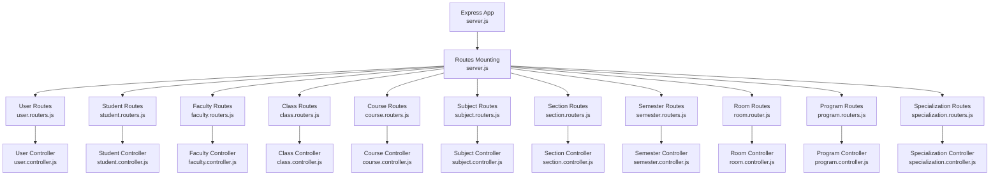
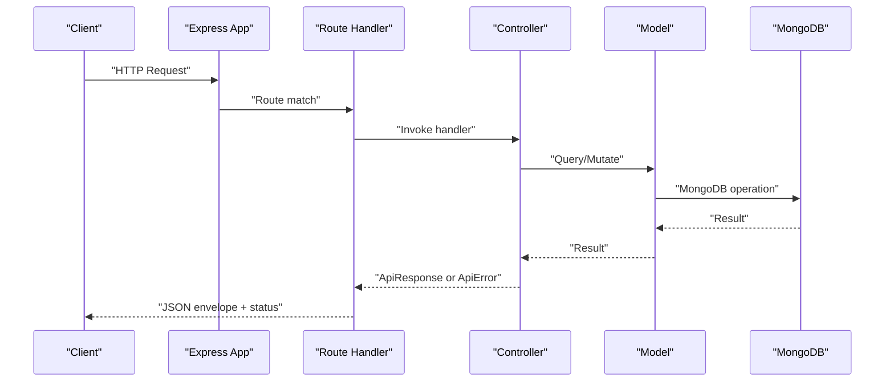
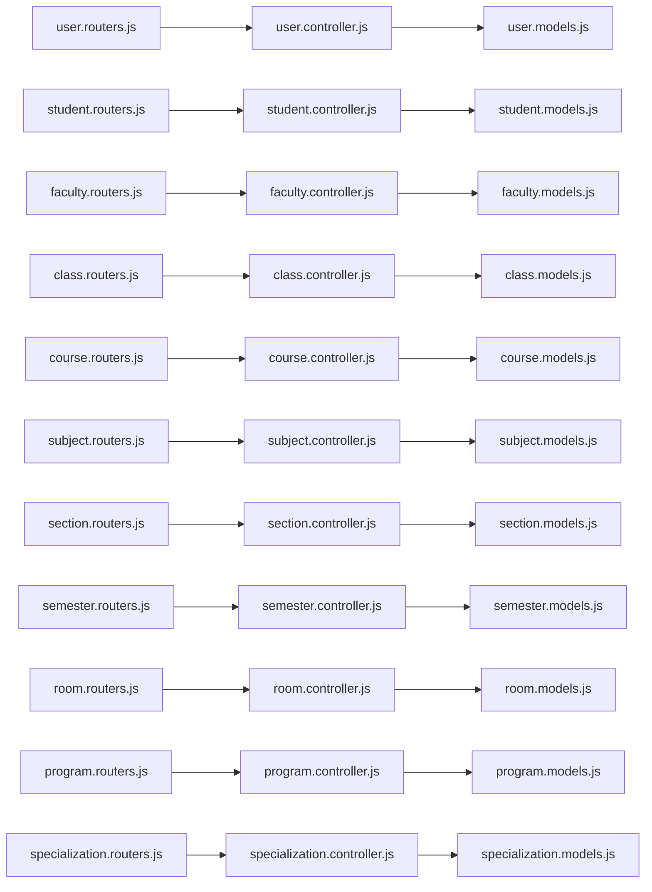

# API Reference

<cite>
**Referenced Files in This Document**
- [index.js](file://Backend/src/index.js)
- [server.js](file://Backend/src/server.js)
- [user.routers.js](file://Backend/src/routes/user.routers.js)
- [user.controller.js](file://Backend/src/controllers/user.controller.js)
- [user.models.js](file://Backend/src/models/user.models.js)
- [role.models.js](file://Backend/src/models/role.models.js)
- [student.routers.js](file://Backend/src/routes/student.routers.js)
- [student.controller.js](file://Backend/src/controllers/student.controller.js)
- [faculty.routers.js](file://Backend/src/routes/faculty.routers.js)
- [faculty.controller.js](file://Backend/src/controllers/faculty.conteoller.js)
- [class.routers.js](file://Backend/src/routes/class.routers.js)
- [class.controller.js](file://Backend/src/controllers/class.controllers.js)
- [course.routers.js](file://Backend/src/routes/course.routers.js)
- [course.controller.js](file://Backend/src/controllers/course.controlles.js)
- [subject.routers.js](file://Backend/src/routes/subject.routers.js)
- [subject.controller.js](file://Backend/src/controllers/subject.controllers.js)
- [section.routers.js](file://Backend/src/routes/section.routers.js)
- [section.controller.js](file://Backend/src/controllers/section.controllers.js)
- [semester.routers.js](file://Backend/src/routes/semester.routers.js)
- [semester.controller.js](file://Backend/src/controllers/semester.controllers.js)
- [room.routers.js](file://Backend/src/routes/room.router.js)
- [room.controller.js](file://Backend/src/controllers/room.controllers.js)
- [program.routers.js](file://Backend/src/routes/program.routers.js)
- [program.controller.js](file://Backend/src/controllers/program.controlles.js)
- [specialization.routers.js](file://Backend/src/routes/specialization.routers.js)
- [specialization.controller.js](file://Backend/src/controllers/specialization.controllers.js)
- [ApiResponse.js](file://Backend/src/utils/ApiResponse.js)
- [ApiError.js](file://Backend/src/utils/ApiError.js)
</cite>

## Table of Contents
1. [Introduction](#introduction)
2. [Project Structure](#project-structure)
3. [Core Components](#core-components)
4. [Architecture Overview](#architecture-overview)
5. [Detailed Component Analysis](#detailed-component-analysis)
6. [Dependency Analysis](#dependency-analysis)
7. [Performance Considerations](#performance-considerations)
8. [Troubleshooting Guide](#troubleshooting-guide)
9. [Conclusion](#conclusion)
10. [Appendices](#appendices)

## Introduction
This document provides comprehensive API documentation for the Timetable Management System backend. It covers:
- Authentication endpoints for user registration and login
- Master data management APIs for users, students, faculties, classes, courses, rooms, sections, semesters, subjects, and specializations
- Request/response schemas, validation rules, error formats, and success structures
- Role-based access control (admin, faculty, student) and practical curl examples

## Project Structure
The backend exposes REST endpoints via Express, mounts route groups under a base path, and delegates requests to controller functions. Responses follow a unified envelope pattern.

**Diagram sources**
- [server.js:25-50](file://Backend/src/server.js#L25-L50)
- [user.routers.js:12-18](file://Backend/src/routes/user.routers.js#L12-L18)
- [student.routers.js](file://Backend/src/routes/student.routers.js)
- [faculty.routers.js](file://Backend/src/routes/faculty.routers.js)
- [class.routers.js](file://Backend/src/routes/class.routers.js)
- [course.routers.js](file://Backend/src/routes/course.routers.js)
- [subject.routers.js](file://Backend/src/routes/subject.routers.js)
- [section.routers.js](file://Backend/src/routes/section.routers.js)
- [semester.routers.js](file://Backend/src/routes/semester.routers.js)
- [room.router.js](file://Backend/src/routes/room.router.js)
- [program.routers.js](file://Backend/src/routes/program.routers.js)
- [specialization.routers.js](file://Backend/src/routes/specialization.routers.js)

**Section sources**
- [server.js:14-53](file://Backend/src/server.js#L14-L53)
- [index.js:5-17](file://Backend/src/index.js#L5-L17)

## Core Components
- Unified response envelope: ApiResponse
- Error envelope: ApiError
- Base URL: /api/v1

Response envelope structure:
- statusCode: number
- data: object|array|null
- message: string
- success: boolean

Error envelope structure:
- statusCode: number
- message: string
- success: boolean
- errors: array
- data: null

**Section sources**
- [ApiResponse.js:1-10](file://Backend/src/utils/ApiResponse.js#L1-L10)
- [ApiError.js:1-21](file://Backend/src/utils/ApiError.js#L1-L21)
- [server.js:40-50](file://Backend/src/server.js#L40-L50)

## Architecture Overview
High-level API flow:
- Client sends HTTP requests to base path /api/v1/<resource>
- Route files map URLs to controller functions
- Controllers validate inputs, query models, and return ApiResponse or throw ApiError
- Responses are JSON envelopes with HTTP status codes

**Diagram sources**
- [server.js:25-50](file://Backend/src/server.js#L25-L50)
- [user.controller.js:8-81](file://Backend/src/controllers/user.controller.js#L8-L81)
- [user.models.js:3-61](file://Backend/src/models/user.models.js#L3-L61)

## Detailed Component Analysis

### Authentication Endpoints
Base path: /api/v1/users

Endpoints:
- POST /api/v1/users
  - Purpose: Bulk register users
  - Auth: Not required
  - Body (array of objects):
    - Required: password, role, student_id OR faculty_id
  - Success: 201 with ApiResponse envelope
  - Errors: 400 (validation), 408 (all records exist), 500 (failed to register)
  - Example curl:
    - curl -X POST http://localhost:4000/api/v1/users -H "Content-Type: application/json" -d '[{"password":"pass","role":"student","student_id":"S001","email":"s@example.com"}]'
  - Success response: ApiResponse with first inserted record
  - Failure response: ApiError envelope

- GET /api/v1/users
  - Purpose: Fetch paginated list of users with joined student/faculty details
  - Auth: Not required
  - Success: 200 with ApiResponse envelope containing array
  - Errors: 404 (no users)
  - Example curl:
    - curl http://localhost:4000/api/v1/users

- GET /api/v1/users/:id
  - Purpose: Fetch user by MongoDB ObjectId
  - Auth: Not required
  - Success: 200 with ApiResponse envelope
  - Errors: 404 (not found)
  - Example curl:
    - curl http://localhost:4000/api/v1/users/507f1f77bcf86cd799439011

- PATCH /api/v1/users/:id
  - Purpose: Update user (password, role, updated_by, isActive)
  - Auth: Not required
  - Success: 200 with ApiResponse envelope
  - Errors: 400 (missing fields), 404 (not found)
  - Example curl:
    - curl -X PATCH http://localhost:4000/api/v1/users/507f1f77bcf86cd799439011 -H "Content-Type: application/json" -d '{"role":"admin","isActive":true}'

- DELETE /api/v1/users/:id
  - Purpose: Delete user by ObjectId
  - Auth: Not required
  - Success: 200 with ApiResponse envelope
  - Errors: 404 (not found)
  - Example curl:
    - curl -X DELETE http://localhost:4000/api/v1/users/507f1f77bcf86cd799439011

- POST /api/v1/users/login
  - Purpose: Authenticate user by user_id and password
  - Auth: Not required
  - Body:
    - Required: user_id, password
  - Success: 200 with ApiResponse envelope containing user profile (role, user_id, user_name, email, isActive)
  - Errors: 400 (missing fields), 401 (invalid credentials)
  - Example curl:
    - curl -X POST http://localhost:4000/api/v1/users/login -H "Content-Type: application/json" -d '{"user_id":"S001","password":"pass"}'

Validation rules:
- Registration: password required; role required and enum ["admin","faculty","student","coordinator","hod"]; either student_id or faculty_id required
- Login: user_id and password required; credentials must match a user record

Response schemas:
- Success: ApiResponse { statusCode, data, message, success }
- Error: ApiError { statusCode, message, success=false, errors, data=null }

Authorization:
- No built-in JWT middleware observed in the analyzed files; endpoints are currently open. Roles are present in the user model for future RBAC integration.

**Section sources**
- [user.routers.js:14-16](file://Backend/src/routes/user.routers.js#L14-L16)
- [user.controller.js:8-81](file://Backend/src/controllers/user.controller.js#L8-L81)
- [user.controller.js:164-236](file://Backend/src/controllers/user.controller.js#L164-L236)
- [user.controller.js:239-278](file://Backend/src/controllers/user.controller.js#L239-L278)
- [user.controller.js:266-278](file://Backend/src/controllers/user.controller.js#L266-L278)
- [user.controller.js:281-354](file://Backend/src/controllers/user.controller.js#L281-L354)
- [user.models.js:19-28](file://Backend/src/models/user.models.js#L19-L28)

### Users (Master Data)
Base path: /api/v1/users

Endpoints:
- POST /api/v1/users
  - Bulk user registration
  - Body: array of user objects with password, role, student_id OR faculty_id
  - Success: 201
  - Errors: 400, 408, 500

- GET /api/v1/users
  - List users with joined details
  - Success: 200

- GET /api/v1/users/:id
  - Fetch by ObjectId
  - Success: 200

- PATCH /api/v1/users/:id
  - Update password, role, updated_by, isActive
  - Success: 200

- DELETE /api/v1/users/:id
  - Delete by ObjectId
  - Success: 200

- POST /api/v1/users/login
  - Authenticate by user_id and password
  - Success: 200

Authorization:
- No JWT middleware observed; endpoints are open. Role presence indicates future RBAC.

**Section sources**
- [user.routers.js:14-16](file://Backend/src/routes/user.routers.js#L14-L16)
- [user.controller.js:8-81](file://Backend/src/controllers/user.controller.js#L8-L81)
- [user.controller.js:84-161](file://Backend/src/controllers/user.controller.js#L84-L161)
- [user.controller.js:164-236](file://Backend/src/controllers/user.controller.js#L164-L236)
- [user.controller.js:239-278](file://Backend/src/controllers/user.controller.js#L239-L278)
- [user.controller.js:266-278](file://Backend/src/controllers/user.controller.js#L266-L278)
- [user.controller.js:281-354](file://Backend/src/controllers/user.controller.js#L281-L354)

### Students
Base path: /api/v1/students

Endpoints:
- POST /api/v1/students
  - Bulk student registration
  - Body: array of student objects with required fields (student_id, student_name, email, class, batch, date_of_birth, specialization)
  - Success: 201
  - Errors: 400 (validation), 408 (all exist), 500 (failed to register)

- GET /api/v1/students
  - List all students
  - Success: 200

- GET /api/v1/students/:id
  - Fetch by ObjectId
  - Success: 200

- PATCH /api/v1/students/:id
  - Update student fields
  - Success: 200

- DELETE /api/v1/students/:id
  - Delete by ObjectId
  - Success: 200

Authorization:
- Open endpoints; no JWT middleware observed.

**Section sources**
- [student.routers.js](file://Backend/src/routes/student.routers.js)
- [student.controller.js:7-91](file://Backend/src/controllers/student.controller.js#L7-L91)
- [student.controller.js:94-105](file://Backend/src/controllers/student.controller.js#L94-L105)
- [student.controller.js:108-128](file://Backend/src/controllers/student.controller.js#L108-L128)
- [student.controller.js:131-189](file://Backend/src/controllers/student.controller.js#L131-L189)
- [student.controller.js:192-208](file://Backend/src/controllers/student.controller.js#L192-L208)

### Faculties
Base path: /api/v1/faculties

Endpoints:
- POST /api/v1/faculties
  - Bulk faculty registration
  - Body: array of faculty objects with required fields (faculty_id, faculty_name, email, phone, specialization, higher_qualification, years_of_Experience, gender, date_of_joining, date_of_birth, address)
  - Success: 201
  - Errors: 400, 408, 500

- GET /api/v1/faculties
  - List all faculties
  - Success: 200

- GET /api/v1/faculties/:id
  - Fetch by ObjectId
  - Success: 200

- PATCH /api/v1/faculties/:id
  - Update faculty fields
  - Success: 200

- DELETE /api/v1/faculties/:id
  - Delete by ObjectId
  - Success: 200

Authorization:
- Open endpoints; no JWT middleware observed.

**Section sources**
- [faculty.routers.js](file://Backend/src/routes/faculty.routers.js)
- [faculty.controller.js:7-103](file://Backend/src/controllers/faculty.conteoller.js#L7-L103)
- [faculty.controller.js:106-118](file://Backend/src/controllers/faculty.conteoller.js#L106-L118)
- [faculty.controller.js:121-141](file://Backend/src/controllers/faculty.conteoller.js#L121-L141)
- [faculty.controller.js:144-207](file://Backend/src/controllers/faculty.conteoller.js#L144-L207)
- [faculty.controller.js:210-228](file://Backend/src/controllers/faculty.conteoller.js#L210-L228)

### Classes
Base path: /api/v1/classes

Endpoints:
- POST /api/v1/classes
  - Bulk class registration
  - Body: array of class objects with required fields (class_id, year)
  - Success: 201
  - Errors: 400, 408

- GET /api/v1/classes
  - List classes with populated program and course
  - Success: 200

- GET /api/v1/classes/:id
  - Fetch class by ObjectId with program/course
  - Success: 200

- GET /api/v1/classes/class_id/:class_id
  - Fetch class by class_id
  - Success: 200

- PATCH /api/v1/classes/:id
  - Update class fields
  - Success: 200

- DELETE /api/v1/classes/:id
  - Delete class by ObjectId
  - Success: 200

Authorization:
- Open endpoints; no JWT middleware observed.

**Section sources**
- [class.routers.js](file://Backend/src/routes/class.routers.js)
- [class.controller.js:6-37](file://Backend/src/controllers/class.controllers.js#L6-L37)
- [class.controller.js:40-79](file://Backend/src/controllers/class.controllers.js#L40-L79)
- [class.controller.js:82-118](file://Backend/src/controllers/class.controllers.js#L82-L118)
- [class.controller.js:121-141](file://Backend/src/controllers/class.controllers.js#L121-L141)
- [class.controller.js:144-163](file://Backend/src/controllers/class.controllers.js#L144-L163)
- [class.controller.js:167-178](file://Backend/src/controllers/class.controllers.js#L167-L178)

### Courses
Base path: /api/v1/courses

Endpoints:
- POST /api/v1/courses
  - Bulk course registration
  - Body: array of course objects with required fields (course_id, course_name, course_duration)
  - Success: 201
  - Errors: 400, 408

- GET /api/v1/courses
  - List all courses
  - Success: 200

- GET /api/v1/courses/:id
  - Fetch course by ObjectId
  - Success: 200

- GET /api/v1/courses/course_id/:course_id
  - Fetch course by course_id (uppercased)
  - Success: 200

- PATCH /api/v1/courses/:id
  - Update course fields
  - Success: 200

- DELETE /api/v1/courses/:id
  - Delete course by ObjectId
  - Success: 200

Authorization:
- Open endpoints; no JWT middleware observed.

**Section sources**
- [course.routers.js](file://Backend/src/routes/course.routers.js)
- [course.controller.js:5-40](file://Backend/src/controllers/course.controlles.js#L5-L40)
- [course.controller.js:43-53](file://Backend/src/controllers/course.controlles.js#L43-L53)
- [course.controller.js:56-72](file://Backend/src/controllers/course.controlles.js#L56-L72)
- [course.controller.js:75-91](file://Backend/src/controllers/course.controlles.js#L75-L91)
- [course.controller.js:94-115](file://Backend/src/controllers/course.controlles.js#L94-L115)
- [course.controller.js:118-134](file://Backend/src/controllers/course.controlles.js#L118-L134)

### Subjects
Base path: /api/v1/subjects

Endpoints:
- POST /api/v1/subjects
  - Bulk subject creation
  - Body: array of subject objects with required fields (subject_id, subject_name, credit)
  - Success: 201
  - Errors: 400

- GET /api/v1/subjects
  - List all subjects
  - Success: 200

- GET /api/v1/subjects/:id
  - Fetch subject by ObjectId
  - Success: 200

- GET /api/v1/subjects/subject_id/:subject_id
  - Fetch subject by subject_id
  - Success: 200

- PATCH /api/v1/subjects/:id
  - Update subject fields
  - Success: 200

- DELETE /api/v1/subjects/:id
  - Delete subject by ObjectId
  - Success: 200

Authorization:
- Open endpoints; no JWT middleware observed.

**Section sources**
- [subject.routers.js](file://Backend/src/routes/subject.routers.js)
- [subject.controller.js:6-41](file://Backend/src/controllers/subject.controllers.js#L6-L41)
- [subject.controller.js:44-55](file://Backend/src/controllers/subject.controllers.js#L44-L55)
- [subject.controller.js:58-72](file://Backend/src/controllers/subject.controllers.js#L58-L72)
- [subject.controller.js:75-88](file://Backend/src/controllers/subject.controllers.js#L75-L88)
- [subject.controller.js:108-128](file://Backend/src/controllers/subject.controllers.js#L108-L128)
- [subject.controller.js:91-105](file://Backend/src/controllers/subject.controllers.js#L91-L105)

### Sections
Base path: /api/v1/sections

Endpoints:
- POST /api/v1/sections
  - Bulk section creation
  - Body: array of section objects with required fields (class_id, section_name)
  - Success: 201
  - Errors: 400

- GET /api/v1/sections
  - List all sections with populated class_id
  - Success: 200

- GET /api/v1/sections/:id
  - Fetch section by ObjectId with populated class_id
  - Success: 200

- PATCH /api/v1/sections/:id
  - Update section fields (class_id, section_name, discraption)
  - Success: 200

- DELETE /api/v1/sections/:id
  - Delete section by ObjectId
  - Success: 200

Authorization:
- Open endpoints; no JWT middleware observed.

**Section sources**
- [section.routers.js](file://Backend/src/routes/section.routers.js)
- [section.controller.js:6-47](file://Backend/src/controllers/section.controllers.js#L6-L47)
- [section.controller.js:50-62](file://Backend/src/controllers/section.controllers.js#L50-L62)
- [section.controller.js:65-81](file://Backend/src/controllers/section.controllers.js#L65-L81)
- [section.controller.js:84-115](file://Backend/src/controllers/section.controllers.js#L84-L115)
- [section.controller.js:118-136](file://Backend/src/controllers/section.controllers.js#L118-L136)

### Semesters
Base path: /api/v1/semesters

Endpoints:
- POST /api/v1/semesters
  - Bulk semester creation
  - Body: array of semester objects with required fields (semester_name)
  - Success: 201
  - Errors: 400

- GET /api/v1/semesters
  - List all semesters
  - Success: 200

- PATCH /api/v1/semesters/:id
  - Update semester fields (semester_name, isEven)
  - Success: 200

- DELETE /api/v1/semesters/:id
  - Delete semester by ObjectId
  - Success: 200

Authorization:
- Open endpoints; no JWT middleware observed.

**Section sources**
- [semester.routers.js](file://Backend/src/routes/semester.routers.js)
- [semester.controller.js:6-40](file://Backend/src/controllers/semester.controllers.js#L6-L40)
- [semester.controller.js:43-53](file://Backend/src/controllers/semester.controllers.js#L43-L53)
- [semester.controller.js:56-80](file://Backend/src/controllers/semester.controllers.js#L56-L80)
- [semester.controller.js:83-99](file://Backend/src/controllers/semester.controllers.js#L83-L99)

### Rooms
Base path: /api/v1/rooms

Endpoints:
- POST /api/v1/rooms
  - Bulk room creation
  - Body: array of room objects with required fields (room_no, floor_no, wings)
  - Success: 201
  - Errors: 400

- GET /api/v1/rooms
  - List all rooms
  - Success: 200

- GET /api/v1/rooms/:id
  - Fetch room by ObjectId
  - Success: 200

- PATCH /api/v1/rooms/:id
  - Update room fields (room_no, floor_no, wings)
  - Success: 200

- DELETE /api/v1/rooms/:id
  - Delete room by ObjectId
  - Success: 200

Authorization:
- Open endpoints; no JWT middleware observed.

**Section sources**
- [room.routers.js](file://Backend/src/routes/room.router.js)
- [room.controller.js:7-46](file://Backend/src/controllers/room.controllers.js#L7-L46)
- [room.controller.js:49-59](file://Backend/src/controllers/room.controllers.js#L49-L59)
- [room.controller.js:62-78](file://Backend/src/controllers/room.controllers.js#L62-L78)
- [room.controller.js:81-113](file://Backend/src/controllers/room.controllers.js#L81-L113)
- [room.controller.js:116-132](file://Backend/src/controllers/room.controllers.js#L116-L132)

### Programs
Base path: /api/v1/programmes

Endpoints:
- POST /api/v1/programmes
  - Bulk program creation
  - Body: array of program objects with required fields (program_id, program_name)
  - Success: 201
  - Errors: 400, 408

- GET /api/v1/programmes
  - List all programs
  - Success: 200

- GET /api/v1/programmes/:id
  - Fetch program by ObjectId
  - Success: 200

- GET /api/v1/programmes/program_id/:program_id
  - Fetch program by program_id
  - Success: 200

- PATCH /api/v1/programmes/:id
  - Update program fields
  - Success: 200

- DELETE /api/v1/programmes/:id
  - Delete program by ObjectId
  - Success: 200

Authorization:
- Open endpoints; no JWT middleware observed.

**Section sources**
- [program.routers.js](file://Backend/src/routes/program.routers.js)
- [program.controller.js:5-45](file://Backend/src/controllers/program.controlles.js#L5-L45)
- [program.controller.js:48-58](file://Backend/src/controllers/program.controlles.js#L48-L58)
- [program.controller.js:61-75](file://Backend/src/controllers/program.controlles.js#L61-L75)
- [program.controller.js:78-88](file://Backend/src/controllers/program.controlles.js#L78-L88)
- [program.controller.js:91-113](file://Backend/src/controllers/program.controlles.js#L91-L113)
- [program.controller.js:116-130](file://Backend/src/controllers/program.controlles.js#L116-L130)

### Specializations
Base path: /api/v1/specializations

Endpoints:
- POST /api/v1/specializations
  - Bulk specialization creation
  - Body: array of specialization objects with required fields (specilization_name, program_id, course_id)
  - Success: 201
  - Errors: 400

- GET /api/v1/specializations
  - List all specializations with populated program_id and course_id
  - Success: 200

- GET /api/v1/specializations/:id
  - Fetch specialization by ObjectId with populated relations
  - Success: 200

- PATCH /api/v1/specializations/:id
  - Update specialization fields
  - Success: 200

- DELETE /api/v1/specializations/:id
  - Delete specialization by ObjectId
  - Success: 200

Authorization:
- Open endpoints; no JWT middleware observed.

**Section sources**
- [specialization.routers.js](file://Backend/src/routes/specialization.routers.js)
- [specialization.controller.js:6-41](file://Backend/src/controllers/specialization.controllers.js#L6-L41)
- [specialization.controller.js:44-55](file://Backend/src/controllers/specialization.controllers.js#L44-L55)
- [specialization.controller.js:58-69](file://Backend/src/controllers/specialization.controllers.js#L58-L69)
- [specialization.controller.js:72-101](file://Backend/src/controllers/specialization.controllers.js#L72-L101)
- [specialization.controller.js:104-120](file://Backend/src/controllers/specialization.controllers.js#L104-L120)

## Dependency Analysis
- Route files depend on controller functions exported by controller modules
- Controllers depend on models for database operations
- Models define schemas and enums (e.g., user roles)
- Unified response/error utilities are used across controllers

**Diagram sources**
- [user.routers.js:12-18](file://Backend/src/routes/user.routers.js#L12-L18)
- [user.controller.js:1](file://Backend/src/controllers/user.controller.js#L1)
- [user.models.js:1](file://Backend/src/models/user.models.js#L1)
- [student.routers.js](file://Backend/src/routes/student.routers.js)
- [student.controller.js:1](file://Backend/src/controllers/student.controller.js#L1)
- [faculty.routers.js](file://Backend/src/routes/faculty.routers.js)
- [faculty.controller.js:1](file://Backend/src/controllers/faculty.conteoller.js#L1)
- [class.routers.js](file://Backend/src/routes/class.routers.js)
- [class.controller.js:1](file://Backend/src/controllers/class.controllers.js#L1)
- [course.routers.js](file://Backend/src/routes/course.routers.js)
- [course.controller.js:1](file://Backend/src/controllers/course.controlles.js#L1)
- [subject.routers.js](file://Backend/src/routes/subject.routers.js)
- [subject.controller.js:1](file://Backend/src/controllers/subject.controllers.js#L1)
- [section.routers.js](file://Backend/src/routes/section.routers.js)
- [section.controller.js:1](file://Backend/src/controllers/section.controllers.js#L1)
- [semester.routers.js](file://Backend/src/routes/semester.routers.js)
- [semester.controller.js:1](file://Backend/src/controllers/semester.controllers.js#L1)
- [room.routers.js](file://Backend/src/routes/room.router.js)
- [room.controller.js:1](file://Backend/src/controllers/room.controllers.js#L1)
- [program.routers.js](file://Backend/src/routes/program.routers.js)
- [program.controller.js:1](file://Backend/src/controllers/program.controlles.js#L1)
- [specialization.routers.js](file://Backend/src/routes/specialization.routers.js)
- [specialization.controller.js:1](file://Backend/src/controllers/specialization.controllers.js#L1)

**Section sources**
- [user.routers.js:12-18](file://Backend/src/routes/user.routers.js#L12-L18)
- [user.controller.js:1](file://Backend/src/controllers/user.controller.js#L1)
- [user.models.js:1](file://Backend/src/models/user.models.js#L1)

## Performance Considerations
- Bulk insertions use insertMany; ensure arrays are reasonably sized to avoid timeouts
- Aggregation pipelines (e.g., user lookup joins) can be expensive; filter early and use projections
- Populate operations increase payload size; use only when necessary
- Consider pagination for large collections (currently not implemented)

## Troubleshooting Guide
Common error scenarios and resolutions:
- Validation failures (400): Ensure required fields are present per endpoint
- Duplicate entries (408/400): Remove duplicates or update existing records
- Not found (404): Verify resource ObjectId or identifier correctness
- Internal errors (500): Inspect server logs and database connectivity

Error response format:
- ApiError envelope with statusCode, message, success=false, errors, data=null

Success response format:
- ApiResponse envelope with statusCode, data, message, success=true

**Section sources**
- [ApiError.js:1-21](file://Backend/src/utils/ApiError.js#L1-L21)
- [ApiResponse.js:1-10](file://Backend/src/utils/ApiResponse.js#L1-L10)

## Conclusion
This API provides comprehensive CRUD capabilities for master data entities and supports bulk operations for scalable data ingestion. Authentication endpoints are available but currently lack JWT middleware. Role-based access control can be integrated by adding middleware to protect endpoints and enforcing permission checks based on user roles.

## Appendices

### Role-Based Access Control (RBAC) Guidance
- Current user roles: admin, faculty, student, coordinator, hod
- Integrate middleware to attach user context to requests
- Enforce permissions per endpoint (e.g., admin-only deletions, faculty-only updates for own records)
- Extend models and routes to reflect RBAC decisions

**Section sources**
- [user.models.js:19-28](file://Backend/src/models/user.models.js#L19-L28)

### Request/Response Envelope Examples
- Success:
  - Status: 2xx
  - Body: { "statusCode": 201, "data": [...], "message": "success", "success": true }
- Error:
  - Status: 4xx/5xx
  - Body: { "statusCode": 400, "message": "error message", "success": false, "errors": [], "data": null }

**Section sources**
- [ApiResponse.js:1-10](file://Backend/src/utils/ApiResponse.js#L1-L10)
- [ApiError.js:1-21](file://Backend/src/utils/ApiError.js#L1-L21)