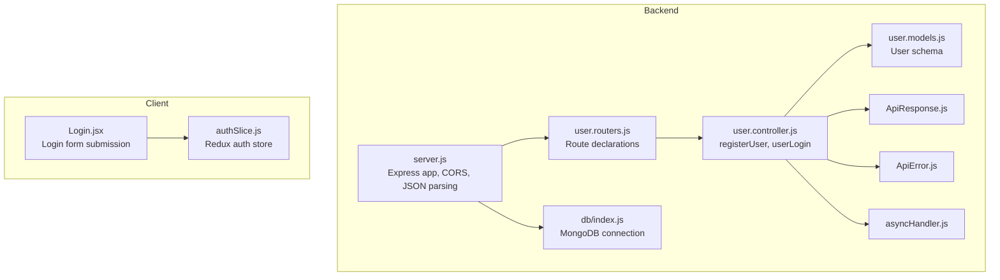
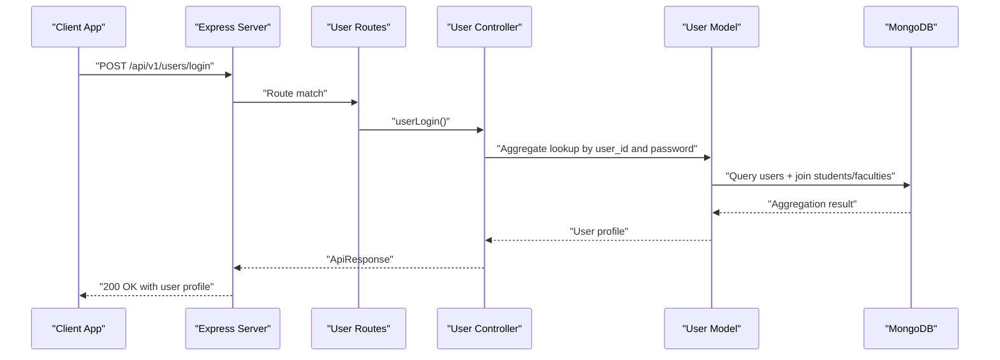
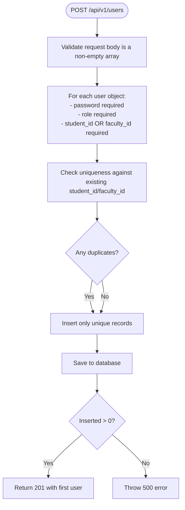
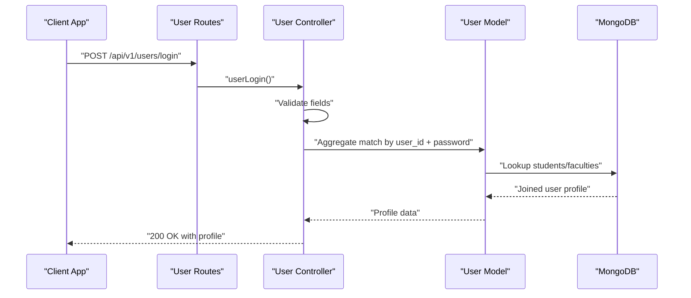
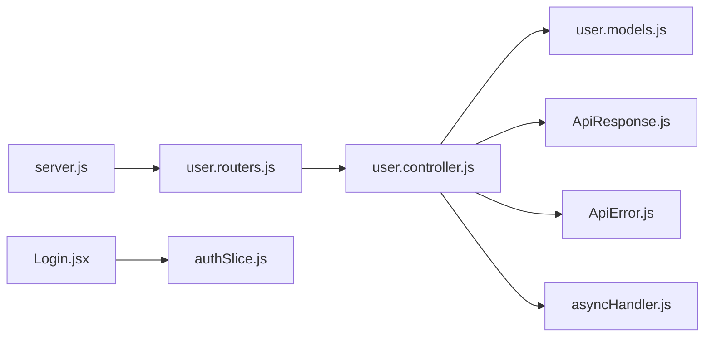

# Authentication Endpoints

<cite>
**Referenced Files in This Document**
- [user.controller.js](file://Backend/src/controllers/user.controller.js)
- [user.routers.js](file://Backend/src/routes/user.routers.js)
- [user.models.js](file://Backend/src/models/user.models.js)
- [server.js](file://Backend/src/server.js)
- [index.js](file://Backend/src/index.js)
- [ApiError.js](file://Backend/src/utils/ApiError.js)
- [ApiResponse.js](file://Backend/src/utils/ApiResponse.js)
- [asyncHandler.js](file://Backend/src/utils/asyncHandler.js)
- [Login.jsx](file://Client/src/pages/Login.jsx)
- [authSlice.js](file://Client/src/store/auth/authSlice.js)
- [db/index.js](file://Backend/src/db/index.js)
</cite>

## Table of Contents
1. [Introduction](#introduction)
2. [Project Structure](#project-structure)
3. [Core Components](#core-components)
4. [Architecture Overview](#architecture-overview)
5. [Detailed Component Analysis](#detailed-component-analysis)
6. [Dependency Analysis](#dependency-analysis)
7. [Performance Considerations](#performance-considerations)
8. [Troubleshooting Guide](#troubleshooting-guide)
9. [Conclusion](#conclusion)
10. [Appendices](#appendices)

## Introduction
This document provides comprehensive API documentation for the authentication endpoints in the Timetable Management System. It focuses on:
- User registration endpoint for creating new accounts (admin, faculty, and student roles)
- User login endpoint with response payload structure
- Request/response schemas, validation rules, and error handling
- Authentication middleware requirements and token-based access patterns
- Practical examples using curl commands for successful registration and login workflows

## Project Structure
The authentication endpoints are implemented in the backend under the Backend/src directory. The user controller exposes registration and login endpoints, which are mounted under /api/v1/users. The server initializes Express, CORS, JSON parsing, and route bindings. The frontend client handles login requests and stores user session data locally.



**Diagram sources**
- [server.js:14-54](file://Backend/src/server.js#L14-L54)
- [user.routers.js:12-19](file://Backend/src/routes/user.routers.js#L12-L19)
- [user.controller.js:8-81](file://Backend/src/controllers/user.controller.js#L8-L81)
- [user.models.js:3-61](file://Backend/src/models/user.models.js#L3-L61)
- [ApiResponse.js:1-10](file://Backend/src/utils/ApiResponse.js#L1-L10)
- [ApiError.js:1-21](file://Backend/src/utils/ApiError.js#L1-L21)
- [asyncHandler.js:1-4](file://Backend/src/utils/asyncHandler.js#L1-L4)
- [db/index.js:4-19](file://Backend/src/db/index.js#L4-L19)
- [Login.jsx:15-45](file://Client/src/pages/Login.jsx#L15-L45)
- [authSlice.js:10-32](file://Client/src/store/auth/authSlice.js#L10-L32)

**Section sources**
- [server.js:14-54](file://Backend/src/server.js#L14-L54)
- [user.routers.js:12-19](file://Backend/src/routes/user.routers.js#L12-L19)
- [user.controller.js:8-81](file://Backend/src/controllers/user.controller.js#L8-L81)
- [user.models.js:3-61](file://Backend/src/models/user.models.js#L3-L61)
- [ApiResponse.js:1-10](file://Backend/src/utils/ApiResponse.js#L1-L10)
- [ApiError.js:1-21](file://Backend/src/utils/ApiError.js#L1-L21)
- [asyncHandler.js:1-4](file://Backend/src/utils/asyncHandler.js#L1-L4)
- [db/index.js:4-19](file://Backend/src/db/index.js#L4-L19)
- [Login.jsx:15-45](file://Client/src/pages/Login.jsx#L15-L45)
- [authSlice.js:10-32](file://Client/src/store/auth/authSlice.js#L10-L32)

## Core Components
- Registration Endpoint: POST /api/v1/users
  - Accepts an array of user objects with required fields: password, role, and either student_id or faculty_id
  - Validates uniqueness against existing student and faculty identifiers
  - Returns the first inserted user record with a success response
- Login Endpoint: POST /api/v1/users/login
  - Accepts user_id and password
  - Performs aggregation lookup to join with students or faculties to build user profile
  - Returns user profile with role, isActive flag, user_id, user_name, and email
- Response Wrapper: ApiResponse
  - Standardizes success responses with statusCode, data, and message
- Error Wrapper: ApiError
  - Standardizes error responses with statusCode, message, errors, and data
- Async Handler: asyncHandler
  - Wraps route handlers to catch asynchronous errors and forward to Express error middleware

**Section sources**
- [user.controller.js:8-81](file://Backend/src/controllers/user.controller.js#L8-L81)
- [user.controller.js:280-354](file://Backend/src/controllers/user.controller.js#L280-L354)
- [user.routers.js:14-16](file://Backend/src/routes/user.routers.js#L14-L16)
- [ApiResponse.js:1-10](file://Backend/src/utils/ApiResponse.js#L1-L10)
- [ApiError.js:1-21](file://Backend/src/utils/ApiError.js#L1-L21)
- [asyncHandler.js:1-4](file://Backend/src/utils/asyncHandler.js#L1-L4)

## Architecture Overview
The authentication flow involves the client sending login credentials to the backend, which validates them and returns a user profile. The frontend stores the user data locally and navigates based on role.



**Diagram sources**
- [server.js:26-50](file://Backend/src/server.js#L26-L50)
- [user.routers.js:16](file://Backend/src/routes/user.routers.js#L16)
- [user.controller.js:280-354](file://Backend/src/controllers/user.controller.js#L280-L354)
- [user.models.js:3-61](file://Backend/src/models/user.models.js#L3-L61)

## Detailed Component Analysis

### User Registration Endpoint
- Endpoint: POST /api/v1/users
- Purpose: Create one or more user accounts with role and identifier
- Request Body: Array of user objects
  - Required fields per object:
    - password: string
    - role: enum ["admin", "faculty", "student", "coordinator", "hod"]
    - student_id OR faculty_id (exactly one must be present)
- Validation:
  - Rejects empty arrays or missing password/role
  - Ensures uniqueness against existing student_id and faculty_id
  - Throws specific errors for invalid or duplicate entries
- Response:
  - On success: 201 Created with ApiResponse containing the first inserted user
  - On failure: Appropriate HTTP status via ApiError wrapper



**Diagram sources**
- [user.controller.js:8-81](file://Backend/src/controllers/user.controller.js#L8-L81)

**Section sources**
- [user.controller.js:8-81](file://Backend/src/controllers/user.controller.js#L8-L81)
- [user.models.js:19-38](file://Backend/src/models/user.models.js#L19-L38)

### User Login Endpoint
- Endpoint: POST /api/v1/users/login
- Purpose: Authenticate a user and return profile data
- Request Body:
  - user_id: string (student_id or faculty_id)
  - password: string
- Processing:
  - Validates presence of both fields
  - Aggregates user data with students or faculties collection to build profile
  - Projects role, isActive, user_id, user_name, and email
- Response:
  - On success: 200 OK with ApiResponse containing user profile
  - On failure: 401 Unauthorized via ApiError for invalid credentials



**Diagram sources**
- [user.routers.js:16](file://Backend/src/routes/user.routers.js#L16)
- [user.controller.js:280-354](file://Backend/src/controllers/user.controller.js#L280-L354)
- [user.models.js:3-61](file://Backend/src/models/user.models.js#L3-L61)

**Section sources**
- [user.controller.js:280-354](file://Backend/src/controllers/user.controller.js#L280-L354)
- [user.routers.js:16](file://Backend/src/routes/user.routers.js#L16)

### Request and Response Schemas

#### Registration Request (POST /api/v1/users)
- Content-Type: application/json
- Body: array of user objects
  - password: string (required)
  - role: enum ["admin","faculty","student","coordinator","hod"] (required)
  - student_id: string (required if faculty_id is not provided)
  - faculty_id: string (required if student_id is not provided)

#### Registration Response (POST /api/v1/users)
- Success (201): ApiResponse with first inserted user object
- Failure (400): ApiError for invalid input
- Failure (408): ApiError when all provided users already exist
- Failure (500): ApiError for internal server error

#### Login Request (POST /api/v1/users/login)
- Content-Type: application/json
- Body:
  - user_id: string (student_id or faculty_id)
  - password: string

#### Login Response (POST /api/v1/users/login)
- Success (200): ApiResponse with user profile
  - role: enum ["admin","faculty","student","coordinator","hod"]
  - isActive: boolean
  - user_id: string (student_id or faculty_id)
  - user_name: string (from joined student/faculty)
  - email: string (from joined student/faculty)
- Failure (400): ApiError for missing fields
- Failure (401): ApiError for invalid credentials

**Section sources**
- [user.controller.js:8-81](file://Backend/src/controllers/user.controller.js#L8-L81)
- [user.controller.js:280-354](file://Backend/src/controllers/user.controller.js#L280-L354)
- [user.models.js:19-38](file://Backend/src/models/user.models.js#L19-L38)
- [ApiResponse.js:1-10](file://Backend/src/utils/ApiResponse.js#L1-L10)
- [ApiError.js:1-21](file://Backend/src/utils/ApiError.js#L1-L21)

### Authentication Middleware and Token-Based Access
- Current Implementation: No JWT middleware is implemented in the backend. Authentication relies on returning user profiles upon successful login.
- Token-Based Access Pattern: Not applicable in the current codebase. Clients store user data locally after login and navigate based on role.
- Recommendations:
  - Introduce JWT middleware to generate tokens on login
  - Enforce bearer token validation for protected routes
  - Store refresh tokens securely and implement token expiration/renewal

**Section sources**
- [user.controller.js:280-354](file://Backend/src/controllers/user.controller.js#L280-L354)
- [Login.jsx:15-45](file://Client/src/pages/Login.jsx#L15-L45)
- [authSlice.js:10-32](file://Client/src/store/auth/authSlice.js#L10-L32)

### Practical Examples

#### Example 1: Register Multiple Users
- Endpoint: POST http://localhost:4000/api/v1/users
- Headers: Content-Type: application/json
- Body:
  - Array of user objects with required fields
- Expected Outcome: 201 Created with first inserted user

curl command:
```bash
curl -X POST http://localhost:4000/api/v1/users \
  -H "Content-Type: application/json" \
  -d '[{"password":"securePass1","role":"student","student_id":"S001"},{"password":"securePass2","role":"faculty","faculty_id":"F001"}]'
```

#### Example 2: Login Workflow
- Endpoint: POST http://localhost:4000/api/v1/users/login
- Headers: Content-Type: application/json
- Body:
  - user_id: student_id or faculty_id
  - password: string
- Expected Outcome: 200 OK with user profile

curl command:
```bash
curl -X POST http://localhost:4000/api/v1/users/login \
  -H "Content-Type: application/json" \
  -d '{"user_id":"S001","password":"securePass1"}'
```

Notes:
- Replace localhost:4000 with your server address
- Ensure the database is running and the user exists with the given credentials

**Section sources**
- [server.js:52-54](file://Backend/src/server.js#L52-L54)
- [index.js:6-17](file://Backend/src/index.js#L6-L17)
- [db/index.js:4-19](file://Backend/src/db/index.js#L4-L19)

## Dependency Analysis
The authentication endpoints depend on:
- Express server configuration for routing and middleware
- User controller for business logic
- User model for schema validation and aggregation
- Utility wrappers for standardized responses and error handling
- Frontend client for login form submission and local storage



**Diagram sources**
- [server.js:26-50](file://Backend/src/server.js#L26-L50)
- [user.routers.js:12-19](file://Backend/src/routes/user.routers.js#L12-L19)
- [user.controller.js:8-81](file://Backend/src/controllers/user.controller.js#L8-L81)
- [user.models.js:3-61](file://Backend/src/models/user.models.js#L3-L61)
- [ApiResponse.js:1-10](file://Backend/src/utils/ApiResponse.js#L1-L10)
- [ApiError.js:1-21](file://Backend/src/utils/ApiError.js#L1-L21)
- [asyncHandler.js:1-4](file://Backend/src/utils/asyncHandler.js#L1-L4)
- [Login.jsx:15-45](file://Client/src/pages/Login.jsx#L15-L45)
- [authSlice.js:10-32](file://Client/src/store/auth/authSlice.js#L10-L32)

**Section sources**
- [server.js:26-50](file://Backend/src/server.js#L26-L50)
- [user.routers.js:12-19](file://Backend/src/routes/user.routers.js#L12-L19)
- [user.controller.js:8-81](file://Backend/src/controllers/user.controller.js#L8-L81)
- [user.models.js:3-61](file://Backend/src/models/user.models.js#L3-L61)
- [ApiResponse.js:1-10](file://Backend/src/utils/ApiResponse.js#L1-L10)
- [ApiError.js:1-21](file://Backend/src/utils/ApiError.js#L1-L21)
- [asyncHandler.js:1-4](file://Backend/src/utils/asyncHandler.js#L1-L4)
- [Login.jsx:15-45](file://Client/src/pages/Login.jsx#L15-L45)
- [authSlice.js:10-32](file://Client/src/store/auth/authSlice.js#L10-L32)

## Performance Considerations
- Aggregation Complexity: The login endpoint performs joins with students and faculties collections. Ensure proper indexing on student_id and faculty_id fields to optimize query performance.
- Batch Registration: The registration endpoint accepts arrays of users. For large batches, consider chunking inserts to avoid timeouts and memory pressure.
- Response Projection: The login response excludes sensitive fields (e.g., password). Keep projections minimal to reduce payload size.

## Troubleshooting Guide
Common Issues and Resolutions:
- Invalid Credentials (401):
  - Cause: Incorrect user_id or password
  - Resolution: Verify user_id matches existing student_id or faculty_id and ensure password matches
- Missing Fields (400):
  - Cause: Missing user_id or password in login request
  - Resolution: Include both fields in the request body
- Duplicate Users (408):
  - Cause: All provided users already exist in the database
  - Resolution: Modify the request to include only unique identifiers
- Internal Server Error (500):
  - Cause: Failed to register users during batch insert
  - Resolution: Check database connectivity and retry the request

**Section sources**
- [user.controller.js:280-354](file://Backend/src/controllers/user.controller.js#L280-L354)
- [user.controller.js:8-81](file://Backend/src/controllers/user.controller.js#L8-L81)
- [ApiError.js:1-21](file://Backend/src/utils/ApiError.js#L1-L21)

## Conclusion
The Timetable Management System provides essential authentication endpoints for user registration and login. While the current implementation does not enforce JWT-based token validation, it offers robust request validation, aggregation-driven profile retrieval, and standardized response/error handling. For production environments, integrating JWT middleware and enforcing bearer token validation is recommended to secure protected routes effectively.

## Appendices

### API Definitions

#### POST /api/v1/users
- Description: Register one or more users
- Request Body: Array of user objects
  - password: string
  - role: enum ["admin","faculty","student","coordinator","hod"]
  - student_id: string (if faculty_id is not provided)
  - faculty_id: string (if student_id is not provided)
- Responses:
  - 201: First inserted user object
  - 400: Validation error
  - 408: All users already exist
  - 500: Internal server error

#### POST /api/v1/users/login
- Description: Authenticate user and return profile
- Request Body:
  - user_id: string
  - password: string
- Responses:
  - 200: User profile with role, isActive, user_id, user_name, email
  - 400: Missing fields
  - 401: Invalid credentials

### Frontend Integration Notes
- The client submits login credentials to /api/v1/users/login
- On success, the client navigates based on role and persists user data in local storage
- Redux slice manages authentication state and user data

**Section sources**
- [user.routers.js:14-16](file://Backend/src/routes/user.routers.js#L14-L16)
- [user.controller.js:8-81](file://Backend/src/controllers/user.controller.js#L8-L81)
- [user.controller.js:280-354](file://Backend/src/controllers/user.controller.js#L280-L354)
- [Login.jsx:15-45](file://Client/src/pages/Login.jsx#L15-L45)
- [authSlice.js:10-32](file://Client/src/store/auth/authSlice.js#L10-L32)