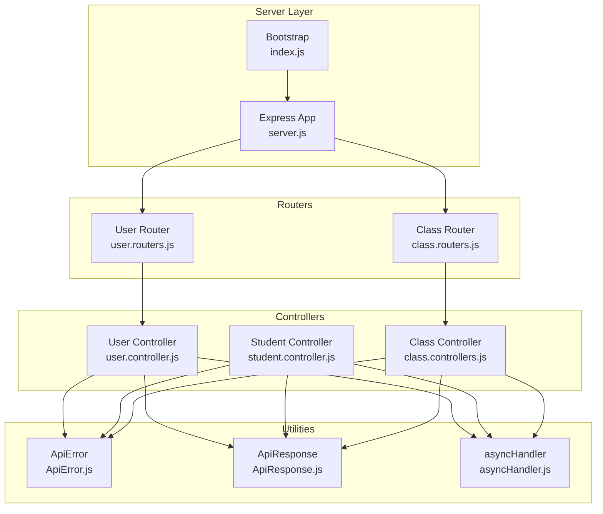
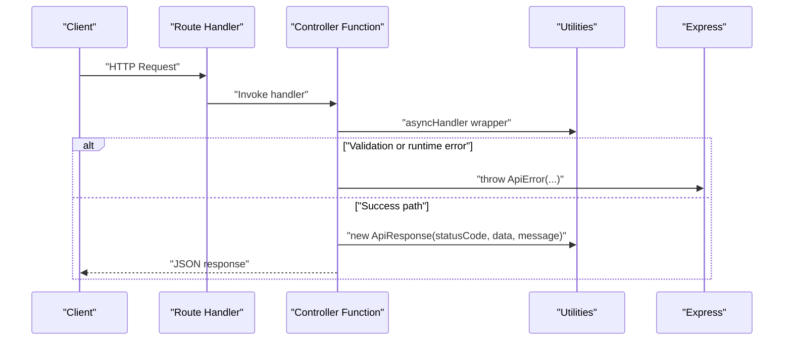
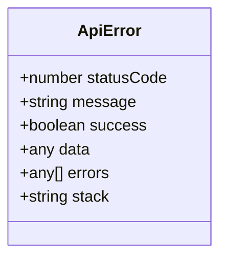
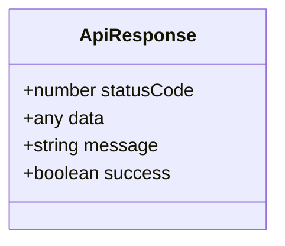
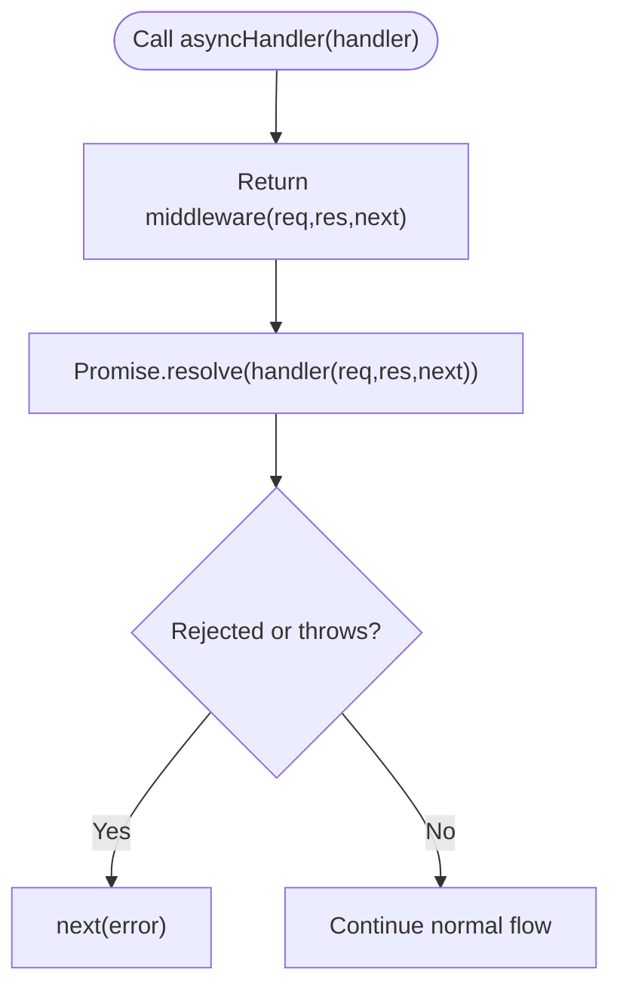
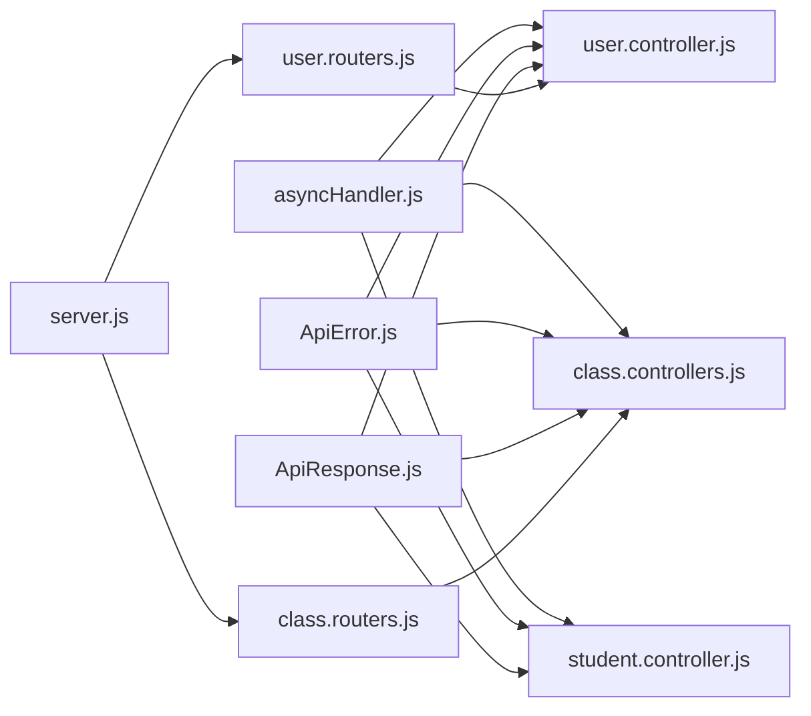

# Error Handling & Response Formats

<cite>
**Referenced Files in This Document**
- [ApiError.js](file://Backend/src/utils/ApiError.js)
- [ApiResponse.js](file://Backend/src/utils/ApiResponse.js)
- [asyncHandler.js](file://Backend/src/utils/asyncHandler.js)
- [server.js](file://Backend/src/server.js)
- [index.js](file://Backend/src/index.js)
- [user.controller.js](file://Backend/src/controllers/user.controller.js)
- [student.controller.js](file://Backend/src/controllers/student.controller.js)
- [class.controllers.js](file://Backend/src/controllers/class.controllers.js)
- [user.routers.js](file://Backend/src/routes/user.routers.js)
- [class.routers.js](file://Backend/src/routes/class.routers.js)
- [constenets.js](file://Backend/src/constenets.js)
</cite>

## Table of Contents
1. [Introduction](#introduction)
2. [Project Structure](#project-structure)
3. [Core Components](#core-components)
4. [Architecture Overview](#architecture-overview)
5. [Detailed Component Analysis](#detailed-component-analysis)
6. [Dependency Analysis](#dependency-analysis)
7. [Performance Considerations](#performance-considerations)
8. [Troubleshooting Guide](#troubleshooting-guide)
9. [Conclusion](#conclusion)
10. [Appendices](#appendices)

## Introduction
This document describes the API error handling and standardized response formats used across the backend. It focuses on:
- The ApiError utility class for error responses
- The ApiResponse utility class for success responses
- The asyncHandler middleware for consistent error propagation
- Standardized response shape and HTTP status code usage
- Common error scenarios and example response outlines
- Guidelines for client-side handling and recovery

## Project Structure
The error-handling utilities live under the utils folder and are consumed by controllers and routes. The server initializes Express, CORS, JSON parsing, and mounts routers for all domain resources.

**Diagram sources**
- [server.js:1-54](file://Backend/src/server.js#L1-L54)
- [index.js:1-18](file://Backend/src/index.js#L1-L18)
- [user.routers.js:1-19](file://Backend/src/routes/user.routers.js#L1-L19)
- [class.routers.js:1-24](file://Backend/src/routes/class.routers.js#L1-L24)
- [user.controller.js:1-355](file://Backend/src/controllers/user.controller.js#L1-L355)
- [student.controller.js:1-209](file://Backend/src/controllers/student.controller.js#L1-L209)
- [class.controllers.js:1-170](file://Backend/src/controllers/class.controllers.js#L1-L170)
- [ApiError.js:1-21](file://Backend/src/utils/ApiError.js#L1-L21)
- [ApiResponse.js:1-10](file://Backend/src/utils/ApiResponse.js#L1-L10)
- [asyncHandler.js:1-4](file://Backend/src/utils/asyncHandler.js#L1-L4)

**Section sources**
- [server.js:1-54](file://Backend/src/server.js#L1-L54)
- [index.js:1-18](file://Backend/src/index.js#L1-L18)
- [user.routers.js:1-19](file://Backend/src/routes/user.routers.js#L1-L19)
- [class.routers.js:1-24](file://Backend/src/routes/class.routers.js#L1-L24)

## Core Components
This section documents the three foundational utilities used for error and success responses.

- ApiError
  - Purpose: Standardized error wrapper carrying HTTP status, message, optional data, and errors payload.
  - Fields: statusCode, message, success (always false), data, errors, stack.
  - Behavior: Captures stack trace unless provided; intended to be thrown in controllers.
  - Typical usage: Throw with appropriate HTTP status code and message during validation or runtime errors.

- ApiResponse
  - Purpose: Standardized success wrapper with statusCode, data, message, and computed success flag.
  - Computed success: true when statusCode < 400; otherwise false.
  - Typical usage: Return as JSON in successful controller responses.

- asyncHandler
  - Purpose: Middleware wrapper that wraps async route handlers to catch thrown errors and forward them to Express error-handling middleware via next().
  - Typical usage: Wrap controller functions exported from route handlers.

**Section sources**
- [ApiError.js:1-21](file://Backend/src/utils/ApiError.js#L1-L21)
- [ApiResponse.js:1-10](file://Backend/src/utils/ApiResponse.js#L1-L10)
- [asyncHandler.js:1-4](file://Backend/src/utils/asyncHandler.js#L1-L4)

## Architecture Overview
The request lifecycle integrates utilities and controllers as follows:
- Routes define endpoints and delegate to controller functions.
- Controllers use asyncHandler to wrap handlers, throw ApiError on failure, or return ApiResponse on success.
- The server sets up middleware and mounts routers.

**Diagram sources**
- [user.routers.js:14-16](file://Backend/src/routes/user.routers.js#L14-L16)
- [user.controller.js:8-81](file://Backend/src/controllers/user.controller.js#L8-L81)
- [asyncHandler.js:1-4](file://Backend/src/utils/asyncHandler.js#L1-L4)
- [ApiResponse.js:1-10](file://Backend/src/utils/ApiResponse.js#L1-L10)
- [ApiError.js:1-21](file://Backend/src/utils/ApiError.js#L1-L21)

## Detailed Component Analysis

### ApiError Utility
- Structure and fields:
  - statusCode: numeric HTTP status code
  - message: human-readable error message
  - success: always false
  - data: optional payload (often null)
  - errors: optional structured errors array
  - stack: captured or provided stack trace
- Usage pattern:
  - Controllers throw ApiError with appropriate status codes for validation failures, not-found conditions, timeouts, and server errors.
  - Example statuses observed in controllers: 400, 401, 404, 408, 500.

**Diagram sources**
- [ApiError.js:1-21](file://Backend/src/utils/ApiError.js#L1-L21)

**Section sources**
- [ApiError.js:1-21](file://Backend/src/utils/ApiError.js#L1-L21)
- [user.controller.js:14-28](file://Backend/src/controllers/user.controller.js#L14-L28)
- [user.controller.js:63-65](file://Backend/src/controllers/user.controller.js#L63-L65)
- [user.controller.js:73-75](file://Backend/src/controllers/user.controller.js#L73-L75)
- [user.controller.js:348-350](file://Backend/src/controllers/user.controller.js#L348-L350)
- [student.controller.js:13-42](file://Backend/src/controllers/student.controller.js#L13-L42)
- [student.controller.js:65-70](file://Backend/src/controllers/student.controller.js#L65-L70)
- [student.controller.js:98-100](file://Backend/src/controllers/student.controller.js#L98-L100)
- [student.controller.js:113-123](file://Backend/src/controllers/student.controller.js#L113-L123)
- [class.controllers.js:13-14](file://Backend/src/controllers/class.controllers.js#L13-L14)
- [class.controllers.js:25-26](file://Backend/src/controllers/class.controllers.js#L25-L26)
- [class.controllers.js:71-72](file://Backend/src/controllers/class.controllers.js#L71-L72)
- [class.controllers.js:110-111](file://Backend/src/controllers/class.controllers.js#L110-L111)
- [class.controllers.js:146-149](file://Backend/src/controllers/class.controllers.js#L146-L149)

### ApiResponse Utility
- Structure and fields:
  - statusCode: numeric HTTP status code
  - data: response payload
  - message: human-readable message
  - success: derived from statusCode (< 400)
- Usage pattern:
  - Controllers return ApiResponse instances for successful outcomes.
  - Status codes commonly used: 200, 201.

**Diagram sources**
- [ApiResponse.js:1-10](file://Backend/src/utils/ApiResponse.js#L1-L10)

**Section sources**
- [ApiResponse.js:1-10](file://Backend/src/utils/ApiResponse.js#L1-L10)
- [user.controller.js:76-80](file://Backend/src/controllers/user.controller.js#L76-L80)
- [user.controller.js:156-160](file://Backend/src/controllers/user.controller.js#L156-L160)
- [user.controller.js:233-235](file://Backend/src/controllers/user.controller.js#L233-L235)
- [user.controller.js:260-262](file://Backend/src/controllers/user.controller.js#L260-L262)
- [user.controller.js:275-277](file://Backend/src/controllers/user.controller.js#L275-L277)
- [user.controller.js:351-353](file://Backend/src/controllers/user.controller.js#L351-L353)
- [student.controller.js:82-90](file://Backend/src/controllers/student.controller.js#L82-L90)
- [student.controller.js:102-104](file://Backend/src/controllers/student.controller.js#L102-L104)
- [student.controller.js:125-127](file://Backend/src/controllers/student.controller.js#L125-L127)
- [student.controller.js:186-188](file://Backend/src/controllers/student.controller.js#L186-L188)
- [student.controller.js:205-207](file://Backend/src/controllers/student.controller.js#L205-L207)
- [class.controllers.js:33-34](file://Backend/src/controllers/class.controllers.js#L33-L34)
- [class.controllers.js:76-77](file://Backend/src/controllers/class.controllers.js#L76-L77)
- [class.controllers.js:115-116](file://Backend/src/controllers/class.controllers.js#L115-L116)
- [class.controllers.js:160-161](file://Backend/src/controllers/class.controllers.js#L160-L161)

### asyncHandler Middleware
- Purpose: Ensures async route handlers propagate thrown errors to Express error-handling middleware.
- Behavior: Wraps a request handler; any thrown error becomes available to downstream error middleware.

**Diagram sources**
- [asyncHandler.js:1-4](file://Backend/src/utils/asyncHandler.js#L1-L4)

**Section sources**
- [asyncHandler.js:1-4](file://Backend/src/utils/asyncHandler.js#L1-L4)
- [user.controller.js:8](file://Backend/src/controllers/user.controller.js#L8)
- [student.controller.js:6](file://Backend/src/controllers/student.controller.js#L6)
- [class.controllers.js:5](file://Backend/src/controllers/class.controllers.js#L5)

### Controller Usage Patterns
- Validation errors: Controllers validate inputs and throw ApiError with 400 and descriptive messages.
- Not found: Controllers check existence and throw ApiError with 404 when missing.
- Duplicate entries: Controllers detect duplicates and throw ApiError with 408.
- Server errors: Controllers catch unexpected failures and throw ApiError with 500.
- Success responses: Controllers return ApiResponse with 200 or 201.

Examples of usage across controllers:
- User registration validates arrays and required fields, checks uniqueness, and returns ApiResponse on success.
- Student registration validates required fields, deduplicates by IDs/emails, and returns ApiResponse on success.
- Class endpoints validate presence of identifiers and throw ApiError for missing or duplicate data.

**Section sources**
- [user.controller.js:8-81](file://Backend/src/controllers/user.controller.js#L8-L81)
- [user.controller.js:84-161](file://Backend/src/controllers/user.controller.js#L84-L161)
- [user.controller.js:164-278](file://Backend/src/controllers/user.controller.js#L164-L278)
- [user.controller.js:281-354](file://Backend/src/controllers/user.controller.js#L281-L354)
- [student.controller.js:6-91](file://Backend/src/controllers/student.controller.js#L6-L91)
- [student.controller.js:94-105](file://Backend/src/controllers/student.controller.js#L94-L105)
- [student.controller.js:108-128](file://Backend/src/controllers/student.controller.js#L108-L128)
- [student.controller.js:131-189](file://Backend/src/controllers/student.controller.js#L131-L189)
- [student.controller.js:192-208](file://Backend/src/controllers/student.controller.js#L192-L208)
- [class.controllers.js:5-170](file://Backend/src/controllers/class.controllers.js#L5-L170)

## Dependency Analysis
- Controllers depend on:
  - asyncHandler for error propagation
  - ApiError for error responses
  - ApiResponse for success responses
- Routers depend on controllers.
- Server depends on routers and initializes middleware.

**Diagram sources**
- [asyncHandler.js:1-4](file://Backend/src/utils/asyncHandler.js#L1-L4)
- [ApiError.js:1-21](file://Backend/src/utils/ApiError.js#L1-L21)
- [ApiResponse.js:1-10](file://Backend/src/utils/ApiResponse.js#L1-L10)
- [user.routers.js:1-19](file://Backend/src/routes/user.routers.js#L1-L19)
- [class.routers.js:1-24](file://Backend/src/routes/class.routers.js#L1-L24)
- [user.controller.js:1-355](file://Backend/src/controllers/user.controller.js#L1-L355)
- [student.controller.js:1-209](file://Backend/src/controllers/student.controller.js#L1-L209)
- [class.controllers.js:1-170](file://Backend/src/controllers/class.controllers.js#L1-L170)
- [server.js:1-54](file://Backend/src/server.js#L1-L54)

**Section sources**
- [user.routers.js:1-19](file://Backend/src/routes/user.routers.js#L1-L19)
- [class.routers.js:1-24](file://Backend/src/routes/class.routers.js#L1-L24)
- [server.js:25-50](file://Backend/src/server.js#L25-L50)

## Performance Considerations
- Prefer early validation and throwing ApiError to avoid unnecessary database work.
- Use ApiResponse with minimal payloads to reduce serialization overhead.
- asyncHandler avoids redundant try/catch blocks in every controller, reducing boilerplate and potential misconfiguration.

## Troubleshooting Guide
Common error scenarios and typical outcomes:
- Validation errors
  - Cause: Missing or malformed fields
  - Outcome: ApiError with 400 and a descriptive message
  - Example paths:
    - [user.controller.js:14-28](file://Backend/src/controllers/user.controller.js#L14-L28)
    - [student.controller.js:13-42](file://Backend/src/controllers/student.controller.js#L13-L42)
    - [class.controllers.js:13-14](file://Backend/src/controllers/class.controllers.js#L13-L14)

- Authentication failures
  - Cause: Missing credentials or invalid combination
  - Outcome: ApiError with 401 and message indicating invalid credentials
  - Example paths:
    - [user.controller.js:283-285](file://Backend/src/controllers/user.controller.js#L283-L285)
    - [user.controller.js:348-350](file://Backend/src/controllers/user.controller.js#L348-L350)

- Authorization denials
  - Observation: Not explicitly shown in the examined controllers; ensure downstream middleware enforces roles and permissions if applicable.

- Not found
  - Cause: Resource does not exist
  - Outcome: ApiError with 404
  - Example paths:
    - [user.controller.js:167-169](file://Backend/src/controllers/user.controller.js#L167-L169)
    - [user.controller.js:245-247](file://Backend/src/controllers/user.controller.js#L245-L247)
    - [student.controller.js:113-123](file://Backend/src/controllers/student.controller.js#L113-L123)
    - [class.controllers.js:110-111](file://Backend/src/controllers/class.controllers.js#L110-L111)

- Duplicate entries
  - Cause: Attempting to insert records that already exist
  - Outcome: ApiError with 408 and message indicating duplicates
  - Example paths:
    - [user.controller.js:63-65](file://Backend/src/controllers/user.controller.js#L63-L65)
    - [student.controller.js:65-70](file://Backend/src/controllers/student.controller.js#L65-L70)
    - [class.controllers.js:25-26](file://Backend/src/controllers/class.controllers.js#L25-L26)

- Database errors
  - Cause: Insertion or update failures
  - Outcome: ApiError with 500 and message indicating failure
  - Example paths:
    - [user.controller.js:73-75](file://Backend/src/controllers/user.controller.js#L73-L75)
    - [student.controller.js:76-78](file://Backend/src/controllers/student.controller.js#L76-L78)

- Successful responses
  - Outcome: ApiResponse with 200 or 201 and a success message
  - Example paths:
    - [user.controller.js:76-80](file://Backend/src/controllers/user.controller.js#L76-L80)
    - [user.controller.js:156-160](file://Backend/src/controllers/user.controller.js#L156-L160)
    - [student.controller.js:82-90](file://Backend/src/controllers/student.controller.js#L82-L90)
    - [class.controllers.js:33-34](file://Backend/src/controllers/class.controllers.js#L33-L34)

## Conclusion
The backend employs a consistent pattern:
- asyncHandler ensures errors are forwarded to Express error handling.
- ApiError standardizes error responses with explicit status codes and messages.
- ApiResponse standardizes success responses with a computed success flag.
- Controllers enforce validation, uniqueness, and resource existence, returning ApiResponse on success and ApiError on failure.

## Appendices

### HTTP Status Codes Observed Across Controllers
- 200: Successful GET/UPDATE/DELETE operations
- 201: Successful creation
- 400: Validation errors
- 401: Authentication failure
- 404: Resource not found
- 408: Request timeout or duplicate entries detected
- 500: Internal server error

These codes are used consistently across user, student, and class controllers.

**Section sources**
- [user.controller.js:76-80](file://Backend/src/controllers/user.controller.js#L76-L80)
- [user.controller.js:156-160](file://Backend/src/controllers/user.controller.js#L156-L160)
- [user.controller.js:233-235](file://Backend/src/controllers/user.controller.js#L233-L235)
- [user.controller.js:260-262](file://Backend/src/controllers/user.controller.js#L260-L262)
- [user.controller.js:275-277](file://Backend/src/controllers/user.controller.js#L275-L277)
- [user.controller.js:351-353](file://Backend/src/controllers/user.controller.js#L351-L353)
- [student.controller.js:82-90](file://Backend/src/controllers/student.controller.js#L82-L90)
- [student.controller.js:102-104](file://Backend/src/controllers/student.controller.js#L102-L104)
- [student.controller.js:125-127](file://Backend/src/controllers/student.controller.js#L125-L127)
- [student.controller.js:186-188](file://Backend/src/controllers/student.controller.js#L186-L188)
- [student.controller.js:205-207](file://Backend/src/controllers/student.controller.js#L205-L207)
- [class.controllers.js:33-34](file://Backend/src/controllers/class.controllers.js#L33-L34)
- [class.controllers.js:76-77](file://Backend/src/controllers/class.controllers.js#L76-L77)
- [class.controllers.js:115-116](file://Backend/src/controllers/class.controllers.js#L115-L116)
- [class.controllers.js:160-161](file://Backend/src/controllers/class.controllers.js#L160-L161)

### Standardized Response Format
- Error response (ApiError):
  - Fields: statusCode, message, success=false, data, errors, stack
  - Example outline:
    - statusCode: 400
    - message: "Password is required"
    - success: false
    - data: null
    - errors: []
    - stack: captured or provided

- Success response (ApiResponse):
  - Fields: statusCode, data, message, success (computed)
  - Example outline:
    - statusCode: 201
    - data: [inserted user object]
    - message: "Users registered successfully"
    - success: true

**Section sources**
- [ApiError.js:1-21](file://Backend/src/utils/ApiError.js#L1-L21)
- [ApiResponse.js:1-10](file://Backend/src/utils/ApiResponse.js#L1-L10)
- [user.controller.js:76-80](file://Backend/src/controllers/user.controller.js#L76-L80)
- [student.controller.js:82-90](file://Backend/src/controllers/student.controller.js#L82-L90)

### Client-Side Handling and Recovery Strategies
- Parse response body and inspect success flag and statusCode.
- On success (success=true):
  - Use data payload for UI updates.
- On error (success=false):
  - Use statusCode to branch behavior (e.g., 401 to redirect to login, 404 to show not found UI).
  - Display message to the user; optionally show details from errors array if present.
- Retry and fallback:
  - For transient 500 errors, implement exponential backoff and notify users.
  - For 408, inform users about duplicates and prompt correction.
- Logging:
  - Capture stack traces for debugging and support.
- UX:
  - Provide actionable feedback for 400 validation errors.
  - Redirect unauthenticated requests to login.