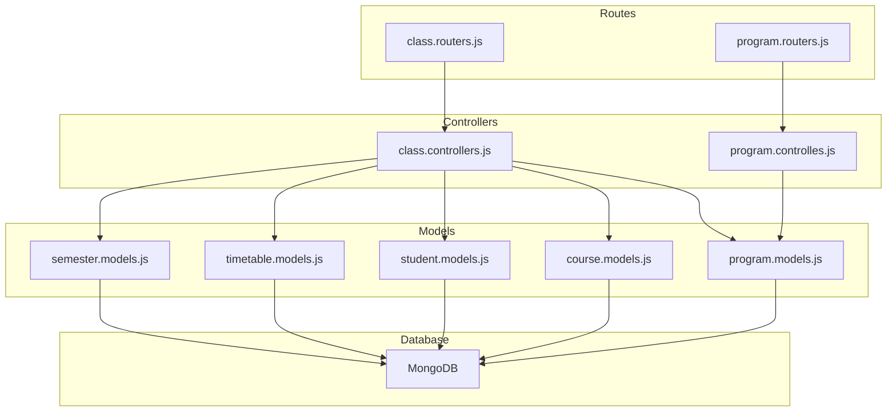
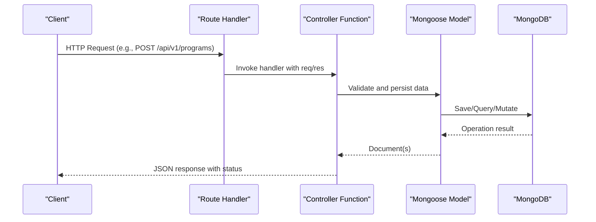
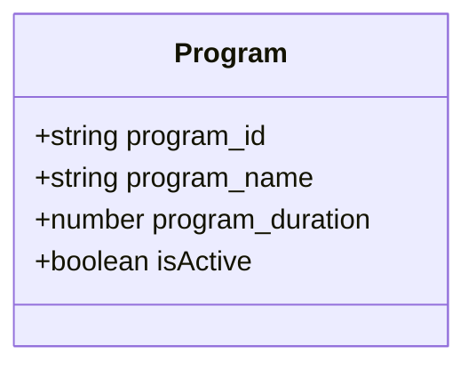
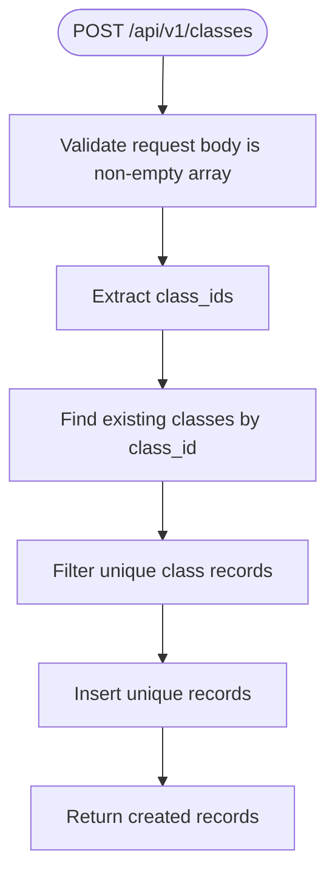
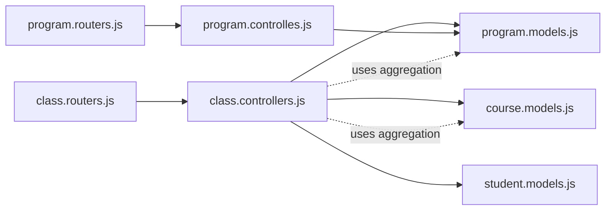

# Class & Program Management Endpoints

<cite>
**Referenced Files in This Document**
- [class.routers.js](file://Backend/src/routes/class.routers.js)
- [program.routers.js](file://Backend/src/routes/program.routers.js)
- [class.controllers.js](file://Backend/src/controllers/class.controllers.js)
- [program.controlles.js](file://Backend/src/controllers/program.controlles.js)
- [program.models.js](file://Backend/src/models/program.models.js)
- [course.models.js](file://Backend/src/models/course.models.js)
- [student.models.js](file://Backend/src/models/student.models.js)
- [timetable.models.js](file://Backend/src/models/timetable.models.js)
- [semester.models.js](file://Backend/src/models/semester.models.js)
- [db/index.js](file://Backend/src/db/index.js)
- [index.js](file://Backend/src/index.js)
- [constenets.js](file://Backend/src/constenets.js)
</cite>

## Table of Contents
1. [Introduction](#introduction)
2. [Project Structure](#project-structure)
3. [Core Components](#core-components)
4. [Architecture Overview](#architecture-overview)
5. [Detailed Component Analysis](#detailed-component-analysis)
6. [Dependency Analysis](#dependency-analysis)
7. [Performance Considerations](#performance-considerations)
8. [Troubleshooting Guide](#troubleshooting-guide)
9. [Conclusion](#conclusion)

## Introduction
This document provides comprehensive API documentation for class and program management endpoints in the timetable management system. It covers:
- Program CRUD operations: creation, retrieval, updates, and deletion of academic programs
- Class CRUD operations: creation, retrieval, updates, and deletion of classes
- Hierarchical relationships between programs and classes
- Enrollment management via student records
- Academic year tracking through timetable entries
- Validation rules for program codes, class identifiers, and department associations

## Project Structure
The backend follows a modular structure with clear separation of concerns:
- Routes define endpoint URLs and HTTP methods
- Controllers handle request validation, business logic, and response formatting
- Models define Mongoose schemas for data persistence
- Database connection and server initialization are centralized



**Diagram sources**
- [class.routers.js:1-24](file://Backend/src/routes/class.routers.js#L1-L24)
- [program.routers.js:1-24](file://Backend/src/routes/program.routers.js#L1-L24)
- [class.controllers.js:1-179](file://Backend/src/controllers/class.controllers.js#L1-L179)
- [program.controlles.js:1-131](file://Backend/src/controllers/program.controlles.js#L1-L131)
- [program.models.js:1-32](file://Backend/src/models/program.models.js#L1-L32)
- [course.models.js:1-32](file://Backend/src/models/course.models.js#L1-L32)
- [student.models.js:1-59](file://Backend/src/models/student.models.js#L1-L59)
- [timetable.models.js:1-47](file://Backend/src/models/timetable.models.js#L1-L47)
- [semester.models.js:1-26](file://Backend/src/models/semester.models.js#L1-L26)

**Section sources**
- [class.routers.js:1-24](file://Backend/src/routes/class.routers.js#L1-L24)
- [program.routers.js:1-24](file://Backend/src/routes/program.routers.js#L1-L24)
- [class.controllers.js:1-179](file://Backend/src/controllers/class.controllers.js#L1-L179)
- [program.controlles.js:1-131](file://Backend/src/controllers/program.controlles.js#L1-L131)
- [program.models.js:1-32](file://Backend/src/models/program.models.js#L1-L32)
- [course.models.js:1-32](file://Backend/src/models/course.models.js#L1-L32)
- [student.models.js:1-59](file://Backend/src/models/student.models.js#L1-L59)
- [timetable.models.js:1-47](file://Backend/src/models/timetable.models.js#L1-L47)
- [semester.models.js:1-26](file://Backend/src/models/semester.models.js#L1-L26)
- [db/index.js:1-19](file://Backend/src/db/index.js#L1-L19)
- [index.js:1-18](file://Backend/src/index.js#L1-L18)
- [constenets.js:1-2](file://Backend/src/constenets.js#L1-L2)

## Core Components
This section documents the primary endpoints for program and class management, along with their validation rules and relationships.

### Program Management Endpoints
- POST /api/v1/programs
  - Purpose: Register multiple academic programs in bulk
  - Request body: Array of program objects with required fields
  - Validation rules:
    - Each program object requires program_id and program_name
    - program_id must be unique and uppercase
    - program_name must be unique and uppercase
    - program_duration must be a positive number
  - Response: Returns created program records with success status

- GET /api/v1/programs
  - Purpose: Retrieve all academic programs
  - Response: Array of all program documents

- GET /api/v1/programs/:id
  - Purpose: Retrieve a program by its internal ObjectId
  - Path parameter: id (required)
  - Response: Single program document

- GET /api/v1/programs/:program_id
  - Purpose: Retrieve a program by its program_id
  - Path parameter: program_id (required)
  - Response: Single program document

- PUT /api/v1/programs/:id
  - Purpose: Update a program by its internal ObjectId
  - Path parameter: id (required)
  - Request body: Partial program fields to update
  - Validation: runValidators enabled for schema-level constraints
  - Response: Updated program document

- DELETE /api/v1/programs/:id
  - Purpose: Delete a program by its internal ObjectId
  - Path parameter: id (required)
  - Response: Deleted program document

**Section sources**
- [program.routers.js:13-22](file://Backend/src/routes/program.routers.js#L13-L22)
- [program.controlles.js:5-45](file://Backend/src/controllers/program.controlles.js#L5-L45)
- [program.controlles.js:48-75](file://Backend/src/controllers/program.controlles.js#L48-L75)
- [program.controlles.js:77-88](file://Backend/src/controllers/program.controlles.js#L77-L88)
- [program.controlles.js:90-113](file://Backend/src/controllers/program.controlles.js#L90-L113)
- [program.controlles.js:115-131](file://Backend/src/controllers/program.controlles.js#L115-L131)
- [program.models.js:3-29](file://Backend/src/models/program.models.js#L3-L29)

### Class Management Endpoints
- POST /api/v1/classes
  - Purpose: Register multiple classes in bulk
  - Request body: Array of class objects with required fields
  - Validation rules:
    - Each class object requires class_id and year
    - class_id must be unique and uppercase
    - year must be present
    - program_id and course_id are referenced via joins (see Relationships)
  - Response: Returns created class records with success status

- GET /api/v1/classes
  - Purpose: Retrieve all classes with joined program and course details
  - Response: Array of class documents enriched with program and course information

- GET /api/v1/classes/:id
  - Purpose: Retrieve a class by its internal ObjectId with joined details
  - Path parameter: id (required)
  - Response: Single class document with program and course enrichment

- GET /api/v1/classes/:class_id
  - Purpose: Retrieve a class by its class_id
  - Path parameter: class_id (required)
  - Response: Single class document

- PUT /api/v1/classes/:id
  - Purpose: Update a class by its internal ObjectId
  - Path parameter: id (required)
  - Request body: Partial class fields to update
  - Response: Updated class document

- DELETE /api/v1/classes/:id
  - Purpose: Delete a class by its internal ObjectId
  - Path parameter: id (required)
  - Response: Deleted class document

**Section sources**
- [class.routers.js:13-22](file://Backend/src/routes/class.routers.js#L13-L22)
- [class.controllers.js:6-37](file://Backend/src/controllers/class.controllers.js#L6-L37)
- [class.controllers.js:40-79](file://Backend/src/controllers/class.controllers.js#L40-L79)
- [class.controllers.js:82-118](file://Backend/src/controllers/class.controllers.js#L82-L118)
- [class.controllers.js:121-141](file://Backend/src/controllers/class.controllers.js#L121-L141)
- [class.controllers.js:144-163](file://Backend/src/controllers/class.controllers.js#L144-L163)
- [class.controllers.js:166-178](file://Backend/src/controllers/class.controllers.js#L166-L178)

## Architecture Overview
The system uses Express routers mapped to controller functions, which interact with Mongoose models for data persistence. Aggregation pipelines enrich class data with related program and course information.



**Diagram sources**
- [program.routers.js:13-22](file://Backend/src/routes/program.routers.js#L13-L22)
- [program.controlles.js:5-45](file://Backend/src/controllers/program.controlles.js#L5-L45)
- [program.models.js:3-29](file://Backend/src/models/program.models.js#L3-L29)
- [class.routers.js:13-22](file://Backend/src/routes/class.routers.js#L13-L22)
- [class.controllers.js:6-37](file://Backend/src/controllers/class.controllers.js#L6-L37)
- [class.models.js](file://Backend/src/models/class.models.js)

## Detailed Component Analysis

### Program Model and Validation
The Program model enforces strict validation for program identifiers and metadata:
- program_id: required, unique, uppercase, trimmed
- program_name: required, uppercase, trimmed
- program_duration: required number
- isActive: boolean flag with default true



**Diagram sources**
- [program.models.js:3-29](file://Backend/src/models/program.models.js#L3-L29)

**Section sources**
- [program.models.js:3-29](file://Backend/src/models/program.models.js#L3-L29)

### Class Model and Aggregation Behavior
Class endpoints rely on aggregation to join program and course details. The controller logic:
- Validates bulk registration arrays and required fields
- Prevents duplicates by checking existing class_ids
- Uses aggregation with $lookup and $unwind for enriched queries



**Diagram sources**
- [class.controllers.js:6-37](file://Backend/src/controllers/class.controllers.js#L6-L37)

**Section sources**
- [class.controllers.js:6-37](file://Backend/src/controllers/class.controllers.js#L6-L37)
- [class.controllers.js:40-79](file://Backend/src/controllers/class.controllers.js#L40-L79)
- [class.controllers.js:82-118](file://Backend/src/controllers/class.controllers.js#L82-L118)
- [class.controllers.js:121-141](file://Backend/src/controllers/class.controllers.js#L121-L141)
- [class.controllers.js:144-163](file://Backend/src/controllers/class.controllers.js#L144-L163)
- [class.controllers.js:166-178](file://Backend/src/controllers/class.controllers.js#L166-L178)

### Relationships Between Programs, Classes, Courses, Students, and Timetables
Programs and classes are linked via program_id. Classes are associated with courses and students. Timetables track academic year and semester context.

```mermaid
erDiagram
PROGRAM {
string program_id PK
string program_name
number program_duration
boolean isActive
}
COURSE {
string course_id PK
string course_name
number credit
boolean isActive
}
CLASS {
string class_id PK
string program_id FK
string course_id FK
string year
}
STUDENT {
string student_id PK
string student_name
string gender
string email
string class
string batch
date date_of_birth
string specialization
}
TIMETABLE {
string timetable_id PK
string semester_id
string academicYear
date generated_date
string generatedBy
string status
}
SEMESTER {
string semester_id PK
string semester_name
boolean isEven
}
PROGRAM ||--o{ CLASS : "has many"
COURSE ||--o{ CLASS : "assigned to"
CLASS ||--o{ STUDENT : "enrolls"
SEMESTER ||--o{ TIMETABLE : "defines"
```

**Diagram sources**
- [program.models.js:3-29](file://Backend/src/models/program.models.js#L3-L29)
- [course.models.js:3-29](file://Backend/src/models/course.models.js#L3-L29)
- [student.models.js:3-56](file://Backend/src/models/student.models.js#L3-L56)
- [timetable.models.js:3-45](file://Backend/src/models/timetable.models.js#L3-L45)
- [semester.models.js:3-24](file://Backend/src/models/semester.models.js#L3-L24)

**Section sources**
- [program.models.js:3-29](file://Backend/src/models/program.models.js#L3-L29)
- [course.models.js:3-29](file://Backend/src/models/course.models.js#L3-L29)
- [student.models.js:3-56](file://Backend/src/models/student.models.js#L3-L56)
- [timetable.models.js:3-45](file://Backend/src/models/timetable.models.js#L3-L45)
- [semester.models.js:3-24](file://Backend/src/models/semester.models.js#L3-L24)

### Enrollment Management
Students are enrolled in classes and tracked by class and batch. This supports class capacity planning and resource allocation.

Key fields in the Student model:
- student_id: unique identifier
- class: links to class_id
- batch: academic cohort
- specialization: area of focus

**Section sources**
- [student.models.js:3-56](file://Backend/src/models/student.models.js#L3-L56)

### Academic Year Tracking
Timetables capture academic year and semester context, enabling scheduling alignment with institutional calendars.

Key fields in the Timetable model:
- academicYear: identifies the academic year
- semester_id: links to semester definition
- status: lifecycle state (draft, published, archived)

**Section sources**
- [timetable.models.js:3-45](file://Backend/src/models/timetable.models.js#L3-L45)
- [semester.models.js:3-24](file://Backend/src/models/semester.models.js#L3-L24)

## Dependency Analysis
The routing layer delegates to controllers, which operate on models. Aggregation pipelines in controllers depend on collection relationships.



**Diagram sources**
- [class.routers.js:1-24](file://Backend/src/routes/class.routers.js#L1-L24)
- [program.routers.js:1-24](file://Backend/src/routes/program.routers.js#L1-L24)
- [class.controllers.js:40-79](file://Backend/src/controllers/class.controllers.js#L40-L79)
- [program.controlles.js:48-75](file://Backend/src/controllers/program.controlles.js#L48-L75)
- [program.models.js:3-29](file://Backend/src/models/program.models.js#L3-L29)
- [course.models.js:3-29](file://Backend/src/models/course.models.js#L3-L29)
- [student.models.js:3-56](file://Backend/src/models/student.models.js#L3-L56)

**Section sources**
- [class.routers.js:1-24](file://Backend/src/routes/class.routers.js#L1-L24)
- [program.routers.js:1-24](file://Backend/src/routes/program.routers.js#L1-L24)
- [class.controllers.js:40-79](file://Backend/src/controllers/class.controllers.js#L40-L79)
- [program.controlles.js:48-75](file://Backend/src/controllers/program.controlles.js#L48-L75)

## Performance Considerations
- Bulk registration: The controllers filter duplicates before insertion to minimize write operations.
- Aggregation queries: Joins with $lookup and $unwind can be expensive; consider indexing program_id and course_id for improved performance.
- Validation: Early validation reduces unnecessary database round trips.

## Troubleshooting Guide
Common issues and resolutions:
- Duplicate program_id or class_id: The system prevents insertion of existing identifiers. Ensure uniqueness before sending requests.
- Missing required fields: Requests must include required fields as per model validation. Verify program_id, program_name, class_id, and year.
- Not found errors: Ensure correct ObjectId or program_id/class_id values in path parameters.
- Database connectivity: Confirm MongoDB URI and database name are configured correctly.

**Section sources**
- [class.controllers.js:6-37](file://Backend/src/controllers/class.controllers.js#L6-L37)
- [program.controlles.js:5-45](file://Backend/src/controllers/program.controlles.js#L5-L45)
- [db/index.js:4-16](file://Backend/src/db/index.js#L4-L16)
- [index.js:8-17](file://Backend/src/index.js#L8-L17)
- [constenets.js:1](file://Backend/src/constenets.js#L1)

## Conclusion
The class and program management endpoints provide robust CRUD capabilities with strong validation and clear relationships to courses, students, and timetables. By adhering to the documented validation rules and leveraging the provided endpoints, administrators can efficiently manage academic programs and classes while maintaining data integrity and supporting enrollment and scheduling workflows.