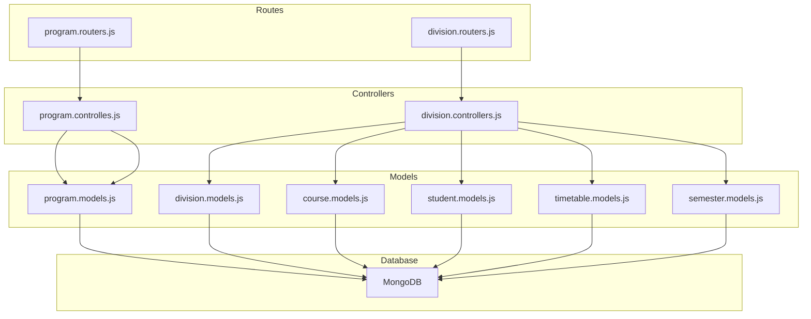
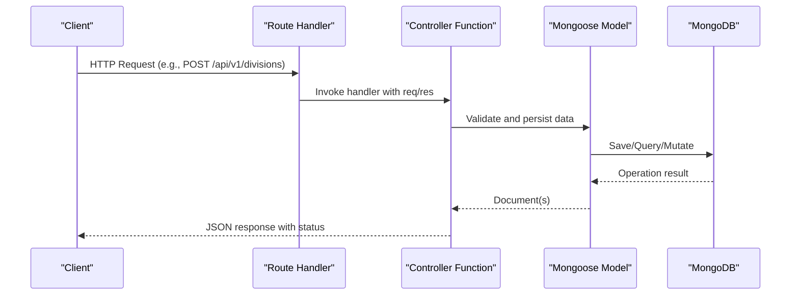
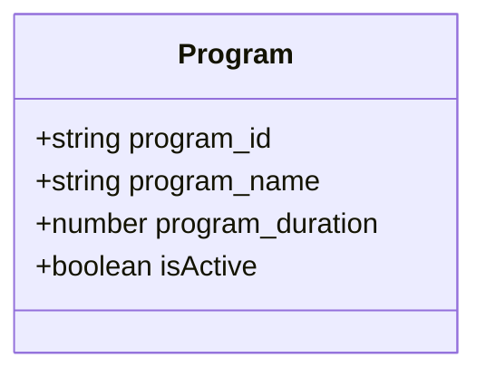
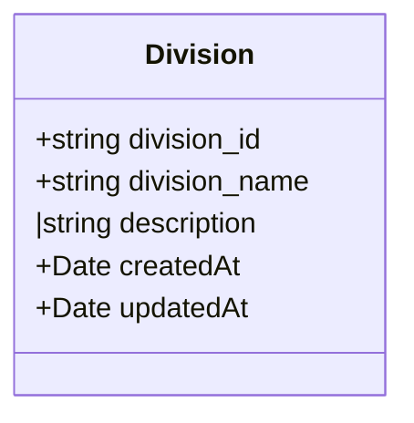
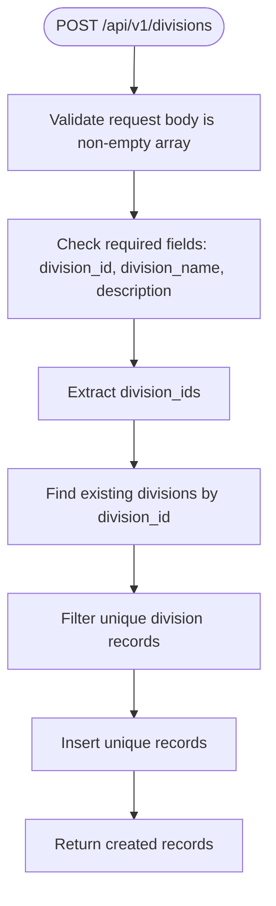
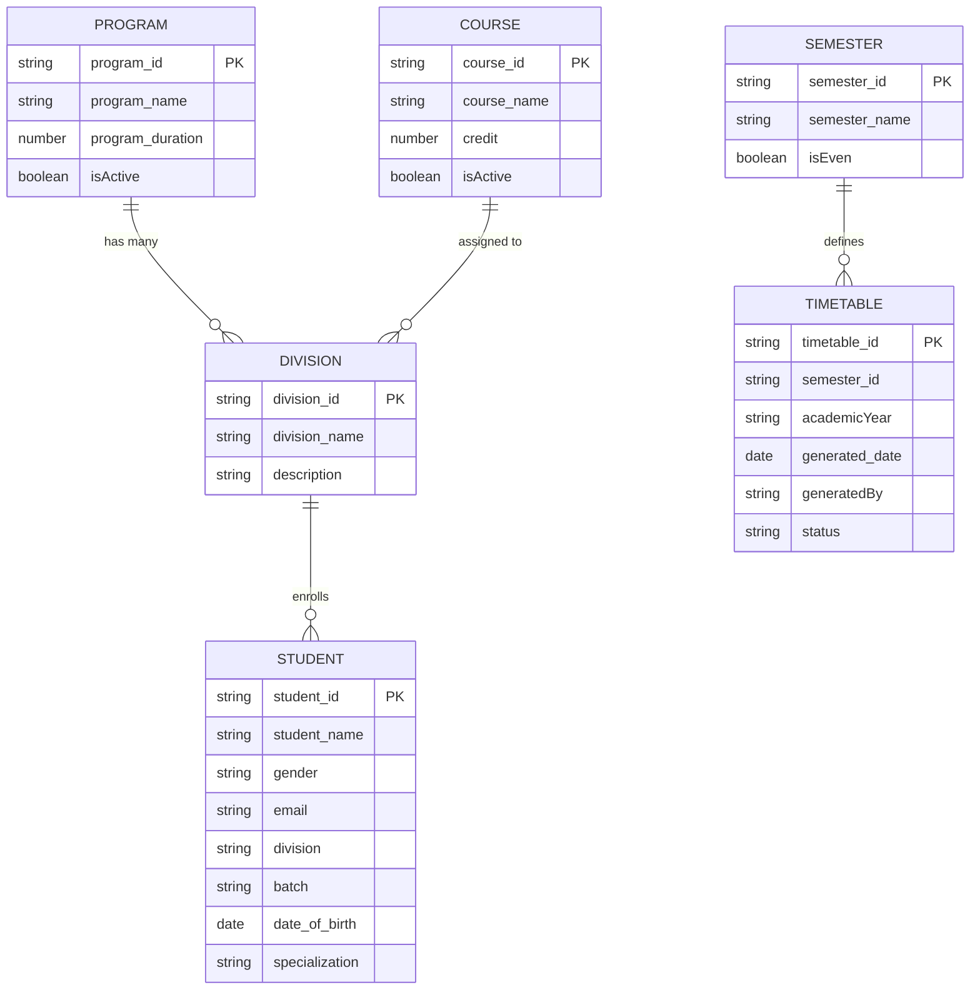
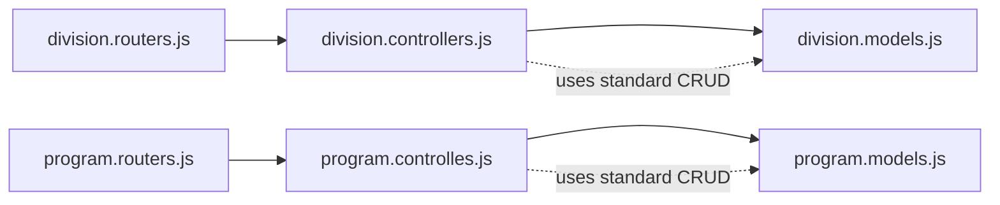

# Class & Program Management Endpoints

<cite>
**Referenced Files in This Document**
- [division.routers.js](file://Backend/src/routes/division.routers.js)
- [program.routers.js](file://Backend/src/routes/program.routers.js)
- [division.controllers.js](file://Backend/src/controllers/division.controllers.js)
- [program.controlles.js](file://Backend/src/controllers/program.controlles.js)
- [division.models.js](file://Backend/src/models/division.models.js)
- [program.models.js](file://Backend/src/models/program.models.js)
- [course.models.js](file://Backend/src/models/course.models.js)
- [student.models.js](file://Backend/src/models/student.models.js)
- [timetable.models.js](file://Backend/src/models/timetable.models.js)
- [semester.models.js](file://Backend/src/models/semester.models.js)
- [db/index.js](file://Backend/src/db/index.js)
- [index.js](file://Backend/src/index.js)
- [constenets.js](file://Backend/src/constenets.js)
</cite>

## Update Summary
**Changes Made**
- Complete replacement of class-based architecture with division-based approach
- Updated all endpoints from `/api/v1/classes` to `/api/v1/divisions`
- Removed all class-related documentation and examples
- Added comprehensive division management endpoints documentation
- Updated architectural diagrams to reflect new division model
- Maintained program management endpoints with existing functionality

## Table of Contents
1. [Introduction](#introduction)
2. [Project Structure](#project-structure)
3. [Core Components](#core-components)
4. [Architecture Overview](#architecture-overview)
5. [Detailed Component Analysis](#detailed-component-analysis)
6. [Dependency Analysis](#dependency-analysis)
7. [Performance Considerations](#performance-considerations)
8. [Troubleshooting Guide](#troubleshooting-guide)
9. [Conclusion](#conclusion)

## Introduction
This document provides comprehensive API documentation for division and program management endpoints in the timetable management system. The system has been updated from a class-based architecture to a division-based approach, while maintaining program management functionality. It covers:
- Program CRUD operations: creation, retrieval, updates, and deletion of academic programs
- Division CRUD operations: creation, retrieval, updates, and deletion of academic divisions
- Hierarchical relationships between programs and divisions
- Enrollment management via student records
- Academic year tracking through timetable entries
- Validation rules for program codes, division identifiers, and department associations

## Project Structure
The backend follows a modular structure with clear separation of concerns:
- Routes define endpoint URLs and HTTP methods
- Controllers handle request validation, business logic, and response formatting
- Models define Mongoose schemas for data persistence
- Database connection and server initialization are centralized

**Diagram sources**
- [division.routers.js:1-24](file://Backend/src/routes/division.routers.js#L1-L24)
- [program.routers.js:1-24](file://Backend/src/routes/program.routers.js#L1-L24)
- [division.controllers.js:1-123](file://Backend/src/controllers/division.controllers.js#L1-L123)
- [program.controlles.js:1-132](file://Backend/src/controllers/program.controlles.js#L1-L132)
- [division.models.js:1-27](file://Backend/src/models/division.models.js#L1-L27)
- [program.models.js:1-32](file://Backend/src/models/program.models.js#L1-L32)
- [course.models.js:1-32](file://Backend/src/models/course.models.js#L1-L32)
- [student.models.js:1-59](file://Backend/src/models/student.models.js#L1-L59)
- [timetable.models.js:1-47](file://Backend/src/models/timetable.models.js#L1-L47)
- [semester.models.js:1-26](file://Backend/src/models/semester.models.js#L1-L26)

**Section sources**
- [division.routers.js:1-24](file://Backend/src/routes/division.routers.js#L1-L24)
- [program.routers.js:1-24](file://Backend/src/routes/program.routers.js#L1-L24)
- [division.controllers.js:1-123](file://Backend/src/controllers/division.controllers.js#L1-L123)
- [program.controlles.js:1-132](file://Backend/src/controllers/program.controlles.js#L1-L132)
- [division.models.js:1-27](file://Backend/src/models/division.models.js#L1-L27)
- [program.models.js:1-32](file://Backend/src/models/program.models.js#L1-L32)
- [course.models.js:1-32](file://Backend/src/models/course.models.js#L1-L32)
- [student.models.js:1-59](file://Backend/src/models/student.models.js#L1-L59)
- [timetable.models.js:1-47](file://Backend/src/models/timetable.models.js#L1-L47)
- [semester.models.js:1-26](file://Backend/src/models/semester.models.js#L1-L26)
- [db/index.js:1-19](file://Backend/src/db/index.js#L1-L19)
- [index.js:1-18](file://Backend/src/index.js#L1-L18)
- [constenets.js:1-2](file://Backend/src/constenets.js#L1-L2)

## Core Components
This section documents the primary endpoints for program and division management, along with their validation rules and relationships.

### Program Management Endpoints
- POST /api/v1/programs
  - Purpose: Register multiple academic programs in bulk
  - Request body: Array of program objects with required fields
  - Validation rules:
    - Each program object requires program_id and program_name
    - program_id must be unique and uppercase
    - program_name must be unique and uppercase
    - program_duration must be a positive number
  - Response: Returns created program records with success status

- GET /api/v1/programs
  - Purpose: Retrieve all academic programs
  - Response: Array of all program documents

- GET /api/v1/programs/:id
  - Purpose: Retrieve a program by its internal ObjectId
  - Path parameter: id (required)
  - Response: Single program document

- GET /api/v1/programs/:program_id
  - Purpose: Retrieve a program by its program_id
  - Path parameter: program_id (required)
  - Response: Single program document

- PUT /api/v1/programs/:id
  - Purpose: Update a program by its internal ObjectId
  - Path parameter: id (required)
  - Request body: Partial program fields to update
  - Validation: runValidators enabled for schema-level constraints
  - Response: Updated program document

- DELETE /api/v1/programs/:id
  - Purpose: Delete a program by its internal ObjectId
  - Path parameter: id (required)
  - Response: Deleted program document

**Section sources**
- [program.routers.js:13-22](file://Backend/src/routes/program.routers.js#L13-L22)
- [program.controlles.js:5-46](file://Backend/src/controllers/program.controlles.js#L5-L46)
- [program.controlles.js:48-76](file://Backend/src/controllers/program.controlles.js#L48-L76)
- [program.controlles.js:78-89](file://Backend/src/controllers/program.controlles.js#L78-L89)
- [program.controlles.js:91-114](file://Backend/src/controllers/program.controlles.js#L91-L114)
- [program.controlles.js:116-132](file://Backend/src/controllers/program.controlles.js#L116-L132)
- [program.models.js:3-30](file://Backend/src/models/program.models.js#L3-L30)

### Division Management Endpoints
- POST /api/v1/divisions
  - Purpose: Register multiple academic divisions in bulk
  - Request body: Array of division objects with required fields
  - Validation rules:
    - Each division object requires division_id, division_name, and description
    - division_id must be unique and uppercase
    - division_name must be unique and uppercase
    - description is optional but recommended
  - Response: Returns created division records with success status

- GET /api/v1/divisions
  - Purpose: Retrieve all academic divisions
  - Response: Array of all division documents

- GET /api/v1/divisions/:id
  - Purpose: Retrieve a division by its internal ObjectId
  - Path parameter: id (required)
  - Response: Single division document

- GET /api/v1/divisions/:division_id
  - Purpose: Retrieve a division by its division_id
  - Path parameter: division_id (required)
  - Response: Single division document

- PUT /api/v1/divisions/:id
  - Purpose: Update a division by its internal ObjectId
  - Path parameter: id (required)
  - Request body: Partial division fields to update
  - Response: Updated division document

- DELETE /api/v1/divisions/:id
  - Purpose: Delete a division by its internal ObjectId
  - Path parameter: id (required)
  - Response: Deleted division document

**Section sources**
- [division.routers.js:13-22](file://Backend/src/routes/division.routers.js#L13-L22)
- [division.controllers.js:6-38](file://Backend/src/controllers/division.controllers.js#L6-L38)
- [division.controllers.js:41-51](file://Backend/src/controllers/division.controllers.js#L41-L51)
- [division.controllers.js:54-68](file://Backend/src/controllers/division.controllers.js#L54-L68)
- [division.controllers.js:71-85](file://Backend/src/controllers/division.controllers.js#L71-L85)
- [division.controllers.js:88-107](file://Backend/src/controllers/division.controllers.js#L88-L107)
- [division.controllers.js:110-122](file://Backend/src/controllers/division.controllers.js#L110-L122)
- [division.models.js:3-24](file://Backend/src/models/division.models.js#L3-L24)

## Architecture Overview
The system uses Express routers mapped to controller functions, which interact with Mongoose models for data persistence. The new division-based architecture maintains the same pattern while replacing class functionality with division management.

**Diagram sources**
- [division.routers.js:13-22](file://Backend/src/routes/division.routers.js#L13-L22)
- [division.controllers.js:6-38](file://Backend/src/controllers/division.controllers.js#L6-L38)
- [division.models.js:3-24](file://Backend/src/models/division.models.js#L3-L24)
- [program.routers.js:13-22](file://Backend/src/routes/program.routers.js#L13-L22)
- [program.controlles.js:5-46](file://Backend/src/controllers/program.controlles.js#L5-L46)
- [program.models.js:3-30](file://Backend/src/models/program.models.js#L3-L30)

## Detailed Component Analysis

### Program Model and Validation
The Program model enforces strict validation for program identifiers and metadata:
- program_id: required, unique, uppercase, trimmed
- program_name: required, uppercase, trimmed
- program_duration: required number
- isActive: boolean flag with default true

**Diagram sources**
- [program.models.js:3-30](file://Backend/src/models/program.models.js#L3-L30)

**Section sources**
- [program.models.js:3-30](file://Backend/src/models/program.models.js#L3-L30)

### Division Model and Validation
The Division model enforces strict validation for division identifiers and metadata:
- division_id: required, unique, uppercase, trimmed
- division_name: required, uppercase, trimmed
- description: optional string with trimming
- timestamps: automatically managed

**Diagram sources**
- [division.models.js:3-24](file://Backend/src/models/division.models.js#L3-L24)

**Section sources**
- [division.models.js:3-24](file://Backend/src/models/division.models.js#L3-L24)

### Division Registration Process
Division endpoints implement bulk registration with duplicate prevention and validation:
- Validates that request body is a non-empty array
- Checks for required fields: division_id, division_name, description
- Prevents duplicates by checking existing division_ids
- Inserts unique records and returns success response

**Diagram sources**
- [division.controllers.js:6-38](file://Backend/src/controllers/division.controllers.js#L6-L38)

**Section sources**
- [division.controllers.js:6-38](file://Backend/src/controllers/division.controllers.js#L6-L38)
- [division.controllers.js:41-51](file://Backend/src/controllers/division.controllers.js#L41-L51)
- [division.controllers.js:54-68](file://Backend/src/controllers/division.controllers.js#L54-L68)
- [division.controllers.js:71-85](file://Backend/src/controllers/division.controllers.js#L71-L85)
- [division.controllers.js:88-107](file://Backend/src/controllers/division.controllers.js#L88-L107)
- [division.controllers.js:110-122](file://Backend/src/controllers/division.controllers.js#L110-L122)

### Relationships Between Programs, Divisions, Courses, Students, and Timetables
Programs and divisions are linked via program_id. Divisions replace the previous class functionality and are associated with courses and students. Timetables track academic year and semester context.

**Diagram sources**
- [program.models.js:3-30](file://Backend/src/models/program.models.js#L3-L30)
- [division.models.js:3-24](file://Backend/src/models/division.models.js#L3-L24)
- [course.models.js:3-29](file://Backend/src/models/course.models.js#L3-L29)
- [student.models.js:3-56](file://Backend/src/models/student.models.js#L3-L56)
- [timetable.models.js:3-45](file://Backend/src/models/timetable.models.js#L3-L45)
- [semester.models.js:3-24](file://Backend/src/models/semester.models.js#L3-L24)

**Section sources**
- [program.models.js:3-30](file://Backend/src/models/program.models.js#L3-L30)
- [division.models.js:3-24](file://Backend/src/models/division.models.js#L3-L24)
- [course.models.js:3-29](file://Backend/src/models/course.models.js#L3-L29)
- [student.models.js:3-56](file://Backend/src/models/student.models.js#L3-L56)
- [timetable.models.js:3-45](file://Backend/src/models/timetable.models.js#L3-L45)
- [semester.models.js:3-24](file://Backend/src/models/semester.models.js#L3-L24)

### Enrollment Management
Students are enrolled in divisions and tracked by division and batch. This supports division capacity planning and resource allocation.

Key fields in the Student model:
- student_id: unique identifier
- division: links to division_id
- batch: academic cohort
- specialization: area of focus

**Section sources**
- [student.models.js:3-56](file://Backend/src/models/student.models.js#L3-L56)

### Academic Year Tracking
Timetables capture academic year and semester context, enabling scheduling alignment with institutional calendars.

Key fields in the Timetable model:
- academicYear: identifies the academic year
- semester_id: links to semester definition
- status: lifecycle state (draft, published, archived)

**Section sources**
- [timetable.models.js:3-45](file://Backend/src/models/timetable.models.js#L3-L45)
- [semester.models.js:3-24](file://Backend/src/models/semester.models.js#L3-L24)

## Dependency Analysis
The routing layer delegates to controllers, which operate on models. The new division architecture maintains the same dependency pattern while replacing class functionality.

**Diagram sources**
- [division.routers.js:1-24](file://Backend/src/routes/division.routers.js#L1-L24)
- [program.routers.js:1-24](file://Backend/src/routes/program.routers.js#L1-L24)
- [division.controllers.js:6-38](file://Backend/src/controllers/division.controllers.js#L6-L38)
- [program.controlles.js:48-76](file://Backend/src/controllers/program.controlles.js#L48-L76)
- [division.models.js:3-24](file://Backend/src/models/division.models.js#L3-L24)
- [program.models.js:3-30](file://Backend/src/models/program.models.js#L3-L30)

**Section sources**
- [division.routers.js:1-24](file://Backend/src/routes/division.routers.js#L1-L24)
- [program.routers.js:1-24](file://Backend/src/routes/program.routers.js#L1-L24)
- [division.controllers.js:6-38](file://Backend/src/controllers/division.controllers.js#L6-L38)
- [program.controlles.js:48-76](file://Backend/src/controllers/program.controlles.js#L48-L76)

## Performance Considerations
- Bulk registration: The controllers filter duplicates before insertion to minimize write operations.
- Standard CRUD operations: Division endpoints use standard Mongoose operations without complex aggregations.
- Validation: Early validation reduces unnecessary database round trips.
- Indexing: Consider adding indexes on division_id and program_id for improved query performance.

## Troubleshooting Guide
Common issues and resolutions:
- Duplicate division_id: The system prevents insertion of existing identifiers. Ensure uniqueness before sending requests.
- Missing required fields: Requests must include required fields as per model validation. Verify division_id, division_name, and description.
- Not found errors: Ensure correct ObjectId or division_id values in path parameters.
- Database connectivity: Confirm MongoDB URI and database name are configured correctly.

**Section sources**
- [division.controllers.js:6-38](file://Backend/src/controllers/division.controllers.js#L6-L38)
- [program.controlles.js:5-46](file://Backend/src/controllers/program.controlles.js#L5-L46)
- [db/index.js:4-16](file://Backend/src/db/index.js#L4-L16)
- [index.js:8-17](file://Backend/src/index.js#L8-L17)
- [constenets.js:1](file://Backend/src/constenets.js#L1)

## Conclusion
The division and program management endpoints provide robust CRUD capabilities with strong validation and clear relationships to courses, students, and timetables. The transition from class-based to division-based architecture maintains the same functional patterns while providing more flexible academic structure management. By adhering to the documented validation rules and leveraging the provided endpoints, administrators can efficiently manage academic programs and divisions while maintaining data integrity and supporting enrollment and scheduling workflows.