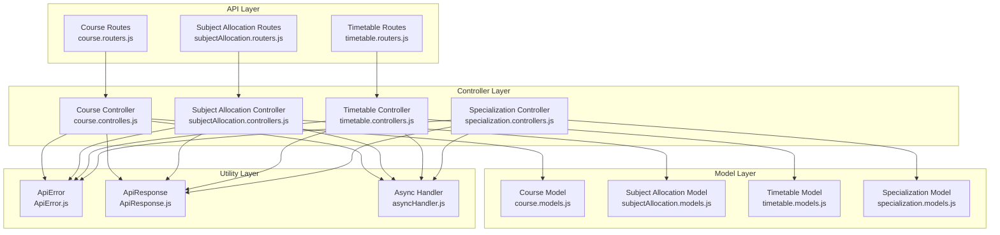
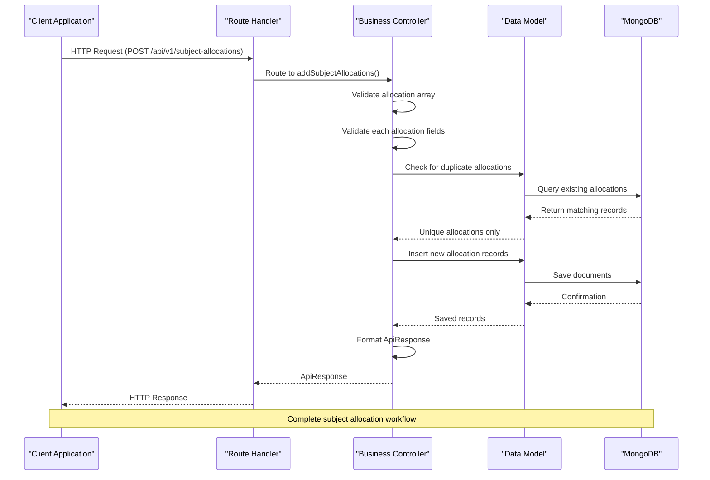
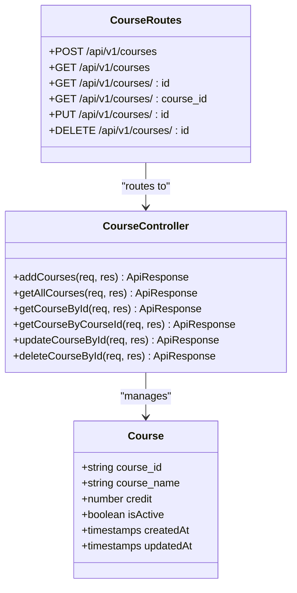
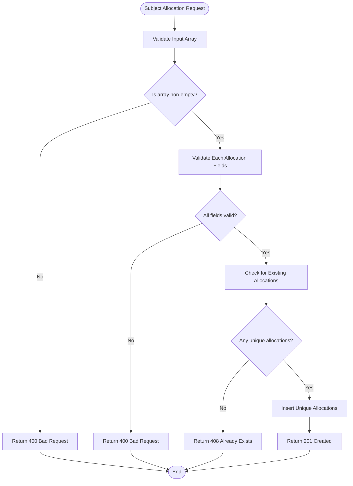
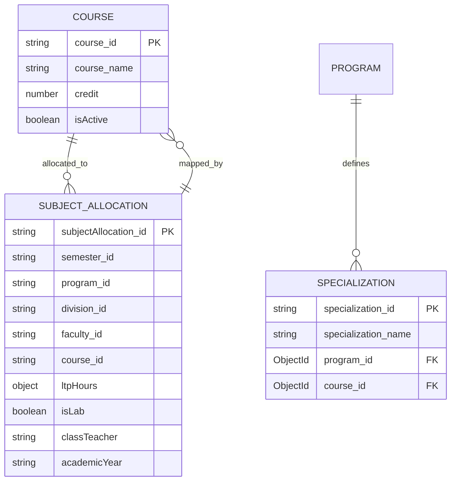
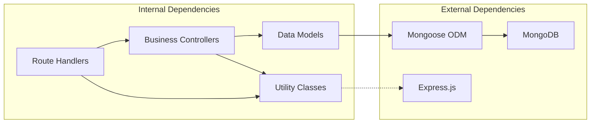

# Course & Subject Management Endpoints

<cite>
**Referenced Files in This Document**
- [course.controlles.js](file://Backend/src/controllers/course.controlles.js)
- [course.models.js](file://Backend/src/models/course.models.js)
- [course.routers.js](file://Backend/src/routes/course.routers.js)
- [subjectAllocation.controllers.js](file://Backend/src/controllers/subjectAllocation.controllers.js)
- [subjectAllocation.routers.js](file://Backend/src/routes/subjectAllocation.routers.js)
- [subjectAllocation.models.js](file://Backend/src/models/subjectAllocation.models.js)
- [specialization.controllers.js](file://Backend/src/controllers/specialization.controllers.js)
- [specialization.models.js](file://Backend/src/models/specialization.models.js)
- [timetable.controllers.js](file://Backend/src/controllers/timetable.controllers.js)
- [timetable.routers.js](file://Backend/src/routes/timetable.routers.js)
- [ApiError.js](file://Backend/src/utils/ApiError.js)
- [ApiResponse.js](file://Backend/src/utils/ApiResponse.js)
- [asyncHandler.js](file://Backend/src/utils/asyncHandler.js)
</cite>

## Update Summary
**Changes Made**
- Removed subject management endpoints section as subject management system has been completely removed
- Added new subject allocation endpoints section reflecting integration with timetable system
- Updated architecture overview to reflect new subject allocation workflow
- Revised dependency analysis to remove subject management dependencies
- Updated troubleshooting guide to reflect new subject allocation error scenarios

## Table of Contents
1. [Introduction](#introduction)
2. [Project Structure](#project-structure)
3. [Core Components](#core-components)
4. [Architecture Overview](#architecture-overview)
5. [Detailed Component Analysis](#detailed-component-analysis)
6. [Dependency Analysis](#dependency-analysis)
7. [Performance Considerations](#performance-considerations)
8. [Troubleshooting Guide](#troubleshooting-guide)
9. [Conclusion](#conclusion)

## Introduction
This document provides comprehensive API documentation for course and subject allocation management endpoints in the timetable management system. It covers course CRUD operations including course catalog management, credit hour tracking, and prerequisite relationships. The system now integrates subject allocation functionality directly into the timetable management workflow with enhanced validation and allocation capabilities. The documentation includes request/response schemas, validation rules for course codes and subject allocation identifiers, and relationship endpoints between courses, subject allocations, and timetables.

## Project Structure
The backend follows a layered architecture with clear separation of concerns:
- Routes define endpoint URLs and HTTP methods
- Controllers handle business logic and coordinate between models and responses
- Models define MongoDB schemas and data structures
- Utilities provide shared error handling and response formatting



**Diagram sources**
- [course.routers.js:1-24](file://Backend/src/routes/course.routers.js#L1-L24)
- [subjectAllocation.routers.js:1-21](file://Backend/src/routes/subjectAllocation.routers.js#L1-L21)
- [timetable.routers.js](file://Backend/src/routes/timetable.routers.js)
- [course.controlles.js:1-136](file://Backend/src/controllers/course.controlles.js#L1-L136)
- [subjectAllocation.controllers.js:1-119](file://Backend/src/controllers/subjectAllocation.controllers.js#L1-L119)
- [timetable.controllers.js](file://Backend/src/controllers/timetable.controllers.js)
- [specialization.controllers.js:1-121](file://Backend/src/controllers/specialization.controllers.js#L1-L121)
- [course.models.js:1-32](file://Backend/src/models/course.models.js#L1-L32)
- [subjectAllocation.models.js:1-68](file://Backend/src/models/subjectAllocation.models.js#L1-L68)
- [timetable.models.js](file://Backend/src/models/timetable.models.js)
- [specialization.models.js:1-26](file://Backend/src/models/specialization.models.js#L1-L26)
- [ApiError.js:1-21](file://Backend/src/utils/ApiError.js#L1-L21)
- [ApiResponse.js:1-10](file://Backend/src/utils/ApiResponse.js#L1-L10)
- [asyncHandler.js:1-4](file://Backend/src/utils/asyncHandler.js#L1-L4)

**Section sources**
- [course.routers.js:1-24](file://Backend/src/routes/course.routers.js#L1-L24)
- [subjectAllocation.routers.js:1-21](file://Backend/src/routes/subjectAllocation.routers.js#L1-L21)
- [timetable.routers.js](file://Backend/src/routes/timetable.routers.js)
- [course.controlles.js:1-136](file://Backend/src/controllers/course.controlles.js#L1-L136)
- [subjectAllocation.controllers.js:1-119](file://Backend/src/controllers/subjectAllocation.controllers.js#L1-L119)
- [timetable.controllers.js](file://Backend/src/controllers/timetable.controllers.js)
- [specialization.controllers.js:1-121](file://Backend/src/controllers/specialization.controllers.js#L1-L121)

## Core Components
This section outlines the primary components involved in course and subject allocation management:

### Course Management
The course management system provides comprehensive CRUD operations with strict validation and duplicate prevention mechanisms. Courses are identified by unique course codes and maintain credit hour information along with active status tracking.

### Subject Allocation Management  
Subject allocation management handles the assignment of subjects to semesters, programs, divisions, and faculty members within the timetable system. The system supports bulk subject allocation creation with comprehensive validation for allocation identifiers, academic year tracking, and LTP (Lecture-Tutorial-Practical) hour distribution.

### Timetable Integration
The subject allocation system is fully integrated with the timetable management system, enabling seamless coordination between subject assignments and scheduled classes. This integration provides enhanced validation and allocation capabilities for academic planning.

### Specialization Management
Specialization management coordinates course-specific specializations with program associations, enabling academic track alignment and prerequisite mapping.

**Section sources**
- [course.models.js:1-32](file://Backend/src/models/course.models.js#L1-L32)
- [course.controlles.js:1-136](file://Backend/src/controllers/course.controlles.js#L1-L136)
- [subjectAllocation.models.js:1-68](file://Backend/src/models/subjectAllocation.models.js#L1-L68)
- [subjectAllocation.controllers.js:1-119](file://Backend/src/controllers/subjectAllocation.controllers.js#L1-L119)
- [specialization.models.js:1-26](file://Backend/src/models/specialization.models.js#L1-L26)

## Architecture Overview
The system implements a clean architecture pattern with clear separation between presentation, business logic, and data persistence layers. The subject allocation system is now tightly integrated with the timetable management workflow.



**Diagram sources**
- [subjectAllocation.routers.js:12-18](file://Backend/src/routes/subjectAllocation.routers.js#L12-L18)
- [subjectAllocation.controllers.js:7-47](file://Backend/src/controllers/subjectAllocation.controllers.js#L7-L47)
- [subjectAllocation.models.js:3-65](file://Backend/src/models/subjectAllocation.models.js#L3-L65)

**Section sources**
- [subjectAllocation.routers.js:1-21](file://Backend/src/routes/subjectAllocation.routers.js#L1-L21)
- [subjectAllocation.controllers.js:1-119](file://Backend/src/controllers/subjectAllocation.controllers.js#L1-L119)

## Detailed Component Analysis

### Course Management Endpoints

#### Course Registration Endpoint
The course registration endpoint accepts bulk course creation with comprehensive validation and duplicate prevention.

**Endpoint:** `POST /api/v1/courses`
**Description:** Registers multiple courses in a single request with validation for required fields and duplicate prevention.

**Request Body Schema:**
```javascript
[
  {
    "course_id": "string",      // Required - Unique course identifier (uppercase, trimmed)
    "course_name": "string",    // Required - Course name (uppercase, trimmed)
    "credit": number,           // Required - Credit hours (positive integer)
    "isActive": boolean         // Optional - Active status (default: true)
  }
]
```

**Validation Rules:**
- `course_id`: Required, unique, uppercase, trimmed
- `course_name`: Required, uppercase, trimmed  
- `credit`: Required, positive number
- Input must be a non-empty array

**Response Schema:**
```javascript
{
  "statusCode": number,
  "data": [Course],
  "message": "string",
  "success": boolean
}
```

**Success Response:** `201 Created`
**Error Responses:**
- `400 Bad Request`: Invalid input format or missing fields
- `408 Already Exists`: All provided courses already exist
- `404 Not Found`: No courses found (for GET operations)

#### Course Retrieval Endpoints
Multiple retrieval endpoints support different identification methods:

**GET /api/v1/courses** - Retrieve all courses
**GET /api/v1/courses/:id** - Retrieve course by MongoDB ObjectId
**GET /api/v1/courses/:course_id** - Retrieve course by course code

**Response Schema:** Same as registration response but with single course object.

#### Course Update Endpoint
**Endpoint:** `PUT /api/v1/courses/:id`
**Description:** Updates course information with partial updates supported.

**Request Body Schema:**
```javascript
{
  "course_id": "string",
  "course_name": "string", 
  "credit": number,
  "isActive": boolean
}
```

**Response Schema:** Updated course object with success status.

#### Course Deletion Endpoint
**Endpoint:** `DELETE /api/v1/courses/:id`
**Description:** Removes course by ObjectId with cascade effect on related records.

**Response Schema:** Deleted course object with success confirmation.



**Diagram sources**
- [course.models.js:3-29](file://Backend/src/models/course.models.js#L3-L29)
- [course.controlles.js:1-136](file://Backend/src/controllers/course.controlles.js#L1-L136)
- [course.routers.js:13-21](file://Backend/src/routes/course.routers.js#L13-L21)

**Section sources**
- [course.controlles.js:5-40](file://Backend/src/controllers/course.controlles.js#L5-L40)
- [course.controlles.js:43-91](file://Backend/src/controllers/course.controlles.js#L43-L91)
- [course.controlles.js:94-134](file://Backend/src/controllers/course.controlles.js#L94-L134)
- [course.models.js:3-29](file://Backend/src/models/course.models.js#L3-L29)
- [course.routers.js:13-21](file://Backend/src/routes/course.routers.js#L13-L21)

### Subject Allocation Management Endpoints

#### Subject Allocation Registration Endpoint
**Endpoint:** `POST /api/v1/subject-allocations`
**Description:** Bulk subject allocation registration with comprehensive validation for allocation identifiers, academic year tracking, and LTP hour distribution.

**Request Body Schema:**
```javascript
[
  {
    "subjectAllocation_id": "string",  // Required - Unique allocation identifier
    "semester_id": "string",           // Required - Semester reference
    "program_id": "string",            // Required - Program reference
    "division_id": "string",           // Required - Division reference
    "faculty_id": "string",            // Required - Faculty member
    "course_id": "string",             // Required - Course reference
    "ltpHours": {                      // Required - LTP hour distribution
      "l": number,                     // Lecture hours
      "t": number,                     // Tutorial hours  
      "p": number                      // Practical hours
    },
    "isLab": boolean,                  // Optional - Lab allocation flag
    "classTeacher": "string",          // Required - Class teacher assignment
    "academicYear": "string"           // Required - Academic year
  }
]
```

**Validation Rules:**
- `subjectAllocation_id`: Required, unique identifier, uppercase, trimmed
- All required fields must be present for each allocation
- `ltpHours` must contain all three components (l, t, p)
- Input must be a non-empty array
- Duplicate allocation IDs are prevented

**Response Schema:**
```javascript
{
  "statusCode": number,
  "data": [SubjectAllocation],
  "message": "string",
  "success": boolean
}
```

**Success Response:** `201 Created`
**Error Responses:**
- `400 Bad Request`: Invalid input format, missing required fields, or invalid LTP distribution
- `408 Already Exists`: All provided allocations already exist
- `404 Not Found`: No allocations found (for GET operations)

#### Subject Allocation Retrieval Endpoints
**GET /api/v1/subject-allocations** - Retrieve all subject allocations
**GET /api/v1/subject-allocations/:id** - Retrieve subject allocation by ObjectId

**Response Schema:** Array of subject allocation objects with pagination metadata.

#### Subject Allocation Update Endpoint
**Endpoint:** `PUT /api/v1/subject-allocations/:id`
**Description:** Partial updates for subject allocation information.

**Request Body Schema:**
```javascript
{
  "semester_id": "string",
  "program_id": "string", 
  "division_id": "string",
  "faculty_id": "string",
  "course_id": "string",
  "ltpHours": {
    "l": number,
    "t": number,
    "p": number
  },
  "isLab": boolean,
  "classTeacher": "string",
  "academicYear": "string"
}
```

**Response Schema:** Updated subject allocation object with success confirmation.

#### Subject Allocation Deletion Endpoint
**Endpoint:** `DELETE /api/v1/subject-allocations/:id`
**Description:** Removes subject allocation by ObjectId.

**Response Schema:** Deleted subject allocation object with success message.



**Diagram sources**
- [subjectAllocation.controllers.js:10-47](file://Backend/src/controllers/subjectAllocation.controllers.js#L10-L47)

**Section sources**
- [subjectAllocation.controllers.js:7-47](file://Backend/src/controllers/subjectAllocation.controllers.js#L7-L47)
- [subjectAllocation.controllers.js:50-77](file://Backend/src/controllers/subjectAllocation.controllers.js#L50-L77)
- [subjectAllocation.controllers.js:80-103](file://Backend/src/controllers/subjectAllocation.controllers.js#L80-L103)
- [subjectAllocation.controllers.js:106-118](file://Backend/src/controllers/subjectAllocation.controllers.js#L106-L118)
- [subjectAllocation.routers.js:12-18](file://Backend/src/routes/subjectAllocation.routers.js#L12-L18)

### Specialization Management Endpoints

#### Specialization Registration Endpoint
**Endpoint:** `POST /api/v1/specializations`
**Description:** Creates specializations aligned with courses and programs.

**Request Body Schema:**
```javascript
[
  {
    "specialization_name": "string",  // Required - Specialization name
    "program_id": "ObjectId",         // Required - Program reference
    "course_id": "ObjectId"           // Required - Course reference
  }
]
```

**Response Schema:**
```javascript
{
  "success": boolean,
  "message": "string",
  "data": [Specialization]
}
```

#### Specialization Retrieval Endpoints
**GET /api/v1/specializations** - Retrieve all specializations with program and course populated
**GET /api/v1/specializations/:id** - Retrieve specific specialization with population

**Response Schema:** Array of specializations with associated program and course details.

#### Specialization Update Endpoint
**Endpoint:** `PUT /api/v1/specializations/:id`
**Description:** Updates specialization name, program, or course association.

**Request Body Schema:**
```javascript
{
  "specialization_name": "string",
  "program_id": "ObjectId",
  "course_id": "ObjectId"
}
```

**Response Schema:** Updated specialization object with success confirmation.

#### Specialization Deletion Endpoint
**Endpoint:** `DELETE /api/v1/specializations/:id`
**Description:** Removes specialization with cascade effects.

**Response Schema:** Deleted specialization object with success message.

**Section sources**
- [specialization.controllers.js:6-41](file://Backend/src/controllers/specialization.controllers.js#L6-L41)
- [specialization.controllers.js:44-69](file://Backend/src/controllers/specialization.controllers.js#L44-L69)
- [specialization.controllers.js:72-101](file://Backend/src/controllers/specialization.controllers.js#L72-L101)
- [specialization.controllers.js:104-119](file://Backend/src/controllers/specialization.controllers.js#L104-L119)

### Prerequisite Relationship Management
While the current implementation focuses on basic CRUD operations, the data models support prerequisite relationships through foreign key references. The system can be extended to include:



**Diagram sources**
- [course.models.js:5-22](file://Backend/src/models/course.models.js#L5-L22)
- [subjectAllocation.models.js:5-62](file://Backend/src/models/subjectAllocation.models.js#L5-L62)
- [specialization.models.js:5-20](file://Backend/src/models/specialization.models.js#L5-L20)

## Dependency Analysis
The system exhibits strong modularity with clear dependency relationships. The subject management system has been removed and replaced with subject allocation integration.



**Diagram sources**
- [course.routers.js:1-24](file://Backend/src/routes/course.routers.js#L1-L24)
- [subjectAllocation.routers.js:1-21](file://Backend/src/routes/subjectAllocation.routers.js#L1-L21)
- [course.controlles.js:1-3](file://Backend/src/controllers/course.controlles.js#L1-L3)
- [subjectAllocation.controllers.js:1-4](file://Backend/src/controllers/subjectAllocation.controllers.js#L1-L4)
- [course.models.js:1](file://Backend/src/models/course.models.js#L1)
- [subjectAllocation.models.js:1](file://Backend/src/models/subjectAllocation.models.js#L1)

**Section sources**
- [course.routers.js:1-24](file://Backend/src/routes/course.routers.js#L1-L24)
- [subjectAllocation.routers.js:1-21](file://Backend/src/routes/subjectAllocation.routers.js#L1-L21)
- [course.controlles.js:1-3](file://Backend/src/controllers/course.controlles.js#L1-L3)
- [subjectAllocation.controllers.js:1-4](file://Backend/src/controllers/subjectAllocation.controllers.js#L1-L4)
- [course.models.js:1](file://Backend/src/models/course.models.js#L1)
- [subjectAllocation.models.js:1](file://Backend/src/models/subjectAllocation.models.js#L1)

## Performance Considerations
The system implements several performance optimizations:

### Asynchronous Processing
- All route handlers use async/await pattern for non-blocking operations
- Database queries are optimized with proper indexing on frequently queried fields
- Batch operations reduce database round trips for bulk operations

### Memory Management
- Input validation prevents unnecessary processing of invalid data
- Duplicate detection filters out existing records before insertion
- Proper error handling prevents memory leaks from unhandled exceptions

### Scalability Features
- Modular architecture enables horizontal scaling
- Utility functions provide centralized error handling
- Response formatting ensures consistent API behavior

## Troubleshooting Guide

### Common Error Scenarios

#### Validation Errors
**Issue:** `400 Bad Request` responses during course/subject allocation creation
**Causes:**
- Missing required fields in request body
- Invalid data types (non-array for bulk operations)
- Missing LTP hour components
- Invalid allocation identifiers

**Solutions:**
- Verify all required fields are present
- Ensure bulk operations send arrays
- Check LTP hour distribution contains all three components (l, t, p)
- Validate allocation IDs follow institutional standards

#### Resource Not Found
**Issue:** `404 Not Found` responses for GET operations
**Causes:**
- Non-existent ObjectId format
- Incorrect course/subject allocation IDs
- Database connection issues

**Solutions:**
- Validate ObjectId format using proper MongoDB ObjectId
- Verify course/subject allocation IDs match stored values
- Check database connectivity and authentication

#### Duplicate Resource Errors
**Issue:** `408 Already Exists` for course registration or subject allocation
**Causes:**
- Attempting to register existing course codes or allocation IDs
- Conflicting identifiers

**Solutions:**
- Check existing course catalog or allocation records before registration
- Use unique identifiers following institutional standards

### Debugging Strategies

#### Logging and Monitoring
- Enable verbose logging for development environments
- Monitor database query performance
- Track API response times and error rates

#### Data Validation
- Implement client-side validation before API calls
- Use API documentation examples as reference
- Test with small datasets before bulk operations

**Section sources**
- [ApiError.js:1-21](file://Backend/src/utils/ApiError.js#L1-L21)
- [ApiResponse.js:1-10](file://Backend/src/utils/ApiResponse.js#L1-L10)
- [asyncHandler.js:1-4](file://Backend/src/utils/asyncHandler.js#L1-L4)

## Conclusion
The course and subject allocation management system provides a robust foundation for academic course catalog and timetable management with comprehensive CRUD operations, strict validation, and flexible data modeling. The system has evolved to integrate subject allocation directly into the timetable management workflow, eliminating the separate subject management system while maintaining comprehensive functionality. The modular architecture ensures maintainability and extensibility for future enhancements including advanced timetable scheduling, academic program alignment, and enhanced allocation validation. The system's design supports both current requirements and future scalability needs for comprehensive timetable management solutions.