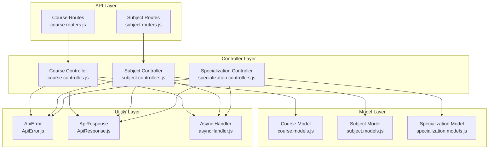
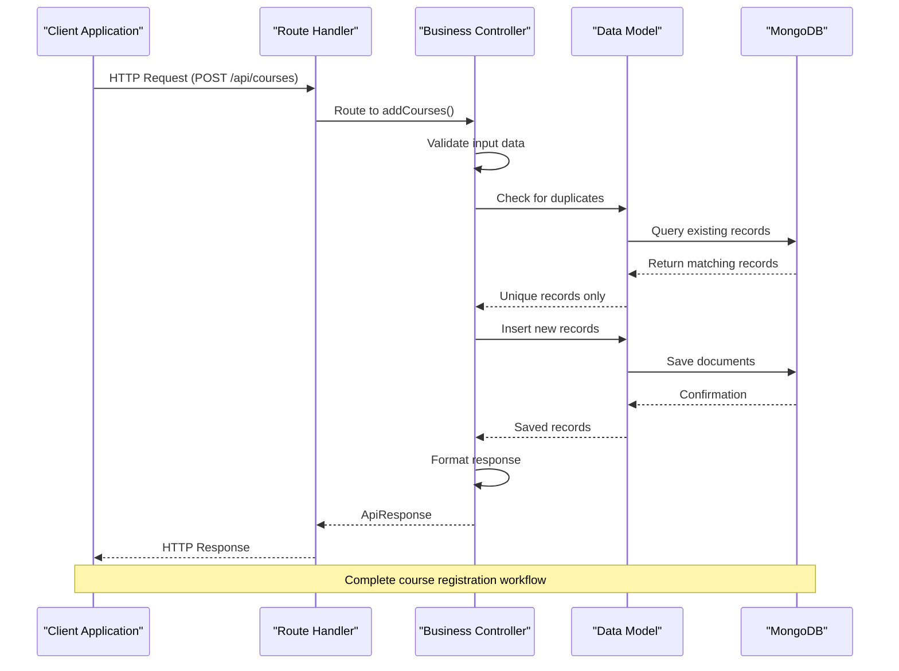
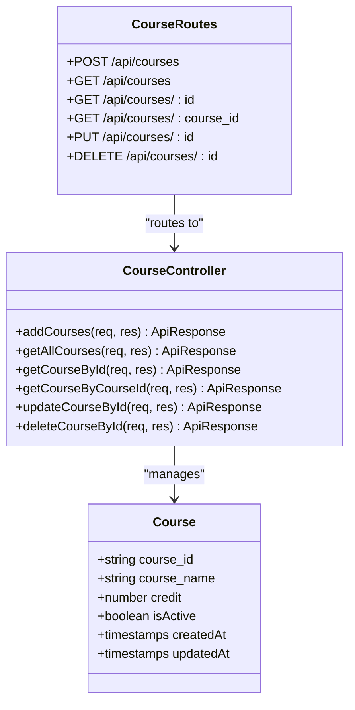
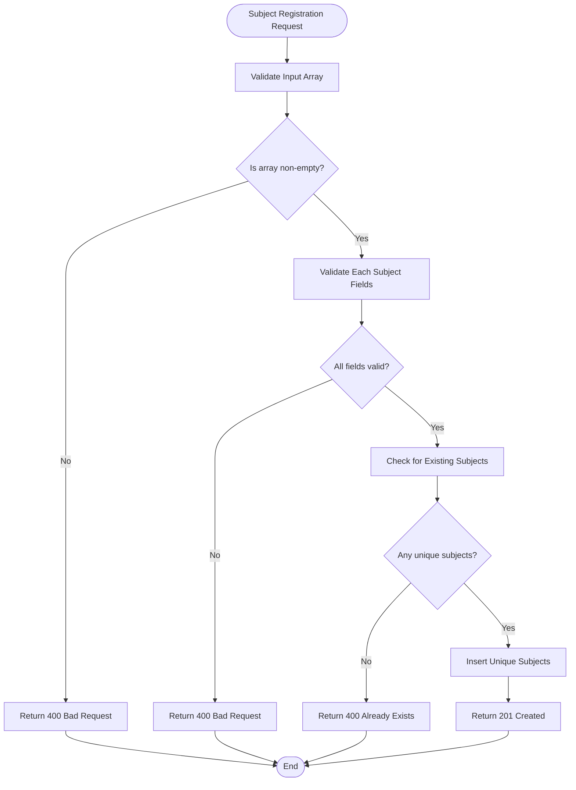
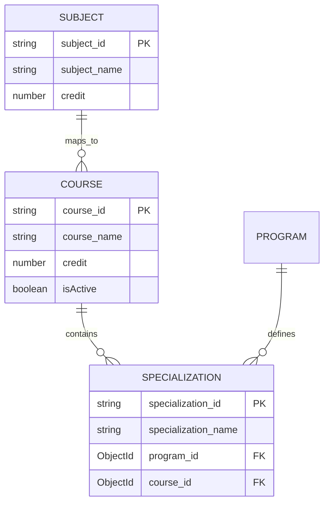
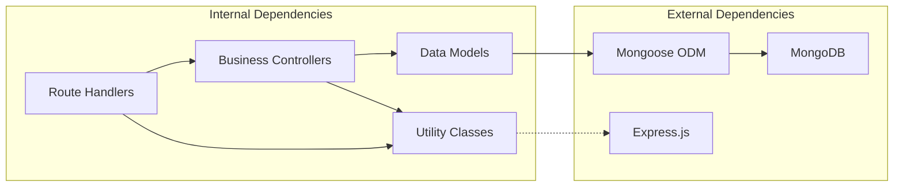

# Course & Subject Management Endpoints

<cite>
**Referenced Files in This Document**
- [course.controlles.js](file://Backend/src/controllers/course.controlles.js)
- [course.models.js](file://Backend/src/models/course.models.js)
- [course.routers.js](file://Backend/src/routes/course.routers.js)
- [subject.controllers.js](file://Backend/src/controllers/subject.controllers.js)
- [subject.routers.js](file://Backend/src/routes/subject.routers.js)
- [specialization.controllers.js](file://Backend/src/controllers/specialization.controllers.js)
- [specialization.models.js](file://Backend/src/models/specialization.models.js)
- [ApiError.js](file://Backend/src/utils/ApiError.js)
- [ApiResponse.js](file://Backend/src/utils/ApiResponse.js)
- [asyncHandler.js](file://Backend/src/utils/asyncHandler.js)
</cite>

## Table of Contents
1. [Introduction](#introduction)
2. [Project Structure](#project-structure)
3. [Core Components](#core-components)
4. [Architecture Overview](#architecture-overview)
5. [Detailed Component Analysis](#detailed-component-analysis)
6. [Dependency Analysis](#dependency-analysis)
7. [Performance Considerations](#performance-considerations)
8. [Troubleshooting Guide](#troubleshooting-guide)
9. [Conclusion](#conclusion)

## Introduction
This document provides comprehensive API documentation for course and subject management endpoints in the timetable management system. It covers course CRUD operations including course catalog management, credit hour tracking, and prerequisite relationships. It also documents subject management endpoints for subject mapping, specialization alignment, and academic prerequisites. The documentation includes request/response schemas, validation rules for course codes and subject names, and relationship endpoints between courses, subjects, and specializations.

## Project Structure
The backend follows a layered architecture with clear separation of concerns:
- Routes define endpoint URLs and HTTP methods
- Controllers handle business logic and coordinate between models and responses
- Models define MongoDB schemas and data structures
- Utilities provide shared error handling and response formatting



**Diagram sources**
- [course.routers.js:1-24](file://Backend/src/routes/course.routers.js#L1-L24)
- [subject.routers.js:1-24](file://Backend/src/routes/subject.routers.js#L1-L24)
- [course.controlles.js:1-136](file://Backend/src/controllers/course.controlles.js#L1-L136)
- [subject.controllers.js:1-130](file://Backend/src/controllers/subject.controllers.js#L1-L130)
- [specialization.controllers.js:1-121](file://Backend/src/controllers/specialization.controllers.js#L1-L121)
- [course.models.js:1-32](file://Backend/src/models/course.models.js#L1-L32)
- [specialization.models.js:1-26](file://Backend/src/models/specialization.models.js#L1-L26)
- [ApiError.js:1-21](file://Backend/src/utils/ApiError.js#L1-L21)
- [ApiResponse.js:1-10](file://Backend/src/utils/ApiResponse.js#L1-L10)
- [asyncHandler.js:1-4](file://Backend/src/utils/asyncHandler.js#L1-L4)

**Section sources**
- [course.routers.js:1-24](file://Backend/src/routes/course.routers.js#L1-L24)
- [subject.routers.js:1-24](file://Backend/src/routes/subject.routers.js#L1-L24)
- [course.controlles.js:1-136](file://Backend/src/controllers/course.controlles.js#L1-L136)
- [subject.controllers.js:1-130](file://Backend/src/controllers/subject.controllers.js#L1-L130)
- [specialization.controllers.js:1-121](file://Backend/src/controllers/specialization.controllers.js#L1-L121)

## Core Components
This section outlines the primary components involved in course and subject management:

### Course Management
The course management system provides comprehensive CRUD operations with strict validation and duplicate prevention mechanisms. Courses are identified by unique course codes and maintain credit hour information along with active status tracking.

### Subject Management  
Subject management handles individual subject registration with validation for subject identifiers, names, and credit hours. The system supports bulk subject creation and maintains referential integrity with course catalogs.

### Specialization Management
Specialization management coordinates course-specific specializations with program associations, enabling academic track alignment and prerequisite mapping.

**Section sources**
- [course.models.js:1-32](file://Backend/src/models/course.models.js#L1-L32)
- [course.controlles.js:1-136](file://Backend/src/controllers/course.controlles.js#L1-L136)
- [subject.controllers.js:1-130](file://Backend/src/controllers/subject.controllers.js#L1-L130)
- [specialization.models.js:1-26](file://Backend/src/models/specialization.models.js#L1-L26)

## Architecture Overview
The system implements a clean architecture pattern with clear separation between presentation, business logic, and data persistence layers.



**Diagram sources**
- [course.routers.js:13-21](file://Backend/src/routes/course.routers.js#L13-L21)
- [course.controlles.js:5-40](file://Backend/src/controllers/course.controlles.js#L5-L40)
- [course.models.js:1-32](file://Backend/src/models/course.models.js#L1-L32)

**Section sources**
- [course.routers.js:1-24](file://Backend/src/routes/course.routers.js#L1-L24)
- [course.controlles.js:1-136](file://Backend/src/controllers/course.controlles.js#L1-L136)

## Detailed Component Analysis

### Course Management Endpoints

#### Course Registration Endpoint
The course registration endpoint accepts bulk course creation with comprehensive validation and duplicate prevention.

**Endpoint:** `POST /api/courses`
**Description:** Registers multiple courses in a single request with validation for required fields and duplicate prevention.

**Request Body Schema:**
```javascript
[
  {
    "course_id": "string",      // Required - Unique course identifier (uppercase, trimmed)
    "course_name": "string",    // Required - Course name (uppercase, trimmed)
    "credit": number,           // Required - Credit hours (positive integer)
    "isActive": boolean         // Optional - Active status (default: true)
  }
]
```

**Validation Rules:**
- `course_id`: Required, unique, uppercase, trimmed
- `course_name`: Required, uppercase, trimmed  
- `credit`: Required, positive number
- Input must be a non-empty array

**Response Schema:**
```javascript
{
  "statusCode": number,
  "data": [Course],
  "message": "string",
  "success": boolean
}
```

**Success Response:** `201 Created`
**Error Responses:**
- `400 Bad Request`: Invalid input format or missing fields
- `408 Already Exists`: All provided courses already exist
- `404 Not Found`: No courses found (for GET operations)

#### Course Retrieval Endpoints
Multiple retrieval endpoints support different identification methods:

**GET /api/courses** - Retrieve all courses
**GET /api/courses/:id** - Retrieve course by MongoDB ObjectId
**GET /api/courses/:course_id** - Retrieve course by course code

**Response Schema:** Same as registration response but with single course object.

#### Course Update Endpoint
**Endpoint:** `PUT /api/courses/:id`
**Description:** Updates course information with partial updates supported.

**Request Body Schema:**
```javascript
{
  "course_id": "string",
  "course_name": "string", 
  "credit": number,
  "isActive": boolean
}
```

**Response Schema:** Updated course object with success status.

#### Course Deletion Endpoint
**Endpoint:** `DELETE /api/courses/:id`
**Description:** Removes course by ObjectId with cascade effect on related records.

**Response Schema:** Deleted course object with success confirmation.



**Diagram sources**
- [course.models.js:3-29](file://Backend/src/models/course.models.js#L3-L29)
- [course.controlles.js:1-136](file://Backend/src/controllers/course.controlles.js#L1-L136)
- [course.routers.js:13-21](file://Backend/src/routes/course.routers.js#L13-L21)

**Section sources**
- [course.controlles.js:5-40](file://Backend/src/controllers/course.controlles.js#L5-L40)
- [course.controlles.js:43-91](file://Backend/src/controllers/course.controlles.js#L43-L91)
- [course.controlles.js:94-134](file://Backend/src/controllers/course.controlles.js#L94-L134)
- [course.models.js:3-29](file://Backend/src/models/course.models.js#L3-L29)
- [course.routers.js:13-21](file://Backend/src/routes/course.routers.js#L13-L21)

### Subject Management Endpoints

#### Subject Registration Endpoint
**Endpoint:** `POST /api/subjects`
**Description:** Bulk subject registration with validation for subject identifiers, names, and credits.

**Request Body Schema:**
```javascript
[
  {
    "subject_id": "string",     // Required - Unique subject identifier
    "subject_name": "string",   // Required - Subject name
    "credit": number           // Required - Credit hours
  }
]
```

**Validation Rules:**
- `subject_id`: Required, unique identifier
- `subject_name`: Required, descriptive name
- `credit`: Required, positive number
- Input must be a non-empty array

**Response Schema:**
```javascript
{
  "success": boolean,
  "message": "string", 
  "data": [Subject]
}
```

#### Subject Retrieval Endpoints
**GET /api/subjects** - Retrieve all subjects
**GET /api/subjects/:id** - Retrieve subject by ObjectId
**GET /api/subjects/subject/:subject_id** - Retrieve subject by subject code

**Response Schema:** Array of subject objects with pagination metadata.

#### Subject Update Endpoint
**Endpoint:** `PUT /api/subjects/:id`
**Description:** Partial updates for subject information.

**Request Body Schema:**
```javascript
{
  "subject_id": "string",
  "subject_name": "string",
  "credit": number
}
```

**Response Schema:** Updated subject object with success confirmation.

#### Subject Deletion Endpoint
**Endpoint:** `DELETE /api/subjects/:id`
**Description:** Removes subject with cascade deletion of related allocations.

**Response Schema:** Deleted subject object with success message.



**Diagram sources**
- [subject.controllers.js:6-41](file://Backend/src/controllers/subject.controllers.js#L6-L41)

**Section sources**
- [subject.controllers.js:6-41](file://Backend/src/controllers/subject.controllers.js#L6-L41)
- [subject.controllers.js:44-88](file://Backend/src/controllers/subject.controllers.js#L44-L88)
- [subject.controllers.js:108-128](file://Backend/src/controllers/subject.controllers.js#L108-L128)
- [subject.routers.js:13-21](file://Backend/src/routes/subject.routers.js#L13-L21)

### Specialization Management Endpoints

#### Specialization Registration Endpoint
**Endpoint:** `POST /api/specializations`
**Description:** Creates specializations aligned with courses and programs.

**Request Body Schema:**
```javascript
[
  {
    "specialization_name": "string",  // Required - Specialization name
    "program_id": "ObjectId",         // Required - Program reference
    "course_id": "ObjectId"           // Required - Course reference
  }
]
```

**Response Schema:**
```javascript
{
  "success": boolean,
  "message": "string",
  "data": [Specialization]
}
```

#### Specialization Retrieval Endpoints
**GET /api/specializations** - Retrieve all specializations with program and course populated
**GET /api/specializations/:id** - Retrieve specific specialization with population

**Response Schema:** Array of specializations with associated program and course details.

#### Specialization Update Endpoint
**Endpoint:** `PUT /api/specializations/:id`
**Description:** Updates specialization name, program, or course association.

**Request Body Schema:**
```javascript
{
  "specialization_name": "string",
  "program_id": "ObjectId",
  "course_id": "ObjectId"
}
```

**Response Schema:** Updated specialization object with success confirmation.

#### Specialization Deletion Endpoint
**Endpoint:** `DELETE /api/specializations/:id`
**Description:** Removes specialization with cascade effects.

**Response Schema:** Deleted specialization object with success message.

**Section sources**
- [specialization.controllers.js:6-41](file://Backend/src/controllers/specialization.controllers.js#L6-L41)
- [specialization.controllers.js:44-69](file://Backend/src/controllers/specialization.controllers.js#L44-L69)
- [specialization.controllers.js:72-101](file://Backend/src/controllers/specialization.controllers.js#L72-L101)
- [specialization.controllers.js:104-119](file://Backend/src/controllers/specialization.controllers.js#L104-L119)

### Prerequisite Relationship Management
While the current implementation focuses on basic CRUD operations, the data models support prerequisite relationships through foreign key references. The system can be extended to include:



**Diagram sources**
- [course.models.js:5-22](file://Backend/src/models/course.models.js#L5-L22)
- [specialization.models.js:5-20](file://Backend/src/models/specialization.models.js#L5-L20)

## Dependency Analysis
The system exhibits strong modularity with clear dependency relationships:



**Diagram sources**
- [course.routers.js:1-24](file://Backend/src/routes/course.routers.js#L1-L24)
- [course.controlles.js:1-3](file://Backend/src/controllers/course.controlles.js#L1-L3)
- [course.models.js:1](file://Backend/src/models/course.models.js#L1)

**Section sources**
- [course.routers.js:1-24](file://Backend/src/routes/course.routers.js#L1-L24)
- [course.controlles.js:1-3](file://Backend/src/controllers/course.controlles.js#L1-L3)
- [course.models.js:1](file://Backend/src/models/course.models.js#L1)

## Performance Considerations
The system implements several performance optimizations:

### Asynchronous Processing
- All route handlers use async/await pattern for non-blocking operations
- Database queries are optimized with proper indexing on frequently queried fields
- Batch operations reduce database round trips for bulk operations

### Memory Management
- Input validation prevents unnecessary processing of invalid data
- Duplicate detection filters out existing records before insertion
- Proper error handling prevents memory leaks from unhandled exceptions

### Scalability Features
- Modular architecture enables horizontal scaling
- Utility functions provide centralized error handling
- Response formatting ensures consistent API behavior

## Troubleshooting Guide

### Common Error Scenarios

#### Validation Errors
**Issue:** `400 Bad Request` responses during course/subject creation
**Causes:**
- Missing required fields in request body
- Invalid data types (non-array for bulk operations)
- Duplicate course/subject identifiers

**Solutions:**
- Verify all required fields are present
- Ensure bulk operations send arrays
- Check for existing identifiers before submission

#### Resource Not Found
**Issue:** `404 Not Found` responses for GET operations
**Causes:**
- Non-existent ObjectId format
- Incorrect course/subject codes
- Database connection issues

**Solutions:**
- Validate ObjectId format using proper MongoDB ObjectId
- Verify course/subject codes match stored values
- Check database connectivity and authentication

#### Duplicate Resource Errors
**Issue:** `408 Already Exists` for course registration
**Causes:**
- Attempting to register existing course codes
- Conflicting course identifiers

**Solutions:**
- Check existing course catalog before registration
- Use unique course codes following institutional standards

### Debugging Strategies

#### Logging and Monitoring
- Enable verbose logging for development environments
- Monitor database query performance
- Track API response times and error rates

#### Data Validation
- Implement client-side validation before API calls
- Use API documentation examples as reference
- Test with small datasets before bulk operations

**Section sources**
- [ApiError.js:1-21](file://Backend/src/utils/ApiError.js#L1-L21)
- [ApiResponse.js:1-10](file://Backend/src/utils/ApiResponse.js#L1-L10)
- [asyncHandler.js:1-4](file://Backend/src/utils/asyncHandler.js#L1-L4)

## Conclusion
The course and subject management system provides a robust foundation for academic course catalog management with comprehensive CRUD operations, strict validation, and flexible data modeling. The modular architecture ensures maintainability and extensibility for future enhancements including advanced prerequisite relationships, course scheduling integration, and academic program alignment. The system's design supports both current requirements and future scalability needs for comprehensive timetable management solutions.