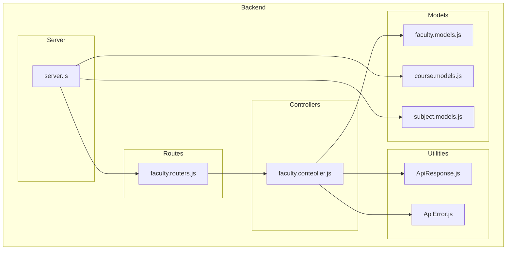
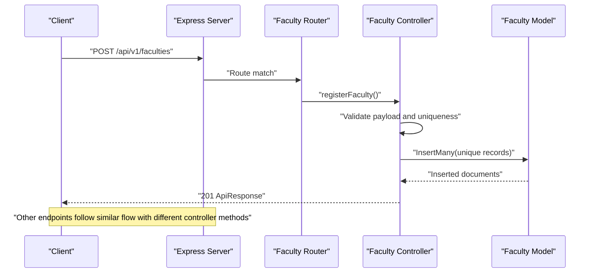
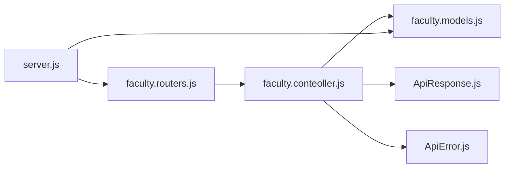

# Faculty Management Endpoints

<cite>
**Referenced Files in This Document**
- [faculty.routers.js](file://Backend/src/routes/faculty.routers.js)
- [faculty.conteoller.js](file://Backend/src/controllers/faculty.conteoller.js)
- [faculty.models.js](file://Backend/src/models/faculty.models.js)
- [server.js](file://Backend/src/server.js)
- [ApiResponse.js](file://Backend/src/utils/ApiResponse.js)
- [ApiError.js](file://Backend/src/utils/ApiError.js)
- [course.models.js](file://Backend/src/models/course.models.js)
- [subject.models.js](file://Backend/src/models/subject.models.js)
</cite>

## Table of Contents
1. [Introduction](#introduction)
2. [Project Structure](#project-structure)
3. [Core Components](#core-components)
4. [Architecture Overview](#architecture-overview)
5. [Detailed Component Analysis](#detailed-component-analysis)
6. [Dependency Analysis](#dependency-analysis)
7. [Performance Considerations](#performance-considerations)
8. [Troubleshooting Guide](#troubleshooting-guide)
9. [Conclusion](#conclusion)

## Introduction
This document provides comprehensive API documentation for the faculty management endpoints. It covers CRUD operations for faculty members, including registration, profile retrieval, updates, and deletion. It also documents the request/response schemas, validation rules, and current endpoint capabilities. The documentation includes faculty-specific fields, department associations, qualification management, and relationship endpoints with courses and subjects.

## Project Structure
The faculty management module is organized into three primary layers:
- Routes: Define HTTP endpoints and bind them to controller functions.
- Controllers: Implement business logic, validation, and database interactions.
- Models: Define the data schema for faculty and related entities.

**Diagram sources**
- [faculty.routers.js:1-20](file://Backend/src/routes/faculty.routers.js#L1-L20)
- [faculty.conteoller.js:1-229](file://Backend/src/controllers/faculty.conteoller.js#L1-L229)
- [faculty.models.js:1-77](file://Backend/src/models/faculty.models.js#L1-L77)
- [course.models.js:1-33](file://Backend/src/models/course.models.js#L1-L33)
- [subject.models.js:1-33](file://Backend/src/models/subject.models.js#L1-L33)
- [ApiResponse.js:1-10](file://Backend/src/utils/ApiResponse.js#L1-L10)
- [ApiError.js:1-21](file://Backend/src/utils/ApiError.js#L1-L21)
- [server.js:1-54](file://Backend/src/server.js#L1-L54)

**Section sources**
- [faculty.routers.js:1-20](file://Backend/src/routes/faculty.routers.js#L1-L20)
- [faculty.conteoller.js:1-229](file://Backend/src/controllers/faculty.conteoller.js#L1-L229)
- [faculty.models.js:1-77](file://Backend/src/models/faculty.models.js#L1-L77)
- [server.js:1-54](file://Backend/src/server.js#L1-L54)

## Core Components
- Faculty Model: Defines the schema for faculty records, including identifiers, personal details, contact information, qualifications, experience, gender, join date, birth date, address, and activity status.
- Faculty Controller: Implements endpoints for bulk registration, fetching all faculty, fetching by ID, updating, and deleting faculty.
- Faculty Routes: Exposes REST endpoints under the base path for faculty management.
- ApiResponse and ApiError Utilities: Standardize response and error structures.

Key validation rules and constraints:
- faculty_id: Required, uppercase, unique.
- faculty_name: Required, lowercase, trimmed, indexed.
- email: Required, unique, lowercase, trimmed.
- phone: Required, numeric, unique.
- specialization: Required, lowercase, trimmed.
- higher_qualification: Required, lowercase, trimmed.
- years_of_Experience: Required, numeric.
- gender: Required, lowercase, trimmed.
- date_of_joining: Optional date with default current time.
- date_of_birth: Optional date.
- address: Required, trimmed.
- isActive: Boolean flag with default true.

**Section sources**
- [faculty.models.js:3-74](file://Backend/src/models/faculty.models.js#L3-L74)
- [faculty.conteoller.js:14-53](file://Backend/src/controllers/faculty.conteoller.js#L14-L53)
- [ApiResponse.js:1-10](file://Backend/src/utils/ApiResponse.js#L1-L10)
- [ApiError.js:1-21](file://Backend/src/utils/ApiError.js#L1-L21)

## Architecture Overview
The faculty management API follows a layered architecture:
- Server initializes Express, middleware, and mounts route modules.
- Routes define HTTP methods and paths.
- Controllers handle request validation, database operations, and response formatting.
- Models define data structures and constraints enforced by Mongoose.

**Diagram sources**
- [server.js:40-50](file://Backend/src/server.js#L40-L50)
- [faculty.routers.js:12-17](file://Backend/src/routes/faculty.routers.js#L12-L17)
- [faculty.conteoller.js:6-103](file://Backend/src/controllers/faculty.conteoller.js#L6-L103)
- [faculty.models.js:1-77](file://Backend/src/models/faculty.models.js#L1-L77)

## Detailed Component Analysis

### Base URL and Routing
- Base path: `/api/v1/faculties`
- Mounted in the server under the base path.

Endpoints:
- POST `/api/v1/faculties`: Bulk register faculty members.
- GET `/api/v1/faculties`: Retrieve all faculty members.
- GET `/api/v1/faculties/:id`: Retrieve a specific faculty member by ID.
- PUT `/api/v1/faculties/:id`: Update a specific faculty member by ID.
- DELETE `/api/v1/faculties/:id`: Delete a specific faculty member by ID.

Notes:
- Bulk registration expects an array of faculty objects.
- Individual operations require a valid ObjectId in the path parameter.

**Section sources**
- [server.js:40-50](file://Backend/src/server.js#L40-L50)
- [faculty.routers.js:12-17](file://Backend/src/routes/faculty.routers.js#L12-L17)

### Request and Response Schemas

#### POST /api/v1/faculties
Purpose:
- Bulk register multiple faculty members.

Request Body:
- Array of objects, each containing:
  - faculty_id (string, required, uppercase)
  - faculty_name (string, required, lowercase, trimmed)
  - email (string, required, unique, lowercase, trimmed)
  - phone (number, required, unique)
  - specialization (string, required, lowercase, trimmed)
  - higher_qualification (string, required, lowercase, trimmed)
  - years_of_Experience (number, required)
  - gender (string, required, lowercase, trimmed)
  - date_of_joining (date, optional)
  - date_of_birth (date, optional)
  - address (string, required, trimmed)
  - isActive (boolean, optional, default true)

Validation Rules:
- Payload must be a non-empty array.
- Each record must include all required fields.
- Unique constraints apply to faculty_id, email, and phone across the batch and existing records.

Success Response:
- Status: 201 Created
- Body: ApiResponse with inserted faculty records.

Error Responses:
- 400 Bad Request: Invalid or missing payload fields.
- 408 Already Reported: All provided records already exist.
- 500 Internal Server Error: Registration failure.

**Section sources**
- [faculty.conteoller.js:6-103](file://Backend/src/controllers/faculty.conteoller.js#L6-L103)
- [faculty.models.js:5-71](file://Backend/src/models/faculty.models.js#L5-L71)
- [ApiResponse.js:1-10](file://Backend/src/utils/ApiResponse.js#L1-L10)
- [ApiError.js:1-21](file://Backend/src/utils/ApiError.js#L1-L21)

#### GET /api/v1/faculties
Purpose:
- Fetch all faculty members.

Request Parameters:
- None.

Success Response:
- Status: 200 OK
- Body: ApiResponse with an array of faculty objects.

Error Responses:
- 404 Not Found: No faculty records found.

**Section sources**
- [faculty.conteoller.js:105-118](file://Backend/src/controllers/faculty.conteoller.js#L105-L118)
- [ApiResponse.js:1-10](file://Backend/src/utils/ApiResponse.js#L1-L10)
- [ApiError.js:1-21](file://Backend/src/utils/ApiError.js#L1-L21)

#### GET /api/v1/faculties/:id
Purpose:
- Retrieve a specific faculty member by ID.

Path Parameters:
- id (string, required): MongoDB ObjectId.

Success Response:
- Status: 200 OK
- Body: ApiResponse with the matching faculty object.

Error Responses:
- 404 Not Found: Missing or invalid ID, or faculty not found.

**Section sources**
- [faculty.conteoller.js:120-141](file://Backend/src/controllers/faculty.conteoller.js#L120-L141)
- [ApiResponse.js:1-10](file://Backend/src/utils/ApiResponse.js#L1-L10)
- [ApiError.js:1-21](file://Backend/src/utils/ApiError.js#L1-L21)

#### PUT /api/v1/faculties/:id
Purpose:
- Update an existing faculty member by ID.

Path Parameters:
- id (string, required): MongoDB ObjectId.

Request Body:
- Partial fields to update:
  - faculty_name, email, phone, specialization, higher_qualification,
  - years_of_Experience, gender, date_of_joining, date_of_birth, address, isActive.

Validation Rules:
- ID must be present and valid.
- At least one update field must be provided.

Success Response:
- Status: 200 OK
- Body: ApiResponse with the updated faculty object.

Error Responses:
- 404 Not Found: Missing or invalid ID, or faculty not found.

**Section sources**
- [faculty.conteoller.js:143-207](file://Backend/src/controllers/faculty.conteoller.js#L143-L207)
- [faculty.models.js:5-71](file://Backend/src/models/faculty.models.js#L5-L71)
- [ApiResponse.js:1-10](file://Backend/src/utils/ApiResponse.js#L1-L10)
- [ApiError.js:1-21](file://Backend/src/utils/ApiError.js#L1-L21)

#### DELETE /api/v1/faculties/:id
Purpose:
- Delete a faculty member by ID.

Path Parameters:
- id (string, required): MongoDB ObjectId.

Success Response:
- Status: 200 OK
- Body: ApiResponse with the deleted faculty object.

Error Responses:
- 404 Not Found: Missing or invalid ID, or faculty not found.

**Section sources**
- [faculty.conteoller.js:209-228](file://Backend/src/controllers/faculty.conteoller.js#L209-L228)
- [ApiResponse.js:1-10](file://Backend/src/utils/ApiResponse.js#L1-L10)
- [ApiError.js:1-21](file://Backend/src/utils/ApiError.js#L1-L21)

### Search and Filtering Capabilities
Current Implementation:
- Bulk registration supports uniqueness checks across provided records and existing database entries.
- General search/filter endpoints are not implemented in the current codebase.

Recommendations:
- Add query parameters for filtering (e.g., ?specialization=, ?isActive=).
- Add pagination support (e.g., ?page=&limit=).
- Implement text search on names or specializations.

[No sources needed since this section provides recommendations without analyzing specific files]

### Bulk Upload Functionality
- Implemented via POST /api/v1/faculties with an array payload.
- Validates each record against required fields and uniqueness constraints.
- Inserts only unique records not present in the database.

**Section sources**
- [faculty.conteoller.js:6-103](file://Backend/src/controllers/faculty.conteoller.js#L6-L103)
- [faculty.models.js:5-71](file://Backend/src/models/faculty.models.js#L5-L71)

### Relationship Endpoints with Courses and Subjects
Current Implementation:
- No dedicated relationship endpoints between faculty and courses/subjects are present in the current codebase.
- Course and Subject models exist independently.

Potential Endpoints (Proposed):
- GET /api/v1/faculties/:id/courses
- GET /api/v1/faculties/:id/subjects
- POST /api/v1/faculties/:id/courses
- POST /api/v1/faculties/:id/subjects

Implementation Notes:
- These would require extending the Faculty model with references to Course and Subject collections.
- Authorization and validation rules should mirror existing patterns.

**Section sources**
- [course.models.js:1-33](file://Backend/src/models/course.models.js#L1-L33)
- [subject.models.js:1-33](file://Backend/src/models/subject.models.js#L1-L33)

## Dependency Analysis
The faculty module depends on:
- Mongoose model for data persistence and schema enforcement.
- Express router/controller pattern for HTTP handling.
- Utility classes for standardized responses and error handling.

**Diagram sources**
- [faculty.routers.js:1-20](file://Backend/src/routes/faculty.routers.js#L1-L20)
- [faculty.conteoller.js:1-4](file://Backend/src/controllers/faculty.conteoller.js#L1-L4)
- [faculty.models.js:1-2](file://Backend/src/models/faculty.models.js#L1-L2)
- [ApiResponse.js:1-2](file://Backend/src/utils/ApiResponse.js#L1-L2)
- [ApiError.js:1-2](file://Backend/src/utils/ApiError.js#L1-L2)
- [server.js:25-50](file://Backend/src/server.js#L25-L50)

**Section sources**
- [faculty.routers.js:1-20](file://Backend/src/routes/faculty.routers.js#L1-L20)
- [faculty.conteoller.js:1-4](file://Backend/src/controllers/faculty.conteoller.js#L1-L4)
- [faculty.models.js:1-2](file://Backend/src/models/faculty.models.js#L1-L2)
- [ApiResponse.js:1-2](file://Backend/src/utils/ApiResponse.js#L1-L2)
- [ApiError.js:1-2](file://Backend/src/utils/ApiError.js#L1-L2)
- [server.js:25-50](file://Backend/src/server.js#L25-L50)

## Performance Considerations
- Bulk insertions use unordered mode to improve throughput; consider ordered mode if strict ordering is required.
- Uniqueness checks involve database queries; ensure indexes exist on faculty_id, email, and phone.
- Pagination should be introduced for GET /api/v1/faculties to handle large datasets efficiently.

[No sources needed since this section provides general guidance]

## Troubleshooting Guide
Common Issues and Resolutions:
- 400 Bad Request during bulk registration:
  - Ensure the payload is a non-empty array and each record includes all required fields.
- 408 Already Reported:
  - Some or all provided records already exist; remove duplicates or update existing records.
- 404 Not Found:
  - Verify the ObjectId format and existence for GET/PUT/DELETE requests.
- 500 Internal Server Error:
  - Check database connectivity and server logs for underlying failures.

**Section sources**
- [faculty.conteoller.js:14-103](file://Backend/src/controllers/faculty.conteoller.js#L14-L103)
- [ApiError.js:1-21](file://Backend/src/utils/ApiError.js#L1-L21)

## Conclusion
The faculty management endpoints provide a solid foundation for bulk registration, retrieval, updates, and deletions. The schema enforces strong validation and uniqueness constraints. Future enhancements should include search/filter capabilities, pagination, and explicit relationship endpoints with courses and subjects to support richer timetable workflows.