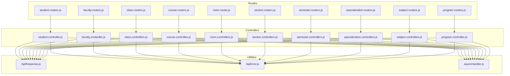
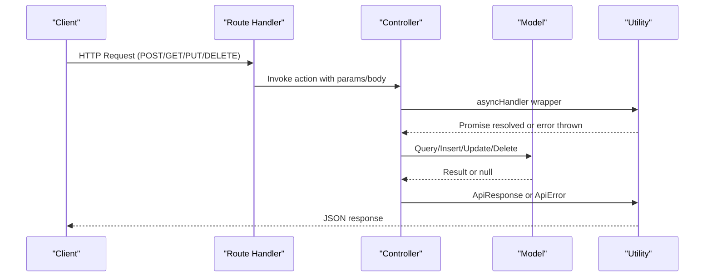
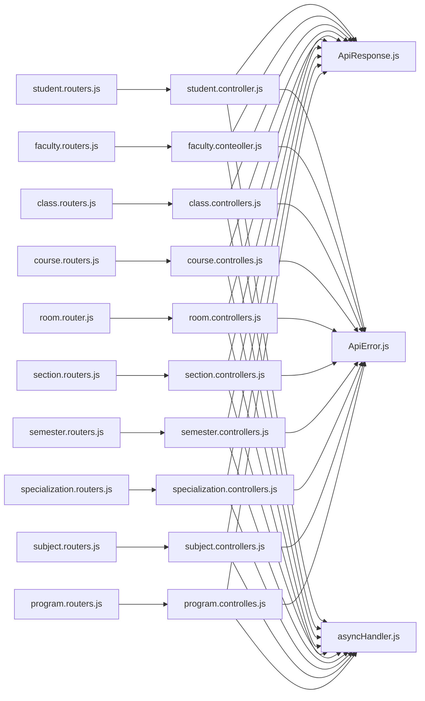

# Master Data Endpoints

<cite>
**Referenced Files in This Document**
- [student.controller.js](file://Backend/src/controllers/student.controller.js)
- [student.routers.js](file://Backend/src/routes/student.routers.js)
- [faculty.conteoller.js](file://Backend/src/controllers/faculty.conteoller.js)
- [faculty.routers.js](file://Backend/src/routes/faculty.routers.js)
- [class.controllers.js](file://Backend/src/controllers/class.controllers.js)
- [class.routers.js](file://Backend/src/routes/class.routers.js)
- [course.controlles.js](file://Backend/src/controllers/course.controlles.js)
- [course.routers.js](file://Backend/src/routes/course.routers.js)
- [room.controllers.js](file://Backend/src/controllers/room.controllers.js)
- [room.router.js](file://Backend/src/routes/room.router.js)
- [section.controllers.js](file://Backend/src/controllers/section.controllers.js)
- [section.routers.js](file://Backend/src/routes/section.routers.js)
- [semester.controllers.js](file://Backend/src/controllers/semester.controllers.js)
- [semester.routers.js](file://Backend/src/routes/semester.routers.js)
- [specialization.controllers.js](file://Backend/src/controllers/specialization.controllers.js)
- [specialization.routers.js](file://Backend/src/routes/specialization.routers.js)
- [subject.controllers.js](file://Backend/src/controllers/subject.controllers.js)
- [subject.routers.js](file://Backend/src/routes/subject.routers.js)
- [program.controlles.js](file://Backend/src/controllers/program.controlles.js)
- [program.routers.js](file://Backend/src/routes/program.routers.js)
- [ApiResponse.js](file://Backend/src/utils/ApiResponse.js)
- [ApiError.js](file://Backend/src/utils/ApiError.js)
- [asyncHandler.js](file://Backend/src/utils/asyncHandler.js)
</cite>

## Table of Contents
1. [Introduction](#introduction)
2. [Project Structure](#project-structure)
3. [Core Components](#core-components)
4. [Architecture Overview](#architecture-overview)
5. [Detailed Component Analysis](#detailed-component-analysis)
6. [Dependency Analysis](#dependency-analysis)
7. [Performance Considerations](#performance-considerations)
8. [Troubleshooting Guide](#troubleshooting-guide)
9. [Conclusion](#conclusion)
10. [Appendices](#appendices)

## Introduction
This document provides comprehensive API documentation for master data management endpoints covering academic entities. It covers CRUD operations for students, faculties, classes, courses, rooms, sections, semesters, subjects, and specializations. For each endpoint group, we specify HTTP methods, URL patterns, request/response schemas, validation rules, search and filtering capabilities, pagination support, and bulk operation endpoints. Relationship endpoints between entities (e.g., student-class enrollment, faculty-course assignment) are documented, along with examples of complex queries, nested resource operations, and data import/export scenarios.

## Project Structure
The backend follows a layered architecture:
- Routes define HTTP endpoints per entity.
- Controllers implement business logic and orchestrate model interactions.
- Models represent MongoDB collections and relationships.
- Utilities encapsulate standardized response/error handling and async wrappers.

**Diagram sources**
- [student.routers.js:1-10](file://Backend/src/routes/student.routers.js#L1-L10)
- [faculty.routers.js:1-20](file://Backend/src/routes/faculty.routers.js#L1-L20)
- [class.routers.js:1-24](file://Backend/src/routes/class.routers.js#L1-L24)
- [course.routers.js:1-24](file://Backend/src/routes/course.routers.js#L1-L24)
- [room.router.js:1-23](file://Backend/src/routes/room.router.js#L1-L23)
- [section.routers.js](file://Backend/src/routes/section.routers.js)
- [semester.routers.js](file://Backend/src/routes/semester.routers.js)
- [specialization.routers.js](file://Backend/src/routes/specialization.routers.js)
- [subject.routers.js](file://Backend/src/routes/subject.routers.js)
- [program.routers.js](file://Backend/src/routes/program.routers.js)
- [student.controller.js:1-209](file://Backend/src/controllers/student.controller.js#L1-L209)
- [faculty.conteoller.js:1-229](file://Backend/src/controllers/faculty.conteoller.js#L1-L229)
- [class.controllers.js:1-179](file://Backend/src/controllers/class.controllers.js#L1-L179)
- [course.controlles.js:1-136](file://Backend/src/controllers/course.controlles.js#L1-L136)
- [room.controllers.js:1-133](file://Backend/src/controllers/room.controllers.js#L1-L133)
- [section.controllers.js:1-137](file://Backend/src/controllers/section.controllers.js#L1-L137)
- [semester.controllers.js:1-99](file://Backend/src/controllers/semester.controllers.js#L1-L99)
- [specialization.controllers.js:1-121](file://Backend/src/controllers/specialization.controllers.js#L1-L121)
- [subject.controllers.js:1-130](file://Backend/src/controllers/subject.controllers.js#L1-L130)
- [program.controlles.js:1-131](file://Backend/src/controllers/program.controlles.js#L1-L131)
- [ApiResponse.js](file://Backend/src/utils/ApiResponse.js)
- [ApiError.js](file://Backend/src/utils/ApiError.js)
- [asyncHandler.js](file://Backend/src/utils/asyncHandler.js)

**Section sources**
- [student.routers.js:1-10](file://Backend/src/routes/student.routers.js#L1-L10)
- [faculty.routers.js:1-20](file://Backend/src/routes/faculty.routers.js#L1-L20)
- [class.routers.js:1-24](file://Backend/src/routes/class.routers.js#L1-L24)
- [course.routers.js:1-24](file://Backend/src/routes/course.routers.js#L1-L24)
- [room.router.js:1-23](file://Backend/src/routes/room.router.js#L1-L23)
- [section.routers.js](file://Backend/src/routes/section.routers.js)
- [semester.routers.js](file://Backend/src/routes/semester.routers.js)
- [specialization.routers.js](file://Backend/src/routes/specialization.routers.js)
- [subject.routers.js](file://Backend/src/routes/subject.routers.js)
- [program.routers.js](file://Backend/src/routes/program.routers.js)

## Core Components
- Route handlers: Define HTTP methods and URL patterns for each entity.
- Controller functions: Implement validation, de-duplication, persistence, and response formatting.
- Utility modules:
  - ApiResponse: Standardized success responses.
  - ApiError: Standardized error responses with status codes.
  - asyncHandler: Wraps async route handlers to catch errors.

Key patterns:
- Bulk creation endpoints accept arrays and filter duplicates before insertion.
- GET endpoints return paginated-like lists (no explicit pagination parameters).
- PUT/PATCH endpoints update partial fields; PATCH endpoints are used for student updates.
- DELETE endpoints remove by ObjectId.

**Section sources**
- [student.controller.js:1-209](file://Backend/src/controllers/student.controller.js#L1-L209)
- [faculty.conteoller.js:1-229](file://Backend/src/controllers/faculty.conteoller.js#L1-L229)
- [class.controllers.js:1-179](file://Backend/src/controllers/class.controllers.js#L1-L179)
- [course.controlles.js:1-136](file://Backend/src/controllers/course.controlles.js#L1-L136)
- [room.controllers.js:1-133](file://Backend/src/controllers/room.controllers.js#L1-L133)
- [section.controllers.js:1-137](file://Backend/src/controllers/section.controllers.js#L1-L137)
- [semester.controllers.js:1-99](file://Backend/src/controllers/semester.controllers.js#L1-L99)
- [specialization.controllers.js:1-121](file://Backend/src/controllers/specialization.controllers.js#L1-L121)
- [subject.controllers.js:1-130](file://Backend/src/controllers/subject.controllers.js#L1-L130)
- [program.controlles.js:1-131](file://Backend/src/controllers/program.controlles.js#L1-L131)
- [ApiResponse.js](file://Backend/src/utils/ApiResponse.js)
- [ApiError.js](file://Backend/src/utils/ApiError.js)
- [asyncHandler.js](file://Backend/src/utils/asyncHandler.js)

## Architecture Overview
The API follows a clean separation of concerns:
- Routes map HTTP requests to controller actions.
- Controllers validate inputs, check for duplicates, and persist data.
- Responses are standardized via ApiResponse; errors via ApiError.

**Diagram sources**
- [student.routers.js:1-10](file://Backend/src/routes/student.routers.js#L1-L10)
- [student.controller.js:1-209](file://Backend/src/controllers/student.controller.js#L1-L209)
- [ApiResponse.js](file://Backend/src/utils/ApiResponse.js)
- [ApiError.js](file://Backend/src/utils/ApiError.js)
- [asyncHandler.js](file://Backend/src/utils/asyncHandler.js)

## Detailed Component Analysis

### Students
- Base URL: /api/students
- Bulk import: POST /api/students with array of student objects.
- Retrieve all: GET /api/students
- Retrieve by ObjectId: GET /api/students/:id
- Update by ObjectId: PATCH /api/students/:id (partial updates supported)
- Delete by ObjectId: DELETE /api/students/:id

Validation rules (bulk):
- Required fields per student: student_id, student_name, email, class_code, batch, date_of_birth, specialization.
- Duplicate prevention: Filters by student_id and email; rejects if all inputs already exist.

Response schema:
- Success: ApiResponse with status, data, and message.
- Errors: ApiError with appropriate HTTP status and message.

Search and filtering:
- No query parameters supported; use client-side filtering or fetch all and filter.

Pagination:
- Not implemented; returns all matching documents.

Bulk operations:
- Supported via POST with array payload.

Examples:
- Import multiple students: POST /api/students with array payload.
- Update student profile: PATCH /api/students/:id with partial fields.

Relationship endpoints:
- Enroll student in a class via class enrollment APIs (see Classes section).

**Section sources**
- [student.routers.js:1-10](file://Backend/src/routes/student.routers.js#L1-L10)
- [student.controller.js:1-209](file://Backend/src/controllers/student.controller.js#L1-L209)
- [ApiResponse.js](file://Backend/src/utils/ApiResponse.js)
- [ApiError.js](file://Backend/src/utils/ApiError.js)
- [asyncHandler.js](file://Backend/src/utils/asyncHandler.js)

### Faculties
- Base URL: /api/faculty
- Bulk import: POST /api/faculty with array of faculty objects.
- Retrieve all: GET /api/faculty
- Retrieve by ObjectId: GET /api/faculty/:id
- Update by ObjectId: PUT /api/faculty/:id
- Delete by ObjectId: DELETE /api/faculty/:id

Validation rules (bulk):
- Required fields per faculty: faculty_id, faculty_name, email, phone, specialization, higher_education, years_of_experience, gender, date_of_joining, date_of_birth, address.
- Duplicate prevention: Filters by faculty_id, email, and phone; rejects if all inputs already exist.

Response schema:
- Success: ApiResponse with status, data, and message.
- Errors: ApiError with appropriate HTTP status and message.

Search and filtering:
- No query parameters supported; use client-side filtering or fetch all and filter.

Pagination:
- Not implemented; returns all matching documents.

Bulk operations:
- Supported via POST with array payload.

Examples:
- Import multiple faculties: POST /api/faculty with array payload.
- Update faculty profile: PUT /api/faculty/:id with fields to update.

Relationship endpoints:
- Assign faculty to courses via course assignment APIs (see Courses section).

**Section sources**
- [faculty.routers.js:1-20](file://Backend/src/routes/faculty.routers.js#L1-L20)
- [faculty.conteoller.js:1-229](file://Backend/src/controllers/faculty.conteoller.js#L1-L229)
- [ApiResponse.js](file://Backend/src/utils/ApiResponse.js)
- [ApiError.js](file://Backend/src/utils/ApiError.js)
- [asyncHandler.js](file://Backend/src/utils/asyncHandler.js)

### Classes
- Base URL: /api/classes
- Bulk import: POST /api/classes with array of class objects.
- Retrieve all: GET /api/classes (returns joined program and course details via aggregation).
- Retrieve by ObjectId: GET /api/classes/:id (returns joined program and course details via aggregation).
- Retrieve by class_id: GET /api/classes/:class_id
- Update by ObjectId: PUT /api/classes/:id
- Delete by ObjectId: DELETE /api/classes/:id

Validation rules (bulk):
- Required fields per class: class_id, year.
- Duplicate prevention: Filters by class_id; rejects if all inputs already exist.

Response schema:
- Success: ApiResponse with status, data, and message.
- Errors: ApiError with appropriate HTTP status and message.

Search and filtering:
- Aggregation pipeline supports joining related program and course; no query parameters.

Pagination:
- Not implemented; returns all matching documents.

Bulk operations:
- Supported via POST with array payload.

Examples:
- Import multiple classes: POST /api/classes with array payload.
- Fetch class with program and course details: GET /api/classes/:id.

**Section sources**
- [class.routers.js:1-24](file://Backend/src/routes/class.routers.js#L1-L24)
- [class.controllers.js:1-179](file://Backend/src/controllers/class.controllers.js#L1-L179)
- [ApiResponse.js](file://Backend/src/utils/ApiResponse.js)
- [ApiError.js](file://Backend/src/utils/ApiError.js)
- [asyncHandler.js](file://Backend/src/utils/asyncHandler.js)

### Courses
- Base URL: /api/courses
- Bulk import: POST /api/courses with array of course objects.
- Retrieve all: GET /api/courses
- Retrieve by ObjectId: GET /api/courses/:id
- Retrieve by course_id: GET /api/courses/:course_id
- Update by ObjectId: PUT /api/courses/:id
- Delete by ObjectId: DELETE /api/courses/:id

Validation rules (bulk):
- Required fields per course: course_id, course_name, course_duration.
- Duplicate prevention: Filters by course_id; rejects if all inputs already exist.

Response schema:
- Success: ApiResponse with status, data, and message.
- Errors: ApiError with appropriate HTTP status and message.

Search and filtering:
- course_id is case-normalized to uppercase during lookup.

Pagination:
- Not implemented; returns all matching documents.

Bulk operations:
- Supported via POST with array payload.

Examples:
- Import multiple courses: POST /api/courses with array payload.
- Fetch course by course_id: GET /api/courses/:course_id.

**Section sources**
- [course.routers.js:1-24](file://Backend/src/routes/course.routers.js#L1-L24)
- [course.controlles.js:1-136](file://Backend/src/controllers/course.controlles.js#L1-L136)
- [ApiResponse.js](file://Backend/src/utils/ApiResponse.js)
- [ApiError.js](file://Backend/src/utils/ApiError.js)
- [asyncHandler.js](file://Backend/src/utils/asyncHandler.js)

### Rooms
- Base URL: /api/rooms
- Bulk import: POST /api/rooms with array of room objects.
- Retrieve all: GET /api/rooms
- Retrieve by ObjectId: GET /api/rooms/:id
- Update by ObjectId: PUT /api/rooms/:id
- Delete by ObjectId: DELETE /api/rooms/:id

Validation rules (bulk):
- Required fields per room: room_no, floor_no, wings.
- Duplicate prevention: Rejects duplicate room_no entries in input; checks existing database entries.

Response schema:
- Success: ApiResponse with status, data, and message.
- Errors: ApiError with appropriate HTTP status and message.

Search and filtering:
- No query parameters supported; use client-side filtering or fetch all and filter.

Pagination:
- Not implemented; returns all matching documents.

Bulk operations:
- Supported via POST with array payload.

Examples:
- Import multiple rooms: POST /api/rooms with array payload.
- Update room details: PUT /api/rooms/:id with fields to update.

**Section sources**
- [room.router.js:1-23](file://Backend/src/routes/room.router.js#L1-L23)
- [room.controllers.js:1-133](file://Backend/src/controllers/room.controllers.js#L1-L133)
- [ApiResponse.js](file://Backend/src/utils/ApiResponse.js)
- [ApiError.js](file://Backend/src/utils/ApiError.js)
- [asyncHandler.js](file://Backend/src/utils/asyncHandler.js)

### Sections
- Base URL: /api/sections
- Bulk import: POST /api/sections with array of section objects.
- Retrieve all: GET /api/sections (populates class_id)
- Retrieve by ObjectId: GET /api/sections/:id (populates class_id)
- Update by ObjectId: PUT /api/sections/:id
- Delete by ObjectId: DELETE /api/sections/:id

Validation rules (bulk):
- Required fields per section: class_id, section_name.
- Duplicate prevention: Filters by section_name; rejects if all inputs already exist.

Response schema:
- Success: ApiResponse with status, data, and message.
- Errors: ApiError with appropriate HTTP status and message.

Search and filtering:
- Populate class_id on retrieval; no query parameters.

Pagination:
- Not implemented; returns all matching documents.

Bulk operations:
- Supported via POST with array payload.

Examples:
- Import multiple sections: POST /api/sections with array payload.
- Update section details: PUT /api/sections/:id with fields to update.

**Section sources**
- [section.routers.js](file://Backend/src/routes/section.routers.js)
- [section.controllers.js:1-137](file://Backend/src/controllers/section.controllers.js#L1-L137)
- [ApiResponse.js](file://Backend/src/utils/ApiResponse.js)
- [ApiError.js](file://Backend/src/utils/ApiError.js)
- [asyncHandler.js](file://Backend/src/utils/asyncHandler.js)

### Semesters
- Base URL: /api/semesters
- Bulk import: POST /api/semesters with array of semester objects.
- Retrieve all: GET /api/semesters
- Update by ObjectId: PUT /api/semesters/:id
- Delete by ObjectId: DELETE /api/semesters/:id

Validation rules (bulk):
- Required fields per semester: semester_name.
- Duplicate prevention: Checks existence by semester_name; rejects if all inputs already exist.
- Even/odd determination: Sets isEven based on numeric value parity.

Response schema:
- Success: ApiResponse with status, data, and message.
- Errors: ApiError with appropriate HTTP status and message.

Search and filtering:
- No query parameters supported; use client-side filtering or fetch all and filter.

Pagination:
- Not implemented; returns all matching documents.

Bulk operations:
- Supported via POST with array payload.

Examples:
- Import multiple semesters: POST /api/semesters with array payload.
- Update semester details: PUT /api/semesters/:id with fields to update.

**Section sources**
- [semester.routers.js](file://Backend/src/routes/semester.routers.js)
- [semester.controllers.js:1-99](file://Backend/src/controllers/semester.controllers.js#L1-L99)
- [ApiResponse.js](file://Backend/src/utils/ApiResponse.js)
- [ApiError.js](file://Backend/src/utils/ApiError.js)
- [asyncHandler.js](file://Backend/src/utils/asyncHandler.js)

### Specializations
- Base URL: /api/specializations
- Bulk import: POST /api/specializations with array of specialization objects.
- Retrieve all: GET /api/specializations (populates program_id and course_id)
- Retrieve by ObjectId: GET /api/specializations/:id (populates program_id and course_id)
- Update by ObjectId: PUT /api/specializations/:id
- Delete by ObjectId: DELETE /api/specializations/:id

Validation rules (bulk):
- Required fields per specialization: specilization_name, program_id, course_id.
- Duplicate prevention: Checks existence by specilization_name; rejects if all inputs already exist.

Response schema:
- Success: ApiResponse with status, data, and message.
- Errors: ApiError with appropriate HTTP status and message.

Search and filtering:
- Populate program_id and course_id on retrieval; no query parameters.

Pagination:
- Not implemented; returns all matching documents.

Bulk operations:
- Supported via POST with array payload.

Examples:
- Import multiple specializations: POST /api/specializations with array payload.
- Update specialization details: PUT /api/specializations/:id with fields to update.

**Section sources**
- [specialization.routers.js](file://Backend/src/routes/specialization.routers.js)
- [specialization.controllers.js:1-121](file://Backend/src/controllers/specialization.controllers.js#L1-L121)
- [ApiResponse.js](file://Backend/src/utils/ApiResponse.js)
- [ApiError.js](file://Backend/src/utils/ApiError.js)
- [asyncHandler.js](file://Backend/src/utils/asyncHandler.js)

### Subjects
- Base URL: /api/subjects
- Bulk import: POST /api/subjects with array of subject objects.
- Retrieve all: GET /api/subjects
- Retrieve by ObjectId: GET /api/subjects/:id
- Retrieve by subject_id: GET /api/subjects/:subject_id
- Update by ObjectId: PUT /api/subjects/:id
- Delete by ObjectId: DELETE /api/subjects/:id

Validation rules (bulk):
- Required fields per subject: subject_id, subject_name, credit.
- Duplicate prevention: Checks existence by subject_id; rejects if all inputs already exist.

Response schema:
- Success: ApiResponse with status, data, and message.
- Errors: ApiError with appropriate HTTP status and message.

Search and filtering:
- Lookup by subject_id; no query parameters.

Pagination:
- Not implemented; returns all matching documents.

Bulk operations:
- Supported via POST with array payload.

Examples:
- Import multiple subjects: POST /api/subjects with array payload.
- Fetch subject by subject_id: GET /api/subjects/:subject_id.

**Section sources**
- [subject.routers.js](file://Backend/src/routes/subject.routers.js)
- [subject.controllers.js:1-130](file://Backend/src/controllers/subject.controllers.js#L1-L130)
- [ApiResponse.js](file://Backend/src/utils/ApiResponse.js)
- [ApiError.js](file://Backend/src/utils/ApiError.js)
- [asyncHandler.js](file://Backend/src/utils/asyncHandler.js)

### Programs
- Base URL: /api/programs
- Bulk import: POST /api/programs with array of program objects.
- Retrieve all: GET /api/programs
- Retrieve by ObjectId: GET /api/programs/:id
- Retrieve by program_id: GET /api/programs/:program_id
- Update by ObjectId: PUT /api/programs/:id
- Delete by ObjectId: DELETE /api/programs/:id

Validation rules (bulk):
- Required fields per program: program_id, program_name.
- Duplicate prevention: Filters by program_id; rejects if all inputs already exist.

Response schema:
- Success: ApiResponse with status, data, and message.
- Errors: ApiError with appropriate HTTP status and message.

Search and filtering:
- Lookup by program_id; no query parameters.

Pagination:
- Not implemented; returns all matching documents.

Bulk operations:
- Supported via POST with array payload.

Examples:
- Import multiple programs: POST /api/programs with array payload.
- Fetch program by program_id: GET /api/programs/:program_id.

**Section sources**
- [program.routers.js](file://Backend/src/routes/program.routers.js)
- [program.controlles.js:1-131](file://Backend/src/controllers/program.controlles.js#L1-L131)
- [ApiResponse.js](file://Backend/src/utils/ApiResponse.js)
- [ApiError.js](file://Backend/src/utils/ApiError.js)
- [asyncHandler.js](file://Backend/src/utils/asyncHandler.js)

## Dependency Analysis
- Routes depend on controllers.
- Controllers depend on models and utilities.
- Utilities are shared across controllers.

**Diagram sources**
- [student.routers.js:1-10](file://Backend/src/routes/student.routers.js#L1-L10)
- [faculty.routers.js:1-20](file://Backend/src/routes/faculty.routers.js#L1-L20)
- [class.routers.js:1-24](file://Backend/src/routes/class.routers.js#L1-L24)
- [course.routers.js:1-24](file://Backend/src/routes/course.routers.js#L1-L24)
- [room.router.js:1-23](file://Backend/src/routes/room.router.js#L1-L23)
- [section.routers.js](file://Backend/src/routes/section.routers.js)
- [semester.routers.js](file://Backend/src/routes/semester.routers.js)
- [specialization.routers.js](file://Backend/src/routes/specialization.routers.js)
- [subject.routers.js](file://Backend/src/routes/subject.routers.js)
- [program.routers.js](file://Backend/src/routes/program.routers.js)
- [student.controller.js:1-209](file://Backend/src/controllers/student.controller.js#L1-L209)
- [faculty.conteoller.js:1-229](file://Backend/src/controllers/faculty.conteoller.js#L1-L229)
- [class.controllers.js:1-179](file://Backend/src/controllers/class.controllers.js#L1-L179)
- [course.controlles.js:1-136](file://Backend/src/controllers/course.controlles.js#L1-L136)
- [room.controllers.js:1-133](file://Backend/src/controllers/room.controllers.js#L1-L133)
- [section.controllers.js:1-137](file://Backend/src/controllers/section.controllers.js#L1-L137)
- [semester.controllers.js:1-99](file://Backend/src/controllers/semester.controllers.js#L1-L99)
- [specialization.controllers.js:1-121](file://Backend/src/controllers/specialization.controllers.js#L1-L121)
- [subject.controllers.js:1-130](file://Backend/src/controllers/subject.controllers.js#L1-L130)
- [program.controlles.js:1-131](file://Backend/src/controllers/program.controlles.js#L1-L131)
- [ApiResponse.js](file://Backend/src/utils/ApiResponse.js)
- [ApiError.js](file://Backend/src/utils/ApiError.js)
- [asyncHandler.js](file://Backend/src/utils/asyncHandler.js)

**Section sources**
- [student.routers.js:1-10](file://Backend/src/routes/student.routers.js#L1-L10)
- [faculty.routers.js:1-20](file://Backend/src/routes/faculty.routers.js#L1-L20)
- [class.routers.js:1-24](file://Backend/src/routes/class.routers.js#L1-L24)
- [course.routers.js:1-24](file://Backend/src/routes/course.routers.js#L1-L24)
- [room.router.js:1-23](file://Backend/src/routes/room.router.js#L1-L23)
- [section.routers.js](file://Backend/src/routes/section.routers.js)
- [semester.routers.js](file://Backend/src/routes/semester.routers.js)
- [specialization.routers.js](file://Backend/src/routes/specialization.routers.js)
- [subject.routers.js](file://Backend/src/routes/subject.routers.js)
- [program.routers.js](file://Backend/src/routes/program.routers.js)
- [student.controller.js:1-209](file://Backend/src/controllers/student.controller.js#L1-L209)
- [faculty.conteoller.js:1-229](file://Backend/src/controllers/faculty.conteoller.js#L1-L229)
- [class.controllers.js:1-179](file://Backend/src/controllers/class.controllers.js#L1-L179)
- [course.controlles.js:1-136](file://Backend/src/controllers/course.controlles.js#L1-L136)
- [room.controllers.js:1-133](file://Backend/src/controllers/room.controllers.js#L1-L133)
- [section.controllers.js:1-137](file://Backend/src/controllers/section.controllers.js#L1-L137)
- [semester.controllers.js:1-99](file://Backend/src/controllers/semester.controllers.js#L1-L99)
- [specialization.controllers.js:1-121](file://Backend/src/controllers/specialization.controllers.js#L1-L121)
- [subject.controllers.js:1-130](file://Backend/src/controllers/subject.controllers.js#L1-L130)
- [program.controlles.js:1-131](file://Backend/src/controllers/program.controlles.js#L1-L131)
- [ApiResponse.js](file://Backend/src/utils/ApiResponse.js)
- [ApiError.js](file://Backend/src/utils/ApiError.js)
- [asyncHandler.js](file://Backend/src/utils/asyncHandler.js)

## Performance Considerations
- Bulk operations use insertMany; ensure arrays are reasonably sized to avoid timeouts.
- Aggregation pipelines in classes and specializations add join overhead; limit result sets or add filters where possible.
- Duplicate checks use database queries; consider indexing fields like class_id, course_id, room_no, subject_id for faster lookups.
- Pagination is not implemented; for large datasets, consider adding query parameters (page, limit) and cursor-based pagination.

[No sources needed since this section provides general guidance]

## Troubleshooting Guide
Common issues and resolutions:
- Validation failures: Ensure required fields are present and formatted correctly as per entity-specific validation rules.
- Duplicate entries: Remove duplicates from input arrays or ensure uniqueness constraints are met.
- Entity not found: Verify ObjectId or identifier values; confirm correct endpoint and method usage.
- Bulk import rejections: If all inputs already exist, the endpoint returns a conflict indicating no new records were inserted.

**Section sources**
- [student.controller.js:13-42](file://Backend/src/controllers/student.controller.js#L13-L42)
- [faculty.conteoller.js:14-53](file://Backend/src/controllers/faculty.conteoller.js#L14-L53)
- [class.controllers.js:9-28](file://Backend/src/controllers/class.controllers.js#L9-L28)
- [course.controlles.js:8-31](file://Backend/src/controllers/course.controlles.js#L8-L31)
- [room.controllers.js:10-38](file://Backend/src/controllers/room.controllers.js#L10-L38)
- [section.controllers.js:9-26](file://Backend/src/controllers/section.controllers.js#L9-L26)
- [semester.controllers.js:9-23](file://Backend/src/controllers/semester.controllers.js#L9-L23)
- [specialization.controllers.js:9-29](file://Backend/src/controllers/specialization.controllers.js#L9-L29)
- [subject.controllers.js:11-27](file://Backend/src/controllers/subject.controllers.js#L11-L27)
- [program.controlles.js:9-33](file://Backend/src/controllers/program.controlles.js#L9-L33)

## Conclusion
The master data endpoints provide comprehensive CRUD capabilities for academic entities with standardized request/response handling and robust validation. Bulk operations streamline data import, while aggregation and population enhance relationship views. Extending the API with pagination, advanced filtering, and search parameters would further improve usability for large datasets.

[No sources needed since this section summarizes without analyzing specific files]

## Appendices

### Request/Response Schema Reference
- Request bodies for bulk imports: Array of entity objects with required fields per entity.
- Response bodies:
  - Success: { success: true, message, data }
  - Errors: { statusCode, message, stack (optional) }

**Section sources**
- [student.controller.js:82-90](file://Backend/src/controllers/student.controller.js#L82-L90)
- [faculty.conteoller.js:98-102](file://Backend/src/controllers/faculty.conteoller.js#L98-L102)
- [class.controllers.js:32-36](file://Backend/src/controllers/class.controllers.js#L32-L36)
- [course.controlles.js:35-39](file://Backend/src/controllers/course.controlles.js#L35-L39)
- [room.controllers.js:43-45](file://Backend/src/controllers/room.controllers.js#L43-L45)
- [section.controllers.js:42-46](file://Backend/src/controllers/section.controllers.js#L42-L46)
- [semester.controllers.js:35-39](file://Backend/src/controllers/semester.controllers.js#L35-L39)
- [specialization.controllers.js:36-40](file://Backend/src/controllers/specialization.controllers.js#L36-L40)
- [subject.controllers.js:36-40](file://Backend/src/controllers/subject.controllers.js#L36-L40)
- [program.controlles.js:40-44](file://Backend/src/controllers/program.controlles.js#L40-L44)

### Relationship Endpoints
- Student-class enrollment:
  - Enroll student in a class via class enrollment APIs (see Classes section).
- Faculty-course assignment:
  - Assign faculty to courses via course assignment APIs (see Courses section).

[No sources needed since this section provides general guidance]

### Examples of Complex Queries and Nested Operations
- Bulk import with deduplication:
  - POST /api/students with array payload; server filters duplicates and inserts unique records.
- Aggregated class details:
  - GET /api/classes/:id returns class with program and course details via aggregation.
- Populated specializations:
  - GET /api/specializations/:id returns specialization with program and course populated.

**Section sources**
- [class.controllers.js:87-117](file://Backend/src/controllers/class.controllers.js#L87-L117)
- [specialization.controllers.js:58-68](file://Backend/src/controllers/specialization.controllers.js#L58-L68)