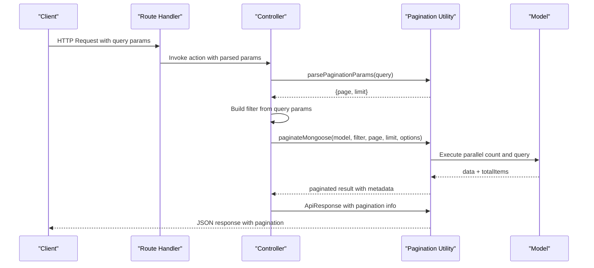
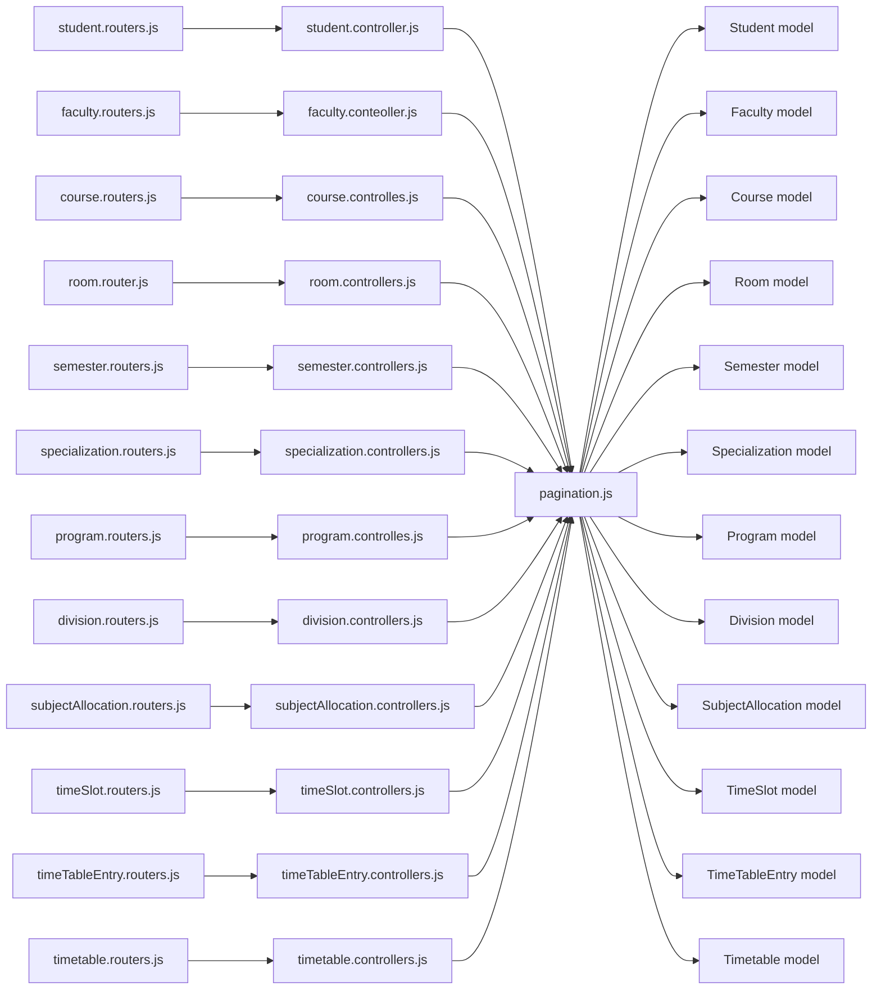

# Master Data Endpoints

<cite>
**Referenced Files in This Document**
- [student.controller.js](file://Backend/src/controllers/student.controller.js)
- [student.routers.js](file://Backend/src/routes/student.routers.js)
- [faculty.conteoller.js](file://Backend/src/controllers/faculty.conteoller.js)
- [faculty.routers.js](file://Backend/src/routes/faculty.routers.js)
- [course.controlles.js](file://Backend/src/controllers/course.controlles.js)
- [course.routers.js](file://Backend/src/routes/course.routers.js)
- [room.controllers.js](file://Backend/src/controllers/room.controllers.js)
- [room.router.js](file://Backend/src/routes/room.router.js)
- [semester.controllers.js](file://Backend/src/controllers/semester.controllers.js)
- [semester.routers.js](file://Backend/src/routes/semester.routers.js)
- [specialization.controllers.js](file://Backend/src/controllers/specialization.controllers.js)
- [specialization.routers.js](file://Backend/src/routes/specialization.routers.js)
- [subject.controllers.js](file://Backend/src/controllers/subject.controllers.js)
- [subject.routers.js](file://Backend/src/routes/subject.routers.js)
- [program.controlles.js](file://Backend/src/controllers/program.controlles.js)
- [program.routers.js](file://Backend/src/routes/program.routers.js)
- [division.controllers.js](file://Backend/src/controllers/division.controllers.js)
- [division.routers.js](file://Backend/src/routes/division.routers.js)
- [subjectAllocation.controllers.js](file://Backend/src/controllers/subjectAllocation.controllers.js)
- [subjectAllocation.routers.js](file://Backend/src/routes/subjectAllocation.routers.js)
- [timeSlot.controllers.js](file://Backend/src/controllers/timeSlot.controllers.js)
- [timeSlot.routers.js](file://Backend/src/routes/timeSlot.routers.js)
- [timeTableEntry.controllers.js](file://Backend/src/controllers/timeTableEntry.controllers.js)
- [timeTableEntry.routers.js](file://Backend/src/routes/timeTableEntry.routers.js)
- [timetable.controllers.js](file://Backend/src/controllers/timetable.controllers.js)
- [timetable.routers.js](file://Backend/src/routes/timetable.routers.js)
- [ApiResponse.js](file://Backend/src/utils/ApiResponse.js)
- [ApiError.js](file://Backend/src/utils/ApiError.js)
- [asyncHandler.js](file://Backend/src/utils/asyncHandler.js)
- [pagination.js](file://Backend/src/utils/pagination.js)
</cite>

## Update Summary
**Changes Made**
- Added comprehensive pagination, search, sorting, and filtering capabilities to all administrative controllers
- Implemented unified pagination utility with MongoDB integration
- Enhanced GET endpoints across all entities with advanced query parameters
- Added search functionality supporting regex-based pattern matching
- Implemented flexible field-specific filtering with boolean and string support
- Added configurable sorting with ascending/descending order options
- Updated pagination parameters with page, limit, and maxLimit validation

## Table of Contents
1. [Introduction](#introduction)
2. [Project Structure](#project-structure)
3. [Core Components](#core-components)
4. [Architecture Overview](#architecture-overview)
5. [Detailed Component Analysis](#detailed-component-analysis)
6. [Advanced Features](#advanced-features)
7. [Dependency Analysis](#dependency-analysis)
8. [Performance Considerations](#performance-considerations)
9. [Troubleshooting Guide](#troubleshooting-guide)
10. [Conclusion](#conclusion)
11. [Appendices](#appendices)

## Introduction
This document provides comprehensive API documentation for master data management endpoints covering academic entities. It covers CRUD operations for students, faculties, classes, courses, rooms, sections, semesters, subjects, specializations, divisions, subject allocations, time slots, timetable entries, and timetables. For each endpoint group, we specify HTTP methods, URL patterns, request/response schemas, validation rules, search and filtering capabilities, pagination support, and bulk operation endpoints. Relationship endpoints between entities are documented, along with examples of complex queries, nested resource operations, and data import/export scenarios.

**Updated** All GET endpoints now support advanced pagination, search, sorting, and filtering capabilities for improved performance and usability with large datasets.

## Project Structure
The backend follows a layered architecture with enhanced pagination support:
- Routes define HTTP endpoints per entity with query parameter support
- Controllers implement business logic with advanced filtering and pagination
- Models represent MongoDB collections with optimized querying
- Utilities provide standardized pagination, response handling, and async wrappers

```mermaid
graph TB
subgraph "Routes"
R1["student.routers.js"]
R2["faculty.routers.js"]
R3["course.routers.js"]
R4["room.router.js"]
R5["semester.routers.js"]
R6["specialization.routers.js"]
R7["subject.routers.js"]
R8["program.routers.js"]
R9["division.routers.js"]
R10["subjectAllocation.routers.js"]
R11["timeSlot.routers.js"]
R12["timeTableEntry.routers.js"]
R13["timetable.routers.js"]
end
subgraph "Controllers"
C1["student.controller.js"]
C2["faculty.conteoller.js"]
C3["course.controlles.js"]
C4["room.controllers.js"]
C5["semester.controllers.js"]
C6["specialization.controllers.js"]
C7["subject.controllers.js"]
C8["program.controlles.js"]
C9["division.controllers.js"]
C10["subjectAllocation.controllers.js"]
C11["timeSlot.controllers.js"]
C12["timeTableEntry.controllers.js"]
C13["timetable.controllers.js"]
end
subgraph "Utilities"
U1["ApiResponse.js"]
U2["ApiError.js"]
U3["asyncHandler.js"]
U4["pagination.js"]
end
R1 --> C1
R2 --> C2
R3 --> C3
R4 --> C4
R5 --> C5
R6 --> C6
R7 --> C7
R8 --> C8
R9 --> C9
R10 --> C10
R11 --> C11
R12 --> C12
R13 --> C13
C1 --> U4
C2 --> U4
C3 --> U4
C4 --> U4
C5 --> U4
C6 --> U4
C7 --> U4
C8 --> U4
C9 --> U4
C10 --> U4
C11 --> U4
C12 --> U4
C13 --> U4
C1 --> U1
C1 --> U2
C1 --> U3
C2 --> U1
C2 --> U2
C2 --> U3
C3 --> U1
C3 --> U2
C3 --> U3
C4 --> U1
C4 --> U2
C4 --> U3
C5 --> U1
C5 --> U2
C5 --> U3
C6 --> U1
C6 --> U2
C6 --> U3
C7 --> U1
C7 --> U2
C7 --> U3
C8 --> U1
C8 --> U2
C8 --> U3
C9 --> U1
C9 --> U2
C9 --> U3
C10 --> U1
C10 --> U2
C10 --> U3
C11 --> U1
C11 --> U2
C11 --> U3
C12 --> U1
C12 --> U2
C12 --> U3
C13 --> U1
C13 --> U2
C13 --> U3
```

**Diagram sources**
- [student.routers.js:1-10](file://Backend/src/routes/student.routers.js#L1-L10)
- [faculty.routers.js:1-20](file://Backend/src/routes/faculty.routers.js#L1-L20)
- [course.routers.js:1-24](file://Backend/src/routes/course.routers.js#L1-L24)
- [room.router.js:1-23](file://Backend/src/routes/room.router.js#L1-L23)
- [semester.routers.js](file://Backend/src/routes/semester.routers.js)
- [specialization.routers.js](file://Backend/src/routes/specialization.routers.js)
- [subject.routers.js](file://Backend/src/routes/subject.routers.js)
- [program.routers.js](file://Backend/src/routes/program.routers.js)
- [division.routers.js](file://Backend/src/routes/division.routers.js)
- [subjectAllocation.routers.js](file://Backend/src/routes/subjectAllocation.routers.js)
- [timeSlot.routers.js](file://Backend/src/routes/timeSlot.routers.js)
- [timeTableEntry.routers.js](file://Backend/src/routes/timeTableEntry.routers.js)
- [timetable.routers.js](file://Backend/src/routes/timetable.routers.js)
- [student.controller.js:1-235](file://Backend/src/controllers/student.controller.js#L1-L235)
- [faculty.conteoller.js:1-235](file://Backend/src/controllers/faculty.conteoller.js#L1-L235)
- [course.controlles.js:1-170](file://Backend/src/controllers/course.controlles.js#L1-L170)
- [room.controllers.js:1-166](file://Backend/src/controllers/room.controllers.js#L1-L166)
- [semester.controllers.js:1-134](file://Backend/src/controllers/semester.controllers.js#L1-L134)
- [specialization.controllers.js:1-159](file://Backend/src/controllers/specialization.controllers.js#L1-L159)
- [subject.controllers.js:1-130](file://Backend/src/controllers/subject.controllers.js#L1-L130)
- [program.controlles.js:1-167](file://Backend/src/controllers/program.controlles.js#L1-L167)
- [division.controllers.js:1-155](file://Backend/src/controllers/division.controllers.js#L1-L155)
- [subjectAllocation.controllers.js:1-154](file://Backend/src/controllers/subjectAllocation.controllers.js#L1-L154)
- [timeSlot.controllers.js:1-148](file://Backend/src/controllers/timeSlot.controllers.js#L1-L148)
- [timeTableEntry.controllers.js:1-148](file://Backend/src/controllers/timeTableEntry.controllers.js#L1-L148)
- [timetable.controllers.js:1-148](file://Backend/src/controllers/timetable.controllers.js#L1-L148)
- [ApiResponse.js](file://Backend/src/utils/ApiResponse.js)
- [ApiError.js](file://Backend/src/utils/ApiError.js)
- [asyncHandler.js](file://Backend/src/utils/asyncHandler.js)
- [pagination.js:1-147](file://Backend/src/utils/pagination.js#L1-L147)

**Section sources**
- [student.routers.js:1-10](file://Backend/src/routes/student.routers.js#L1-L10)
- [faculty.routers.js:1-20](file://Backend/src/routes/faculty.routers.js#L1-L20)
- [course.routers.js:1-24](file://Backend/src/routes/course.routers.js#L1-L24)
- [room.router.js:1-23](file://Backend/src/routes/room.router.js#L1-L23)
- [semester.routers.js](file://Backend/src/routes/semester.routers.js)
- [specialization.routers.js](file://Backend/src/routes/specialization.routers.js)
- [subject.routers.js](file://Backend/src/routes/subject.routers.js)
- [program.routers.js](file://Backend/src/routes/program.routers.js)
- [division.routers.js](file://Backend/src/routes/division.routers.js)
- [subjectAllocation.routers.js](file://Backend/src/routes/subjectAllocation.routers.js)
- [timeSlot.routers.js](file://Backend/src/routes/timeSlot.routers.js)
- [timeTableEntry.routers.js](file://Backend/src/routes/timeTableEntry.routers.js)
- [timetable.routers.js](file://Backend/src/routes/timetable.routers.js)

## Core Components
- Route handlers: Define HTTP methods and URL patterns for each entity with query parameter support
- Controller functions: Implement validation, de-duplication, persistence, and advanced filtering with pagination
- Utility modules:
  - ApiResponse: Standardized success responses with pagination metadata
  - ApiError: Standardized error responses with status codes
  - asyncHandler: Wraps async route handlers to catch errors
  - pagination: Advanced pagination utility with search, sort, and filter capabilities

Key patterns:
- Bulk creation endpoints accept arrays and filter duplicates before insertion
- GET endpoints now support comprehensive pagination, search, sorting, and filtering
- Unified pagination utility handles both local arrays and MongoDB queries
- Advanced filtering supports boolean, string, and regex-based searches
- Sorting supports ascending and descending order with any field

**Updated** All controllers now utilize the centralized pagination utility for consistent behavior across all entities.

**Section sources**
- [student.controller.js:94-137](file://Backend/src/controllers/student.controller.js#L94-L137)
- [faculty.conteoller.js:87-130](file://Backend/src/controllers/faculty.conteoller.js#L87-L130)
- [course.controlles.js:46-87](file://Backend/src/controllers/course.controlles.js#L46-L87)
- [room.controllers.js:50-92](file://Backend/src/controllers/room.controllers.js#L50-L92)
- [semester.controllers.js:47-88](file://Backend/src/controllers/semester.controllers.js#L47-L88)
- [specialization.controllers.js:52-93](file://Backend/src/controllers/specialization.controllers.js#L52-L93)
- [program.controlles.js:52-94](file://Backend/src/controllers/program.controlles.js#L52-L94)
- [division.controllers.js:42-83](file://Backend/src/controllers/division.controllers.js#L42-L83)
- [subjectAllocation.controllers.js:51-95](file://Backend/src/controllers/subjectAllocation.controllers.js#L51-L95)
- [timeSlot.controllers.js:47-89](file://Backend/src/controllers/timeSlot.controllers.js#L47-L89)
- [timeTableEntry.controllers.js:47-89](file://Backend/src/controllers/timeTableEntry.controllers.js#L47-L89)
- [timetable.controllers.js:46-89](file://Backend/src/controllers/timetable.controllers.js#L46-L89)
- [pagination.js:1-147](file://Backend/src/utils/pagination.js#L1-L147)
- [ApiResponse.js](file://Backend/src/utils/ApiResponse.js)
- [ApiError.js](file://Backend/src/utils/ApiError.js)
- [asyncHandler.js](file://Backend/src/utils/asyncHandler.js)

## Architecture Overview
The API follows a clean separation of concerns with enhanced pagination support:
- Routes map HTTP requests to controller actions with query parameter parsing
- Controllers validate inputs, check for duplicates, apply filters, and delegate pagination to utility functions
- Pagination utility provides consistent behavior for both local arrays and MongoDB queries
- Responses include pagination metadata and standardized formatting

**Diagram sources**
- [student.controller.js:94-137](file://Backend/src/controllers/student.controller.js#L94-L137)
- [pagination.js:101-139](file://Backend/src/utils/pagination.js#L101-L139)
- [ApiResponse.js](file://Backend/src/utils/ApiResponse.js)
- [ApiError.js](file://Backend/src/utils/ApiError.js)
- [asyncHandler.js](file://Backend/src/utils/asyncHandler.js)

## Detailed Component Analysis

### Students
- Base URL: /api/students
- Bulk import: POST /api/students with array of student objects
- Retrieve all: GET /api/students?page=1&limit=20&search=john&sortBy=student_name&sortOrder=asc&filter_class=CSE-A
- Retrieve by ObjectId: GET /api/students/:id
- Update by ObjectId: PATCH /api/students/:id (partial updates supported)
- Delete by ObjectId: DELETE /api/students/:id

**Updated** GET endpoint now supports advanced pagination with search, sorting, and filtering:
- Pagination: page (default: 1), limit (default: 20, max: 100)
- Search: search (regex pattern matching across student_id, student_name, email, class)
- Sorting: sortBy (any field), sortOrder (asc/desc)
- Filtering: filter_fieldName=value (supports boolean and string filters)

Validation rules (bulk):
- Required fields per student: student_id, student_name, email, class, batch, date_of_birth, specialization
- Duplicate prevention: Filters by student_id and email; rejects if all inputs already exist

Response schema:
- Success: ApiResponse with pagination metadata and data array
- Pagination includes: currentPage, totalPages, totalItems, itemsPerPage, hasNextPage, hasPrevPage

**Section sources**
- [student.routers.js:1-10](file://Backend/src/routes/student.routers.js#L1-L10)
- [student.controller.js:94-137](file://Backend/src/controllers/student.controller.js#L94-L137)
- [pagination.js:64-76](file://Backend/src/utils/pagination.js#L64-L76)
- [pagination.js:101-139](file://Backend/src/utils/pagination.js#L101-L139)

### Faculties
- Base URL: /api/faculty
- Bulk import: POST /api/faculty with array of faculty objects
- Retrieve all: GET /api/faculty?page=1&limit=20&search=smith&sortBy=faculty_name&sortOrder=desc&filter_specialization=Computer Science
- Retrieve by ObjectId: GET /api/faculty/:id
- Update by ObjectId: PUT /api/faculty/:id
- Delete by ObjectId: DELETE /api/faculty/:id

**Updated** GET endpoint now supports comprehensive filtering:
- Search: matches faculty_id, faculty_name, email, specialization
- Field filters: filter_fieldName=value for any faculty property
- Boolean filters: filter_isActive=true/false

Validation rules (bulk):
- Required fields per faculty: faculty_id, faculty_name, specialization, higher_qualification, gender, date_of_joining, DOB, address
- Duplicate prevention: Filters by faculty_id; rejects if all inputs already exist

Response schema:
- Success: ApiResponse with paginated results and metadata

**Section sources**
- [faculty.routers.js:1-20](file://Backend/src/routes/faculty.routers.js#L1-L20)
- [faculty.conteoller.js:87-130](file://Backend/src/controllers/faculty.conteoller.js#L87-L130)
- [pagination.js:101-139](file://Backend/src/utils/pagination.js#L101-L139)

### Courses
- Base URL: /api/courses
- Bulk import: POST /api/courses with array of course objects
- Retrieve all: GET /api/courses?page=1&limit=20&search=math&sortBy=course_name&sortOrder=asc
- Retrieve by ObjectId: GET /api/courses/:id
- Retrieve by course_id: GET /api/courses/course/:course_id
- Update by ObjectId: PUT /api/courses/:id
- Delete by ObjectId: DELETE /api/courses/:id

**Updated** GET endpoint enhanced with search and filtering:
- Search: matches course_id (case-normalized) and course_name
- Field filters: filter_fieldName=value for any course property

Validation rules (bulk):
- Required fields per course: course_id, course_name, credit
- Duplicate prevention: Filters by course_id; rejects if all inputs already exist

Response schema:
- Success: ApiResponse with pagination metadata

**Section sources**
- [course.routers.js:1-24](file://Backend/src/routes/course.routers.js#L1-L24)
- [course.controlles.js:46-87](file://Backend/src/controllers/course.controlles.js#L46-L87)
- [pagination.js:101-139](file://Backend/src/utils/pagination.js#L101-L139)

### Rooms
- Base URL: /api/rooms
- Bulk import: POST /api/rooms with array of room objects
- Retrieve all: GET /api/rooms?page=1&limit=20&search=A101&sortBy=room_no&sortOrder=asc
- Retrieve by ObjectId: GET /api/rooms/:id
- Update by ObjectId: PUT /api/rooms/:id
- Delete by ObjectId: DELETE /api/rooms/:id

**Updated** GET endpoint supports room-specific search:
- Search: matches room_no, block, floor_no
- Field filters: filter_fieldName=value for room properties

Validation rules (bulk):
- Required fields per room: room_no, floor_no, block
- Duplicate prevention: Rejects duplicate room_no entries in input; checks existing database entries

Response schema:
- Success: ApiResponse with paginated results

**Section sources**
- [room.router.js:1-23](file://Backend/src/routes/room.router.js#L1-L23)
- [room.controllers.js:50-92](file://Backend/src/controllers/room.controllers.js#L50-L92)
- [pagination.js:101-139](file://Backend/src/utils/pagination.js#L101-L139)

### Semesters
- Base URL: /api/semesters
- Bulk import: POST /api/semesters with array of semester objects
- Retrieve all: GET /api/semesters?page=1&limit=20&search=Spring&sortBy=semester_name&sortOrder=asc
- Update by ObjectId: PUT /api/semesters/:id
- Delete by ObjectId: DELETE /api/semesters/:id

**Updated** GET endpoint enhanced with semester search:
- Search: matches semester_id and semester_name
- Field filters: filter_fieldName=value for semester properties

Validation rules (bulk):
- Required fields per semester: semester_id, semester_name
- Duplicate prevention: Checks existence by semester_name; rejects if all inputs already exist
- Even/odd determination: Sets isEven based on numeric value parity

Response schema:
- Success: ApiResponse with pagination metadata

**Section sources**
- [semester.routers.js](file://Backend/src/routes/semester.routers.js)
- [semester.controllers.js:47-88](file://Backend/src/controllers/semester.controllers.js#L47-L88)
- [pagination.js:101-139](file://Backend/src/utils/pagination.js#L101-L139)

### Specializations
- Base URL: /api/specializations
- Bulk import: POST /api/specializations with array of specialization objects
- Retrieve all: GET /api/specializations?page=1&limit=20&search=AI&sortBy=specialization_name&sortOrder=asc
- Retrieve by ObjectId: GET /api/specializations/:id
- Update by ObjectId: PUT /api/specializations/:id
- Delete by ObjectId: DELETE /api/specializations/:id

**Updated** GET endpoint supports specialization search:
- Search: matches specialization_id and specialization_name
- Field filters: filter_fieldName=value for specialization properties

Validation rules (bulk):
- Required fields per specialization: specialization_id, specialization_name
- Duplicate prevention: Checks existence by specialization_id; rejects if all inputs already exist

Response schema:
- Success: ApiResponse with pagination metadata

**Section sources**
- [specialization.routers.js](file://Backend/src/routes/specialization.routers.js)
- [specialization.controllers.js:52-93](file://Backend/src/controllers/specialization.controllers.js#L52-L93)
- [pagination.js:101-139](file://Backend/src/utils/pagination.js#L101-L139)

### Programs
- Base URL: /api/programs
- Bulk import: POST /api/programs with array of program objects
- Retrieve all: GET /api/programs?page=1&limit=20&search=MCA&sortBy=program_name&sortOrder=asc
- Retrieve by ObjectId: GET /api/programs/:id
- Retrieve by program_id: GET /api/programs/program/:program_id
- Update by ObjectId: PUT /api/programs/:id
- Delete by ObjectId: DELETE /api/programs/:id

**Updated** GET endpoint enhanced with program search:
- Search: matches program_id and program_name
- Field filters: filter_fieldName=value for program properties

Validation rules (bulk):
- Required fields per program: program_id, program_name, program_duration
- Duplicate prevention: Filters by program_id; rejects if all inputs already exist

Response schema:
- Success: ApiResponse with pagination metadata

**Section sources**
- [program.routers.js](file://Backend/src/routes/program.routers.js)
- [program.controlles.js:52-94](file://Backend/src/controllers/program.controlles.js#L52-L94)
- [pagination.js:101-139](file://Backend/src/utils/pagination.js#L101-L139)

### Divisions
- Base URL: /api/divisions
- Bulk import: POST /api/divisions with array of division objects
- Retrieve all: GET /api/divisions?page=1&limit=20&search=Division A&sortBy=division_name&sortOrder=asc
- Retrieve by ObjectId: GET /api/divisions/:id
- Retrieve by division_id: GET /api/divisions/division/:division_id
- Update by ObjectId: PUT /api/divisions/:id
- Delete by ObjectId: DELETE /api/divisions/:id

**Updated** GET endpoint supports division search:
- Search: matches division_id and division_name
- Field filters: filter_fieldName=value for division properties

Validation rules (bulk):
- Required fields per division: division_id, division_name, description
- Duplicate prevention: Filters by division_id; rejects if all inputs already exist

Response schema:
- Success: ApiResponse with pagination metadata

**Section sources**
- [division.routers.js](file://Backend/src/routes/division.routers.js)
- [division.controllers.js:42-83](file://Backend/src/controllers/division.controllers.js#L42-L83)
- [pagination.js:101-139](file://Backend/src/utils/pagination.js#L101-L139)

### Subject Allocations
- Base URL: /api/subjectAllocations
- Bulk import: POST /api/subjectAllocations with array of allocation objects
- Retrieve all: GET /api/subjectAllocations?page=1&limit=20&search=CS201&sortBy=semester_id&sortOrder=asc
- Retrieve by ObjectId: GET /api/subjectAllocations/:id
- Update by ObjectId: PUT /api/subjectAllocations/:id
- Delete by ObjectId: DELETE /api/subjectAllocations/:id

**Updated** GET endpoint enhanced with allocation search:
- Search: matches subjectAllocation_id, semester_id, program_id, faculty_id, course_id
- Field filters: filter_fieldName=value for allocation properties

Validation rules (bulk):
- Required fields per allocation: subjectAllocation_id, semester_id, program_id, division_id, faculty_id, course_id, ltpHours, classTeacher, academicYear
- Duplicate prevention: Filters by subjectAllocation_id; rejects if all inputs already exist

Response schema:
- Success: ApiResponse with pagination metadata

**Section sources**
- [subjectAllocation.routers.js](file://Backend/src/routes/subjectAllocation.routers.js)
- [subjectAllocation.controllers.js:51-95](file://Backend/src/controllers/subjectAllocation.controllers.js#L51-L95)
- [pagination.js:101-139](file://Backend/src/utils/pagination.js#L101-L139)

### Time Slots
- Base URL: /api/timeSlots
- Bulk import: POST /api/timeSlots with array of time slot objects
- Retrieve all: GET /api/timeSlots?page=1&limit=20&search=Monday&sortBy=day_of_week&sortOrder=asc
- Retrieve by ObjectId: GET /api/timeSlots/:id
- Update by ObjectId: PUT /api/timeSlots/:id
- Delete by ObjectId: DELETE /api/timeSlots/:id

**Updated** GET endpoint supports time slot search:
- Search: matches slot_id, day_of_week, slot_type
- Field filters: filter_fieldName=value for time slot properties

Validation rules (bulk):
- Required fields per time slot: slot_id, day_of_week, startTime, endTime, slot_type
- Duplicate prevention: Filters by slot_id; rejects if all inputs already exist

Response schema:
- Success: ApiResponse with pagination metadata

**Section sources**
- [timeSlot.routers.js](file://Backend/src/routes/timeSlot.routers.js)
- [timeSlot.controllers.js:47-89](file://Backend/src/controllers/timeSlot.controllers.js#L47-L89)
- [pagination.js:101-139](file://Backend/src/utils/pagination.js#L101-L139)

### Time Table Entry
- Base URL: /api/timeTableEntries
- Bulk import: POST /api/timeTableEntries with array of entry objects
- Retrieve all: GET /api/timeTableEntries?page=1&limit=20&search=CS201&sortBy=subject_id&sortOrder=asc
- Retrieve by ObjectId: GET /api/timeTableEntries/:id
- Update by ObjectId: PUT /api/timeTableEntries/:id
- Delete by ObjectId: DELETE /api/timeTableEntries/:id

**Updated** GET endpoint enhanced with entry search:
- Search: matches subject_id, faculty_id, room_id, class_id, division_id
- Field filters: filter_fieldName=value for entry properties

Validation rules (bulk):
- Required fields per entry: timeTableEntry_id, subject_id, faculty_id, room_id, class_id, division_id, timeSlot_id, academicYear
- Duplicate prevention: Filters by timeTableEntry_id; rejects if all inputs already exist

Response schema:
- Success: ApiResponse with pagination metadata

**Section sources**
- [timeTableEntry.routers.js](file://Backend/src/routes/timeTableEntry.routers.js)
- [timeTableEntry.controllers.js:47-89](file://Backend/src/controllers/timeTableEntry.controllers.js#L47-L89)
- [pagination.js:101-139](file://Backend/src/utils/pagination.js#L101-L139)

### Timetables
- Base URL: /api/timetables
- Bulk import: POST /api/timetables with array of timetable objects
- Retrieve all: GET /api/timetables?page=1&limit=20&search=2024&sortBy=academicYear&sortOrder=desc
- Retrieve by ObjectId: GET /api/timetables/:id
- Update by ObjectId: PUT /api/timetables/:id
- Delete by ObjectId: DELETE /api/timetables/:id

**Updated** GET endpoint supports timetable search:
- Search: matches timetable_id, semester_id, academicYear, generatedBy
- Field filters: filter_fieldName=value for timetable properties

Validation rules (bulk):
- Required fields per timetable: timetable_id, semester_id, academicYear, generatedBy
- Duplicate prevention: Filters by timetable_id; rejects if all inputs already exist

Response schema:
- Success: ApiResponse with pagination metadata

**Section sources**
- [timetable.routers.js](file://Backend/src/routes/timetable.routers.js)
- [timetable.controllers.js:46-89](file://Backend/src/controllers/timetable.controllers.js#L46-L89)
- [pagination.js:101-139](file://Backend/src/utils/pagination.js#L101-L139)

## Advanced Features

### Pagination Parameters
All GET endpoints support the following pagination parameters:
- page: Current page number (default: 1, minimum: 1)
- limit: Number of items per page (default: 20, minimum: 1, maximum: 100)
- maxLimit: Maximum allowed limit (configured as 100)

**Section sources**
- [pagination.js:64-76](file://Backend/src/utils/pagination.js#L64-L76)
- [student.controller.js:95](file://Backend/src/controllers/student.controller.js#L95)
- [faculty.conteoller.js:88](file://Backend/src/controllers/faculty.conteoller.js#L88)

### Search Functionality
Search parameter enables regex-based pattern matching across relevant fields:
- Students: search across student_id, student_name, email, class
- Faculties: search across faculty_id, faculty_name, email, specialization
- Courses: search across course_id (uppercased), course_name
- Rooms: search across room_no, block, floor_no
- Semesters: search across semester_id, semester_name
- Specializations: search across specialization_id, specialization_name
- Programs: search across program_id, program_name
- Divisions: search across division_id, division_name
- Subject Allocations: search across subjectAllocation_id, semester_id, program_id, faculty_id, course_id
- Time Slots: search across slot_id, day_of_week, slot_type
- Time Table Entries: search across subject_id, faculty_id, room_id, class_id, division_id
- Timetables: search across timetable_id, semester_id, academicYear, generatedBy

**Section sources**
- [student.controller.js:102-109](file://Backend/src/controllers/student.controller.js#L102-L109)
- [faculty.conteoller.js:95-102](file://Backend/src/controllers/faculty.conteoller.js#L95-L102)
- [course.controlles.js:54-59](file://Backend/src/controllers/course.controlles.js#L54-L59)
- [room.controllers.js:58-64](file://Backend/src/controllers/room.controllers.js#L58-L64)
- [semester.controllers.js:55-60](file://Backend/src/controllers/semester.controllers.js#L55-L60)
- [specialization.controllers.js:60-65](file://Backend/src/controllers/specialization.controllers.js#L60-L65)
- [program.controlles.js:60-65](file://Backend/src/controllers/program.controlles.js#L60-L65)
- [division.controllers.js:50-55](file://Backend/src/controllers/division.controllers.js#L50-L55)
- [subjectAllocation.controllers.js:59-67](file://Backend/src/controllers/subjectAllocation.controllers.js#L59-L67)
- [timeSlot.controllers.js:55-61](file://Backend/src/controllers/timeSlot.controllers.js#L55-L61)
- [timeTableEntry.controllers.js:59-67](file://Backend/src/controllers/timeTableEntry.controllers.js#L59-L67)
- [timetable.controllers.js:54-61](file://Backend/src/controllers/timetable.controllers.js#L54-L61)

### Field-Specific Filtering
Field-specific filters use the `filter_fieldName=value` pattern:
- Boolean filters: filter_isActive=true, filter_isEven=false
- String filters: filter_class=CSE-A, filter_semester_id=SEM1
- Multiple filters: combine with & character (e.g., filter_class=CSE-A&filter_semester_id=SEM1)

**Section sources**
- [student.controller.js:112-124](file://Backend/src/controllers/student.controller.js#L112-L124)
- [faculty.conteoller.js:105-118](file://Backend/src/controllers/faculty.conteoller.js#L105-L118)
- [course.controlles.js:62-75](file://Backend/src/controllers/course.controlles.js#L62-L75)
- [room.controllers.js:67-80](file://Backend/src/controllers/room.controllers.js#L67-L80)
- [semester.controllers.js:63-76](file://Backend/src/controllers/semester.controllers.js#L63-L76)
- [specialization.controllers.js:68-81](file://Backend/src/controllers/specialization.controllers.js#L68-L81)
- [program.controlles.js:68-82](file://Backend/src/controllers/program.controlles.js#L68-L82)
- [division.controllers.js:58-71](file://Backend/src/controllers/division.controllers.js#L58-L71)
- [subjectAllocation.controllers.js:70-83](file://Backend/src/controllers/subjectAllocation.controllers.js#L70-L83)
- [timeSlot.controllers.js:64-77](file://Backend/src/controllers/timeSlot.controllers.js#L64-L77)
- [timeTableEntry.controllers.js:70-83](file://Backend/src/controllers/timeTableEntry.controllers.js#L70-L83)
- [timetable.controllers.js:64-77](file://Backend/src/controllers/timetable.controllers.js#L64-L77)

### Sorting Capabilities
Sorting supports any field with ascending or descending order:
- sortBy: field name to sort by
- sortOrder: asc (ascending) or desc (descending)
- Default: createdAt field descending for most entities

**Section sources**
- [student.controller.js:127-130](file://Backend/src/controllers/student.controller.js#L127-L130)
- [faculty.conteoller.js:120-123](file://Backend/src/controllers/faculty.conteoller.js#L120-L123)
- [course.controlles.js:78-81](file://Backend/src/controllers/course.controlles.js#L78-L81)
- [room.controllers.js:83-86](file://Backend/src/controllers/room.controllers.js#L83-L86)
- [semester.controllers.js:79-82](file://Backend/src/controllers/semester.controllers.js#L79-L82)
- [specialization.controllers.js:84-87](file://Backend/src/controllers/specialization.controllers.js#L84-L87)
- [program.controlles.js:85-88](file://Backend/src/controllers/program.controlles.js#L85-L88)
- [division.controllers.js:74-77](file://Backend/src/controllers/division.controllers.js#L74-L77)
- [subjectAllocation.controllers.js:86-89](file://Backend/src/controllers/subjectAllocation.controllers.js#L86-L89)
- [timeSlot.controllers.js:80-83](file://Backend/src/controllers/timeSlot.controllers.js#L80-L83)
- [timeTableEntry.controllers.js:80-83](file://Backend/src/controllers/timeTableEntry.controllers.js#L80-L83)
- [timetable.controllers.js:80-83](file://Backend/src/controllers/timetable.controllers.js#L80-L83)

### Pagination Metadata
Response includes comprehensive pagination metadata:
- currentPage: Current page number
- totalPages: Total number of pages
- totalItems: Total number of matching records
- itemsPerPage: Number of items per page
- hasNextPage: Boolean indicating if next page exists
- hasPrevPage: Boolean indicating if previous page exists
- startIndex: Starting index of current page
- endIndex: Ending index of current page

**Section sources**
- [pagination.js:43-56](file://Backend/src/utils/pagination.js#L43-L56)
- [pagination.js:126-138](file://Backend/src/utils/pagination.js#L126-L138)

## Dependency Analysis
- Routes depend on controllers with enhanced query parameter processing
- Controllers depend on pagination utility for consistent behavior
- Pagination utility depends on models for MongoDB operations
- All controllers share common pagination functionality

**Diagram sources**
- [student.routers.js:1-10](file://Backend/src/routes/student.routers.js#L1-L10)
- [faculty.routers.js:1-20](file://Backend/src/routes/faculty.routers.js#L1-L20)
- [course.routers.js:1-24](file://Backend/src/routes/course.routers.js#L1-L24)
- [room.router.js:1-23](file://Backend/src/routes/room.router.js#L1-L23)
- [semester.routers.js](file://Backend/src/routes/semester.routers.js)
- [specialization.routers.js](file://Backend/src/routes/specialization.routers.js)
- [program.routers.js](file://Backend/src/routes/program.routers.js)
- [division.routers.js](file://Backend/src/routes/division.routers.js)
- [subjectAllocation.routers.js](file://Backend/src/routes/subjectAllocation.routers.js)
- [timeSlot.routers.js](file://Backend/src/routes/timeSlot.routers.js)
- [timeTableEntry.routers.js](file://Backend/src/routes/timeTableEntry.routers.js)
- [timetable.routers.js](file://Backend/src/routes/timetable.routers.js)
- [student.controller.js:5](file://Backend/src/controllers/student.controller.js#L5)
- [faculty.conteoller.js:5](file://Backend/src/controllers/faculty.conteoller.js#L5)
- [course.controlles.js:5](file://Backend/src/controllers/course.controlles.js#L5)
- [room.controllers.js:5](file://Backend/src/controllers/room.controllers.js#L5)
- [semester.controllers.js:5](file://Backend/src/controllers/semester.controllers.js#L5)
- [specialization.controllers.js:5](file://Backend/src/controllers/specialization.controllers.js#L5)
- [program.controlles.js:5](file://Backend/src/controllers/program.controlles.js#L5)
- [division.controllers.js:5](file://Backend/src/controllers/division.controllers.js#L5)
- [subjectAllocation.controllers.js:5](file://Backend/src/controllers/subjectAllocation.controllers.js#L5)
- [timeSlot.controllers.js:5](file://Backend/src/controllers/timeSlot.controllers.js#L5)
- [timeTableEntry.controllers.js:5](file://Backend/src/controllers/timeTableEntry.controllers.js#L5)
- [timetable.controllers.js:5](file://Backend/src/controllers/timetable.controllers.js#L5)
- [pagination.js:1-147](file://Backend/src/utils/pagination.js#L1-L147)

**Section sources**
- [student.routers.js:1-10](file://Backend/src/routes/student.routers.js#L1-L10)
- [faculty.routers.js:1-20](file://Backend/src/routes/faculty.routers.js#L1-L20)
- [course.routers.js:1-24](file://Backend/src/routes/course.routers.js#L1-L24)
- [room.router.js:1-23](file://Backend/src/routes/room.router.js#L1-L23)
- [semester.routers.js](file://Backend/src/routes/semester.routers.js)
- [specialization.routers.js](file://Backend/src/routes/specialization.routers.js)
- [program.routers.js](file://Backend/src/routes/program.routers.js)
- [division.routers.js](file://Backend/src/routes/division.routers.js)
- [subjectAllocation.routers.js](file://Backend/src/routes/subjectAllocation.routers.js)
- [timeSlot.routers.js](file://Backend/src/routes/timeSlot.routers.js)
- [timeTableEntry.routers.js](file://Backend/src/routes/timeTableEntry.routers.js)
- [timetable.routers.js](file://Backend/src/routes/timetable.routers.js)
- [student.controller.js:5](file://Backend/src/controllers/student.controller.js#L5)
- [faculty.conteoller.js:5](file://Backend/src/controllers/faculty.conteoller.js#L5)
- [course.controlles.js:5](file://Backend/src/controllers/course.controlles.js#L5)
- [room.controllers.js:5](file://Backend/src/controllers/room.controllers.js#L5)
- [semester.controllers.js:5](file://Backend/src/controllers/semester.controllers.js#L5)
- [specialization.controllers.js:5](file://Backend/src/controllers/specialization.controllers.js#L5)
- [program.controlles.js:5](file://Backend/src/controllers/program.controlles.js#L5)
- [division.controllers.js:5](file://Backend/src/controllers/division.controllers.js#L5)
- [subjectAllocation.controllers.js:5](file://Backend/src/controllers/subjectAllocation.controllers.js#L5)
- [timeSlot.controllers.js:5](file://Backend/src/controllers/timeSlot.controllers.js#L5)
- [timeTableEntry.controllers.js:5](file://Backend/src/controllers/timeTableEntry.controllers.js#L5)
- [timetable.controllers.js:5](file://Backend/src/controllers/timetable.controllers.js#L5)
- [pagination.js:1-147](file://Backend/src/utils/pagination.js#L1-L147)

## Performance Considerations
- Pagination utility executes parallel count and query operations for optimal performance
- MongoDB queries use efficient skip/limit with proper indexing recommendations
- Search operations use regex patterns; consider adding indexes on frequently searched fields
- Field-specific filters support boolean optimization for better query performance
- Max limit of 100 prevents excessive memory usage for large pagination requests
- Parallel execution of countDocuments and find operations reduces response time
- Consider adding database indexes on commonly filtered and sorted fields

**Updated** Pagination implementation now uses parallel query execution for improved performance with large datasets.

**Section sources**
- [pagination.js:118-122](file://Backend/src/utils/pagination.js#L118-L122)
- [pagination.js:72-76](file://Backend/src/utils/pagination.js#L72-L76)

## Troubleshooting Guide
Common issues and resolutions:
- Pagination parameter validation: Ensure page >= 1 and limit between 1-100
- Search parameter limitations: Regex searches can be slow on large collections; consider narrowing search scope
- Field filter syntax: Use filter_fieldName=value format; boolean filters require exact 'true'/'false' strings
- Sort field validation: Ensure sortBy field exists in the collection schema
- Entity not found: Verify ObjectId values; confirm correct endpoint and method usage
- Bulk import rejections: If all inputs already exist, the endpoint returns conflict indicating no new records were inserted
- Pagination metadata: Check that response includes all pagination fields for client-side navigation

**Updated** Added troubleshooting guidance for new pagination, search, sorting, and filtering features.

**Section sources**
- [student.controller.js:102-130](file://Backend/src/controllers/student.controller.js#L102-L130)
- [faculty.conteoller.js:95-130](file://Backend/src/controllers/faculty.conteoller.js#L95-L130)
- [pagination.js:64-76](file://Backend/src/utils/pagination.js#L64-L76)
- [pagination.js:101-139](file://Backend/src/utils/pagination.js#L101-L139)

## Conclusion
The master data endpoints now provide comprehensive CRUD capabilities with advanced pagination, search, sorting, and filtering for all academic entities. The unified pagination utility ensures consistent behavior across all controllers while significantly improving performance for large datasets. Enhanced query parameters enable sophisticated data exploration and manipulation, making the API suitable for production environments with substantial data volumes.

**Updated** All administrative controllers now feature advanced pagination, search, sorting, and filtering capabilities for improved scalability and usability.

## Appendices

### Request/Response Schema Reference
- Request bodies for bulk imports: Array of entity objects with required fields per entity
- Response bodies:
  - Success: { success: true, message, data, pagination: { currentPage, totalPages, totalItems, itemsPerPage, hasNextPage, hasPrevPage } }
  - Errors: { statusCode, message, stack (optional) }

**Updated** Response schema now includes comprehensive pagination metadata for all GET endpoints.

**Section sources**
- [student.controller.js:134-137](file://Backend/src/controllers/student.controller.js#L134-L137)
- [faculty.conteoller.js:127-130](file://Backend/src/controllers/faculty.conteoller.js#L127-L130)
- [course.controlles.js:84-87](file://Backend/src/controllers/course.controlles.js#L84-L87)
- [room.controllers.js:89-92](file://Backend/src/controllers/room.controllers.js#L89-L92)
- [semester.controllers.js:85-88](file://Backend/src/controllers/semester.controllers.js#L85-L88)
- [specialization.controllers.js:90-93](file://Backend/src/controllers/specialization.controllers.js#L90-L93)
- [program.controlles.js:91-94](file://Backend/src/controllers/program.controlles.js#L91-L94)
- [division.controllers.js:80-83](file://Backend/src/controllers/division.controllers.js#L80-L83)
- [subjectAllocation.controllers.js:92-95](file://Backend/src/controllers/subjectAllocation.controllers.js#L92-L95)
- [timeSlot.controllers.js:86-89](file://Backend/src/controllers/timeSlot.controllers.js#L86-L89)
- [timeTableEntry.controllers.js:86-89](file://Backend/src/controllers/timeTableEntry.controllers.js#L86-L89)
- [timetable.controllers.js:86-89](file://Backend/src/controllers/timetable.controllers.js#L86-L89)

### Advanced Query Parameters
- Pagination: page, limit, maxLimit (default: 100)
- Search: search (regex pattern matching)
- Sorting: sortBy, sortOrder (asc/desc)
- Filtering: filter_fieldName=value (boolean and string support)

**Updated** Comprehensive query parameter support for all GET endpoints enabling advanced data exploration.

**Section sources**
- [pagination.js:64-76](file://Backend/src/utils/pagination.js#L64-L76)
- [student.controller.js:96-130](file://Backend/src/controllers/student.controller.js#L96-L130)
- [faculty.conteoller.js:89-123](file://Backend/src/controllers/faculty.conteoller.js#L89-L123)

### Examples of Advanced Queries
- Paginated search: GET /api/students?page=2&limit=10&search=john&sortBy=student_name&sortOrder=asc
- Filtered results: GET /api/faculty?filter_specialization=Computer Science&filter_isActive=true&page=1&limit=20
- Complex filtering: GET /api/courses?search=CS&filter_program_id=B.Tech&page=1&limit=15&sortBy=course_name&sortOrder=asc
- Time slot management: GET /api/timeSlots?search=Monday&filter_slot_type=Lecture&page=1&limit=25

**Updated** Examples demonstrating the full capabilities of the enhanced pagination and filtering system.

**Section sources**
- [student.controller.js:102-130](file://Backend/src/controllers/student.controller.js#L102-L130)
- [faculty.conteoller.js:95-123](file://Backend/src/controllers/faculty.conteoller.js#L95-L123)
- [course.controlles.js:54-81](file://Backend/src/controllers/course.controlles.js#L54-L81)
- [timeSlot.controllers.js:55-83](file://Backend/src/controllers/timeSlot.controllers.js#L55-L83)