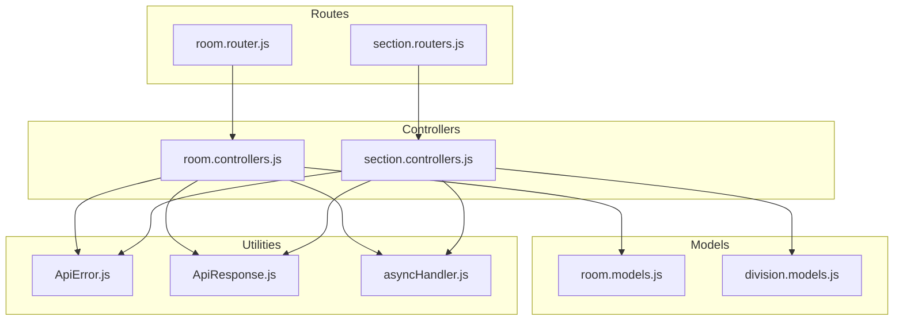
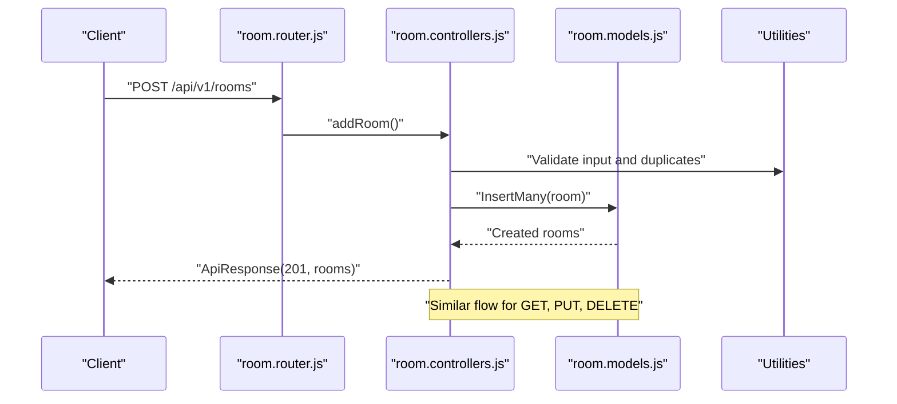
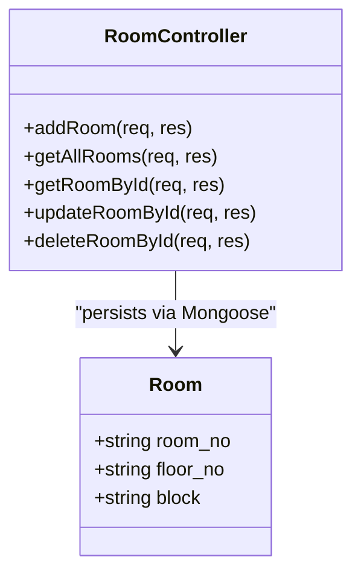
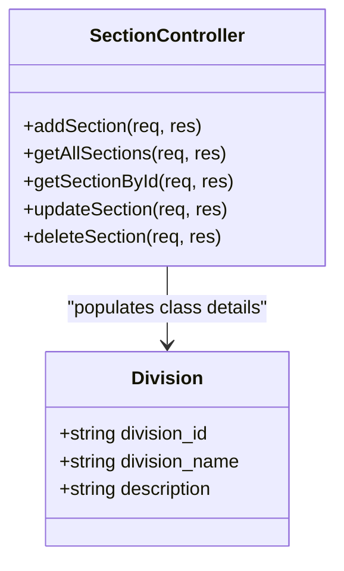
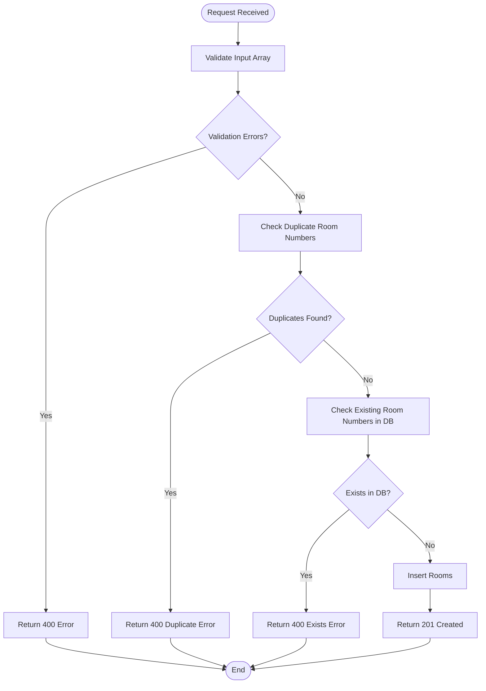
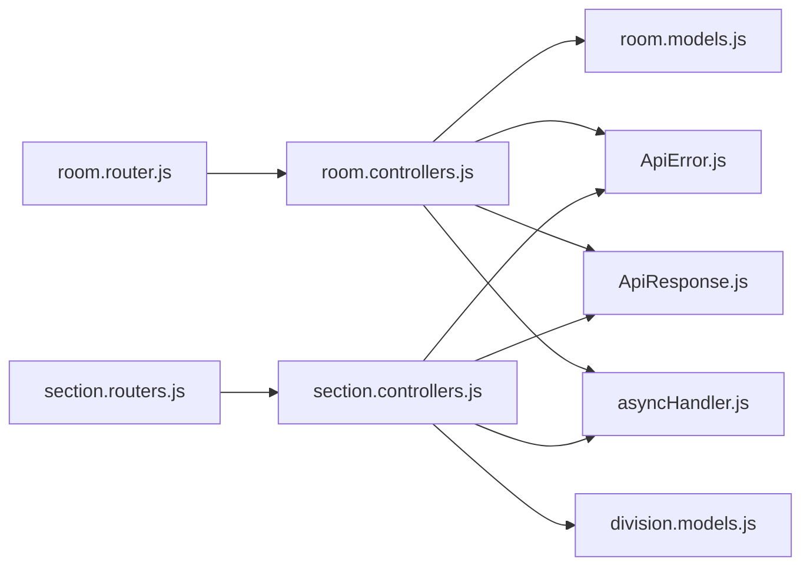

# Room & Section Management Endpoints

<cite>
**Referenced Files in This Document**
- [room.controllers.js](file://Backend/src/controllers/room.controllers.js)
- [room.models.js](file://Backend/src/models/room.models.js)
- [room.router.js](file://Backend/src/routes/room.router.js)
- [section.controllers.js](file://Backend/src/controllers/section.controllers.js)
- [section.routers.js](file://Backend/src/routes/section.routers.js)
- [division.models.js](file://Backend/src/models/division.models.js)
- [ApiError.js](file://Backend/src/utils/ApiError.js)
- [ApiResponse.js](file://Backend/src/utils/ApiResponse.js)
- [asyncHandler.js](file://Backend/src/utils/asyncHandler.js)
</cite>

## Table of Contents
1. [Introduction](#introduction)
2. [Project Structure](#project-structure)
3. [Core Components](#core-components)
4. [Architecture Overview](#architecture-overview)
5. [Detailed Component Analysis](#detailed-component-analysis)
6. [Dependency Analysis](#dependency-analysis)
7. [Performance Considerations](#performance-considerations)
8. [Troubleshooting Guide](#troubleshooting-guide)
9. [Conclusion](#conclusion)

## Introduction
This document provides comprehensive API documentation for room and section management endpoints. It covers room allocation endpoints for adding, retrieving, updating, and deleting rooms, including validation rules and conflict resolution for room numbers. It also documents section management endpoints for class sections, including creation, retrieval, updates, and deletions. The documentation includes capacity management, facility tracking, availability scheduling, and enrollment-related constraints.

## Project Structure
The backend follows a layered architecture:
- Routes define endpoint URLs and HTTP methods.
- Controllers handle request validation, business logic, and response formatting.
- Models define Mongoose schemas for persistence.
- Utilities provide standardized error and response handling.

**Diagram sources**
- [room.router.js:1-23](file://Backend/src/routes/room.router.js#L1-L23)
- [section.routers.js:1-21](file://Backend/src/routes/section.routers.js#L1-L21)
- [room.controllers.js:1-133](file://Backend/src/controllers/room.controllers.js#L1-L133)
- [section.controllers.js:1-137](file://Backend/src/controllers/section.controllers.js#L1-L137)
- [room.models.js:1-28](file://Backend/src/models/room.models.js#L1-L28)
- [division.models.js:1-27](file://Backend/src/models/division.models.js#L1-L27)
- [ApiError.js:1-21](file://Backend/src/utils/ApiError.js#L1-L21)
- [ApiResponse.js:1-10](file://Backend/src/utils/ApiResponse.js#L1-L10)
- [asyncHandler.js:1-4](file://Backend/src/utils/asyncHandler.js#L1-L4)

**Section sources**
- [room.router.js:1-23](file://Backend/src/routes/room.router.js#L1-L23)
- [section.routers.js:1-21](file://Backend/src/routes/section.routers.js#L1-L21)
- [room.controllers.js:1-133](file://Backend/src/controllers/room.controllers.js#L1-L133)
- [section.controllers.js:1-137](file://Backend/src/controllers/section.controllers.js#L1-L137)
- [room.models.js:1-28](file://Backend/src/models/room.models.js#L1-L28)
- [division.models.js:1-27](file://Backend/src/models/division.models.js#L1-L27)
- [ApiError.js:1-21](file://Backend/src/utils/ApiError.js#L1-L21)
- [ApiResponse.js:1-10](file://Backend/src/utils/ApiResponse.js#L1-L10)
- [asyncHandler.js:1-4](file://Backend/src/utils/asyncHandler.js#L1-L4)

## Core Components
- Room Management
  - Endpoints: POST /api/v1/rooms, GET /api/v1/rooms, GET /api/v1/rooms/:id, PUT /api/v1/rooms/:id, DELETE /api/v1/rooms/:id
  - Validation: Room number uniqueness, presence of room number, floor number, and wing/block
  - Conflict Resolution: Duplicate room numbers and pre-existing room entries are rejected
  - Persistence: Room schema with unique room number, floor, and block fields

- Section Management
  - Endpoints: POST /api/v1/sections, GET /api/v1/sections, GET /api/v1/sections/:id, PUT /api/v1/sections/:id, DELETE /api/v1/sections/:id
  - Validation: Class identifier and section name are required for creation
  - Conflict Resolution: Duplicate section names are filtered out before insertion
  - Persistence: Section schema with class reference and section name

- Utility Layer
  - ApiError: Standardized error handling with status codes and messages
  - ApiResponse: Standardized success responses with data and messages
  - asyncHandler: Wrapper to simplify async route handling

**Section sources**
- [room.controllers.js:6-46](file://Backend/src/controllers/room.controllers.js#L6-L46)
- [room.models.js:3-27](file://Backend/src/models/room.models.js#L3-L27)
- [room.router.js:12-18](file://Backend/src/routes/room.router.js#L12-L18)
- [section.controllers.js:5-47](file://Backend/src/controllers/section.controllers.js#L5-L47)
- [section.routers.js:12-18](file://Backend/src/routes/section.routers.js#L12-L18)
- [ApiError.js:1-21](file://Backend/src/utils/ApiError.js#L1-L21)
- [ApiResponse.js:1-10](file://Backend/src/utils/ApiResponse.js#L1-L10)
- [asyncHandler.js:1-4](file://Backend/src/utils/asyncHandler.js#L1-L4)

## Architecture Overview
The API architecture separates concerns across routes, controllers, models, and utilities. Requests flow from routes to controllers, which enforce validation and interact with models for persistence. Responses are standardized via ApiResponse, while errors are handled uniformly through ApiError.

**Diagram sources**
- [room.router.js:12-18](file://Backend/src/routes/room.router.js#L12-L18)
- [room.controllers.js:6-46](file://Backend/src/controllers/room.controllers.js#L6-L46)
- [room.models.js:3-27](file://Backend/src/models/room.models.js#L3-L27)
- [ApiResponse.js:1-10](file://Backend/src/utils/ApiResponse.js#L1-L10)
- [ApiError.js:1-21](file://Backend/src/utils/ApiError.js#L1-L21)

## Detailed Component Analysis

### Room Management Endpoints

#### Endpoint Definitions
- POST /api/v1/rooms
  - Purpose: Add multiple rooms in a single request
  - Request Body: Array of room objects with room_no, floor_no, and block
  - Validation Rules:
    - Body must be a non-empty array
    - Each room object requires room_no, floor_no, and block
    - Room numbers must be unique across the input
    - Room numbers must not already exist in the database
  - Response: Created rooms with success message
  - Error Codes: 400 for invalid input or duplicates, 404 for not found scenarios, 500 for internal failures

- GET /api/v1/rooms
  - Purpose: Retrieve all rooms
  - Response: List of rooms with success message
  - Error Codes: 404 if no rooms exist

- GET /api/v1/rooms/:id
  - Purpose: Retrieve a room by ID
  - Path Parameter: id (required)
  - Response: Single room with success message
  - Error Codes: 400 for missing ID, 404 if not found

- PUT /api/v1/rooms/:id
  - Purpose: Update a room by ID
  - Path Parameter: id (required)
  - Request Body: Partial room fields (room_no, floor_no, block)
  - Response: Updated room with success message
  - Error Codes: 400 for missing ID or body, 404 if not found

- DELETE /api/v1/rooms/:id
  - Purpose: Delete a room by ID
  - Path Parameter: id (required)
  - Response: Deleted room with success message
  - Error Codes: 400 for missing ID, 404 if not found

#### Validation and Conflict Resolution
- Input Validation:
  - Ensures non-empty array input and presence of required fields per room object
- Duplicate Detection:
  - Validates uniqueness of room numbers within the input batch
- Pre-existing Records:
  - Checks database for existing room numbers and rejects duplicates
- Update Validation:
  - Uses Mongoose validators during update operations

#### Data Model
- Room Schema Fields:
  - room_no: Unique, uppercase, trimmed string
  - floor_no: Required, trimmed string
  - block: Required, uppercase, trimmed string

**Diagram sources**
- [room.models.js:3-27](file://Backend/src/models/room.models.js#L3-L27)
- [room.controllers.js:6-133](file://Backend/src/controllers/room.controllers.js#L6-L133)

**Section sources**
- [room.router.js:12-18](file://Backend/src/routes/room.router.js#L12-L18)
- [room.controllers.js:6-46](file://Backend/src/controllers/room.controllers.js#L6-L46)
- [room.controllers.js:48-78](file://Backend/src/controllers/room.controllers.js#L48-L78)
- [room.controllers.js:80-113](file://Backend/src/controllers/room.controllers.js#L80-L113)
- [room.controllers.js:115-132](file://Backend/src/controllers/room.controllers.js#L115-L132)
- [room.models.js:3-27](file://Backend/src/models/room.models.js#L3-L27)

### Section Management Endpoints

#### Endpoint Definitions
- POST /api/v1/sections
  - Purpose: Add multiple sections in a single request
  - Request Body: Array of section objects with class_id and section_name
  - Validation Rules:
    - Body must be a non-empty array
    - Each section requires class_id and section_name
    - Duplicate section names are filtered out before insertion
  - Response: Created sections with success message; if all already exist, returns appropriate message
  - Error Codes: 400 for invalid input, 500 if insertion fails

- GET /api/v1/sections
  - Purpose: Retrieve all sections with class details populated
  - Response: List of sections with success message
  - Error Codes: 404 if no sections exist

- GET /api/v1/sections/:id
  - Purpose: Retrieve a section by ID with class details populated
  - Path Parameter: id (required)
  - Response: Single section with success message
  - Error Codes: 400 for missing ID, 404 if not found

- PUT /api/v1/sections/:id
  - Purpose: Update a section by ID
  - Path Parameter: id (required)
  - Request Body: At least one of class_id, section_name, or description
  - Response: Updated section with success message
  - Error Codes: 400 for missing ID or missing update fields, 404 if not found

- DELETE /api/v1/sections/:id
  - Purpose: Delete a section by ID
  - Path Parameter: id (required)
  - Response: Deleted section with success message
  - Error Codes: 400 for missing ID, 404 if not found

#### Validation and Conflict Resolution
- Input Validation:
  - Ensures non-empty array input and presence of required fields per section object
- Duplicate Detection:
  - Filters out section names already present in the database before insertion
- Update Validation:
  - Requires at least one update field to be provided

#### Data Model
- Section Schema Fields:
  - section_name: Required, uppercase, trimmed string
  - class_id: Reference to class entity
  - description: Optional, trimmed string

**Diagram sources**
- [division.models.js:3-27](file://Backend/src/models/division.models.js#L3-L27)
- [section.controllers.js:5-137](file://Backend/src/controllers/section.controllers.js#L5-L137)

**Section sources**
- [section.routers.js:12-18](file://Backend/src/routes/section.routers.js#L12-L18)
- [section.controllers.js:5-47](file://Backend/src/controllers/section.controllers.js#L5-L47)
- [section.controllers.js:49-81](file://Backend/src/controllers/section.controllers.js#L49-L81)
- [section.controllers.js:83-115](file://Backend/src/controllers/section.controllers.js#L83-L115)
- [section.controllers.js:117-136](file://Backend/src/controllers/section.controllers.js#L117-L136)
- [division.models.js:3-27](file://Backend/src/models/division.models.js#L3-L27)

### Capacity Management, Facility Tracking, and Availability Scheduling
- Capacity Management
  - Current schema does not include a dedicated capacity field for rooms. Capacity can be modeled by extending the Room schema with a numeric capacity field and associated validation rules.
- Facility Tracking
  - Facilities are not currently modeled. To support facility tracking, introduce a facilities array or embedded object within the Room schema with facility types and attributes.
- Availability Scheduling
  - No scheduling model exists. Implement a schedule collection with time slots, days, and room associations. Add conflict detection logic to prevent overlapping bookings for the same room.

[No sources needed since this section provides general guidance]

### Conflict Resolution for Room Scheduling Conflicts
- Duplicate Room Numbers
  - Detected via uniqueness checks in input arrays and database queries; rejected with appropriate error messages.
- Pre-existing Room Entries
  - Checked against database before insertion; existing room numbers trigger conflict errors.
- Section Name Duplicates
  - Filtered out before insertion; prevents duplicate section names within the batch.

**Diagram sources**
- [room.controllers.js:10-38](file://Backend/src/controllers/room.controllers.js#L10-L38)

**Section sources**
- [room.controllers.js:10-38](file://Backend/src/controllers/room.controllers.js#L10-L38)

## Dependency Analysis
- Route-to-Controller Dependencies
  - room.router.js maps HTTP methods to room controllers
  - section.routers.js maps HTTP methods to section controllers
- Controller-to-Model Dependencies
  - room.controllers.js interacts with Room model for CRUD operations
  - section.controllers.js interacts with Division model for class population
- Utility Dependencies
  - Controllers use ApiError and ApiResponse for consistent error and success responses
  - asyncHandler wraps route handlers to centralize error propagation

**Diagram sources**
- [room.router.js:1-23](file://Backend/src/routes/room.router.js#L1-L23)
- [section.routers.js:1-21](file://Backend/src/routes/section.routers.js#L1-L21)
- [room.controllers.js:1-133](file://Backend/src/controllers/room.controllers.js#L1-L133)
- [section.controllers.js:1-137](file://Backend/src/controllers/section.controllers.js#L1-L137)
- [room.models.js:1-28](file://Backend/src/models/room.models.js#L1-L28)
- [division.models.js:1-27](file://Backend/src/models/division.models.js#L1-L27)
- [ApiError.js:1-21](file://Backend/src/utils/ApiError.js#L1-L21)
- [ApiResponse.js:1-10](file://Backend/src/utils/ApiResponse.js#L1-L10)
- [asyncHandler.js:1-4](file://Backend/src/utils/asyncHandler.js#L1-L4)

**Section sources**
- [room.router.js:1-23](file://Backend/src/routes/room.router.js#L1-L23)
- [section.routers.js:1-21](file://Backend/src/routes/section.routers.js#L1-L21)
- [room.controllers.js:1-133](file://Backend/src/controllers/room.controllers.js#L1-L133)
- [section.controllers.js:1-137](file://Backend/src/controllers/section.controllers.js#L1-L137)
- [room.models.js:1-28](file://Backend/src/models/room.models.js#L1-L28)
- [division.models.js:1-27](file://Backend/src/models/division.models.js#L1-L27)
- [ApiError.js:1-21](file://Backend/src/utils/ApiError.js#L1-L21)
- [ApiResponse.js:1-10](file://Backend/src/utils/ApiResponse.js#L1-L10)
- [asyncHandler.js:1-4](file://Backend/src/utils/asyncHandler.js#L1-L4)

## Performance Considerations
- Batch Operations
  - Room creation accepts arrays to reduce round-trips; ensure payload sizes are reasonable to avoid timeouts.
- Indexing
  - Consider adding database indexes on room_no and section_name for faster lookups and duplicate checks.
- Population
  - Populate class details on section retrieval; monitor impact on query performance for large datasets.
- Validation Costs
  - Pre-checking duplicates and existing records adds overhead; optimize database queries and consider caching frequently accessed metadata.

[No sources needed since this section provides general guidance]

## Troubleshooting Guide
- Common Errors
  - 400 Bad Request: Invalid input, missing fields, or duplicate entries
  - 404 Not Found: Resource not found during update/delete or retrieval
  - 500 Internal Server Error: Unexpected failures during insertion
- Error Handling Utilities
  - ApiError provides structured error responses with status codes and messages
  - ApiResponse standardizes successful responses with data and messages
  - asyncHandler ensures uncaught exceptions are forwarded to Express error handlers

**Section sources**
- [ApiError.js:1-21](file://Backend/src/utils/ApiError.js#L1-L21)
- [ApiResponse.js:1-10](file://Backend/src/utils/ApiResponse.js#L1-L10)
- [asyncHandler.js:1-4](file://Backend/src/utils/asyncHandler.js#L1-L4)

## Conclusion
The room and section management endpoints provide a robust foundation for managing campus resources and academic sections. Room endpoints focus on bulk creation, validation, and conflict resolution, while section endpoints manage class sections with class population. Extending the models to support capacity, facilities, and scheduling will further enhance the system’s capabilities for timetable generation and resource allocation.