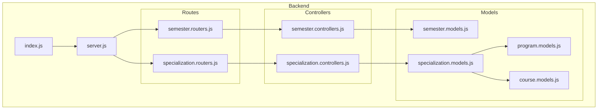
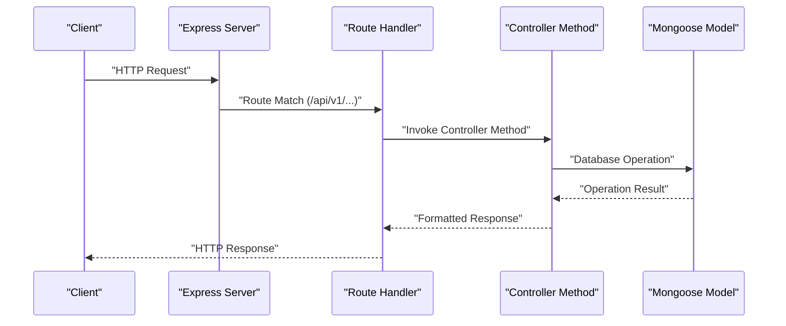
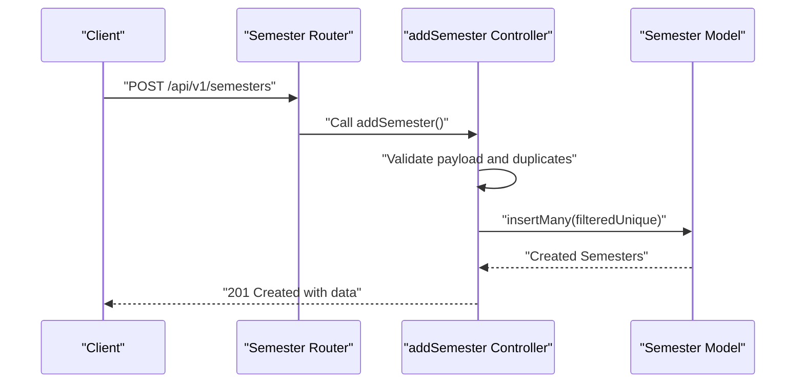
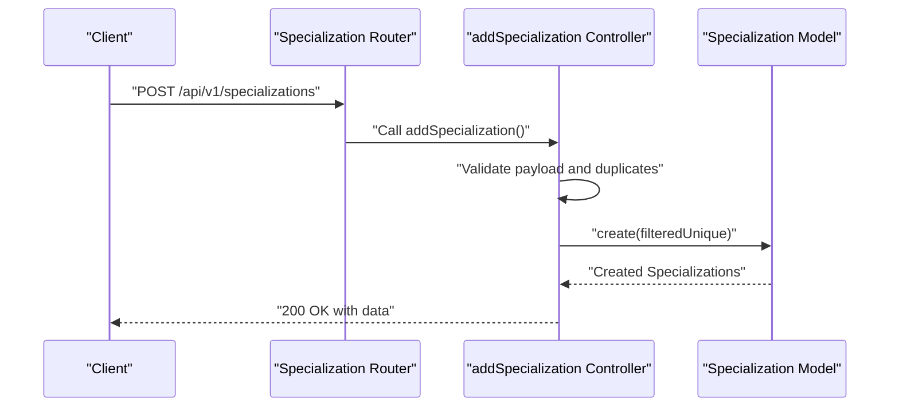
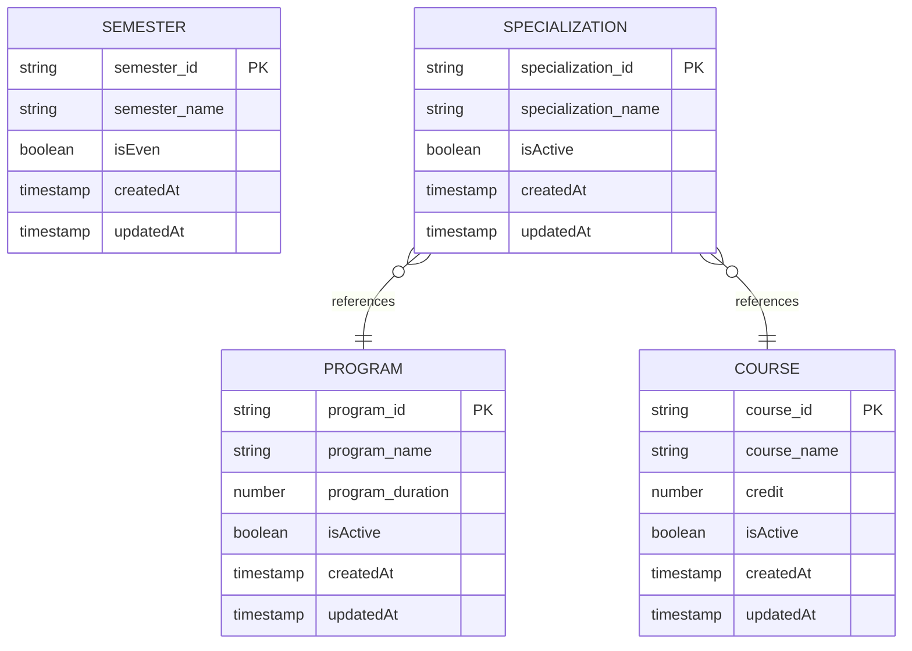
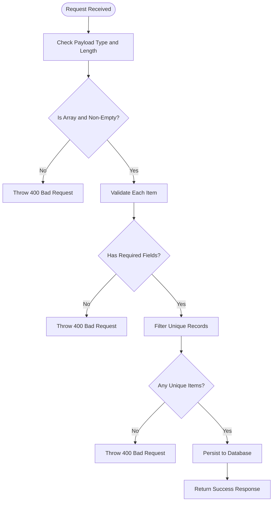
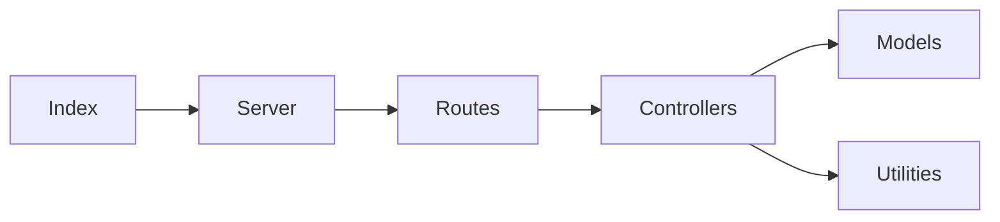

# Semester & Specialization Management Endpoints

<cite>
**Referenced Files in This Document**
- [semester.controllers.js](file://Backend/src/controllers/semester.controllers.js)
- [semester.models.js](file://Backend/src/models/semester.models.js)
- [semester.routers.js](file://Backend/src/routes/semester.routers.js)
- [specialization.controllers.js](file://Backend/src/controllers/specialization.controllers.js)
- [specialization.models.js](file://Backend/src/models/specialization.models.js)
- [specialization.routers.js](file://Backend/src/routes/specialization.routers.js)
- [program.models.js](file://Backend/src/models/program.models.js)
- [course.models.js](file://Backend/src/models/course.models.js)
- [server.js](file://Backend/src/server.js)
- [index.js](file://Backend/src/index.js)
- [ApiError.js](file://Backend/src/utils/ApiError.js)
- [ApiResponse.js](file://Backend/src/utils/ApiResponse.js)
- [asyncHandler.js](file://Backend/src/utils/asyncHandler.js)
</cite>

## Table of Contents
1. [Introduction](#introduction)
2. [Project Structure](#project-structure)
3. [Core Components](#core-components)
4. [Architecture Overview](#architecture-overview)
5. [Detailed Component Analysis](#detailed-component-analysis)
6. [Dependency Analysis](#dependency-analysis)
7. [Performance Considerations](#performance-considerations)
8. [Troubleshooting Guide](#troubleshooting-guide)
9. [Conclusion](#conclusion)

## Introduction
This document provides comprehensive API documentation for semester and specialization management endpoints. It covers:
- Semester scheduling endpoints for adding, retrieving, updating, and deleting semesters
- Academic calendar management through semester identification and parity tracking
- Specialization management endpoints for program specializations, including relationship endpoints to programs and courses
- Validation rules for semester dates, academic cycles, and specialization codes
- Curriculum alignment via program and course relationships

The backend follows a layered architecture with controllers, models, routes, and shared utilities. All endpoints are mounted under `/api/v1/` with dedicated prefixes for semesters and specializations.

## Project Structure
The relevant components for semester and specialization management are organized as follows:
- Controllers: handle request logic and response formatting
- Models: define Mongoose schemas for semesters, specializations, programs, and courses
- Routes: expose REST endpoints and bind them to controller methods
- Server: mounts routes and initializes the Express application
- Utilities: shared error handling and response formatting

**Diagram sources**
- [server.js:34-50](file://Backend/src/server.js#L34-L50)
- [semester.routers.js:1-19](file://Backend/src/routes/semester.routers.js#L1-L19)
- [specialization.routers.js:1-21](file://Backend/src/routes/specialization.routers.js#L1-L21)
- [semester.controllers.js:1-99](file://Backend/src/controllers/semester.controllers.js#L1-L99)
- [specialization.controllers.js:1-121](file://Backend/src/controllers/specialization.controllers.js#L1-L121)
- [semester.models.js:1-27](file://Backend/src/models/semester.models.js#L1-L27)
- [specialization.models.js:1-26](file://Backend/src/models/specialization.models.js#L1-L26)
- [program.models.js:1-32](file://Backend/src/models/program.models.js#L1-L32)
- [course.models.js:1-32](file://Backend/src/models/course.models.js#L1-L32)

**Section sources**
- [server.js:34-50](file://Backend/src/server.js#L34-L50)
- [index.js:1-18](file://Backend/src/index.js#L1-L18)

## Core Components
This section documents the primary endpoints for semester and specialization management, including request/response formats, validation rules, and error handling.

### Semester Management Endpoints
- Base Path: `/api/v1/semesters`
- Methods:
  - POST `/api/v1/semesters`: Add semesters
  - GET `/api/v1/semesters`: Get all semesters
  - PUT `/api/v1/semesters/:id`: Update a semester by ID
  - DELETE `/api/v1/semesters/:id`: Delete a semester by ID

Validation Rules:
- Request body must be a non-empty array of objects
- Each object must include `semester_name`
- Duplicate semester names are rejected
- Even-numbered semesters are marked as even parity

Response Format:
- Success responses include `success`, `message`, and `data`
- Error responses use the shared error utility

Example Request Body (POST):
- Array of objects with fields: `semester_name` (required), optional derived parity flag

Example Response (GET):
- Array of semester objects with fields: `semester_id`, `semester_name`, `isEven`, timestamps

**Section sources**
- [semester.routers.js:11-16](file://Backend/src/routes/semester.routers.js#L11-L16)
- [semester.controllers.js:6-40](file://Backend/src/controllers/semester.controllers.js#L6-L40)
- [semester.controllers.js:43-53](file://Backend/src/controllers/semester.controllers.js#L43-L53)
- [semester.controllers.js:56-80](file://Backend/src/controllers/semester.controllers.js#L56-L80)
- [semester.controllers.js:83-99](file://Backend/src/controllers/semester.controllers.js#L83-L99)
- [semester.models.js:3-24](file://Backend/src/models/semester.models.js#L3-L24)

### Specialization Management Endpoints
- Base Path: `/api/v1/specializations`
- Methods:
  - POST `/api/v1/specializations`: Add specializations
  - GET `/api/v1/specializations`: Get all specializations (populated with program and course)
  - GET `/api/v1/specializations/:id`: Get a specialization by ID (populated with program and course)
  - PUT `/api/v1/specializations/:id`: Update a specialization by ID
  - DELETE `/api/v1/specializations/:id`: Delete a specialization by ID

Validation Rules:
- Request body must be a non-empty array of objects
- Each object must include `specilization_name`, `program_id`, and `course_id`
- Duplicate specialization names are rejected

Relationship Endpoints:
- GET `/api/v1/specializations` and GET `/api/v1/specializations/:id` populate related program and course data

Response Format:
- Success responses include `success`, `message`, and `data`
- Error responses use the shared error utility

Example Request Body (POST):
- Array of objects with fields: `specilization_name` (required), `program_id` (required), `course_id` (required)

Example Response (GET):
- Array of specialization objects with fields: `specialization_id`, `specialization_name`, `program_id`, `course_id`, timestamps

**Section sources**
- [specialization.routers.js:12-18](file://Backend/src/routes/specialization.routers.js#L12-L18)
- [specialization.controllers.js:6-41](file://Backend/src/controllers/specialization.controllers.js#L6-L41)
- [specialization.controllers.js:44-55](file://Backend/src/controllers/specialization.controllers.js#L44-L55)
- [specialization.controllers.js:58-69](file://Backend/src/controllers/specialization.controllers.js#L58-L69)
- [specialization.controllers.js:72-101](file://Backend/src/controllers/specialization.controllers.js#L72-L101)
- [specialization.controllers.js:104-120](file://Backend/src/controllers/specialization.controllers.js#L104-L120)
- [specialization.models.js:3-23](file://Backend/src/models/specialization.models.js#L3-L23)

## Architecture Overview
The system follows a clean separation of concerns:
- Routes define endpoint contracts
- Controllers encapsulate business logic and orchestrate model operations
- Models define data schemas and relationships
- Server mounts routes and initializes the application
- Utilities provide consistent error and response handling

**Diagram sources**
- [server.js:34-50](file://Backend/src/server.js#L34-L50)
- [semester.routers.js:11-16](file://Backend/src/routes/semester.routers.js#L11-L16)
- [specialization.routers.js:12-18](file://Backend/src/routes/specialization.routers.js#L12-L18)
- [semester.controllers.js:6-40](file://Backend/src/controllers/semester.controllers.js#L6-L40)
- [specialization.controllers.js:6-41](file://Backend/src/controllers/specialization.controllers.js#L6-L41)

## Detailed Component Analysis

### Semester Endpoints Flow

**Diagram sources**
- [semester.routers.js:11](file://Backend/src/routes/semester.routers.js#L11)
- [semester.controllers.js:6-40](file://Backend/src/controllers/semester.controllers.js#L6-L40)
- [semester.models.js:3-24](file://Backend/src/models/semester.models.js#L3-L24)

**Section sources**
- [semester.controllers.js:6-40](file://Backend/src/controllers/semester.controllers.js#L6-L40)
- [semester.models.js:3-24](file://Backend/src/models/semester.models.js#L3-L24)

### Specialization Endpoints Flow

**Diagram sources**
- [specialization.routers.js:12](file://Backend/src/routes/specialization.routers.js#L12)
- [specialization.controllers.js:6-41](file://Backend/src/controllers/specialization.controllers.js#L6-L41)
- [specialization.models.js:3-23](file://Backend/src/models/specialization.models.js#L3-L23)

**Section sources**
- [specialization.controllers.js:6-41](file://Backend/src/controllers/specialization.controllers.js#L6-L41)
- [specialization.models.js:3-23](file://Backend/src/models/specialization.models.js#L3-L23)

### Data Models and Relationships

**Diagram sources**
- [semester.models.js:3-24](file://Backend/src/models/semester.models.js#L3-L24)
- [specialization.models.js:3-23](file://Backend/src/models/specialization.models.js#L3-L23)
- [program.models.js:3-29](file://Backend/src/models/program.models.js#L3-L29)
- [course.models.js:3-29](file://Backend/src/models/course.models.js#L3-L29)

**Section sources**
- [semester.models.js:3-24](file://Backend/src/models/semester.models.js#L3-L24)
- [specialization.models.js:3-23](file://Backend/src/models/specialization.models.js#L3-L23)
- [program.models.js:3-29](file://Backend/src/models/program.models.js#L3-L29)
- [course.models.js:3-29](file://Backend/src/models/course.models.js#L3-L29)

### Validation Logic Flow

**Diagram sources**
- [semester.controllers.js:9-20](file://Backend/src/controllers/semester.controllers.js#L9-L20)
- [specialization.controllers.js:9-23](file://Backend/src/controllers/specialization.controllers.js#L9-L23)

**Section sources**
- [semester.controllers.js:9-20](file://Backend/src/controllers/semester.controllers.js#L9-L20)
- [specialization.controllers.js:9-23](file://Backend/src/controllers/specialization.controllers.js#L9-L23)

## Dependency Analysis
Key dependencies and coupling:
- Routes depend on controllers
- Controllers depend on models and shared utilities
- Models define schemas and relationships
- Server mounts all routes and starts the application

**Diagram sources**
- [server.js:34-50](file://Backend/src/server.js#L34-L50)
- [semester.routers.js:1-19](file://Backend/src/routes/semester.routers.js#L1-L19)
- [specialization.routers.js:1-21](file://Backend/src/routes/specialization.routers.js#L1-L21)
- [semester.controllers.js:1-4](file://Backend/src/controllers/semester.controllers.js#L1-L4)
- [specialization.controllers.js:1-3](file://Backend/src/controllers/specialization.controllers.js#L1-L3)
- [ApiError.js:1-21](file://Backend/src/utils/ApiError.js#L1-L21)
- [ApiResponse.js:1-10](file://Backend/src/utils/ApiResponse.js#L1-L10)
- [asyncHandler.js:1-4](file://Backend/src/utils/asyncHandler.js#L1-L4)

**Section sources**
- [server.js:34-50](file://Backend/src/server.js#L34-L50)
- [semester.routers.js:1-19](file://Backend/src/routes/semester.routers.js#L1-L19)
- [specialization.routers.js:1-21](file://Backend/src/routes/specialization.routers.js#L1-L21)
- [semester.controllers.js:1-4](file://Backend/src/controllers/semester.controllers.js#L1-L4)
- [specialization.controllers.js:1-3](file://Backend/src/controllers/specialization.controllers.js#L1-L3)
- [ApiError.js:1-21](file://Backend/src/utils/ApiError.js#L1-L21)
- [ApiResponse.js:1-10](file://Backend/src/utils/ApiResponse.js#L1-L10)
- [asyncHandler.js:1-4](file://Backend/src/utils/asyncHandler.js#L1-L4)

## Performance Considerations
- Batch operations: POST endpoints accept arrays to reduce round trips
- Filtering duplicates: Controllers filter unique records before persistence to avoid redundant writes
- Population: Specialization endpoints populate related program and course data; use selective population or pagination for large datasets
- Middleware: JSON and URL-encoded bodies are parsed with size limits; adjust limits as needed for large payloads

## Troubleshooting Guide
Common issues and resolutions:
- 400 Bad Request:
  - Missing or empty payload arrays
  - Missing required fields (`semester_name`, `specilization_name`, `program_id`, `course_id`)
  - Duplicate entries detected
- 404 Not Found:
  - Attempting to update or delete non-existent resources
  - Fetching by invalid ID
- Error Handling:
  - Shared error utility provides structured error responses with status codes and messages
  - Async wrapper ensures uncaught exceptions are forwarded to error handlers

**Section sources**
- [ApiError.js:1-21](file://Backend/src/utils/ApiError.js#L1-L21)
- [asyncHandler.js:1-4](file://Backend/src/utils/asyncHandler.js#L1-L4)
- [semester.controllers.js:9-20](file://Backend/src/controllers/semester.controllers.js#L9-L20)
- [specialization.controllers.js:9-23](file://Backend/src/controllers/specialization.controllers.js#L9-L23)
- [semester.controllers.js:56-80](file://Backend/src/controllers/semester.controllers.js#L56-L80)
- [specialization.controllers.js:72-101](file://Backend/src/controllers/specialization.controllers.js#L72-L101)

## Conclusion
The semester and specialization management endpoints provide robust CRUD operations with clear validation and error handling. The architecture supports scalability through batch operations, filtering, and population of related entities. For academic calendar management, semesters serve as the foundational unit for organizing academic cycles, while specializations align with programs and courses to support curriculum planning and elective tracking.