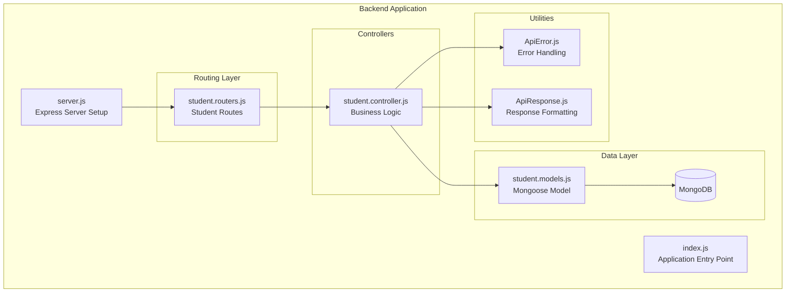
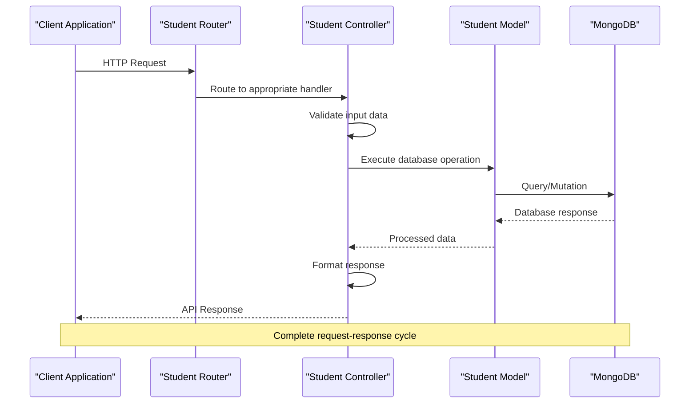
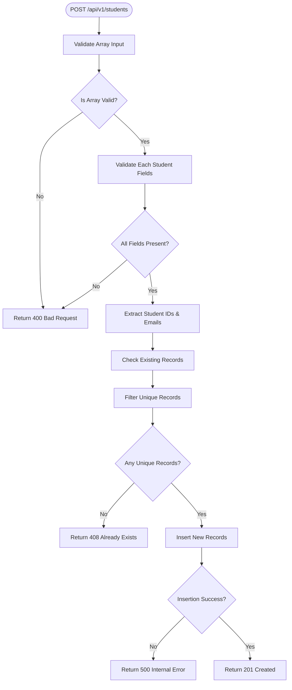
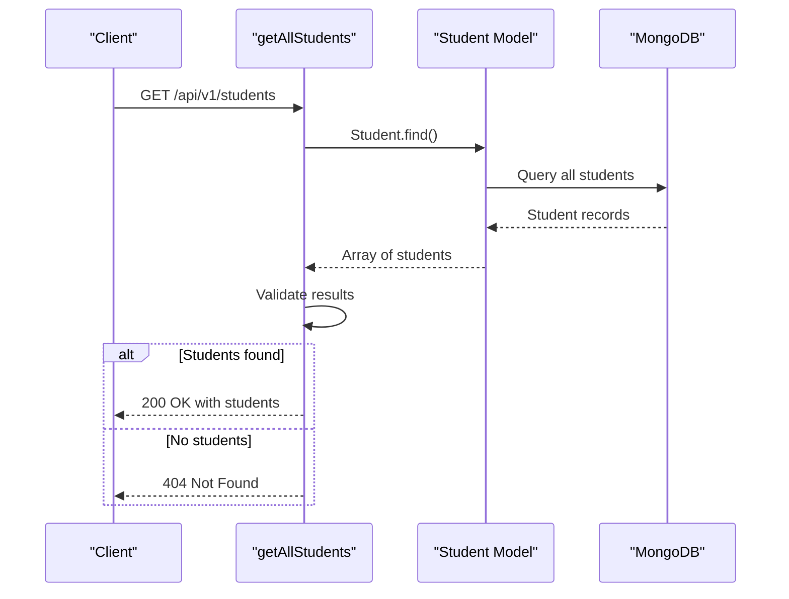
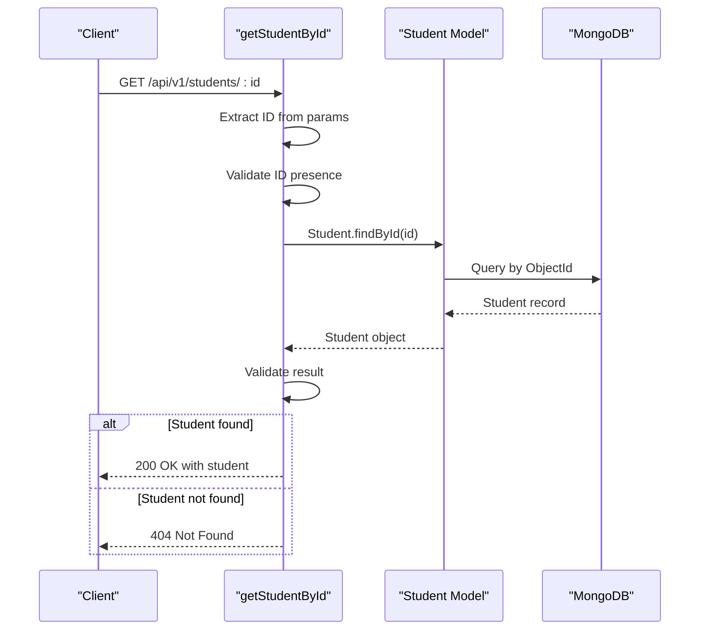
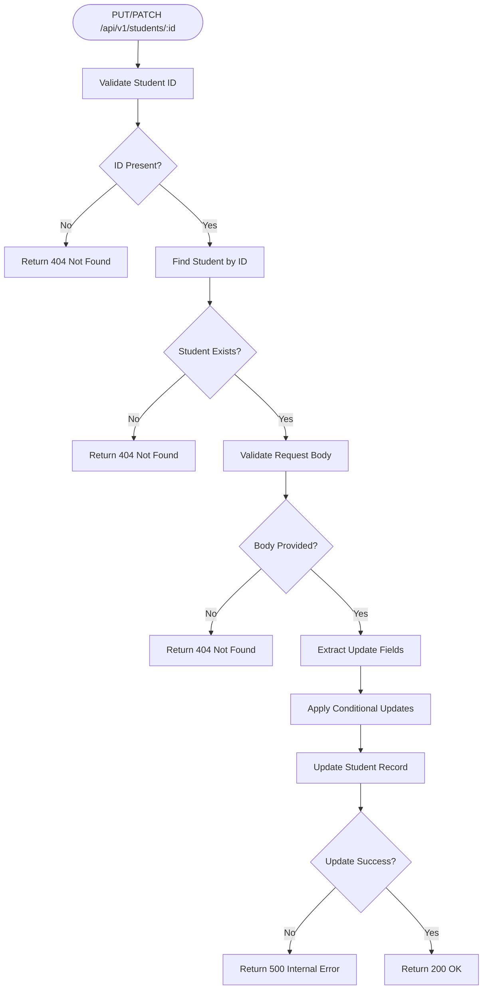
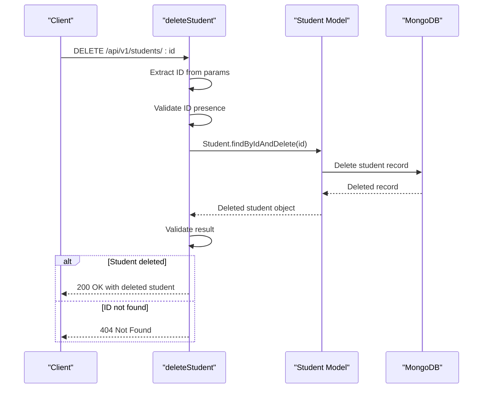
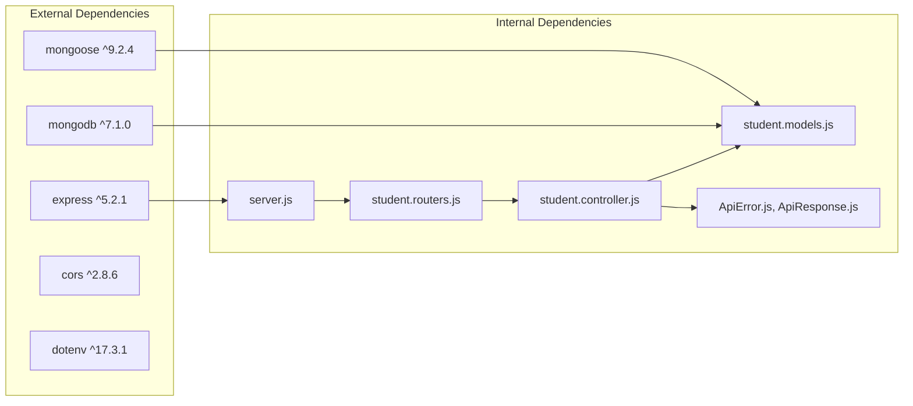
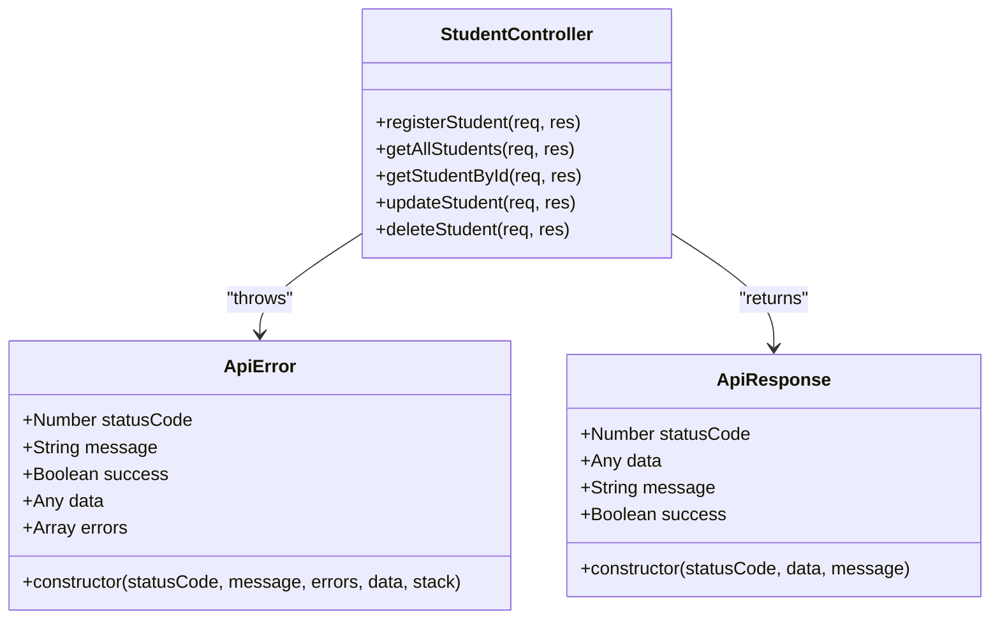

# Student Management Endpoints

<cite>
**Referenced Files in This Document**
- [student.controller.js](file://Backend/src/controllers/student.controller.js)
- [student.routers.js](file://Backend/src/routes/student.routers.js)
- [student.models.js](file://Backend/src/models/student.models.js)
- [ApiError.js](file://Backend/src/utils/ApiError.js)
- [ApiResponse.js](file://Backend/src/utils/ApiResponse.js)
- [server.js](file://Backend/src/server.js)
- [index.js](file://Backend/src/index.js)
- [package.json](file://Backend/package.json)
</cite>

## Table of Contents
1. [Introduction](#introduction)
2. [Project Structure](#project-structure)
3. [Core Components](#core-components)
4. [Architecture Overview](#architecture-overview)
5. [Detailed Component Analysis](#detailed-component-analysis)
6. [Dependency Analysis](#dependency-analysis)
7. [Performance Considerations](#performance-considerations)
8. [Troubleshooting Guide](#troubleshooting-guide)
9. [Conclusion](#conclusion)

## Introduction

This document provides comprehensive API documentation for the student management system endpoints. The system implements a complete CRUD (Create, Read, Update, Delete) interface for managing student records with advanced bulk registration capabilities, duplicate detection, and robust validation mechanisms.

The student management API follows RESTful conventions and operates on the `/api/v1/students` endpoint path. It supports individual student operations as well as bulk operations for efficient data management in educational environments.

## Project Structure

The student management system is built using a modular Express.js architecture with clear separation of concerns:



**Diagram sources**
- [server.js:1-54](file://Backend/src/server.js#L1-L54)
- [student.routers.js:1-10](file://Backend/src/routes/student.routers.js#L1-L10)
- [student.controller.js:1-209](file://Backend/src/controllers/student.controller.js#L1-L209)
- [student.models.js:1-66](file://Backend/src/models/student.models.js#L1-L66)

**Section sources**
- [server.js:1-54](file://Backend/src/server.js#L1-L54)
- [index.js:1-18](file://Backend/src/index.js#L1-L18)
- [package.json:1-22](file://Backend/package.json#L1-L22)

## Core Components

### API Endpoints

The student management system exposes five primary endpoints:

| Method | Endpoint | Description |
|--------|----------|-------------|
| POST | `/api/v1/students` | Bulk student registration with array validation |
| GET | `/api/v1/students` | Retrieve all students |
| GET | `/api/v1/students/:id` | Individual student lookup by ID |
| PUT/PATCH | `/api/v1/students/:id` | Update student information |
| DELETE | `/api/v1/students/:id` | Remove student from database |

### Request/Response Schemas

#### Student Record Structure

Each student record contains the following fields:

| Field | Type | Required | Validation Rules | Description |
|-------|------|----------|------------------|-------------|
| student_id | String | Yes | Unique, Uppercase, Trimmed | Student identification number |
| student_name | String | Yes | Lowercase, Trimmed, Indexed | Full name of the student |
| email | String | Yes | Unique, Lowercase, Trimmed | Email address for communication |
| father_name | String | No | Lowercase, Trimmed | Father's full name |
| class_code | String | Yes | Lowercase, Trimmed | Academic class identifier |
| batch | String | Yes | Lowercase, Trimmed | Academic year/batch designation |
| date_of_birth | String | Yes | Lowercase, Trimmed | Date of birth in string format |
| specialization | String | Yes | Lowercase, Trimmed | Academic specialization field |
| division | String | No | Uppercase, Trimmed | Class division/group designation |

#### Response Format

All responses follow a standardized format using the ApiResponse utility:

```javascript
{
  "statusCode": Number,
  "data": Any,
  "message": String,
  "success": Boolean
}
```

**Section sources**
- [student.routers.js:1-10](file://Backend/src/routes/student.routers.js#L1-L10)
- [student.models.js:1-66](file://Backend/src/models/student.models.js#L1-L66)
- [ApiResponse.js:1-10](file://Backend/src/utils/ApiResponse.js#L1-L10)

## Architecture Overview

The student management system follows a layered architecture pattern with clear separation between presentation, business logic, and data persistence layers:



**Diagram sources**
- [student.routers.js:1-10](file://Backend/src/routes/student.routers.js#L1-L10)
- [student.controller.js:1-209](file://Backend/src/controllers/student.controller.js#L1-L209)
- [student.models.js:1-66](file://Backend/src/models/student.models.js#L1-L66)

## Detailed Component Analysis

### Bulk Student Registration (POST /api/v1/students)

The bulk registration endpoint accepts an array of student objects and performs comprehensive validation and duplicate detection:

#### Request Validation Flow



**Diagram sources**
- [student.controller.js:6-91](file://Backend/src/controllers/student.controller.js#L6-L91)

#### Duplicate Detection Logic

The system implements intelligent duplicate detection using MongoDB's `$or` operator:

1. **Composite Key Checking**: Validates against both `student_id` and `email` fields
2. **Bulk Query Optimization**: Uses `$in` operator to efficiently check multiple records
3. **Set-Based Filtering**: Converts existing records to Sets for O(1) lookup performance
4. **Selective Processing**: Only processes unique records, ignoring duplicates

#### Request Body Schema

```javascript
[
  {
    "student_id": "STRING (Required)",
    "student_name": "STRING (Required)",
    "email": "STRING (Required)",
    "father_name": "STRING (Optional)",
    "class_code": "STRING (Required)",
    "batch": "STRING (Required)",
    "date_of_birth": "STRING (Required)",
    "specialization": "STRING (Required)"
  }
]
```

#### Response Examples

**Success Response (201 Created)**:
```json
{
  "statusCode": 201,
  "data": [
    {
      "student_id": "STU001",
      "student_name": "john doe",
      "email": "john.doe@example.com",
      "father_name": "jane doe",
      "class_code": "cs-2024",
      "batch": "2024-2025",
      "date_of_birth": "2003-05-15",
      "specialization": "computer_science"
    }
  ],
  "message": "Student registered successfully",
  "success": true
}
```

**Error Responses**:
- **400 Bad Request**: Invalid array format or missing required fields
- **408 Already Exists**: All provided students already exist in database
- **500 Internal Server Error**: Database insertion failure

**Section sources**
- [student.controller.js:6-91](file://Backend/src/controllers/student.controller.js#L6-L91)
- [student.models.js:1-66](file://Backend/src/models/student.models.js#L1-L66)

### Retrieve All Students (GET /api/v1/students)

The endpoint retrieves all student records from the database with comprehensive error handling:

#### Implementation Details



**Diagram sources**
- [student.controller.js:93-105](file://Backend/src/controllers/student.controller.js#L93-L105)

#### Response Format

**Success Response (200 OK)**:
```json
{
  "statusCode": 200,
  "data": [
    {
      "student_id": "STU001",
      "student_name": "john doe",
      "email": "john.doe@example.com",
      "father_name": "jane doe",
      "class_code": "cs-2024",
      "batch": "2024-2025",
      "date_of_birth": "2003-05-15",
      "specialization": "computer_science"
    }
  ],
  "message": "Students fetched successfully",
  "success": true
}
```

**Section sources**
- [student.controller.js:93-105](file://Backend/src/controllers/student.controller.js#L93-L105)

### Individual Student Lookup (GET /api/v1/students/:id)

The endpoint retrieves a specific student by their MongoDB ObjectId:

#### Implementation Details



**Diagram sources**
- [student.controller.js:107-128](file://Backend/src/controllers/student.controller.js#L107-L128)

#### Response Format

**Success Response (200 OK)**:
```json
{
  "statusCode": 200,
  "data": {
    "student_id": "STU001",
    "student_name": "john doe",
    "email": "john.doe@example.com",
    "father_name": "jane doe",
    "class_code": "cs-2024",
    "batch": "2024-2025",
    "date_of_birth": "2003-05-15",
    "specialization": "computer_science"
  },
  "message": "Student fetched successfully",
  "success": true
}
```

**Section sources**
- [student.controller.js:107-128](file://Backend/src/controllers/student.controller.js#L107-L128)

### Student Update (PUT/PATCH /api/v1/students/:id)

The endpoint updates existing student information with selective field updates:

#### Implementation Details



**Diagram sources**
- [student.controller.js:130-189](file://Backend/src/controllers/student.controller.js#L130-L189)

#### Update Logic

The update endpoint implements conditional field updates:
- Only provided fields are updated
- Unprovided fields retain their current values
- Automatic field sanitization (lowercase, trimmed)
- Maintains unique constraints on student_id and email

#### Request Body Schema

```javascript
{
  "student_id": "STRING (Optional)",
  "student_name": "STRING (Optional)",
  "email": "STRING (Optional)",
  "father_name": "STRING (Optional)",
  "class_code": "STRING (Optional)",
  "batch": "STRING (Optional)",
  "date_of_birth": "STRING (Optional)",
  "specialization": "STRING (Optional)"
}
```

**Section sources**
- [student.controller.js:130-189](file://Backend/src/controllers/student.controller.js#L130-L189)

### Student Deletion (DELETE /api/v1/students/:id)

The endpoint removes a student record from the database:

#### Implementation Details



**Diagram sources**
- [student.controller.js:191-209](file://Backend/src/controllers/student.controller.js#L191-L209)

**Section sources**
- [student.controller.js:191-209](file://Backend/src/controllers/student.controller.js#L191-L209)

## Dependency Analysis

The student management system has well-defined dependencies and follows clean architecture principles:



**Diagram sources**
- [package.json:14-20](file://Backend/package.json#L14-L20)
- [server.js:1-54](file://Backend/src/server.js#L1-L54)
- [student.controller.js:1-5](file://Backend/src/controllers/student.controller.js#L1-L5)

### Error Handling Architecture

The system implements a centralized error handling mechanism:



**Diagram sources**
- [ApiError.js:1-21](file://Backend/src/utils/ApiError.js#L1-L21)
- [ApiResponse.js:1-10](file://Backend/src/utils/ApiResponse.js#L1-L10)
- [student.controller.js:1-209](file://Backend/src/controllers/student.controller.js#L1-L209)

**Section sources**
- [package.json:14-20](file://Backend/package.json#L14-L20)
- [ApiError.js:1-21](file://Backend/src/utils/ApiError.js#L1-L21)
- [ApiResponse.js:1-10](file://Backend/src/utils/ApiResponse.js#L1-L10)

## Performance Considerations

### Database Optimization

1. **Indexing Strategy**: The student_name field is indexed for improved search performance
2. **Unique Constraints**: Both student_id and email fields have unique constraints
3. **Bulk Operations**: MongoDB's `insertMany` provides efficient bulk insertion
4. **Query Optimization**: Composite queries use appropriate indexes

### Memory Management

1. **Streaming Responses**: Large datasets are handled efficiently
2. **Object Conversion**: Arrays are converted to Sets for O(1) lookup performance
3. **Conditional Updates**: Only modified fields are processed

### Network Efficiency

1. **CORS Configuration**: Proper cross-origin resource sharing setup
2. **JSON Payload Limits**: Configured to handle reasonable payload sizes
3. **Compression**: Built-in compression support for large responses

## Troubleshooting Guide

### Common Error Scenarios

| Error Code | Cause | Solution |
|------------|-------|----------|
| 400 Bad Request | Invalid array format or missing fields | Verify request body structure and required fields |
| 404 Not Found | Student ID not found or invalid | Check student ID format and existence |
| 408 Already Exists | All students already registered | Remove duplicates from request or update existing records |
| 500 Internal Error | Database operation failure | Check database connectivity and field constraints |

### Validation Issues

**Duplicate Detection Failures**:
- Ensure student_id and email uniqueness constraints
- Verify MongoDB connection and indexing
- Check for case sensitivity in unique fields

**Bulk Operation Failures**:
- Validate array structure before processing
- Monitor MongoDB write operations
- Implement proper error logging

### Debugging Tips

1. **Enable Logging**: Check server logs for detailed error information
2. **Test Individual Operations**: Isolate issues by testing single vs. bulk operations
3. **Verify Database State**: Confirm unique constraints and indexes in MongoDB
4. **Monitor Performance**: Track query execution times and memory usage

**Section sources**
- [student.controller.js:6-209](file://Backend/src/controllers/student.controller.js#L6-L209)
- [ApiError.js:1-21](file://Backend/src/utils/ApiError.js#L1-L21)

## Conclusion

The student management API provides a robust, scalable solution for educational institution data management. Its key strengths include:

1. **Comprehensive CRUD Operations**: Full lifecycle management of student records
2. **Intelligent Bulk Processing**: Efficient handling of multiple student registrations
3. **Advanced Duplicate Detection**: Smart filtering prevents data redundancy
4. **Standardized Error Handling**: Consistent error responses across all operations
5. **Clean Architecture**: Well-structured codebase facilitates maintenance and extension

The system is production-ready with proper validation, error handling, and performance optimizations. Future enhancements could include pagination for large datasets, advanced search capabilities, and enhanced audit logging for compliance requirements.