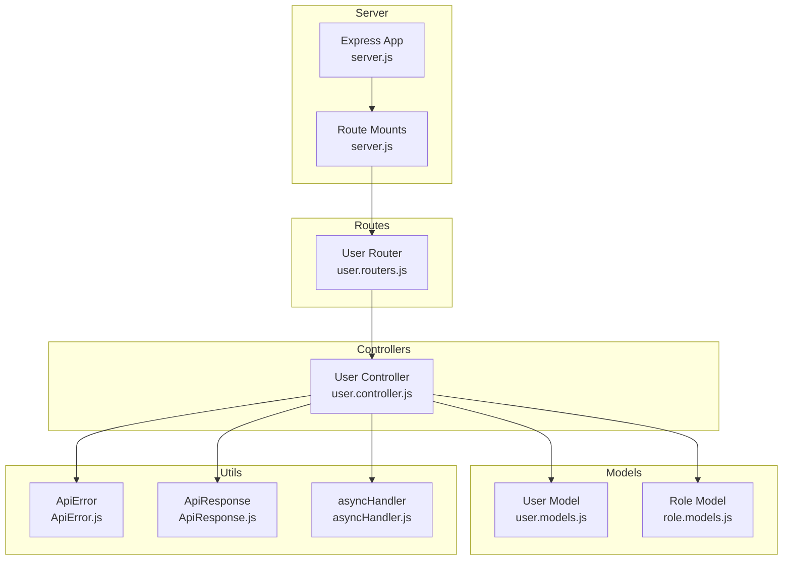
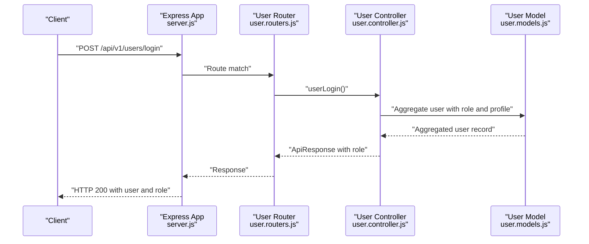
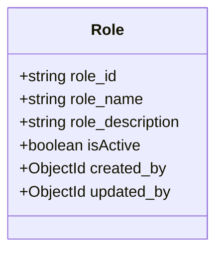
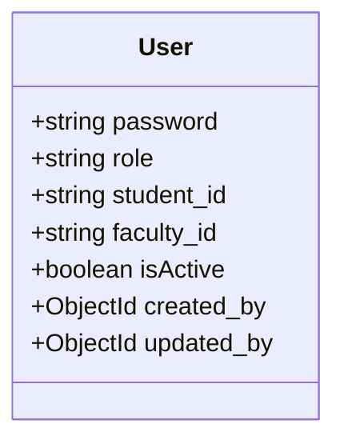
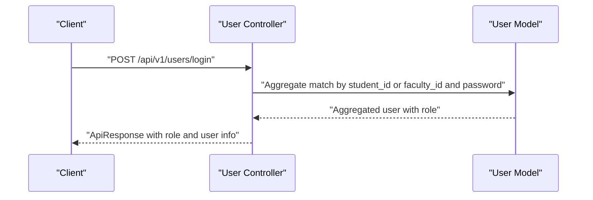
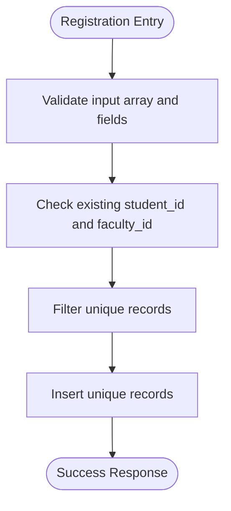
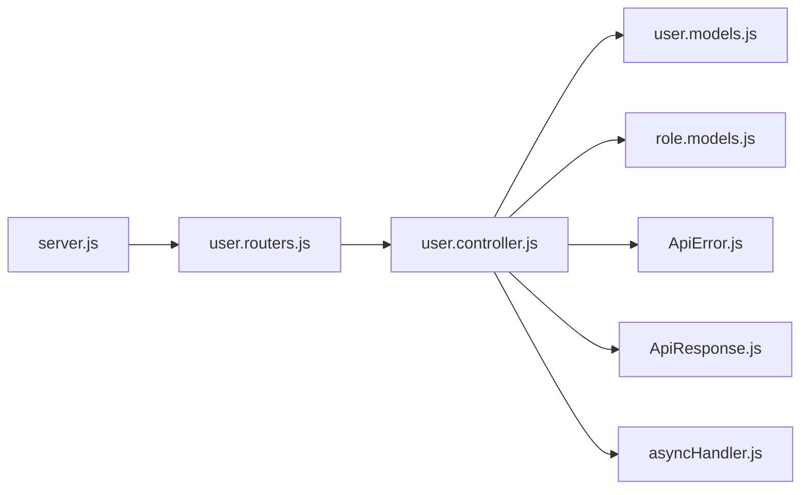

# Role-Based Access Control

<cite>
**Referenced Files in This Document**
- [role.models.js](file://Backend/src/models/role.models.js)
- [user.models.js](file://Backend/src/models/user.models.js)
- [user.controller.js](file://Backend/src/controllers/user.controller.js)
- [user.routers.js](file://Backend/src/routes/user.routers.js)
- [server.js](file://Backend/src/server.js)
- [index.js](file://Backend/src/index.js)
- [ApiError.js](file://Backend/src/utils/ApiError.js)
- [ApiResponse.js](file://Backend/src/utils/ApiResponse.js)
- [asyncHandler.js](file://Backend/src/utils/asyncHandler.js)
- [constenets.js](file://Backend/src/constenets.js)
- [package.json](file://Backend/package.json)
</cite>

## Table of Contents
1. [Introduction](#introduction)
2. [Project Structure](#project-structure)
3. [Core Components](#core-components)
4. [Architecture Overview](#architecture-overview)
5. [Detailed Component Analysis](#detailed-component-analysis)
6. [Dependency Analysis](#dependency-analysis)
7. [Performance Considerations](#performance-considerations)
8. [Troubleshooting Guide](#troubleshooting-guide)
9. [Conclusion](#conclusion)

## Introduction
This document describes the role-based access control (RBAC) system implemented in the backend API. It focuses on user roles (admin, faculty, student, coordinator, hod), how roles are modeled, and how authorization is enforced across endpoints. It also documents the current login flow, response/error handling patterns, and outlines areas where JWT-based authorization and role validation should be integrated to enforce fine-grained permissions.

## Project Structure
The backend is organized around Express routes, controllers, Mongoose models, and utility modules. The server mounts resource-specific routers under API versioned paths. Authentication and authorization are currently minimal, with login returning user details and role. Authorization middleware and role-based enforcement are not yet implemented in the provided code.

**Diagram sources**
- [server.js:14-53](file://Backend/src/server.js#L14-L53)
- [user.routers.js:12-18](file://Backend/src/routes/user.routers.js#L12-L18)
- [user.controller.js:1-355](file://Backend/src/controllers/user.controller.js#L1-L355)
- [user.models.js:1-61](file://Backend/src/models/user.models.js#L1-L61)
- [role.models.js:1-43](file://Backend/src/models/role.models.js#L1-L43)
- [ApiError.js:1-21](file://Backend/src/utils/ApiError.js#L1-L21)
- [ApiResponse.js:1-10](file://Backend/src/utils/ApiResponse.js#L1-L10)
- [asyncHandler.js:1-4](file://Backend/src/utils/asyncHandler.js#L1-L4)

**Section sources**
- [server.js:14-53](file://Backend/src/server.js#L14-L53)
- [user.routers.js:12-18](file://Backend/src/routes/user.routers.js#L12-L18)
- [user.controller.js:1-355](file://Backend/src/controllers/user.controller.js#L1-L355)
- [user.models.js:1-61](file://Backend/src/models/user.models.js#L1-L61)
- [role.models.js:1-43](file://Backend/src/models/role.models.js#L1-L43)
- [ApiError.js:1-21](file://Backend/src/utils/ApiError.js#L1-L21)
- [ApiResponse.js:1-10](file://Backend/src/utils/ApiResponse.js#L1-L10)
- [asyncHandler.js:1-4](file://Backend/src/utils/asyncHandler.js#L1-L4)

## Core Components
- Role model: Defines role identifiers, names, descriptions, and audit fields. Roles are stored as strings with an index for efficient lookup.
- User model: Stores user credentials, role, and optional student or faculty identifiers. Role is validated against supported values.
- User controller: Implements registration, retrieval, update, deletion, and login. Login aggregates user details and returns role.
- Route layer: Exposes endpoints for user management and login.
- Utilities: Standardized error and response wrappers, and an async handler to simplify error propagation.

Key RBAC observations:
- Roles are present in the user model and returned by login.
- No authorization middleware or role-based route guards are implemented in the provided code.
- Cross-entity permission rules (e.g., faculty can only access their own timetable) are not enforced in the current implementation.

**Section sources**
- [role.models.js:1-43](file://Backend/src/models/role.models.js#L1-L43)
- [user.models.js:18-28](file://Backend/src/models/user.models.js#L18-L28)
- [user.controller.js:280-354](file://Backend/src/controllers/user.controller.js#L280-L354)
- [user.routers.js:12-18](file://Backend/src/routes/user.routers.js#L12-L18)
- [ApiError.js:1-21](file://Backend/src/utils/ApiError.js#L1-L21)
- [ApiResponse.js:1-10](file://Backend/src/utils/ApiResponse.js#L1-L10)
- [asyncHandler.js:1-4](file://Backend/src/utils/asyncHandler.js#L1-L4)

## Architecture Overview
The current architecture supports basic CRUD and login flows. Authorization is not enforced at the route level. To implement RBAC, authorization middleware should be introduced to validate roles and enforce permissions per endpoint.

**Diagram sources**
- [server.js:25-50](file://Backend/src/server.js#L25-L50)
- [user.routers.js:14-16](file://Backend/src/routes/user.routers.js#L14-L16)
- [user.controller.js:280-354](file://Backend/src/controllers/user.controller.js#L280-L354)
- [user.models.js:18-28](file://Backend/src/models/user.models.js#L18-L28)

## Detailed Component Analysis

### Role Model
- Purpose: Centralize role definitions with metadata and audit fields.
- Fields: role_id, role_name, role_description, isActive, created_by, updated_by.
- Implications: Enables future role-to-permission mapping and centralized role administration.

**Diagram sources**
- [role.models.js:3-42](file://Backend/src/models/role.models.js#L3-L42)

**Section sources**
- [role.models.js:1-43](file://Backend/src/models/role.models.js#L1-L43)

### User Model
- Purpose: Store user credentials, role, and identity linkage to student or faculty entities.
- Role constraints: Enumerated set includes admin, faculty, student, coordinator, hod.
- Implications: Provides a single source of truth for user roles used by authorization logic.

**Diagram sources**
- [user.models.js:3-58](file://Backend/src/models/user.models.js#L3-L58)

**Section sources**
- [user.models.js:18-28](file://Backend/src/models/user.models.js#L18-L28)

### User Controller: Login Flow
- Purpose: Authenticate users and return role and profile details.
- Behavior: Aggregates user data from user and profile collections, selects either student or faculty data, and returns role and identifying fields.
- Current limitations: No session/JWT generation or role-based authorization.

**Diagram sources**
- [user.controller.js:280-354](file://Backend/src/controllers/user.controller.js#L280-L354)
- [user.models.js:18-28](file://Backend/src/models/user.models.js#L18-L28)

**Section sources**
- [user.controller.js:280-354](file://Backend/src/controllers/user.controller.js#L280-L354)

### User Controller: Registration and Management
- Registration validates arrays of user records, checks uniqueness against student_id and faculty_id, and inserts unique records.
- Management endpoints support fetching all users, fetching by id, updating, and deleting.

**Diagram sources**
- [user.controller.js:8-81](file://Backend/src/controllers/user.controller.js#L8-L81)

**Section sources**
- [user.controller.js:8-81](file://Backend/src/controllers/user.controller.js#L8-L81)
- [user.controller.js:84-161](file://Backend/src/controllers/user.controller.js#L84-L161)
- [user.controller.js:164-236](file://Backend/src/controllers/user.controller.js#L164-L236)
- [user.controller.js:239-278](file://Backend/src/controllers/user.controller.js#L239-L278)

### Routes Layer
- Exposes endpoints for user registration, listing, retrieval by id, update, delete, and login.
- No authorization middleware is applied at this layer.

**Section sources**
- [user.routers.js:12-18](file://Backend/src/routes/user.routers.js#L12-L18)

### Server and Bootstrap
- Express app configures CORS, JSON parsing, static assets, and mounts all route modules.
- Database connection is initialized via a separate module.

**Section sources**
- [server.js:14-53](file://Backend/src/server.js#L14-L53)
- [index.js:1-18](file://Backend/src/index.js#L1-L18)

## Dependency Analysis
- Controllers depend on models for data access and on utilities for error/response handling.
- Routes depend on controllers for request handling.
- Server depends on route modules for endpoint exposure.

**Diagram sources**
- [user.controller.js:1-6](file://Backend/src/controllers/user.controller.js#L1-L6)
- [user.models.js:1-2](file://Backend/src/models/user.models.js#L1-L2)
- [role.models.js:1](file://Backend/src/models/role.models.js#L1)
- [ApiError.js:1-21](file://Backend/src/utils/ApiError.js#L1-L21)
- [ApiResponse.js:1-10](file://Backend/src/utils/ApiResponse.js#L1-L10)
- [asyncHandler.js:1-4](file://Backend/src/utils/asyncHandler.js#L1-L4)
- [user.routers.js:12-18](file://Backend/src/routes/user.routers.js#L12-L18)
- [server.js:25-50](file://Backend/src/server.js#L25-L50)

**Section sources**
- [user.controller.js:1-6](file://Backend/src/controllers/user.controller.js#L1-L6)
- [user.models.js:1-2](file://Backend/src/models/user.models.js#L1-L2)
- [role.models.js:1](file://Backend/src/models/role.models.js#L1)
- [ApiError.js:1-21](file://Backend/src/utils/ApiError.js#L1-L21)
- [ApiResponse.js:1-10](file://Backend/src/utils/ApiResponse.js#L1-L10)
- [asyncHandler.js:1-4](file://Backend/src/utils/asyncHandler.js#L1-L4)
- [user.routers.js:12-18](file://Backend/src/routes/user.routers.js#L12-L18)
- [server.js:25-50](file://Backend/src/server.js#L25-L50)

## Performance Considerations
- Aggregation queries in user controller use joins and projections; ensure appropriate indexes on student_id, faculty_id, and role fields.
- Role enumeration reduces storage overhead but requires careful updates to avoid breaking downstream logic.
- Consider caching frequently accessed role definitions and user-role mappings to reduce repeated lookups.

## Troubleshooting Guide
- Validation failures: The registration endpoint throws explicit errors for missing fields and duplicates. Review error messages and ensure client sends arrays of user objects with required fields.
- Login failures: If credentials do not match, the login endpoint returns unauthorized. Verify that user_id corresponds to either student_id or faculty_id and that passwords match.
- Response and error handling: All controllers use standardized ApiResponse and ApiError classes. Inspect status codes and messages to diagnose issues.

**Section sources**
- [user.controller.js:14-29](file://Backend/src/controllers/user.controller.js#L14-L29)
- [user.controller.js:35, 42-51:35-51](file://Backend/src/controllers/user.controller.js#L35-L51)
- [user.controller.js:348-350](file://Backend/src/controllers/user.controller.js#L348-L350)
- [ApiError.js:1-21](file://Backend/src/utils/ApiError.js#L1-L21)
- [ApiResponse.js:1-10](file://Backend/src/utils/ApiResponse.js#L1-L10)

## Conclusion
The backend currently stores roles and exposes login with role retrieval. RBAC enforcement is not implemented. To secure endpoints:
- Introduce JWT-based authentication and session management.
- Add authorization middleware to validate roles and enforce permissions per endpoint.
- Define role-to-permission mappings and apply cross-entity rules (e.g., faculty can only access their own data).
- Extend models and controllers to support role administration and permission checks.