# Authentication & Authorization

<cite>
**Referenced Files in This Document**
- [auth.middleware.js](file://Backend/src/middlewares/auth.middleware.js)
- [Token.js](file://Backend/src/utils/Token.js)
- [user.controller.js](file://Backend/src/controllers/user.controller.js)
- [user.models.js](file://Backend/src/models/user.models.js)
- [user.routers.js](file://Backend/src/routes/user.routers.js)
- [authSlice.js](file://Client/src/store/auth/authSlice.js)
- [store.js](file://Client/src/store/store.js)
- [Login.jsx](file://Client/src/pages/Login.jsx)
- [Admin.jsx](file://Client/src/pages/dashboard/Admin.jsx)
- [Faculty.jsx](file://Client/src/pages/dashboard/Faculty.jsx)
- [Student.jsx](file://Client/src/pages/dashboard/Student.jsx)
- [apiClient.js](file://Client/src/services/apiClient.js)
- [ApiResponse.js](file://Backend/src/utils/ApiResponse.js)
- [ApiError.js](file://Backend/src/utils/ApiError.js)
- [asyncHandler.js](file://Backend/src/utils/asyncHandler.js)
</cite>

## Update Summary
**Changes Made**
- Complete replacement of legacy authentication system with JWT-based middleware
- Added comprehensive auth.middleware.js with role-based access control
- Implemented JWT token generation/verification via Token.js utility
- Enhanced user controller with bcrypt password hashing and token management
- Added refresh token rotation and logout functionality
- Updated authentication flow with cookie-based token storage
- Expanded role definitions to include coordinator and hod
- Integrated frontend Redux authentication slice with session verification
- Enhanced frontend login page with improved error handling and navigation
- Added comprehensive frontend dashboard components with role-based routing

## Table of Contents
1. [Introduction](#introduction)
2. [Project Structure](#project-structure)
3. [Core Components](#core-components)
4. [Architecture Overview](#architecture-overview)
5. [Detailed Component Analysis](#detailed-component-analysis)
6. [Dependency Analysis](#dependency-analysis)
7. [Performance Considerations](#performance-considerations)
8. [Troubleshooting Guide](#troubleshooting-guide)
9. [Conclusion](#conclusion)

## Introduction
This document explains the comprehensive authentication and authorization system for the timetable project. The system has been completely redesigned with JWT-based authentication featuring token-based sessions, role-based access control (RBAC), password hashing with bcrypt, and secure cookie-based token storage. The system supports admin, faculty, student, coordinator, and HOD roles with granular permission controls and includes refresh token rotation for enhanced security.

## Project Structure
The authentication system now features a robust JWT-based architecture spanning both frontend and backend:
- **Frontend (React + Redux Toolkit)**:
  - Authentication state management with Redux persistence
  - Login page with JWT token handling
  - Role-based routing with client-side guards
  - Protected dashboards with authentication checks
  - Session verification on application load
- **Backend (Express + MongoDB)**:
  - JWT middleware with token verification and role-based authorization
  - Token utility for secure token generation and verification
  - User controller with comprehensive authentication endpoints
  - Enhanced user model with bcrypt password hashing
  - Role-based access control with multiple role levels

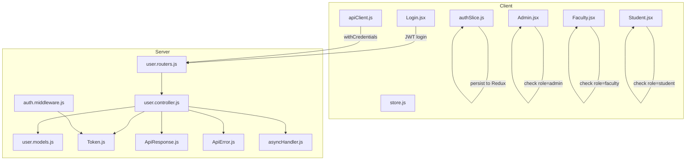

**Diagram sources**
- [Login.jsx:15-45](file://Client/src/pages/Login.jsx#L15-L45)
- [authSlice.js:10-27](file://Client/src/store/auth/authSlice.js#L10-L27)
- [store.js:7-14](file://Client/src/store/store.js#L7-L14)
- [user.routers.js:1-39](file://Backend/src/routes/user.routers.js#L1-L39)
- [user.controller.js:355-464](file://Backend/src/controllers/user.controller.js#L355-L464)
- [user.models.js:1-98](file://Backend/src/models/user.models.js#L1-L98)
- [auth.middleware.js:1-120](file://Backend/src/middlewares/auth.middleware.js#L1-L120)
- [Token.js:1-68](file://Backend/src/utils/Token.js#L1-L68)
- [ApiResponse.js:1-10](file://Backend/src/utils/ApiResponse.js#L1-L10)
- [ApiError.js:1-21](file://Backend/src/utils/ApiError.js#L1-L21)
- [asyncHandler.js:1-4](file://Backend/src/utils/asyncHandler.js#L1-L4)

**Section sources**
- [Login.jsx:1-116](file://Client/src/pages/Login.jsx#L1-L116)
- [authSlice.js:1-32](file://Client/src/store/auth/authSlice.js#L1-L32)
- [store.js:1-15](file://Client/src/store/store.js#L1-L15)
- [user.routers.js:1-39](file://Backend/src/routes/user.routers.js#L1-L39)
- [user.controller.js:1-583](file://Backend/src/controllers/user.controller.js#L1-L583)
- [user.models.js:1-97](file://Backend/src/models/user.models.js#L1-L97)
- [auth.middleware.js:1-120](file://Backend/src/middlewares/auth.middleware.js#L1-L120)
- [Token.js:1-71](file://Backend/src/utils/Token.js#L1-L71)
- [ApiResponse.js:1-74](file://Backend/src/utils/ApiResponse.js#L1-L74)
- [ApiError.js:1-80](file://Backend/src/utils/ApiError.js#L1-L80)
- [asyncHandler.js:1-47](file://Backend/src/utils/asyncHandler.js#L1-L47)

## Core Components
- **JWT Middleware System**:
  - Token verification middleware with cookie and header support
  - Role-based authorization with flexible role arrays
  - Multiple specialized authorization functions (admin, faculty, optional)
  - Account deactivation protection
- **Token Management Utility**:
  - Secure JWT token generation with configurable expiration
  - Dual-token system (access and refresh tokens)
  - Token verification with error handling
  - Cookie configuration for secure token storage
- **Enhanced User Controller**:
  - Comprehensive authentication endpoints (login, logout, refresh)
  - Password hashing with bcrypt integration
  - User registration with role validation
  - Password change functionality
  - Token rotation and refresh mechanisms
- **Advanced User Model**:
  - Enhanced role enumeration including coordinator and HOD
  - Password hashing with bcrypt pre-save hooks
  - Refresh token storage for session management
  - User ID generation based on role type
- **Frontend Authentication State**:
  - Redux slice with authentication state management
  - Login/logout action management
  - Role-based navigation handling
  - Session verification on app load
- **Security Enhancements**:
  - HTTPS-only cookies in production
  - SameSite strict security policy
  - Token expiration handling
  - Account activation/deactivation controls

**Section sources**
- [auth.middleware.js:1-120](file://Backend/src/middlewares/auth.middleware.js#L1-L120)
- [Token.js:1-71](file://Backend/src/utils/Token.js#L1-L71)
- [user.controller.js:355-583](file://Backend/src/controllers/user.controller.js#L355-L583)
- [user.models.js:1-97](file://Backend/src/models/user.models.js#L1-L97)
- [authSlice.js:1-26](file://Client/src/store/auth/authSlice.js#L1-L26)

## Architecture Overview
The authentication flow now operates on a JWT-based token system with comprehensive security measures:
- Client submits credentials to JWT login endpoint
- Server verifies credentials and generates access/refresh tokens
- Tokens are stored in HTTP-only cookies for security
- Subsequent requests include tokens automatically
- Access tokens expire after 15 minutes, refresh tokens after 7 days
- Automatic token refresh maintains session continuity
- Role-based authorization controls access to resources

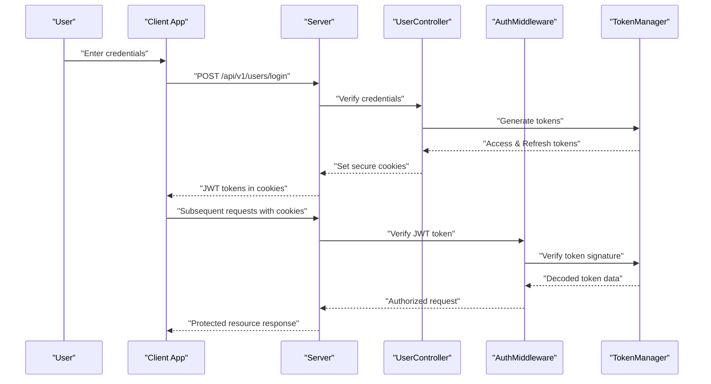

**Diagram sources**
- [Login.jsx:23-44](file://Client/src/pages/Login.jsx#L23-L44)
- [user.routers.js:18-19](file://Backend/src/routes/user.routers.js#L18-L19)
- [user.controller.js:355-464](file://Backend/src/controllers/user.controller.js#L355-L464)
- [auth.middleware.js:7-43](file://Backend/src/middlewares/auth.middleware.js#L7-L43)
- [Token.js:4-34](file://Backend/src/utils/Token.js#L4-L34)

## Detailed Component Analysis

### Backend: JWT Middleware System
- **Token Verification**:
  - Extracts tokens from cookies or Authorization headers
  - Verifies JWT signature and expiration
  - Attaches authenticated user to request object
  - Handles account deactivation protection
- **Role-Based Authorization**:
  - Flexible role array validation
  - Specialized authorization functions for different role combinations
  - Optional authentication mode for non-critical endpoints
  - Comprehensive error handling with specific role messages
- **Security Features**:
  - HTTP-only cookies prevent XSS attacks
  - Secure cookies in production environments
  - SameSite strict policy prevents CSRF
  - Token expiration enforcement

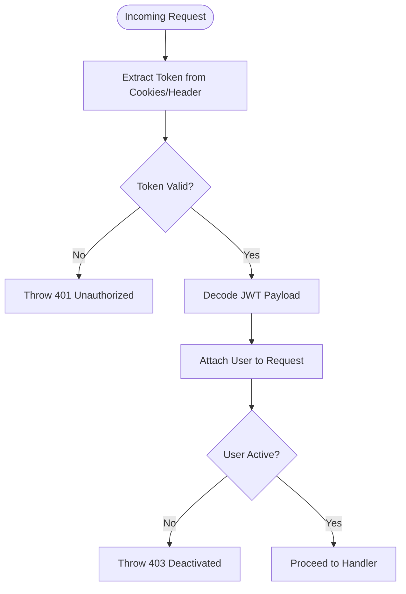

**Diagram sources**
- [auth.middleware.js:7-43](file://Backend/src/middlewares/auth.middleware.js#L7-L43)
- [auth.middleware.js:46-61](file://Backend/src/middlewares/auth.middleware.js#L46-L61)

**Section sources**
- [auth.middleware.js:1-120](file://Backend/src/middlewares/auth.middleware.js#L1-L120)

### Backend: Token Management Utility
- **Token Generation**:
  - Access tokens: 15-minute expiration with user payload
  - Refresh tokens: 7-day expiration for session renewal
  - Configurable via environment variables
  - Secure signing with dedicated secrets
- **Token Verification**:
  - Separate verification functions for access and refresh tokens
  - Graceful error handling for expired tokens
  - Signature validation with error recovery
- **Cookie Configuration**:
  - HTTP-only cookies prevent client-side access
  - Secure cookies in production for HTTPS
  - SameSite strict policy for CSRF protection
  - Configurable expiration times

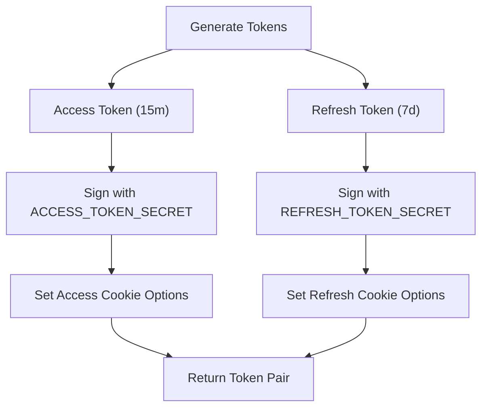

**Diagram sources**
- [Token.js:4-34](file://Backend/src/utils/Token.js#L4-L34)
- [Token.js:58-71](file://Backend/src/utils/Token.js#L58-L71)

**Section sources**
- [Token.js:1-71](file://Backend/src/utils/Token.js#L1-L71)

### Backend: Enhanced User Controller (JWT Authentication)
- **Comprehensive Authentication Flow**:
  - Credential validation with user ID or student/faculty ID
  - Account activation verification
  - Password comparison with bcrypt
  - Token generation and database storage
  - User detail aggregation with student/faculty information
- **Session Management**:
  - Dual-cookie token storage (access and refresh)
  - Token refresh endpoint with rotation
  - Logout endpoint with token clearing
  - Password change with validation
- **Security Features**:
  - Password hashing with configurable salt rounds
  - Role-based access control integration
  - Input validation and sanitization
  - Comprehensive error handling

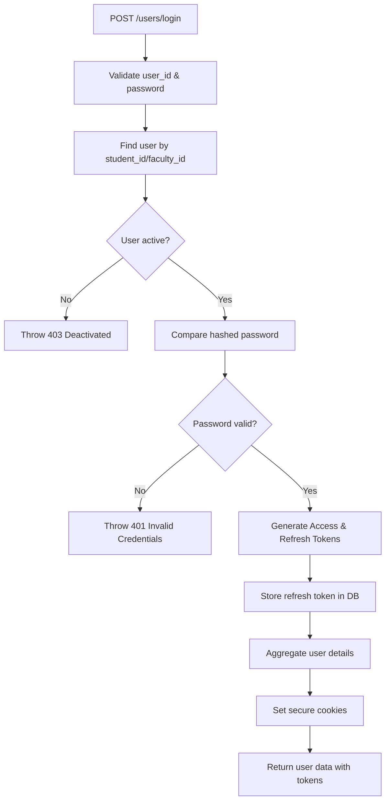

**Diagram sources**
- [user.controller.js:355-464](file://Backend/src/controllers/user.controller.js#L355-L464)

**Section sources**
- [user.controller.js:355-583](file://Backend/src/controllers/user.controller.js#L355-L583)

### Backend: Advanced User Model
- **Enhanced Role System**:
  - Expanded role enumeration: admin, faculty, student, coordinator, hod
  - Role validation with custom error messages
  - Flexible role assignment for different user types
- **Security Features**:
  - Pre-save password hashing with bcrypt
  - Configurable salt rounds via environment variables
  - Password comparison method for authentication
  - User ID generation based on role type
- **Session Management**:
  - Refresh token field for JWT session tracking
  - Account activation/deactivation support
  - Audit trail with created_by/updated_by references

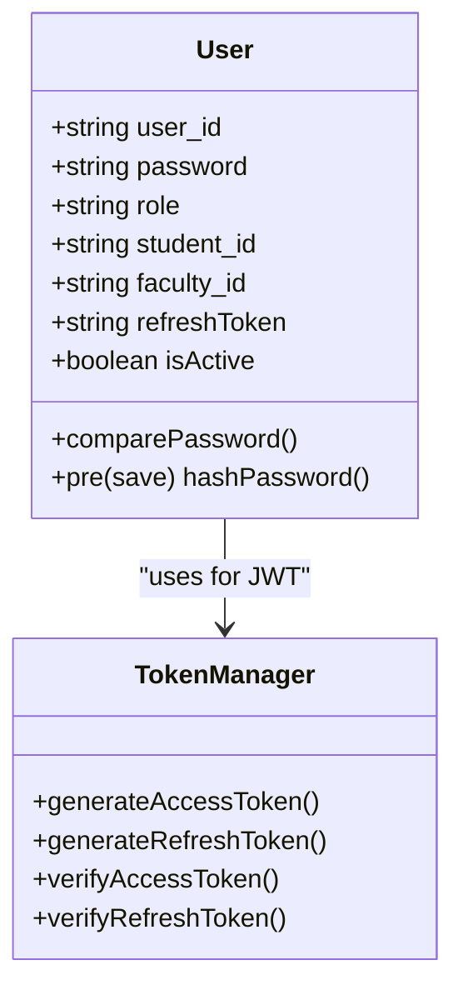

**Diagram sources**
- [user.models.js:1-97](file://Backend/src/models/user.models.js#L1-L97)
- [Token.js:1-71](file://Backend/src/utils/Token.js#L1-L71)

**Section sources**
- [user.models.js:1-97](file://Backend/src/models/user.models.js#L1-L97)

### Frontend: Redux Authentication Slice
- **State Management**:
  - Authentication state with Redux persistence
  - User data storage with automatic serialization
  - Login action sets authentication flags and user data
  - Logout action clears all authentication state
- **Session Management**:
  - Async thunk for session verification on app load
  - Automatic authentication state restoration
  - Error handling for session verification failures
- **Persistence Strategy**:
  - Redux store for session continuity across browser restarts
  - Automatic state restoration on application load
  - Clean separation of authentication and application state

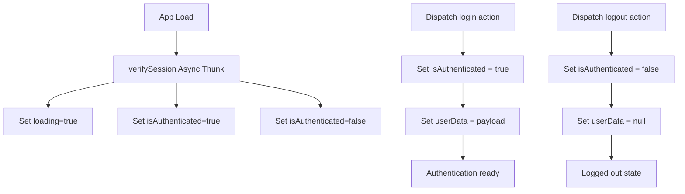

**Diagram sources**
- [authSlice.js:14-25](file://Client/src/store/auth/authSlice.js#L14-L25)

**Section sources**
- [authSlice.js:1-26](file://Client/src/store/auth/authSlice.js#L1-L26)
- [store.js:7-14](file://Client/src/store/store.js#L7-L14)

### Frontend: Login Page and Role-Based Routing
- **JWT Authentication Flow**:
  - Submits credentials to JWT login endpoint
  - Receives secure cookies containing access and refresh tokens
  - Redirects based on returned role with enhanced security
  - Dispatches login action to update Redux state
- **Security Enhancements**:
  - Token-based authentication eliminates localStorage token storage
  - Secure cookies prevent client-side token theft
  - Automatic token refresh handled server-side
  - Enhanced role validation and error handling

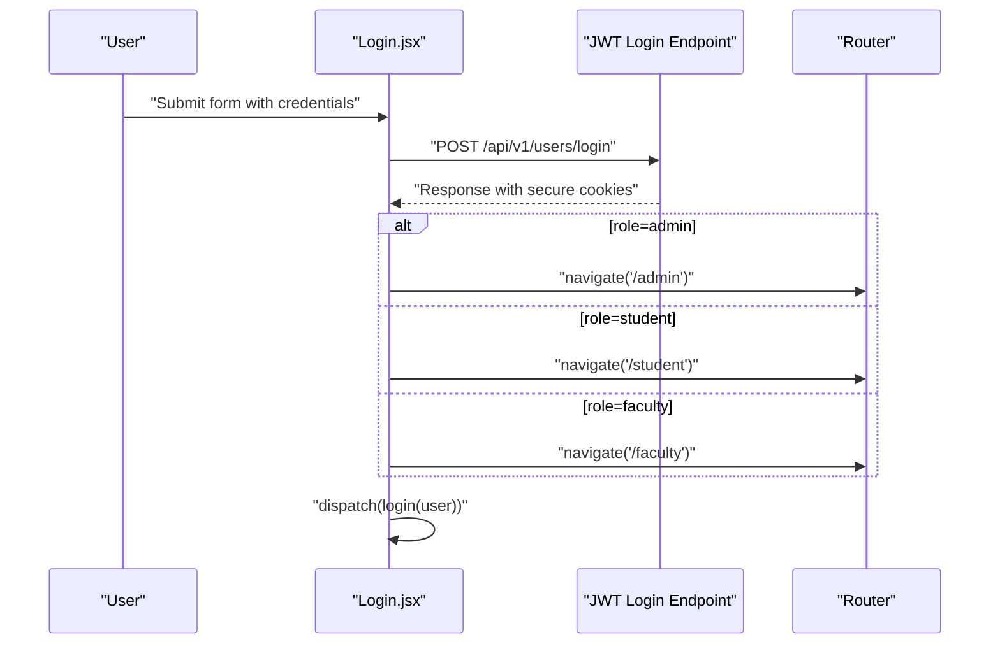

**Diagram sources**
- [Login.jsx:15-45](file://Client/src/pages/Login.jsx#L15-L45)

**Section sources**
- [Login.jsx:1-320](file://Client/src/pages/Login.jsx#L1-L320)

### Frontend: Protected Dashboards (RBAC)
- **Enhanced Role-Based Access Control**:
  - Admin dashboard: Full administrative privileges
  - Faculty dashboard: Teaching and scheduling access
  - Student dashboard: Timetable and academic information
  - Client-side guards verify authentication and role
  - Automatic redirection for unauthorized access attempts
- **Security Implementation**:
  - Combined client-side and server-side protection
  - Role validation ensures appropriate resource access
  - Redirects to login page for unauthenticated users

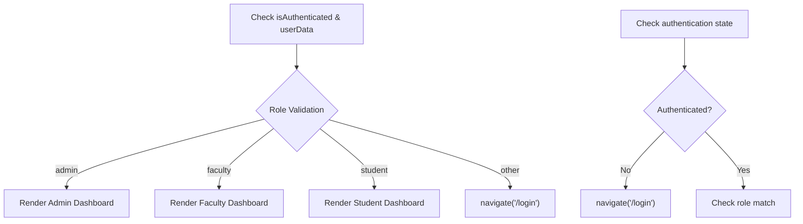

**Diagram sources**
- [Admin.jsx:40-49](file://Client/src/pages/dashboard/Admin.jsx#L40-L49)
- [Faculty.jsx:10-19](file://Client/src/pages/dashboard/Faculty.jsx#L10-L19)
- [Student.jsx:10-19](file://Client/src/pages/dashboard/Student.jsx#L10-L19)

**Section sources**
- [Admin.jsx:1-638](file://Client/src/pages/dashboard/Admin.jsx#L1-L638)
- [Faculty.jsx:1-22](file://Client/src/pages/dashboard/Faculty.jsx#L1-L22)
- [Student.jsx:1-23](file://Client/src/pages/dashboard/Student.jsx#L1-L23)

### Backend: Routes and Enhanced Protection
- **Protected Route Configuration**:
  - JWT middleware applied to all protected endpoints
  - Role-based authorization for different endpoint groups
  - Flexible role arrays for multi-role access control
  - Comprehensive endpoint coverage for user management
- **Security Integration**:
  - Middleware chain ensures token verification before authorization
  - Role validation prevents unauthorized resource access
  - Account deactivation protection at route level

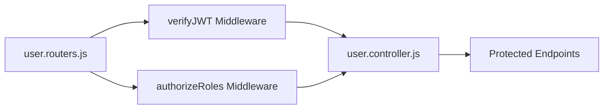

**Diagram sources**
- [user.routers.js:1-39](file://Backend/src/routes/user.routers.js#L1-L39)
- [auth.middleware.js:7-61](file://Backend/src/middlewares/auth.middleware.js#L7-L61)

**Section sources**
- [user.routers.js:1-39](file://Backend/src/routes/user.routers.js#L1-L39)
- [auth.middleware.js:1-120](file://Backend/src/middlewares/auth.middleware.js#L1-L120)

### Frontend: API Client with Cookie Handling
- **Enhanced API Configuration**:
  - HTTP-only cookie support with withCredentials: true
  - Automatic token transmission with each request
  - Request caching for GET operations
  - Response interceptors for error handling
- **Performance Optimizations**:
  - Request deduplication for concurrent identical requests
  - Cache invalidation on mutations
  - Network error retry with exponential backoff
  - Development logging for request performance

**Section sources**
- [apiClient.js:1-213](file://Client/src/services/apiClient.js#L1-L213)

## Dependency Analysis
- **Client Dependencies**:
  - Redux store for authentication state management
  - Login page triggers JWT authentication flow
  - Protected dashboards enforce role-based access
  - Client-side guards complement server-side protection
  - API client handles cookie-based authentication
- **Server Dependencies**:
  - JWT middleware for token verification and authorization
  - Token utility for secure token management
  - User controller for comprehensive authentication endpoints
  - User model with enhanced security features
  - Enhanced utilities for consistent API responses
- **Security Dependencies**:
  - bcryptjs for password hashing
  - jsonwebtoken for JWT token operations
  - cookie-parser for secure cookie handling
  - dotenv for environment variable configuration

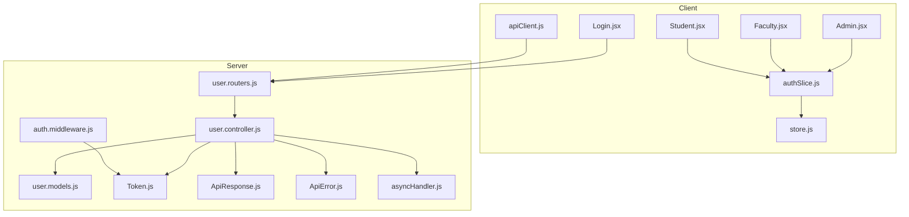

**Diagram sources**
- [authSlice.js:1-26](file://Client/src/store/auth/authSlice.js#L1-L26)
- [store.js:1-15](file://Client/src/store/store.js#L1-L15)
- [Login.jsx:1-320](file://Client/src/pages/Login.jsx#L1-L320)
- [Admin.jsx:1-638](file://Client/src/pages/dashboard/Admin.jsx#L1-L638)
- [Faculty.jsx:1-22](file://Client/src/pages/dashboard/Faculty.jsx#L1-L22)
- [Student.jsx:1-23](file://Client/src/pages/dashboard/Student.jsx#L1-L23)
- [user.routers.js:1-39](file://Backend/src/routes/user.routers.js#L1-L39)
- [user.controller.js:1-583](file://Backend/src/controllers/user.controller.js#L1-L583)
- [user.models.js:1-97](file://Backend/src/models/user.models.js#L1-L97)
- [auth.middleware.js:1-120](file://Backend/src/middlewares/auth.middleware.js#L1-L120)
- [Token.js:1-71](file://Backend/src/utils/Token.js#L1-L71)
- [ApiResponse.js:1-74](file://Backend/src/utils/ApiResponse.js#L1-L74)
- [ApiError.js:1-80](file://Backend/src/utils/ApiError.js#L1-L80)
- [asyncHandler.js:1-47](file://Backend/src/utils/asyncHandler.js#L1-L47)

**Section sources**
- [authSlice.js:1-26](file://Client/src/store/auth/authSlice.js#L1-L26)
- [store.js:1-15](file://Client/src/store/store.js#L1-L15)
- [Login.jsx:1-320](file://Client/src/pages/Login.jsx#L1-L320)
- [Admin.jsx:1-638](file://Client/src/pages/dashboard/Admin.jsx#L1-L638)
- [Faculty.jsx:1-22](file://Client/src/pages/dashboard/Faculty.jsx#L1-L22)
- [Student.jsx:1-23](file://Client/src/pages/dashboard/Student.jsx#L1-L23)
- [user.routers.js:1-39](file://Backend/src/routes/user.routers.js#L1-L39)
- [user.controller.js:1-583](file://Backend/src/controllers/user.controller.js#L1-L583)
- [user.models.js:1-97](file://Backend/src/models/user.models.js#L1-L97)
- [auth.middleware.js:1-120](file://Backend/src/middlewares/auth.middleware.js#L1-L120)
- [Token.js:1-71](file://Backend/src/utils/Token.js#L1-L71)
- [ApiResponse.js:1-74](file://Backend/src/utils/ApiResponse.js#L1-L74)
- [ApiError.js:1-80](file://Backend/src/utils/ApiError.js#L1-L80)
- [asyncHandler.js:1-47](file://Backend/src/utils/asyncHandler.js#L1-L47)

## Performance Considerations
- **JWT Token Benefits**:
  - Stateless authentication eliminates server-side session storage
  - Reduced database queries for authentication checks
  - Improved scalability with horizontal scaling
  - Automatic token refresh reduces login frequency
- **Token Management Optimizations**:
  - Short-lived access tokens (15 minutes) minimize security risk
  - Long-lived refresh tokens (7 days) balance security and usability
  - HTTP-only cookies prevent client-side token theft
  - Token rotation enhances security through frequent changes
- **Security Enhancements**:
  - HTTPS-only cookies in production environments
  - SameSite strict policy prevents cross-site request forgery
  - Configurable salt rounds for password hashing performance
  - Environment variable configuration for deployment flexibility
- **Frontend Performance**:
  - Request caching reduces redundant API calls
  - Session verification prevents unnecessary re-authentication
  - Async loading states improve user experience
  - Network retry logic handles transient failures

## Troubleshooting Guide
- **JWT Authentication Issues**:
  - Token expiration: Access tokens expire every 15 minutes, refresh tokens every 7 days
  - Token verification failures: Check token signature and expiration dates
  - Cookie storage problems: Verify HTTP-only and secure cookie settings
- **Role-Based Access Problems**:
  - Role validation failures: Ensure user has correct role assigned
  - Permission denied errors: Verify role array includes required roles
  - Account deactivation: Check user isActive flag in database
- **Password and Security Issues**:
  - Password hashing errors: Verify bcrypt installation and salt rounds
  - Token refresh failures: Check refresh token validity and database storage
  - Logout problems: Ensure token clearing and cookie removal
- **Frontend Authentication Issues**:
  - Session verification failures: Check Redux state and API response format
  - Navigation problems: Verify role-based routing and authentication guards
  - Cookie handling issues: Ensure withCredentials is enabled in API client
- **Common Solutions**:
  - Clear browser cookies and cache for token-related issues
  - Verify environment variables for token secrets and expiration
  - Check database connectivity for user authentication
  - Review server logs for detailed error information
  - Test API endpoints independently to isolate frontend issues

**Section sources**
- [user.controller.js:355-583](file://Backend/src/controllers/user.controller.js#L355-L583)
- [auth.middleware.js:1-120](file://Backend/src/middlewares/auth.middleware.js#L1-L120)
- [Token.js:1-71](file://Backend/src/utils/Token.js#L1-L71)
- [authSlice.js:20-25](file://Client/src/store/auth/authSlice.js#L20-L25)
- [Admin.jsx:40-49](file://Client/src/pages/dashboard/Admin.jsx#L40-L49)
- [Faculty.jsx:10-19](file://Client/src/pages/dashboard/Faculty.jsx#L10-L19)
- [Student.jsx:10-19](file://Client/src/pages/dashboard/Student.jsx#L10-L19)
- [apiClient.js:105-151](file://Client/src/services/apiClient.js#L105-L151)

## Conclusion
The system now implements a comprehensive, production-ready JWT-based authentication system with advanced security features. The new architecture provides secure token-based sessions, granular role-based access control, automatic token refresh, and enhanced user management capabilities. The implementation follows industry best practices with HTTP-only cookies, secure token storage, and comprehensive error handling. For production deployment, ensure proper environment variable configuration, SSL certificate setup, and regular security audits to maintain the highest level of security and reliability. The integrated frontend Redux authentication slice provides seamless user experience with automatic session management and role-based navigation.