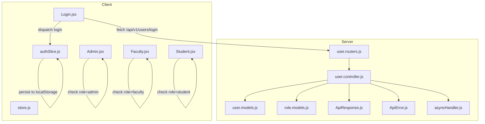
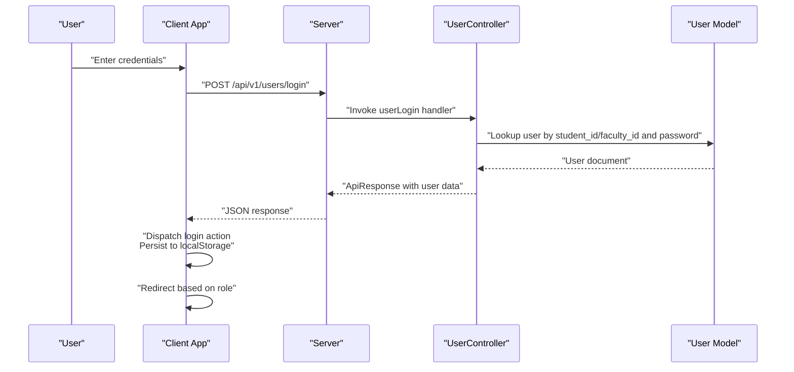
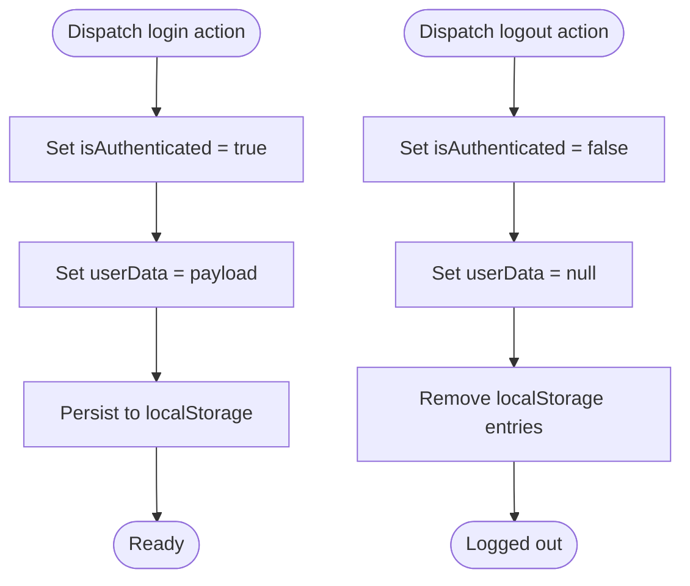
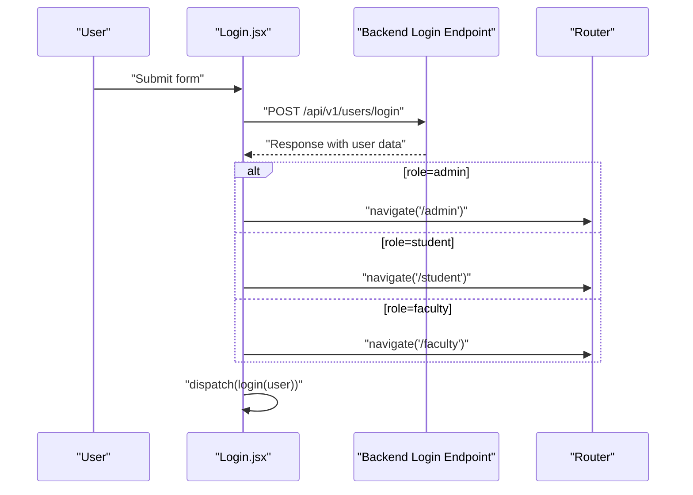
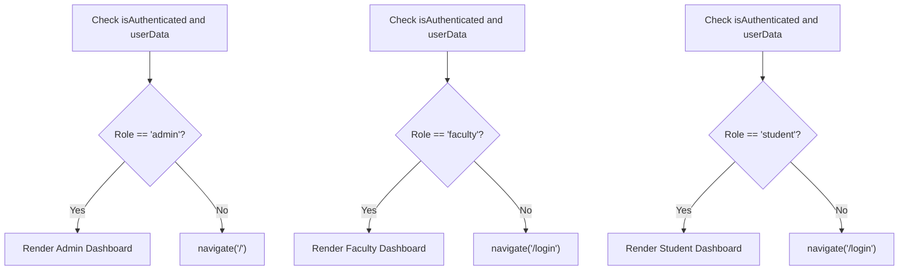
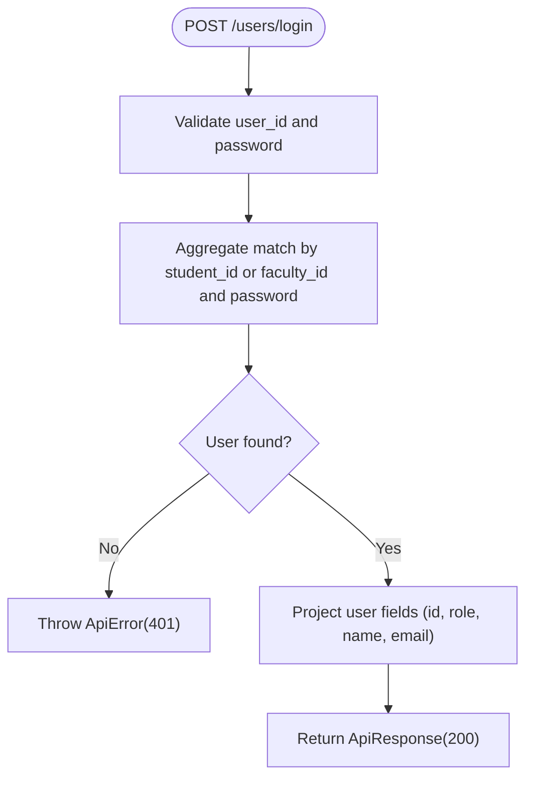
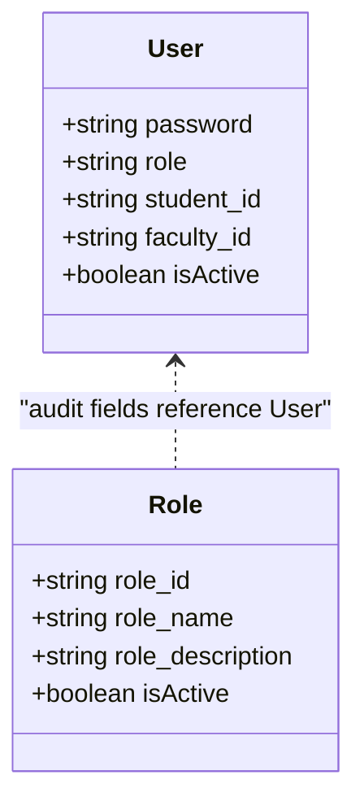
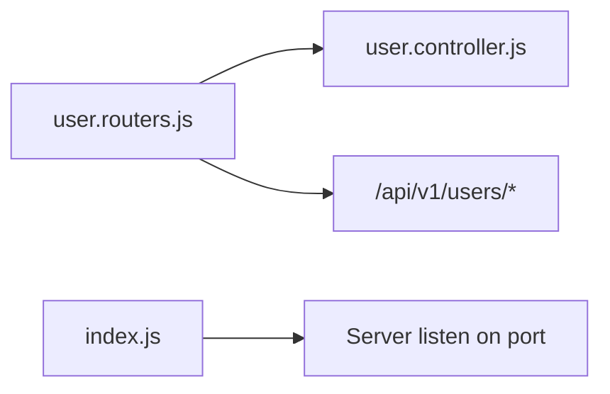
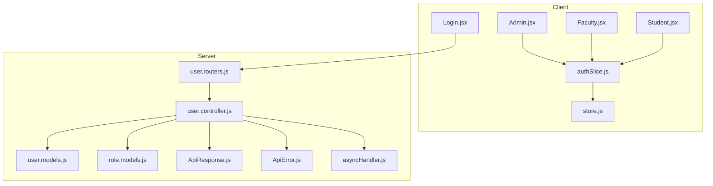

# Authentication & Authorization

<cite>
**Referenced Files in This Document**
- [user.controller.js](file://Backend/src/controllers/user.controller.js)
- [user.models.js](file://Backend/src/models/user.models.js)
- [role.models.js](file://Backend/src/models/role.models.js)
- [user.routers.js](file://Backend/src/routes/user.routers.js)
- [authSlice.js](file://Client/src/store/auth/authSlice.js)
- [store.js](file://Client/src/store/store.js)
- [Login.jsx](file://Client/src/pages/Login.jsx)
- [Admin.jsx](file://Client/src/pages/dashboard/Admin.jsx)
- [Faculty.jsx](file://Client/src/pages/dashboard/Faculty.jsx)
- [Student.jsx](file://Client/src/pages/dashboard/Student.jsx)
- [ApiError.js](file://Backend/src/utils/ApiError.js)
- [ApiResponse.js](file://Backend/src/utils/ApiResponse.js)
- [asyncHandler.js](file://Backend/src/utils/asyncHandler.js)
- [index.js](file://Backend/src/index.js)
</cite>

## Table of Contents
1. [Introduction](#introduction)
2. [Project Structure](#project-structure)
3. [Core Components](#core-components)
4. [Architecture Overview](#architecture-overview)
5. [Detailed Component Analysis](#detailed-component-analysis)
6. [Dependency Analysis](#dependency-analysis)
7. [Performance Considerations](#performance-considerations)
8. [Troubleshooting Guide](#troubleshooting-guide)
9. [Conclusion](#conclusion)

## Introduction
This document explains the authentication and authorization system for the timetable project. It covers the login flow, state management with Redux, role-based access control (RBAC) across admin, faculty, and student roles, and the backend controller implementation for user authentication. It also outlines security best practices, logout procedures, and common error handling patterns.

## Project Structure
The authentication system spans both frontend and backend:
- Frontend (React + Redux Toolkit):
  - Authentication state slice and persistence via localStorage
  - Login page and role-based routing
  - Protected dashboards for admin, faculty, and student
- Backend (Express + MongoDB):
  - User model with role enumeration
  - User controller with login endpoint
  - Route bindings for user endpoints
  - Utility classes for consistent API responses and error handling

**Diagram sources**
- [Login.jsx:15-45](file://Client/src/pages/Login.jsx#L15-L45)
- [authSlice.js:10-27](file://Client/src/store/auth/authSlice.js#L10-L27)
- [store.js:7-14](file://Client/src/store/store.js#L7-L14)
- [user.routers.js:1-19](file://Backend/src/routes/user.routers.js#L1-L19)
- [user.controller.js:280-355](file://Backend/src/controllers/user.controller.js#L280-L355)
- [user.models.js:1-61](file://Backend/src/models/user.models.js#L1-L61)
- [role.models.js:1-43](file://Backend/src/models/role.models.js#L1-L43)
- [ApiResponse.js:1-10](file://Backend/src/utils/ApiResponse.js#L1-L10)
- [ApiError.js:1-21](file://Backend/src/utils/ApiError.js#L1-L21)
- [asyncHandler.js:1-4](file://Backend/src/utils/asyncHandler.js#L1-L4)

**Section sources**
- [Login.jsx:1-116](file://Client/src/pages/Login.jsx#L1-L116)
- [authSlice.js:1-32](file://Client/src/store/auth/authSlice.js#L1-L32)
- [store.js:1-15](file://Client/src/store/store.js#L1-L15)
- [user.routers.js:1-19](file://Backend/src/routes/user.routers.js#L1-L19)
- [user.controller.js:1-355](file://Backend/src/controllers/user.controller.js#L1-L355)
- [user.models.js:1-61](file://Backend/src/models/user.models.js#L1-L61)
- [role.models.js:1-43](file://Backend/src/models/role.models.js#L1-L43)
- [ApiResponse.js:1-10](file://Backend/src/utils/ApiResponse.js#L1-L10)
- [ApiError.js:1-21](file://Backend/src/utils/ApiError.js#L1-L21)
- [asyncHandler.js:1-4](file://Backend/src/utils/asyncHandler.js#L1-L4)

## Core Components
- Authentication state management (Redux):
  - Stores authentication status and user payload in localStorage
  - Provides login and logout actions
- Login page:
  - Submits credentials to the backend login endpoint
  - Redirects based on returned role and updates Redux state
- Backend user controller:
  - Validates input and authenticates users
  - Returns user profile with role and minimal fields
- Models:
  - User model defines role enum and optional identifiers
  - Role model defines role metadata (not used in login flow)
- Utilities:
  - ApiResponse and ApiError normalize responses and errors
  - asyncHandler wraps route handlers to catch exceptions

**Section sources**
- [authSlice.js:1-32](file://Client/src/store/auth/authSlice.js#L1-L32)
- [Login.jsx:15-45](file://Client/src/pages/Login.jsx#L15-L45)
- [user.controller.js:280-355](file://Backend/src/controllers/user.controller.js#L280-L355)
- [user.models.js:1-61](file://Backend/src/models/user.models.js#L1-L61)
- [role.models.js:1-43](file://Backend/src/models/role.models.js#L1-L43)
- [ApiResponse.js:1-10](file://Backend/src/utils/ApiResponse.js#L1-L10)
- [ApiError.js:1-21](file://Backend/src/utils/ApiError.js#L1-L21)
- [asyncHandler.js:1-4](file://Backend/src/utils/asyncHandler.js#L1-L4)

## Architecture Overview
The authentication flow is a client-server interaction:
- Client collects credentials and posts to the login endpoint
- Server validates credentials and returns user data
- Client stores user data and redirects to role-specific dashboard
- Dashboards enforce role-based access

**Diagram sources**
- [Login.jsx:23-44](file://Client/src/pages/Login.jsx#L23-L44)
- [user.routers.js](file://Backend/src/routes/user.routers.js#L16)
- [user.controller.js:280-355](file://Backend/src/controllers/user.controller.js#L280-L355)
- [user.models.js:1-61](file://Backend/src/models/user.models.js#L1-L61)
- [ApiResponse.js:1-10](file://Backend/src/utils/ApiResponse.js#L1-L10)

## Detailed Component Analysis

### Frontend: Redux Authentication Slice
- Purpose:
  - Manage authentication state (authenticated flag and user payload)
  - Persist state to localStorage for session continuity
- Actions:
  - login: sets authenticated flag and user data; persists to localStorage
  - logout: clears authentication state and removes persisted data
- Persistence:
  - Uses localStorage keys for authentication status and user data

**Diagram sources**
- [authSlice.js:14-25](file://Client/src/store/auth/authSlice.js#L14-L25)

**Section sources**
- [authSlice.js:1-32](file://Client/src/store/auth/authSlice.js#L1-L32)
- [store.js:7-14](file://Client/src/store/store.js#L7-L14)

### Frontend: Login Page and Role-Based Routing
- Behavior:
  - Submits credentials to the backend login endpoint
  - On success, reads role and navigates to admin/student/faculty route
  - Dispatches login action to update Redux state
- Security note:
  - Current implementation does not enforce role checks on the client side during navigation; rely on server-side protections and dashboard guards

**Diagram sources**
- [Login.jsx:15-45](file://Client/src/pages/Login.jsx#L15-L45)

**Section sources**
- [Login.jsx:1-116](file://Client/src/pages/Login.jsx#L1-L116)

### Frontend: Protected Dashboards (RBAC)
- Admin dashboard:
  - Guards access by checking authentication and role
  - Navigates to home if not authenticated or role is not admin
- Faculty and Student dashboards:
  - Guard access similarly by checking authentication and role

**Diagram sources**
- [Admin.jsx:40-49](file://Client/src/pages/dashboard/Admin.jsx#L40-L49)
- [Faculty.jsx:10-19](file://Client/src/pages/dashboard/Faculty.jsx#L10-L19)
- [Student.jsx:10-19](file://Client/src/pages/dashboard/Student.jsx#L10-L19)

**Section sources**
- [Admin.jsx:1-617](file://Client/src/pages/dashboard/Admin.jsx#L1-L617)
- [Faculty.jsx:1-22](file://Client/src/pages/dashboard/Faculty.jsx#L1-L22)
- [Student.jsx:1-23](file://Client/src/pages/dashboard/Student.jsx#L1-L23)

### Backend: User Controller (Authentication)
- Responsibilities:
  - Validate input fields
  - Authenticate user by matching either student_id or faculty_id with password
  - Return user profile with role and minimal fields
- Error handling:
  - Throws ApiError for invalid credentials and other failures
- Response:
  - Uses ApiResponse for consistent success responses

**Diagram sources**
- [user.controller.js:280-355](file://Backend/src/controllers/user.controller.js#L280-L355)
- [ApiError.js:1-21](file://Backend/src/utils/ApiError.js#L1-L21)
- [ApiResponse.js:1-10](file://Backend/src/utils/ApiResponse.js#L1-L10)

**Section sources**
- [user.controller.js:280-355](file://Backend/src/controllers/user.controller.js#L280-L355)
- [ApiError.js:1-21](file://Backend/src/utils/ApiError.js#L1-L21)
- [ApiResponse.js:1-10](file://Backend/src/utils/ApiResponse.js#L1-L10)

### Backend: Models and Roles
- User model:
  - Defines role enum with accepted values
  - Supports optional student_id and faculty_id
  - Includes isActive flag and audit fields
- Role model:
  - Defines role metadata (role_id, role_name, description)
  - Not used in current login flow but can support RBAC policies

**Diagram sources**
- [user.models.js:1-61](file://Backend/src/models/user.models.js#L1-L61)
- [role.models.js:1-43](file://Backend/src/models/role.models.js#L1-L43)

**Section sources**
- [user.models.js:1-61](file://Backend/src/models/user.models.js#L1-L61)
- [role.models.js:1-43](file://Backend/src/models/role.models.js#L1-L43)

### Backend: Routes and Entry Point
- Routes:
  - Bind GET/POST endpoints for users and login
- Entry point:
  - Initializes environment and starts server

**Diagram sources**
- [user.routers.js:1-19](file://Backend/src/routes/user.routers.js#L1-L19)
- [index.js:1-18](file://Backend/src/index.js#L1-L18)

**Section sources**
- [user.routers.js:1-19](file://Backend/src/routes/user.routers.js#L1-L19)
- [index.js:1-18](file://Backend/src/index.js#L1-L18)

## Dependency Analysis
- Client depends on:
  - Redux store for authentication state
  - Login page to trigger authentication
  - Protected dashboards to enforce role checks
- Server depends on:
  - User controller for authentication logic
  - User and Role models for data representation
  - Utilities for consistent responses and error handling
- Coupling:
  - Client relies on server-provided role field for routing
  - Server returns minimal user data suitable for UI rendering

**Diagram sources**
- [authSlice.js:1-32](file://Client/src/store/auth/authSlice.js#L1-L32)
- [store.js:1-15](file://Client/src/store/store.js#L1-L15)
- [Login.jsx:1-116](file://Client/src/pages/Login.jsx#L1-L116)
- [Admin.jsx:1-617](file://Client/src/pages/dashboard/Admin.jsx#L1-L617)
- [Faculty.jsx:1-22](file://Client/src/pages/dashboard/Faculty.jsx#L1-L22)
- [Student.jsx:1-23](file://Client/src/pages/dashboard/Student.jsx#L1-L23)
- [user.routers.js:1-19](file://Backend/src/routes/user.routers.js#L1-L19)
- [user.controller.js:1-355](file://Backend/src/controllers/user.controller.js#L1-L355)
- [user.models.js:1-61](file://Backend/src/models/user.models.js#L1-L61)
- [role.models.js:1-43](file://Backend/src/models/role.models.js#L1-L43)
- [ApiResponse.js:1-10](file://Backend/src/utils/ApiResponse.js#L1-L10)
- [ApiError.js:1-21](file://Backend/src/utils/ApiError.js#L1-L21)
- [asyncHandler.js:1-4](file://Backend/src/utils/asyncHandler.js#L1-L4)

**Section sources**
- [authSlice.js:1-32](file://Client/src/store/auth/authSlice.js#L1-L32)
- [store.js:1-15](file://Client/src/store/store.js#L1-L15)
- [Login.jsx:1-116](file://Client/src/pages/Login.jsx#L1-L116)
- [Admin.jsx:1-617](file://Client/src/pages/dashboard/Admin.jsx#L1-L617)
- [Faculty.jsx:1-22](file://Client/src/pages/dashboard/Faculty.jsx#L1-L22)
- [Student.jsx:1-23](file://Client/src/pages/dashboard/Student.jsx#L1-L23)
- [user.routers.js:1-19](file://Backend/src/routes/user.routers.js#L1-L19)
- [user.controller.js:1-355](file://Backend/src/controllers/user.controller.js#L1-L355)
- [user.models.js:1-61](file://Backend/src/models/user.models.js#L1-L61)
- [role.models.js:1-43](file://Backend/src/models/role.models.js#L1-L43)
- [ApiResponse.js:1-10](file://Backend/src/utils/ApiResponse.js#L1-L10)
- [ApiError.js:1-21](file://Backend/src/utils/ApiError.js#L1-L21)
- [asyncHandler.js:1-4](file://Backend/src/utils/asyncHandler.js#L1-L4)

## Performance Considerations
- Tokenless sessions:
  - The current implementation stores user data in localStorage after login. There is no token refresh mechanism; session persists until logout.
- Recommendations:
  - Introduce short-lived access tokens and long-lived refresh tokens
  - Implement token refresh endpoints and automatic refresh logic
  - Add token expiration checks and proactive logout on token expiry
  - Enforce HTTPS and secure cookies for production deployments

[No sources needed since this section provides general guidance]

## Troubleshooting Guide
Common issues and resolutions:
- Invalid credentials:
  - Server responds with unauthorized status; client should display an error and prevent navigation
- Missing or empty fields:
  - Validation throws an error; ensure both user_id and password are provided
- Role mismatch:
  - Client-side guards redirect to appropriate pages; ensure role field is present in the response
- Logout:
  - Dispatch logout action and clear localStorage; ensure all protected routes re-check authentication

**Section sources**
- [user.controller.js:280-355](file://Backend/src/controllers/user.controller.js#L280-L355)
- [ApiError.js:1-21](file://Backend/src/utils/ApiError.js#L1-L21)
- [authSlice.js:20-25](file://Client/src/store/auth/authSlice.js#L20-L25)
- [Admin.jsx:40-49](file://Client/src/pages/dashboard/Admin.jsx#L40-L49)
- [Faculty.jsx:10-19](file://Client/src/pages/dashboard/Faculty.jsx#L10-L19)
- [Student.jsx:10-19](file://Client/src/pages/dashboard/Student.jsx#L10-L19)

## Conclusion
The system implements a straightforward, tokenless authentication flow with role-based routing. The frontend manages session state via Redux and localStorage, while the backend performs basic credential validation and returns a minimal user profile. For production, adopt token-based authentication with refresh mechanisms, enforce HTTPS, and strengthen input validation and error handling.