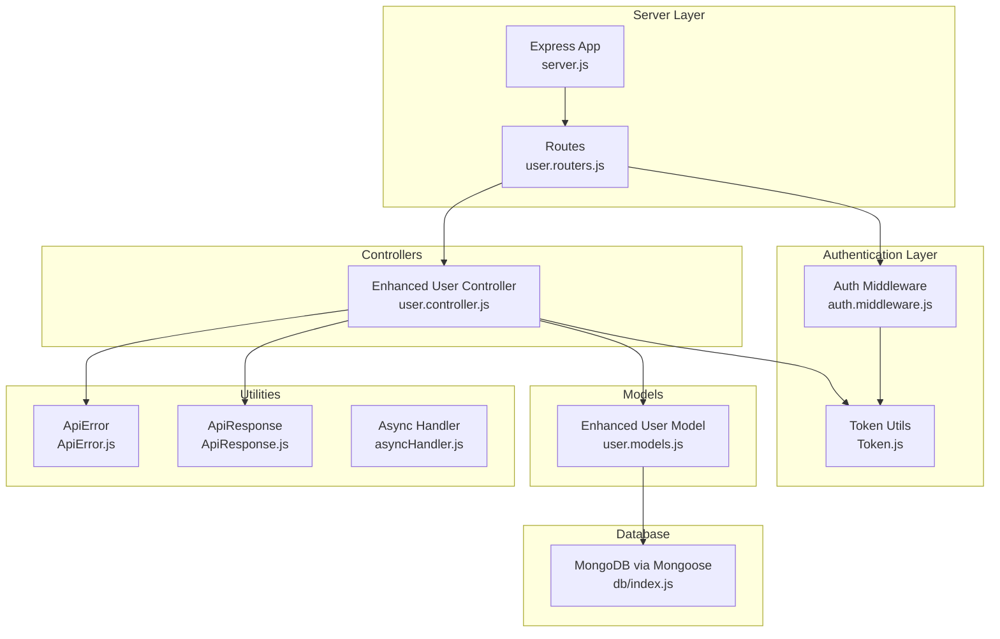
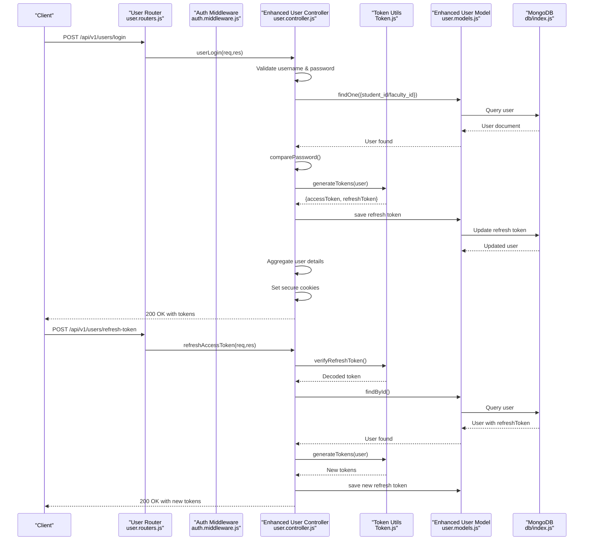
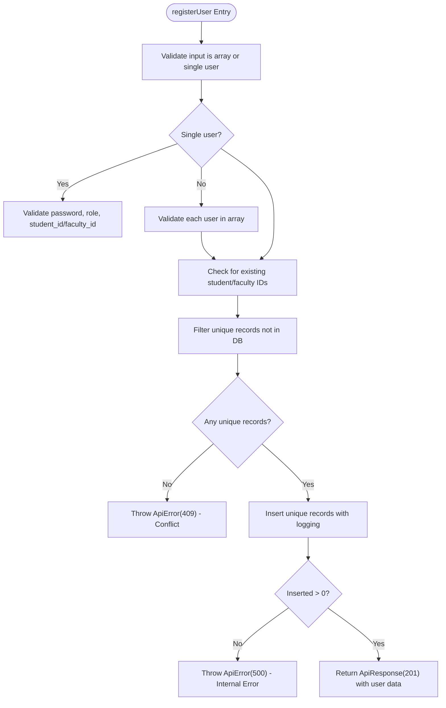
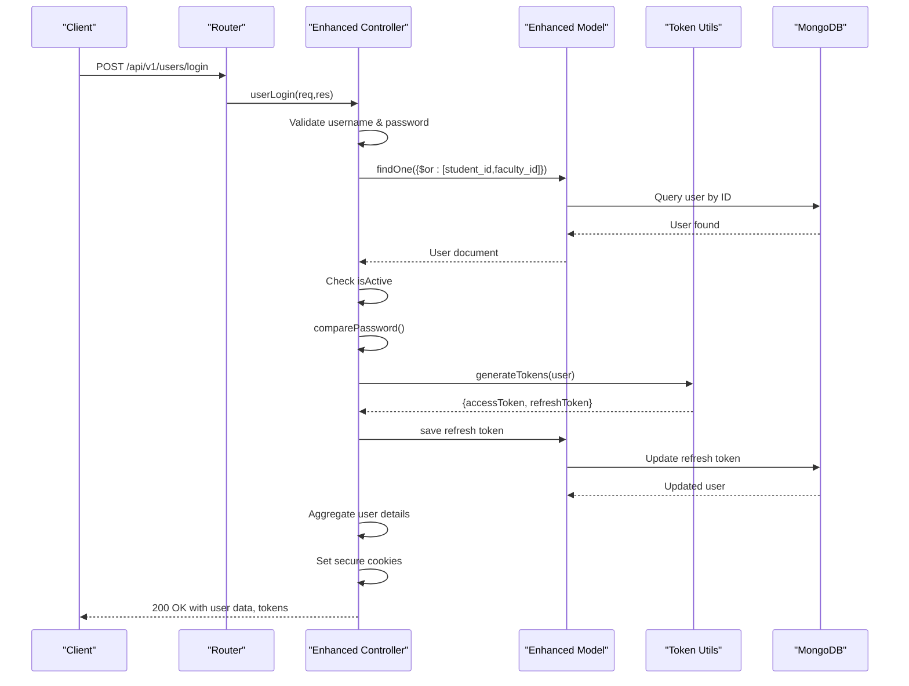
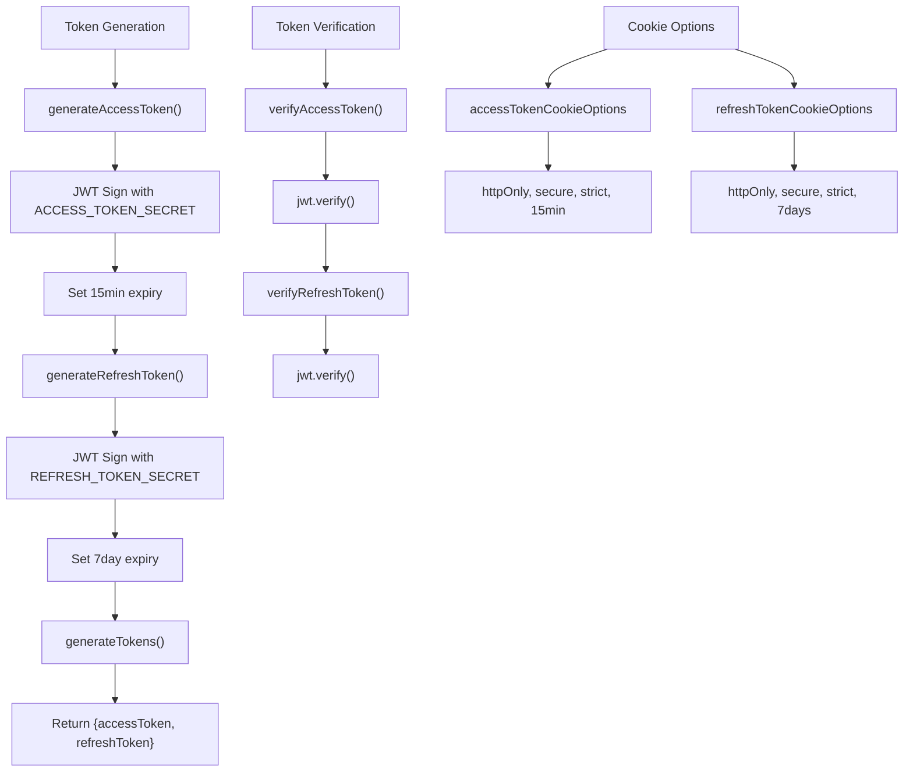
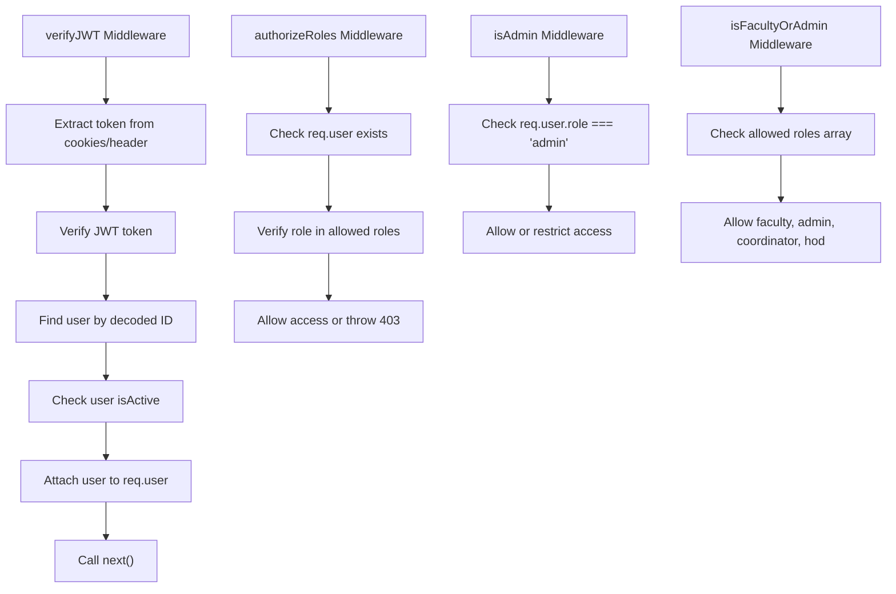
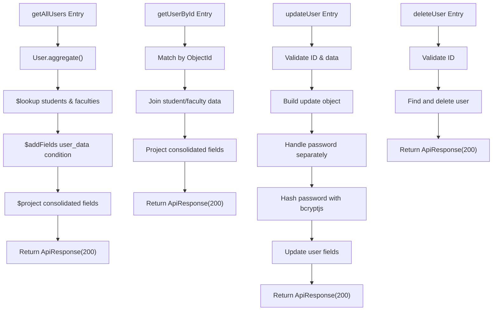
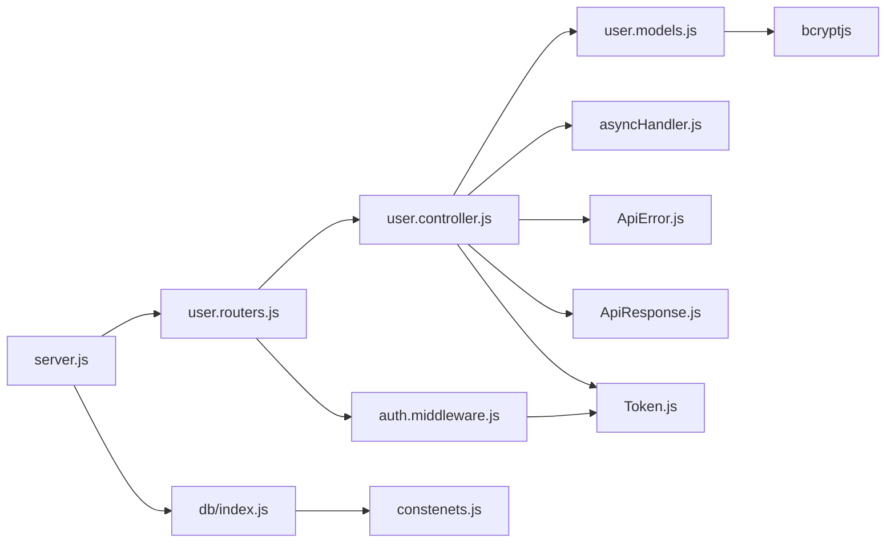

# Backend Authentication Controller

<cite>
**Referenced Files in This Document**
- [user.controller.js](file://Backend/src/controllers/user.controller.js)
- [user.models.js](file://Backend/src/models/user.models.js)
- [user.routers.js](file://Backend/src/routes/user.routers.js)
- [Token.js](file://Backend/src/utils/Token.js)
- [auth.middleware.js](file://Backend/src/middlewares/auth.middleware.js)
- [ApiError.js](file://Backend/src/utils/ApiError.js)
- [ApiResponse.js](file://Backend/src/utils/ApiResponse.js)
- [asyncHandler.js](file://Backend/src/utils/asyncHandler.js)
- [server.js](file://Backend/src/server.js)
- [db/index.js](file://Backend/src/db/index.js)
- [constenets.js](file://Backend/src/constenets.js)
</cite>

## Update Summary
**Changes Made**
- Complete JWT-based authentication implementation with token generation and management
- Password hashing using bcryptjs with secure pre-save hooks
- Secure httpOnly cookie handling for token storage
- Bulk user registration with intelligent duplicate detection
- Comprehensive error handling with structured ApiError responses
- Enhanced authentication middleware with role-based authorization
- Username-based login supporting student_id or faculty_id validation
- Token refresh cycle with refresh token verification and rotation
- Profile management with detailed user data aggregation

## Table of Contents
1. [Introduction](#introduction)
2. [Project Structure](#project-structure)
3. [Core Components](#core-components)
4. [Architecture Overview](#architecture-overview)
5. [Detailed Component Analysis](#detailed-component-analysis)
6. [Dependency Analysis](#dependency-analysis)
7. [Performance Considerations](#performance-considerations)
8. [Troubleshooting Guide](#troubleshooting-guide)
9. [Conclusion](#conclusion)

## Introduction
This document explains the enhanced backend authentication controller implementation for user registration, login, logout, token management, and profile management. The system now includes comprehensive JWT-based authentication, password hashing with bcryptjs, role-based authorization, and extensive debugging capabilities with console logging. It covers the complete user authentication flow including login validation, password verification, JWT token generation, user role assignment, and integration with Mongoose models for secure user data management.

## Project Structure
The authentication controller now operates within a fully secured ecosystem with JWT token management, role-based authorization, and comprehensive error handling. The system integrates with Mongoose models, Express routes, JWT utilities, authentication middleware, and shared utilities for error and response handling.

**Diagram sources**
- [server.js:1-106](file://Backend/src/server.js#L1-L106)
- [user.routers.js:1-41](file://Backend/src/routes/user.routers.js#L1-L41)
- [auth.middleware.js:1-121](file://Backend/src/middlewares/auth.middleware.js#L1-L121)
- [Token.js:1-71](file://Backend/src/utils/Token.js#L1-L71)
- [user.controller.js:1-654](file://Backend/src/controllers/user.controller.js#L1-L654)
- [user.models.js:1-97](file://Backend/src/models/user.models.js#L1-L97)
- [ApiError.js:1-80](file://Backend/src/utils/ApiError.js#L1-L80)
- [ApiResponse.js:1-74](file://Backend/src/utils/ApiResponse.js#L1-L74)
- [asyncHandler.js:1-47](file://Backend/src/utils/asyncHandler.js#L1-L47)
- [db/index.js:1-19](file://Backend/src/db/index.js#L1-L19)

**Section sources**
- [server.js:1-106](file://Backend/src/server.js#L1-L106)
- [user.routers.js:1-41](file://Backend/src/routes/user.routers.js#L1-L41)
- [auth.middleware.js:1-121](file://Backend/src/middlewares/auth.middleware.js#L1-L121)
- [Token.js:1-71](file://Backend/src/utils/Token.js#L1-L71)
- [user.controller.js:1-654](file://Backend/src/controllers/user.controller.js#L1-L654)
- [user.models.js:1-97](file://Backend/src/models/user.models.js#L1-L97)
- [ApiError.js:1-80](file://Backend/src/utils/ApiError.js#L1-L80)
- [ApiResponse.js:1-74](file://Backend/src/utils/ApiResponse.js#L1-L74)
- [asyncHandler.js:1-47](file://Backend/src/utils/asyncHandler.js#L1-L47)
- [db/index.js:1-19](file://Backend/src/db/index.js#L1-L19)

## Core Components
- **Enhanced User Controller**: Implements comprehensive authentication flows including registration, login with JWT, logout, token refresh, password change, and profile management. Features username-based login, password hashing, token generation, and extensive console logging for debugging.
- **Enhanced User Model**: Includes bcryptjs password hashing, user_id generation, role validation, and password comparison methods with pre-save hooks for automatic password encryption.
- **JWT Token System**: Full token management with access tokens (15 minutes), refresh tokens (7 days), secure cookie options, and token verification utilities.
- **Authentication Middleware**: Comprehensive middleware for JWT verification, role-based authorization, admin-only access, and optional authentication.
- **Enhanced Error Handling**: Structured error responses with ApiError class providing consistent HTTP status codes and error messages.
- **Response Formatting**: Standardized ApiResponse class for consistent success responses across all controller methods.

Key responsibilities:
- **Registration**: Validates user data, generates unique user_ids, hashes passwords, and handles both single and bulk user registration with duplicate detection.
- **Authentication**: Supports username-based login with student_id or faculty_id validation, password verification using bcryptjs, and JWT token generation.
- **Session Management**: Handles token refresh cycles, logout procedures, and secure cookie-based session management.
- **Profile Management**: Comprehensive CRUD operations with role-based access control and detailed user data aggregation.
- **Security**: Implements password hashing, token-based authentication, role-based authorization, and account deactivation handling.

**Section sources**
- [user.controller.js:14-132](file://Backend/src/controllers/user.controller.js#L14-L132)
- [user.controller.js:359-654](file://Backend/src/controllers/user.controller.js#L359-L654)
- [user.models.js:4-97](file://Backend/src/models/user.models.js#L4-L97)
- [Token.js:1-71](file://Backend/src/utils/Token.js#L1-L71)
- [auth.middleware.js:1-121](file://Backend/src/middlewares/auth.middleware.js#L1-L121)
- [ApiError.js:1-80](file://Backend/src/utils/ApiError.js#L1-L80)
- [ApiResponse.js:1-74](file://Backend/src/utils/ApiResponse.js#L1-L74)

## Architecture Overview
The enhanced authentication flow now includes comprehensive JWT-based security, role-based authorization, and extensive debugging capabilities.

**Diagram sources**
- [user.routers.js:18-21](file://Backend/src/routes/user.routers.js#L18-L21)
- [auth.middleware.js:6-44](file://Backend/src/middlewares/auth.middleware.js#L6-L44)
- [user.controller.js:359-546](file://Backend/src/controllers/user.controller.js#L359-L546)
- [Token.js:33-55](file://Backend/src/utils/Token.js#L33-L55)
- [user.models.js:92-94](file://Backend/src/models/user.models.js#L92-L94)
- [db/index.js:4-16](file://Backend/src/db/index.js#L4-L16)

## Detailed Component Analysis

### Enhanced User Registration
The registration system now includes comprehensive validation, duplicate detection, and secure password handling with extensive logging for debugging.

**Diagram sources**
- [user.controller.js:14-132](file://Backend/src/controllers/user.controller.js#L14-L132)
- [ApiError.js:28-59](file://Backend/src/utils/ApiError.js#L28-L59)
- [ApiResponse.js:16-22](file://Backend/src/utils/ApiResponse.js#L16-L22)

**Section sources**
- [user.controller.js:14-132](file://Backend/src/controllers/user.controller.js#L14-L132)
- [ApiError.js:1-80](file://Backend/src/utils/ApiError.js#L1-L80)
- [ApiResponse.js:1-74](file://Backend/src/utils/ApiResponse.js#L1-L74)

### Enhanced User Login with JWT Authentication
The login system now supports username-based authentication, password verification with bcryptjs, JWT token generation, and comprehensive error handling.

**Diagram sources**
- [user.controller.js:359-471](file://Backend/src/controllers/user.controller.js#L359-L471)
- [user.models.js:92-94](file://Backend/src/models/user.models.js#L92-L94)
- [Token.js:33-37](file://Backend/src/utils/Token.js#L33-L37)
- [ApiError.js:33-39](file://Backend/src/utils/ApiError.js#L33-L39)
- [ApiResponse.js:16-18](file://Backend/src/utils/ApiResponse.js#L16-L18)

**Section sources**
- [user.controller.js:359-471](file://Backend/src/controllers/user.controller.js#L359-L471)
- [user.models.js:92-94](file://Backend/src/models/user.models.js#L92-L94)
- [Token.js:1-71](file://Backend/src/utils/Token.js#L1-L71)
- [ApiError.js:1-80](file://Backend/src/utils/ApiError.js#L1-L80)
- [ApiResponse.js:1-74](file://Backend/src/utils/ApiResponse.js#L1-L74)

### Token Management System
Comprehensive JWT token management with access tokens, refresh tokens, and secure cookie handling.

**Diagram sources**
- [Token.js:3-71](file://Backend/src/utils/Token.js#L3-L71)

**Section sources**
- [Token.js:1-71](file://Backend/src/utils/Token.js#L1-L71)

### Authentication Middleware Implementation
Role-based authorization and JWT verification middleware for route protection.

**Diagram sources**
- [auth.middleware.js:6-121](file://Backend/src/middlewares/auth.middleware.js#L6-L121)

**Section sources**
- [auth.middleware.js:1-121](file://Backend/src/middlewares/auth.middleware.js#L1-L121)

### Enhanced Profile Management
Comprehensive user profile management with role-based access control and detailed data aggregation.

**Diagram sources**
- [user.controller.js:134-208](file://Backend/src/controllers/user.controller.js#L134-L208)
- [user.controller.js:210-284](file://Backend/src/controllers/user.controller.js#L210-L284)
- [user.controller.js:286-340](file://Backend/src/controllers/user.controller.js#L286-L340)
- [user.controller.js:342-357](file://Backend/src/controllers/user.controller.js#L342-L357)

**Section sources**
- [user.controller.js:134-208](file://Backend/src/controllers/user.controller.js#L134-L208)
- [user.controller.js:210-284](file://Backend/src/controllers/user.controller.js#L210-L284)
- [user.controller.js:286-340](file://Backend/src/controllers/user.controller.js#L286-L340)
- [user.controller.js:342-357](file://Backend/src/controllers/user.controller.js#L342-L357)

### Enhanced Password Handling
Secure password management with bcryptjs integration and comprehensive validation.

**Updated** Password handling now includes bcryptjs integration with configurable salt rounds, automatic password hashing in pre-save hooks, and secure password comparison methods.

**Section sources**
- [user.models.js:67-94](file://Backend/src/models/user.models.js#L67-L94)
- [user.controller.js:312-327](file://Backend/src/controllers/user.controller.js#L312-L327)

### Role-Based Authorization
Comprehensive role management with validation and access control.

**Updated** Role assignment now includes validation against enumerated values (admin, faculty, student, coordinator, hod) with automatic lowercase conversion and role-based route protection.

**Section sources**
- [user.models.js:21-30](file://Backend/src/models/user.models.js#L21-L30)
- [auth.middleware.js:47-92](file://Backend/src/middlewares/auth.middleware.js#L47-L92)

### Enhanced Error Handling
Structured error responses with comprehensive status codes and debugging support.

**Updated** Error handling now includes comprehensive ApiError implementations with consistent HTTP status codes, detailed error messages, and development environment stack traces for debugging.

**Section sources**
- [ApiError.js:1-80](file://Backend/src/utils/ApiError.js#L1-L80)
- [user.controller.js:26-44](file://Backend/src/controllers/user.controller.js#L26-L44)
- [user.controller.js:366-391](file://Backend/src/controllers/user.controller.js#L366-L391)

### Enhanced Debugging Capabilities
Extensive console logging for troubleshooting and monitoring.

**Updated** The controller now includes comprehensive console logging throughout all major operations including request processing, database queries, token generation, and user actions for enhanced debugging and monitoring capabilities.

**Section sources**
- [user.controller.js:17-18](file://Backend/src/controllers/user.controller.js#L17-L18)
- [user.controller.js:119-123](file://Backend/src/controllers/user.controller.js#L119-L123)
- [user.controller.js:213](file://Backend/src/controllers/user.controller.js#L213)
- [user.controller.js:363](file://Backend/src/controllers/user.controller.js#L363)
- [user.controller.js:454](file://Backend/src/controllers/user.controller.js#L454)

### Route Protection Strategies
Comprehensive authentication and authorization middleware.

**Updated** Routes are now protected with JWT authentication and role-based authorization middleware, providing granular access control with different permission levels for various operations.

**Section sources**
- [user.routers.js:18-38](file://Backend/src/routes/user.routers.js#L18-L38)
- [auth.middleware.js:6-121](file://Backend/src/middlewares/auth.middleware.js#L6-L121)

## Dependency Analysis
The enhanced controller now depends on JWT utilities, authentication middleware, bcryptjs for password hashing, and comprehensive error/response handling utilities.

**Diagram sources**
- [user.controller.js:1-654](file://Backend/src/controllers/user.controller.js#L1-L654)
- [user.models.js:1-97](file://Backend/src/models/user.models.js#L1-L97)
- [user.routers.js:1-41](file://Backend/src/routes/user.routers.js#L1-L41)
- [auth.middleware.js:1-121](file://Backend/src/middlewares/auth.middleware.js#L1-L121)
- [Token.js:1-71](file://Backend/src/utils/Token.js#L1-L71)
- [server.js:1-106](file://Backend/src/server.js#L1-L106)
- [db/index.js:1-19](file://Backend/src/db/index.js#L1-L19)
- [constenets.js:1-2](file://Backend/src/constenets.js#L1-L2)

**Section sources**
- [user.controller.js:1-654](file://Backend/src/controllers/user.controller.js#L1-L654)
- [user.models.js:1-97](file://Backend/src/models/user.models.js#L1-L97)
- [user.routers.js:1-41](file://Backend/src/routes/user.routers.js#L1-L41)
- [auth.middleware.js:1-121](file://Backend/src/middlewares/auth.middleware.js#L1-L121)
- [Token.js:1-71](file://Backend/src/utils/Token.js#L1-L71)
- [server.js:1-106](file://Backend/src/server.js#L1-L106)
- [db/index.js:1-19](file://Backend/src/db/index.js#L1-L19)
- [constenets.js:1-2](file://Backend/src/constenets.js#L1-L2)

## Performance Considerations
- **JWT Token Caching**: Consider implementing token caching for frequently accessed user data to reduce database queries.
- **Password Hashing**: Bcryptjs hashing is computationally intensive; consider adjusting salt rounds based on performance requirements.
- **Database Indexes**: Ensure proper indexing on student_id, faculty_id, and user_id fields for optimal query performance.
- **Token Expiration**: Configure appropriate token expiration times to balance security and user experience.
- **Logging Overhead**: Console logging provides excellent debugging but may impact performance in production; consider log level configuration.

## Troubleshooting Guide
Common issues and resolutions with enhanced debugging capabilities:

**Authentication Issues:**
- **Login fails with invalid credentials**: Check username format (student_id or faculty_id), verify password hashing, and review console logs for detailed error information.
- **Token generation failures**: Verify JWT secret keys are properly configured in environment variables and check token utility functions.
- **Account deactivation**: Users with isActive=false will receive 403 Forbidden errors; verify user status in database.

**Authorization Issues:**
- **Role-based access denied**: Verify user role assignments and ensure proper middleware configuration for protected routes.
- **Token verification failures**: Check token expiration, verify JWT signatures, and confirm token storage in database.

**Database Issues:**
- **Duplicate user registration**: Review existing user detection logic and ensure unique constraints are properly enforced.
- **Password comparison failures**: Verify bcryptjs installation and check password hashing configuration.

**Debugging Tips:**
- **Enable detailed logging**: Use console.log statements throughout controller methods to trace execution flow.
- **Check environment variables**: Verify JWT secrets, database connection strings, and application settings.
- **Monitor token lifecycle**: Track token generation, refresh, and expiration events for troubleshooting authentication flows.

**Section sources**
- [user.controller.js:17-18](file://Backend/src/controllers/user.controller.js#L17-L18)
- [user.controller.js:119-123](file://Backend/src/controllers/user.controller.js#L119-L123)
- [user.controller.js:213](file://Backend/src/controllers/user.controller.js#L213)
- [user.controller.js:363](file://Backend/src/controllers/user.controller.js#L363)
- [user.controller.js:454](file://Backend/src/controllers/user.controller.js#L454)
- [ApiError.js:1-80](file://Backend/src/utils/ApiError.js#L1-L80)

## Conclusion
The enhanced backend authentication controller now provides a comprehensive, secure, and feature-rich authentication system. Key improvements include JWT-based authentication with token refresh cycles, bcryptjs password hashing, role-based authorization, extensive debugging capabilities, and comprehensive error handling. The system supports username-based login with student_id or faculty_id validation, secure token management with secure cookies, and granular access control through middleware. The addition of console logging throughout the authentication flow enables thorough debugging and monitoring capabilities. This implementation provides a solid foundation for enterprise-level authentication with scalability, security, and maintainability considerations built-in.