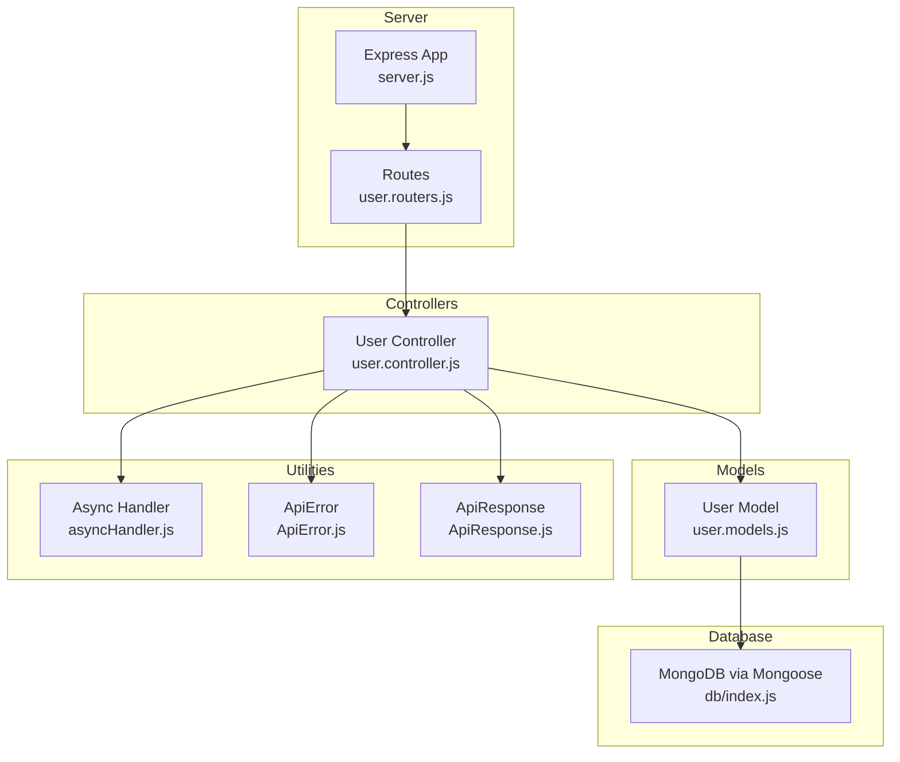
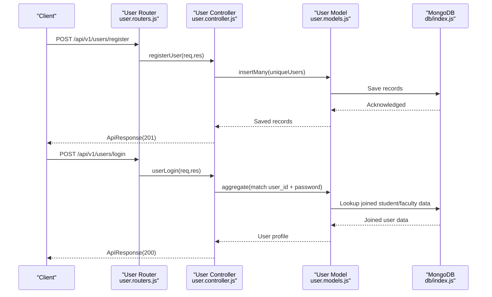
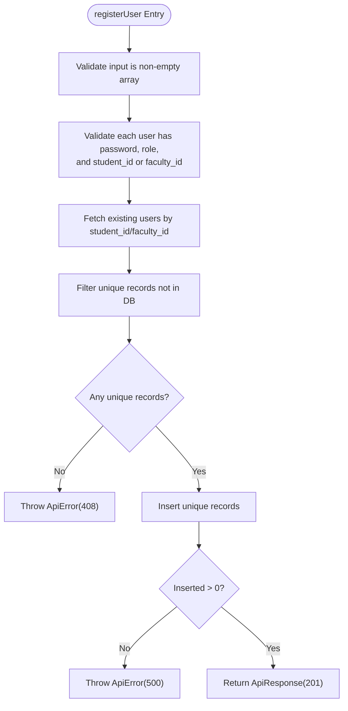
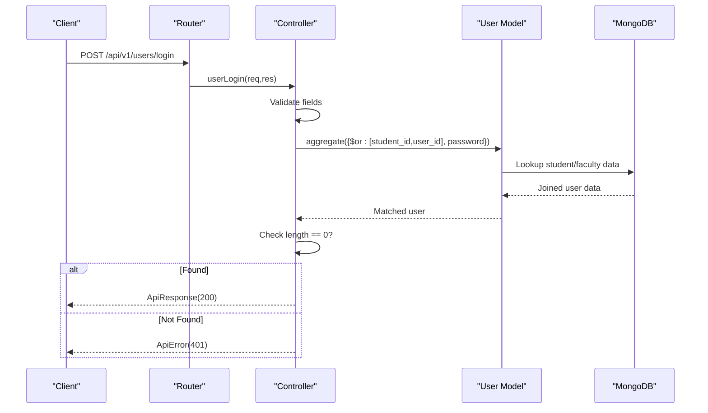
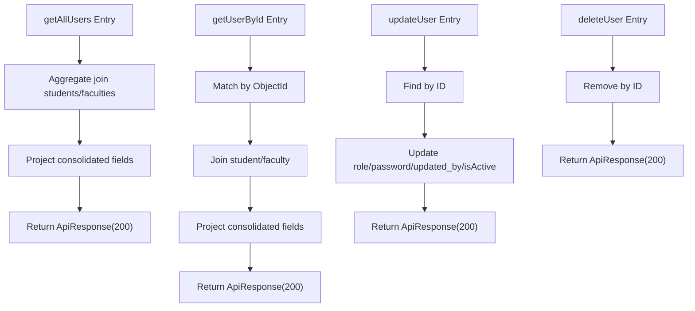
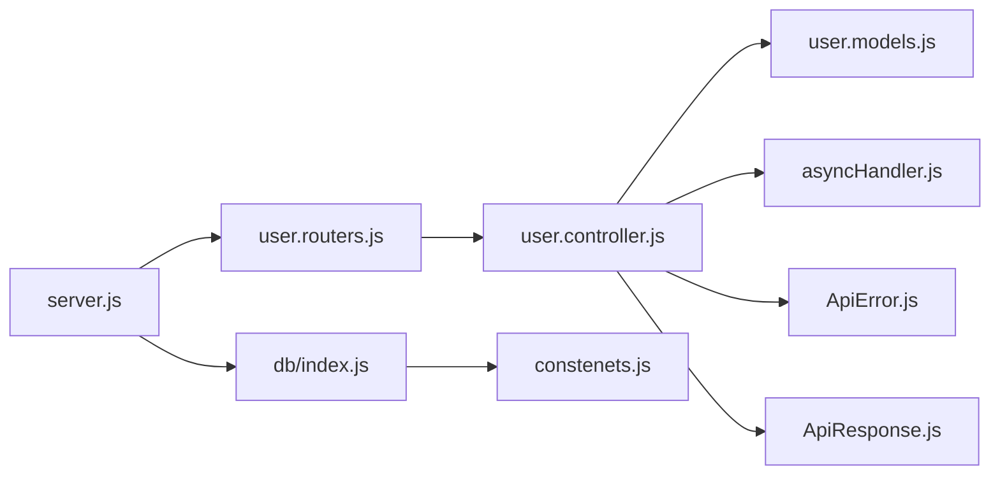

# Backend Authentication Controller

<cite>
**Referenced Files in This Document**
- [user.controller.js](file://Backend/src/controllers/user.controller.js)
- [user.models.js](file://Backend/src/models/user.models.js)
- [user.routers.js](file://Backend/src/routes/user.routers.js)
- [ApiError.js](file://Backend/src/utils/ApiError.js)
- [ApiResponse.js](file://Backend/src/utils/ApiResponse.js)
- [asyncHandler.js](file://Backend/src/utils/asyncHandler.js)
- [server.js](file://Backend/src/server.js)
- [db/index.js](file://Backend/src/db/index.js)
- [constenets.js](file://Backend/src/constenets.js)
</cite>

## Table of Contents
1. [Introduction](#introduction)
2. [Project Structure](#project-structure)
3. [Core Components](#core-components)
4. [Architecture Overview](#architecture-overview)
5. [Detailed Component Analysis](#detailed-component-analysis)
6. [Dependency Analysis](#dependency-analysis)
7. [Performance Considerations](#performance-considerations)
8. [Troubleshooting Guide](#troubleshooting-guide)
9. [Conclusion](#conclusion)

## Introduction
This document explains the backend authentication controller implementation for user registration, login, and profile management. It covers the user authentication flow, including login validation, password verification, user role assignment, and integration with Mongoose models. It also documents error handling patterns, response formatting, and route protection strategies. Notably, the current implementation performs plaintext password comparison during login and does not include JWT token generation or middleware for session management.

## Project Structure
The authentication controller resides under the controllers directory and integrates with Mongoose models, Express routes, and shared utilities for error and response handling. The server initializes middleware and mounts routes.

**Diagram sources**
- [server.js:1-54](file://Backend/src/server.js#L1-L54)
- [user.routers.js:1-19](file://Backend/src/routes/user.routers.js#L1-L19)
- [user.controller.js:1-355](file://Backend/src/controllers/user.controller.js#L1-L355)
- [user.models.js:1-61](file://Backend/src/models/user.models.js#L1-L61)
- [asyncHandler.js:1-4](file://Backend/src/utils/asyncHandler.js#L1-L4)
- [ApiError.js:1-21](file://Backend/src/utils/ApiError.js#L1-L21)
- [ApiResponse.js:1-10](file://Backend/src/utils/ApiResponse.js#L1-L10)
- [db/index.js:1-19](file://Backend/src/db/index.js#L1-L19)

**Section sources**
- [server.js:1-54](file://Backend/src/server.js#L1-L54)
- [user.routers.js:1-19](file://Backend/src/routes/user.routers.js#L1-L19)
- [user.controller.js:1-355](file://Backend/src/controllers/user.controller.js#L1-L355)
- [user.models.js:1-61](file://Backend/src/models/user.models.js#L1-L61)
- [asyncHandler.js:1-4](file://Backend/src/utils/asyncHandler.js#L1-L4)
- [ApiError.js:1-21](file://Backend/src/utils/ApiError.js#L1-L21)
- [ApiResponse.js:1-10](file://Backend/src/utils/ApiResponse.js#L1-L10)
- [db/index.js:1-19](file://Backend/src/db/index.js#L1-L19)

## Core Components
- User Controller: Implements registration, login, user retrieval, updates, and deletion. Uses aggregation pipelines to join user data with students or faculties and projects required fields.
- User Model: Defines schema for password, role, student_id, faculty_id, activity status, and audit fields.
- Routes: Exposes endpoints for user registration, listing, fetching by ID, updating, deleting, and logging in.
- Utilities: Shared error and response wrappers, and an async handler to simplify error propagation.

Key responsibilities:
- Registration validates arrays of user records, checks uniqueness against existing student and faculty IDs, and inserts unique records.
- Login validates presence of credentials, performs aggregation to match user by student or faculty ID with the provided password, and returns user profile data.
- Profile management supports fetching all users, fetching by ID, updating roles/password/activity status, and deletion.

Security note: Passwords are stored as plaintext and compared as-is during login. There is no token generation or middleware for session management in the current implementation.

**Section sources**
- [user.controller.js:8-81](file://Backend/src/controllers/user.controller.js#L8-L81)
- [user.controller.js:84-161](file://Backend/src/controllers/user.controller.js#L84-L161)
- [user.controller.js:164-236](file://Backend/src/controllers/user.controller.js#L164-L236)
- [user.controller.js:239-278](file://Backend/src/controllers/user.controller.js#L239-L278)
- [user.controller.js:281-354](file://Backend/src/controllers/user.controller.js#L281-L354)
- [user.models.js:3-58](file://Backend/src/models/user.models.js#L3-L58)
- [user.routers.js:14-16](file://Backend/src/routes/user.routers.js#L14-L16)
- [ApiError.js:1-21](file://Backend/src/utils/ApiError.js#L1-L21)
- [ApiResponse.js:1-10](file://Backend/src/utils/ApiResponse.js#L1-L10)
- [asyncHandler.js:1-4](file://Backend/src/utils/asyncHandler.js#L1-L4)

## Architecture Overview
The authentication flow connects client requests to the controller, which queries the database via Mongoose and returns structured responses.

**Diagram sources**
- [user.routers.js:14-16](file://Backend/src/routes/user.routers.js#L14-L16)
- [user.controller.js:8-81](file://Backend/src/controllers/user.controller.js#L8-L81)
- [user.controller.js:281-354](file://Backend/src/controllers/user.controller.js#L281-L354)
- [user.models.js:3-58](file://Backend/src/models/user.models.js#L3-L58)
- [db/index.js:4-16](file://Backend/src/db/index.js#L4-L16)

## Detailed Component Analysis

### User Registration
- Validates that the request body is a non-empty array and each record includes password, role, and either student_id or faculty_id.
- Checks for duplicates by querying existing users with matching student or faculty IDs.
- Inserts only unique records and returns the first inserted record with a success response.

**Diagram sources**
- [user.controller.js:8-81](file://Backend/src/controllers/user.controller.js#L8-L81)
- [ApiError.js:1-21](file://Backend/src/utils/ApiError.js#L1-L21)
- [ApiResponse.js:1-10](file://Backend/src/utils/ApiResponse.js#L1-L10)

**Section sources**
- [user.controller.js:8-81](file://Backend/src/controllers/user.controller.js#L8-L81)
- [ApiError.js:1-21](file://Backend/src/utils/ApiError.js#L1-L21)
- [ApiResponse.js:1-10](file://Backend/src/utils/ApiResponse.js#L1-L10)

### User Login
- Validates that user_id and password are present.
- Performs an aggregation pipeline to match a user by student_id or faculty_id with the provided password, joins with student or faculty collection, and projects essential fields.
- Returns user profile data on success or throws an unauthorized error if no match is found.

**Diagram sources**
- [user.controller.js:281-354](file://Backend/src/controllers/user.controller.js#L281-L354)
- [user.models.js:3-58](file://Backend/src/models/user.models.js#L3-L58)
- [ApiError.js:1-21](file://Backend/src/utils/ApiError.js#L1-L21)
- [ApiResponse.js:1-10](file://Backend/src/utils/ApiResponse.js#L1-L10)

**Section sources**
- [user.controller.js:281-354](file://Backend/src/controllers/user.controller.js#L281-L354)
- [user.models.js:3-58](file://Backend/src/models/user.models.js#L3-L58)
- [ApiError.js:1-21](file://Backend/src/utils/ApiError.js#L1-L21)
- [ApiResponse.js:1-10](file://Backend/src/utils/ApiResponse.js#L1-L10)

### User Profile Management
- Retrieve all users: Uses aggregation to join student or faculty data and projects a consolidated user profile view.
- Retrieve by ID: Matches user by ObjectId and applies the same join and projection logic.
- Update user: Updates role, password, updated_by, and isActive fields.
- Delete user: Removes a user by ID.

**Diagram sources**
- [user.controller.js:84-161](file://Backend/src/controllers/user.controller.js#L84-L161)
- [user.controller.js:164-236](file://Backend/src/controllers/user.controller.js#L164-L236)
- [user.controller.js:239-278](file://Backend/src/controllers/user.controller.js#L239-L278)

**Section sources**
- [user.controller.js:84-161](file://Backend/src/controllers/user.controller.js#L84-L161)
- [user.controller.js:164-236](file://Backend/src/controllers/user.controller.js#L164-L236)
- [user.controller.js:239-278](file://Backend/src/controllers/user.controller.js#L239-L278)

### Role Assignment and Validation
- Role is validated against an enumerated set of values and stored in lowercase.
- Role assignment occurs during registration and can be updated via the update endpoint.

**Section sources**
- [user.models.js:19-28](file://Backend/src/models/user.models.js#L19-L28)
- [user.controller.js:239-278](file://Backend/src/controllers/user.controller.js#L239-L278)

### Password Handling
- Passwords are stored as plaintext and compared directly during login.
- No hashing mechanism is implemented in the current codebase.

**Section sources**
- [user.models.js:13-17](file://Backend/src/models/user.models.js#L13-L17)
- [user.controller.js:289-295](file://Backend/src/controllers/user.controller.js#L289-L295)

### Token Expiration and Security Measures
- No JWT token generation or middleware is implemented.
- No token expiration handling exists.
- No session management or CSRF protection is present.

**Section sources**
- [user.controller.js:281-354](file://Backend/src/controllers/user.controller.js#L281-L354)

### Route Protection Strategies
- No authentication middleware is applied to protect routes.
- All user endpoints are publicly exposed.

**Section sources**
- [user.routers.js:14-16](file://Backend/src/routes/user.routers.js#L14-L16)

## Dependency Analysis
The controller depends on Mongoose models, shared utilities, and Express routing. The server initializes middleware and mounts routes.

**Diagram sources**
- [user.controller.js:1-355](file://Backend/src/controllers/user.controller.js#L1-L355)
- [user.models.js:1-61](file://Backend/src/models/user.models.js#L1-L61)
- [user.routers.js:1-19](file://Backend/src/routes/user.routers.js#L1-L19)
- [server.js:1-54](file://Backend/src/server.js#L1-L54)
- [db/index.js:1-19](file://Backend/src/db/index.js#L1-L19)
- [constenets.js:1-2](file://Backend/src/constenets.js#L1-L2)

**Section sources**
- [user.controller.js:1-355](file://Backend/src/controllers/user.controller.js#L1-L355)
- [user.models.js:1-61](file://Backend/src/models/user.models.js#L1-L61)
- [user.routers.js:1-19](file://Backend/src/routes/user.routers.js#L1-L19)
- [server.js:1-54](file://Backend/src/server.js#L1-L54)
- [db/index.js:1-19](file://Backend/src/db/index.js#L1-L19)
- [constenets.js:1-2](file://Backend/src/constenets.js#L1-L2)

## Performance Considerations
- Aggregation pipelines for user retrieval and login involve joins with student and faculty collections; ensure appropriate indexes exist on student_id and faculty_id for optimal performance.
- The registration endpoint inserts many documents in a single operation; batching large arrays can help avoid timeouts and improve throughput.
- Avoid returning sensitive fields in responses; the current projections exclude passwords, which is good.

## Troubleshooting Guide
Common issues and resolutions:
- Registration fails with duplicate entries: Ensure unique student_id or faculty_id values are provided; the controller filters duplicates before insertion.
- Login returns invalid credentials: Verify that user_id matches either student_id or faculty_id and that the plaintext password matches the stored value.
- Empty user lists: Confirm that student or faculty records exist and that the user’s associated IDs are populated.
- Error responses: The controller throws ApiError with appropriate status codes; inspect the error message and status to diagnose issues.

**Section sources**
- [user.controller.js:8-81](file://Backend/src/controllers/user.controller.js#L8-L81)
- [user.controller.js:281-354](file://Backend/src/controllers/user.controller.js#L281-L354)
- [ApiError.js:1-21](file://Backend/src/utils/ApiError.js#L1-L21)

## Conclusion
The backend authentication controller provides user registration, login, and profile management using Mongoose and Express. While the current implementation lacks password hashing, token generation, and middleware-based route protection, it offers a clear foundation for extending with JWT-based authentication, middleware, and robust security measures. The aggregation-based queries enable flexible user profile retrieval by joining with student or faculty data.