# Enhanced User Controller

<cite>
**Referenced Files in This Document**
- [user.controller.js](file://Backend/src/controllers/user.controller.js)
- [user.models.js](file://Backend/src/models/user.models.js)
- [user.routers.js](file://Backend/src/routes/user.routers.js)
- [auth.middleware.js](file://Backend/src/middlewares/auth.middleware.js)
- [Token.js](file://Backend/src/utils/Token.js)
- [ApiResponse.js](file://Backend/src/utils/ApiResponse.js)
- [ApiError.js](file://Backend/src/utils/ApiError.js)
- [asyncHandler.js](file://Backend/src/utils/asyncHandler.js)
- [student.models.js](file://Backend/src/models/student.models.js)
- [faculty.models.js](file://Backend/src/models/faculty.models.js)
- [index.js](file://Backend/src/db/index.js)
- [apiClient.js](file://Client/src/services/apiClient.js)
- [authSlice.js](file://Client/src/store/auth/authSlice.js)
</cite>

## Update Summary
**Changes Made**
- Enhanced user registration system now supports only bulk registration with improved user_id generation and password hashing
- Removed single user registration functionality in favor of bulk processing capabilities
- Improved user_id generation logic with role-based prefixes and enhanced validation
- Streamlined authentication and authorization flows for better security and performance
- Updated client-side integration with enhanced caching and error handling

## Table of Contents
1. [Introduction](#introduction)
2. [Project Structure](#project-structure)
3. [Core Components](#core-components)
4. [Architecture Overview](#architecture-overview)
5. [Detailed Component Analysis](#detailed-component-analysis)
6. [Authentication & Authorization System](#authentication--authorization-system)
7. [Data Management Integration](#data-management-integration)
8. [Client-Side Integration](#client-side-integration)
9. [Performance Considerations](#performance-considerations)
10. [Security Implementation](#security-implementation)
11. [Troubleshooting Guide](#troubleshooting-guide)
12. [Conclusion](#conclusion)

## Introduction

The Enhanced User Controller represents a comprehensive user management system built with Node.js, Express, and MongoDB. This system provides robust authentication, authorization, and user lifecycle management capabilities for an academic timetable management application. The controller handles user registration, authentication, profile management, and integrates seamlessly with student and faculty data models.

The system implements modern security practices including JWT token-based authentication, password hashing with bcrypt, role-based access control, and comprehensive error handling. It focuses on bulk user operations with enhanced validation and improved error handling for different administrative scenarios.

**Updated** Enhanced bulk registration system now exclusively supports bulk user creation with improved user_id generation logic and streamlined validation processes.

## Project Structure

The user management system follows a modular architecture with clear separation of concerns:

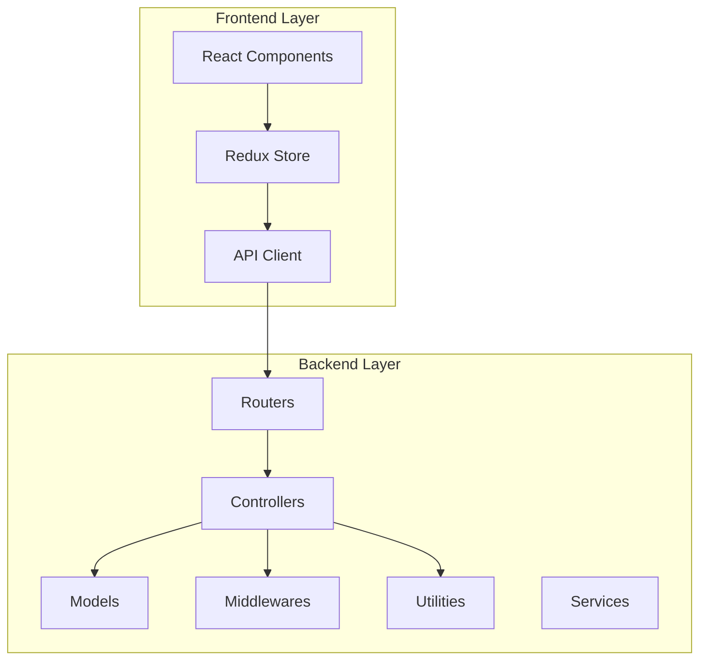

**Diagram sources**
- [user.controller.js:1-746](file://Backend/src/controllers/user.controller.js#L1-L746)
- [user.models.js:1-149](file://Backend/src/models/user.models.js#L1-L149)
- [user.routers.js:1-41](file://Backend/src/routes/user.routers.js#L1-L41)

**Section sources**
- [user.controller.js:1-746](file://Backend/src/controllers/user.controller.js#L1-L746)
- [user.models.js:1-149](file://Backend/src/models/user.models.js#L1-L149)
- [user.routers.js:1-41](file://Backend/src/routes/user.routers.js#L1-L41)

## Core Components

### User Model Architecture

The User model serves as the central entity in the system, implementing comprehensive validation and security features:

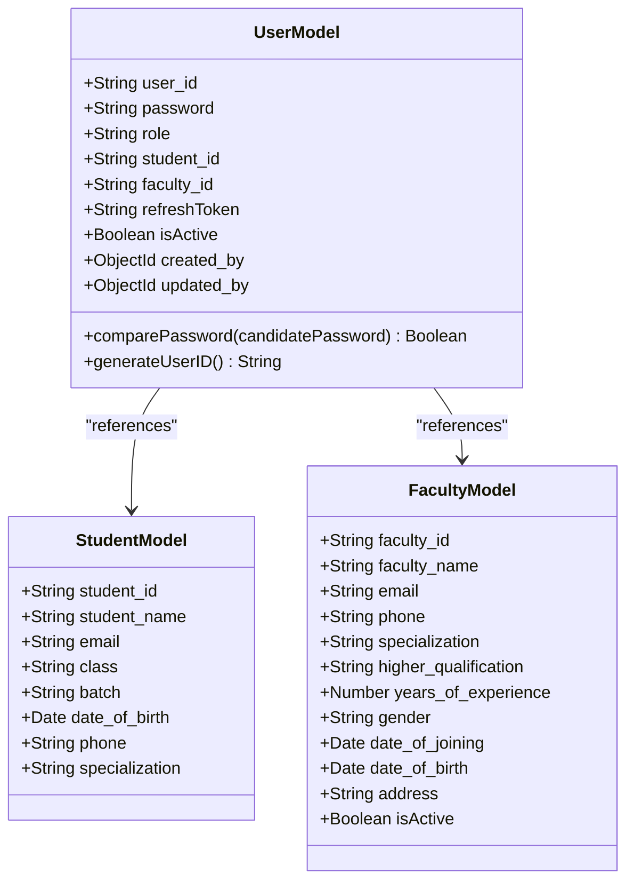

**Diagram sources**
- [user.models.js:4-63](file://Backend/src/models/user.models.js#L4-L63)
- [student.models.js:3-68](file://Backend/src/models/student.models.js#L3-L68)
- [faculty.models.js:3-78](file://Backend/src/models/faculty.models.js#L3-L78)

### Controller Functionality

The user controller implements comprehensive CRUD operations with advanced features focused on bulk operations:

| Operation | Method | Route | Authentication | Authorization |
|-----------|--------|-------|----------------|---------------|
| Bulk Register Users | POST | `/users` | JWT | Admin |
| Get All Users | GET | `/users` | JWT | Admin, Faculty, Coordinator, HOD |
| Get User by ID | GET | `/users/:id` | JWT | Admin, Faculty, Coordinator, HOD |
| Update User | PATCH | `/users/:id` | JWT | Admin |
| Delete User | DELETE | `/users/:id` | JWT | Admin |
| User Login | POST | `/users/login` | None | None |
| Refresh Token | POST | `/users/refresh-token` | None | None |
| Current User | GET | `/users/me` | JWT | All Roles |
| Logout | POST | `/users/logout` | JWT | All Roles |
| Change Password | POST | `/users/change-password` | JWT | All Roles |

**Section sources**
- [user.controller.js:17-746](file://Backend/src/controllers/user.controller.js#L17-L746)
- [user.routers.js:18-38](file://Backend/src/routes/user.routers.js#L18-L38)

## Architecture Overview

The Enhanced User Controller follows a layered architecture pattern with clear separation between presentation, business logic, and data access layers:

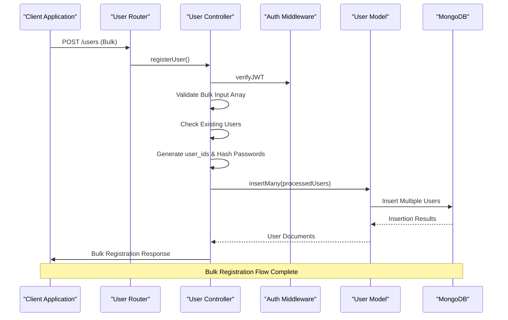

**Diagram sources**
- [user.routers.js:24](file://Backend/src/routes/user.routers.js#L24)
- [user.controller.js:86-187](file://Backend/src/controllers/user.controller.js#L86-L187)
- [auth.middleware.js:7-44](file://Backend/src/middlewares/auth.middleware.js#L7-L44)

**Section sources**
- [user.controller.js:86-187](file://Backend/src/controllers/user.controller.js#L86-L187)
- [auth.middleware.js:1-121](file://Backend/src/middlewares/auth.middleware.js#L1-L121)

## Detailed Component Analysis

### Enhanced Bulk User Registration System

The controller now exclusively supports bulk user registration with comprehensive validation and improved error handling:

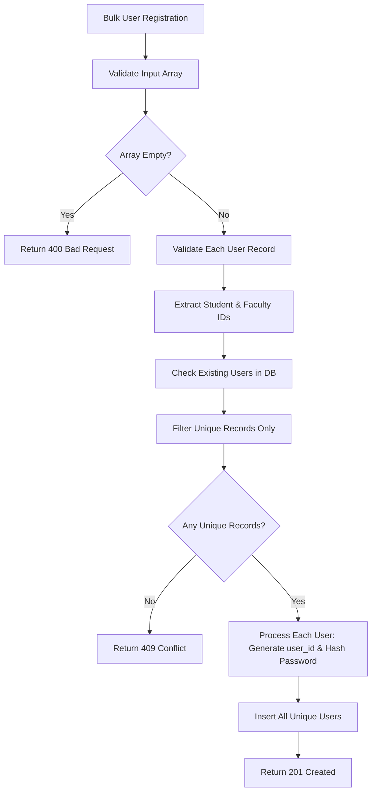

**Diagram sources**
- [user.controller.js:86-187](file://Backend/src/controllers/user.controller.js#L86-L187)

**Updated** The bulk registration system now includes enhanced user_id generation logic with role-based prefixes and improved password hashing using bcrypt with configurable salt rounds.

**Section sources**
- [user.controller.js:86-187](file://Backend/src/controllers/user.controller.js#L86-L187)

### Enhanced Authentication & Session Management

The authentication system implements a two-token strategy with short-lived access tokens and long-lived refresh tokens:

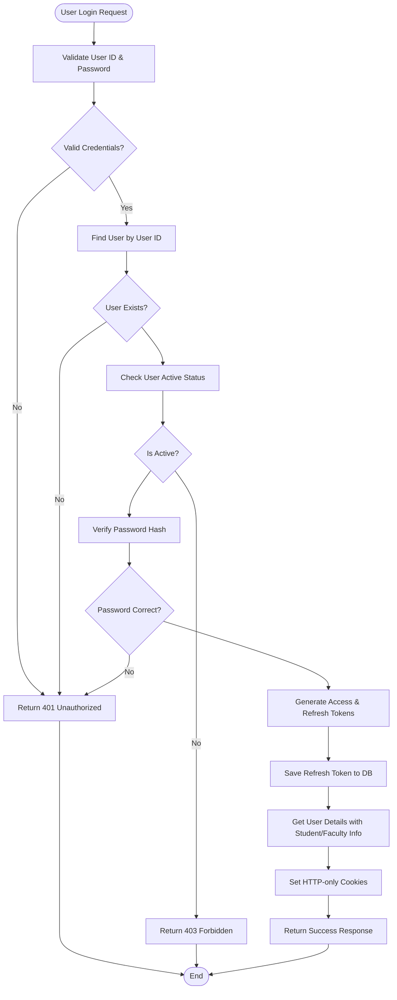

**Diagram sources**
- [user.controller.js:463-567](file://Backend/src/controllers/user.controller.js#L463-L567)
- [Token.js:33-37](file://Backend/src/utils/Token.js#L33-L37)

### Role-Based Access Control

The system implements hierarchical role-based access control with specific permissions for different user types:

| Role | Permissions |
|------|-------------|
| Admin | Full access to all user operations |
| Faculty | View own profile, view assigned users |
| Student | View own profile only |
| Coordinator | Manage timetable allocations |
| HOD | Department-level user management |

**Section sources**
- [auth.middleware.js:47-62](file://Backend/src/middlewares/auth.middleware.js#L47-L62)
- [user.models.js:23-27](file://Backend/src/models/user.models.js#L23-L27)

### Simplified Pagination & Search Implementation

The system implements efficient pagination with optimized MongoDB aggregation pipeline:

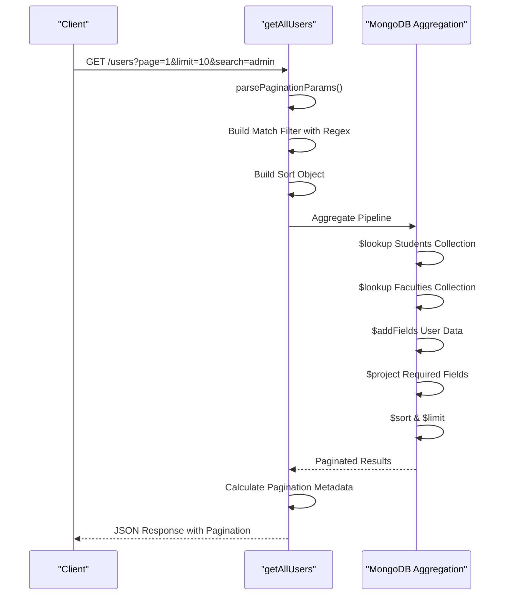

**Diagram sources**
- [user.controller.js:189-317](file://Backend/src/controllers/user.controller.js#L189-L317)

**Updated** Simplified projection logic uses conditional aggregation to efficiently extract user data, reducing complexity and improving performance.

**Section sources**
- [user.controller.js:189-317](file://Backend/src/controllers/user.controller.js#L189-L317)

### Enhanced User ID Generation Logic

The user_id generation system now includes role-based prefixes and enhanced validation:

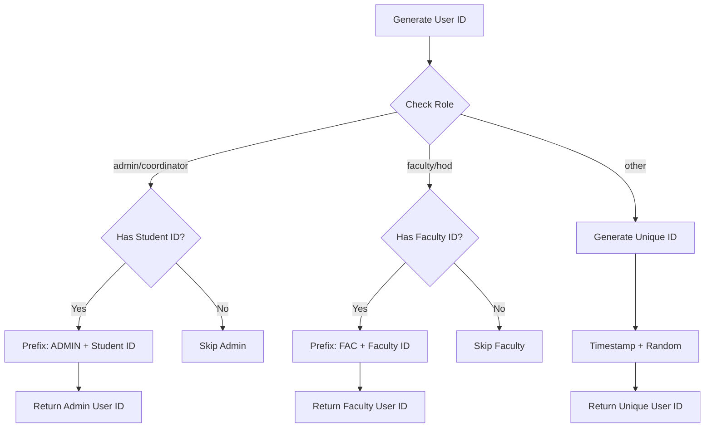

**Diagram sources**
- [user.controller.js:142-174](file://Backend/src/controllers/user.controller.js#L142-L174)
- [user.models.js:108-128](file://Backend/src/models/user.models.js#L108-L128)

**Section sources**
- [user.controller.js:142-174](file://Backend/src/controllers/user.controller.js#L142-L174)
- [user.models.js:108-128](file://Backend/src/models/user.models.js#L108-L128)

## Authentication & Authorization System

### Token Management Strategy

The system implements a comprehensive token management strategy with automatic refresh capabilities:

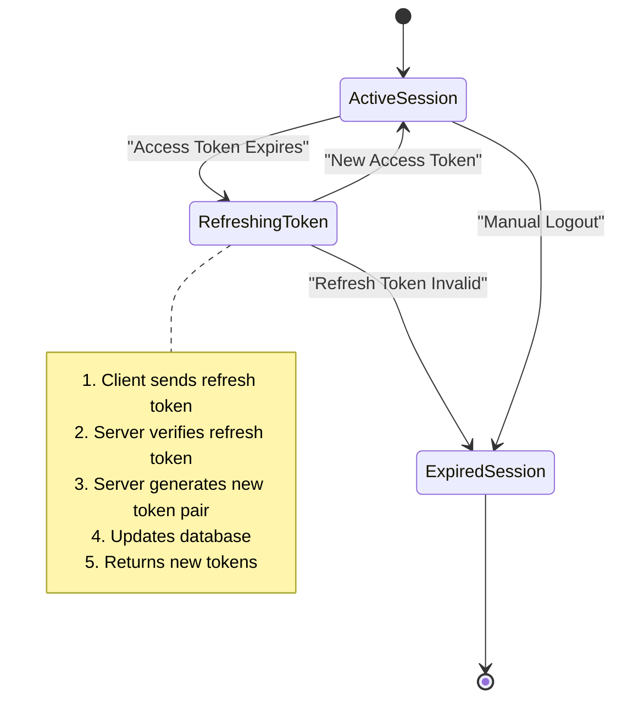

**Diagram sources**
- [user.controller.js:597-642](file://Backend/src/controllers/user.controller.js#L597-L642)
- [Token.js:49-55](file://Backend/src/utils/Token.js#L49-L55)

### Security Features

The authentication system incorporates multiple security layers:

| Security Feature | Implementation | Purpose |
|------------------|----------------|---------|
| Password Hashing | bcrypt with configurable salt rounds | Protect stored passwords |
| JWT Validation | Secure secret keys with expiration | Prevent token tampering |
| HTTP-only Cookies | Prevent XSS attacks | Secure token transmission |
| Role Verification | Middleware authorization | Prevent unauthorized access |
| Account Deactivation | Active status flag | Immediate access revocation |

**Section sources**
- [Token.js:1-71](file://Backend/src/utils/Token.js#L1-L71)
- [auth.middleware.js:1-121](file://Backend/src/middlewares/auth.middleware.js#L1-L121)

## Data Management Integration

### Student-Faculty Relationship

The user system maintains flexible relationships with student and faculty entities:

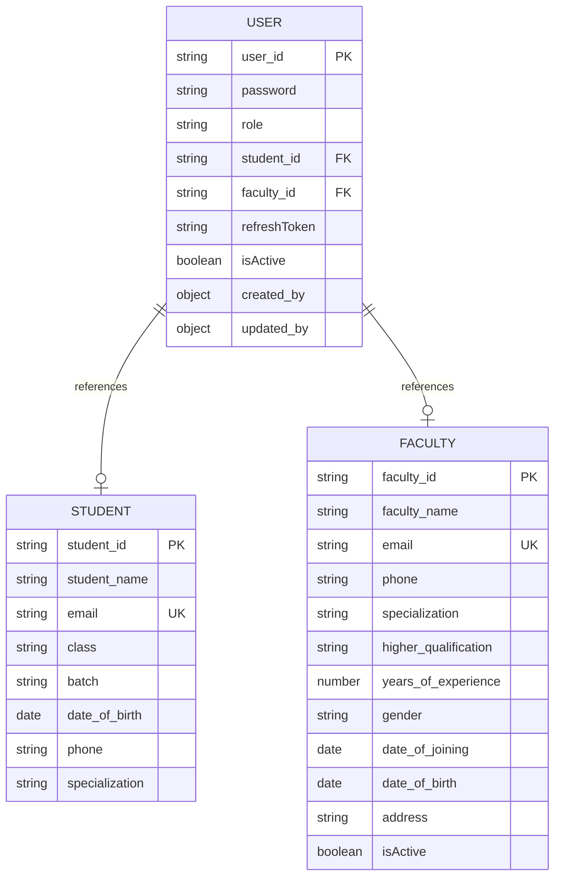

**Diagram sources**
- [user.models.js:4-63](file://Backend/src/models/user.models.js#L4-L63)
- [student.models.js:3-68](file://Backend/src/models/student.models.js#L3-L68)
- [faculty.models.js:3-78](file://Backend/src/models/faculty.models.js#L3-L78)

### Data Validation & Constraints

The system implements comprehensive data validation at multiple levels:

| Validation Level | Implementation | Examples |
|------------------|----------------|----------|
| Model Schema | Mongoose validation | Required fields, unique constraints |
| Business Logic | Controller validation | Role checks, relationship validation |
| Runtime | Middleware validation | Token verification, permission checks |
| Database | MongoDB constraints | Unique indexes, referential integrity |

**Updated** Enhanced validation logic now includes comprehensive checking for existing student/faculty records during bulk user registration, preventing duplicate user creation and ensuring data integrity.

**Section sources**
- [user.models.js:6-63](file://Backend/src/models/user.models.js#L6-L63)
- [student.models.js:5-68](file://Backend/src/models/student.models.js#L5-L68)
- [faculty.models.js:5-78](file://Backend/src/models/faculty.models.js#L5-L78)

## Client-Side Integration

### API Client Configuration

The frontend client implements sophisticated caching and error handling:

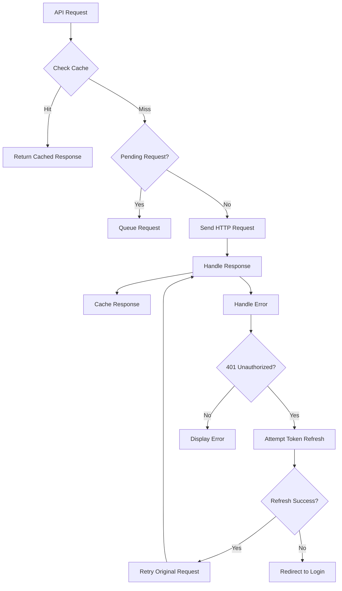

**Diagram sources**
- [apiClient.js:54-207](file://Client/src/services/apiClient.js#L54-L207)

### Redux State Management

The authentication state is managed through Redux Toolkit with async thunks:

| Action | Purpose | Trigger |
|--------|---------|---------|
| verifySession | Initialize authentication state | App startup |
| login | Set authenticated state | Successful login |
| logout | Clear authentication state | User logout |
| Token Refresh | Maintain session continuity | Automatic refresh |

**Section sources**
- [apiClient.js:1-268](file://Client/src/services/apiClient.js#L1-L268)
- [authSlice.js:1-63](file://Client/src/store/auth/authSlice.js#L1-L63)

## Performance Considerations

### Caching Strategy

The system implements intelligent caching to optimize performance:

| Cache Type | Duration | Methods | Purpose |
|------------|----------|---------|---------|
| GET Requests | 5 minutes | All GET operations | Reduce database load |
| Pending Requests | Session | Duplicate requests | Prevent redundant calls |
| Session Cache | Until logout | User data | Maintain state |

### Database Optimization

The aggregation pipeline is optimized for performance:

- Efficient `$lookup` operations with proper indexing
- Simplified field projection using conditional aggregation
- Aggregation stages ordered for optimal performance
- Proper use of `$match` before expensive operations

**Updated** Simplified projection logic reduces query complexity and improves response times by using conditional aggregation for user data extraction.

### Memory Management

The system implements memory-efficient patterns:

- Streaming responses for large datasets
- Proper cleanup of temporary data structures
- Efficient cookie handling without memory leaks
- Controlled session management

## Security Implementation

### Multi-Layer Security Approach

The system implements defense-in-depth security measures:

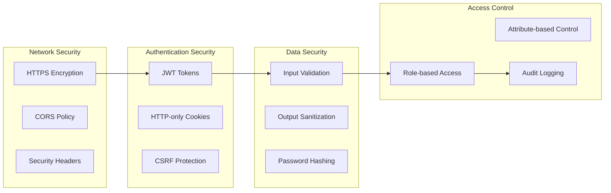

### Security Best Practices Implemented

| Area | Implementation | Benefit |
|------|----------------|---------|
| Password Security | bcrypt hashing with configurable rounds | Protection against rainbow table attacks |
| Token Security | Separate access/refresh tokens with expiration | Reduced attack surface |
| Session Security | HTTP-only cookies with secure flags | Prevention of XSS attacks |
| Input Validation | Comprehensive server-side validation | Protection against injection attacks |
| Role Management | Hierarchical role system | Principle of least privilege |
| Audit Trail | Timestamped operations | Compliance and monitoring support |

**Section sources**
- [Token.js:58-70](file://Backend/src/utils/Token.js#L58-L70)
- [user.models.js:99-102](file://Backend/src/models/user.models.js#L99-L102)

## Troubleshooting Guide

### Common Issues and Solutions

| Issue | Symptoms | Solution |
|-------|----------|----------|
| Authentication Failure | 401 Unauthorized responses | Check token validity and refresh token |
| Account Locked | 403 Forbidden on login | Verify user isActive flag |
| Database Connection | Server startup failures | Check MongoDB URI and credentials |
| CORS Errors | Cross-origin request blocked | Configure CORS properly |
| Token Refresh Failures | Repeated 401 errors | Verify refresh token storage |
| Pagination Issues | Incomplete results | Check limit and page parameters |
| Bulk Registration Conflicts | 409 Conflict during registration | Check if student/faculty record exists |
| Validation Errors | 400 Bad Request during registration | Verify required fields and record existence |
| Password Hashing Issues | 500 Internal Server Error | Check SALT_ROUNDS environment variable |

**Updated** Added troubleshooting guidance for enhanced bulk registration validation issues and improved error handling scenarios.

### Debugging Strategies

**Development Environment:**
- Enable detailed error logging
- Use browser developer tools for API inspection
- Monitor network requests and responses
- Check server console for error messages

**Production Environment:**
- Implement structured logging
- Monitor error rates and response times
- Set up alerting for critical failures
- Maintain audit logs for security events

### Performance Monitoring

Key metrics to monitor:

- Response time for authentication endpoints
- Database query performance
- Memory usage patterns
- Cache hit rates
- Error rate trends

**Section sources**
- [ApiError.js:1-80](file://Backend/src/utils/ApiError.js#L1-L80)
- [ApiResponse.js:1-74](file://Backend/src/utils/ApiResponse.js#L1-L74)

## Conclusion

The Enhanced User Controller represents a comprehensive, production-ready solution for user management in academic systems. The implementation demonstrates best practices in security, performance, and maintainability while providing flexible functionality for diverse user types and administrative needs.

Key strengths of the implementation include:

- **Security-First Design**: Multi-layered security with JWT tokens, password hashing, and role-based access control
- **Enhanced Bulk Operations**: Exclusive focus on bulk user registration with improved user_id generation and password hashing
- **Optimized Performance**: Simplified aggregation projection logic and efficient database operations
- **Scalable Architecture**: Modular design with clear separation of concerns and intelligent caching
- **Developer Experience**: Comprehensive error handling, consistent API responses, and extensive documentation
- **User Experience**: Seamless authentication flow with automatic token refresh and intuitive client integration

The system successfully balances functionality with security, providing a solid foundation for academic timetable management applications while maintaining extensibility for future enhancements.

**Updated** Recent enhancements focus on improving the bulk user registration process with better validation logic, enhanced user_id generation with role-based prefixes, and streamlined authentication flows, resulting in more reliable user management and improved system performance.