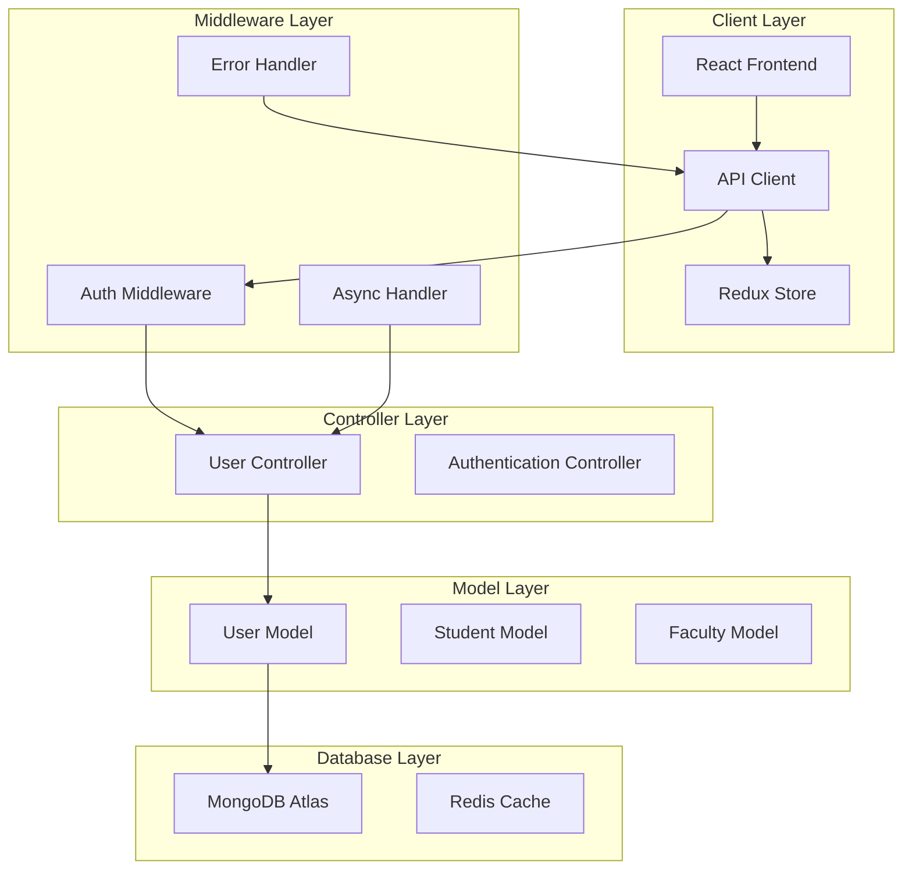
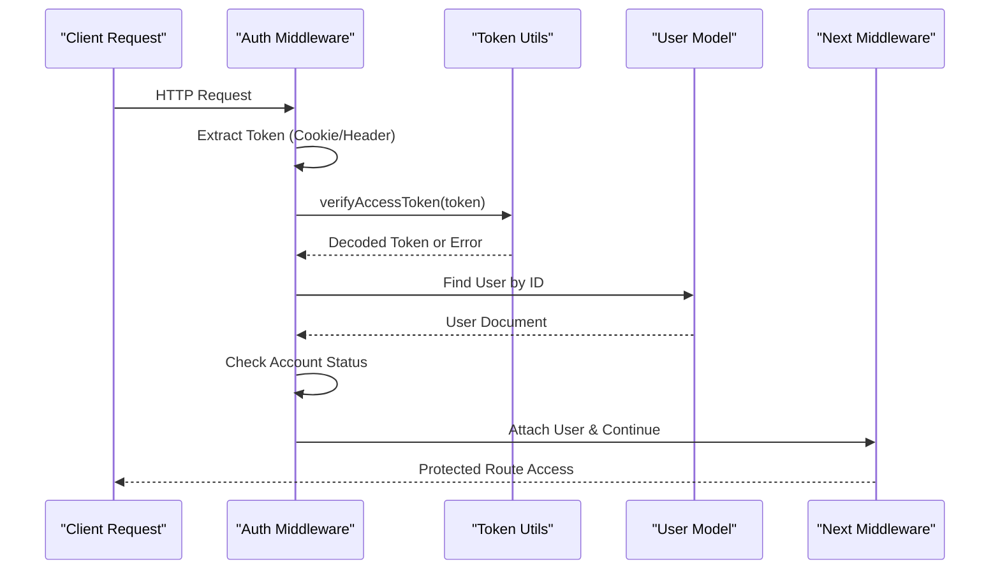
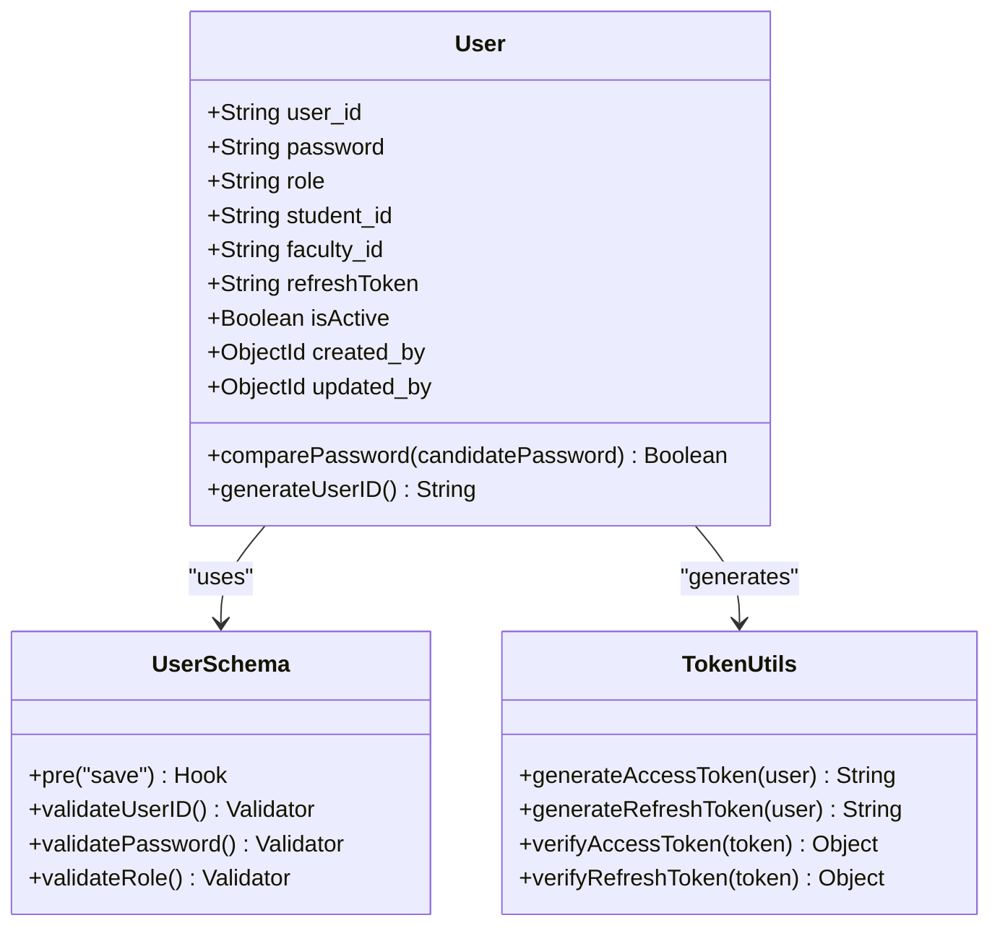
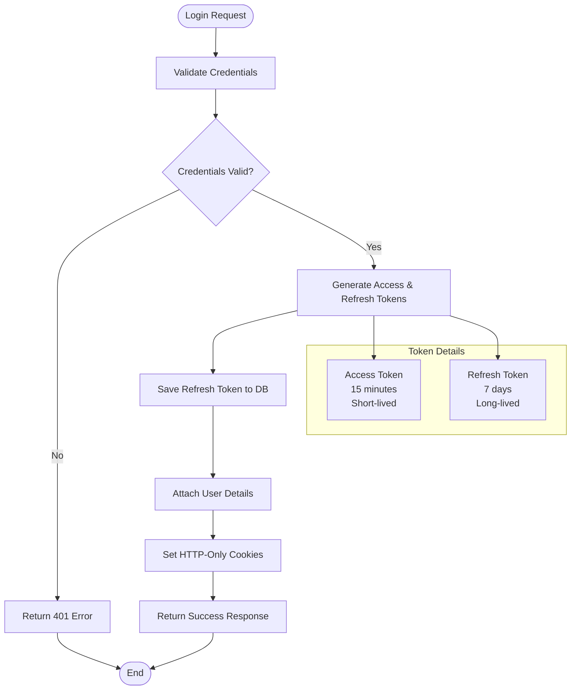
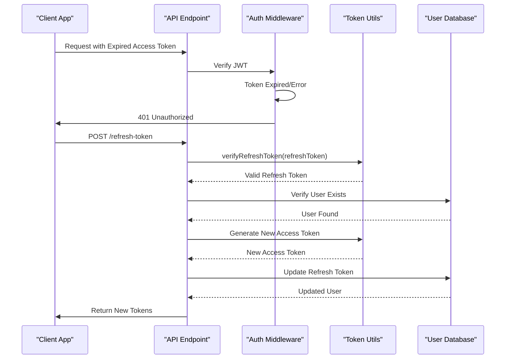
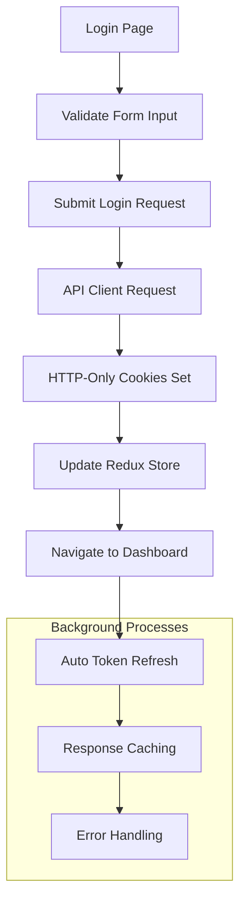
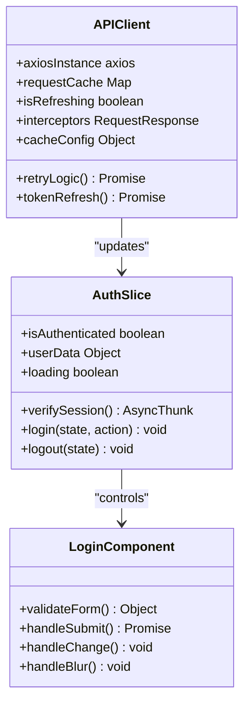
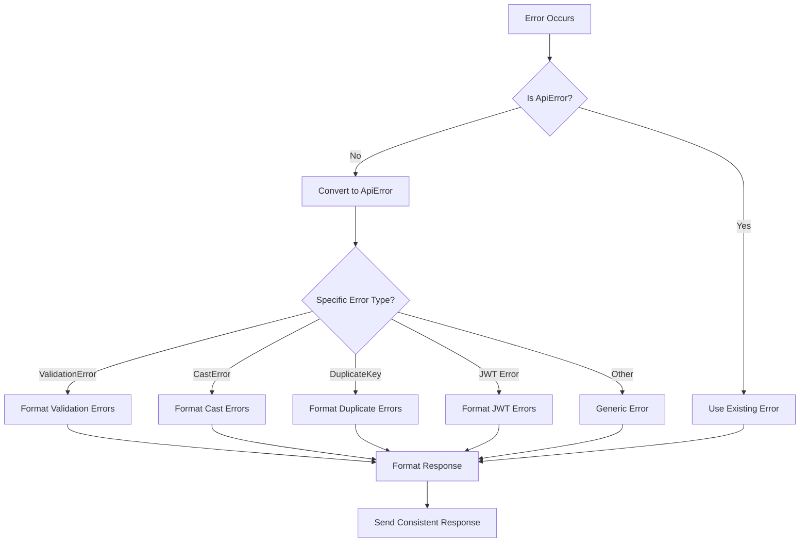
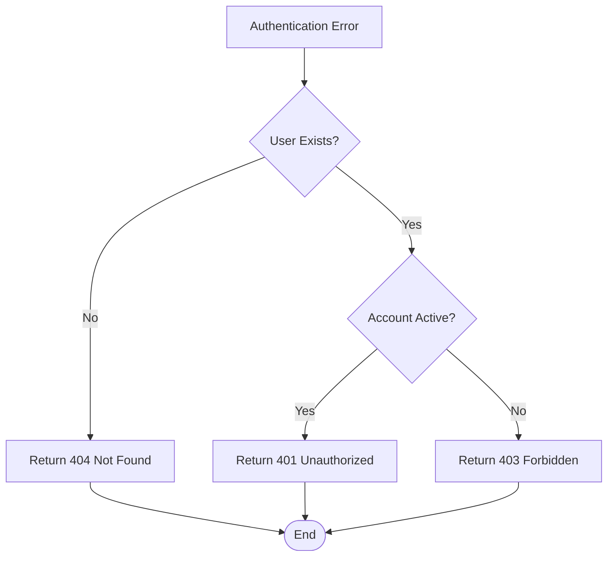
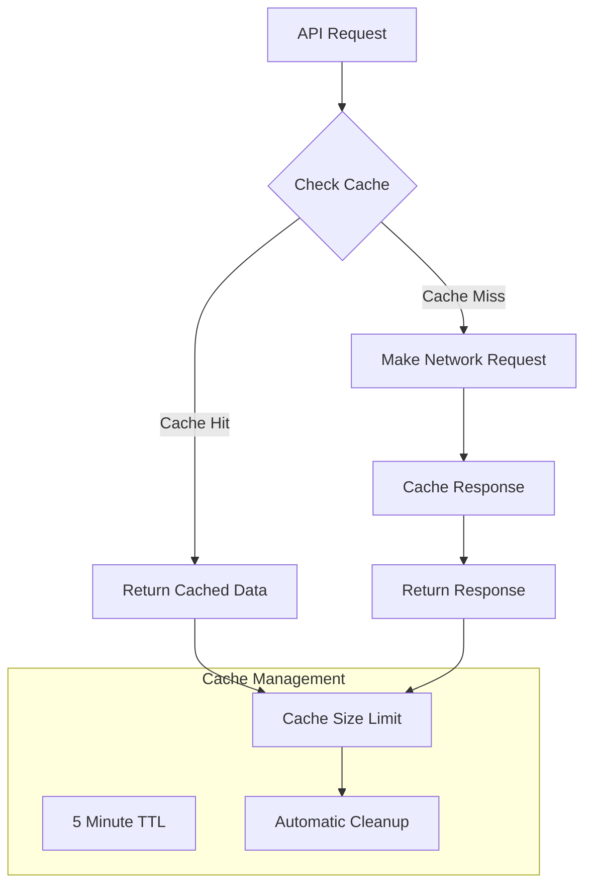

# Enhanced Authentication System

<cite>
**Referenced Files in This Document**
- [auth.middleware.js](file://Backend/src/middlewares/auth.middleware.js)
- [user.controller.js](file://Backend/src/controllers/user.controller.js)
- [user.models.js](file://Backend/src/models/user.models.js)
- [Token.js](file://Backend/src/utils/Token.js)
- [user.routers.js](file://Backend/src/routes/user.routers.js)
- [ApiError.js](file://Backend/src/utils/ApiError.js)
- [ApiResponse.js](file://Backend/src/utils/ApiResponse.js)
- [errorHandler.middleware.js](file://Backend/src/middlewares/errorHandler.middleware.js)
- [asyncHandler.js](file://Backend/src/utils/asyncHandler.js)
- [index.js](file://Backend/src/index.js)
- [db/index.js](file://Backend/src/db/index.js)
- [apiClient.js](file://Client/src/services/apiClient.js)
- [authSlice.js](file://Client/src/store/auth/authSlice.js)
- [Login.jsx](file://Client/src/pages/Login.jsx)
- [package.json](file://Backend/package.json)
</cite>

## Update Summary
**Changes Made**
- Updated Authentication Error Handling section to reflect RESTful convention change
- Modified troubleshooting guide to address 404 vs 401 error handling differences
- Added new section on RESTful Error Handling Conventions
- Updated error handling diagrams to show the new 404 status for user not found scenarios

## Table of Contents
1. [Introduction](#introduction)
2. [System Architecture](#system-architecture)
3. [Core Authentication Components](#core-authentication-components)
4. [JWT Token Management](#jwt-token-management)
5. [Client-Side Authentication Flow](#client-side-authentication-flow)
6. [Security Implementation](#security-implementation)
7. [Error Handling and Validation](#error-handling-and-validation)
8. [RESTful Error Handling Conventions](#restful-error-handling-conventions)
9. [Performance Optimization](#performance-optimization)
10. [Troubleshooting Guide](#troubleshooting-guide)
11. [Conclusion](#conclusion)

## Introduction

The Enhanced Authentication System is a comprehensive, production-ready authentication solution built with Node.js, Express, MongoDB, and React. This system implements industry-standard security practices including JWT-based authentication, role-based access control, secure token storage using HTTP-only cookies, and robust error handling mechanisms.

The system supports multiple user roles (admin, faculty, student, coordinator, hod) with granular permission controls and provides seamless user experience through automatic token refresh and caching mechanisms. It follows modern authentication best practices while maintaining simplicity and scalability.

**Updated**: The system now adheres to RESTful conventions by returning appropriate HTTP status codes for different error scenarios, improving API consistency and developer experience.

## System Architecture

The authentication system follows a layered architecture pattern with clear separation of concerns:

**Diagram sources**
- [auth.middleware.js:1-121](file://Backend/src/middlewares/auth.middleware.js#L1-L121)
- [user.controller.js:1-705](file://Backend/src/controllers/user.controller.js#L1-L705)
- [user.models.js:1-105](file://Backend/src/models/user.models.js#L1-L105)

**Section sources**
- [auth.middleware.js:1-121](file://Backend/src/middlewares/auth.middleware.js#L1-L121)
- [user.controller.js:1-705](file://Backend/src/controllers/user.controller.js#L1-L705)
- [user.models.js:1-105](file://Backend/src/models/user.models.js#L1-L105)

## Core Authentication Components

### Authentication Middleware

The authentication middleware system provides comprehensive protection for API endpoints through multiple layers of validation:

**Diagram sources**
- [auth.middleware.js:7-44](file://Backend/src/middlewares/auth.middleware.js#L7-L44)
- [Token.js:40-46](file://Backend/src/utils/Token.js#L40-L46)
- [user.models.js:100-102](file://Backend/src/models/user.models.js#L100-L102)

The middleware provides several authentication strategies:

1. **Required Authentication**: Enforces JWT validation for protected routes
2. **Role-Based Authorization**: Validates user roles for specific endpoints  
3. **Optional Authentication**: Allows access without strict authentication
4. **Admin-Only Access**: Restricts routes to administrative users

**Section sources**
- [auth.middleware.js:47-121](file://Backend/src/middlewares/auth.middleware.js#L47-L121)

### User Model and Schema

The User model implements comprehensive data validation and security features:

**Diagram sources**
- [user.models.js:4-63](file://Backend/src/models/user.models.js#L4-L63)
- [Token.js:3-55](file://Backend/src/utils/Token.js#L3-L55)

**Section sources**
- [user.models.js:1-105](file://Backend/src/models/user.models.js#L1-L105)

## JWT Token Management

### Token Generation and Verification

The system implements a dual-token strategy with short-lived access tokens and long-lived refresh tokens:

**Diagram sources**
- [user.controller.js:422-526](file://Backend/src/controllers/user.controller.js#L422-L526)
- [Token.js:33-55](file://Backend/src/utils/Token.js#L33-L55)

### Token Refresh Mechanism

The token refresh system ensures seamless user experience without frequent re-authentication:

**Diagram sources**
- [user.controller.js:557-601](file://Backend/src/controllers/user.controller.js#L557-L601)
- [Token.js:49-55](file://Backend/src/utils/Token.js#L49-L55)

**Section sources**
- [Token.js:1-71](file://Backend/src/utils/Token.js#L1-L71)
- [user.controller.js:529-601](file://Backend/src/controllers/user.controller.js#L529-L601)

## Client-Side Authentication Flow

### React Authentication Implementation

The client-side authentication system provides a seamless user experience with automatic token management:

**Diagram sources**
- [Login.jsx:124-192](file://Client/src/pages/Login.jsx#L124-L192)
- [apiClient.js:140-162](file://Client/src/services/apiClient.js#L140-L162)

### API Client Configuration

The API client handles automatic authentication, token refresh, and caching:

**Diagram sources**
- [apiClient.js:29-95](file://Client/src/services/apiClient.js#L29-L95)
- [authSlice.js:12-22](file://Client/src/store/auth/authSlice.js#L12-L22)

**Section sources**
- [apiClient.js:1-268](file://Client/src/services/apiClient.js#L1-L268)
- [authSlice.js:1-63](file://Client/src/store/auth/authSlice.js#L1-L63)
- [Login.jsx:1-339](file://Client/src/pages/Login.jsx#L1-L339)

## Security Implementation

### Role-Based Access Control

The system implements hierarchical role-based access control with granular permissions:

| Role | Permissions | Protected Routes |
|------|-------------|------------------|
| **admin** | Full system access | All admin routes, user management |
| **faculty** | Course and timetable access | Faculty dashboard, timetable entry |
| **student** | View-only access | Student dashboard, timetable viewing |
| **coordinator** | Program coordination | Program management, allocation |
| **hod** | Department head access | Department-level operations |

### Security Features

The authentication system incorporates multiple security layers:

1. **HTTP-Only Cookies**: Prevents XSS attacks by making cookies inaccessible to JavaScript
2. **SameSite Protection**: Mitigates CSRF attacks through SameSite=strict
3. **Secure Cookies**: HTTPS-only transmission in production environments
4. **Token Expiration**: Automatic token expiration prevents indefinite access
5. **Account Status Validation**: Deactivated accounts cannot authenticate
6. **Input Validation**: Comprehensive validation prevents injection attacks

**Section sources**
- [auth.middleware.js:15-44](file://Backend/src/middlewares/auth.middleware.js#L15-L44)
- [Token.js:58-71](file://Backend/src/utils/Token.js#L58-L71)
- [user.models.js:19-28](file://Backend/src/models/user.models.js#L19-L28)

## Error Handling and Validation

### Structured Error Handling

The system implements comprehensive error handling with consistent response formats:

**Diagram sources**
- [errorHandler.middleware.js:7-74](file://Backend/src/middlewares/errorHandler.middleware.js#L7-L74)

### Validation Strategies

The system employs multiple validation approaches:

1. **Mongoose Schema Validation**: Database-level validation
2. **Controller-Level Validation**: Business logic validation
3. **Client-Side Validation**: User interface validation
4. **JWT Validation**: Token integrity verification

**Section sources**
- [ApiError.js:1-80](file://Backend/src/utils/ApiError.js#L1-L80)
- [errorHandler.middleware.js:1-88](file://Backend/src/middlewares/errorHandler.middleware.js#L1-L88)

## RESTful Error Handling Conventions

### HTTP Status Code Standards

The authentication system now follows RESTful conventions for error handling, ensuring appropriate HTTP status codes are returned for different scenarios:

| Error Scenario | Previous Status | Current Status | RESTful Justification |
|----------------|----------------|----------------|----------------------|
| **User not found** | 401 Unauthorized | **404 Not Found** | Resource doesn't exist, not authentication failure |
| **Invalid/expired token** | 401 Unauthorized | 401 Unauthorized | Authentication failure still applies |
| **Deactivated account** | 403 Forbidden | 403 Forbidden | Authorization failure still applies |
| **Missing token** | 401 Unauthorized | 401 Unauthorized | Authentication failure applies |

### Error Classification Logic

**Diagram sources**
- [auth.middleware.js:31-37](file://Backend/src/middlewares/auth.middleware.js#L31-L37)

### Benefits of RESTful Error Handling

1. **API Consistency**: Proper HTTP status codes improve API predictability
2. **Client Experience**: Better error handling on client side with appropriate UI feedback
3. **Debugging Efficiency**: Clear distinction between authentication failures and resource availability issues
4. **Standards Compliance**: Aligns with RESTful API best practices
5. **SEO and Web Standards**: Proper status codes improve web compatibility

**Section sources**
- [auth.middleware.js:31-37](file://Backend/src/middlewares/auth.middleware.js#L31-L37)
- [ApiError.js:41-43](file://Backend/src/utils/ApiError.js#L41-L43)

## Performance Optimization

### Caching Strategy

The client-side caching system optimizes performance through intelligent request caching:

**Diagram sources**
- [apiClient.js:40-51](file://Client/src/services/apiClient.js#L40-L51)
- [apiClient.js:100-116](file://Client/src/services/apiClient.js#L100-L116)

### Request Optimization

Key performance optimizations include:

1. **Response Caching**: 5-minute cache for GET requests
2. **Request Deduplication**: Prevents duplicate requests for same data
3. **Automatic Retry**: Exponential backoff for failed requests
4. **Connection Pooling**: Efficient database connections
5. **Lazy Loading**: Conditional loading of resources

**Section sources**
- [apiClient.js:268-268](file://Client/src/services/apiClient.js#L268-L268)

## Troubleshooting Guide

### Common Authentication Issues

| Issue | Symptoms | Solution |
|-------|----------|----------|
| **401 Unauthorized** | Token expired or invalid | Trigger token refresh endpoint |
| **403 Forbidden** | Insufficient permissions | Verify user role and permissions |
| **404 Not Found** | User account missing | Check user existence and activation status |
| **Token Not Persisting** | Session lost after refresh | Check cookie settings and domain |
| **CORS Errors** | Cross-origin request blocked | Configure CORS properly |

### Debugging Authentication Flow

1. **Enable Development Logging**: Check server logs for authentication events
2. **Inspect Network Requests**: Monitor token exchange in browser dev tools
3. **Verify Environment Variables**: Ensure JWT secrets and database URLs are configured
4. **Test Token Validation**: Manually verify JWT token signatures
5. **Check Database Connectivity**: Ensure MongoDB connection is established

### Performance Monitoring

Monitor authentication performance through:

1. **Response Time Tracking**: Measure token generation and validation times
2. **Cache Hit Rates**: Track effectiveness of caching strategy
3. **Error Rate Analysis**: Monitor authentication failure rates
4. **Database Query Performance**: Optimize user lookup queries
5. **Memory Usage**: Monitor token and session memory consumption

**Updated**: The troubleshooting guide now includes guidance for interpreting 404 Not Found errors as user account issues rather than authentication failures.

**Section sources**
- [errorHandler.middleware.js:61-71](file://Backend/src/middlewares/errorHandler.middleware.js#L61-L71)
- [apiClient.js:178-206](file://Client/src/services/apiClient.js#L178-L206)

## Conclusion

The Enhanced Authentication System provides a robust, scalable, and secure foundation for applications requiring sophisticated user management and access control. The system successfully balances security requirements with user experience through intelligent token management, comprehensive error handling, and performance optimizations.

**Updated Key Strengths**:
- **Comprehensive Security**: Multi-layered protection against common attack vectors
- **Scalable Architecture**: Modular design supporting future feature expansion
- **Developer Experience**: Clear APIs and consistent error handling
- **User Experience**: Seamless authentication flow with automatic token management
- **RESTful Compliance**: Proper HTTP status codes for improved API standards
- **Production Ready**: Battle-tested patterns and performance optimizations

The recent enhancement to RESTful error handling improves API consistency and developer experience by returning appropriate HTTP status codes for different error scenarios. This change ensures that authentication failures (401) are properly distinguished from resource availability issues (404), leading to better client-side error handling and debugging capabilities.

The system serves as an excellent foundation for enterprise applications requiring advanced authentication capabilities while maintaining simplicity and maintainability.