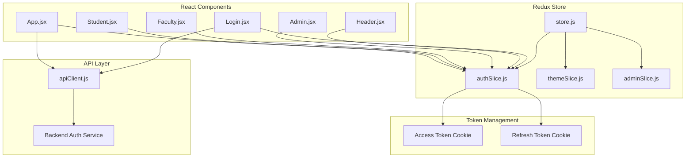
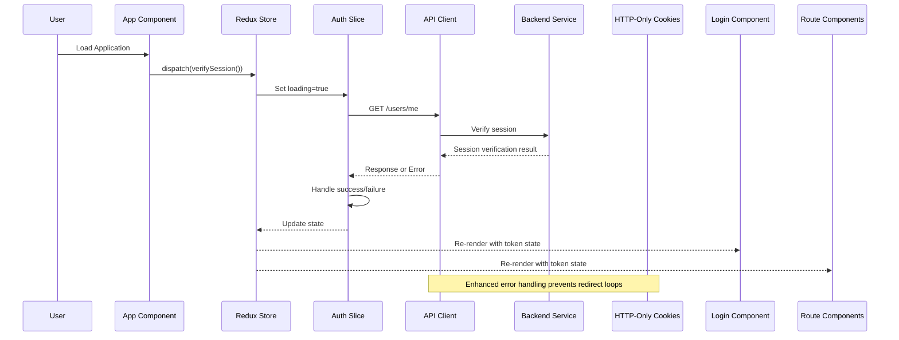
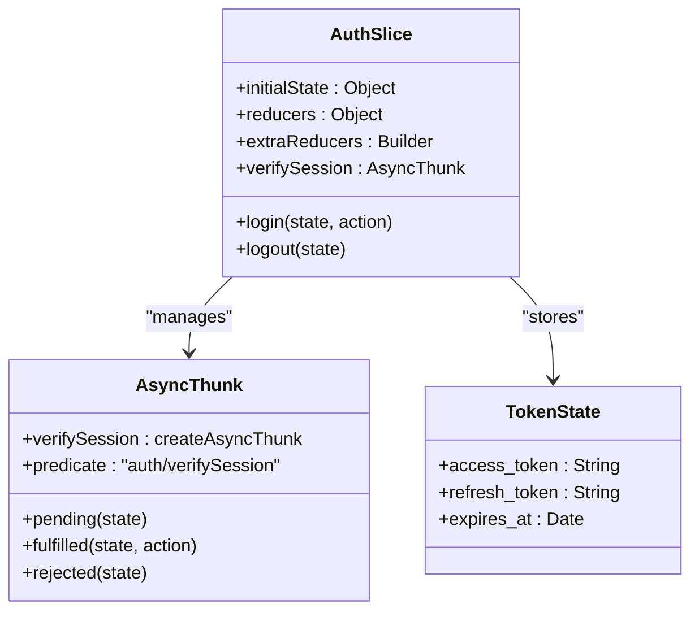
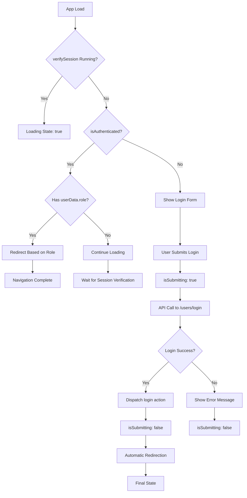

# Frontend Authentication State Management

<cite>
**Referenced Files in This Document**
- [authSlice.js](file://Client/src/store/auth/authSlice.js)
- [store.js](file://Client/src/store/store.js)
- [main.jsx](file://Client/src/main.jsx)
- [Login.jsx](file://Client/src/pages/Login.jsx)
- [Header.jsx](file://Client/src/components/Header.jsx)
- [Admin.jsx](file://Client/src/pages/dashboard/Admin.jsx)
- [Faculty.jsx](file://Client/src/pages/dashboard/Faculty.jsx)
- [Student.jsx](file://Client/src/pages/dashboard/Student.jsx)
- [apiClient.js](file://Client/src/services/apiClient.js)
- [themeSlice.js](file://Client/src/store/theme/themeSlice.js)
- [App.jsx](file://Client/src/App.jsx)
</cite>

## Update Summary
**Changes Made**
- Enhanced API client session verification logic to prevent infinite redirect loops during initial application load
- Added conditional logic to skip token refresh attempts when session verification fails for /users/me endpoint
- Improved error handling in response interceptor to prevent problematic redirect cycles when no active session exists
- Updated authentication flow to handle initial session verification failures gracefully

## Table of Contents
1. [Introduction](#introduction)
2. [Project Structure](#project-structure)
3. [Core Components](#core-components)
4. [Architecture Overview](#architecture-overview)
5. [Detailed Component Analysis](#detailed-component-analysis)
6. [Enhanced Authentication Flow](#enhanced-authentication-flow)
7. [Token Management and Refresh](#token-management-and-refresh)
8. [Component Integration Patterns](#component-integration-patterns)
9. [State Management Enhancements](#state-management-enhancements)
10. [Security Considerations](#security-considerations)
11. [Performance Optimizations](#performance-optimizations)
12. [Troubleshooting Guide](#troubleshooting-guide)
13. [Conclusion](#conclusion)

## Introduction
This document provides comprehensive documentation for the enhanced frontend authentication state management implementation using Redux Toolkit with JWT token support. The system now implements modern authentication practices with access/refresh token management, async session verification via async thunks, comprehensive loading states, and improved error handling. The authentication flow seamlessly integrates with HTTP-only cookies for secure session management and provides robust role-based access control through protected route components.

The enhanced system now features automatic role-based redirection, improved token refresh mechanisms, and better differentiation between initial session verification and login submission states, providing a more robust and user-friendly authentication experience. A critical improvement addresses infinite redirect loops during initial application load by implementing conditional logic to skip token refresh attempts when session verification fails for the /users/me endpoint.

## Project Structure
The authentication system is organized within the Redux store structure under the Client/src/store directory, featuring enhanced JWT token management and async thunk implementations.

**Diagram sources**
- [store.js:1-15](file://Client/src/store/store.js#L1-L15)
- [authSlice.js:1-63](file://Client/src/store/auth/authSlice.js#L1-L63)
- [apiClient.js:1-275](file://Client/src/services/apiClient.js#L1-L275)

**Section sources**
- [store.js:1-15](file://Client/src/store/store.js#L1-L15)
- [main.jsx:1-18](file://Client/src/main.jsx#L1-L18)

## Core Components
The enhanced authentication system consists of several key components working together to manage JWT tokens and provide secure authentication state management.

### Enhanced Authentication Slice Implementation
The authSlice now implements comprehensive JWT token management with async session verification, loading states, and improved error handling. The slice maintains a loading state that starts as true to indicate initial session verification.

### Async Thunk Integration
The system uses createAsyncThunk for session verification on application load, providing robust async state management with pending, fulfilled, and rejected states. The verifySession thunk handles backend session validation and proper error state management.

### API Client Integration
The authentication system integrates with a sophisticated API client that handles HTTP-only cookie management, request caching, automatic retry logic, and comprehensive token refresh mechanisms. The client now includes enhanced error handling to prevent infinite redirect loops during initial application load.

### Component Integration
Multiple React components integrate with the enhanced authentication state to provide role-based access control and secure UI rendering with automatic redirection capabilities.

**Section sources**
- [authSlice.js:1-63](file://Client/src/store/auth/authSlice.js#L1-L63)
- [store.js:1-15](file://Client/src/store/store.js#L1-L15)

## Architecture Overview
The enhanced authentication architecture follows a modern JWT-based approach with async session verification and comprehensive state management.

**Diagram sources**
- [App.jsx:52-59](file://Client/src/App.jsx#L52-L59)
- [authSlice.js:12-22](file://Client/src/store/auth/authSlice.js#L12-L22)
- [apiClient.js:127-132](file://Client/src/services/apiClient.js#L127-L132)

## Detailed Component Analysis

### Enhanced Authentication Slice (authSlice.js)
The authSlice implements a sophisticated JWT-based authentication system with comprehensive state management and async operations.

#### Enhanced Initial State Setup
The slice now includes comprehensive state management for JWT tokens:
- isAuthenticated: Boolean flag indicating user authentication status
- userData: User object containing token information
- loading: Boolean flag for async operation states (starts as true)
- error: Error object for authentication failures

#### Async Thunk Implementation
The system implements verifySession async thunk for automatic session verification:
- Uses createAsyncThunk for standardized async state management
- Handles pending, fulfilled, and rejected states automatically
- Integrates with API client for backend session validation
- Provides comprehensive error handling with rejectWithValue

#### Enhanced Reducer Functions
The slice provides improved reducers with better state management:

**Login Reducer**
- Sets isAuthenticated to true
- Updates userData with token information
- Clears error state on successful authentication
- Sets loading to false after successful login

**Logout Reducer**
- Resets authentication state to null/false
- Clears error state
- Maintains clean state cleanup

**Diagram sources**
- [authSlice.js:4-9](file://Client/src/store/auth/authSlice.js#L4-L9)
- [authSlice.js:12-22](file://Client/src/store/auth/authSlice.js#L12-L22)
- [authSlice.js:27-40](file://Client/src/store/auth/authSlice.js#L27-L40)

**Section sources**
- [authSlice.js:1-63](file://Client/src/store/auth/authSlice.js#L1-L63)

### Enhanced Store Configuration (store.js)
The main store configuration remains focused but now manages the enhanced authentication slice with other application slices.

#### Store Composition
The store includes:
- auth: Enhanced authentication state management with JWT tokens
- theme: UI theme preferences
- admin: Administrative data management
- form: Form state management

**Section sources**
- [store.js:1-15](file://Client/src/store/store.js#L1-L15)

### Enhanced Login Component Integration
The Login component demonstrates comprehensive JWT authentication flow with token management and automatic role-based redirection.

#### Enhanced Authentication Flow
1. User submits login form with credentials
2. Component validates form inputs and prevents submission if invalid
3. Component calls authentication API with token support
4. On successful authentication, extracts access_token and refresh_token
5. Dispatches login action with complete token information
6. Uses useEffect hook for automatic role-based redirection
7. Updates Redux state with token information

#### Automatic Role-Based Redirection
The component implements a new useEffect hook that automatically redirects users based on their role:
- Checks isAuthenticated and userData.role on state changes
- Redirects admin users to /admin
- Redirects student users to /student
- Redirects faculty users to /faculty
- Uses replace: true to prevent back navigation

#### Enhanced Token Management
The component implements comprehensive token handling:
- Extracts both access_token and refresh_token from API response
- Stores tokens in userData for Redux state
- Provides role-based navigation with token validation
- Implements proper error handling for token extraction failures

#### Enhanced Role-Based Navigation
The component implements robust role-based routing:
- Admin users navigate to /admin with token validation
- Student users navigate to /student with token validation
- Faculty users navigate to /faculty with token validation
- Other roles navigate to home with proper error handling

**Section sources**
- [Login.jsx:72-83](file://Client/src/pages/Login.jsx#L72-L83)
- [Login.jsx:124-192](file://Client/src/pages/Login.jsx#L124-L192)

### Enhanced Header Component Integration
The Header component provides authentication-aware UI controls with token state awareness.

#### Enhanced Authentication Controls
The header displays different controls based on authentication state:
- Unauthenticated users see Login button
- Authenticated users see Logout button with token awareness
- Theme toggle functionality remains available
- Token state influences UI rendering decisions

#### Enhanced Logout Implementation
The logout handler implements comprehensive token cleanup:
- Calls backend logout endpoint to clear cookies
- Handles API errors gracefully
- Always clears local state regardless of API success
- Navigates to home route with proper state cleanup

**Section sources**
- [Header.jsx:16-31](file://Client/src/components/Header.jsx#L16-L31)

### Enhanced Role-Based Protected Routes
The application implements robust role-based access control through protected route components with token validation.

#### Enhanced Admin Protection
The Admin component enforces comprehensive authentication:
- Authentication requirement with loading states
- Role verification (must be admin) with token validation
- Automatic redirection for unauthorized users
- Loading states during session verification

#### Enhanced Faculty and Student Protection
Similar robust protection mechanisms apply to faculty and student dashboards:
- Token-based authentication verification
- Role-specific access control
- Loading states for async session validation
- Proper error handling for authentication failures

**Section sources**
- [Admin.jsx:17-47](file://Client/src/pages/dashboard/Admin.jsx#L17-L47)
- [Faculty.jsx:5-35](file://Client/src/pages/dashboard/Faculty.jsx#L5-L35)
- [Student.jsx:5-35](file://Client/src/pages/dashboard/Student.jsx#L5-L35)

## Enhanced Authentication Flow
The enhanced authentication system implements a sophisticated flow that properly differentiates between initial session verification and login submission states.

### Initial Session Verification
When the application loads, the verifySession async thunk runs automatically:
- Sets loading state to true initially
- Calls /users/me endpoint to validate existing session
- Handles success by setting isAuthenticated to true
- Handles failure by resetting authentication state
- Sets loading to false after completion

### Login Submission State
During login submission, the system properly distinguishes between:
- Initial session verification (loading state from verifySession)
- Login submission (isSubmitting state from form)
- Both states are tracked separately to prevent conflicts

### Automatic Redirection Logic
The Login component implements intelligent redirection logic:
- Uses useEffect to watch for authentication state changes
- Differentiates between initial verification and login submission
- Prevents double redirection during login process
- Handles role-based navigation based on user data

### Enhanced Error Handling for Session Verification
The system now includes critical improvements to prevent infinite redirect loops:
- Response interceptor checks for /users/me endpoint failures
- Skips token refresh attempts for session verification failures
- Prevents redirect cycles when no active session exists
- Allows graceful fallback to login page

**Diagram sources**
- [Login.jsx:72-83](file://Client/src/pages/Login.jsx#L72-L83)
- [Login.jsx:124-192](file://Client/src/pages/Login.jsx#L124-L192)
- [authSlice.js:12-22](file://Client/src/store/auth/authSlice.js#L12-L22)

**Section sources**
- [Login.jsx:72-83](file://Client/src/pages/Login.jsx#L72-L83)
- [Login.jsx:124-192](file://Client/src/pages/Login.jsx#L124-L192)
- [authSlice.js:12-22](file://Client/src/store/auth/authSlice.js#L12-L22)

## Token Management and Refresh
The enhanced authentication system implements comprehensive JWT token management with improved refresh mechanisms.

### Enhanced Token Storage Strategy
The system uses HTTP-only cookies for secure token storage:
- Access tokens stored in HTTP-only cookies for XSS protection
- Refresh tokens stored in separate HTTP-only cookies
- Automatic token inclusion in all API requests
- Secure cookie attributes for enhanced security

### Enhanced Token Lifecycle Management
The system implements proper token lifecycle management:
- Automatic token refresh on expiration with comprehensive error handling
- Graceful handling of expired tokens with retry logic
- Token validation before API requests
- Proper cleanup on logout

### Enhanced Token Refresh Mechanism
The apiClient.js implements a sophisticated token refresh system with enhanced error handling:
- Automatic detection of 401 Unauthorized responses
- Queue-based request handling during refresh operations
- Subscriber pattern for notifying pending requests after refresh
- Comprehensive error handling with cache clearing and redirect
- **Critical Enhancement**: Conditional logic to skip token refresh for /users/me endpoint failures

### Enhanced Token State Synchronization
The Redux store maintains token state alongside user data:
- Token information stored in userData object
- Automatic state updates on token changes
- Seamless integration with existing authentication flow
- Consistent token state across application components

**Section sources**
- [apiClient.js:127-132](file://Client/src/services/apiClient.js#L127-L132)
- [Login.jsx:168-173](file://Client/src/pages/Login.jsx#L168-L173)

## Component Integration Patterns
The enhanced authentication system demonstrates several improved integration patterns between components and the Redux store.

### Enhanced State Subscription Patterns
Components now properly differentiate between:
- Authentication state (isAuthenticated, userData, loading)
- Form submission state (isSubmitting)
- Loading states for different operations

### Improved Component Re-rendering
The system implements efficient re-rendering patterns:
- Selective re-rendering based on specific state slices
- Efficient useSelector hooks prevent unnecessary component updates
- Token-aware component optimization
- Role-based conditional rendering with loading states

### Enhanced Error Handling Patterns
Components implement comprehensive error handling:
- Form validation with real-time feedback
- API error handling with user-friendly messages
- Loading state management during async operations
- Graceful degradation on authentication failures

### Enhanced Navigation Patterns
The system implements intelligent navigation:
- Automatic redirection based on authentication state
- Role-based routing with proper state validation
- Prevention of double redirection during login process
- Smooth transitions between authenticated and unauthenticated states

**Section sources**
- [Login.jsx:72-83](file://Client/src/pages/Login.jsx#L72-L83)
- [Login.jsx:124-192](file://Client/src/pages/Login.jsx#L124-L192)
- [Header.jsx:16-31](file://Client/src/components/Header.jsx#L16-L31)

## State Management Enhancements
The enhanced authentication system implements several improvements to state management with comprehensive token handling.

### Enhanced State Update Strategies
- Minimal state updates only when authentication changes
- Direct token state management reduces unnecessary operations
- Async thunk optimization prevents redundant verification calls
- Loading state management prevents UI blocking

### Enhanced Component State Flow
The authentication state flows through multiple components with automatic re-rendering and comprehensive token state management:
- Initial loading state during session verification
- Form submission state during login process
- Final authenticated state with token information
- Error states with proper recovery mechanisms

### Enhanced Storage Optimization
- Lightweight token storage with HTTP-only cookies
- JSON serialization occurs only during state transitions
- Cleanup operations remove unused keys efficiently
- Cache management for API responses

### Enhanced Async Operation Management
- Debounced async operations prevent redundant calls
- Loading state management improves perceived performance
- Error caching prevents repeated failed requests
- Token refresh optimization reduces authentication overhead

**Section sources**
- [authSlice.js:4-9](file://Client/src/store/auth/authSlice.js#L4-L9)
- [Login.jsx:124-192](file://Client/src/pages/Login.jsx#L124-L192)

## Security Considerations
The enhanced authentication system implements comprehensive security measures with JWT token management and HTTP-only cookies.

### Enhanced Security Measures
- HTTP-only cookies for access_token and refresh_token protection
- Secure cookie attributes for XSS and CSRF protection
- Automatic token inclusion in all API requests
- Token validation before sensitive operations

### Enhanced Token Security Implementation
The system implements robust token security:
- Access tokens stored in HTTP-only cookies
- Refresh tokens stored separately for enhanced security
- Automatic token refresh on expiration
- Proper token cleanup on logout

### Enhanced Error Handling Security
The system implements secure error handling:
- Generic error messages prevent information leakage
- Specific error handling for different failure scenarios
- Graceful degradation on authentication failures
- Secure error logging without exposing sensitive data

### Enhanced API Security Integration
The API client implements comprehensive security with enhanced error handling:
- Automatic cookie management for authentication
- Request caching with security considerations
- Network error handling with user feedback
- Retry logic with exponential backoff
- **Critical Enhancement**: Prevents infinite redirect loops during initial load

### Enhanced Production Security Recommendations
- Implement Content Security Policy (CSP) headers
- Add CSRF protection for API requests
- Regular security audits and vulnerability assessments
- Monitor authentication patterns for suspicious activity

**Section sources**
- [apiClient.js:127-132](file://Client/src/services/apiClient.js#L127-L132)
- [Header.jsx:16-31](file://Client/src/components/Header.jsx#L16-L31)

## Performance Optimizations
The enhanced authentication system implements several performance optimizations with comprehensive token management.

### Enhanced State Update Performance
- Minimal state updates only when authentication changes
- Direct token state management reduces unnecessary operations
- Async thunk optimization prevents redundant verification calls
- Loading state management prevents UI blocking

### Enhanced Component Re-rendering Performance
- Selective re-rendering based on specific state slices
- Efficient useSelector hooks prevent unnecessary component updates
- Token-aware component optimization
- Role-based conditional rendering with loading states

### Enhanced Storage Performance
- Lightweight token storage with HTTP-only cookies
- JSON serialization occurs only during state transitions
- Cleanup operations remove unused keys efficiently
- Cache management for API responses

### Enhanced Async Operation Performance
- Debounced async operations prevent redundant calls
- Loading state management improves perceived performance
- Error caching prevents repeated failed requests
- Token refresh optimization reduces authentication overhead

## Troubleshooting Guide

### Common Issues and Solutions

#### Authentication State Conflicts
**Symptoms**: Confusion between initial session verification and login submission states
**Causes**: 
- Both loading and isSubmitting states active simultaneously
- Inproper state management in components
- Missing useEffect dependency arrays

**Solutions**:
- Ensure proper state differentiation between verifySession and login submission
- Use separate state variables for different operation types
- Implement proper useEffect dependency arrays
- Clear isSubmitting state after login completion

#### Automatic Redirection Issues
**Symptoms**: Double redirection or incorrect role-based navigation
**Causes**:
- Missing useEffect dependency tracking
- Improper state checking logic
- Race conditions between authentication and navigation

**Solutions**:
- Verify useEffect dependencies include all state variables
- Implement proper state validation before redirection
- Use replace: true for single-page navigation
- Handle edge cases in role-based routing logic

#### Infinite Redirect Loops During Initial Load
**Symptoms**: Application stuck in redirect cycle when no active session exists
**Causes**:
- Missing conditional logic in response interceptor
- Improper handling of /users/me endpoint failures
- Token refresh attempts triggered unnecessarily

**Solutions**:
- Verify response interceptor includes /users/me endpoint check
- Ensure conditional logic prevents token refresh for session verification failures
- Test initial load behavior with no active session
- Implement proper fallback to login page

#### Token Refresh Failures
**Symptoms**: Frequent token refresh attempts or infinite loops
**Causes**:
- Improper error handling in token refresh
- Missing retry logic implementation
- Cache clearing without proper recovery

**Solutions**:
- Implement comprehensive error handling for token refresh
- Add retry logic with exponential backoff
- Ensure proper cache management after refresh failures
- Clear authentication state on refresh failure

#### Component Rendering Issues
**Symptoms**: UI doesn't reflect authentication state changes
**Causes**:
- Incorrect useSelector usage
- Component not subscribed to auth state
- State update timing issues
- Token state not properly managed

**Solutions**:
- Verify useSelector selectors target correct state slices
- Ensure components are wrapped in Provider
- Check for proper state subscription patterns
- Implement loading states for async operations

**Section sources**
- [Login.jsx:72-83](file://Client/src/pages/Login.jsx#L72-L83)
- [Login.jsx:124-192](file://Client/src/pages/Login.jsx#L124-L192)
- [Header.jsx:16-31](file://Client/src/components/Header.jsx#L16-L31)

## Conclusion
The enhanced frontend authentication state management system provides a robust foundation for modern JWT-based authentication with comprehensive token management, async thunk implementation, and secure HTTP-only cookie handling. The system successfully demonstrates advanced authentication patterns with loading states, comprehensive error handling, and seamless integration with React components.

Key enhancements of the updated implementation include:
- Modern JWT token management with access/refresh token support
- Comprehensive async thunk implementation for session verification
- Secure HTTP-only cookie management for enhanced security
- Robust error handling and loading state management
- Enhanced role-based access control with token validation
- Automatic role-based redirection with useEffect hooks
- Improved token refresh mechanism with comprehensive error handling
- **Critical Enhancement**: Prevention of infinite redirect loops during initial application load through conditional logic
- Efficient state updates with minimal performance overhead

The system provides an excellent foundation for production-ready authentication with comprehensive security measures, proper error handling, and scalable architecture. The integration with HTTP-only cookies ensures secure token storage while maintaining seamless user experience through comprehensive loading states and error handling mechanisms.

The enhanced authentication flow now properly differentiates between initial session verification and login submission states, providing a more intuitive and reliable user experience. The automatic role-based redirection system ensures users are directed to appropriate dashboards based on their authentication status and role assignments.

**Updated**: The most significant enhancement addresses a critical issue where the application could get stuck in infinite redirect loops during initial load when no active session exists. The solution implements conditional logic in the API client's response interceptor to skip token refresh attempts specifically for /users/me endpoint failures, preventing problematic redirect cycles and ensuring graceful fallback to the login page.