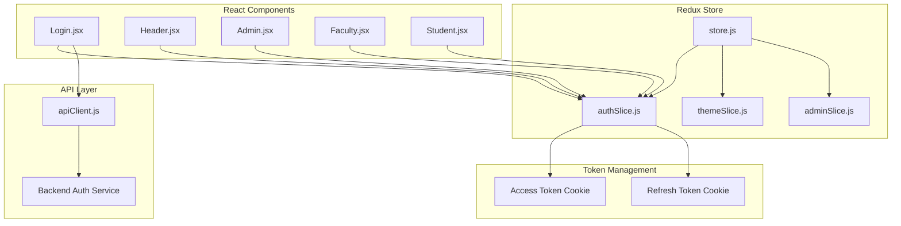
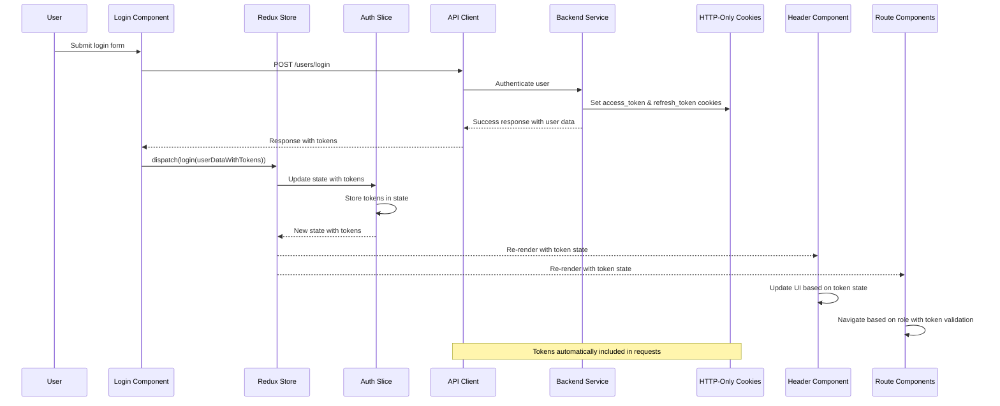
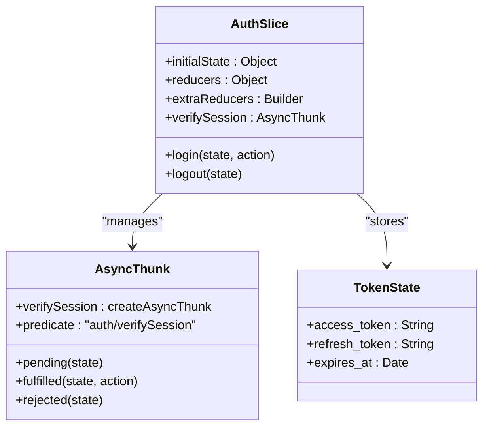
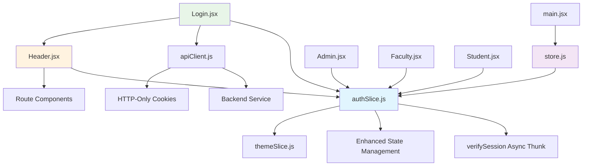

# Frontend Authentication State Management

<cite>
**Referenced Files in This Document**
- [authSlice.js](file://Client/src/store/auth/authSlice.js)
- [store.js](file://Client/src/store/store.js)
- [main.jsx](file://Client/src/main.jsx)
- [Login.jsx](file://Client/src/pages/Login.jsx)
- [Header.jsx](file://Client/src/components/Header.jsx)
- [Admin.jsx](file://Client/src/pages/dashboard/Admin.jsx)
- [Faculty.jsx](file://Client/src/pages/dashboard/Faculty.jsx)
- [Student.jsx](file://Client/src/pages/dashboard/Student.jsx)
- [apiClient.js](file://Client/src/services/apiClient.js)
- [themeSlice.js](file://Client/src/store/theme/themeSlice.js)
</cite>

## Update Summary
**Changes Made**
- Updated authentication architecture to use JWT tokens with access/refresh token support
- Added comprehensive async thunk implementation for session verification
- Enhanced state management with loading states and improved error handling
- Updated authentication flow to use HTTP-only cookies for secure session management
- Added comprehensive token management and API client integration

## Table of Contents
1. [Introduction](#introduction)
2. [Project Structure](#project-structure)
3. [Core Components](#core-components)
4. [Architecture Overview](#architecture-overview)
5. [Detailed Component Analysis](#detailed-component-analysis)
6. [JWT Token Management](#jwt-token-management)
7. [Async Thunk Implementation](#async-thunk-implementation)
8. [Dependency Analysis](#dependency-analysis)
9. [Performance Considerations](#performance-considerations)
10. [Security Considerations](#security-considerations)
11. [Troubleshooting Guide](#troubleshooting-guide)
12. [Conclusion](#conclusion)

## Introduction
This document provides comprehensive documentation for the enhanced frontend authentication state management implementation using Redux Toolkit with JWT token support. The system now implements modern authentication practices with access/refresh token management, async session verification via async thunks, comprehensive loading states, and improved error handling. The authentication flow seamlessly integrates with HTTP-only cookies for secure session management and provides robust role-based access control through protected route components.

## Project Structure
The authentication system is organized within the Redux store structure under the Client/src/store directory, featuring enhanced JWT token management and async thunk implementations.

**Diagram sources**
- [store.js:1-15](file://Client/src/store/store.js#L1-L15)
- [authSlice.js:1-61](file://Client/src/store/auth/authSlice.js#L1-L61)
- [apiClient.js:1-213](file://Client/src/services/apiClient.js#L1-L213)

**Section sources**
- [store.js:1-15](file://Client/src/store/store.js#L1-L15)
- [main.jsx:1-18](file://Client/src/main.jsx#L1-L18)

## Core Components
The enhanced authentication system consists of several key components working together to manage JWT tokens and provide secure authentication state management.

### Enhanced Authentication Slice Implementation
The authSlice now implements comprehensive JWT token management with async session verification, loading states, and improved error handling.

### Async Thunk Integration
The system uses createAsyncThunk for session verification on application load, providing robust async state management with pending, fulfilled, and rejected states.

### API Client Integration
The authentication system integrates with a sophisticated API client that handles HTTP-only cookie management, request caching, and automatic retry logic.

### Component Integration
Multiple React components integrate with the enhanced authentication state to provide role-based access control and secure UI rendering.

**Section sources**
- [authSlice.js:1-61](file://Client/src/store/auth/authSlice.js#L1-L61)
- [store.js:1-15](file://Client/src/store/store.js#L1-L15)

## Architecture Overview
The enhanced authentication architecture follows a modern JWT-based approach with async session verification and comprehensive state management.

**Diagram sources**
- [Login.jsx:132-188](file://Client/src/pages/Login.jsx#L132-L188)
- [authSlice.js:27-38](file://Client/src/store/auth/authSlice.js#L27-L38)
- [apiClient.js:71-76](file://Client/src/services/apiClient.js#L71-L76)

## Detailed Component Analysis

### Enhanced Authentication Slice (authSlice.js)
The authSlice implements a sophisticated JWT-based authentication system with comprehensive state management and async operations.

#### Enhanced Initial State Setup
The slice now includes comprehensive state management for JWT tokens:
- isAuthenticated: Boolean flag indicating user authentication status
- userData: User object containing token information
- loading: Boolean flag for async operation states
- error: Error object for authentication failures

#### Async Thunk Implementation
The system implements verifySession async thunk for automatic session verification:
- Uses createAsyncThunk for standardized async state management
- Handles pending, fulfilled, and rejected states automatically
- Integrates with API client for backend session validation
- Provides comprehensive error handling with rejectWithValue

#### Enhanced Reducer Functions
The slice provides improved reducers with better state management:

**Login Reducer**
- Sets isAuthenticated to true
- Updates userData with token information
- Clears error state on successful authentication
- Stores both user data and token information

**Logout Reducer**
- Resets authentication state to null/false
- Clears error state
- Maintains clean state cleanup

**Diagram sources**
- [authSlice.js:4-9](file://Client/src/store/auth/authSlice.js#L4-L9)
- [authSlice.js:12-22](file://Client/src/store/auth/authSlice.js#L12-L22)
- [authSlice.js:39-55](file://Client/src/store/auth/authSlice.js#L39-L55)

**Section sources**
- [authSlice.js:1-61](file://Client/src/store/auth/authSlice.js#L1-L61)

### Enhanced Store Configuration (store.js)
The main store configuration remains focused but now manages the enhanced authentication slice with other application slices.

#### Store Composition
The store includes:
- auth: Enhanced authentication state management with JWT tokens
- theme: UI theme preferences
- admin: Administrative data management
- form: Form state management

**Section sources**
- [store.js:1-15](file://Client/src/store/store.js#L1-L15)

### Enhanced Login Component Integration
The Login component demonstrates comprehensive JWT authentication flow with token management.

#### Enhanced Authentication Flow
1. User submits login form with credentials
2. Component calls authentication API with token support
3. On successful authentication, extracts access_token and refresh_token
4. Dispatches login action with complete token information
5. Redirects user based on role with token validation
6. Updates Redux state with token information

#### Token Management
The component implements comprehensive token handling:
- Extracts both access_token and refresh_token from API response
- Stores tokens in userData for Redux state
- Provides role-based navigation with token validation
- Implements proper error handling for token extraction failures

#### Enhanced Role-Based Navigation
The component implements robust role-based routing:
- Admin users navigate to /admin with token validation
- Student users navigate to /student with token validation
- Faculty users navigate to /faculty with token validation
- Other roles navigate to home with proper error handling

**Section sources**
- [Login.jsx:132-188](file://Client/src/pages/Login.jsx#L132-L188)

### Enhanced Header Component Integration
The Header component provides authentication-aware UI controls with token state awareness.

#### Enhanced Authentication Controls
The header displays different controls based on authentication state:
- Unauthenticated users see Login button
- Authenticated users see Logout button with token awareness
- Theme toggle functionality remains available
- Token state influences UI rendering decisions

#### Enhanced Logout Implementation
The logout handler implements comprehensive token cleanup:
- Calls backend logout endpoint to clear cookies
- Handles API errors gracefully
- Always clears local state regardless of API success
- Navigates to home route with proper state cleanup

**Section sources**
- [Header.jsx:16-31](file://Client/src/components/Header.jsx#L16-L31)

### Enhanced Role-Based Protected Routes
The application implements robust role-based access control through protected route components with token validation.

#### Enhanced Admin Protection
The Admin component enforces comprehensive authentication:
- Authentication requirement with loading states
- Role verification (must be admin) with token validation
- Automatic redirection for unauthorized users
- Loading states during session verification

#### Enhanced Faculty and Student Protection
Similar robust protection mechanisms apply to faculty and student dashboards:
- Token-based authentication verification
- Role-specific access control
- Loading states for async session validation
- Proper error handling for authentication failures

**Section sources**
- [Admin.jsx:17-52](file://Client/src/pages/dashboard/Admin.jsx#L17-L52)
- [Faculty.jsx:5-35](file://Client/src/pages/dashboard/Faculty.jsx#L5-L35)
- [Student.jsx:5-35](file://Client/src/pages/dashboard/Student.jsx#L5-L35)

## JWT Token Management
The enhanced authentication system implements comprehensive JWT token management with access/refresh token support.

### Token Storage Strategy
The system uses HTTP-only cookies for secure token storage:
- Access tokens stored in HTTP-only cookies for XSS protection
- Refresh tokens stored in separate HTTP-only cookies
- Automatic token inclusion in all API requests
- Secure cookie attributes for enhanced security

### Token Lifecycle Management
The system implements proper token lifecycle management:
- Automatic token refresh on expiration
- Graceful handling of expired tokens
- Token validation before API requests
- Proper cleanup on logout

### Token State Synchronization
The Redux store maintains token state alongside user data:
- Token information stored in userData object
- Automatic state updates on token changes
- Seamless integration with existing authentication flow
- Consistent token state across application components

**Section sources**
- [apiClient.js:71-76](file://Client/src/services/apiClient.js#L71-L76)
- [Login.jsx:145-158](file://Client/src/pages/Login.jsx#L145-L158)

## Async Thunk Implementation
The system implements comprehensive async thunk management for session verification and state updates.

### Session Verification Process
The verifySession async thunk provides robust session validation:
- Automatic execution on application load
- Backend session validation via /users/me endpoint
- Comprehensive error handling with rejectWithValue
- Loading state management during verification

### Async State Management
The system provides comprehensive async state management:
- Pending state during session verification
- Fulfilled state on successful verification
- Rejected state on verification failure
- Loading indicators during async operations

### Error Handling Strategy
The async thunk implements comprehensive error handling:
- Specific error messages for different failure scenarios
- Graceful degradation on verification failures
- User-friendly error messaging
- Proper state cleanup on errors

**Section sources**
- [authSlice.js:12-22](file://Client/src/store/auth/authSlice.js#L12-L22)
- [authSlice.js:39-55](file://Client/src/store/auth/authSlice.js#L39-L55)

## Dependency Analysis
The enhanced authentication system has clear dependencies and relationships between components with comprehensive token management.

**Diagram sources**
- [authSlice.js:1-61](file://Client/src/store/auth/authSlice.js#L1-L61)
- [store.js:1-15](file://Client/src/store/store.js#L1-L15)
- [main.jsx:1-18](file://Client/src/main.jsx#L1-L18)

### Enhanced Component Coupling Analysis
- Low coupling between components and the auth slice
- High cohesion within the auth slice for authentication concerns
- Clear separation of authentication logic from UI concerns
- Comprehensive token management integration

### Enhanced State Flow Dependencies
The authentication state flows through multiple components with automatic re-rendering and comprehensive token state management.

**Section sources**
- [authSlice.js:1-61](file://Client/src/store/auth/authSlice.js#L1-L61)
- [store.js:1-15](file://Client/src/store/store.js#L1-L15)

## Performance Considerations
The enhanced authentication system implements several performance optimizations with comprehensive token management.

### Efficient State Updates
- Minimal state updates only when authentication changes
- Direct token state management reduces unnecessary operations
- Async thunk optimization prevents redundant verification calls
- Loading state management prevents UI blocking

### Enhanced Component Re-rendering
- Selective re-rendering based on specific state slices
- Efficient useSelector hooks prevent unnecessary component updates
- Token-aware component optimization
- Role-based conditional rendering with loading states

### Enhanced Storage Optimization
- Lightweight token storage with HTTP-only cookies
- JSON serialization occurs only during state transitions
- Cleanup operations remove unused keys efficiently
- Cache management for API responses

### Async Operation Optimization
- Debounced async operations prevent redundant calls
- Loading state management improves perceived performance
- Error caching prevents repeated failed requests
- Token refresh optimization reduces authentication overhead

## Security Considerations
The enhanced authentication system implements comprehensive security measures with JWT token management and HTTP-only cookies.

### Enhanced Security Measures
- HTTP-only cookies for access_token and refresh_token protection
- Secure cookie attributes for XSS and CSRF protection
- Automatic token inclusion in all API requests
- Token validation before sensitive operations

### Token Security Implementation
The system implements robust token security:
- Access tokens stored in HTTP-only cookies
- Refresh tokens stored separately for enhanced security
- Automatic token refresh on expiration
- Proper token cleanup on logout

### Error Handling Security
The system implements secure error handling:
- Generic error messages prevent information leakage
- Specific error handling for different failure scenarios
- Graceful degradation on authentication failures
- Secure error logging without exposing sensitive data

### API Security Integration
The API client implements comprehensive security:
- Automatic cookie management for authentication
- Request caching with security considerations
- Network error handling with user feedback
- Retry logic with exponential backoff

### Production Security Recommendations
- Implement Content Security Policy (CSP) headers
- Add CSRF protection for API requests
- Regular security audits and vulnerability assessments
- Monitor authentication patterns for suspicious activity

**Section sources**
- [apiClient.js:71-76](file://Client/src/services/apiClient.js#L71-L76)
- [Header.jsx:16-31](file://Client/src/components/Header.jsx#L16-L31)

## Troubleshooting Guide

### Common Issues and Solutions

#### Authentication State Not Persisting
**Symptoms**: Users appear logged out after page refresh
**Causes**: 
- HTTP-only cookie restrictions
- Cross-origin cookie policy violations
- Browser privacy mode limitations
- Cookie security settings blocking cookies

**Solutions**:
- Verify cookie settings in browser developer tools
- Check for cross-origin policy violations
- Ensure HTTPS deployment for secure cookies
- Implement proper cookie domain and path configuration

#### Token Management Issues
**Symptoms**: JWT tokens not being properly managed
**Causes**:
- Missing token extraction from API responses
- Incorrect token storage in Redux state
- Cookie not being sent with API requests
- Token expiration without proper refresh

**Solutions**:
- Verify token extraction in login component
- Check Redux state structure for token storage
- Inspect network tab for cookie inclusion
- Implement token refresh logic

#### Async Thunk Errors
**Symptoms**: Session verification fails or hangs
**Causes**:
- API endpoint not responding
- Network connectivity issues
- Backend authentication service problems
- Async thunk error handling failures

**Solutions**:
- Verify API endpoint accessibility
- Check network connectivity and CORS settings
- Review backend authentication service logs
- Implement proper error handling and retry logic

#### Component Rendering Issues
**Symptoms**: UI doesn't reflect authentication state changes
**Causes**:
- Incorrect useSelector usage
- Component not subscribed to auth state
- State update timing issues
- Token state not properly managed

**Solutions**:
- Verify useSelector selectors target correct state slices
- Ensure components are wrapped in Provider
- Check for proper state subscription patterns
- Implement loading states for async operations

**Section sources**
- [authSlice.js:12-22](file://Client/src/store/auth/authSlice.js#L12-L22)
- [Login.jsx:132-188](file://Client/src/pages/Login.jsx#L132-L188)
- [Header.jsx:16-31](file://Client/src/components/Header.jsx#L16-L31)

## Conclusion
The enhanced frontend authentication state management system provides a robust foundation for modern JWT-based authentication with comprehensive token management, async thunk implementation, and secure HTTP-only cookie handling. The system successfully demonstrates advanced authentication patterns with loading states, comprehensive error handling, and seamless integration with React components.

Key strengths of the enhanced implementation include:
- Modern JWT token management with access/refresh token support
- Comprehensive async thunk implementation for session verification
- Secure HTTP-only cookie management for enhanced security
- Robust error handling and loading state management
- Enhanced role-based access control with token validation
- Efficient state updates with minimal performance overhead

The system provides an excellent foundation for production-ready authentication with comprehensive security measures, proper error handling, and scalable architecture. The integration with HTTP-only cookies ensures secure token storage while maintaining seamless user experience through comprehensive loading states and error handling mechanisms.