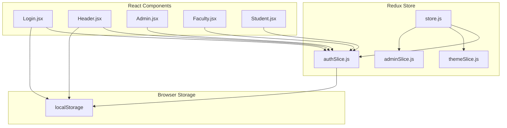
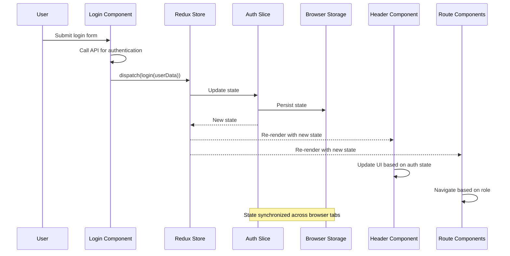
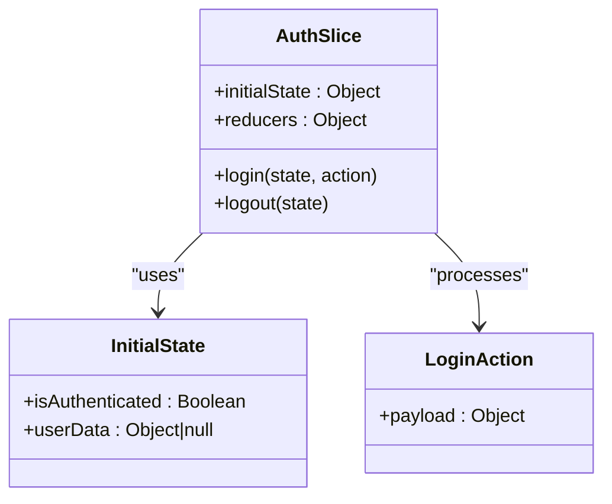
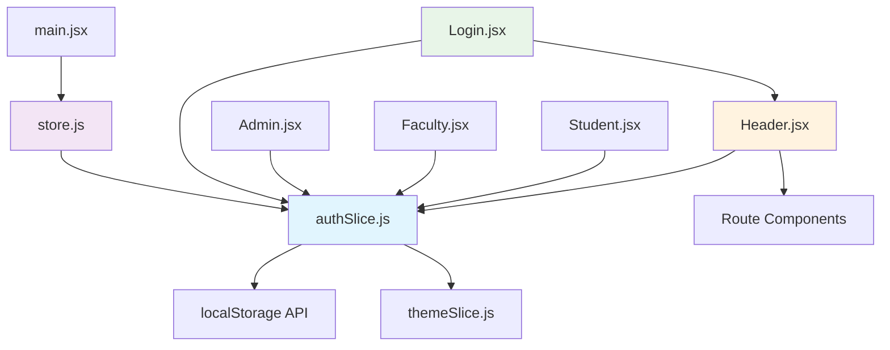

# Frontend Authentication State Management

<cite>
**Referenced Files in This Document**
- [authSlice.js](file://Client/src/store/auth/authSlice.js)
- [store.js](file://Client/src/store/store.js)
- [main.jsx](file://Client/src/main.jsx)
- [Login.jsx](file://Client/src/pages/Login.jsx)
- [Header.jsx](file://Client/src/components/Header.jsx)
- [Admin.jsx](file://Client/src/pages/dashboard/Admin.jsx)
- [Faculty.jsx](file://Client/src/pages/dashboard/Faculty.jsx)
- [Student.jsx](file://Client/src/pages/dashboard/Student.jsx)
- [themeSlice.js](file://Client/src/store/theme/themeSlice.js)
</cite>

## Table of Contents
1. [Introduction](#introduction)
2. [Project Structure](#project-structure)
3. [Core Components](#core-components)
4. [Architecture Overview](#architecture-overview)
5. [Detailed Component Analysis](#detailed-component-analysis)
6. [Dependency Analysis](#dependency-analysis)
7. [Performance Considerations](#performance-considerations)
8. [Security Considerations](#security-considerations)
9. [Troubleshooting Guide](#troubleshooting-guide)
10. [Conclusion](#conclusion)

## Introduction
This document provides comprehensive documentation for the frontend authentication state management implementation using Redux Toolkit. It covers the authSlice implementation, localStorage persistence, authentication flow through the Redux store, component integration, and UI rendering based on authentication state. The system manages user authentication state with automatic synchronization to browser storage and integrates with React components to control UI visibility and navigation.

## Project Structure
The authentication system is organized within the Redux store structure under the Client/src/store directory. The key components include the auth slice for managing authentication state, the main store configuration, and React components that consume and modify this state.

**Diagram sources**
- [store.js:1-15](file://Client/src/store/store.js#L1-L15)
- [authSlice.js:1-32](file://Client/src/store/auth/authSlice.js#L1-L32)
- [themeSlice.js:1-29](file://Client/src/store/theme/themeSlice.js#L1-L29)

**Section sources**
- [store.js:1-15](file://Client/src/store/store.js#L1-L15)
- [main.jsx:1-18](file://Client/src/main.jsx#L1-L18)

## Core Components
The authentication system consists of several key components working together to manage user state and synchronize it with browser storage.

### Authentication Slice Implementation
The authSlice manages two primary pieces of state: authentication status and user data. It initializes state from localStorage and provides reducers for login and logout operations.

### Store Configuration
The main store combines multiple slices including auth, theme, admin, and form slices, creating a centralized state management system.

### Component Integration
Multiple React components integrate with the authentication state to control UI rendering and navigation based on user authentication status.

**Section sources**
- [authSlice.js:1-32](file://Client/src/store/auth/authSlice.js#L1-L32)
- [store.js:1-15](file://Client/src/store/store.js#L1-L15)

## Architecture Overview
The authentication architecture follows a unidirectional data flow pattern where React components dispatch actions to update the Redux store, which automatically synchronizes with localStorage.

**Diagram sources**
- [Login.jsx:15-45](file://Client/src/pages/Login.jsx#L15-L45)
- [authSlice.js:14-26](file://Client/src/store/auth/authSlice.js#L14-L26)
- [Header.jsx:14-18](file://Client/src/components/Header.jsx#L14-L18)

## Detailed Component Analysis

### Authentication Slice (authSlice.js)
The authSlice implements a createSlice with specific initial state setup and reducer functions for authentication management.

#### Initial State Setup
The slice initializes state from localStorage to maintain persistence across browser sessions:
- isAuthenticated: Boolean flag indicating user authentication status
- userData: User object stored as JSON string in localStorage

#### Reducer Functions
The slice provides two primary reducers:

**Login Reducer**
- Sets isAuthenticated to true
- Updates userData with payload
- Persists state to localStorage
- Synchronizes both isAuthenticated and userData in storage

**Logout Reducer**
- Resets authentication state to null/false
- Removes persisted data from localStorage
- Clears both authentication keys

**Diagram sources**
- [authSlice.js:3-8](file://Client/src/store/auth/authSlice.js#L3-L8)
- [authSlice.js:14-26](file://Client/src/store/auth/authSlice.js#L14-L26)

**Section sources**
- [authSlice.js:1-32](file://Client/src/store/auth/authSlice.js#L1-L32)

### Store Configuration (store.js)
The main store configuration combines multiple slices including the authentication slice with other application slices.

#### Store Composition
The store includes:
- auth: Authentication state management
- theme: UI theme preferences
- admin: Administrative data management
- form: Form state management

**Section sources**
- [store.js:1-15](file://Client/src/store/store.js#L1-L15)

### Login Component Integration
The Login component demonstrates complete authentication flow from user interaction to state updates.

#### Authentication Flow
1. User submits login form with credentials
2. Component calls authentication API
3. On successful authentication, dispatches login action
4. Redirects user based on role
5. Updates Redux state and localStorage

#### Role-Based Navigation
The component implements role-based routing:
- Admin users navigate to /admin
- Student users navigate to /student
- Faculty users navigate to /faculty
- Other roles navigate to home

**Section sources**
- [Login.jsx:1-116](file://Client/src/pages/Login.jsx#L1-L116)

### Header Component Integration
The Header component provides authentication-aware UI controls that respond to state changes.

#### Authentication Controls
The header displays different controls based on authentication state:
- Unauthenticated users see Login button
- Authenticated users see Logout button
- Theme toggle functionality remains available

#### Logout Implementation
The logout handler:
- Dispatches logout action
- Navigates to home route
- Triggers state reset and localStorage cleanup

**Section sources**
- [Header.jsx:1-122](file://Client/src/components/Header.jsx#L1-L122)

### Role-Based Protected Routes
The application implements role-based access control through protected route components.

#### Admin Protection
The Admin component enforces:
- Authentication requirement
- Role verification (must be admin)
- Automatic redirection for unauthorized users

#### Faculty and Student Protection
Similar protection mechanisms apply to faculty and student dashboards with role-specific checks.

**Section sources**
- [Admin.jsx:17-49](file://Client/src/pages/dashboard/Admin.jsx#L17-L49)
- [Faculty.jsx:5-19](file://Client/src/pages/dashboard/Faculty.jsx#L5-L19)
- [Student.jsx:5-19](file://Client/src/pages/dashboard/Student.jsx#L5-L19)

## Dependency Analysis
The authentication system has clear dependencies and relationships between components.

**Diagram sources**
- [authSlice.js:1-32](file://Client/src/store/auth/authSlice.js#L1-L32)
- [store.js:1-15](file://Client/src/store/store.js#L1-L15)
- [main.jsx:1-18](file://Client/src/main.jsx#L1-L18)

### Component Coupling Analysis
- Low coupling between components and the auth slice
- High cohesion within the auth slice for authentication concerns
- Clear separation of authentication logic from UI concerns

### State Flow Dependencies
The authentication state flows through multiple components with automatic re-rendering triggered by state changes.

**Section sources**
- [authSlice.js:1-32](file://Client/src/store/auth/authSlice.js#L1-L32)
- [store.js:1-15](file://Client/src/store/store.js#L1-L15)

## Performance Considerations
The authentication system implements several performance optimizations:

### Efficient State Updates
- Minimal state updates only when authentication changes
- Direct localStorage synchronization reduces unnecessary operations
- Single source of truth prevents redundant state management

### Component Re-rendering
- Selective re-rendering based on specific state slices
- Efficient useSelector hooks prevent unnecessary component updates
- Role-based conditional rendering optimizes DOM manipulation

### Storage Optimization
- Lightweight localStorage usage with minimal key-value pairs
- JSON serialization occurs only during state transitions
- Cleanup operations remove unused keys efficiently

## Security Considerations
The current implementation has several security considerations that should be addressed:

### Current Security Limitations
- User data stored in localStorage as JSON string
- No encryption or hashing of sensitive information
- Potential XSS vulnerabilities with client-side storage
- No expiration mechanism for stored tokens

### Recommended Security Enhancements
- Implement secure HTTP-only cookies for session management
- Add token expiration and refresh mechanisms
- Encrypt sensitive data before localStorage storage
- Implement Content Security Policy (CSP) headers
- Add CSRF protection for API requests
- Regular security audits and vulnerability assessments

### Best Practices for Production
- Use server-side session management instead of client-side storage
- Implement proper error handling and logging
- Add rate limiting for authentication attempts
- Secure API endpoints with proper authentication middleware

## Troubleshooting Guide

### Common Issues and Solutions

#### Authentication State Not Persisting
**Symptoms**: Users appear logged out after page refresh
**Causes**: 
- localStorage access blocked by browser settings
- Cross-origin storage restrictions
- Browser privacy mode limitations

**Solutions**:
- Verify localStorage availability in browser console
- Check for cross-origin policy violations
- Implement fallback authentication mechanisms

#### State Synchronization Problems
**Symptoms**: Different browser tabs show inconsistent authentication state
**Causes**:
- Multiple simultaneous login/logout operations
- Browser tab conflicts with localStorage

**Solutions**:
- Implement localStorage change event listeners
- Add debouncing for rapid authentication operations
- Use atomic state update patterns

#### Component Rendering Issues
**Symptoms**: UI doesn't reflect authentication state changes
**Causes**:
- Incorrect useSelector usage
- Component not subscribed to auth state
- State update timing issues

**Solutions**:
- Verify useSelector selectors target correct state slices
- Ensure components are wrapped in Provider
- Check for proper state subscription patterns

**Section sources**
- [authSlice.js:14-26](file://Client/src/store/auth/authSlice.js#L14-L26)
- [Login.jsx:15-45](file://Client/src/pages/Login.jsx#L15-L45)
- [Header.jsx:14-18](file://Client/src/components/Header.jsx#L14-L18)

## Conclusion
The frontend authentication state management system provides a robust foundation for user authentication with Redux Toolkit. The implementation successfully demonstrates localStorage persistence, efficient state updates, and seamless integration with React components. The system effectively manages authentication state across browser sessions and provides role-based access control through protected route components.

Key strengths of the implementation include:
- Clean separation of authentication logic from UI concerns
- Efficient state synchronization with localStorage
- Role-based navigation and access control
- Minimal performance overhead through selective re-rendering

Areas for improvement include enhanced security measures for production deployment, particularly around client-side storage of sensitive user data. The current architecture provides an excellent foundation for building more secure and scalable authentication systems.