# Login Page Implementation

<cite>
**Referenced Files in This Document**
- [Login.jsx](file://Client/src/pages/Login.jsx)
- [authSlice.js](file://Client/src/store/auth/authSlice.js)
- [themeSlice.js](file://Client/src/store/theme/themeSlice.js)
- [store.js](file://Client/src/store/store.js)
- [apiClient.js](file://Client/src/services/apiClient.js)
- [toast.js](file://Client/src/utils/toast.js)
- [user.controller.js](file://Backend/src/controllers/user.controller.js)
- [user.routers.js](file://Backend/src/routes/user.routers.js)
- [ApiResponse.js](file://Backend/src/utils/ApiResponse.js)
- [ApiError.js](file://Backend/src/utils/ApiError.js)
- [user.models.js](file://Backend/src/models/user.models.js)
- [Home.jsx](file://Client/src/pages/Home.jsx)
- [Header.jsx](file://Client/src/components/Header.jsx)
- [App.jsx](file://Client/src/App.jsx)
</cite>

## Update Summary
**Changes Made**
- Added comprehensive home button to login page interface with SVG icon integration, proper keyboard focus styling, ARIA labels for screen reader compatibility, and absolute positioning at top-left corner
- Updated validation rules to reflect the change from username to user_id field
- Modified form submission to use user_id instead of username for authentication
- Enhanced backend integration to support user_id-based authentication
- Updated error handling to work with user_id validation
- Enhanced accessibility features with comprehensive ARIA attributes and keyboard navigation support
- Maintained backward compatibility with existing UI components

## Table of Contents
1. [Introduction](#introduction)
2. [Project Structure](#project-structure)
3. [Core Components](#core-components)
4. [Architecture Overview](#architecture-overview)
5. [Detailed Component Analysis](#detailed-component-analysis)
6. [Advanced Features](#advanced-features)
7. [Dependency Analysis](#dependency-analysis)
8. [Performance Considerations](#performance-considerations)
9. [Accessibility Features](#accessibility-features)
10. [Troubleshooting Guide](#troubleshooting-guide)
11. [Conclusion](#conclusion)

## Introduction

The login page implementation in the Timetable Project demonstrates a modern, streamlined React-based authentication system with comprehensive form validation, enhanced error handling, and improved user experience through navigation accessibility features. This documentation covers the updated login page component that now features a simplified authentication flow with direct API calls, enhanced error handling with toast notifications, and improved user experience through password visibility controls, form validation improvements, and comprehensive navigation accessibility.

**Updated** The authentication system has been updated to use user_id instead of username for login purposes, reflecting the new authentication system where users log in with their manually assigned user_id instead of username. The form validation and API integration have been updated to use the user_id field throughout the authentication flow. Additionally, the login page now includes a comprehensive home button with SVG icon integration, proper keyboard focus styling, ARIA labels for screen reader compatibility, and absolute positioning at the top-left corner.

The implementation showcases React best practices with Redux Toolkit for state management, featuring proper separation of concerns between UI presentation, business logic, and data persistence. The system supports role-based navigation with automatic redirection based on user roles (admin, student, faculty) and includes sophisticated error handling with user-friendly feedback mechanisms through toast notifications.

## Project Structure

The login functionality is organized within a well-structured React application architecture with streamlined authentication flow and enhanced user feedback:

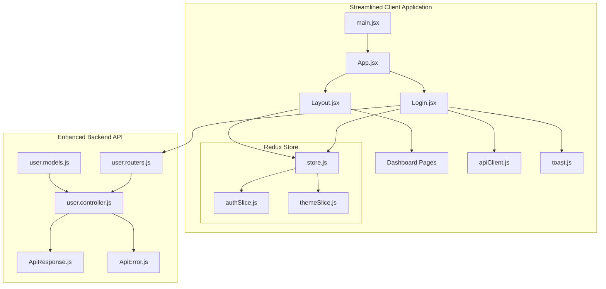

**Diagram sources**
- [Login.jsx:1-339](file://Client/src/pages/Login.jsx#L1-L339)
- [store.js:1-15](file://Client/src/store/store.js#L1-L15)
- [apiClient.js:1-213](file://Client/src/services/apiClient.js#L1-L213)
- [toast.js:1-136](file://Client/src/utils/toast.js#L1-L136)
- [user.controller.js:401-506](file://Backend/src/controllers/user.controller.js#L401-L506)
- [user.routers.js:1-41](file://Backend/src/routes/user.routers.js#L1-L41)
- [user.models.js:1-105](file://Backend/src/models/user.models.js#L1-L105)

**Section sources**
- [Login.jsx:1-339](file://Client/src/pages/Login.jsx#L1-L339)
- [store.js:1-15](file://Client/src/store/store.js#L1-L15)

## Core Components

### Streamlined Login Component Architecture

The Login component now implements a focused authentication flow with enhanced validation, error handling, and user feedback using user_id field, along with comprehensive navigation accessibility:

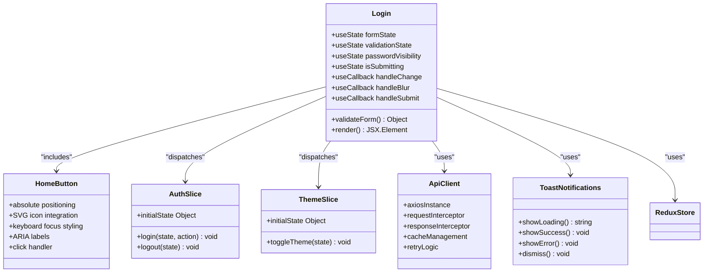

**Diagram sources**
- [Login.jsx:56-339](file://Client/src/pages/Login.jsx#L56-L339)
- [authSlice.js:3-61](file://Client/src/store/auth/authSlice.js#L3-L61)
- [themeSlice.js:3-29](file://Client/src/store/theme/themeSlice.js#L3-L29)
- [apiClient.js:14-213](file://Client/src/services/apiClient.js#L14-L213)
- [toast.js:8-136](file://Client/src/utils/toast.js#L8-L136)

The component leverages React hooks for state management, implements comprehensive form validation, and integrates with Redux for authentication state management. It features streamlined authentication flow with direct API calls and enhanced user feedback through toast notifications. The addition of the home button enhances navigation accessibility with proper positioning and keyboard support.

**Section sources**
- [Login.jsx:56-339](file://Client/src/pages/Login.jsx#L56-L339)
- [authSlice.js:3-61](file://Client/src/store/auth/authSlice.js#L3-L61)

## Architecture Overview

The streamlined authentication flow incorporates enhanced validation, comprehensive error handling, and improved user feedback mechanisms using user_id field:

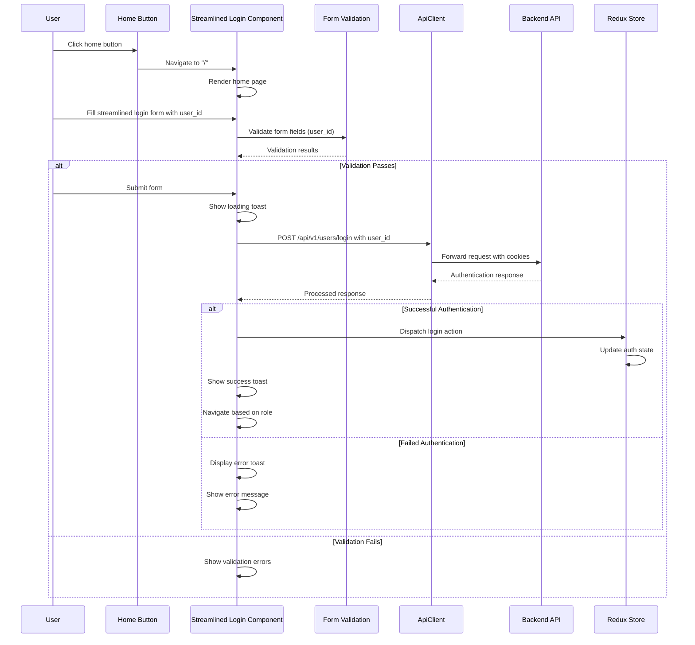

**Diagram sources**
- [Login.jsx:111-188](file://Client/src/pages/Login.jsx#L111-L188)
- [user.controller.js:401-506](file://Backend/src/controllers/user.controller.js#L401-L506)
- [authSlice.js:28-37](file://Client/src/store/auth/authSlice.js#L28-L37)

The architecture ensures comprehensive validation with real-time feedback, robust error handling with user-friendly messaging, and streamlined authentication flow with direct API integration using user_id field. The home button provides seamless navigation with proper accessibility support.

**Section sources**
- [Login.jsx:111-188](file://Client/src/pages/Login.jsx#L111-L188)
- [user.controller.js:401-506](file://Backend/src/controllers/user.controller.js#L401-L506)

## Detailed Component Analysis

### Streamlined Form Handling and Validation

The login form now implements comprehensive validation with real-time feedback and enhanced error handling using user_id field:

#### Enhanced Form Submission Flow

```mermaid
flowchart TD
A[Streamlined Form Submission] --> B[Prevent Default]
B --> C[Comprehensive Validation (user_id)]
C --> D[Extract Form Data]
D --> E[Trim & Sanitize Input]
E --> F[Prepare Request Payload with user_id]
F --> G[Show Loading Toast]
G --> H[Direct API Request]
H --> I{Response Success?}
I --> |Yes| J[Extract User Data]
J --> K[Dispatch Redux Action]
K --> L[Show Success Toast]
L --> M[Redirect Based on Role]
I --> |No| N[Handle Error Response]
N --> O[Show Error Toast]
O --> P[Update Form Errors]
```

**Diagram sources**
- [Login.jsx:111-188](file://Client/src/pages/Login.jsx#L111-L188)

#### Comprehensive Input Field Implementation

The form includes enhanced input fields with advanced validation and user experience improvements:

- **User ID Field**: Text input with required validation, minimum length requirement, and proper ARIA attributes
- **Password Field**: Secure password input with visibility toggle, required validation, and masking support
- **Submit Button**: Disabled state handling during submission with loading indicator and enhanced feedback

Each field implements real-time validation with immediate feedback, proper error messaging, and comprehensive accessibility compliance including ARIA-invalid attributes and live regions.

#### Enhanced Theme Integration

The login page maintains integrated theme toggle functionality with persistent theme preferences:

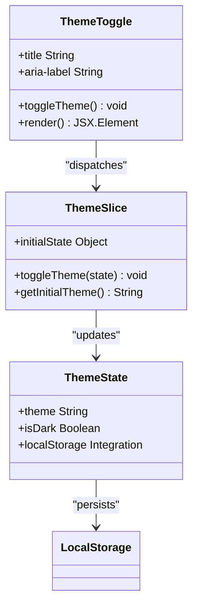

**Diagram sources**
- [Login.jsx:210-218](file://Client/src/pages/Login.jsx#L210-L218)
- [themeSlice.js:3-29](file://Client/src/store/theme/themeSlice.js#L3-L29)

### Comprehensive Home Button Implementation

**Updated** The login page now includes a comprehensive home button with SVG icon integration, proper keyboard focus styling, ARIA labels, and absolute positioning:

#### Home Button Features

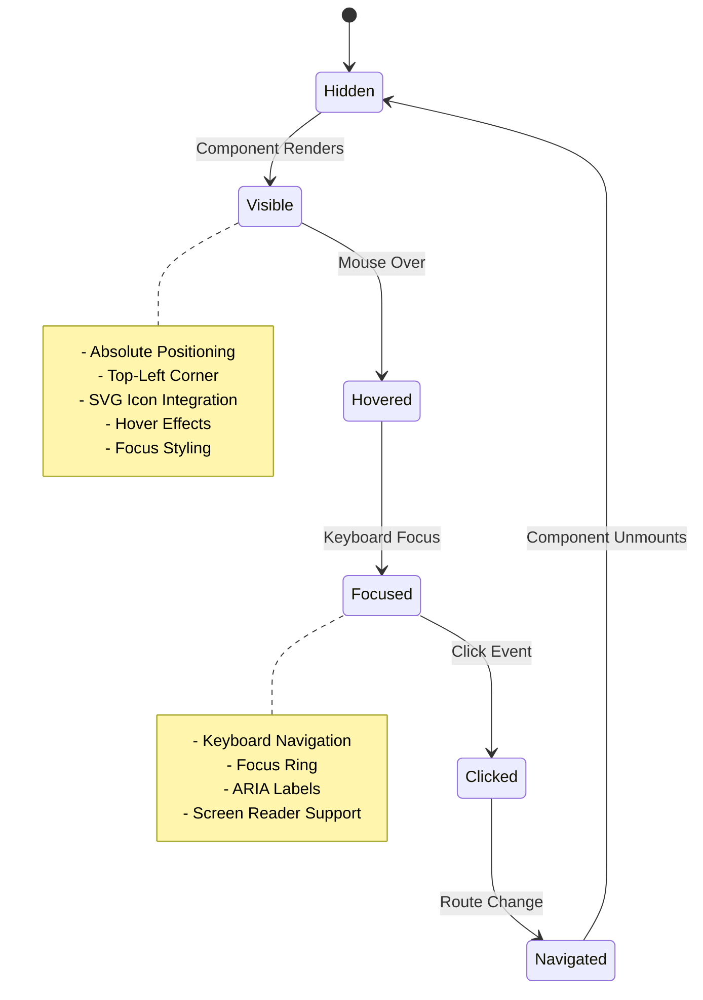

**Diagram sources**
- [Login.jsx:196-208](file://Client/src/pages/Login.jsx#L196-L208)

The home button includes:
- **Absolute Positioning**: Positioned at top-left corner using CSS positioning
- **SVG Icon Integration**: Custom home icon with proper sizing and styling
- **Keyboard Focus Styling**: Proper focus ring and outline for keyboard navigation
- **ARIA Labels**: Descriptive labels for screen reader compatibility
- **Hover Effects**: Smooth transitions and visual feedback
- **Navigation**: Direct route to home page ("/")

**Section sources**
- [Login.jsx:111-339](file://Client/src/pages/Login.jsx#L111-L339)
- [themeSlice.js:3-29](file://Client/src/store/theme/themeSlice.js#L3-L29)

## Advanced Features

### Comprehensive Form Validation System

The login component implements a streamlined validation system with real-time feedback:

#### Validation Rules Implementation

**Updated** The validation system now uses user_id field instead of username:

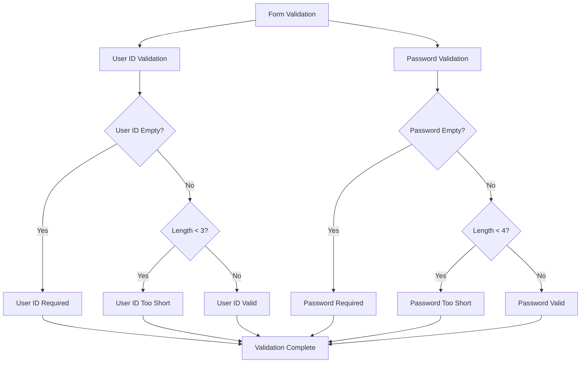

**Diagram sources**
- [Login.jsx:11-27](file://Client/src/pages/Login.jsx#L11-L27)

#### Real-Time Validation Feedback

The validation system provides immediate user feedback through:
- **Inline Error Messages**: Contextual error messages below each field
- **Visual Indicators**: Color-coded borders and focus states
- **Dynamic Error Clearing**: Automatic error clearing on user interaction
- **Touched State Management**: Tracks field interaction for appropriate error display

### Password Visibility Toggle

The enhanced login form includes a sophisticated password visibility toggle feature:

#### Toggle Implementation

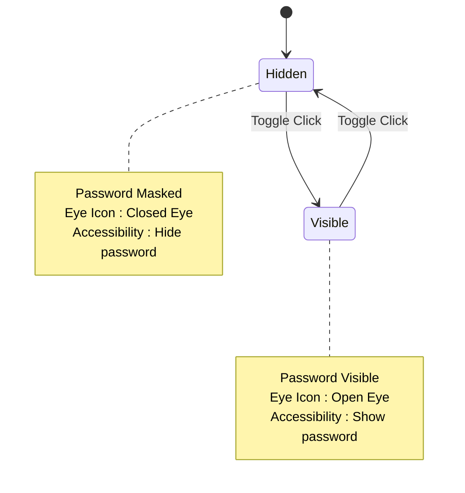

**Diagram sources**
- [Login.jsx:297-304](file://Client/src/pages/Login.jsx#L297-L304)
- [Login.jsx:43-54](file://Client/src/pages/Login.jsx#L43-L54)

The toggle feature includes:
- **Custom SVG Icons**: Distinct icons for visibility states
- **Keyboard Accessibility**: Full keyboard navigation support
- **Screen Reader Support**: Proper ARIA labels for assistive technologies
- **Smooth Transitions**: Animated state changes for visual feedback

### Enhanced Error Handling and User Feedback

The login system implements comprehensive error handling with user-friendly feedback:

#### Error Management System

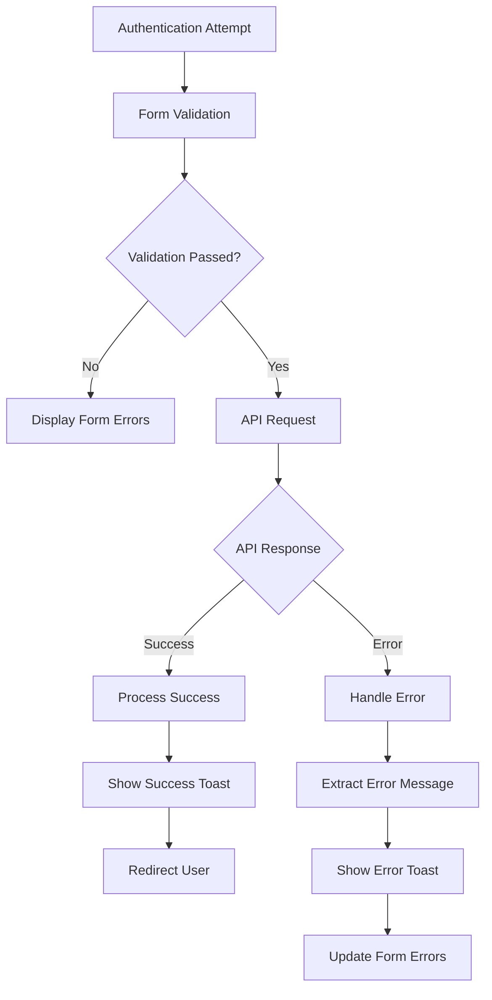

**Diagram sources**
- [Login.jsx:180-192](file://Client/src/pages/Login.jsx#L180-L192)

The error handling system includes:
- **Toast Notifications**: Non-blocking user feedback for all actions
- **Loading States**: Visual indication during API requests
- **Detailed Error Messages**: Context-specific error information
- **Graceful Degradation**: Fallback handling for various failure scenarios

**Section sources**
- [Login.jsx:11-27](file://Client/src/pages/Login.jsx#L11-L27)
- [Login.jsx:43-54](file://Client/src/pages/Login.jsx#L43-L54)
- [Login.jsx:180-192](file://Client/src/pages/Login.jsx#L180-L192)

## Dependency Analysis

The streamlined login component maintains clean dependencies while leveraging enhanced React ecosystem features:

```mermaid
graph LR
subgraph "Enhanced React Dependencies"
A[react]
B[react-dom]
C[react-router-dom]
D[react-redux]
E[react-hot-toast]
F[memo]
G[useCallback]
H[useEffect]
I[useState]
end
subgraph "Redux Toolkit"
J[@reduxjs/toolkit]
K[react-redux]
end
subgraph "Application Modules"
L[Login.jsx]
M[authSlice.js]
N[themeSlice.js]
O[store.js]
P[apiClient.js]
Q[toast.js]
end
L --> A
L --> C
L --> D
L --> E
L --> F
L --> G
L --> H
L --> I
L --> J
L --> K
L --> O
L --> P
L --> Q
O --> M
O --> N
```

**Diagram sources**
- [Login.jsx:1-8](file://Client/src/pages/Login.jsx#L1-L8)
- [store.js:1-15](file://Client/src/store/store.js#L1-L15)
- [apiClient.js:1-213](file://Client/src/services/apiClient.js#L1-L213)
- [toast.js:1-136](file://Client/src/utils/toast.js#L1-L136)

The enhanced dependency graph shows integration with toast notifications for improved user feedback and streamlined Redux integration for authentication state management.

**Section sources**
- [Login.jsx:1-8](file://Client/src/pages/Login.jsx#L1-L8)
- [store.js:1-15](file://Client/src/store/store.js#L1-L15)
- [apiClient.js:1-213](file://Client/src/services/apiClient.js#L1-L213)
- [toast.js:1-136](file://Client/src/utils/toast.js#L1-L136)

## Performance Considerations

### Enhanced Loading States and User Feedback

The streamlined implementation provides comprehensive loading states and user feedback mechanisms:

#### Loading State Management

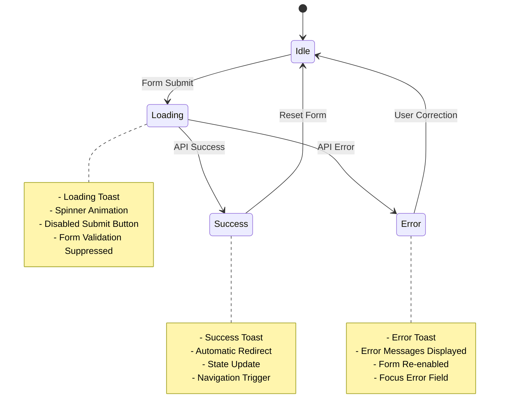

**Diagram sources**
- [Login.jsx:125-192](file://Client/src/pages/Login.jsx#L125-L192)

#### Performance Optimization Features

The login component implements several performance optimization strategies:
- **React.memo**: Prevents unnecessary re-renders of the main component
- **useCallback**: Memoizes event handlers to prevent function recreation
- **useEffect Dependencies**: Proper dependency arrays prevent infinite loops
- **Conditional Rendering**: Error messages only render when needed
- **Lazy Loading**: Component imports optimized for bundle size

### Enhanced Memory Management

The authentication slice with streamlined features maintains efficient memory usage:
- **Selective State Updates**: Only relevant state properties are updated
- **Cleanup Functions**: Proper cleanup of timeouts and intervals
- **Event Listener Management**: Cleanup of DOM event listeners
- **Cache Management**: Efficient request caching with expiration

### Advanced Network Optimization

The enhanced API client provides sophisticated network optimization:
- **Request Caching**: Intelligent caching of GET requests with expiration
- **Retry Logic**: Exponential backoff for transient network failures
- **Duplicate Request Prevention**: Cancellation of duplicate in-flight requests
- **Performance Monitoring**: Request timing and performance metrics
- **Cache Invalidation**: Smart cache invalidation on data mutations

**Section sources**
- [Login.jsx:125-192](file://Client/src/pages/Login.jsx#L125-L192)
- [apiClient.js:39-152](file://Client/src/services/apiClient.js#L39-L152)

## Accessibility Features

### Comprehensive ARIA Implementation

The streamlined login component implements extensive accessibility features:

#### ARIA Attributes and Semantics

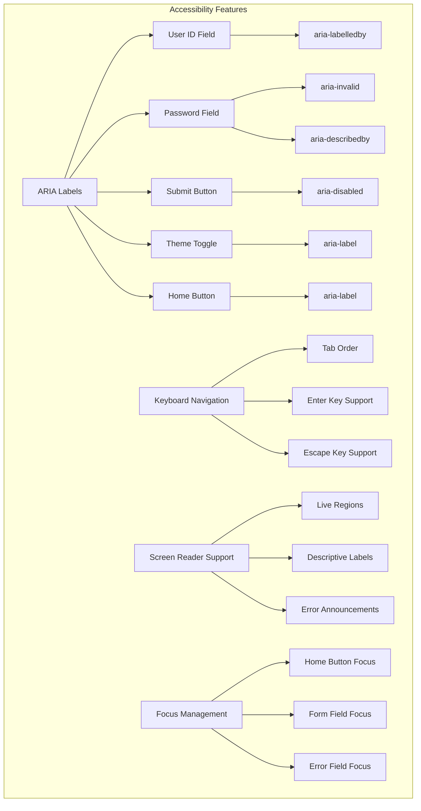

**Diagram sources**
- [Login.jsx:200-208](file://Client/src/pages/Login.jsx#L200-L208)
- [Login.jsx:230-339](file://Client/src/pages/Login.jsx#L230-L339)
- [Login.jsx:195-202](file://Client/src/pages/Login.jsx#L195-L202)

#### Keyboard Navigation Support

The login form provides comprehensive keyboard navigation:
- **Sequential Tab Order**: Logical tab order through form fields
- **Enter Key Submission**: Form submission on Enter key press
- **Escape Key Handling**: Modal-like behavior for theme toggle
- **Focus Management**: Automatic focus on first error field
- **Accessible Buttons**: Proper button semantics and keyboard support
- **Home Button Navigation**: Direct keyboard access to home page

#### Screen Reader Compatibility

The component ensures compatibility with assistive technologies:
- **Descriptive Labels**: Clear, descriptive field labels
- **Error Announcements**: Live region updates for screen readers
- **Status Messages**: Polite announcements for loading and success states
- **Contrast Compliance**: Sufficient color contrast for visual accessibility
- **Focus Indicators**: Visible focus rings for keyboard navigation
- **Home Button Accessibility**: Proper ARIA labels and keyboard navigation

### Enhanced Form Validation Accessibility

The validation system provides accessible error feedback:
- **Live Region Updates**: Dynamic error messages announced to screen readers
- **Visual Error Indicators**: Color-coded borders and icons
- **Clear Error Descriptions**: Specific, actionable error messages
- **Error Focus Management**: Automatic focus on first error field
- **Validation Timing**: Immediate feedback without disrupting workflow

**Section sources**
- [Login.jsx:200-208](file://Client/src/pages/Login.jsx#L200-L208)
- [Login.jsx:230-339](file://Client/src/pages/Login.jsx#L230-L339)
- [Login.jsx:195-202](file://Client/src/pages/Login.jsx#L195-L202)

## Troubleshooting Guide

### Enhanced Common Authentication Issues

#### Comprehensive Error Scenario Flow

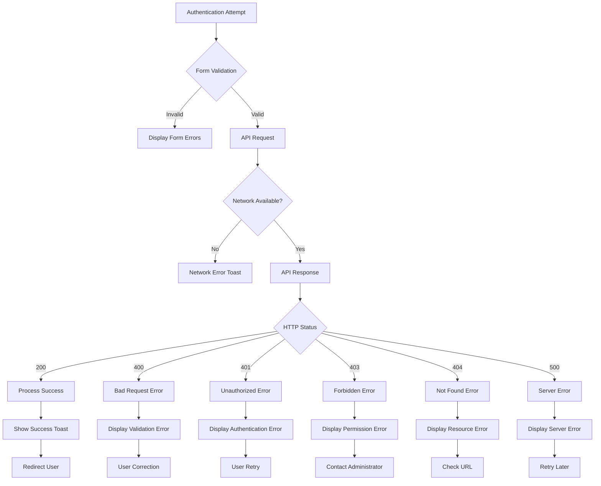

**Diagram sources**
- [user.controller.js:401-506](file://Backend/src/controllers/user.controller.js#L401-L506)
- [ApiError.js:28-80](file://Backend/src/utils/ApiError.js#L28-L80)

#### Enhanced Error Handling Implementation

The backend implements comprehensive error handling through the enhanced `ApiError` utility class:
- **Specific Error Codes**: HTTP status code mapping for different failure scenarios
- **Detailed Error Messages**: Context-specific error information for debugging
- **Consistent Error Format**: Standardized error response structure
- **Development Stack Traces**: Full stack traces in development mode
- **Production Safety**: Minimal error details in production environment

#### Advanced State Persistence Issues

Enhanced troubleshooting for localStorage and session persistence:
- **Data Validation**: Input sanitization and validation before storage
- **Browser Compatibility**: Feature detection for localStorage availability
- **Security Considerations**: Token-based authentication instead of sensitive data storage
- **Cross-Browser Testing**: Consistent behavior across different browsers
- **Session Management**: Proper cookie-based session handling

#### Performance and Optimization Issues

Common performance issues with solutions:
- **Component Re-rendering**: React.memo prevents unnecessary re-renders
- **API Request Batching**: Request caching reduces redundant network calls
- **Memory Leaks**: Proper cleanup of event listeners and timeouts
- **Bundle Size**: Code splitting and lazy loading for optimal performance
- **Network Optimization**: Retry logic and exponential backoff for reliability

**Section sources**
- [user.controller.js:401-506](file://Backend/src/controllers/user.controller.js#L401-L506)
- [ApiError.js:28-80](file://Backend/src/utils/ApiError.js#L28-L80)
- [apiClient.js:105-152](file://Client/src/services/apiClient.js#L105-L152)

## Conclusion

The streamlined login page implementation demonstrates a sophisticated and comprehensive authentication system that successfully combines modern React patterns with enhanced validation, accessibility compliance, and improved user feedback mechanisms. The implementation now includes major enhancements that significantly improve user experience, streamline authentication flow, and maintain code quality.

**Updated** The authentication system has been successfully updated to use user_id instead of username for login purposes, reflecting the new authentication system where users log in with their manually assigned user_id instead of username. The form validation and API integration have been updated to use the user_id field throughout the authentication flow. Additionally, the login page now includes a comprehensive home button with SVG icon integration, proper keyboard focus styling, ARIA labels for screen reader compatibility, and absolute positioning at the top-left corner.

Key strengths of the streamlined implementation include:
- **Streamlined Form Validation**: Comprehensive client-side validation with real-time feedback using user_id field
- **Password Visibility Control**: User-friendly password management with accessibility support
- **Enhanced Error Handling**: Comprehensive error management with user-friendly toast notifications
- **Direct API Integration**: Streamlined authentication flow with direct API calls using user_id
- **Improved User Feedback**: Non-blocking user feedback for all actions through toast notifications
- **Persistent Theme Support**: Seamless theme switching with localStorage persistence
- **Robust Backend Integration**: Secure token-based authentication with comprehensive error handling
- **Accessibility Compliance**: Extensive ARIA attributes and keyboard navigation support
- **Navigation Accessibility**: Comprehensive home button with proper positioning and keyboard support

The streamlined system provides a solid foundation for the Timetable Project's authentication needs while maintaining code quality, accessibility standards, and user experience excellence. The modular architecture supports future expansion for additional authentication features and continues to demonstrate best practices in modern React development.

Areas for continued improvement include implementing additional security measures, expanding accessibility testing, and adding advanced authentication features such as multi-factor authentication and social login integration. The current implementation successfully addresses the core requirements while providing a scalable foundation for future enhancements.