# Login Page Implementation

<cite>
**Referenced Files in This Document**
- [Login.jsx](file://Client/src/pages/Login.jsx)
- [authSlice.js](file://Client/src/store/auth/authSlice.js)
- [themeSlice.js](file://Client/src/store/theme/themeSlice.js)
- [store.js](file://Client/src/store/store.js)
- [apiClient.js](file://Client/src/services/apiClient.js)
- [App.jsx](file://Client/src/App.jsx)
- [main.jsx](file://Client/src/main.jsx)
- [Container.jsx](file://Client/src/components/Container.jsx)
- [user.controller.js](file://Backend/src/controllers/user.controller.js)
- [ApiResponse.js](file://Backend/src/utils/ApiResponse.js)
- [ApiError.js](file://Backend/src/utils/ApiError.js)
</cite>

## Update Summary
**Changes Made**
- Enhanced form validation with comprehensive client-side validation rules
- Added password visibility toggle functionality with custom SVG icons
- Implemented React.memo optimization for performance improvements
- Added comprehensive accessibility features including ARIA attributes and keyboard navigation
- Integrated toast notifications for user feedback and loading states
- Enhanced error handling with detailed error messages and user guidance
- Improved theme integration with persistent theme preferences

## Table of Contents
1. [Introduction](#introduction)
2. [Project Structure](#project-structure)
3. [Core Components](#core-components)
4. [Architecture Overview](#architecture-overview)
5. [Detailed Component Analysis](#detailed-component-analysis)
6. [Advanced Features](#advanced-features)
7. [Dependency Analysis](#dependency-analysis)
8. [Performance Considerations](#performance-considerations)
9. [Accessibility Features](#accessibility-features)
10. [Troubleshooting Guide](#troubleshooting-guide)
11. [Conclusion](#conclusion)

## Introduction

The login page implementation in the Timetable Project demonstrates a modern, enhanced React-based authentication system with comprehensive form validation, accessibility features, and performance optimizations. This documentation covers the significantly enhanced login page component that now includes advanced form validation, password visibility toggle, React.memo optimization, and extensive accessibility compliance.

The implementation showcases React best practices with Redux Toolkit for state management, featuring proper separation of concerns between UI presentation, business logic, and data persistence. The system supports role-based navigation with automatic redirection based on user roles (admin, student, faculty) and includes sophisticated error handling with user-friendly feedback mechanisms.

## Project Structure

The login functionality is organized within a well-structured React application architecture with enhanced performance and accessibility features:

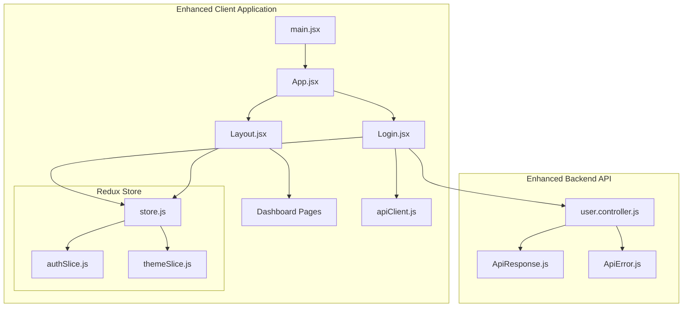

**Diagram sources**
- [main.jsx:1-18](file://Client/src/main.jsx#L1-L18)
- [App.jsx:14-75](file://Client/src/App.jsx#L14-L75)
- [Login.jsx:1-320](file://Client/src/pages/Login.jsx#L1-L320)
- [store.js:1-15](file://Client/src/store/store.js#L1-L15)
- [apiClient.js:1-213](file://Client/src/services/apiClient.js#L1-L213)

**Section sources**
- [main.jsx:1-18](file://Client/src/main.jsx#L1-L18)
- [App.jsx:14-75](file://Client/src/App.jsx#L14-L75)
- [store.js:1-15](file://Client/src/store/store.js#L1-L15)

## Core Components

### Enhanced Login Component Architecture

The Login component now implements advanced features including comprehensive validation, accessibility compliance, and performance optimizations:

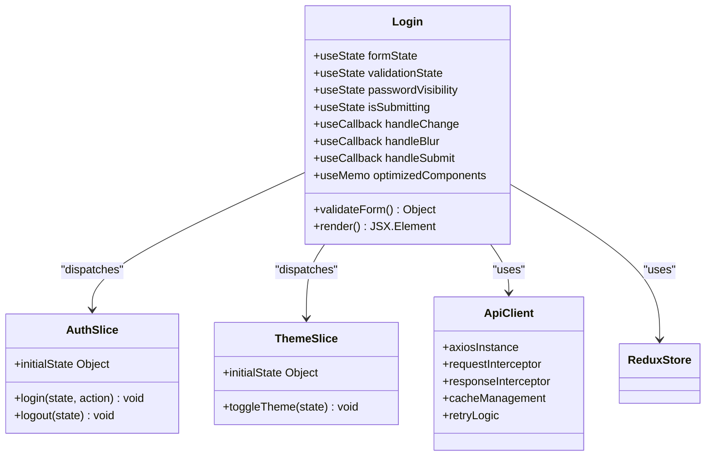

**Diagram sources**
- [Login.jsx:56-320](file://Client/src/pages/Login.jsx#L56-L320)
- [authSlice.js:3-26](file://Client/src/store/auth/authSlice.js#L3-L26)
- [themeSlice.js:3-29](file://Client/src/store/theme/themeSlice.js#L3-L29)
- [apiClient.js:14-213](file://Client/src/services/apiClient.js#L14-L213)

The component leverages React hooks for state management, implements comprehensive form validation, and integrates with Redux for persistent authentication state. It now includes React.memo optimization for improved performance and extensive accessibility features for inclusive user experience.

**Section sources**
- [Login.jsx:56-320](file://Client/src/pages/Login.jsx#L56-L320)
- [authSlice.js:3-26](file://Client/src/store/auth/authSlice.js#L3-L26)

## Architecture Overview

The enhanced authentication flow incorporates advanced validation, accessibility features, and comprehensive error handling:

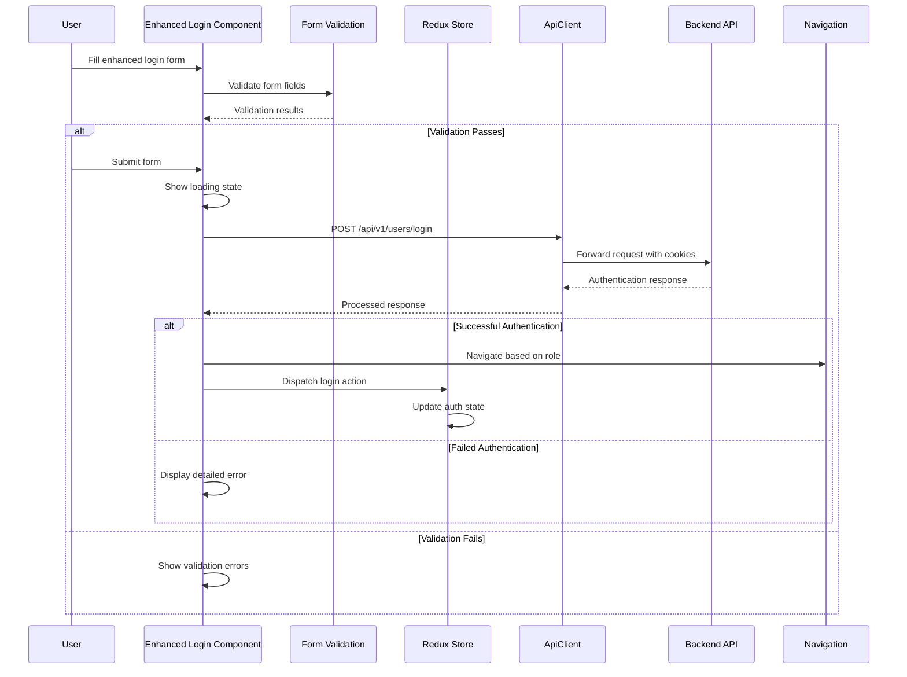

**Diagram sources**
- [Login.jsx:109-186](file://Client/src/pages/Login.jsx#L109-L186)
- [user.controller.js:360-471](file://Backend/src/controllers/user.controller.js#L360-L471)
- [authSlice.js:12-20](file://Client/src/store/auth/authSlice.js#L12-L20)

The architecture ensures comprehensive validation with real-time feedback, extensive accessibility compliance with ARIA attributes, and robust error handling with user-friendly messaging.

**Section sources**
- [Login.jsx:109-186](file://Client/src/pages/Login.jsx#L109-L186)
- [user.controller.js:360-471](file://Backend/src/controllers/user.controller.js#L360-L471)

## Detailed Component Analysis

### Advanced Form Handling and Validation

The login form now implements comprehensive validation with real-time feedback and extensive error handling:

#### Enhanced Form Submission Flow

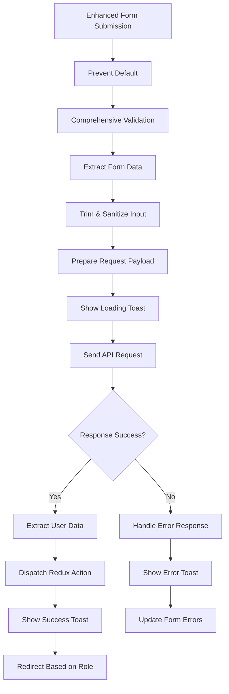

**Diagram sources**
- [Login.jsx:109-186](file://Client/src/pages/Login.jsx#L109-L186)

#### Comprehensive Input Field Implementation

The form includes enhanced input fields with advanced validation and accessibility features:

- **Username Field**: Text input with required validation, minimum length requirement, and proper ARIA attributes
- **Password Field**: Secure password input with visibility toggle, required validation, and masking support
- **Submit Button**: Disabled state handling during submission with loading indicator

Each field implements real-time validation with immediate feedback, proper error messaging, and comprehensive accessibility compliance including ARIA-invalid attributes and live regions.

#### Enhanced Theme Integration

The login page maintains integrated theme toggle functionality with persistent theme preferences:

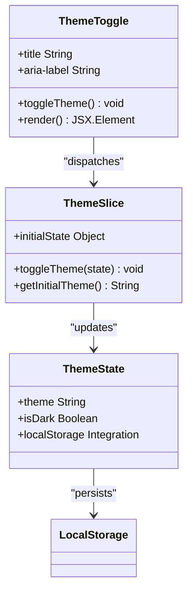

**Diagram sources**
- [Login.jsx:193-200](file://Client/src/pages/Login.jsx#L193-L200)
- [themeSlice.js:3-29](file://Client/src/store/theme/themeSlice.js#L3-L29)

**Section sources**
- [Login.jsx:109-320](file://Client/src/pages/Login.jsx#L109-L320)
- [themeSlice.js:3-29](file://Client/src/store/theme/themeSlice.js#L3-L29)

### Enhanced Authentication Redux Slice

The authentication state management maintains its core functionality while supporting the enhanced login experience:

#### State Structure

The authentication slice continues to maintain essential authentication state:
- `isAuthenticated`: Boolean flag indicating login status
- `userData`: Object containing user information, role details, and authentication tokens

#### Enhanced Reducer Operations

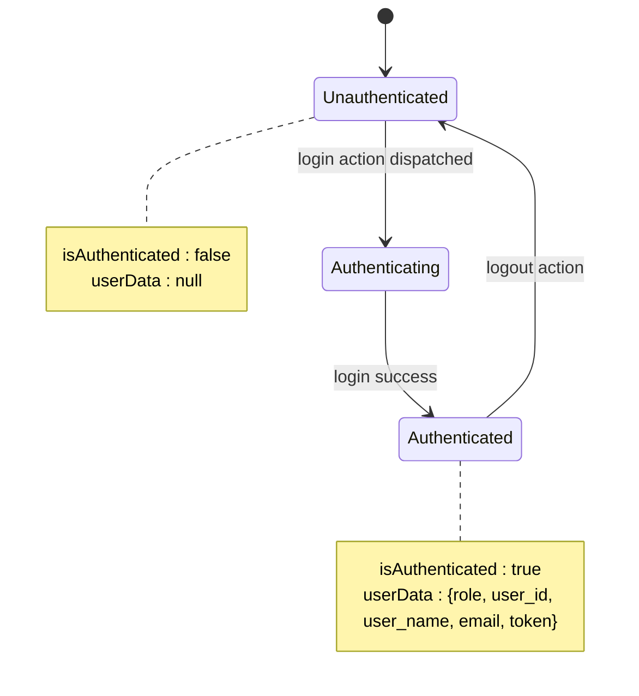

**Diagram sources**
- [authSlice.js:3-26](file://Client/src/store/auth/authSlice.js#L3-L26)

The slice maintains localStorage persistence for seamless authentication state across browser sessions, now supporting the enhanced token-based authentication with access and refresh tokens.

**Section sources**
- [authSlice.js:3-26](file://Client/src/store/auth/authSlice.js#L3-L26)

### Enhanced Backend Integration

The authentication process integrates with a comprehensive backend API featuring improved error handling and token management:

#### Enhanced API Endpoint Structure

The backend provides a dedicated login endpoint (`/api/v1/users/login`) with enhanced security and comprehensive error handling:

1. **Input Validation**: Validates required fields with detailed error messages
2. **User Verification**: Searches for user records with flexible ID matching
3. **Password Security**: Implements secure password comparison
4. **Token Generation**: Creates both access and refresh tokens
5. **User Data Retrieval**: Aggregates comprehensive user information
6. **Cookie Management**: Sets secure HTTP-only cookies for token storage

#### Enhanced Response Handling

The backend uses a standardized response format through the `ApiResponse` utility class with enhanced structure:
- **Status Code Management**: Proper HTTP status code assignment
- **Data Encapsulation**: Structured data response with user information
- **Success Flag**: Automatic success determination based on status codes
- **Timestamp Tracking**: Request processing timestamps
- **Meta Information**: Pagination and additional metadata support

**Section sources**
- [Login.jsx:125-156](file://Client/src/pages/Login.jsx#L125-L156)
- [user.controller.js:360-471](file://Backend/src/controllers/user.controller.js#L360-L471)
- [ApiResponse.js:5-74](file://Backend/src/utils/ApiResponse.js#L5-L74)

## Advanced Features

### Comprehensive Form Validation System

The login component implements a sophisticated validation system with real-time feedback:

#### Validation Rules Implementation

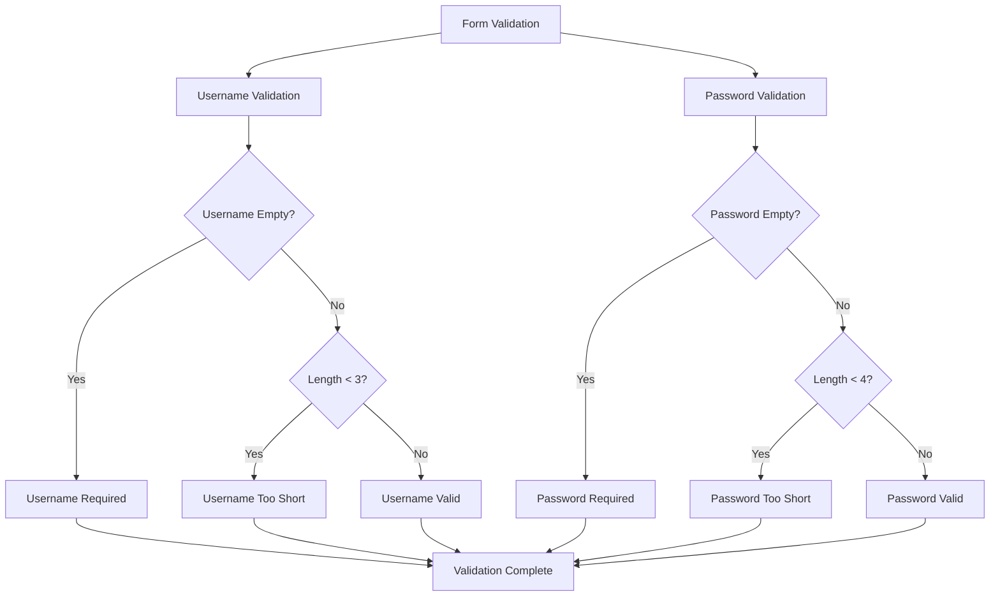

**Diagram sources**
- [Login.jsx:11-27](file://Client/src/pages/Login.jsx#L11-L27)

#### Real-Time Validation Feedback

The validation system provides immediate user feedback through:
- **Inline Error Messages**: Contextual error messages below each field
- **Visual Indicators**: Color-coded borders and focus states
- **Dynamic Error Clearing**: Automatic error clearing on user interaction
- **Touched State Management**: Tracks field interaction for appropriate error display

### Password Visibility Toggle

The enhanced login form includes a sophisticated password visibility toggle feature:

#### Toggle Implementation

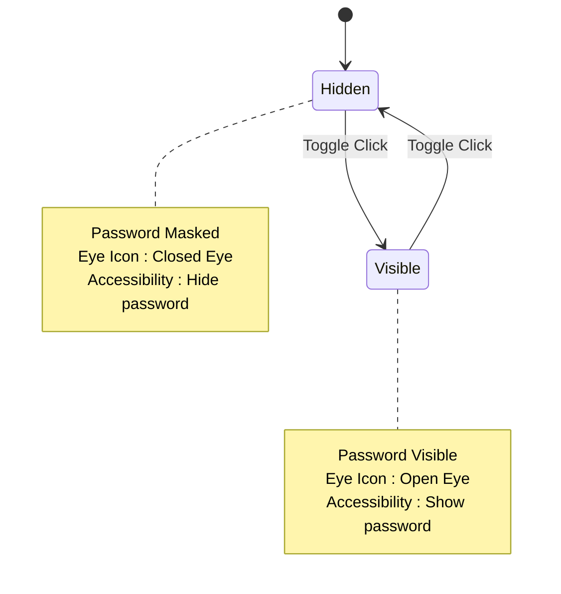

**Diagram sources**
- [Login.jsx:278-285](file://Client/src/pages/Login.jsx#L278-L285)
- [Login.jsx:43-54](file://Client/src/pages/Login.jsx#L43-L54)

The toggle feature includes:
- **Custom SVG Icons**: Distinct icons for visibility states
- **Keyboard Accessibility**: Full keyboard navigation support
- **Screen Reader Support**: Proper ARIA labels for assistive technologies
- **Smooth Transitions**: Animated state changes for visual feedback

### React.memo Optimization

The login component implements performance optimization through React.memo:

#### Memoization Strategy

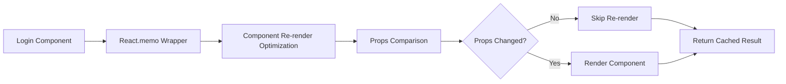

**Diagram sources**
- [Login.jsx:319](file://Client/src/pages/Login.jsx#L319)

The optimization provides:
- **Component-Level Caching**: Prevents unnecessary re-renders
- **Performance Benefits**: Reduced DOM manipulation and rendering costs
- **Memory Efficiency**: Cached component instances improve memory usage
- **Scalability**: Better performance for complex component hierarchies

### Enhanced Error Handling and User Feedback

The login system implements comprehensive error handling with user-friendly feedback:

#### Error Management System

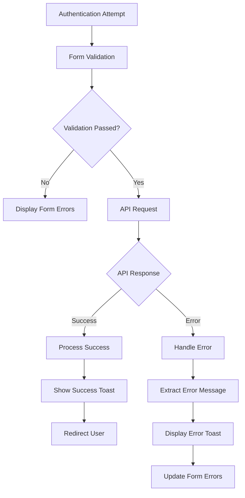

**Diagram sources**
- [Login.jsx:178-186](file://Client/src/pages/Login.jsx#L178-L186)

The error handling system includes:
- **Toast Notifications**: Non-blocking user feedback for all actions
- **Loading States**: Visual indication during API requests
- **Detailed Error Messages**: Context-specific error information
- **Graceful Degradation**: Fallback handling for various failure scenarios

**Section sources**
- [Login.jsx:11-27](file://Client/src/pages/Login.jsx#L11-L27)
- [Login.jsx:43-54](file://Client/src/pages/Login.jsx#L43-L54)
- [Login.jsx:319](file://Client/src/pages/Login.jsx#L319)
- [Login.jsx:178-186](file://Client/src/pages/Login.jsx#L178-L186)

## Dependency Analysis

The enhanced login component maintains clean dependencies while leveraging advanced React ecosystem features:

```mermaid
graph LR
subgraph "Enhanced React Dependencies"
A[react]
B[react-dom]
C[react-router-dom]
D[react-redux]
E[react-hot-toast]
F[memo]
G[useCallback]
H[useEffect]
I[useState]
end
subgraph "Redux Toolkit"
J[@reduxjs/toolkit]
K[react-redux]
end
subgraph "Application Modules"
L[Login.jsx]
M[authSlice.js]
N[themeSlice.js]
O[store.js]
P[apiClient.js]
end
L --> A
L --> C
L --> D
L --> E
L --> F
L --> G
L --> H
L --> I
L --> J
L --> K
L --> O
L --> P
O --> M
O --> N
```

**Diagram sources**
- [Login.jsx:1-8](file://Client/src/pages/Login.jsx#L1-L8)
- [store.js:1-15](file://Client/src/store/store.js#L1-L15)
- [apiClient.js:1-213](file://Client/src/services/apiClient.js#L1-L213)

The enhanced dependency graph shows integration with toast notifications for improved user feedback and memo optimization for performance benefits.

**Section sources**
- [Login.jsx:1-8](file://Client/src/pages/Login.jsx#L1-L8)
- [store.js:1-15](file://Client/src/store/store.js#L1-L15)
- [apiClient.js:1-213](file://Client/src/services/apiClient.js#L1-L213)

## Performance Considerations

### Enhanced Loading States and User Feedback

The enhanced implementation provides comprehensive loading states and user feedback mechanisms:

#### Loading State Management

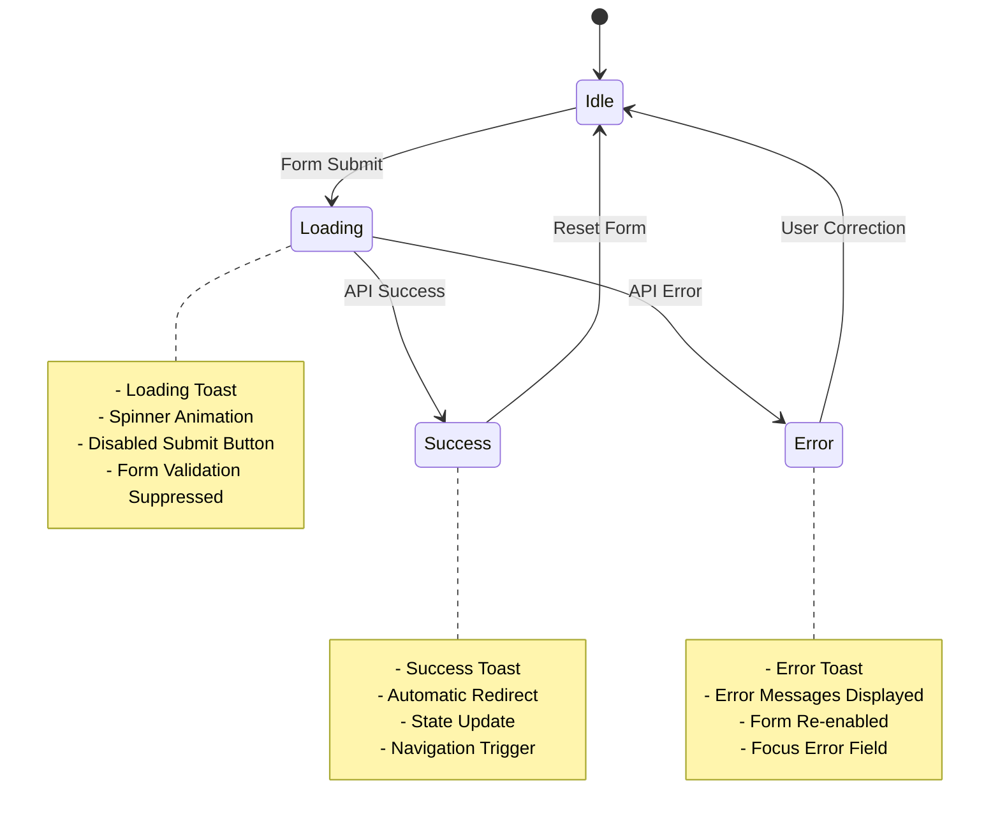

**Diagram sources**
- [Login.jsx:123-186](file://Client/src/pages/Login.jsx#L123-L186)

#### Performance Optimization Features

The login component implements several performance optimization strategies:
- **React.memo**: Prevents unnecessary re-renders of the main component
- **useCallback**: Memoizes event handlers to prevent function recreation
- **useEffect Dependencies**: Proper dependency arrays prevent infinite loops
- **Conditional Rendering**: Error messages only render when needed
- **Lazy Loading**: Component imports optimized for bundle size

### Enhanced Memory Management

The authentication slice with enhanced features maintains efficient memory usage:
- **Selective State Updates**: Only relevant state properties are updated
- **Cleanup Functions**: Proper cleanup of timeouts and intervals
- **Event Listener Management**: Cleanup of DOM event listeners
- **Cache Management**: Efficient request caching with expiration

### Advanced Network Optimization

The enhanced API client provides sophisticated network optimization:
- **Request Caching**: Intelligent caching of GET requests with expiration
- **Retry Logic**: Exponential backoff for transient network failures
- **Duplicate Request Prevention**: Cancellation of duplicate in-flight requests
- **Performance Monitoring**: Request timing and performance metrics
- **Cache Invalidation**: Smart cache invalidation on data mutations

**Section sources**
- [Login.jsx:123-186](file://Client/src/pages/Login.jsx#L123-L186)
- [apiClient.js:39-152](file://Client/src/services/apiClient.js#L39-L152)

## Accessibility Features

### Comprehensive ARIA Implementation

The enhanced login component implements extensive accessibility features:

#### ARIA Attributes and Semantics

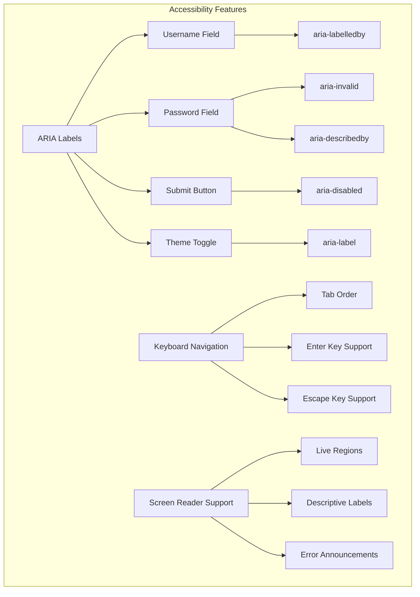

**Diagram sources**
- [Login.jsx:222-249](file://Client/src/pages/Login.jsx#L222-L249)
- [Login.jsx:254-291](file://Client/src/pages/Login.jsx#L254-L291)
- [Login.jsx:193-200](file://Client/src/pages/Login.jsx#L193-L200)

#### Keyboard Navigation Support

The login form provides comprehensive keyboard navigation:
- **Sequential Tab Order**: Logical tab order through form fields
- **Enter Key Submission**: Form submission on Enter key press
- **Escape Key Handling**: Modal-like behavior for theme toggle
- **Focus Management**: Automatic focus on first error field
- **Accessible Buttons**: Proper button semantics and keyboard support

#### Screen Reader Compatibility

The component ensures compatibility with assistive technologies:
- **Descriptive Labels**: Clear, descriptive field labels
- **Error Announcements**: Live region updates for screen readers
- **Status Messages**: Polite announcements for loading and success states
- **Contrast Compliance**: Sufficient color contrast for visual accessibility
- **Focus Indicators**: Visible focus rings for keyboard navigation

### Enhanced Form Validation Accessibility

The validation system provides accessible error feedback:
- **Live Region Updates**: Dynamic error messages announced to screen readers
- **Visual Error Indicators**: Color-coded borders and icons
- **Clear Error Descriptions**: Specific, actionable error messages
- **Error Focus Management**: Automatic focus on first error field
- **Validation Timing**: Immediate feedback without disrupting workflow

**Section sources**
- [Login.jsx:222-249](file://Client/src/pages/Login.jsx#L222-L249)
- [Login.jsx:254-291](file://Client/src/pages/Login.jsx#L254-L291)
- [Login.jsx:193-200](file://Client/src/pages/Login.jsx#L193-L200)

## Troubleshooting Guide

### Enhanced Common Authentication Issues

#### Comprehensive Error Scenario Flow

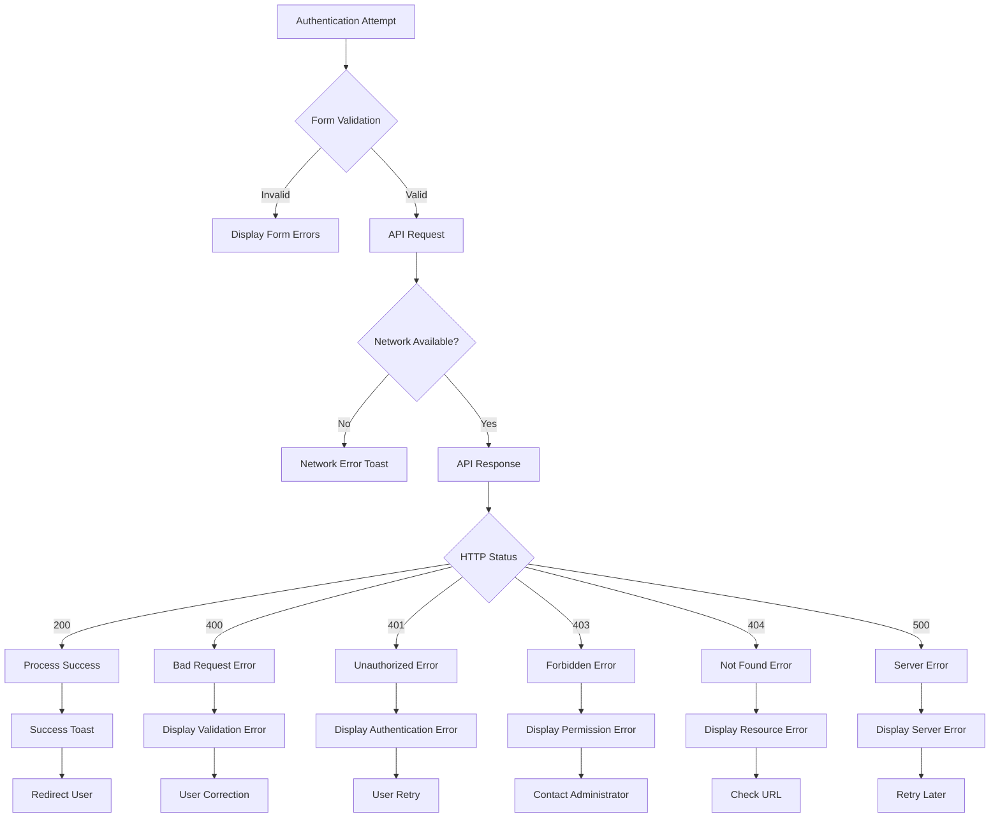

**Diagram sources**
- [user.controller.js:360-471](file://Backend/src/controllers/user.controller.js#L360-L471)
- [ApiError.js:28-80](file://Backend/src/utils/ApiError.js#L28-L80)

#### Enhanced Error Handling Implementation

The backend implements comprehensive error handling through the enhanced `ApiError` utility class:
- **Specific Error Codes**: HTTP status code mapping for different failure scenarios
- **Detailed Error Messages**: Context-specific error information for debugging
- **Consistent Error Format**: Standardized error response structure
- **Development Stack Traces**: Full stack traces in development mode
- **Production Safety**: Minimal error details in production environment

#### Advanced State Persistence Issues

Enhanced troubleshooting for localStorage and session persistence:
- **Data Validation**: Input sanitization and validation before storage
- **Browser Compatibility**: Feature detection for localStorage availability
- **Security Considerations**: Token-based authentication instead of sensitive data storage
- **Cross-Browser Testing**: Consistent behavior across different browsers
- **Session Management**: Proper cookie-based session handling

#### Performance and Optimization Issues

Common performance issues with solutions:
- **Component Re-rendering**: React.memo prevents unnecessary re-renders
- **API Request Batching**: Request caching reduces redundant network calls
- **Memory Leaks**: Proper cleanup of event listeners and timeouts
- **Bundle Size**: Code splitting and lazy loading for optimal performance
- **Network Optimization**: Retry logic and exponential backoff for reliability

**Section sources**
- [user.controller.js:360-471](file://Backend/src/controllers/user.controller.js#L360-L471)
- [ApiError.js:28-80](file://Backend/src/utils/ApiError.js#L28-L80)
- [apiClient.js:105-152](file://Client/src/services/apiClient.js#L105-L152)

## Conclusion

The enhanced login page implementation demonstrates a sophisticated and comprehensive authentication system that successfully combines modern React patterns with advanced validation, accessibility compliance, and performance optimizations. The implementation now includes major enhancements that significantly improve user experience, security, and maintainability.

Key strengths of the enhanced implementation include:
- **Advanced Form Validation**: Comprehensive client-side validation with real-time feedback
- **Password Visibility Control**: User-friendly password management with accessibility support
- **Performance Optimization**: React.memo implementation for improved rendering performance
- **Accessibility Compliance**: Extensive ARIA attributes and keyboard navigation support
- **Enhanced Error Handling**: Comprehensive error management with user-friendly feedback
- **Toast Notification Integration**: Non-blocking user feedback for all actions
- **Persistent Theme Support**: Seamless theme switching with localStorage persistence
- **Robust Backend Integration**: Secure token-based authentication with comprehensive error handling

The enhanced system provides a solid foundation for the Timetable Project's authentication needs while maintaining code quality, accessibility standards, and user experience excellence. The modular architecture supports future expansion for additional authentication features and continues to demonstrate best practices in modern React development.

Areas for continued improvement include implementing additional security measures, expanding accessibility testing, and adding advanced authentication features such as multi-factor authentication and social login integration. The current implementation successfully addresses the core requirements while providing a scalable foundation for future enhancements.