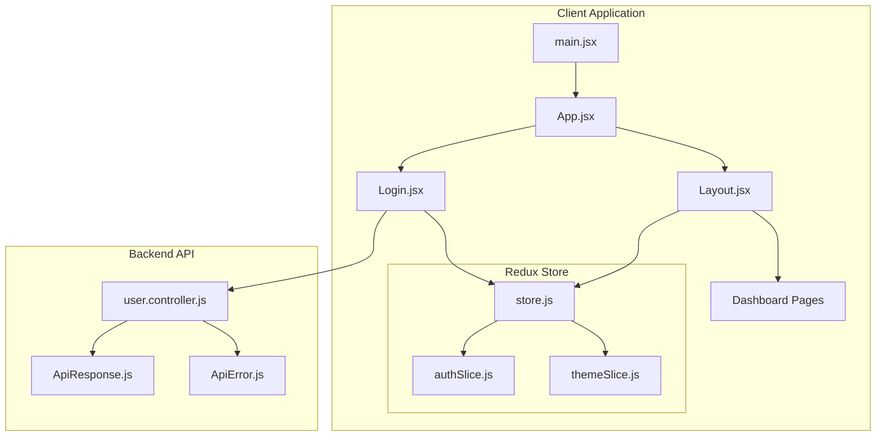
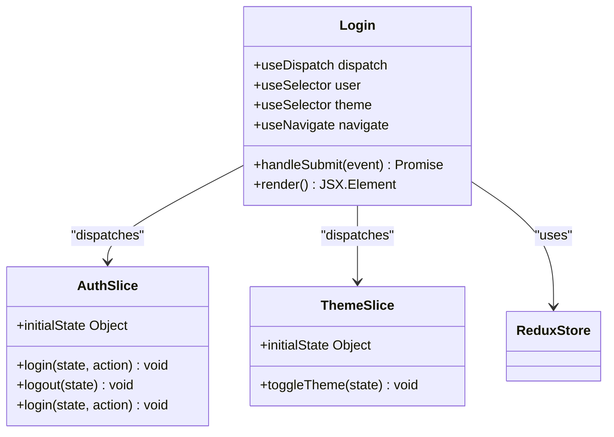
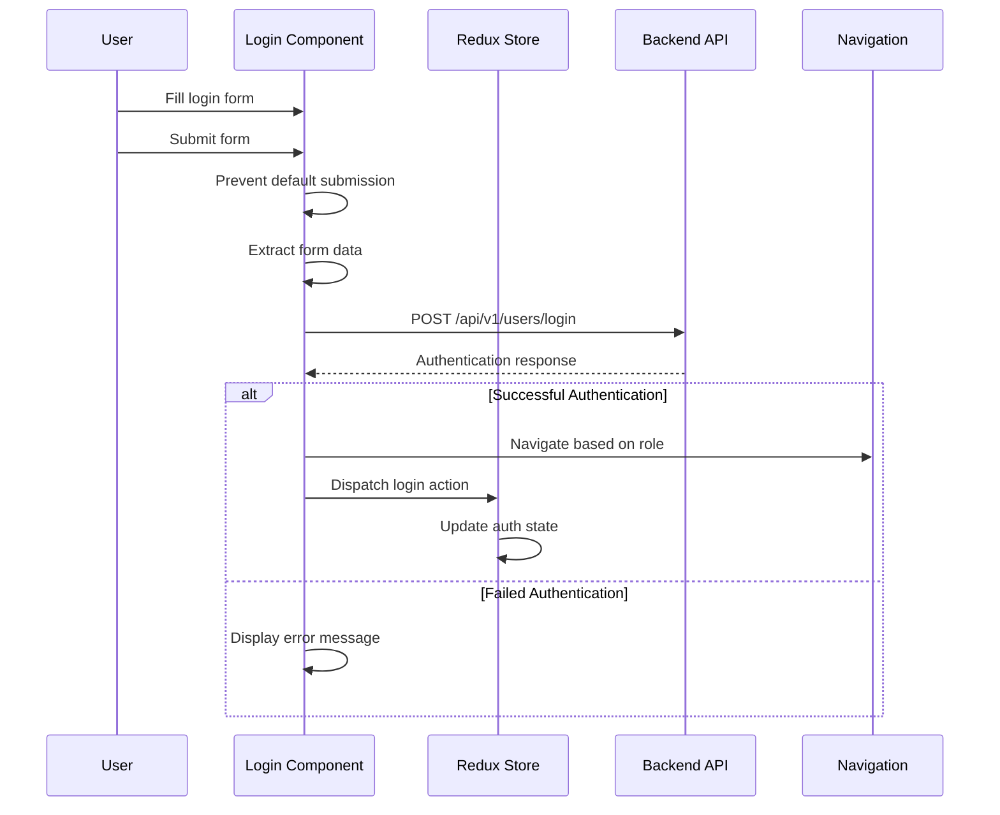
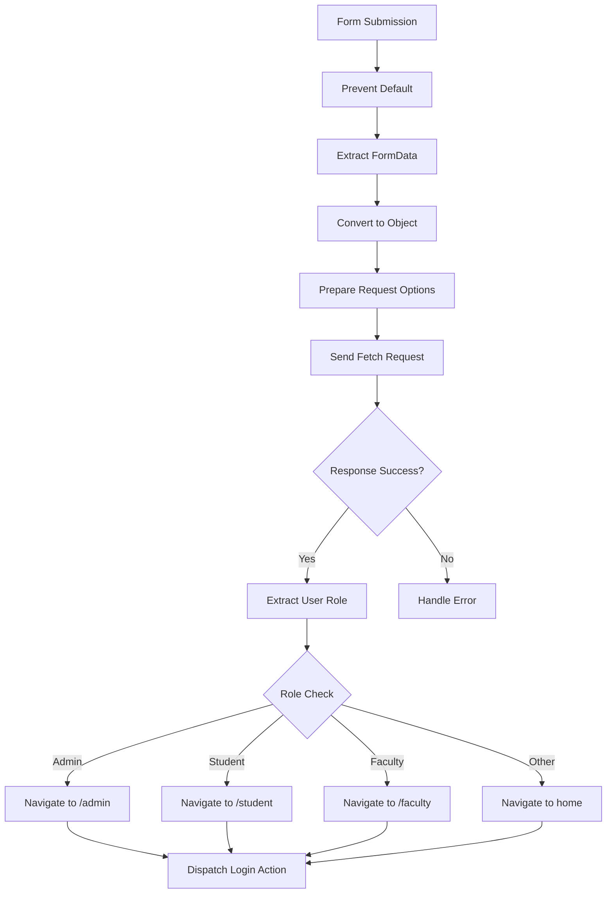
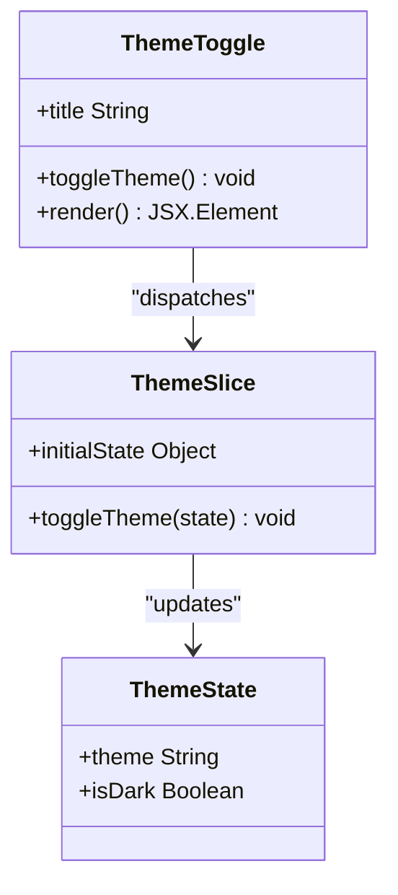
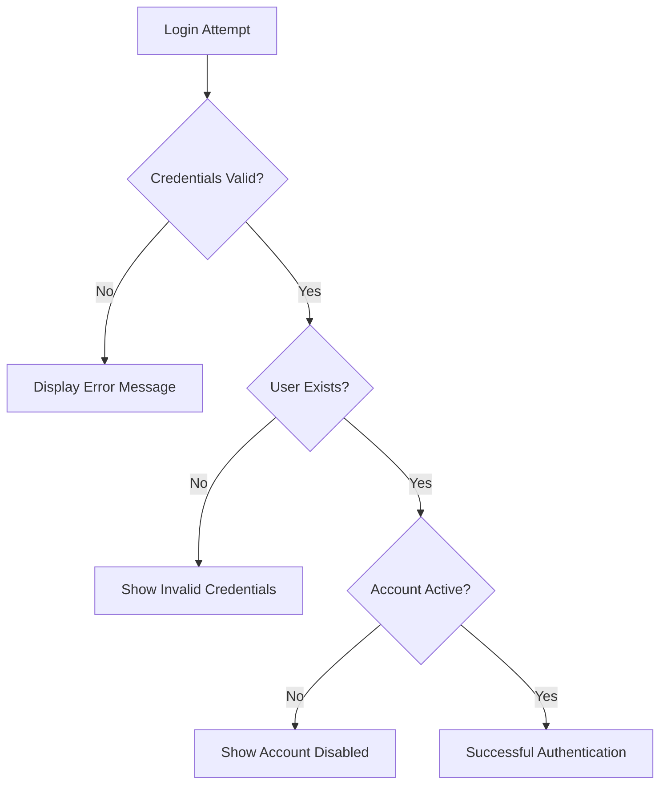

# Login Page Implementation

<cite>
**Referenced Files in This Document**
- [Login.jsx](file://Client/src/pages/Login.jsx)
- [authSlice.js](file://Client/src/store/auth/authSlice.js)
- [store.js](file://Client/src/store/store.js)
- [themeSlice.js](file://Client/src/store/theme/themeSlice.js)
- [App.jsx](file://Client/src/App.jsx)
- [main.jsx](file://Client/src/main.jsx)
- [Container.jsx](file://Client/src/components/Container.jsx)
- [Layout.jsx](file://Client/src/components/Layout.jsx)
- [user.controller.js](file://Backend/src/controllers/user.controller.js)
- [ApiResponse.js](file://Backend/src/utils/ApiResponse.js)
- [ApiError.js](file://Backend/src/utils/ApiError.js)
</cite>

## Table of Contents
1. [Introduction](#introduction)
2. [Project Structure](#project-structure)
3. [Core Components](#core-components)
4. [Architecture Overview](#architecture-overview)
5. [Detailed Component Analysis](#detailed-component-analysis)
6. [Dependency Analysis](#dependency-analysis)
7. [Performance Considerations](#performance-considerations)
8. [Troubleshooting Guide](#troubleshooting-guide)
9. [Conclusion](#conclusion)

## Introduction

The login page implementation in the Timetable Project demonstrates a modern React-based authentication system that integrates seamlessly with a MongoDB backend. This documentation provides comprehensive coverage of the login page component structure, form handling mechanisms, input validation strategies, and the complete authentication flow from user interaction to successful authentication.

The implementation follows React best practices with Redux Toolkit for state management, showcasing proper separation of concerns between UI presentation, business logic, and data persistence. The system supports role-based navigation with automatic redirection based on user roles (admin, student, faculty).

## Project Structure

The login functionality is organized within a well-structured React application architecture:



**Diagram sources**
- [main.jsx:1-18](file://Client/src/main.jsx#L1-L18)
- [App.jsx:13-41](file://Client/src/App.jsx#L13-L41)
- [Login.jsx:9-116](file://Client/src/pages/Login.jsx#L9-L116)
- [store.js:1-15](file://Client/src/store/store.js#L1-L15)

**Section sources**
- [main.jsx:1-18](file://Client/src/main.jsx#L1-L18)
- [App.jsx:13-41](file://Client/src/App.jsx#L13-L41)
- [store.js:1-15](file://Client/src/store/store.js#L1-L15)

## Core Components

### Login Component Architecture

The Login component serves as the primary authentication interface, implementing a clean and accessible form-based approach:



**Diagram sources**
- [Login.jsx:9-116](file://Client/src/pages/Login.jsx#L9-L116)
- [authSlice.js:10-32](file://Client/src/store/auth/authSlice.js#L10-L32)
- [themeSlice.js:15-29](file://Client/src/store/theme/themeSlice.js#L15-L29)

The component utilizes React hooks for state management and integrates with Redux for persistent authentication state. It implements a form submission handler that processes user credentials and manages navigation based on role-based permissions.

**Section sources**
- [Login.jsx:9-116](file://Client/src/pages/Login.jsx#L9-L116)
- [authSlice.js:10-32](file://Client/src/store/auth/authSlice.js#L10-L32)

## Architecture Overview

The authentication flow follows a structured sequence from user interaction to backend validation and state management:



**Diagram sources**
- [Login.jsx:15-45](file://Client/src/pages/Login.jsx#L15-L45)
- [user.controller.js:280-354](file://Backend/src/controllers/user.controller.js#L280-L354)
- [authSlice.js:14-25](file://Client/src/store/auth/authSlice.js#L14-L25)

The architecture ensures proper separation of concerns with the frontend handling user interface and form validation, while the backend manages credential verification and user data retrieval.

**Section sources**
- [Login.jsx:15-45](file://Client/src/pages/Login.jsx#L15-L45)
- [user.controller.js:280-354](file://Backend/src/controllers/user.controller.js#L280-L354)

## Detailed Component Analysis

### Form Handling and Validation

The login form implements comprehensive validation and user interaction patterns:

#### Form Submission Flow



**Diagram sources**
- [Login.jsx:15-45](file://Client/src/pages/Login.jsx#L15-L45)

#### Input Field Implementation

The form includes two primary input fields with accessibility features:

- **Username Field**: Text input with required validation and proper labeling
- **Password Field**: Secure password input with required validation and masking

Both fields utilize Tailwind CSS classes for consistent styling and responsive design, with focus states for keyboard navigation support.

#### Theme Integration

The login page includes an integrated theme toggle mechanism that allows users to switch between light and dark modes:



**Diagram sources**
- [Login.jsx:50-64](file://Client/src/pages/Login.jsx#L50-L64)
- [themeSlice.js:19-22](file://Client/src/store/theme/themeSlice.js#L19-L22)

**Section sources**
- [Login.jsx:15-116](file://Client/src/pages/Login.jsx#L15-L116)
- [themeSlice.js:19-22](file://Client/src/store/theme/themeSlice.js#L19-L22)

### Authentication Redux Slice

The authentication state management follows Redux Toolkit best practices:

#### State Structure

The authentication slice maintains two critical pieces of information:
- `isAuthenticated`: Boolean flag indicating login status
- `userData`: Object containing user information and role details

#### Reducer Operations


**Diagram sources**
- [authSlice.js:3-8](file://Client/src/store/auth/authSlice.js#L3-L8)
- [authSlice.js:14-25](file://Client/src/store/auth/authSlice.js#L14-L25)

The slice implements localStorage persistence to maintain authentication state across browser sessions, ensuring a seamless user experience.

**Section sources**
- [authSlice.js:1-32](file://Client/src/store/auth/authSlice.js#L1-L32)

### Backend Integration

The authentication process integrates with a comprehensive backend API:

#### API Endpoint Structure

The backend provides a dedicated login endpoint (`/api/v1/users/login`) that handles credential validation and user data retrieval. The endpoint performs the following operations:

1. Validates required fields (user_id, password)
2. Searches for user records in the database
3. Verifies password credentials
4. Retrieves user details based on role
5. Returns structured response with user information

#### Response Handling

The backend uses a standardized response format through the `ApiResponse` utility class, which provides:
- Status code management
- Data encapsulation
- Success flag based on HTTP status codes
- Consistent error messaging

**Section sources**
- [Login.jsx:23-34](file://Client/src/pages/Login.jsx#L23-L34)
- [user.controller.js:280-354](file://Backend/src/controllers/user.controller.js#L280-L354)
- [ApiResponse.js:1-10](file://Backend/src/utils/ApiResponse.js#L1-L10)

## Dependency Analysis

The login component maintains minimal external dependencies while leveraging React ecosystem best practices:

```mermaid
graph LR
subgraph "React Dependencies"
A[react]
B[react-dom]
C[react-router-dom]
D[react-redux]
end
subgraph "Redux Toolkit"
E[@reduxjs/toolkit]
F[react-redux]
end
subgraph "Application Modules"
G[Login.jsx]
H[authSlice.js]
I[themeSlice.js]
J[store.js]
end
G --> A
G --> C
G --> D
G --> E
G --> F
G --> J
J --> H
J --> I
```

**Diagram sources**
- [Login.jsx:1-8](file://Client/src/pages/Login.jsx#L1-L8)
- [store.js:1-15](file://Client/src/store/store.js#L1-L15)

The dependency graph shows a clean separation between React framework dependencies and application-specific modules, facilitating maintainability and testing.

**Section sources**
- [Login.jsx:1-8](file://Client/src/pages/Login.jsx#L1-L8)
- [store.js:1-15](file://Client/src/store/store.js#L1-L15)

## Performance Considerations

### Loading States and User Feedback

The current implementation focuses on immediate feedback through navigation and state updates. Consider implementing additional loading indicators:

- **Form Submission Loading**: Display spinner during API requests
- **Error State Management**: Provide clear error messages for failed attempts
- **Debounced Requests**: Implement request throttling to prevent multiple submissions

### Memory Management

The authentication slice uses localStorage for persistence, which:
- Maintains state across browser sessions
- Reduces memory overhead compared to in-memory storage
- Requires careful cleanup on logout

### Network Optimization

Consider implementing:
- Request caching for repeated login attempts
- Timeout handling for network failures
- Retry mechanisms for transient errors

## Troubleshooting Guide

### Common Authentication Issues

#### Login Failure Scenarios



**Diagram sources**
- [user.controller.js:348-350](file://Backend/src/controllers/user.controller.js#L348-L350)

#### Error Handling Implementation

The backend implements comprehensive error handling through the `ApiError` utility class, providing:
- Specific error codes for different failure scenarios
- Detailed error messages for debugging
- Consistent error response format

#### State Persistence Issues

Common issues with localStorage persistence:
- **Data Corruption**: Validate stored data before parsing
- **Browser Compatibility**: Check for localStorage availability
- **Security Concerns**: Consider encryption for sensitive data

**Section sources**
- [user.controller.js:348-350](file://Backend/src/controllers/user.controller.js#L348-L350)
- [ApiError.js:1-21](file://Backend/src/utils/ApiError.js#L1-L21)

## Conclusion

The login page implementation demonstrates a robust and scalable authentication system that effectively combines modern React patterns with comprehensive Redux state management. The implementation successfully addresses key requirements including form handling, input validation, role-based navigation, and responsive design considerations.

Key strengths of the implementation include:
- Clean separation of concerns between UI and state management
- Comprehensive error handling and user feedback mechanisms
- Responsive design with accessibility considerations
- Role-based navigation supporting multiple user types
- Persistent authentication state across browser sessions

Areas for potential enhancement include implementing loading states, improving error handling granularity, and adding form validation feedback. The modular architecture supports future expansion for additional authentication features such as multi-factor authentication, social login integration, and enhanced security measures.

The system provides a solid foundation for the Timetable Project's authentication needs while maintaining code quality, maintainability, and user experience standards.