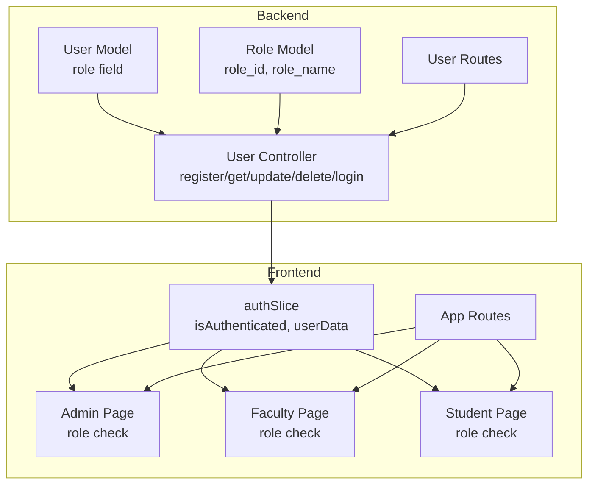
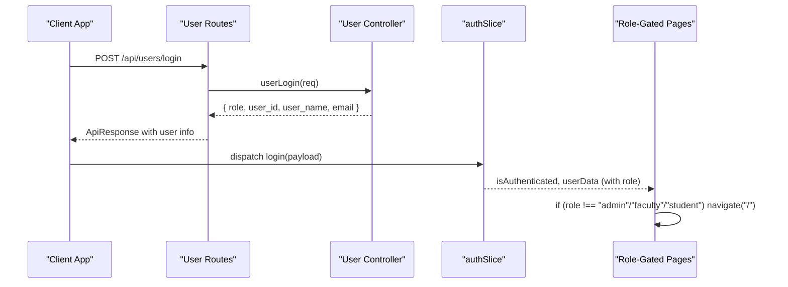
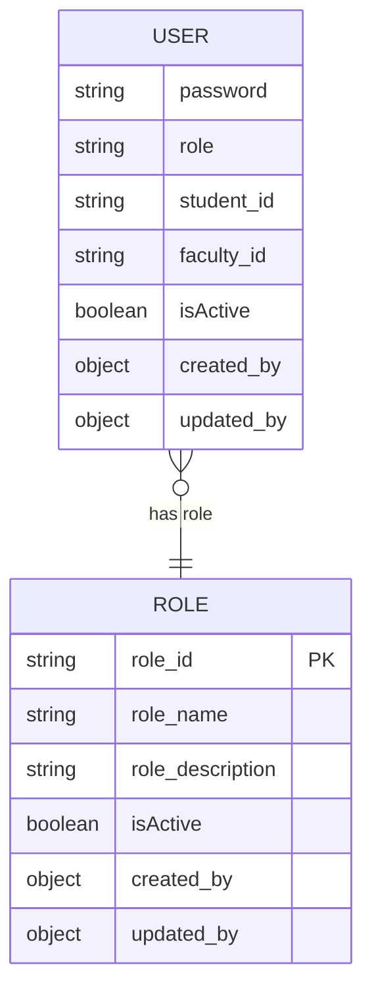
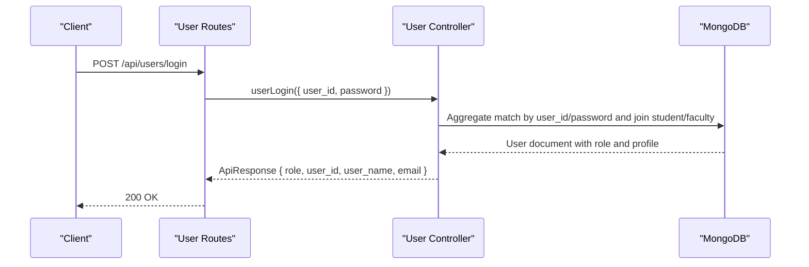
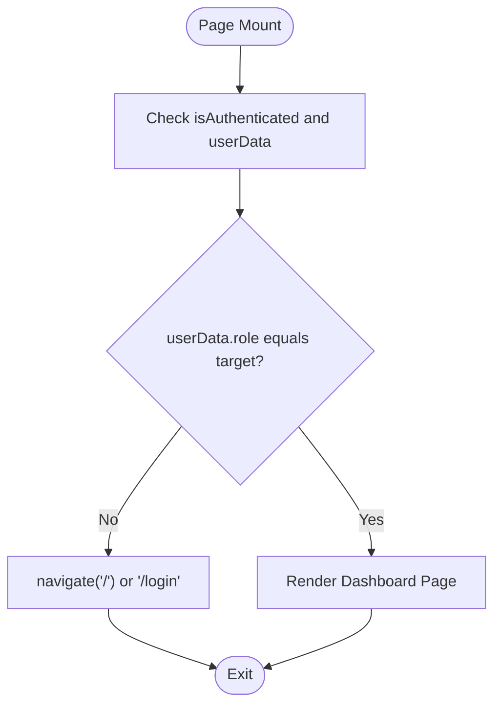
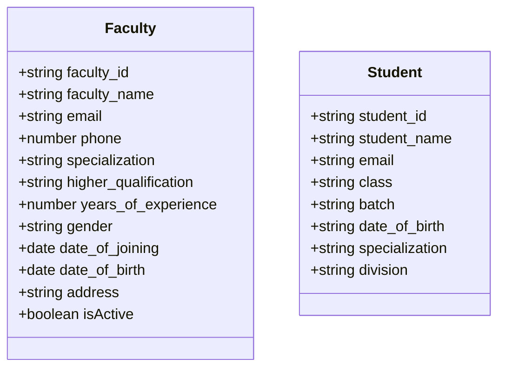
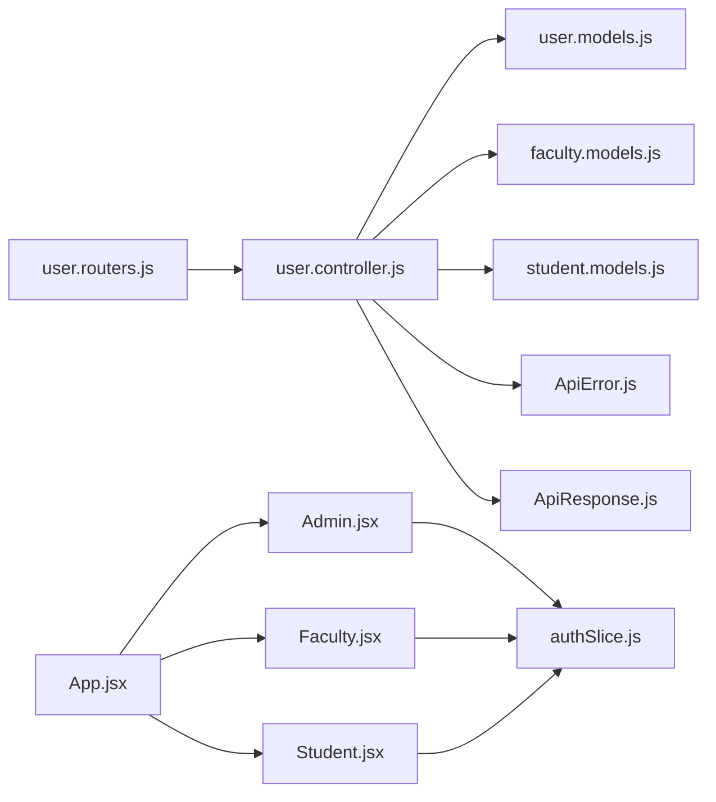

# Role-Based Access Control

<cite>
**Referenced Files in This Document**
- [role.models.js](file://Backend/src/models/role.models.js)
- [user.models.js](file://Backend/src/models/user.models.js)
- [user.controller.js](file://Backend/src/controllers/user.controller.js)
- [user.routers.js](file://Backend/src/routes/user.routers.js)
- [faculty.conteoller.js](file://Backend/src/controllers/faculty.conteoller.js)
- [student.controller.js](file://Backend/src/controllers/student.controller.js)
- [faculty.models.js](file://Backend/src/models/faculty.models.js)
- [student.models.js](file://Backend/src/models/student.models.js)
- [authSlice.js](file://Client/src/store/auth/authSlice.js)
- [Admin.jsx](file://Client/src/pages/dashboard/Admin.jsx)
- [Faculty.jsx](file://Client/src/pages/dashboard/Faculty.jsx)
- [Student.jsx](file://Client/src/pages/dashboard/Student.jsx)
- [App.jsx](file://Client/src/App.jsx)
- [main.jsx](file://Client/src/main.jsx)
- [ApiError.js](file://Backend/src/utils/ApiError.js)
- [ApiResponse.js](file://Backend/src/utils/ApiResponse.js)
</cite>

## Table of Contents
1. [Introduction](#introduction)
2. [Project Structure](#project-structure)
3. [Core Components](#core-components)
4. [Architecture Overview](#architecture-overview)
5. [Detailed Component Analysis](#detailed-component-analysis)
6. [Dependency Analysis](#dependency-analysis)
7. [Performance Considerations](#performance-considerations)
8. [Troubleshooting Guide](#troubleshooting-guide)
9. [Conclusion](#conclusion)
10. [Appendices](#appendices)

## Introduction
This document explains the role-based access control (RBAC) system implemented in the timetable management application. It covers the role hierarchy, assignment and validation mechanisms, backend controller and route-level checks, frontend role-based routing and UI visibility, integration between user and role models, and practical examples of role-based API access and dashboard navigation. Security considerations and best practices for role management are also included.

## Project Structure
The RBAC system spans both backend and frontend:
- Backend defines user roles and integrates them with user identity and authentication flows. Controllers expose endpoints for user registration, retrieval, updates, deletion, and login. Routes bind endpoints to controllers.
- Frontend stores authenticated user data in Redux and enforces role-based routing and UI visibility via page components.

**Diagram sources**
- [user.models.js:19-28](file://Backend/src/models/user.models.js#L19-L28)
- [role.models.js:1-43](file://Backend/src/models/role.models.js#L1-L43)
- [user.controller.js:1-355](file://Backend/src/controllers/user.controller.js#L1-L355)
- [user.routers.js:1-19](file://Backend/src/routes/user.routers.js#L1-L19)
- [authSlice.js:1-32](file://Client/src/store/auth/authSlice.js#L1-L32)
- [Admin.jsx:17-49](file://Client/src/pages/dashboard/Admin.jsx#L17-L49)
- [Faculty.jsx:5-21](file://Client/src/pages/dashboard/Faculty.jsx#L5-L21)
- [Student.jsx:5-22](file://Client/src/pages/dashboard/Student.jsx#L5-L22)
- [App.jsx:26-37](file://Client/src/App.jsx#L26-L37)

**Section sources**
- [user.models.js:19-28](file://Backend/src/models/user.models.js#L19-L28)
- [user.controller.js:280-354](file://Backend/src/controllers/user.controller.js#L280-L354)
- [user.routers.js:14-16](file://Backend/src/routes/user.routers.js#L14-L16)
- [authSlice.js:14-25](file://Client/src/store/auth/authSlice.js#L14-L25)
- [Admin.jsx:40-48](file://Client/src/pages/dashboard/Admin.jsx#L40-L48)
- [Faculty.jsx:10-14](file://Client/src/pages/dashboard/Faculty.jsx#L10-L14)
- [Student.jsx:10-14](file://Client/src/pages/dashboard/Student.jsx#L10-L14)
- [App.jsx:27-36](file://Client/src/App.jsx#L27-L36)

## Core Components
- Role model: Defines role metadata (identifier, name, description, status, audit fields).
- User model: Stores user identity and the role field used for access control.
- User controller: Implements user lifecycle operations and login, returning role-aware user data.
- Routes: Expose endpoints for user management and authentication.
- Frontend auth store: Persists authenticated state and user data.
- Role-gated pages: Enforce role-based routing and UI visibility.

Key implementation highlights:
- Role field in user model restricts values to predefined roles.
- Login response includes role and user identifiers for downstream routing and UI decisions.
- Frontend pages check role equality to decide rendering and navigation.

**Section sources**
- [role.models.js:1-43](file://Backend/src/models/role.models.js#L1-L43)
- [user.models.js:19-28](file://Backend/src/models/user.models.js#L19-L28)
- [user.controller.js:280-354](file://Backend/src/controllers/user.controller.js#L280-L354)
- [user.routers.js:14-16](file://Backend/src/routes/user.routers.js#L14-L16)
- [authSlice.js:14-25](file://Client/src/store/auth/authSlice.js#L14-L25)
- [Admin.jsx:40-48](file://Client/src/pages/dashboard/Admin.jsx#L40-L48)
- [Faculty.jsx:10-14](file://Client/src/pages/dashboard/Faculty.jsx#L10-L14)
- [Student.jsx:10-14](file://Client/src/pages/dashboard/Student.jsx#L10-L14)

## Architecture Overview
The RBAC architecture combines backend identity and role enforcement with frontend routing and UI gating.

**Diagram sources**
- [user.routers.js:16](file://Backend/src/routes/user.routers.js#L16)
- [user.controller.js:280-354](file://Backend/src/controllers/user.controller.js#L280-L354)
- [authSlice.js:14-25](file://Client/src/store/auth/authSlice.js#L14-L25)
- [Admin.jsx:40-48](file://Client/src/pages/dashboard/Admin.jsx#L40-L48)
- [Faculty.jsx:10-14](file://Client/src/pages/dashboard/Faculty.jsx#L10-L14)
- [Student.jsx:10-14](file://Client/src/pages/dashboard/Student.jsx#L10-L14)

## Detailed Component Analysis

### Role Model and User Model Integration
- Role model captures role metadata and audit fields.
- User model includes a role field constrained to supported roles and links to user identity fields.
- Login aggregation returns role and user identifiers for frontend routing.

**Diagram sources**
- [role.models.js:3-42](file://Backend/src/models/role.models.js#L3-L42)
- [user.models.js:13-56](file://Backend/src/models/user.models.js#L13-L56)

**Section sources**
- [role.models.js:1-43](file://Backend/src/models/role.models.js#L1-L43)
- [user.models.js:19-28](file://Backend/src/models/user.models.js#L19-L28)

### User Controller: Role Validation and Login Flow
- Registration validates presence of role and either student_id or faculty_id.
- Login aggregates user data with associated student or faculty profile and returns role and identifiers.
- Update endpoint allows role modification for authorized flows.

**Diagram sources**
- [user.routers.js:16](file://Backend/src/routes/user.routers.js#L16)
- [user.controller.js:280-354](file://Backend/src/controllers/user.controller.js#L280-L354)

**Section sources**
- [user.controller.js:14-29](file://Backend/src/controllers/user.controller.js#L14-L29)
- [user.controller.js:280-354](file://Backend/src/controllers/user.controller.js#L280-L354)
- [user.controller.js:239-263](file://Backend/src/controllers/user.controller.js#L239-L263)

### Frontend Role-Based Routing and UI Visibility
- authSlice persists authentication state and user data, including role.
- Admin, Faculty, and Student pages enforce role checks and redirect unauthorized users.
- App routes define protected paths and nested layout.

**Diagram sources**
- [authSlice.js:14-25](file://Client/src/store/auth/authSlice.js#L14-L25)
- [Admin.jsx:40-48](file://Client/src/pages/dashboard/Admin.jsx#L40-L48)
- [Faculty.jsx:10-14](file://Client/src/pages/dashboard/Faculty.jsx#L10-L14)
- [Student.jsx:10-14](file://Client/src/pages/dashboard/Student.jsx#L10-L14)
- [App.jsx:27-36](file://Client/src/App.jsx#L27-L36)

**Section sources**
- [authSlice.js:1-32](file://Client/src/store/auth/authSlice.js#L1-L32)
- [Admin.jsx:17-49](file://Client/src/pages/dashboard/Admin.jsx#L17-L49)
- [Faculty.jsx:5-21](file://Client/src/pages/dashboard/Faculty.jsx#L5-L21)
- [Student.jsx:5-22](file://Client/src/pages/dashboard/Student.jsx#L5-L22)
- [App.jsx:26-37](file://Client/src/App.jsx#L26-L37)

### Supporting Entities: Faculty and Student Models
- Faculty and student models define identity and profile attributes used during login aggregation.
- These models support cross-entity joins in user queries to enrich login responses with role-aware profiles.

**Diagram sources**
- [faculty.models.js:3-76](file://Backend/src/models/faculty.models.js#L3-L76)
- [student.models.js:3-65](file://Backend/src/models/student.models.js#L3-L65)

**Section sources**
- [faculty.conteoller.js:6-103](file://Backend/src/controllers/faculty.conteoller.js#L6-L103)
- [student.controller.js:6-91](file://Backend/src/controllers/student.controller.js#L6-L91)
- [faculty.models.js:1-77](file://Backend/src/models/faculty.models.js#L1-L77)
- [student.models.js:1-66](file://Backend/src/models/student.models.js#L1-L66)

## Dependency Analysis
- Backend dependencies:
  - User routes depend on user controller.
  - User controller depends on user model and aggregation with student/faculty collections.
  - Error and response utilities standardize API behavior.
- Frontend dependencies:
  - authSlice provides role-aware state to role-gated pages.
  - App routes compose role-gated pages under a shared layout.

**Diagram sources**
- [user.routers.js:14-16](file://Backend/src/routes/user.routers.js#L14-L16)
- [user.controller.js:1-355](file://Backend/src/controllers/user.controller.js#L1-L355)
- [user.models.js:1-61](file://Backend/src/models/user.models.js#L1-L61)
- [faculty.models.js:1-77](file://Backend/src/models/faculty.models.js#L1-L77)
- [student.models.js:1-66](file://Backend/src/models/student.models.js#L1-L66)
- [ApiError.js:1-21](file://Backend/src/utils/ApiError.js#L1-L21)
- [ApiResponse.js:1-10](file://Backend/src/utils/ApiResponse.js#L1-L10)
- [App.jsx:27-36](file://Client/src/App.jsx#L27-L36)
- [Admin.jsx:17-49](file://Client/src/pages/dashboard/Admin.jsx#L17-L49)
- [Faculty.jsx:5-21](file://Client/src/pages/dashboard/Faculty.jsx#L5-L21)
- [Student.jsx:5-22](file://Client/src/pages/dashboard/Student.jsx#L5-L22)
- [authSlice.js:14-25](file://Client/src/store/auth/authSlice.js#L14-L25)

**Section sources**
- [user.routers.js:14-16](file://Backend/src/routes/user.routers.js#L14-L16)
- [user.controller.js:1-355](file://Backend/src/controllers/user.controller.js#L1-L355)
- [user.models.js:1-61](file://Backend/src/models/user.models.js#L1-L61)
- [faculty.models.js:1-77](file://Backend/src/models/faculty.models.js#L1-L77)
- [student.models.js:1-66](file://Backend/src/models/student.models.js#L1-L66)
- [ApiError.js:1-21](file://Backend/src/utils/ApiError.js#L1-L21)
- [ApiResponse.js:1-10](file://Backend/src/utils/ApiResponse.js#L1-L10)
- [App.jsx:27-36](file://Client/src/App.jsx#L27-L36)
- [Admin.jsx:17-49](file://Client/src/pages/dashboard/Admin.jsx#L17-L49)
- [Faculty.jsx:5-21](file://Client/src/pages/dashboard/Faculty.jsx#L5-L21)
- [Student.jsx:5-22](file://Client/src/pages/dashboard/Student.jsx#L5-L22)
- [authSlice.js:14-25](file://Client/src/store/auth/authSlice.js#L14-L25)

## Performance Considerations
- Aggregation queries in user login combine role and profile lookups; ensure appropriate indexes on join fields (student_id, faculty_id) to minimize latency.
- Role checks in controllers should remain lightweight; avoid heavy computations in hot paths.
- Frontend role checks are constant-time and occur after successful login; keep user data minimal and normalized.

[No sources needed since this section provides general guidance]

## Troubleshooting Guide
Common issues and resolutions:
- Login fails with invalid credentials: Verify user_id and password combination and ensure role field is populated.
- Unauthorized access to dashboards: Confirm role-gated pages check role equality and redirect appropriately.
- Role updates not reflected: Ensure update endpoints modify the role field and that frontend auth state is refreshed.

**Section sources**
- [user.controller.js:348-350](file://Backend/src/controllers/user.controller.js#L348-L350)
- [Admin.jsx:40-48](file://Client/src/pages/dashboard/Admin.jsx#L40-L48)
- [Faculty.jsx:10-14](file://Client/src/pages/dashboard/Faculty.jsx#L10-L14)
- [Student.jsx:10-14](file://Client/src/pages/dashboard/Student.jsx#L10-L14)

## Conclusion
The system implements a straightforward RBAC model where the user role field drives both backend authorization and frontend routing. Login responses carry role and user identifiers, enabling secure, role-aware navigation and UI visibility. Extending the model to explicit permissions and hierarchical roles can further refine access control granularity.

[No sources needed since this section summarizes without analyzing specific files]

## Appendices

### Role Hierarchy and Permissions
- Supported roles: admin, faculty, student, coordinator, hod (as per user model enum).
- Current implementation enforces role-based routing and UI visibility at the frontend pages.
- Backend controllers currently validate role presence during registration and expose role in login responses.

**Section sources**
- [user.models.js:23-26](file://Backend/src/models/user.models.js#L23-L26)
- [Admin.jsx:40-48](file://Client/src/pages/dashboard/Admin.jsx#L40-L48)
- [Faculty.jsx:10-14](file://Client/src/pages/dashboard/Faculty.jsx#L10-L14)
- [Student.jsx:10-14](file://Client/src/pages/dashboard/Student.jsx#L10-L14)

### Examples of Role-Based Access

- Role-based API access:
  - POST /api/users/login returns role and user identifiers for downstream routing.
  - PATCH /api/users/:id supports role updates for authorized flows.

- Dashboard navigation restrictions:
  - Admin page renders only if role equals "admin".
  - Faculty page renders only if role equals "faculty".
  - Student page renders only if role equals "student".

- Feature availability:
  - Admin dashboard exposes master data management and timetable views.
  - Faculty and Student dashboards are placeholders for future role-specific features.

**Section sources**
- [user.routers.js:14-16](file://Backend/src/routes/user.routers.js#L14-L16)
- [user.controller.js:280-354](file://Backend/src/controllers/user.controller.js#L280-L354)
- [Admin.jsx:40-48](file://Client/src/pages/dashboard/Admin.jsx#L40-L48)
- [Faculty.jsx:10-14](file://Client/src/pages/dashboard/Faculty.jsx#L10-L14)
- [Student.jsx:10-14](file://Client/src/pages/dashboard/Student.jsx#L10-L14)

### Security Considerations and Best Practices
- Enforce role checks on both frontend and backend for robust protection.
- Use HTTPS and secure cookies/localStorage for session persistence.
- Implement rate limiting and input sanitization for authentication endpoints.
- Regularly audit role assignments and remove inactive accounts.
- Consider adding permission matrices or hierarchical roles for granular access control.

[No sources needed since this section provides general guidance]