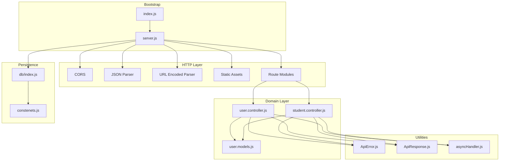
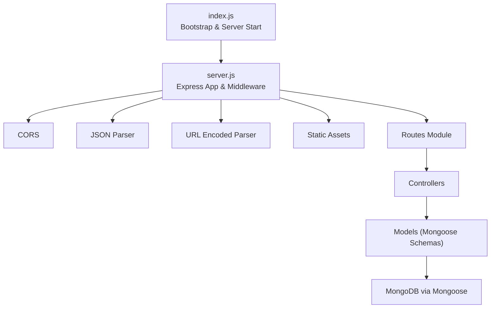
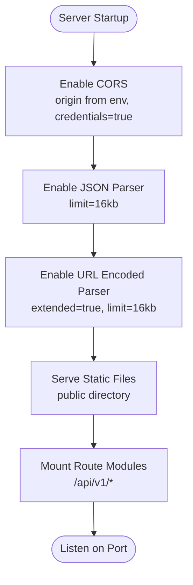
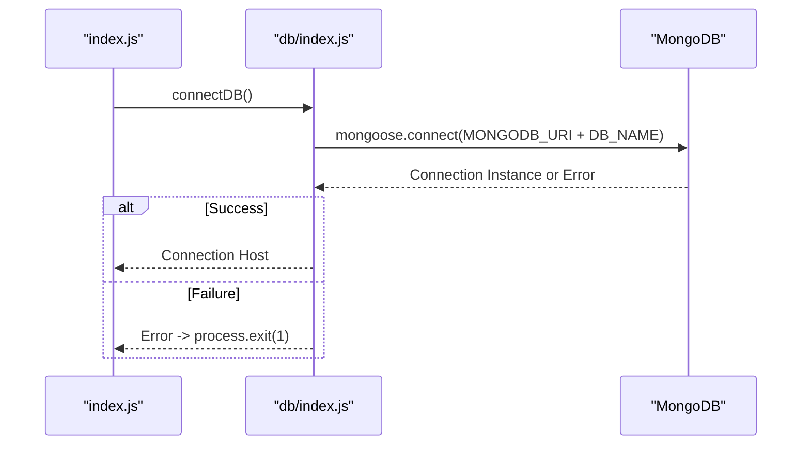
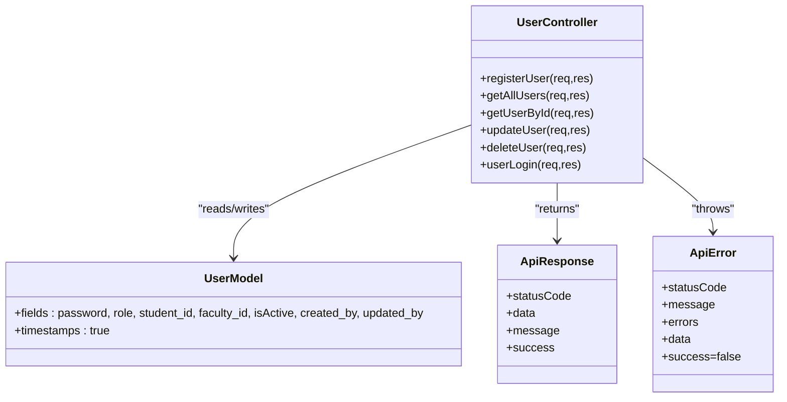
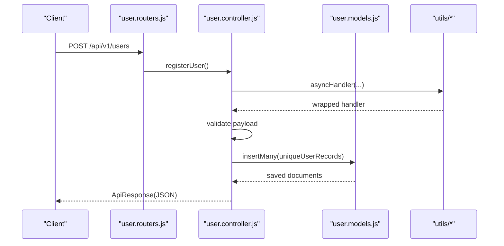
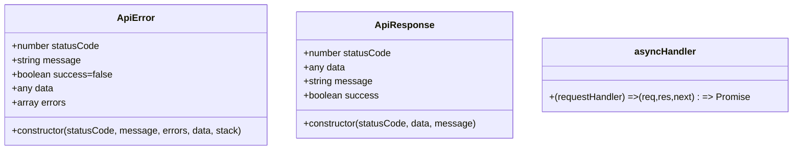
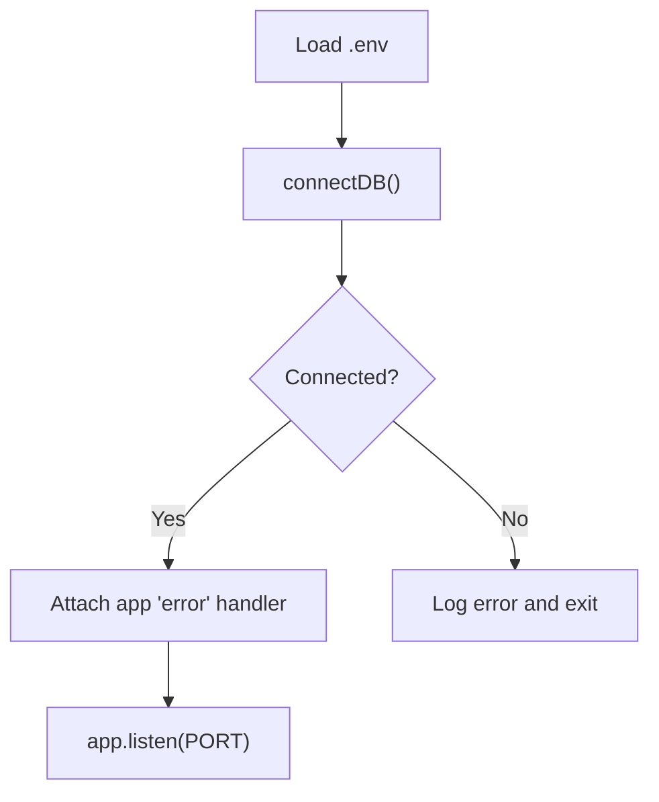
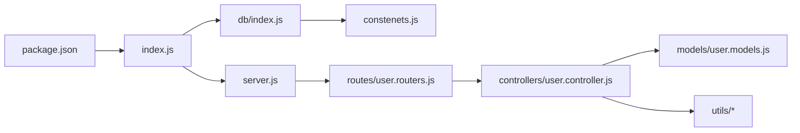

# Backend Architecture

<cite>
**Referenced Files in This Document**
- [index.js](file://Backend/src/index.js)
- [server.js](file://Backend/src/server.js)
- [db/index.js](file://Backend/src/db/index.js)
- [constenets.js](file://Backend/src/constenets.js)
- [utils/ApiError.js](file://Backend/src/utils/ApiError.js)
- [utils/ApiResponse.js](file://Backend/src/utils/ApiResponse.js)
- [utils/asyncHandler.js](file://Backend/src/utils/asyncHandler.js)
- [routes/user.routers.js](file://Backend/src/routes/user.routers.js)
- [controllers/user.controller.js](file://Backend/src/controllers/user.controller.js)
- [models/user.models.js](file://Backend/src/models/user.models.js)
- [controllers/student.controller.js](file://Backend/src/controllers/student.controller.js)
- [package.json](file://Backend/package.json)
</cite>

## Table of Contents
1. [Introduction](#introduction)
2. [Project Structure](#project-structure)
3. [Core Components](#core-components)
4. [Architecture Overview](#architecture-overview)
5. [Detailed Component Analysis](#detailed-component-analysis)
6. [Dependency Analysis](#dependency-analysis)
7. [Performance Considerations](#performance-considerations)
8. [Troubleshooting Guide](#troubleshooting-guide)
9. [Conclusion](#conclusion)

## Introduction
This document describes the backend architecture built with Express.js, structured around an MVC pattern. It covers server bootstrapping, middleware configuration, database connectivity via Mongoose, and standardized error and response handling utilities. The system integrates CORS, JSON parsing, static asset serving, and modular routing across multiple domain resources (users, students, etc.). Security and validation are addressed through explicit checks in controllers and standardized error/response classes.

## Project Structure
The backend follows a feature-based layout under Backend/src:
- Entry points: index.js (bootstrap) and server.js (Express app and middleware)
- Database: db/index.js connects to MongoDB using Mongoose
- Models: Mongoose schemas define collections (e.g., user.models.js)
- Controllers: Route handlers implementing business logic (e.g., user.controller.js)
- Routes: Route declarations per feature (e.g., user.routers.js)
- Utilities: Standardized error and response classes and async wrapper (ApiError.js, ApiResponse.js, asyncHandler.js)
- Constants: Environment-related constants (constenets.js)
- Package configuration: Dependencies and scripts (package.json)

**Diagram sources**
- [index.js:1-18](file://Backend/src/index.js#L1-L18)
- [server.js:1-54](file://Backend/src/server.js#L1-L54)
- [db/index.js:1-19](file://Backend/src/db/index.js#L1-L19)
- [constenets.js:1-2](file://Backend/src/constenets.js#L1-L2)
- [utils/ApiError.js:1-21](file://Backend/src/utils/ApiError.js#L1-L21)
- [utils/ApiResponse.js:1-10](file://Backend/src/utils/ApiResponse.js#L1-L10)
- [utils/asyncHandler.js:1-4](file://Backend/src/utils/asyncHandler.js#L1-L4)
- [routes/user.routers.js:1-19](file://Backend/src/routes/user.routers.js#L1-L19)
- [controllers/user.controller.js:1-355](file://Backend/src/controllers/user.controller.js#L1-L355)
- [models/user.models.js:1-61](file://Backend/src/models/user.models.js#L1-L61)
- [controllers/student.controller.js:1-209](file://Backend/src/controllers/student.controller.js#L1-L209)

**Section sources**
- [index.js:1-18](file://Backend/src/index.js#L1-L18)
- [server.js:1-54](file://Backend/src/server.js#L1-L54)
- [db/index.js:1-19](file://Backend/src/db/index.js#L1-L19)
- [constenets.js:1-2](file://Backend/src/constenets.js#L1-L2)
- [utils/ApiError.js:1-21](file://Backend/src/utils/ApiError.js#L1-L21)
- [utils/ApiResponse.js:1-10](file://Backend/src/utils/ApiResponse.js#L1-L10)
- [utils/asyncHandler.js:1-4](file://Backend/src/utils/asyncHandler.js#L1-L4)
- [routes/user.routers.js:1-19](file://Backend/src/routes/user.routers.js#L1-L19)
- [controllers/user.controller.js:1-355](file://Backend/src/controllers/user.controller.js#L1-L355)
- [models/user.models.js:1-61](file://Backend/src/models/user.models.js#L1-L61)
- [controllers/student.controller.js:1-209](file://Backend/src/controllers/student.controller.js#L1-L209)
- [package.json:1-22](file://Backend/package.json#L1-L22)

## Core Components
- Express server initialization and middleware pipeline
- Database connection module using Mongoose
- Utility classes for consistent error and response handling
- MVC controllers and models for domain logic and persistence
- Modular route modules wired to the Express app

Key responsibilities:
- index.js: Loads environment, connects to the database, and starts the server
- server.js: Configures CORS, body parsers, static assets, and mounts route modules
- db/index.js: Establishes MongoDB connection using environment variables
- utils/*: Provide standardized error and response formats and async error propagation
- routes/*: Define endpoint paths and delegate to controller functions
- controllers/*: Implement business logic, validations, and responses
- models/*: Define Mongoose schemas and exported models

**Section sources**
- [index.js:1-18](file://Backend/src/index.js#L1-L18)
- [server.js:14-53](file://Backend/src/server.js#L14-L53)
- [db/index.js:4-18](file://Backend/src/db/index.js#L4-L18)
- [utils/ApiError.js:1-21](file://Backend/src/utils/ApiError.js#L1-L21)
- [utils/ApiResponse.js:1-10](file://Backend/src/utils/ApiResponse.js#L1-L10)
- [utils/asyncHandler.js:1-4](file://Backend/src/utils/asyncHandler.js#L1-L4)
- [routes/user.routers.js:12-18](file://Backend/src/routes/user.routers.js#L12-L18)
- [controllers/user.controller.js:7-81](file://Backend/src/controllers/user.controller.js#L7-L81)
- [models/user.models.js:3-58](file://Backend/src/models/user.models.js#L3-L58)

## Architecture Overview
The backend uses a layered architecture:
- Bootstrap layer initializes environment and server lifecycle
- HTTP layer configures middleware and routes
- Domain layer implements controllers and models
- Persistence layer manages MongoDB connectivity

**Diagram sources**
- [index.js:1-18](file://Backend/src/index.js#L1-L18)
- [server.js:14-53](file://Backend/src/server.js#L14-L53)
- [routes/user.routers.js:12-18](file://Backend/src/routes/user.routers.js#L12-L18)
- [controllers/user.controller.js:7-81](file://Backend/src/controllers/user.controller.js#L7-L81)
- [models/user.models.js:3-58](file://Backend/src/models/user.models.js#L3-L58)
- [db/index.js:4-18](file://Backend/src/db/index.js#L4-L18)

## Detailed Component Analysis

### Express Server Setup and Middleware Chain
- CORS: Enabled with origin from environment and credentials support
- Body parsing: JSON up to 16KB and URL-encoded bodies with extended support
- Static assets: Serves files from a public directory
- Routing: Mounts feature-specific routers under logical base paths

**Diagram sources**
- [server.js:14-53](file://Backend/src/server.js#L14-L53)

**Section sources**
- [server.js:14-53](file://Backend/src/server.js#L14-L53)

### Database Connection Architecture (Mongoose + MongoDB)
- Connection method attempts to connect using MONGODB_URI and DB_NAME
- On success, logs the host; on failure, logs error and exits the process
- DB_NAME constant defines the target database

**Diagram sources**
- [index.js:8-17](file://Backend/src/index.js#L8-L17)
- [db/index.js:4-18](file://Backend/src/db/index.js#L4-L18)
- [constenets.js:1](file://Backend/src/constenets.js#L1)

**Section sources**
- [db/index.js:4-18](file://Backend/src/db/index.js#L4-L18)
- [constenets.js:1](file://Backend/src/constenets.js#L1)

### MVC Pattern Implementation
- Models: Define Mongoose schemas and exported models (e.g., User)
- Controllers: Implement route handlers with validation, business logic, and standardized responses
- Views: Not used; Express responds directly with JSON via ApiResponse

**Diagram sources**
- [models/user.models.js:3-58](file://Backend/src/models/user.models.js#L3-L58)
- [controllers/user.controller.js:7-354](file://Backend/src/controllers/user.controller.js#L7-L354)
- [utils/ApiResponse.js:1-10](file://Backend/src/utils/ApiResponse.js#L1-L10)
- [utils/ApiError.js:1-21](file://Backend/src/utils/ApiError.js#L1-L21)

**Section sources**
- [models/user.models.js:3-58](file://Backend/src/models/user.models.js#L3-L58)
- [controllers/user.controller.js:7-354](file://Backend/src/controllers/user.controller.js#L7-L354)
- [utils/ApiResponse.js:1-10](file://Backend/src/utils/ApiResponse.js#L1-L10)
- [utils/ApiError.js:1-21](file://Backend/src/utils/ApiError.js#L1-L21)

### Routing and Controller Flow (Example: Users)
- Route module exposes endpoints for create, list, get by id, update, delete, and login
- Controller functions validate inputs, query models, and return ApiResponse or throw ApiError
- asyncHandler wraps route handlers to centralize promise rejection handling

**Diagram sources**
- [routes/user.routers.js:12-18](file://Backend/src/routes/user.routers.js#L12-L18)
- [controllers/user.controller.js:7-81](file://Backend/src/controllers/user.controller.js#L7-L81)
- [models/user.models.js:3-58](file://Backend/src/models/user.models.js#L3-L58)
- [utils/asyncHandler.js:1-4](file://Backend/src/utils/asyncHandler.js#L1-L4)
- [utils/ApiResponse.js:1-10](file://Backend/src/utils/ApiResponse.js#L1-L10)

**Section sources**
- [routes/user.routers.js:12-18](file://Backend/src/routes/user.routers.js#L12-L18)
- [controllers/user.controller.js:7-81](file://Backend/src/controllers/user.controller.js#L7-L81)
- [utils/asyncHandler.js:1-4](file://Backend/src/utils/asyncHandler.js#L1-L4)
- [utils/ApiResponse.js:1-10](file://Backend/src/utils/ApiResponse.js#L1-L10)

### Utility Classes: ApiError, ApiResponse, asyncHandler
- ApiError: Extends Error with statusCode, message, errors, data, and captures stack traces
- ApiResponse: Standardizes successful responses with statusCode, data, message, and computed success flag
- asyncHandler: Wraps Express route handlers to convert thrown/rejected promises into Express errors

**Diagram sources**
- [utils/ApiError.js:1-21](file://Backend/src/utils/ApiError.js#L1-L21)
- [utils/ApiResponse.js:1-10](file://Backend/src/utils/ApiResponse.js#L1-L10)
- [utils/asyncHandler.js:1-4](file://Backend/src/utils/asyncHandler.js#L1-L4)

**Section sources**
- [utils/ApiError.js:1-21](file://Backend/src/utils/ApiError.js#L1-L21)
- [utils/ApiResponse.js:1-10](file://Backend/src/utils/ApiResponse.js#L1-L10)
- [utils/asyncHandler.js:1-4](file://Backend/src/utils/asyncHandler.js#L1-L4)

### Server Bootstrap, Port Configuration, and Environment Variables
- Environment loading: Uses dotenv to load environment variables from .env
- Port: Hardcoded to 4000 in index.js
- Database connection: connectDB() is awaited; error events on app are handled; server listens on configured port
- CORS origin: Loaded from process.env.CORS_ORIGIN in server.js

**Diagram sources**
- [index.js:5-17](file://Backend/src/index.js#L5-L17)
- [server.js:6](file://Backend/src/server.js#L6)

**Section sources**
- [index.js:5-17](file://Backend/src/index.js#L5-L17)
- [server.js:6](file://Backend/src/server.js#L6)

### Security Considerations, Request Validation, and Response Standardization
- CORS: Enabled with origin from environment and credentials support; align with trusted frontend origins
- Body limits: JSON and URL-encoded bodies limited to 16KB to mitigate abuse
- Validation: Controllers validate required fields and uniqueness before persisting data
- Responses: All successful responses use ApiResponse; errors use ApiError; asyncHandler ensures uncaught exceptions reach Express error handlers
- Password handling: Models require passwords; consider hashing in production (not shown here)

**Section sources**
- [server.js:14-23](file://Backend/src/server.js#L14-L23)
- [controllers/user.controller.js:14-29](file://Backend/src/controllers/user.controller.js#L14-L29)
- [controllers/student.controller.js:13-42](file://Backend/src/controllers/student.controller.js#L13-L42)
- [utils/ApiResponse.js:1-10](file://Backend/src/utils/ApiResponse.js#L1-L10)
- [utils/ApiError.js:1-21](file://Backend/src/utils/ApiError.js#L1-L21)
- [utils/asyncHandler.js:1-4](file://Backend/src/utils/asyncHandler.js#L1-L4)

## Dependency Analysis
- index.js depends on dotenv, connectDB, and exports app from server.js
- server.js depends on express and cors; mounts route modules
- db/index.js depends on mongoose and constenets
- Controllers depend on models, asyncHandler, ApiError, and ApiResponse
- Routes depend on controller functions

**Diagram sources**
- [package.json:1-22](file://Backend/package.json#L1-L22)
- [index.js:1-3](file://Backend/src/index.js#L1-L3)
- [server.js:25-50](file://Backend/src/server.js#L25-L50)
- [db/index.js:1-2](file://Backend/src/db/index.js#L1-L2)
- [constenets.js:1](file://Backend/src/constenets.js#L1)
- [routes/user.routers.js:1-18](file://Backend/src/routes/user.routers.js#L1-L18)
- [controllers/user.controller.js:1-5](file://Backend/src/controllers/user.controller.js#L1-L5)
- [models/user.models.js:1](file://Backend/src/models/user.models.js#L1)
- [utils/ApiError.js:1](file://Backend/src/utils/ApiError.js#L1)
- [utils/ApiResponse.js:1](file://Backend/src/utils/ApiResponse.js#L1)
- [utils/asyncHandler.js:1](file://Backend/src/utils/asyncHandler.js#L1)

**Section sources**
- [package.json:1-22](file://Backend/package.json#L1-L22)
- [index.js:1-3](file://Backend/src/index.js#L1-L3)
- [server.js:25-50](file://Backend/src/server.js#L25-L50)
- [db/index.js:1-2](file://Backend/src/db/index.js#L1-L2)
- [constenets.js:1](file://Backend/src/constenets.js#L1)
- [routes/user.routers.js:1-18](file://Backend/src/routes/user.routers.js#L1-L18)
- [controllers/user.controller.js:1-5](file://Backend/src/controllers/user.controller.js#L1-L5)
- [models/user.models.js:1](file://Backend/src/models/user.models.js#L1)
- [utils/ApiError.js:1](file://Backend/src/utils/ApiError.js#L1)
- [utils/ApiResponse.js:1](file://Backend/src/utils/ApiResponse.js#L1)
- [utils/asyncHandler.js:1](file://Backend/src/utils/asyncHandler.js#L1)

## Performance Considerations
- Body size limits reduce memory footprint and protect against large payloads
- Aggregation pipelines in controllers (e.g., user controller) should be optimized with appropriate indexes on joined fields
- Batch inserts (insertMany) are used for bulk operations to minimize round trips
- Consider adding rate limiting and input sanitization for production hardening

## Troubleshooting Guide
Common issues and remedies:
- Database connection failures: Verify MONGODB_URI and DB_NAME; check network and credentials; review console logs
- CORS errors: Ensure CORS_ORIGIN matches the frontend origin; confirm credentials are set appropriately
- Validation errors: Review controller validations for missing required fields; ensure payloads conform to expected shapes
- Unhandled rejections: asyncHandler ensures errors propagate to Express error handlers; confirm error middleware is present in production builds

**Section sources**
- [db/index.js:12-15](file://Backend/src/db/index.js#L12-L15)
- [server.js:14-19](file://Backend/src/server.js#L14-L19)
- [controllers/user.controller.js:14-29](file://Backend/src/controllers/user.controller.js#L14-L29)
- [utils/asyncHandler.js:1-4](file://Backend/src/utils/asyncHandler.js#L1-L4)

## Conclusion
The backend employs a clean, modular architecture leveraging Express.js, Mongoose, and a consistent MVC pattern. Standardized utilities ensure predictable error and response handling, while middleware configuration supports secure and efficient HTTP communication. The design promotes maintainability and scalability across multiple domain resources.