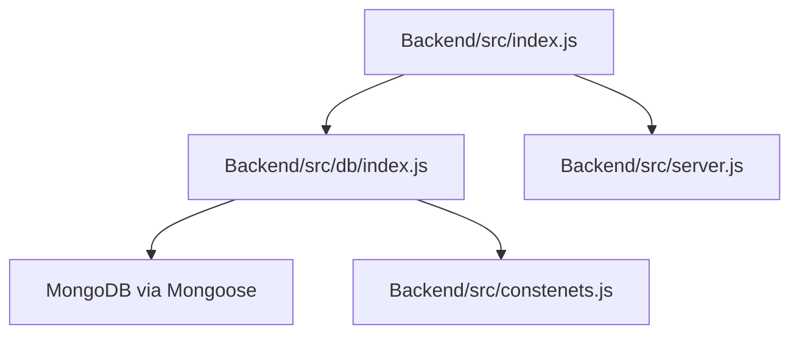
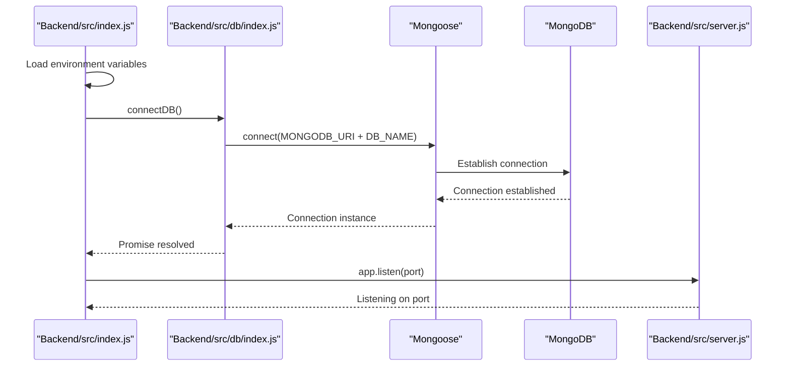
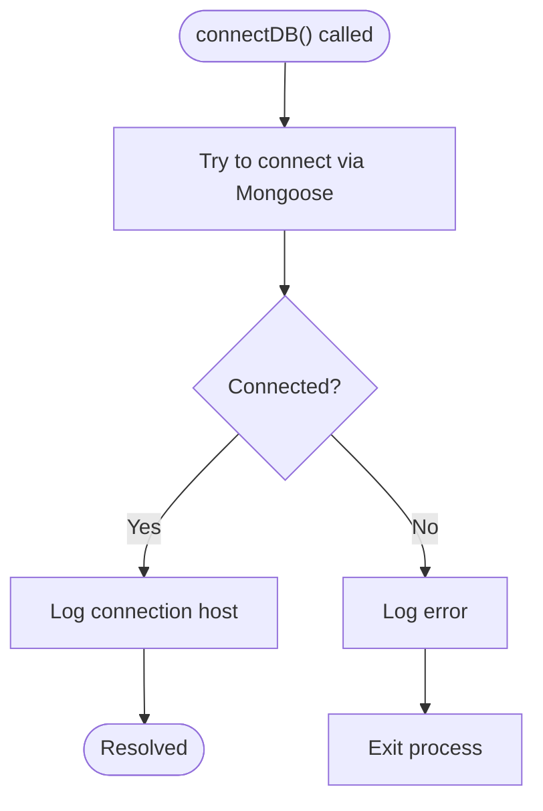
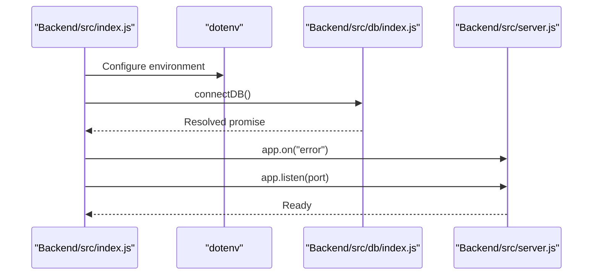
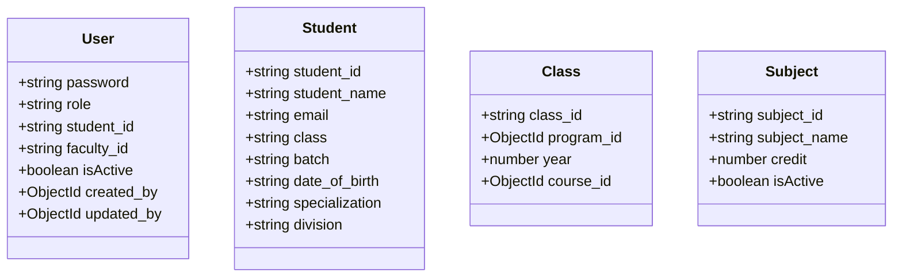
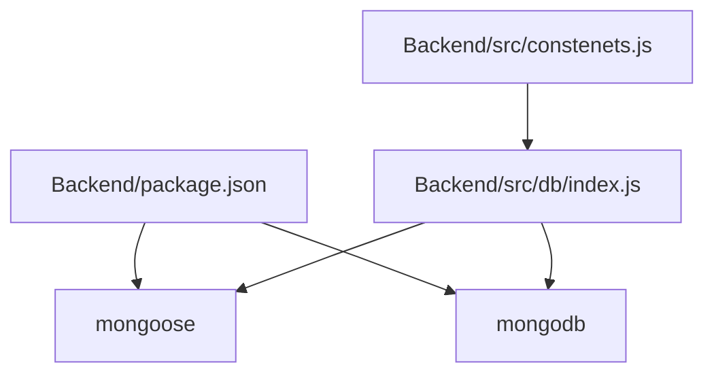

# Database Integration & Connection

<cite>
**Referenced Files in This Document**
- [Backend/src/db/index.js](file://Backend/src/db/index.js)
- [Backend/src/index.js](file://Backend/src/index.js)
- [Backend/src/server.js](file://Backend/src/server.js)
- [Backend/src/constenets.js](file://Backend/src/constenets.js)
- [Backend/package.json](file://Backend/package.json)
- [Backend/src/models/user.models.js](file://Backend/src/models/user.models.js)
- [Backend/src/models/student.models.js](file://Backend/src/models/student.models.js)
- [Backend/src/models/class.models.js](file://Backend/src/models/class.models.js)
- [Backend/src/models/subject.models.js](file://Backend/src/models/subject.models.js)
</cite>

## Table of Contents
1. [Introduction](#introduction)
2. [Project Structure](#project-structure)
3. [Core Components](#core-components)
4. [Architecture Overview](#architecture-overview)
5. [Detailed Component Analysis](#detailed-component-analysis)
6. [Dependency Analysis](#dependency-analysis)
7. [Performance Considerations](#performance-considerations)
8. [Troubleshooting Guide](#troubleshooting-guide)
9. [Conclusion](#conclusion)
10. [Appendices](#appendices)

## Introduction
This document explains the MongoDB database integration using Mongoose ODM in the backend. It covers connection establishment, connection string configuration, connection lifecycle management, error handling, and practical guidance for local and cloud deployments. It also outlines Mongoose configuration options, schema validation setup, connection event listeners, security considerations, connection optimization, and monitoring techniques for production environments.

## Project Structure
The database integration is encapsulated in a dedicated module that initializes the Mongoose connection and exports a reusable function. The application bootstraps the database connection before starting the Express server.

**Diagram sources**
- [Backend/src/index.js:1-18](file://Backend/src/index.js#L1-L18)
- [Backend/src/db/index.js:1-19](file://Backend/src/db/index.js#L1-L19)
- [Backend/src/server.js:1-54](file://Backend/src/server.js#L1-L54)
- [Backend/src/constenets.js:1-2](file://Backend/src/constenets.js#L1-L2)

**Section sources**
- [Backend/src/index.js:1-18](file://Backend/src/index.js#L1-L18)
- [Backend/src/db/index.js:1-19](file://Backend/src/db/index.js#L1-L19)
- [Backend/src/server.js:1-54](file://Backend/src/server.js#L1-L54)
- [Backend/src/constenets.js:1-2](file://Backend/src/constenets.js#L1-L2)

## Core Components
- Database connection initializer: Establishes the Mongoose connection using environment variables and logs connection details.
- Application bootstrap: Loads environment configuration, connects to the database, and starts the server.
- Constants: Provides the database name used in the connection string composition.
- Server: Initializes Express middleware and routes; listens for errors during runtime.

Key responsibilities:
- Centralized connection management in a single module.
- Graceful shutdown on initial connection failure.
- Server startup guarded by successful database connection.

**Section sources**
- [Backend/src/db/index.js:1-19](file://Backend/src/db/index.js#L1-L19)
- [Backend/src/index.js:1-18](file://Backend/src/index.js#L1-L18)
- [Backend/src/constenets.js:1-2](file://Backend/src/constenets.js#L1-L2)
- [Backend/src/server.js:1-54](file://Backend/src/server.js#L1-L54)

## Architecture Overview
The runtime flow ties together environment loading, database initialization, and server startup. The connection is awaited before listening for requests, and the server registers an error handler to surface runtime database issues.

**Diagram sources**
- [Backend/src/index.js:5-17](file://Backend/src/index.js#L5-L17)
- [Backend/src/db/index.js:4-16](file://Backend/src/db/index.js#L4-L16)
- [Backend/src/server.js:13-15](file://Backend/src/server.js#L13-L15)

## Detailed Component Analysis

### Database Connection Module
- Purpose: Encapsulates the Mongoose connection logic, including error handling and logging.
- Connection string construction: Uses an environment variable for the URI and appends the database name constant.
- Behavior: On success, logs the host; on failure, logs the error and exits the process.

**Diagram sources**
- [Backend/src/db/index.js:4-16](file://Backend/src/db/index.js#L4-L16)

**Section sources**
- [Backend/src/db/index.js:1-19](file://Backend/src/db/index.js#L1-L19)

### Application Bootstrap
- Environment loading: Loads environment variables from a dotenv file.
- Connection orchestration: Calls the database initializer and proceeds only after a successful connection.
- Error handling: Registers a server error listener to capture runtime database errors.
- Startup: Starts the Express server on a fixed port.

**Diagram sources**
- [Backend/src/index.js:5-17](file://Backend/src/index.js#L5-L17)
- [Backend/src/server.js:10-12](file://Backend/src/server.js#L10-L12)

**Section sources**
- [Backend/src/index.js:1-18](file://Backend/src/index.js#L1-L18)
- [Backend/src/server.js:10-12](file://Backend/src/server.js#L10-L12)

### Mongoose Configuration Options
Current implementation does not pass explicit Mongoose options to the connection. To enable advanced features such as connection pooling, retry behavior, and timeouts, configure the connection with options like:
- maxPoolSize and minPoolSize for pool sizing
- serverSelectionTimeoutMS and socketTimeoutMS for timeout controls
- retryWrites and retryReads for write/read retry policies
- tls and ssl options for secure connections
- appName for application identification

These options can be supplied to the connect method to tune performance and reliability for production workloads.

[No sources needed since this section provides general guidance]

### Schema Validation Setup
Models define field-level validation and constraints. Examples include required fields, uniqueness, enums, defaults, and indexing. These validations are enforced by Mongoose during document creation and updates.

**Diagram sources**
- [Backend/src/models/user.models.js:1-61](file://Backend/src/models/user.models.js#L1-L61)
- [Backend/src/models/student.models.js:1-66](file://Backend/src/models/student.models.js#L1-L66)
- [Backend/src/models/class.models.js:1-32](file://Backend/src/models/class.models.js#L1-L32)
- [Backend/src/models/subject.models.js:1-33](file://Backend/src/models/subject.models.js#L1-L33)

**Section sources**
- [Backend/src/models/user.models.js:1-61](file://Backend/src/models/user.models.js#L1-L61)
- [Backend/src/models/student.models.js:1-66](file://Backend/src/models/student.models.js#L1-L66)
- [Backend/src/models/class.models.js:1-32](file://Backend/src/models/class.models.js#L1-L32)
- [Backend/src/models/subject.models.js:1-33](file://Backend/src/models/subject.models.js#L1-L33)

### Connection Event Listeners
The current implementation does not register Mongoose connection event listeners (e.g., connected, disconnected, error). Adding listeners enables proactive monitoring and recovery actions. Recommended events:
- Connection established: Trigger initialization tasks
- Disconnected: Attempt reconnection and notify monitoring systems
- Error: Log and escalate to health checks

[No sources needed since this section provides general guidance]

### Local vs Cloud Deployment Guidance
- Local MongoDB:
  - Use a local URI with the database name appended.
  - Ensure the local service is reachable on the configured host/port.
- MongoDB Atlas:
  - Use the provided cluster connection string.
  - Enable TLS and provide authentication credentials.
  - Consider network access lists and VPC peering for private clusters.

[No sources needed since this section provides general guidance]

## Dependency Analysis
The project depends on Mongoose and the underlying MongoDB driver. The connection module relies on environment variables and a database name constant.

**Diagram sources**
- [Backend/package.json:14-20](file://Backend/package.json#L14-L20)
- [Backend/src/db/index.js:1-2](file://Backend/src/db/index.js#L1-L2)
- [Backend/src/constenets.js:1-2](file://Backend/src/constenets.js#L1-L2)

**Section sources**
- [Backend/package.json:14-20](file://Backend/package.json#L14-L20)
- [Backend/src/db/index.js:1-2](file://Backend/src/db/index.js#L1-L2)
- [Backend/src/constenets.js:1-2](file://Backend/src/constenets.js#L1-L2)

## Performance Considerations
- Connection pooling:
  - Tune maxPoolSize/minPoolSize based on workload concurrency.
  - Monitor pool utilization and adjust to avoid thrashing.
- Timeouts:
  - Set serverSelectionTimeoutMS and socketTimeoutMS to balance responsiveness and stability.
- Retry policies:
  - Enable retryWrites/retryReads for idempotent operations.
- Network:
  - Prefer local or low-latency networks for Atlas deployments.
  - Use private endpoints and VPC peering for reduced latency and exposure.
- Monitoring:
  - Track connection counts, pool usage, and operation latencies.
  - Integrate with APM tools for query performance insights.

[No sources needed since this section provides general guidance]

## Troubleshooting Guide
Common issues and remedies:
- Initial connection failures:
  - Verify MONGODB_URI and DB_NAME environment values.
  - Confirm the database is reachable and credentials are valid.
  - Review logs for detailed error messages.
- Runtime disconnections:
  - Add Mongoose event listeners to detect and log disconnections.
  - Implement exponential backoff for reconnection attempts.
- Authentication errors:
  - Ensure credentials match cluster configuration.
  - Check IP whitelist and network access settings for Atlas.
- Timeout errors:
  - Increase socket and selection timeouts for heavy operations.
  - Optimize queries and add appropriate indexes.

[No sources needed since this section provides general guidance]

## Conclusion
The current implementation provides a minimal but effective foundation for MongoDB connectivity using Mongoose. By adding robust configuration options, connection event listeners, and production-grade monitoring, the system can achieve higher reliability, performance, and observability. The schema validations defined in models ensure data integrity, while the centralized connection module simplifies lifecycle management.

## Appendices

### Environment Variables and Constants
- MONGODB_URI: Full connection string to the MongoDB deployment.
- DB_NAME: Database name appended to the URI for connection.

**Section sources**
- [Backend/src/db/index.js:6-8](file://Backend/src/db/index.js#L6-L8)
- [Backend/src/constenets.js:1-2](file://Backend/src/constenets.js#L1-L2)

### Example Connection Scenarios
- Local MongoDB:
  - Compose the URI with the database name and connect.
- MongoDB Atlas:
  - Use the provided cluster string, enable TLS, and configure authentication.

[No sources needed since this section provides general guidance]