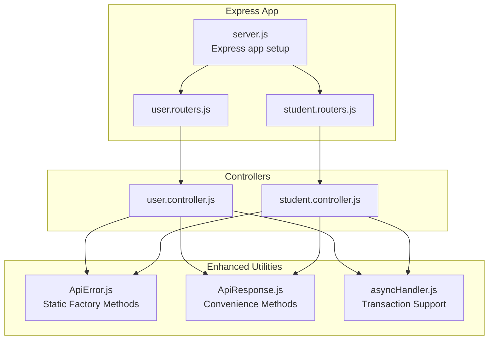
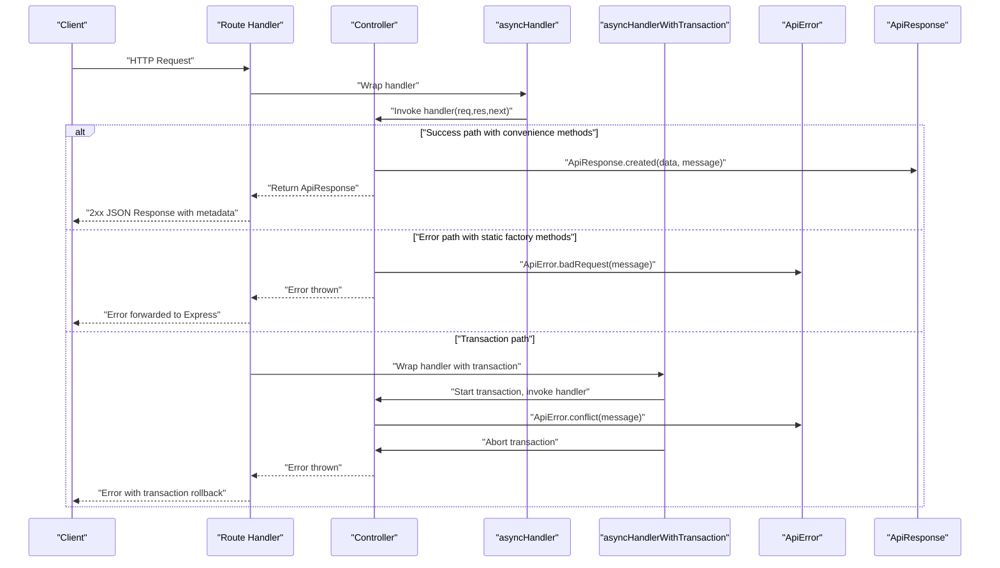
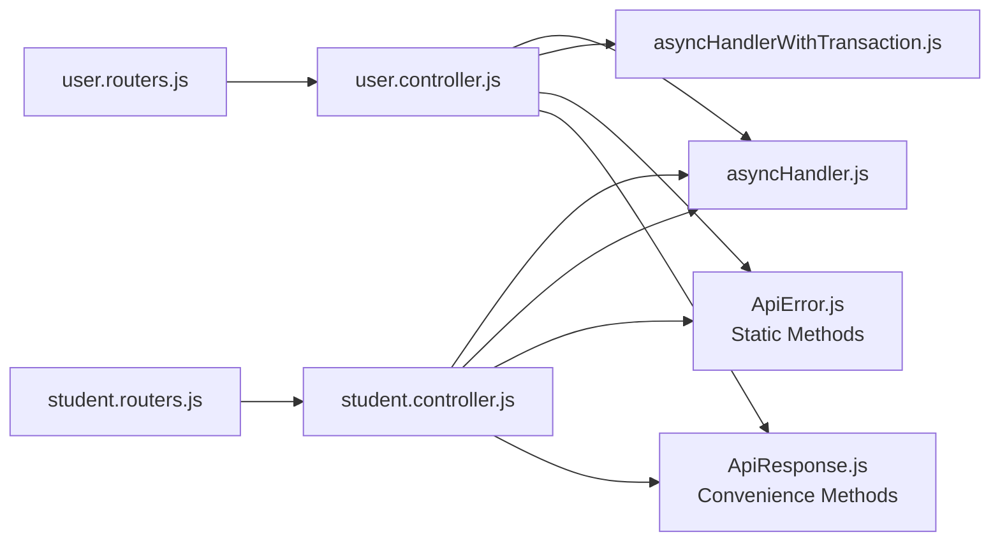

# Error Handling & Response Utilities

<cite>
**Referenced Files in This Document**
- [ApiError.js](file://Backend/src/utils/ApiError.js)
- [ApiResponse.js](file://Backend/src/utils/ApiResponse.js)
- [asyncHandler.js](file://Backend/src/utils/asyncHandler.js)
- [user.controller.js](file://Backend/src/controllers/user.controller.js)
- [student.controller.js](file://Backend/src/controllers/student.controller.js)
- [user.routers.js](file://Backend/src/routes/user.routers.js)
- [student.routers.js](file://Backend/src/routes/student.routers.js)
- [server.js](file://Backend/src/server.js)
- [index.js](file://Backend/src/index.js)
- [package.json](file://Backend/package.json)
</cite>

## Update Summary
**Changes Made**
- Updated ApiError class documentation to reflect new standardized static factory methods for common HTTP status codes
- Enhanced ApiResponse class documentation to include new convenience methods for different HTTP status codes
- Added documentation for new standardized error response format with enhanced JSON structure
- Updated practical examples to demonstrate usage of new static methods
- Enhanced troubleshooting section with new error handling patterns

## Table of Contents
1. [Introduction](#introduction)
2. [Project Structure](#project-structure)
3. [Core Components](#core-components)
4. [Architecture Overview](#architecture-overview)
5. [Detailed Component Analysis](#detailed-component-analysis)
6. [Enhanced Error Handling Patterns](#enhanced-error-handling-patterns)
7. [Dependency Analysis](#dependency-analysis)
8. [Performance Considerations](#performance-considerations)
9. [Troubleshooting Guide](#troubleshooting-guide)
10. [Conclusion](#conclusion)

## Introduction
This document explains the enhanced error handling and response utility system used across the backend. The system has been significantly improved with standardized static factory methods for common HTTP status codes and enhanced response formatting. It focuses on:
- The ApiError class with comprehensive static factory methods for standardized error creation
- The ApiResponse class with convenience methods for different HTTP status codes and enhanced JSON serialization
- The asyncHandler utility with transaction support for complex operations
- Practical usage patterns demonstrating the new standardized error response format
- Advanced debugging strategies and production error management best practices

## Project Structure
The error handling utilities live under the utils folder and are consumed by controllers and routes. The enhanced system provides standardized interfaces for creating consistent error and response objects across the entire application stack.



**Diagram sources**
- [server.js:1-54](file://Backend/src/server.js#L1-L54)
- [user.routers.js:1-19](file://Backend/src/routes/user.routers.js#L1-L19)
- [student.routers.js:1-10](file://Backend/src/routes/student.routers.js#L1-L10)
- [user.controller.js:1-200](file://Backend/src/controllers/user.controller.js#L1-L200)
- [student.controller.js:1-200](file://Backend/src/controllers/student.controller.js#L1-L200)
- [ApiError.js:28-63](file://Backend/src/utils/ApiError.js#L28-L63)
- [ApiResponse.js:15-45](file://Backend/src/utils/ApiResponse.js#L15-L45)
- [asyncHandler.js:25-45](file://Backend/src/utils/asyncHandler.js#L25-L45)

**Section sources**
- [server.js:1-54](file://Backend/src/server.js#L1-L54)
- [user.routers.js:1-19](file://Backend/src/routes/user.routers.js#L1-L19)
- [student.routers.js:1-10](file://Backend/src/routes/student.routers.js#L1-L10)
- [ApiError.js:28-63](file://Backend/src/utils/ApiError.js#L28-L63)
- [ApiResponse.js:15-45](file://Backend/src/utils/ApiResponse.js#L15-L45)
- [asyncHandler.js:25-45](file://Backend/src/utils/asyncHandler.js#L25-L45)

## Core Components

### Enhanced ApiError Class
The ApiError class now provides comprehensive static factory methods for creating standardized error objects with predefined HTTP status codes:

**Static Factory Methods:**
- `ApiError.badRequest()` - Creates 400 Bad Request errors
- `ApiError.unauthorized()` - Creates 401 Unauthorized errors  
- `ApiError.forbidden()` - Creates 403 Forbidden errors
- `ApiError.notFound()` - Creates 404 Not Found errors
- `ApiError.conflict()` - Creates 409 Conflict errors
- `ApiError.validation()` - Creates 422 Validation errors
- `ApiError.tooManyRequests()` - Creates 429 Too Many Requests errors
- `ApiError.internal()` - Creates 500 Internal Server errors
- `ApiError.serviceUnavailable()` - Creates 503 Service Unavailable errors

**Enhanced Features:**
- Automatic timestamp generation for all error objects
- Environment-specific stack trace inclusion (development only)
- Standardized JSON serialization with consistent field structure
- Enhanced error context with request path and method information

### Enhanced ApiResponse Class
The ApiResponse class now includes convenience methods for different HTTP status codes and enhanced response formatting:

**2xx Success Responses:**
- `ApiResponse.ok()` - Creates 200 OK responses
- `ApiResponse.created()` - Creates 201 Created responses  
- `ApiResponse.accepted()` - Creates 202 Accepted responses
- `ApiResponse.noContent()` - Creates 204 No Content responses

**Advanced Features:**
- `ApiResponse.paginated()` - Creates paginated responses with metadata
- Automatic success flag derivation from status codes
- Enhanced JSON serialization with timestamp and optional metadata
- Direct Express response sending capability via `.send(res)` method

### Enhanced asyncHandler Utility
The asyncHandler utility now includes transaction support for complex operations:

**Standard asyncHandler:**
- Wraps Express route handlers to convert thrown exceptions into Express error pipeline
- Eliminates need for try-catch blocks in controllers

**Enhanced asyncHandlerWithTransaction:**
- Provides MongoDB transaction support for complex operations
- Automatically manages transaction lifecycle (start, commit, abort)
- Attaches session context to request object for controller access
- Enhanced error handling with transaction rollback capabilities

**Section sources**
- [ApiError.js:28-77](file://Backend/src/utils/ApiError.js#L28-L77)
- [ApiResponse.js:15-72](file://Backend/src/utils/ApiResponse.js#L15-L72)
- [asyncHandler.js:8-45](file://Backend/src/utils/asyncHandler.js#L8-L45)

## Architecture Overview
The enhanced system integrates utilities into the request-response lifecycle with improved error handling patterns:



**Diagram sources**
- [user.routers.js:14-16](file://Backend/src/routes/user.routers.js#L14-L16)
- [user.controller.js:14-61](file://Backend/src/controllers/user.controller.js#L14-L61)
- [asyncHandler.js:8-45](file://Backend/src/utils/asyncHandler.js#L8-L45)
- [ApiError.js:28-63](file://Backend/src/utils/ApiError.js#L28-L63)
- [ApiResponse.js:15-30](file://Backend/src/utils/ApiResponse.js#L15-L30)

## Detailed Component Analysis

### Enhanced ApiError Class Implementation

**Static Factory Methods:**
The ApiError class now provides standardized static methods that create error objects with predefined HTTP status codes, eliminating the need to remember status code values and ensuring consistency across the application.

**Usage Patterns:**
- `ApiError.badRequest("Invalid input data")` - Validation failures
- `ApiError.notFound("Resource not found")` - Missing entities
- `ApiError.conflict("Duplicate entry")` - Database conflicts
- `ApiError.internal("Database connection failed")` - Server errors

**Enhanced Error Context:**
The enhanced ApiError class automatically captures request context information (path and method) when used with the asyncHandler wrapper, providing better debugging capabilities.

**Section sources**
- [ApiError.js:28-63](file://Backend/src/utils/ApiError.js#L28-L63)
- [user.controller.js:25-41](file://Backend/src/controllers/user.controller.js#L25-L41)
- [student.controller.js:14-41](file://Backend/src/controllers/student.controller.js#L14-L41)

### Enhanced ApiResponse Class Implementation

**Convenience Methods:**
The ApiResponse class provides static factory methods that create standardized response objects for different HTTP status codes, ensuring consistent response formats across the application.

**Usage Patterns:**
- `ApiResponse.created(userData, "User created successfully")` - Successful creation
- `ApiResponse.ok(usersData, "Users retrieved successfully")` - Successful retrieval
- `ApiResponse.noContent("Operation completed")` - Successful deletion
- `ApiResponse.paginated(data, paginationMeta)` - Paginated results

**Enhanced Response Structure:**
Responses now include standardized fields: success flag, status code, message, data, timestamp, and optional metadata for pagination.

**Section sources**
- [ApiResponse.js:15-45](file://Backend/src/utils/ApiResponse.js#L15-L45)
- [user.controller.js:57-60](file://Backend/src/controllers/user.controller.js#L57-L60)
- [student.controller.js:80-88](file://Backend/src/controllers/student.controller.js#L80-L88)

### Enhanced asyncHandler Utility

**Standard asyncHandler:**
Wraps Express route handlers to convert thrown exceptions into the Express error-handling pipeline, eliminating the need for try-catch blocks in controllers.

**Enhanced asyncHandlerWithTransaction:**
Provides comprehensive transaction support for complex operations involving multiple database writes, ensuring data consistency and atomicity.

**Usage Patterns:**
- Simple operations: `asyncHandler(asyncHandler)`
- Complex operations with transactions: `asyncHandlerWithTransaction(asyncHandler)`

**Section sources**
- [asyncHandler.js:8-45](file://Backend/src/utils/asyncHandler.js#L8-L45)
- [user.controller.js:14-127](file://Backend/src/controllers/user.controller.js#L14-L127)

## Enhanced Error Handling Patterns

### Standardized Error Creation
The new static factory methods provide a consistent approach to error creation:

```javascript
// Instead of: throw new ApiError(400, "Message")
// Use: throw ApiError.badRequest("Message")

// Instead of: throw new ApiError(404, "Message") 
// Use: throw ApiError.notFound("Message")

// Instead of: throw new ApiError(409, "Message")
// Use: throw ApiError.conflict("Message")
```

### Enhanced Response Patterns
The convenience methods ensure consistent response formatting:

```javascript
// Instead of: return new ApiResponse(201, data, "Message")
// Use: return ApiResponse.created(data, "Message")

// Instead of: return new ApiResponse(200, data, "Message")
// Use: return ApiResponse.ok(data, "Message")

// Instead of: return new ApiResponse(204, null, "Message")
// Use: return ApiResponse.noContent("Message")
```

### Transaction-Aware Error Handling
Complex operations can now leverage transaction support:

```javascript
// Operations that require transaction support
export const complexOperation = asyncHandlerWithTransaction(async (req, res) => {
  // All database operations within this handler
  // are part of a single transaction
  
  const user = await User.create(userData);
  const profile = await Profile.create(profileData);
  
  // If any error occurs, both operations are rolled back
});
```

**Section sources**
- [user.controller.js:25-60](file://Backend/src/controllers/user.controller.js#L25-L60)
- [student.controller.js:14-41](file://Backend/src/controllers/student.controller.js#L14-L41)
- [asyncHandler.js:25-45](file://Backend/src/utils/asyncHandler.js#L25-L45)

## Dependency Analysis
The enhanced dependency structure reflects the new standardized error handling patterns:



**Diagram sources**
- [user.routers.js:1-19](file://Backend/src/routes/user.routers.js#L1-L19)
- [student.routers.js:1-10](file://Backend/src/routes/student.routers.js#L1-L10)
- [user.controller.js:1-127](file://Backend/src/controllers/user.controller.js#L1-L127)
- [student.controller.js:1-200](file://Backend/src/controllers/student.controller.js#L1-L200)
- [asyncHandler.js:8-45](file://Backend/src/utils/asyncHandler.js#L8-L45)
- [ApiError.js:28-77](file://Backend/src/utils/ApiError.js#L28-L77)
- [ApiResponse.js:15-72](file://Backend/src/utils/ApiResponse.js#L15-L72)

**Section sources**
- [user.routers.js:1-19](file://Backend/src/routes/user.routers.js#L1-L19)
- [student.routers.js:1-10](file://Backend/src/routes/student.routers.js#L1-L10)
- [user.controller.js:1-127](file://Backend/src/controllers/user.controller.js#L1-L127)
- [student.controller.js:1-200](file://Backend/src/controllers/student.controller.js#L1-L200)
- [asyncHandler.js:8-45](file://Backend/src/utils/asyncHandler.js#L8-L45)
- [ApiError.js:28-77](file://Backend/src/utils/ApiError.js#L28-L77)
- [ApiResponse.js:15-72](file://Backend/src/utils/ApiResponse.js#L15-L72)

## Performance Considerations
- **Static Factory Method Overhead**: The new static methods have minimal performance impact compared to manual constructor calls
- **Enhanced JSON Serialization**: Both ApiError and ApiResponse provide optimized toJSON() methods for efficient response generation
- **Transaction Management**: asyncHandlerWithTransaction introduces minimal overhead for transaction operations
- **Memory Efficiency**: Enhanced error objects include timestamp and stack trace only when necessary (development environment)
- **Response Optimization**: Convenience methods reduce code duplication and improve maintainability

## Troubleshooting Guide

### Common Issues and Resolutions

**Uncaught Exceptions in Async Handlers:**
- Ensure all route handlers are wrapped with asyncHandler or asyncHandlerWithTransaction
- The enhanced wrapper automatically attaches request context to errors for better debugging

**Incorrect Success Flags:**
- Verify ApiResponse is constructed with appropriate status codes
- Remember success is automatically derived from statusCode < 400

**Missing Stack Traces:**
- ApiError captures stack traces by default in development environment
- Production errors exclude stack traces for security and performance reasons

**Transaction Rollback Issues:**
- Ensure asyncHandlerWithTransaction is used for operations requiring atomicity
- Check that all database operations within the handler are properly awaited

**Enhanced Debugging Strategies:**
- Use ApiError.static methods for consistent error types across the application
- Leverage ApiResponse convenience methods for standardized response formats
- Take advantage of automatic request context attachment in asyncHandler wrapper

**Production Best Practices:**
- Implement centralized error handling middleware after routes
- Log errors with correlation IDs and timestamps for traceability
- Return generic messages to clients while preserving detailed logs internally
- Monitor error rates and response latencies to detect anomalies

**Section sources**
- [index.js:10-17](file://Backend/src/index.js#L10-L17)
- [server.js:14-23](file://Backend/src/server.js#L14-L23)
- [asyncHandler.js:11-16](file://Backend/src/utils/asyncHandler.js#L11-L16)
- [ApiError.js:68-77](file://Backend/src/utils/ApiError.js#L68-L77)
- [ApiResponse.js:49-71](file://Backend/src/utils/ApiResponse.js#L49-L71)

## Conclusion
The enhanced error handling and response utilities provide a significantly improved foundation for building robust APIs:

**Key Improvements:**
- **Standardized Error Creation**: Static factory methods eliminate status code confusion and ensure consistency
- **Enhanced Response Formatting**: Convenience methods provide standardized response structures
- **Advanced Transaction Support**: Built-in transaction management for complex operations
- **Improved Debugging**: Enhanced error context and standardized response formats
- **Better Developer Experience**: Reduced boilerplate code and consistent patterns

**Benefits:**
- ApiError offers structured, stack-aware error reporting with standardized HTTP status codes
- ApiResponse ensures consistent success responses with automatic success computation and enhanced metadata
- asyncHandler bridges async code and Express's error pipeline with transaction support
- The new standardized patterns improve maintainability, reduce errors, and enhance developer productivity

These enhancements enable clean separation of concerns, improved error handling consistency, clearer client-server communication, and better support for complex transactional operations. The system is ready for production deployment with comprehensive error handling patterns and debugging capabilities.