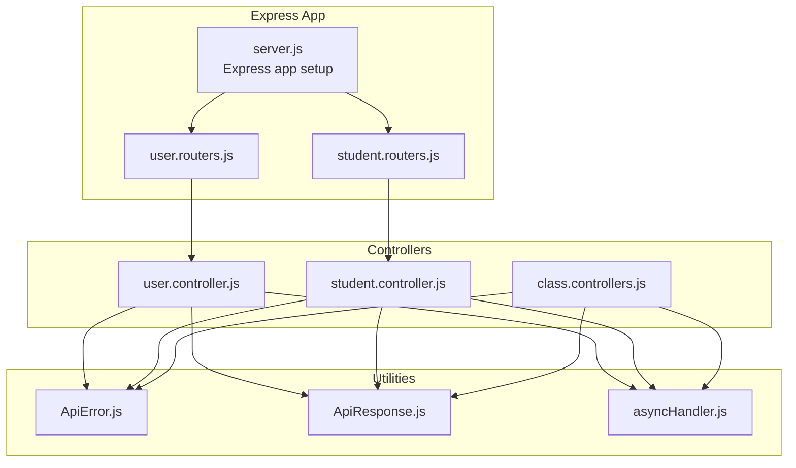
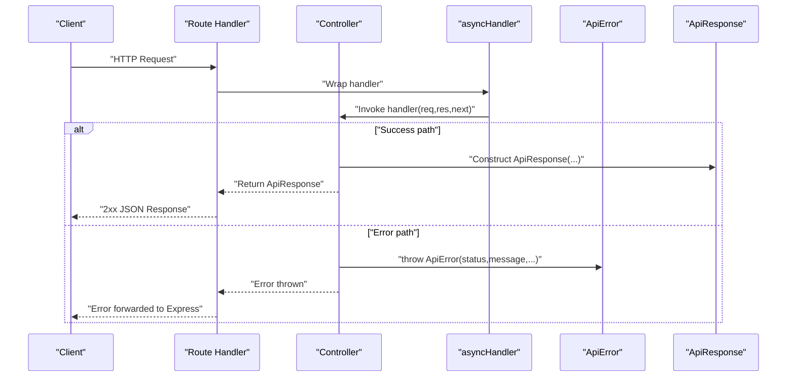
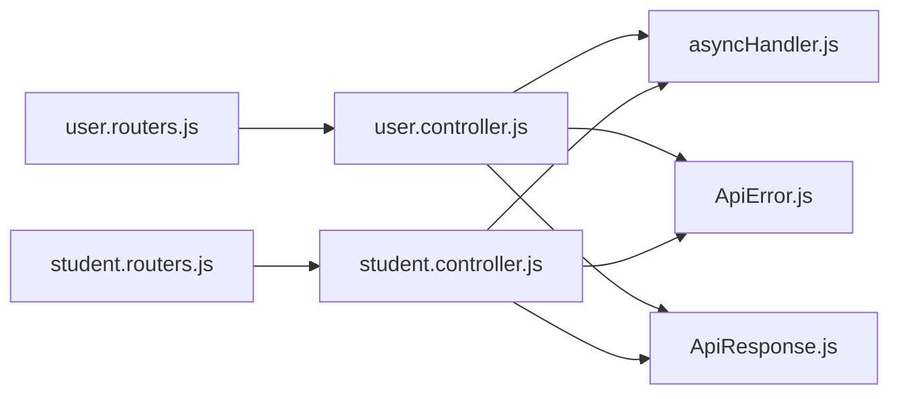

# Error Handling & Response Utilities

<cite>
**Referenced Files in This Document**
- [ApiError.js](file://Backend/src/utils/ApiError.js)
- [ApiResponse.js](file://Backend/src/utils/ApiResponse.js)
- [asyncHandler.js](file://Backend/src/utils/asyncHandler.js)
- [user.controller.js](file://Backend/src/controllers/user.controller.js)
- [student.controller.js](file://Backend/src/controllers/student.controller.js)
- [class.controllers.js](file://Backend/src/controllers/class.controllers.js)
- [user.routers.js](file://Backend/src/routes/user.routers.js)
- [student.routers.js](file://Backend/src/routes/student.routers.js)
- [server.js](file://Backend/src/server.js)
- [index.js](file://Backend/src/index.js)
- [package.json](file://Backend/package.json)
</cite>

## Table of Contents
1. [Introduction](#introduction)
2. [Project Structure](#project-structure)
3. [Core Components](#core-components)
4. [Architecture Overview](#architecture-overview)
5. [Detailed Component Analysis](#detailed-component-analysis)
6. [Dependency Analysis](#dependency-analysis)
7. [Performance Considerations](#performance-considerations)
8. [Troubleshooting Guide](#troubleshooting-guide)
9. [Conclusion](#conclusion)

## Introduction
This document explains the error handling and response utility system used across the backend. It focuses on:
- The ApiError class for structured error representation with status codes, messages, optional data, and stack traces.
- The ApiResponse class for standardized success responses with automatic success flag derivation from HTTP status codes.
- The asyncHandler utility for wrapping asynchronous route handlers and middleware to convert thrown exceptions into Express error-handling flow.
- Practical usage patterns across controllers and routers, including throwing custom errors, handling validation failures, and integrating with Express routing.
- Debugging strategies, logging patterns, and production best practices for error management.

## Project Structure
The error handling utilities live under the utils folder and are consumed by controllers and routes. Controllers wrap their logic with asyncHandler and return ApiResponse instances, while throwing ApiError for error conditions. Routers define endpoint routes and delegate to controller methods.

**Diagram sources**
- [server.js:1-54](file://Backend/src/server.js#L1-L54)
- [user.routers.js:1-19](file://Backend/src/routes/user.routers.js#L1-L19)
- [student.routers.js:1-10](file://Backend/src/routes/student.routers.js#L1-L10)
- [user.controller.js:1-355](file://Backend/src/controllers/user.controller.js#L1-L355)
- [student.controller.js:1-209](file://Backend/src/controllers/student.controller.js#L1-L209)
- [class.controllers.js:1-179](file://Backend/src/controllers/class.controllers.js#L1-L179)
- [ApiError.js:1-21](file://Backend/src/utils/ApiError.js#L1-L21)
- [ApiResponse.js:1-10](file://Backend/src/utils/ApiResponse.js#L1-L10)
- [asyncHandler.js:1-4](file://Backend/src/utils/asyncHandler.js#L1-L4)

**Section sources**
- [server.js:1-54](file://Backend/src/server.js#L1-L54)
- [user.routers.js:1-19](file://Backend/src/routes/user.routers.js#L1-L19)
- [student.routers.js:1-10](file://Backend/src/routes/student.routers.js#L1-L10)
- [ApiError.js:1-21](file://Backend/src/utils/ApiError.js#L1-L21)
- [ApiResponse.js:1-10](file://Backend/src/utils/ApiResponse.js#L1-L10)
- [asyncHandler.js:1-4](file://Backend/src/utils/asyncHandler.js#L1-L4)

## Core Components
- ApiError: Extends the native Error class and standardizes error metadata including status code, message, optional nested errors, associated data, and stack trace capture.
- ApiResponse: Encapsulates successful responses with status code, payload data, message, and an automatically computed success flag derived from the HTTP status code.
- asyncHandler: A higher-order function that wraps Express route handlers/middleware to convert thrown exceptions into the Express error-handling pipeline via next(err).

Key behaviors:
- ApiError sets success to false and captures a stack trace unless provided.
- ApiResponse derives success by treating all status codes below 400 as successful.
- asyncHandler resolves the handler’s Promise and forwards caught errors to Express’s next function.

**Section sources**
- [ApiError.js:1-21](file://Backend/src/utils/ApiError.js#L1-L21)
- [ApiResponse.js:1-10](file://Backend/src/utils/ApiResponse.js#L1-L10)
- [asyncHandler.js:1-4](file://Backend/src/utils/asyncHandler.js#L1-L4)

## Architecture Overview
The system integrates utilities into the request-response lifecycle:
- Routes define endpoints and delegate to controllers.
- Controllers use asyncHandler to safely execute async logic.
- On success, controllers return ApiResponse instances.
- On failure, controllers throw ApiError instances.
- Express receives errors via asyncHandler and can forward them to a centralized error-handling middleware if present.

**Diagram sources**
- [user.routers.js:14-16](file://Backend/src/routes/user.routers.js#L14-L16)
- [user.controller.js:8-81](file://Backend/src/controllers/user.controller.js#L8-L81)
- [asyncHandler.js:1-4](file://Backend/src/utils/asyncHandler.js#L1-L4)
- [ApiError.js:1-21](file://Backend/src/utils/ApiError.js#L1-L21)
- [ApiResponse.js:1-10](file://Backend/src/utils/ApiResponse.js#L1-L10)

## Detailed Component Analysis

### ApiError Class
Purpose:
- Standardize error representation across the application.
- Provide consistent fields: statusCode, message, success=false, optional data, and errors collection.
- Capture stack trace automatically or accept a provided stack.

Implementation highlights:
- Inherits from Error and sets prototype chain appropriately.
- Uses Error.captureStackTrace when no explicit stack is provided.
- Exposes fields for downstream consumers (e.g., HTTP responses).

Usage patterns observed:
- Throwing ApiError with 400 for validation failures.
- Throwing ApiError with 404 for missing resources.
- Throwing ApiError with 408 for request timeout-like scenarios (used in bulk operations).
- Throwing ApiError with 500 for internal server errors.

Best practices:
- Always pass a meaningful statusCode aligned with HTTP semantics.
- Keep message user-friendly but concise.
- Attach minimal data and nested errors only when helpful for diagnostics.

**Section sources**
- [ApiError.js:1-21](file://Backend/src/utils/ApiError.js#L1-L21)
- [user.controller.js:14-28](file://Backend/src/controllers/user.controller.js#L14-L28)
- [user.controller.js:63-75](file://Backend/src/controllers/user.controller.js#L63-L75)
- [student.controller.js:13-42](file://Backend/src/controllers/student.controller.js#L13-L42)
- [student.controller.js:65-78](file://Backend/src/controllers/student.controller.js#L65-L78)
- [class.controllers.js:9-16](file://Backend/src/controllers/class.controllers.js#L9-L16)
- [class.controllers.js:26-28](file://Backend/src/controllers/class.controllers.js#L26-L28)

### ApiResponse Class
Purpose:
- Provide a uniform response envelope for successful API calls.
- Automatically derive success from the HTTP status code (< 400 is considered successful).

Implementation highlights:
- Constructor accepts statusCode, data, and message with a default value.
- success is computed as statusCode < 400.

Usage patterns observed:
- Controllers return new ApiResponse(statusCode, data, message) on success.
- Used consistently across user, student, and class controllers.

Best practices:
- Use appropriate HTTP status codes to reflect outcomes.
- Keep data minimal and relevant to the request.
- Ensure message communicates outcome clearly to clients.

**Section sources**
- [ApiResponse.js:1-10](file://Backend/src/utils/ApiResponse.js#L1-L10)
- [user.controller.js:76-80](file://Backend/src/controllers/user.controller.js#L76-L80)
- [user.controller.js:156-160](file://Backend/src/controllers/user.controller.js#L156-L160)
- [student.controller.js:82-90](file://Backend/src/controllers/student.controller.js#L82-L90)
- [student.controller.js:102-104](file://Backend/src/controllers/student.controller.js#L102-L104)
- [class.controllers.js:32-36](file://Backend/src/controllers/class.controllers.js#L32-L36)
- [class.controllers.js:76-78](file://Backend/src/controllers/class.controllers.js#L76-L78)

### asyncHandler Utility
Purpose:
- Wrap Express route handlers and middleware to convert thrown exceptions into the Express error-handling flow.
- Ensures async errors are not left unhandled and are forwarded to next(err).

Implementation highlights:
- Returns a function that invokes the provided handler and wraps it in Promise.resolve(...).catch(next).
- Works for both sync and async handlers.

Usage patterns observed:
- Controllers import asyncHandler and wrap exported functions.
- Routers import controller functions and rely on asyncHandler to handle errors.

Best practices:
- Always wrap controller functions with asyncHandler.
- Avoid mixing sync throws with async code without this wrapper.
- Centralize error handling middleware after routes to catch errors.

**Section sources**
- [asyncHandler.js:1-4](file://Backend/src/utils/asyncHandler.js#L1-L4)
- [user.controller.js:8](file://Backend/src/controllers/user.controller.js#L8)
- [student.controller.js:7](file://Backend/src/controllers/student.controller.js#L7)
- [class.controllers.js:6](file://Backend/src/controllers/class.controllers.js#L6)

### Practical Examples and Patterns

#### Throwing Custom Errors
- Validation failures: Throw ApiError with 400 and a descriptive message when input is invalid.
- Resource not found: Throw ApiError with 404 when a requested entity does not exist.
- Bulk operation duplicates: Throw ApiError with 408 when all provided items already exist.
- Internal errors: Throw ApiError with 500 when persistence or processing fails unexpectedly.

Examples in controllers:
- User registration validates arrays and required fields, then throws ApiError on violations.
- Student registration validates required fields per record and throws ApiError for duplicates or persistence failures.
- Class registration validates identifiers and year, filters duplicates, and throws ApiError for duplicates or empty results.

**Section sources**
- [user.controller.js:14-28](file://Backend/src/controllers/user.controller.js#L14-L28)
- [user.controller.js:63-75](file://Backend/src/controllers/user.controller.js#L63-L75)
- [student.controller.js:13-42](file://Backend/src/controllers/student.controller.js#L13-L42)
- [student.controller.js:65-78](file://Backend/src/controllers/student.controller.js#L65-L78)
- [class.controllers.js:9-16](file://Backend/src/controllers/class.controllers.js#L9-L16)
- [class.controllers.js:26-28](file://Backend/src/controllers/class.controllers.js#L26-L28)

#### Handling Validation Errors
- Controllers validate incoming data early and throw ApiError with 400 for missing or invalid fields.
- Bulk operations filter duplicates and throw ApiError with 408 when none remain unique.

**Section sources**
- [user.controller.js:14-28](file://Backend/src/controllers/user.controller.js#L14-L28)
- [student.controller.js:13-42](file://Backend/src/controllers/student.controller.js#L13-L42)
- [class.controllers.js:9-16](file://Backend/src/controllers/class.controllers.js#L9-L16)

#### Returning Standardized Responses
- On success, controllers return new ApiResponse with appropriate status code, data, and message.
- success is automatically derived from the status code.

**Section sources**
- [user.controller.js:76-80](file://Backend/src/controllers/user.controller.js#L76-L80)
- [student.controller.js:82-90](file://Backend/src/controllers/student.controller.js#L82-L90)
- [class.controllers.js:32-36](file://Backend/src/controllers/class.controllers.js#L32-L36)

#### Route Integration
- Routers define endpoints and delegate to controller methods.
- asyncHandler ensures errors propagate to Express error handling.

**Section sources**
- [user.routers.js:14-16](file://Backend/src/routes/user.routers.js#L14-L16)
- [student.routers.js:6-7](file://Backend/src/routes/student.routers.js#L6-L7)

## Dependency Analysis
The following diagram shows how routes depend on controllers, and how controllers depend on utilities.

**Diagram sources**
- [user.routers.js:1-19](file://Backend/src/routes/user.routers.js#L1-L19)
- [student.routers.js:1-10](file://Backend/src/routes/student.routers.js#L1-L10)
- [user.controller.js:1-8](file://Backend/src/controllers/user.controller.js#L1-L8)
- [student.controller.js:1-4](file://Backend/src/controllers/student.controller.js#L1-L4)
- [asyncHandler.js:1-4](file://Backend/src/utils/asyncHandler.js#L1-L4)
- [ApiError.js:1-21](file://Backend/src/utils/ApiError.js#L1-L21)
- [ApiResponse.js:1-10](file://Backend/src/utils/ApiResponse.js#L1-L10)

**Section sources**
- [user.routers.js:1-19](file://Backend/src/routes/user.routers.js#L1-L19)
- [student.routers.js:1-10](file://Backend/src/routes/student.routers.js#L1-L10)
- [user.controller.js:1-8](file://Backend/src/controllers/user.controller.js#L1-L8)
- [student.controller.js:1-4](file://Backend/src/controllers/student.controller.js#L1-L4)
- [asyncHandler.js:1-4](file://Backend/src/utils/asyncHandler.js#L1-L4)
- [ApiError.js:1-21](file://Backend/src/utils/ApiError.js#L1-L21)
- [ApiResponse.js:1-10](file://Backend/src/utils/ApiResponse.js#L1-L10)

## Performance Considerations
- Prefer early validation to avoid unnecessary database calls and reduce error latency.
- Use ApiResponse to keep responses lightweight; avoid returning large payloads unless required.
- asyncHandler introduces minimal overhead by wrapping handlers in Promise resolution; ensure handlers themselves are efficient.
- Avoid excessive nested error objects; keep ApiError.errors minimal and actionable.

## Troubleshooting Guide
Common issues and resolutions:
- Uncaught exceptions in async handlers: Ensure all route handlers are wrapped with asyncHandler so thrown errors reach Express error handling.
- Incorrect success flag: Verify that ApiResponse is constructed with the intended HTTP status code; success is derived from statusCode < 400.
- Missing stack traces: ApiError captures a stack trace by default; if you provide a custom stack, ensure it is accurate.
- Logging and monitoring: Use console logs during development and integrate structured logging in production. The server logs database connection errors and startup messages; extend this pattern for API errors.

Debugging strategies:
- Add targeted console logs around validation and persistence steps in controllers.
- Inspect ApiResponse fields (statusCode, data, message, success) to confirm response shape.
- Confirm that ApiError fields (statusCode, message, errors, data) carry sufficient context for debugging.

Production best practices:
- Centralize error handling middleware after routes to standardize error responses.
- Log errors with correlation IDs and timestamps for traceability.
- Return generic messages to clients while preserving detailed logs internally.
- Monitor error rates and response latencies to detect anomalies.

**Section sources**
- [index.js:10-17](file://Backend/src/index.js#L10-L17)
- [server.js:14-23](file://Backend/src/server.js#L14-L23)
- [ApiResponse.js:6](file://Backend/src/utils/ApiResponse.js#L6)
- [ApiError.js:16-18](file://Backend/src/utils/ApiError.js#L16-L18)

## Conclusion
The error handling and response utilities provide a consistent, predictable foundation for building robust APIs:
- ApiError offers structured, stack-aware error reporting.
- ApiResponse ensures standardized success responses with automatic success computation.
- asyncHandler bridges async code and Express’s error pipeline.
Together, these utilities enable clean separation of concerns, improved maintainability, and clearer client-server communication. Extend with centralized error handling middleware and logging for production-grade reliability.