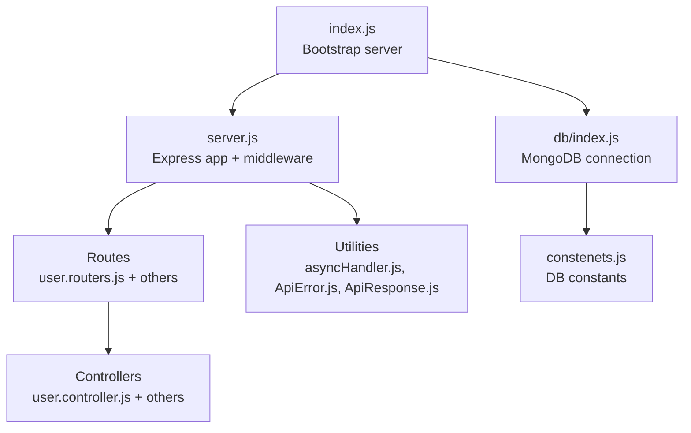
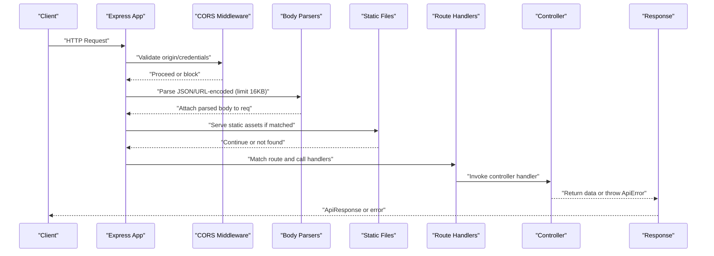
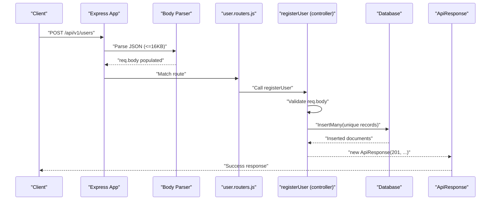
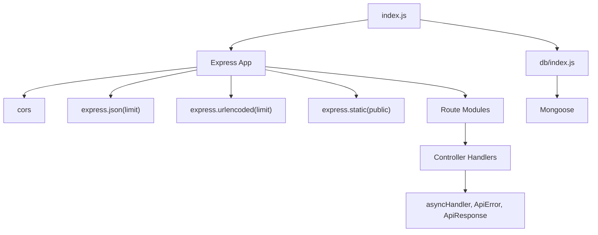

# Middleware Chain & Request Processing

<cite>
**Referenced Files in This Document**
- [index.js](file://Backend/src/index.js)
- [server.js](file://Backend/src/server.js)
- [package.json](file://Backend/package.json)
- [user.routers.js](file://Backend/src/routes/user.routers.js)
- [user.controller.js](file://Backend/src/controllers/user.controller.js)
- [asyncHandler.js](file://Backend/src/utils/asyncHandler.js)
- [ApiError.js](file://Backend/src/utils/ApiError.js)
- [ApiResponse.js](file://Backend/src/utils/ApiResponse.js)
- [index.js](file://Backend/src/db/index.js)
- [constenets.js](file://Backend/src/constenets.js)
</cite>

## Table of Contents
1. [Introduction](#introduction)
2. [Project Structure](#project-structure)
3. [Core Components](#core-components)
4. [Architecture Overview](#architecture-overview)
5. [Detailed Component Analysis](#detailed-component-analysis)
6. [Dependency Analysis](#dependency-analysis)
7. [Performance Considerations](#performance-considerations)
8. [Troubleshooting Guide](#troubleshooting-guide)
9. [Conclusion](#conclusion)

## Introduction
This document explains the Express middleware chain and request processing pipeline for the Timetable Project backend. It covers middleware execution order, CORS configuration, body parsing for JSON and URL-encoded data, static file serving, request size limits, route integration, parameter extraction, validation strategies, and patterns for building custom middleware (authentication, logging, rate limiting, request transformation). It also addresses performance optimization, error propagation, and debugging techniques.

## Project Structure
The backend is organized around an Express application with modular routing, shared utilities for async handling and standardized responses, and a database connection module. The server initializes middleware globally, mounts route modules, and exposes the app instance for lifecycle events.

**Diagram sources**
- [index.js:1-18](file://Backend/src/index.js#L1-L18)
- [server.js:1-54](file://Backend/src/server.js#L1-L54)
- [user.routers.js:1-19](file://Backend/src/routes/user.routers.js#L1-L19)
- [user.controller.js:1-355](file://Backend/src/controllers/user.controller.js#L1-L355)
- [asyncHandler.js:1-4](file://Backend/src/utils/asyncHandler.js#L1-L4)
- [ApiError.js:1-21](file://Backend/src/utils/ApiError.js#L1-L21)
- [ApiResponse.js:1-10](file://Backend/src/utils/ApiResponse.js#L1-L10)
- [index.js:1-19](file://Backend/src/db/index.js#L1-L19)
- [constenets.js:1-2](file://Backend/src/constenets.js#L1-L2)

**Section sources**
- [index.js:1-18](file://Backend/src/index.js#L1-L18)
- [server.js:1-54](file://Backend/src/server.js#L1-L54)
- [package.json:1-22](file://Backend/package.json#L1-L22)

## Core Components
- Express app and middleware initialization
  - CORS enabled with origin and credentials support
  - Body parsing for JSON and URL-encoded payloads with size limits
  - Static asset serving configured
- Route registration and controller integration
- Utility modules for async error handling and response formatting
- Database connection module

Key implementation references:
- Middleware setup and route mounting: [server.js:14-50](file://Backend/src/server.js#L14-L50)
- Bootstrap and server lifecycle: [index.js:8-17](file://Backend/src/index.js#L8-L17)
- Route definition: [user.routers.js:14-16](file://Backend/src/routes/user.routers.js#L14-L16)
- Async handler pattern: [asyncHandler.js:1-2](file://Backend/src/utils/asyncHandler.js#L1-L2)
- Response/error models: [ApiResponse.js:1-10](file://Backend/src/utils/ApiResponse.js#L1-L10), [ApiError.js:1-21](file://Backend/src/utils/ApiError.js#L1-L21)
- DB connection: [index.js:4-16](file://Backend/src/db/index.js#L4-L16)

**Section sources**
- [server.js:14-50](file://Backend/src/server.js#L14-L50)
- [index.js:8-17](file://Backend/src/index.js#L8-L17)
- [user.routers.js:14-16](file://Backend/src/routes/user.routers.js#L14-L16)
- [asyncHandler.js:1-2](file://Backend/src/utils/asyncHandler.js#L1-L2)
- [ApiResponse.js:1-10](file://Backend/src/utils/ApiResponse.js#L1-L10)
- [ApiError.js:1-21](file://Backend/src/utils/ApiError.js#L1-L21)
- [index.js:4-16](file://Backend/src/db/index.js#L4-L16)

## Architecture Overview
The request processing pipeline follows a strict order:
1. Global middleware (CORS, body parsers, static)
2. Route-specific middleware (if any)
3. Controller handlers
4. Response formatting via ApiResponse
5. Error propagation via ApiError and async wrapper

**Diagram sources**
- [server.js:14-23](file://Backend/src/server.js#L14-L23)
- [user.routers.js:14-16](file://Backend/src/routes/user.routers.js#L14-L16)
- [user.controller.js:8-81](file://Backend/src/controllers/user.controller.js#L8-L81)
- [ApiResponse.js:1-10](file://Backend/src/utils/ApiResponse.js#L1-L10)
- [ApiError.js:1-21](file://Backend/src/utils/ApiError.js#L1-L21)

## Detailed Component Analysis

### Middleware Execution Order and Global Setup
- CORS: Configured with origin from environment and credentials enabled.
- Body parsing:
  - JSON with a 16 KB limit.
  - URL-encoded with extended parser and 16 KB limit.
- Static file serving: Serves files from the public directory.

These are registered globally in the Express app and therefore apply to all routes.

References:
- [server.js:14-23](file://Backend/src/server.js#L14-L23)

**Section sources**
- [server.js:14-23](file://Backend/src/server.js#L14-L23)

### CORS Configuration for Cross-Origin Requests
- Origin is controlled by the environment variable CORS_ORIGIN.
- Credentials are allowed, enabling cookies and auth headers to be sent cross-origin.

References:
- [server.js:15-18](file://Backend/src/server.js#L15-L18)

**Section sources**
- [server.js:15-18](file://Backend/src/server.js#L15-L18)

### Body Parsing for JSON and URL-Encoded Data
- JSON payload parsing with a 16 KB size cap.
- URL-encoded payload parsing with extended encoder and 16 KB size cap.
- These middlewares populate req.body and are applied before route handlers.

References:
- [server.js:21-22](file://Backend/src/server.js#L21-L22)

**Section sources**
- [server.js:21-22](file://Backend/src/server.js#L21-L22)

### Static File Serving Configuration
- Static assets are served from the public directory.
- This middleware runs before route handlers, so static paths take precedence over dynamic routes.

References:
- [server.js:23](file://Backend/src/server.js#L23)

**Section sources**
- [server.js:23](file://Backend/src/server.js#L23)

### Request Size Limitations
- Both JSON and URL-encoded bodies are limited to 16 KB.
- Exceeding this limit triggers a client error handled by the underlying body parser.

References:
- [server.js:21-22](file://Backend/src/server.js#L21-L22)

**Section sources**
- [server.js:21-22](file://Backend/src/server.js#L21-L22)

### Route Middleware Integration and Parameter Extraction
- Routes are mounted under API prefixes (for example, /api/v1/users).
- Route handlers extract parameters from req.params and use req.body for payloads.
- Controllers encapsulate business logic and return structured responses.

References:
- [server.js:40-50](file://Backend/src/server.js#L40-L50)
- [user.routers.js:14-16](file://Backend/src/routes/user.routers.js#L14-L16)
- [user.controller.js:164-166](file://Backend/src/controllers/user.controller.js#L164-L166)

**Section sources**
- [server.js:40-50](file://Backend/src/server.js#L40-L50)
- [user.routers.js:14-16](file://Backend/src/routes/user.routers.js#L14-L16)
- [user.controller.js:164-166](file://Backend/src/controllers/user.controller.js#L164-L166)

### Request Validation Strategies
- Validation occurs in controllers using synchronous checks on req.body and req.params.
- On validation failure, controllers throw ApiError with appropriate status codes.
- The asyncHandler wrapper ensures thrown errors are forwarded to Express error-handling middleware.

References:
- [user.controller.js:14-29](file://Backend/src/controllers/user.controller.js#L14-L29)
- [user.controller.js:281-285](file://Backend/src/controllers/user.controller.js#L281-L285)
- [asyncHandler.js:1-2](file://Backend/src/utils/asyncHandler.js#L1-L2)
- [ApiError.js:1-21](file://Backend/src/utils/ApiError.js#L1-L21)

**Section sources**
- [user.controller.js:14-29](file://Backend/src/controllers/user.controller.js#L14-L29)
- [user.controller.js:281-285](file://Backend/src/controllers/user.controller.js#L281-L285)
- [asyncHandler.js:1-2](file://Backend/src/utils/asyncHandler.js#L1-L2)
- [ApiError.js:1-21](file://Backend/src/utils/ApiError.js#L1-L21)

### Implementing Custom Middleware Patterns
Below are recommended patterns for common middleware types. Replace placeholders with your implementation details.

- Authentication middleware
  - Verify tokens or session state.
  - Attach user identity to req.user.
  - Call next() on success or next(ApiError) on failure.

- Logging middleware
  - Log method, URL, and basic timing.
  - Optionally log sanitized req.body and res.status.

- Rate limiting middleware
  - Track requests per IP or user.
  - Block or delay after threshold using in-memory or Redis storage.
  - Call next() or next(ApiError) with 429.

- Request transformation middleware
  - Normalize fields in req.body.
  - Enforce casing or sanitize inputs.
  - Call next() after transformation.

Integration tips:
- Place global middleware before route mounts to apply to all routes.
- For route-scoped middleware, define it inside the route file before handlers.
- Always forward errors to next() to leverage centralized error handling.

[No sources needed since this section provides general guidance]

### Example Flow: User Registration Pipeline

**Diagram sources**
- [server.js:40](file://Backend/src/server.js#L40)
- [user.routers.js:14](file://Backend/src/routes/user.routers.js#L14)
- [user.controller.js:8-81](file://Backend/src/controllers/user.controller.js#L8-L81)
- [ApiResponse.js:1-10](file://Backend/src/utils/ApiResponse.js#L1-L10)

## Dependency Analysis
- Express app depends on:
  - cors for cross-origin policies
  - express.json and express.urlencoded for body parsing
  - express.static for static assets
  - route modules for endpoint definitions
- Controllers depend on:
  - asyncHandler for error propagation
  - ApiError and ApiResponse for consistent responses
- Database connection depends on:
  - Mongoose and environment variables

**Diagram sources**
- [server.js:14-50](file://Backend/src/server.js#L14-L50)
- [user.routers.js:14-16](file://Backend/src/routes/user.routers.js#L14-L16)
- [user.controller.js:8-81](file://Backend/src/controllers/user.controller.js#L8-L81)
- [asyncHandler.js:1-2](file://Backend/src/utils/asyncHandler.js#L1-L2)
- [ApiError.js:1-21](file://Backend/src/utils/ApiError.js#L1-L21)
- [ApiResponse.js:1-10](file://Backend/src/utils/ApiResponse.js#L1-L10)
- [index.js:8-17](file://Backend/src/index.js#L8-L17)
- [index.js:4-16](file://Backend/src/db/index.js#L4-L16)

**Section sources**
- [server.js:14-50](file://Backend/src/server.js#L14-L50)
- [user.routers.js:14-16](file://Backend/src/routes/user.routers.js#L14-L16)
- [user.controller.js:8-81](file://Backend/src/controllers/user.controller.js#L8-L81)
- [asyncHandler.js:1-2](file://Backend/src/utils/asyncHandler.js#L1-L2)
- [ApiError.js:1-21](file://Backend/src/utils/ApiError.js#L1-L21)
- [ApiResponse.js:1-10](file://Backend/src/utils/ApiResponse.js#L1-L10)
- [index.js:8-17](file://Backend/src/index.js#L8-L17)
- [index.js:4-16](file://Backend/src/db/index.js#L4-L16)

## Performance Considerations
- Keep middleware order efficient:
  - Place lightweight middlewares early (logging, pre-processing).
  - Place heavier ones later (auth, rate limiting).
- Tune body parser limits to match typical payloads; avoid overly large limits to reduce memory pressure.
- Use static caching headers for public assets and consider CDN offloading.
- Centralize error handling to minimize repeated checks in controllers.
- Prefer streaming for large uploads and avoid loading entire payloads into memory when possible.

[No sources needed since this section provides general guidance]

## Troubleshooting Guide
Common issues and resolutions:
- CORS failures
  - Verify CORS_ORIGIN environment variable is set and matches client origin.
  - Confirm credentials: true is intended for browsers sending cookies.
  - References: [server.js:15-18](file://Backend/src/server.js#L15-L18)

- 413 Payload Too Large
  - Occurs when JSON or URL-encoded payload exceeds 16 KB limit.
  - References: [server.js:21-22](file://Backend/src/server.js#L21-L22)

- Static assets not served
  - Ensure public directory exists and Express static middleware is registered.
  - References: [server.js:23](file://Backend/src/server.js#L23)

- Uncaught exceptions in routes
  - Wrap route handlers with asyncHandler to forward errors to Express error middleware.
  - References: [asyncHandler.js:1-2](file://Backend/src/utils/asyncHandler.js#L1-L2)

- Standardized error responses
  - Throw ApiError instances for validation and business logic failures.
  - References: [ApiError.js:1-21](file://Backend/src/utils/ApiError.js#L1-L21)

- Standardized success responses
  - Return ApiResponse instances from controllers.
  - References: [ApiResponse.js:1-10](file://Backend/src/utils/ApiResponse.js#L1-L10)

- Database connection errors
  - Check MONGODB_URI and DB_NAME environment variables.
  - References: [index.js:4-16](file://Backend/src/db/index.js#L4-L16), [constenets.js:1](file://Backend/src/constenets.js#L1)

**Section sources**
- [server.js:15-18](file://Backend/src/server.js#L15-L18)
- [server.js:21-22](file://Backend/src/server.js#L21-L22)
- [server.js:23](file://Backend/src/server.js#L23)
- [asyncHandler.js:1-2](file://Backend/src/utils/asyncHandler.js#L1-L2)
- [ApiError.js:1-21](file://Backend/src/utils/ApiError.js#L1-L21)
- [ApiResponse.js:1-10](file://Backend/src/utils/ApiResponse.js#L1-L10)
- [index.js:4-16](file://Backend/src/db/index.js#L4-L16)
- [constenets.js:1](file://Backend/src/constenets.js#L1)

## Conclusion
The backend establishes a clear, predictable middleware chain with CORS, body parsing, and static serving applied globally. Routes integrate cleanly with controllers that validate inputs, manage database interactions, and return standardized responses. The asyncHandler and ApiError/ApiResponse utilities streamline error propagation and response formatting. By following the patterns outlined here—especially around validation, error handling, and middleware ordering—you can extend the system with robust authentication, logging, rate limiting, and transformation middleware while maintaining performance and debuggability.