# New Services & Utilities

<cite>
**Referenced Files in This Document**
- [index.js](file://Backend/src/index.js)
- [server.js](file://Backend/src/server.js)
- [package.json](file://Backend/package.json)
- [asyncHandler.js](file://Backend/src/utils/asyncHandler.js)
- [ApiError.js](file://Backend/src/utils/ApiError.js)
- [ApiResponse.js](file://Backend/src/utils/ApiResponse.js)
- [errorHandler.middleware.js](file://Backend/src/middlewares/errorHandler.middleware.js)
- [auth.middleware.js](file://Backend/src/middlewares/auth.middleware.js)
- [Token.js](file://Backend/src/utils/Token.js)
- [user.controller.js](file://Backend/src/controllers/user.controller.js)
- [user.models.js](file://Backend/src/models/user.models.js)
- [user.routers.js](file://Backend/src/routes/user.routers.js)
- [pagination.js](file://Backend/src/utils/pagination.js)
- [course.controlles.js](file://Backend/src/controllers/course.controlles.js)
- [student.controller.js](file://Backend/src/controllers/student.controller.js)
- [program.controlles.js](file://Backend/src/controllers/program.controlles.js)
- [division.controllers.js](file://Backend/src/controllers/division.controllers.js)
- [faculty.conteoller.js](file://Backend/src/controllers/faculty.conteoller.js)
- [room.controllers.js](file://Backend/src/controllers/room.controllers.js)
- [semester.controllers.js](file://Backend/src/controllers/semester.controllers.js)
- [specialization.controllers.js](file://Backend/src/controllers/specialization.controllers.js)
- [qualification_type.controllers.js](file://Backend/src/controllers/qualification_type.controllers.js)
- [subjectAllocation.controllers.js](file://Backend/src/controllers/subjectAllocation.controllers.js)
- [timeSlot.controllers.js](file://Backend/src/controllers/timeSlot.controllers.js)
- [timeTableEntry.controllers.js](file://Backend/src/controllers/timeTableEntry.controllers.js)
- [timetable.controllers.js](file://Backend/src/controllers/timetable.controllers.js)
- [apiClient.js](file://Client/src/services/apiClient.js)
- [syncService.js](file://Client/src/services/syncService.js)
- [useApi.js](file://Client/src/hooks/useApi.js)
- [HandelExcelFile.js](file://Client/src/utils/HandelExcelFile.js)
- [toast.js](file://Client/src/utils/toast.js)
- [adminSlice.js](file://Client/src/store/admin/adminSlice.js)
- [DataTable.jsx](file://Client/src/components/deshboard/DataTable.jsx)
- [package.json](file://Client/package.json)
</cite>

## Update Summary
**Changes Made**
- Enhanced pagination system with advanced search capabilities and flexible filtering
- Added comprehensive MongoDB-based pagination utilities with parallel query execution
- Implemented regex pattern matching for intelligent search functionality
- Improved pagination metadata for client-side integration
- Added detailed field-specific filtering with boolean and select type support

## Table of Contents
1. [Introduction](#introduction)
2. [Project Structure](#project-structure)
3. [Core Components](#core-components)
4. [Architecture Overview](#architecture-overview)
5. [Detailed Component Analysis](#detailed-component-analysis)
6. [Enhanced Pagination System](#enhanced-pagination-system)
7. [Advanced Search and Filtering](#advanced-search-and-filtering)
8. [Client-Side Integration](#client-side-integration)
9. [Dependency Analysis](#dependency-analysis)
10. [Performance Considerations](#performance-considerations)
11. [Troubleshooting Guide](#troubleshooting-guide)
12. [Conclusion](#conclusion)

## Introduction
This document provides comprehensive documentation for the new services and utilities implemented in the Timetable Management System. It covers backend utilities for error handling, API responses, authentication, and **enhanced pagination systems**, alongside frontend services for HTTP client optimization, offline synchronization, and React hooks for efficient data fetching and manipulation. The pagination system now supports advanced search capabilities, flexible filtering per field, configurable sorting, and detailed metadata for client-side integration.

## Project Structure
The project follows a modular structure with clear separation between backend and frontend concerns:
- Backend: Express server with modular controllers, models, routes, middleware, and utility modules for error handling, API responses, authentication, and **comprehensive pagination utilities**.
- Frontend: React-based client with Axios-based HTTP client, synchronization service for offline operations, and React hooks for API interactions and UI feedback.

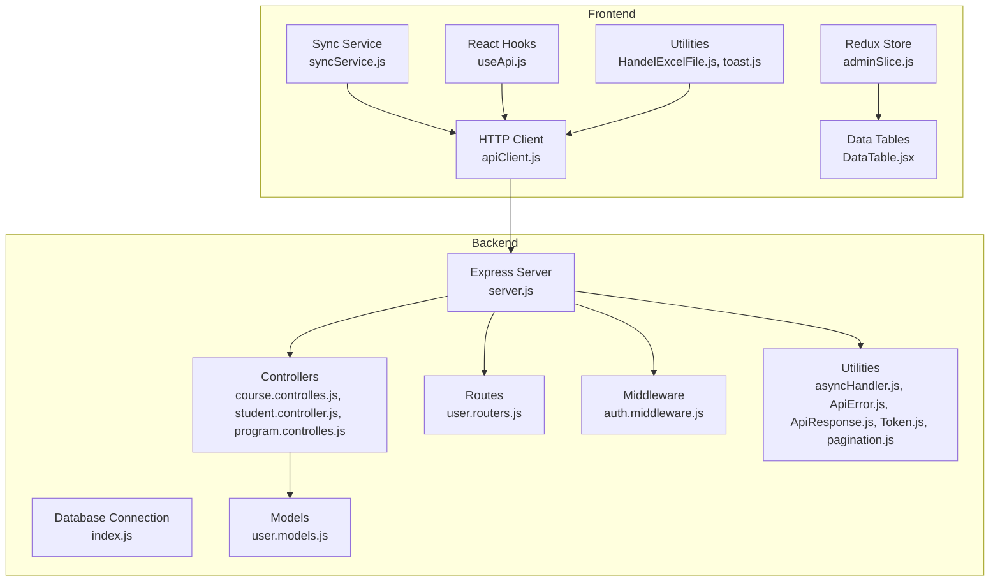

**Diagram sources**
- [server.js:1-106](file://Backend/src/server.js#L1-L106)
- [index.js:1-18](file://Backend/src/index.js#L1-L18)
- [course.controlles.js:1-170](file://Backend/src/controllers/course.controlles.js#L1-L170)
- [student.controller.js:1-235](file://Backend/src/controllers/student.controller.js#L1-L235)
- [program.controlles.js:1-167](file://Backend/src/controllers/program.controlles.js#L1-L167)
- [pagination.js:1-147](file://Backend/src/utils/pagination.js#L1-L147)
- [adminSlice.js:1-201](file://Client/src/store/admin/adminSlice.js#L1-L201)
- [DataTable.jsx:1-563](file://Client/src/components/deshboard/DataTable.jsx#L1-L563)

**Section sources**
- [server.js:1-106](file://Backend/src/server.js#L1-L106)
- [index.js:1-18](file://Backend/src/index.js#L1-L18)
- [package.json:1-27](file://Backend/package.json#L1-L27)
- [package.json:1-37](file://Client/package.json#L1-L37)

## Core Components
This section outlines the primary services and utilities that form the backbone of the system.

- Backend Utilities
  - Async Handler: Simplifies async route handling and transaction support for database operations.
  - API Error and Response: Standardized error and success response formats for consistent API behavior.
  - Authentication Middleware: JWT verification and role-based authorization.
  - Token Utility: JWT generation and verification with cookie configurations.
  - **Enhanced Pagination Utility**: Advanced in-memory and MongoDB-based pagination helpers with search, filtering, and sorting capabilities.

- Frontend Services
  - HTTP Client: Axios-based client with request/response interceptors, caching, retry logic, and offline-aware behavior.
  - Sync Service: Offline-first synchronization with queue management, optimistic updates, and batch operations.
  - React Hooks: Optimized hooks for data fetching, pagination, mutations, and batch operations.
  - **Redux Store**: Centralized state management for master data and pagination metadata.
  - **Data Tables**: Comprehensive table components with search, filter, sort, and pagination controls.

**Section sources**
- [asyncHandler.js:1-47](file://Backend/src/utils/asyncHandler.js#L1-L47)
- [ApiError.js:1-80](file://Backend/src/utils/ApiError.js#L1-L80)
- [ApiResponse.js:1-74](file://Backend/src/utils/ApiResponse.js#L1-L74)
- [auth.middleware.js:1-120](file://Backend/src/middlewares/auth.middleware.js#L1-L120)
- [Token.js:1-68](file://Backend/src/utils/Token.js#L1-L68)
- [pagination.js:1-147](file://Backend/src/utils/pagination.js#L1-L147)
- [adminSlice.js:1-201](file://Client/src/store/admin/adminSlice.js#L1-L201)
- [DataTable.jsx:1-563](file://Client/src/components/deshboard/DataTable.jsx#L1-L563)

## Architecture Overview
The system architecture integrates backend APIs with a robust frontend client designed for performance and resilience. The backend enforces security and consistency through middleware and standardized utilities, while the frontend optimizes user experience with caching, retries, offline synchronization, and reactive data hooks. **The enhanced pagination system provides comprehensive search, filtering, and sorting capabilities with detailed metadata for seamless client-side integration.**

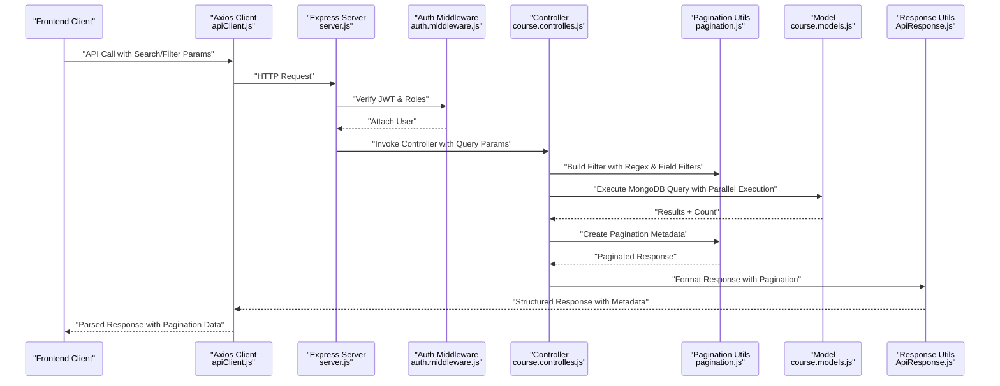

**Diagram sources**
- [apiClient.js:1-220](file://Client/src/services/apiClient.js#L1-L220)
- [server.js:1-106](file://Backend/src/server.js#L1-L106)
- [auth.middleware.js:1-120](file://Backend/src/middlewares/auth.middleware.js#L1-L120)
- [course.controlles.js:45-87](file://Backend/src/controllers/course.controlles.js#L45-L87)
- [pagination.js:101-139](file://Backend/src/utils/pagination.js#L101-L139)
- [ApiResponse.js:1-74](file://Backend/src/utils/ApiResponse.js#L1-L74)

## Detailed Component Analysis

### Backend Utilities

#### Async Handler and Transactions
The async handler wraps route controllers to centralize error handling and supports MongoDB transactions for atomic operations. It enriches errors with request context and ensures consistent error propagation to the global error handler.

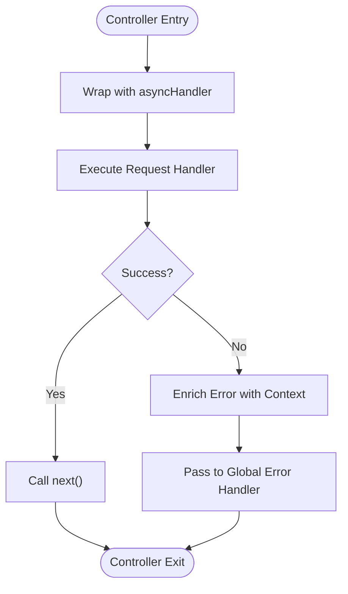

**Diagram sources**
- [asyncHandler.js:8-19](file://Backend/src/utils/asyncHandler.js#L8-L19)
- [asyncHandler.js:25-45](file://Backend/src/utils/asyncHandler.js#L25-L45)

**Section sources**
- [asyncHandler.js:1-47](file://Backend/src/utils/asyncHandler.js#L1-L47)

#### API Error and Response Classes
Standardized error and response classes ensure consistent API behavior across the application. They encapsulate status codes, messages, and metadata, with convenience methods for common HTTP scenarios.

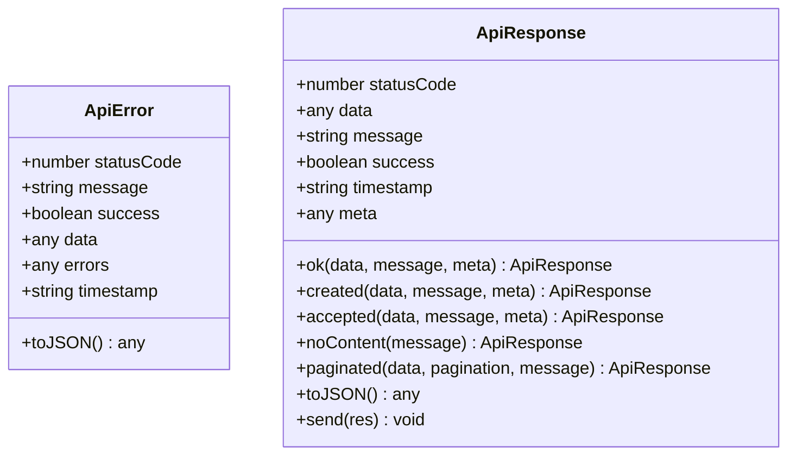

**Diagram sources**
- [ApiError.js:5-26](file://Backend/src/utils/ApiError.js#L5-L26)
- [ApiResponse.js:5-13](file://Backend/src/utils/ApiResponse.js#L5-L13)

**Section sources**
- [ApiError.js:1-80](file://Backend/src/utils/ApiError.js#L1-L80)
- [ApiResponse.js:1-74](file://Backend/src/utils/ApiResponse.js#L1-L74)

#### Authentication and Authorization
JWT-based authentication verifies tokens and attaches user context to requests. Role-based authorization restricts access to protected endpoints, while optional authentication allows graceful handling of missing tokens.

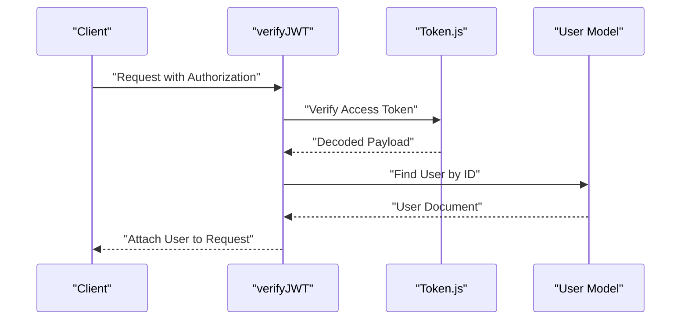

**Diagram sources**
- [auth.middleware.js:7-43](file://Backend/src/middlewares/auth.middleware.js#L7-L43)
- [Token.js:37-43](file://Backend/src/utils/Token.js#L37-L43)
- [user.models.js:95-97](file://Backend/src/models/user.models.js#L95-L97)

**Section sources**
- [auth.middleware.js:1-120](file://Backend/src/middlewares/auth.middleware.js#L1-L120)
- [Token.js:1-68](file://Backend/src/utils/Token.js#L1-L68)
- [user.models.js:1-112](file://Backend/src/models/user.models.js#L1-L112)

### Enhanced Pagination System

**Updated** The pagination system has been comprehensively enhanced with advanced search capabilities, flexible filtering per field, configurable sorting, and improved MongoDB-based pagination utilities.

The enhanced pagination system provides:

- **Advanced Search**: Regex pattern matching with case-insensitive options for intelligent search functionality
- **Flexible Filtering**: Field-specific filters using `filter_` prefix with support for boolean and select types
- **Configurable Sorting**: Dynamic sorting based on `sortBy` and `sortOrder` parameters
- **Parallel Query Execution**: Optimized MongoDB queries using `Promise.all()` for improved performance
- **Comprehensive Metadata**: Detailed pagination information for client-side integration

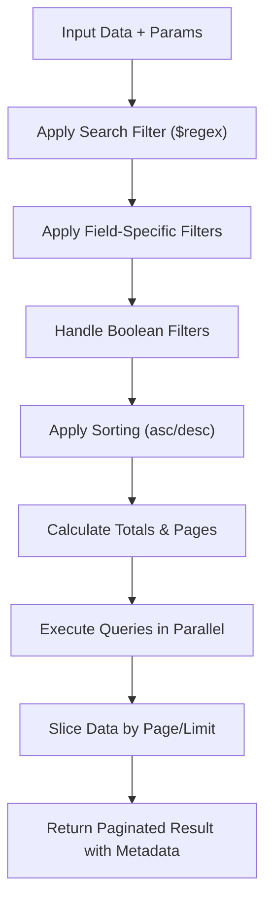

**Diagram sources**
- [pagination.js:13-56](file://Backend/src/utils/pagination.js#L13-L56)
- [pagination.js:101-139](file://Backend/src/utils/pagination.js#L101-L139)

**Section sources**
- [pagination.js:1-147](file://Backend/src/utils/pagination.js#L1-L147)

#### Advanced Search and Filtering

**Updated** Controllers now implement sophisticated search and filtering mechanisms:

- **Regex Pattern Matching**: Case-insensitive search using `$regex` with `$options: "i"`
- **Multi-field Search**: Search across multiple fields simultaneously using `$or` operator
- **Field-specific Filters**: Support for individual field filtering with `filter_` prefix
- **Boolean Filter Handling**: Automatic conversion of string boolean values to actual booleans
- **Dynamic Sort Configuration**: Configurable sorting based on `sortBy` and `sortOrder` parameters

**Section sources**
- [course.controlles.js:45-87](file://Backend/src/controllers/course.controlles.js#L45-L87)
- [student.controller.js:93-137](file://Backend/src/controllers/student.controller.js#L93-L137)
- [program.controlles.js:51-94](file://Backend/src/controllers/program.controlles.js#L51-L94)

### Frontend Services

#### HTTP Client with Caching and Retry
The Axios-based HTTP client implements request/response interceptors for caching, retry logic, offline awareness, and centralized error handling. It also manages request cancellation and performance tracking.

**Diagram sources**
- [apiClient.js:39-85](file://Client/src/services/apiClient.js#L39-L85)
- [apiClient.js:87-159](file://Client/src/services/apiClient.js#L87-L159)

**Section sources**
- [apiClient.js:1-220](file://Client/src/services/apiClient.js#L1-L220)

#### Sync Service for Offline Operations
The Sync Service manages offline-first operations with queue persistence, retry logic, optimistic updates, and batch processing. It notifies subscribers about sync status and handles online/offline transitions gracefully.

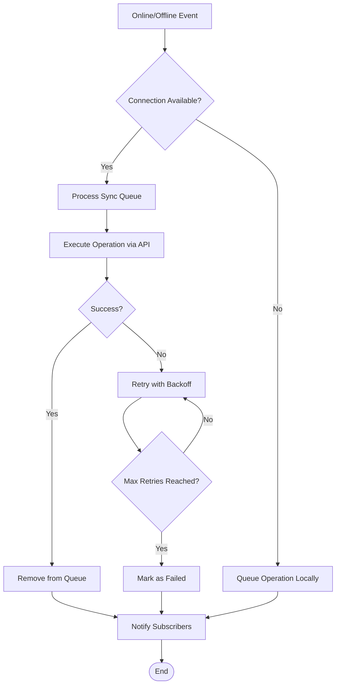

**Diagram sources**
- [syncService.js:33-134](file://Client/src/services/syncService.js#L33-L134)
- [syncService.js:158-231](file://Client/src/services/syncService.js#L158-L231)

**Section sources**
- [syncService.js:1-281](file://Client/src/services/syncService.js#L1-L281)

#### React Hooks for API Interactions
The React hooks provide optimized data fetching, pagination, mutations, and batch operations with built-in caching, cancellation, and error handling. They integrate seamlessly with the HTTP client and cache utilities.

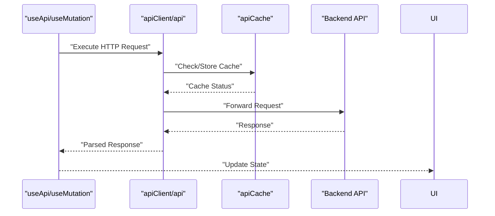

**Diagram sources**
- [useApi.js:39-140](file://Client/src/hooks/useApi.js#L39-L140)
- [useApi.js:223-291](file://Client/src/hooks/useApi.js#L223-L291)
- [apiClient.js:189-217](file://Client/src/services/apiClient.js#L189-L217)

**Section sources**
- [useApi.js:1-373](file://Client/src/hooks/useApi.js#L1-L373)

#### Redux Store for State Management

**Updated** The Redux store manages master data and pagination metadata with comprehensive state handling:

- **Centralized State**: Master data and pagination state managed in a single slice
- **Pagination Integration**: Automatic pagination metadata extraction from API responses
- **Entity-specific Caching**: Separate cache management for different entity types
- **State Persistence**: Automatic state restoration and cleanup

**Section sources**
- [adminSlice.js:1-201](file://Client/src/store/admin/adminSlice.js#L1-L201)

#### Data Tables with Advanced Controls

**Updated** The DataTable component provides comprehensive data management with:

- **Search Controls**: Real-time search with debounced input handling
- **Filter Management**: Dynamic filter dropdowns with unique value detection
- **Sorting Interface**: Click-to-sort functionality with visual indicators
- **Pagination Controls**: Complete pagination interface with page navigation
- **Responsive Design**: Mobile-friendly pagination controls and layout

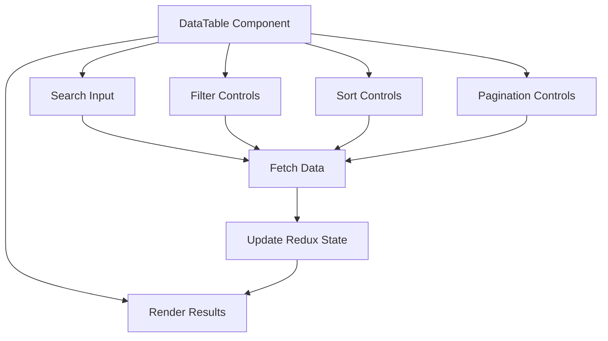

**Diagram sources**
- [DataTable.jsx:1-563](file://Client/src/components/deshboard/DataTable.jsx#L1-L563)
- [adminSlice.js:125-136](file://Client/src/store/admin/adminSlice.js#L125-L136)

**Section sources**
- [DataTable.jsx:1-563](file://Client/src/components/deshboard/DataTable.jsx#L1-L563)

#### Utilities for Excel and Notifications
Excel handling utilities simplify template downloads and file parsing for bulk operations. Toast utilities provide consistent user feedback for operations and API responses.

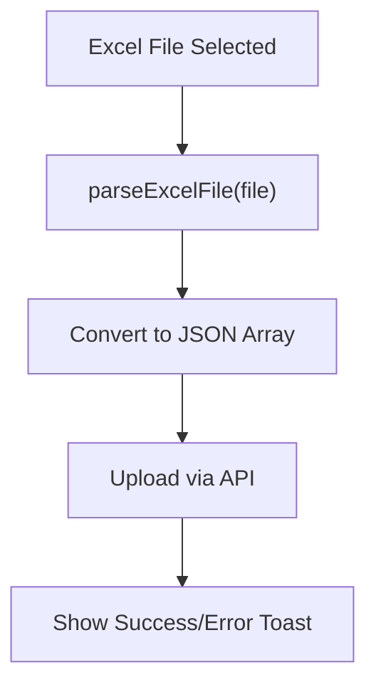

**Diagram sources**
- [HandelExcelFile.js:16-34](file://Client/src/utils/HandelExcelFile.js#L16-L34)
- [toast.js:93-125](file://Client/src/utils/toast.js#L93-L125)

**Section sources**
- [HandelExcelFile.js:1-35](file://Client/src/utils/HandelExcelFile.js#L1-L35)
- [toast.js:1-136](file://Client/src/utils/toast.js#L1-L136)

## Advanced Search and Filtering

**New Section** The enhanced pagination system introduces comprehensive search and filtering capabilities that provide powerful data querying functionality.

### Search Capabilities
- **Regex Pattern Matching**: Uses MongoDB's `$regex` operator with case-insensitive matching (`$options: "i"`)
- **Multi-field Search**: Searches across multiple fields simultaneously using `$or` operator
- **Intelligent Matching**: Supports partial matches and flexible search patterns

### Field-specific Filtering
- **Dynamic Filter Application**: Filters applied based on `filter_` prefixed query parameters
- **Type-aware Filtering**: Automatic handling of boolean, string, and numeric field types
- **Boolean Filter Support**: Converts string boolean values ('true'/'false') to actual boolean types

### Sorting Configuration
- **Flexible Sorting**: Configurable sorting based on any field with ascending/descending order
- **Default Sorting**: Falls back to creation date sorting when no sort parameters provided
- **Performance Optimization**: Efficient sorting algorithms for large datasets

**Section sources**
- [course.controlles.js:45-87](file://Backend/src/controllers/course.controlles.js#L45-L87)
- [student.controller.js:93-137](file://Backend/src/controllers/student.controller.js#L93-L137)
- [program.controlles.js:51-94](file://Backend/src/controllers/program.controlles.js#L51-L94)
- [pagination.js:101-139](file://Backend/src/utils/pagination.js#L101-L139)

## Client-Side Integration

**New Section** The enhanced pagination system provides comprehensive metadata for seamless client-side integration.

### Pagination Metadata
The backend returns detailed pagination information including:
- **Current Page**: Current page number (1-based indexing)
- **Total Pages**: Total number of pages available
- **Total Items**: Total count of items matching filters
- **Items Per Page**: Number of items per page
- **Has Next/Previous**: Navigation flags for pagination controls
- **Index Range**: Start and end indices for current page

### Frontend State Management
The Redux store automatically manages pagination state:
- **Automatic Extraction**: Pagination metadata extracted from API responses
- **State Synchronization**: Client-side pagination state synchronized with server data
- **Cache Integration**: Pagination state preserved across cache operations

### Interactive Controls
The DataTable component provides comprehensive user interaction:
- **Real-time Search**: Immediate search results as users type
- **Dynamic Filters**: Filter dropdowns with unique value detection
- **Visual Feedback**: Clear indication of active filters and search terms
- **Responsive Pagination**: Adaptive pagination controls for different screen sizes

**Section sources**
- [adminSlice.js:125-136](file://Client/src/store/admin/adminSlice.js#L125-L136)
- [DataTable.jsx:1-563](file://Client/src/components/deshboard/DataTable.jsx#L1-L563)

## Dependency Analysis
The backend and frontend services exhibit clear separation of concerns with minimal coupling between modules. The HTTP client depends on the backend API contract, while the Sync Service depends on the HTTP client and browser storage. React hooks depend on the HTTP client and cache utilities. **The enhanced pagination system creates strong dependencies between controllers, pagination utilities, and frontend components for comprehensive data management functionality.**

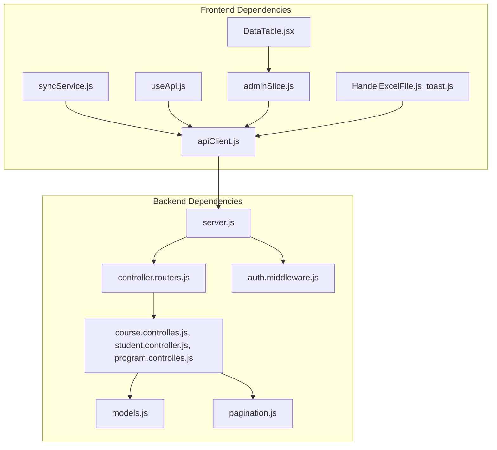

**Diagram sources**
- [server.js:46-103](file://Backend/src/server.js#L46-L103)
- [course.controlles.js:1-170](file://Backend/src/controllers/course.controlles.js#L1-L170)
- [student.controller.js:1-235](file://Backend/src/controllers/student.controller.js#L1-L235)
- [program.controlles.js:1-167](file://Backend/src/controllers/program.controlles.js#L1-L167)
- [pagination.js:1-147](file://Backend/src/utils/pagination.js#L1-L147)
- [adminSlice.js:1-201](file://Client/src/store/admin/adminSlice.js#L1-L201)
- [DataTable.jsx:1-563](file://Client/src/components/deshboard/DataTable.jsx#L1-L563)
- [apiClient.js:1-220](file://Client/src/services/apiClient.js#L1-L220)
- [syncService.js:1-281](file://Client/src/services/syncService.js#L1-L281)
- [useApi.js:1-373](file://Client/src/hooks/useApi.js#L1-L373)
- [HandelExcelFile.js:1-35](file://Client/src/utils/HandelExcelFile.js#L1-L35)
- [toast.js:1-136](file://Client/src/utils/toast.js#L1-L136)

**Section sources**
- [server.js:1-106](file://Backend/src/server.js#L1-L106)
- [course.controlles.js:1-170](file://Backend/src/controllers/course.controlles.js#L1-L170)
- [student.controller.js:1-235](file://Backend/src/controllers/student.controller.js#L1-L235)
- [program.controlles.js:1-167](file://Backend/src/controllers/program.controlles.js#L1-L167)
- [pagination.js:1-147](file://Backend/src/utils/pagination.js#L1-L147)
- [adminSlice.js:1-201](file://Client/src/store/admin/adminSlice.js#L1-L201)
- [DataTable.jsx:1-563](file://Client/src/components/deshboard/DataTable.jsx#L1-L563)

## Performance Considerations
- Backend
  - **Parallel Query Execution**: Use `Promise.all()` for simultaneous data and count queries in pagination utilities
  - **Efficient Indexing**: Ensure proper MongoDB indexes on frequently searched and sorted fields
  - **Optimized Regex Patterns**: Use anchored regex patterns for better performance
  - **Memory Management**: Implement proper pagination limits to prevent memory issues with large datasets
  - **Transaction Support**: Use async handler with transactions for write-heavy operations to maintain data consistency

- Frontend
  - **Caching Strategies**: Utilize caching interceptors to reduce redundant network requests
  - **Debounced Search**: Implement debounced input handling for search functionality to reduce API calls
  - **Virtual Scrolling**: Consider virtual scrolling for large datasets to improve rendering performance
  - **Request Cancellation**: Use request cancellation in React hooks to prevent memory leaks and stale updates
  - **State Optimization**: Optimize Redux state updates to minimize re-renders

## Troubleshooting Guide
- Backend Error Handling
  - Global error handler converts various error types (validation, cast, duplicate key, JWT) into standardized API responses with appropriate status codes and messages.
  - **Pagination Errors**: Check for proper filter construction and query parameter validation.
  - **MongoDB Query Issues**: Verify regex patterns and field names match database schema.

- Frontend Error Handling
  - HTTP client interceptors handle network errors, unauthorized access, and rate limiting with user-friendly notifications.
  - **Pagination Issues**: Verify that pagination metadata is properly extracted and stored in Redux state.
  - **Search Problems**: Check that search parameters are correctly formatted and filters are properly applied.
  - **Sync Service**: Use the Sync Service to diagnose and retry failed operations; inspect the queue and failed operations for root causes.

**Section sources**
- [errorHandler.middleware.js:1-86](file://Backend/src/middlewares/errorHandler.middleware.js#L1-L86)
- [apiClient.js:110-159](file://Client/src/services/apiClient.js#L110-L159)
- [syncService.js:233-261](file://Client/src/services/syncService.js#L233-L261)
- [adminSlice.js:125-136](file://Client/src/store/admin/adminSlice.js#L125-L136)

## Conclusion
The new services and utilities deliver a robust, scalable, and user-friendly foundation for the Timetable Management System. The **enhanced pagination system provides comprehensive search, filtering, and sorting capabilities with detailed metadata for seamless client-side integration**. The backend provides consistent error handling, secure authentication, and efficient data operations, while the frontend offers a performant, resilient, and developer-friendly experience with caching, offline synchronization, and React hooks. Together, they enable rapid development and reliable operation across diverse environments with advanced data management capabilities.