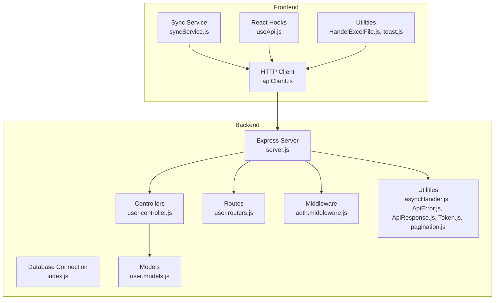
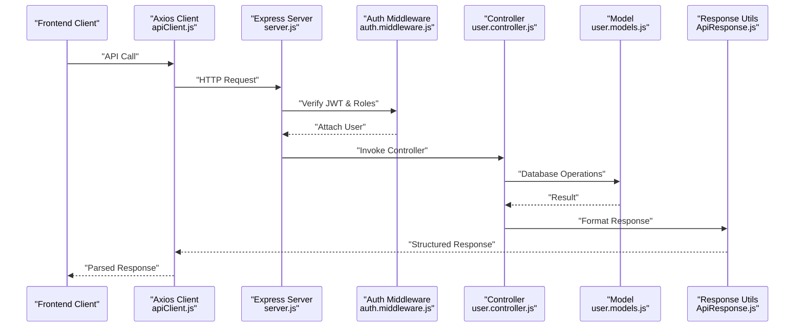
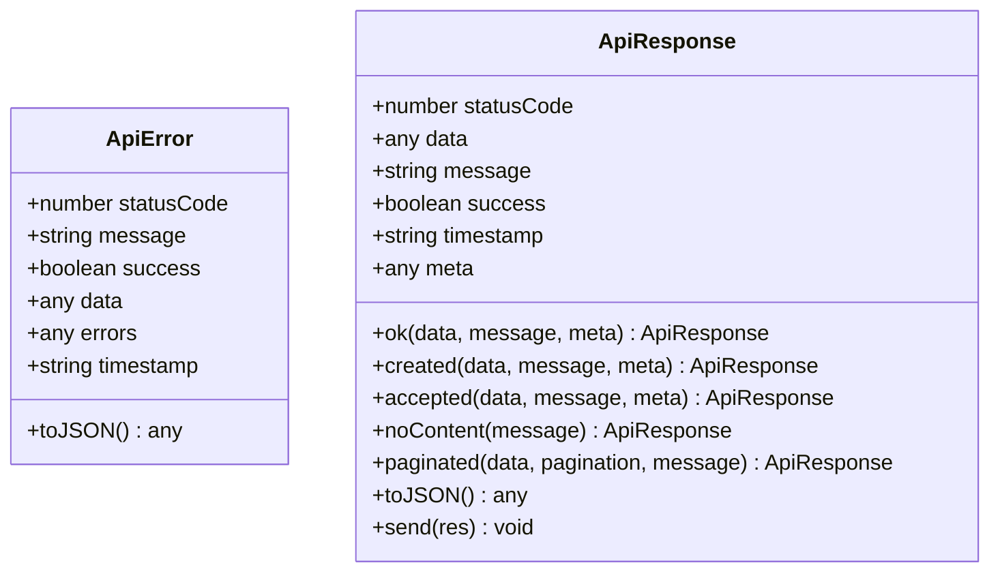
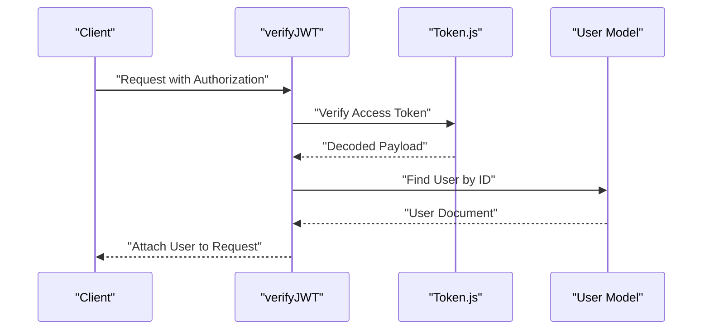
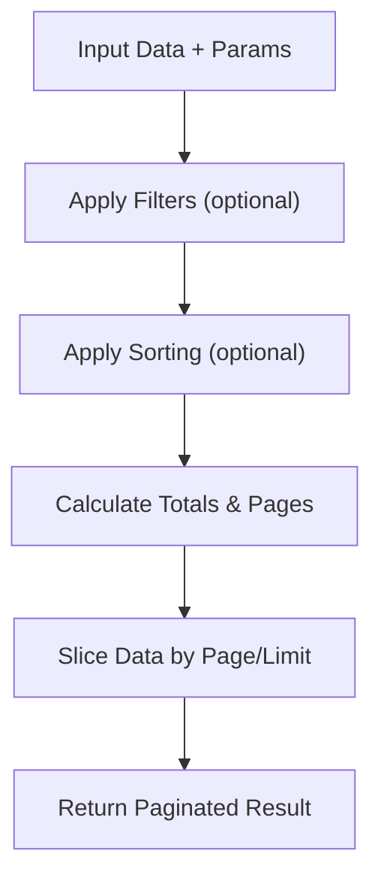
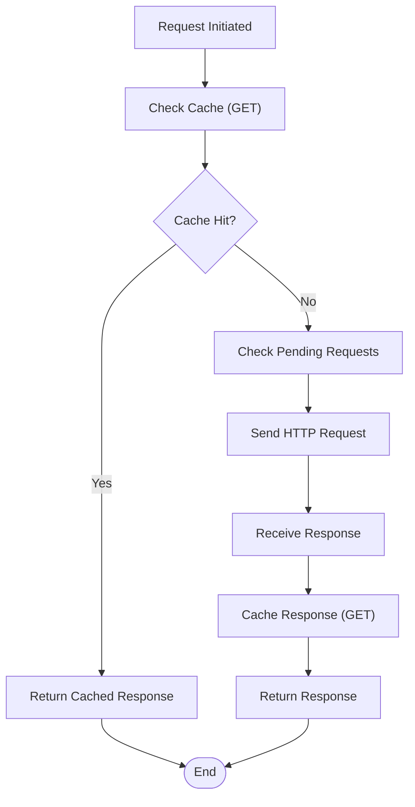
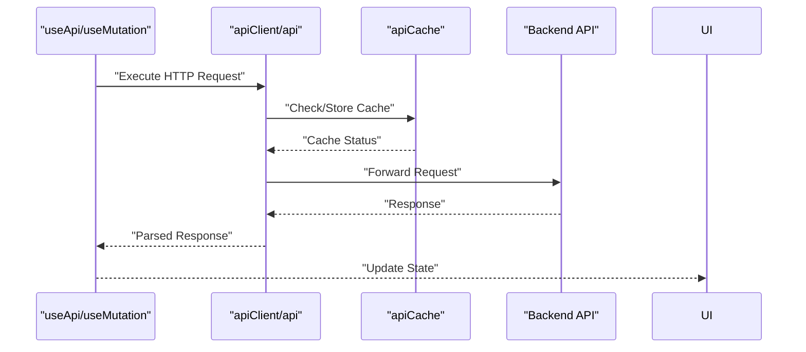
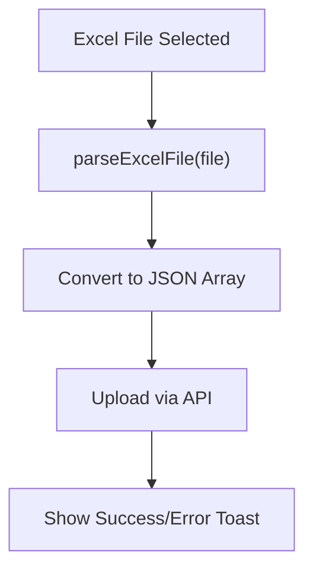
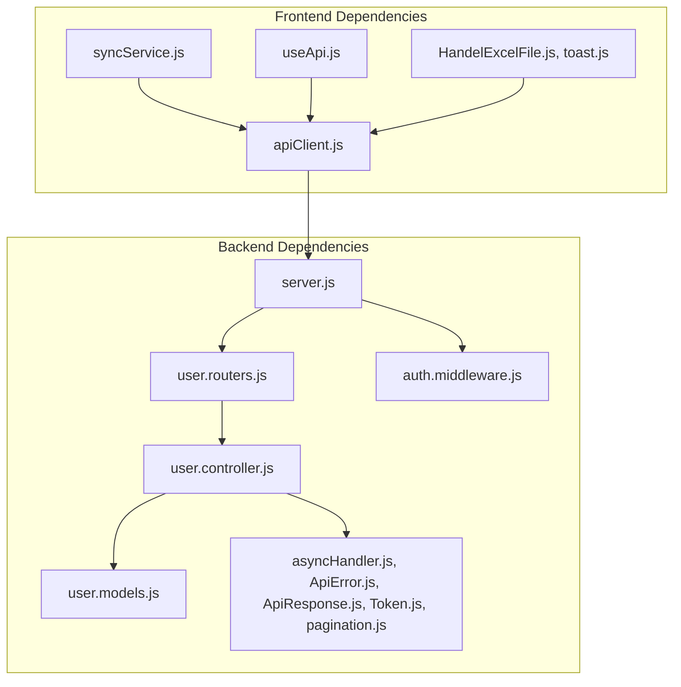

# New Services & Utilities

<cite>
**Referenced Files in This Document**
- [index.js](file://Backend/src/index.js)
- [server.js](file://Backend/src/server.js)
- [package.json](file://Backend/package.json)
- [asyncHandler.js](file://Backend/src/utils/asyncHandler.js)
- [ApiError.js](file://Backend/src/utils/ApiError.js)
- [ApiResponse.js](file://Backend/src/utils/ApiResponse.js)
- [errorHandler.middleware.js](file://Backend/src/middlewares/errorHandler.middleware.js)
- [auth.middleware.js](file://Backend/src/middlewares/auth.middleware.js)
- [Token.js](file://Backend/src/utils/Token.js)
- [user.controller.js](file://Backend/src/controllers/user.controller.js)
- [user.models.js](file://Backend/src/models/user.models.js)
- [user.routers.js](file://Backend/src/routes/user.routers.js)
- [pagination.js](file://Backend/src/utils/pagination.js)
- [apiClient.js](file://Client/src/services/apiClient.js)
- [syncService.js](file://Client/src/services/syncService.js)
- [useApi.js](file://Client/src/hooks/useApi.js)
- [HandelExcelFile.js](file://Client/src/utils/HandelExcelFile.js)
- [toast.js](file://Client/src/utils/toast.js)
- [package.json](file://Client/package.json)
</cite>

## Table of Contents
1. [Introduction](#introduction)
2. [Project Structure](#project-structure)
3. [Core Components](#core-components)
4. [Architecture Overview](#architecture-overview)
5. [Detailed Component Analysis](#detailed-component-analysis)
6. [Dependency Analysis](#dependency-analysis)
7. [Performance Considerations](#performance-considerations)
8. [Troubleshooting Guide](#troubleshooting-guide)
9. [Conclusion](#conclusion)

## Introduction
This document provides comprehensive documentation for the new services and utilities implemented in the Timetable Management System. It covers backend utilities for error handling, API responses, authentication, and pagination, alongside frontend services for HTTP client optimization, offline synchronization, and React hooks for efficient data fetching and manipulation. The goal is to enable developers to understand, integrate, and extend these services effectively while maintaining consistency and reliability across the application.

## Project Structure
The project follows a modular structure with clear separation between backend and frontend concerns:
- Backend: Express server with modular controllers, models, routes, middleware, and utility modules for error handling, API responses, authentication, and pagination.
- Frontend: React-based client with Axios-based HTTP client, synchronization service for offline operations, and React hooks for API interactions and UI feedback.

**Diagram sources**
- [server.js:1-106](file://Backend/src/server.js#L1-L106)
- [index.js:1-18](file://Backend/src/index.js#L1-L18)
- [user.controller.js:1-576](file://Backend/src/controllers/user.controller.js#L1-L576)
- [user.models.js:1-112](file://Backend/src/models/user.models.js#L1-L112)
- [user.routers.js:1-39](file://Backend/src/routes/user.routers.js#L1-L39)
- [auth.middleware.js:1-120](file://Backend/src/middlewares/auth.middleware.js#L1-L120)
- [asyncHandler.js:1-47](file://Backend/src/utils/asyncHandler.js#L1-L47)
- [ApiError.js:1-80](file://Backend/src/utils/ApiError.js#L1-L80)
- [ApiResponse.js:1-74](file://Backend/src/utils/ApiResponse.js#L1-L74)
- [Token.js:1-68](file://Backend/src/utils/Token.js#L1-L68)
- [pagination.js:1-147](file://Backend/src/utils/pagination.js#L1-L147)
- [apiClient.js:1-220](file://Client/src/services/apiClient.js#L1-L220)
- [syncService.js:1-281](file://Client/src/services/syncService.js#L1-L281)
- [useApi.js:1-373](file://Client/src/hooks/useApi.js#L1-L373)
- [HandelExcelFile.js:1-35](file://Client/src/utils/HandelExcelFile.js#L1-L35)
- [toast.js:1-136](file://Client/src/utils/toast.js#L1-L136)

**Section sources**
- [server.js:1-106](file://Backend/src/server.js#L1-L106)
- [index.js:1-18](file://Backend/src/index.js#L1-L18)
- [package.json:1-27](file://Backend/package.json#L1-L27)
- [package.json:1-37](file://Client/package.json#L1-L37)

## Core Components
This section outlines the primary services and utilities that form the backbone of the system.

- Backend Utilities
  - Async Handler: Simplifies async route handling and transaction support for database operations.
  - API Error and Response: Standardized error and success response formats for consistent API behavior.
  - Authentication Middleware: JWT verification and role-based authorization.
  - Token Utility: JWT generation and verification with cookie configurations.
  - Pagination Utility: In-memory and MongoDB-based pagination helpers.

- Frontend Services
  - HTTP Client: Axios-based client with request/response interceptors, caching, retry logic, and offline-aware behavior.
  - Sync Service: Offline-first synchronization with queue management, optimistic updates, and batch operations.
  - React Hooks: Optimized hooks for data fetching, pagination, mutations, and batch operations.
  - Utilities: Excel file handling and toast notifications for user feedback.

**Section sources**
- [asyncHandler.js:1-47](file://Backend/src/utils/asyncHandler.js#L1-L47)
- [ApiError.js:1-80](file://Backend/src/utils/ApiError.js#L1-L80)
- [ApiResponse.js:1-74](file://Backend/src/utils/ApiResponse.js#L1-L74)
- [auth.middleware.js:1-120](file://Backend/src/middlewares/auth.middleware.js#L1-L120)
- [Token.js:1-68](file://Backend/src/utils/Token.js#L1-L68)
- [pagination.js:1-147](file://Backend/src/utils/pagination.js#L1-L147)
- [apiClient.js:1-220](file://Client/src/services/apiClient.js#L1-L220)
- [syncService.js:1-281](file://Client/src/services/syncService.js#L1-L281)
- [useApi.js:1-373](file://Client/src/hooks/useApi.js#L1-L373)
- [HandelExcelFile.js:1-35](file://Client/src/utils/HandelExcelFile.js#L1-L35)
- [toast.js:1-136](file://Client/src/utils/toast.js#L1-L136)

## Architecture Overview
The system architecture integrates backend APIs with a robust frontend client designed for performance and resilience. The backend enforces security and consistency through middleware and standardized utilities, while the frontend optimizes user experience with caching, retries, offline synchronization, and reactive data hooks.

**Diagram sources**
- [apiClient.js:1-220](file://Client/src/services/apiClient.js#L1-L220)
- [server.js:1-106](file://Backend/src/server.js#L1-L106)
- [auth.middleware.js:1-120](file://Backend/src/middlewares/auth.middleware.js#L1-L120)
- [user.controller.js:1-576](file://Backend/src/controllers/user.controller.js#L1-L576)
- [user.models.js:1-112](file://Backend/src/models/user.models.js#L1-L112)
- [ApiResponse.js:1-74](file://Backend/src/utils/ApiResponse.js#L1-L74)

## Detailed Component Analysis

### Backend Utilities

#### Async Handler and Transactions
The async handler wraps route controllers to centralize error handling and supports MongoDB transactions for atomic operations. It enriches errors with request context and ensures consistent error propagation to the global error handler.

**Diagram sources**
- [asyncHandler.js:8-19](file://Backend/src/utils/asyncHandler.js#L8-L19)
- [asyncHandler.js:25-45](file://Backend/src/utils/asyncHandler.js#L25-L45)

**Section sources**
- [asyncHandler.js:1-47](file://Backend/src/utils/asyncHandler.js#L1-L47)

#### API Error and Response Classes
Standardized error and response classes ensure consistent API behavior across the application. They encapsulate status codes, messages, and metadata, with convenience methods for common HTTP scenarios.

**Diagram sources**
- [ApiError.js:5-26](file://Backend/src/utils/ApiError.js#L5-L26)
- [ApiResponse.js:5-13](file://Backend/src/utils/ApiResponse.js#L5-L13)

**Section sources**
- [ApiError.js:1-80](file://Backend/src/utils/ApiError.js#L1-L80)
- [ApiResponse.js:1-74](file://Backend/src/utils/ApiResponse.js#L1-L74)

#### Authentication and Authorization
JWT-based authentication verifies tokens and attaches user context to requests. Role-based authorization restricts access to protected endpoints, while optional authentication allows graceful handling of missing tokens.

**Diagram sources**
- [auth.middleware.js:7-43](file://Backend/src/middlewares/auth.middleware.js#L7-L43)
- [Token.js:37-43](file://Backend/src/utils/Token.js#L37-L43)
- [user.models.js:95-97](file://Backend/src/models/user.models.js#L95-L97)

**Section sources**
- [auth.middleware.js:1-120](file://Backend/src/middlewares/auth.middleware.js#L1-L120)
- [Token.js:1-68](file://Backend/src/utils/Token.js#L1-L68)
- [user.models.js:1-112](file://Backend/src/models/user.models.js#L1-L112)

#### Pagination Utilities
The pagination utilities provide flexible pagination for both in-memory datasets and MongoDB queries, supporting filtering, sorting, and header creation for paginated responses.

**Diagram sources**
- [pagination.js:13-56](file://Backend/src/utils/pagination.js#L13-L56)
- [pagination.js:101-139](file://Backend/src/utils/pagination.js#L101-L139)

**Section sources**
- [pagination.js:1-147](file://Backend/src/utils/pagination.js#L1-L147)

### Frontend Services

#### HTTP Client with Caching and Retry
The Axios-based HTTP client implements request/response interceptors for caching, retry logic, offline awareness, and centralized error handling. It also manages request cancellation and performance tracking.

**Diagram sources**
- [apiClient.js:39-85](file://Client/src/services/apiClient.js#L39-L85)
- [apiClient.js:87-159](file://Client/src/services/apiClient.js#L87-L159)

**Section sources**
- [apiClient.js:1-220](file://Client/src/services/apiClient.js#L1-L220)

#### Sync Service for Offline Operations
The Sync Service manages offline-first operations with queue persistence, retry logic, optimistic updates, and batch processing. It notifies subscribers about sync status and handles online/offline transitions gracefully.

**Diagram sources**
- [syncService.js:33-134](file://Client/src/services/syncService.js#L33-L134)
- [syncService.js:158-231](file://Client/src/services/syncService.js#L158-L231)

**Section sources**
- [syncService.js:1-281](file://Client/src/services/syncService.js#L1-L281)

#### React Hooks for API Interactions
The React hooks provide optimized data fetching, pagination, mutations, and batch operations with built-in caching, cancellation, and error handling. They integrate seamlessly with the HTTP client and cache utilities.

**Diagram sources**
- [useApi.js:39-140](file://Client/src/hooks/useApi.js#L39-L140)
- [useApi.js:223-291](file://Client/src/hooks/useApi.js#L223-L291)
- [apiClient.js:189-217](file://Client/src/services/apiClient.js#L189-L217)

**Section sources**
- [useApi.js:1-373](file://Client/src/hooks/useApi.js#L1-L373)

#### Utilities for Excel and Notifications
Excel handling utilities simplify template downloads and file parsing for bulk operations. Toast utilities provide consistent user feedback for operations and API responses.

**Diagram sources**
- [HandelExcelFile.js:16-34](file://Client/src/utils/HandelExcelFile.js#L16-L34)
- [toast.js:93-125](file://Client/src/utils/toast.js#L93-L125)

**Section sources**
- [HandelExcelFile.js:1-35](file://Client/src/utils/HandelExcelFile.js#L1-L35)
- [toast.js:1-136](file://Client/src/utils/toast.js#L1-L136)

## Dependency Analysis
The backend and frontend services exhibit clear separation of concerns with minimal coupling between modules. The HTTP client depends on the backend API contract, while the Sync Service depends on the HTTP client and browser storage. React hooks depend on the HTTP client and cache utilities.

**Diagram sources**
- [server.js:46-103](file://Backend/src/server.js#L46-L103)
- [user.routers.js:1-39](file://Backend/src/routes/user.routers.js#L1-L39)
- [user.controller.js:1-576](file://Backend/src/controllers/user.controller.js#L1-L576)
- [user.models.js:1-112](file://Backend/src/models/user.models.js#L1-L112)
- [auth.middleware.js:1-120](file://Backend/src/middlewares/auth.middleware.js#L1-L120)
- [apiClient.js:1-220](file://Client/src/services/apiClient.js#L1-L220)
- [syncService.js:1-281](file://Client/src/services/syncService.js#L1-L281)
- [useApi.js:1-373](file://Client/src/hooks/useApi.js#L1-L373)
- [HandelExcelFile.js:1-35](file://Client/src/utils/HandelExcelFile.js#L1-L35)
- [toast.js:1-136](file://Client/src/utils/toast.js#L1-L136)

**Section sources**
- [server.js:1-106](file://Backend/src/server.js#L1-L106)
- [user.routers.js:1-39](file://Backend/src/routes/user.routers.js#L1-L39)
- [apiClient.js:1-220](file://Client/src/services/apiClient.js#L1-L220)

## Performance Considerations
- Backend
  - Use async handler with transactions for write-heavy operations to maintain data consistency.
  - Leverage pagination utilities to reduce payload sizes and improve responsiveness.
  - Apply compression middleware to minimize bandwidth usage.

- Frontend
  - Utilize caching interceptors to reduce redundant network requests.
  - Implement retry logic with exponential backoff for resilient network operations.
  - Use request cancellation in React hooks to prevent memory leaks and stale updates.
  - Employ optimistic updates with rollback capabilities for improved perceived performance.

[No sources needed since this section provides general guidance]

## Troubleshooting Guide
- Backend Error Handling
  - Global error handler converts various error types (validation, cast, duplicate key, JWT) into standardized API responses with appropriate status codes and messages.
  - Ensure proper logging in development mode for debugging.

- Frontend Error Handling
  - HTTP client interceptors handle network errors, unauthorized access, and rate limiting with user-friendly notifications.
  - Use the Sync Service to diagnose and retry failed operations; inspect the queue and failed operations for root causes.

**Section sources**
- [errorHandler.middleware.js:1-86](file://Backend/src/middlewares/errorHandler.middleware.js#L1-L86)
- [apiClient.js:110-159](file://Client/src/services/apiClient.js#L110-L159)
- [syncService.js:233-261](file://Client/src/services/syncService.js#L233-L261)

## Conclusion
The new services and utilities deliver a robust, scalable, and user-friendly foundation for the Timetable Management System. The backend provides consistent error handling, secure authentication, and efficient data operations, while the frontend offers a performant, resilient, and developer-friendly experience with caching, offline synchronization, and React hooks. Together, they enable rapid development and reliable operation across diverse environments.