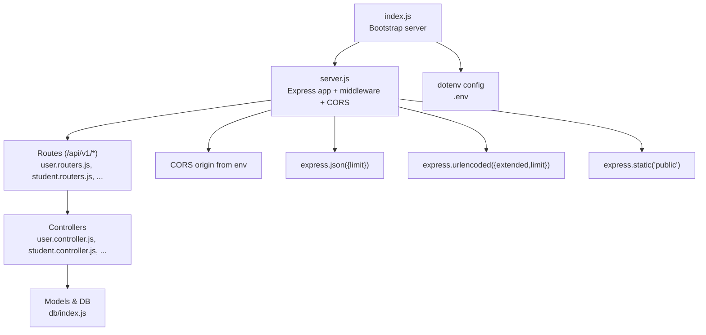
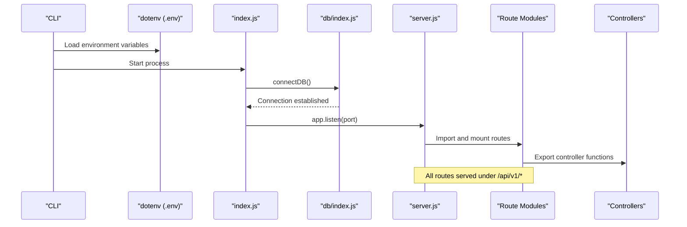
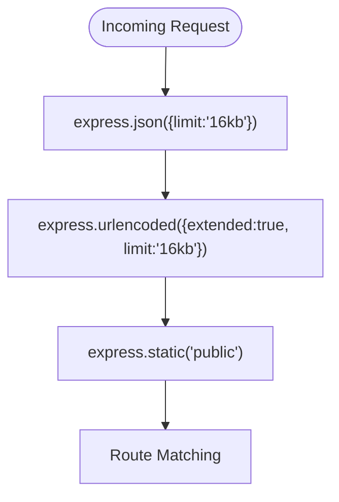
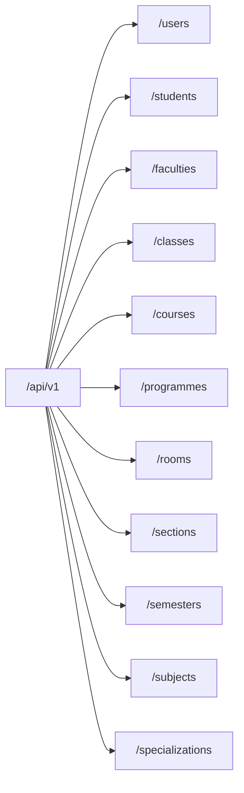
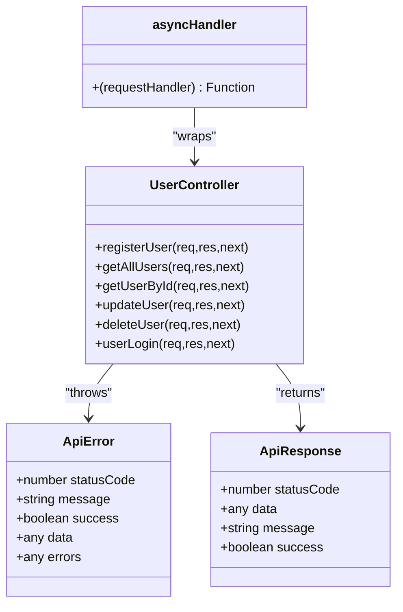
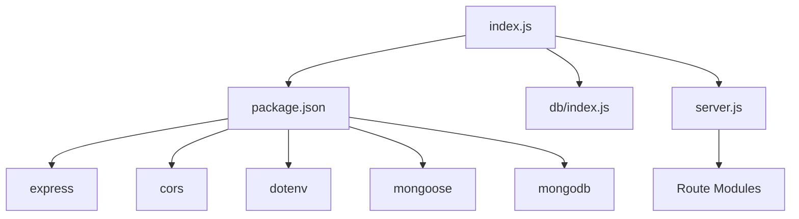

# Server Setup & Configuration

<cite>
**Referenced Files in This Document**
- [index.js](file://Backend/src/index.js)
- [server.js](file://Backend/src/server.js)
- [package.json](file://Backend/package.json)
- [db/index.js](file://Backend/src/db/index.js)
- [constenets.js](file://Backend/src/constenets.js)
- [user.routers.js](file://Backend/src/routes/user.routers.js)
- [user.controller.js](file://Backend/src/controllers/user.controller.js)
- [student.routers.js](file://Backend/src/routes/student.routers.js)
- [student.controller.js](file://Backend/src/controllers/student.controller.js)
- [asyncHandler.js](file://Backend/src/utils/asyncHandler.js)
- [ApiError.js](file://Backend/src/utils/ApiError.js)
- [ApiResponse.js](file://Backend/src/utils/ApiResponse.js)
</cite>

## Table of Contents
1. [Introduction](#introduction)
2. [Project Structure](#project-structure)
3. [Core Components](#core-components)
4. [Architecture Overview](#architecture-overview)
5. [Detailed Component Analysis](#detailed-component-analysis)
6. [Dependency Analysis](#dependency-analysis)
7. [Performance Considerations](#performance-considerations)
8. [Troubleshooting Guide](#troubleshooting-guide)
9. [Conclusion](#conclusion)
10. [Appendices](#appendices)

## Introduction
This document explains the Express.js server setup and configuration for the backend. It covers server initialization, CORS configuration with environment variables, middleware setup (JSON parsing, URL encoding, static file serving), route registration under the /api/v1 base path, environment variable management, and operational guidance for development and production. Practical examples show how to add new routes, configure security headers, handle different content types, manage request size limits, and prepare for production deployments.

## Project Structure
The backend follows a modular Express architecture:
- Entry point initializes environment variables, connects to the database, and starts the server.
- The Express application is configured centrally with middleware and CORS.
- Routes are grouped by domain resource and mounted under /api/v1.
- Controllers encapsulate business logic and use shared utilities for consistent error and response handling.
- Environment variables are loaded via dotenv and consumed by server, database, and CORS configuration.

**Diagram sources**
- [index.js:1-18](file://Backend/src/index.js#L1-L18)
- [server.js:1-54](file://Backend/src/server.js#L1-L54)
- [user.routers.js:1-19](file://Backend/src/routes/user.routers.js#L1-L19)
- [student.routers.js:1-209](file://Backend/src/routes/student.routers.js#L1-L209)
- [db/index.js:1-19](file://Backend/src/db/index.js#L1-L19)

**Section sources**
- [index.js:1-18](file://Backend/src/index.js#L1-L18)
- [server.js:1-54](file://Backend/src/server.js#L1-L54)
- [package.json:1-22](file://Backend/package.json#L1-L22)

## Core Components
- Express application and middleware pipeline:
  - CORS enabled with origin from environment variable and credentials support.
  - JSON body parsing with a 16 KB limit.
  - URL-encoded body parsing with extended encoding and a 16 KB limit.
  - Static asset serving from the public directory.
- Route registration:
  - All routes are mounted under /api/v1 with resource-specific prefixes.
- Environment variable management:
  - dotenv loads variables from .env at startup.
  - CORS origin, MongoDB URI, and optional port are read from environment.
- Database connectivity:
  - Mongoose connection using environment-provided MongoDB URI and a fixed database name constant.

**Section sources**
- [server.js:14-23](file://Backend/src/server.js#L14-L23)
- [server.js:40-50](file://Backend/src/server.js#L40-L50)
- [index.js:5-6](file://Backend/src/index.js#L5-L6)
- [db/index.js:6-7](file://Backend/src/db/index.js#L6-L7)
- [constenets.js:1](file://Backend/src/constenets.js#L1)

## Architecture Overview
The server bootstraps by loading environment variables, connecting to MongoDB, and listening on a configured port. Middleware applies globally to all requests. Route modules export Express routers that define endpoint patterns and HTTP methods. Controllers implement request handlers using async wrappers and standardized error/response utilities.

**Diagram sources**
- [index.js:5-17](file://Backend/src/index.js#L5-L17)
- [db/index.js:4-16](file://Backend/src/db/index.js#L4-L16)
- [server.js:26-50](file://Backend/src/server.js#L26-L50)
- [user.routers.js:12-18](file://Backend/src/routes/user.routers.js#L12-L18)

## Detailed Component Analysis

### Express Application Initialization and Bootstrap
- Environment loading:
  - dotenv reads variables from .env during startup.
  - Port is set locally for convenience; production typically uses environment variables.
- Database connection:
  - connectDB uses Mongoose to establish a persistent connection.
  - On failure, logs an error and exits the process.
- Server startup:
  - The app listens on the configured port after successful DB connection.
  - Error events are captured to log database connection failures.

**Diagram sources**
- [index.js:5-17](file://Backend/src/index.js#L5-L17)
- [db/index.js:4-16](file://Backend/src/db/index.js#L4-L16)

**Section sources**
- [index.js:5-17](file://Backend/src/index.js#L5-L17)
- [db/index.js:4-16](file://Backend/src/db/index.js#L4-L16)

### CORS Configuration and Environment Variable Handling
- CORS is initialized with origin from process.env.CORS_ORIGIN and credentials enabled.
- Logging confirms the origin value at runtime.
- For production, ensure CORS_ORIGIN is set to the frontend domain(s) and consider restricting credentials usage.

**Diagram sources**
- [server.js:14-19](file://Backend/src/server.js#L14-L19)

**Section sources**
- [server.js:6](file://Backend/src/server.js#L6)
- [server.js:14-19](file://Backend/src/server.js#L14-L19)

### Middleware Setup: JSON, URL Encoding, Static Files
- JSON parsing with a 16 KB limit prevents oversized payloads.
- URL-encoded parsing with extended: true supports nested objects and a 16 KB limit.
- Static assets served from the public directory for client-side resources.

**Diagram sources**
- [server.js:21-23](file://Backend/src/server.js#L21-L23)

**Section sources**
- [server.js:21-23](file://Backend/src/server.js#L21-L23)

### Route Registration System and Base Path Organization
- All routes are imported and mounted under /api/v1 with resource-specific prefixes.
- Example mounts include users, students, faculties, classes, courses, programmes, rooms, sections, semesters, subjects, and specializations.

**Diagram sources**
- [server.js:40-50](file://Backend/src/server.js#L40-L50)

**Section sources**
- [server.js:26-50](file://Backend/src/server.js#L26-L50)

### Adding New Routes: Practical Example
Steps to add a new route module:
1. Create a new router file under routes/ with an Express Router instance.
2. Define route patterns and HTTP methods mapped to controller functions.
3. Export the router as default.
4. Import the new router in server.js.
5. Mount the router under /api/v1 with an appropriate base path.

Example reference paths:
- Router definition and exports: [user.routers.js:12-18](file://Backend/src/routes/user.routers.js#L12-L18)
- Route mounting in server: [server.js:40-50](file://Backend/src/server.js#L40-L50)

**Section sources**
- [user.routers.js:12-18](file://Backend/src/routes/user.routers.js#L12-L18)
- [server.js:26-50](file://Backend/src/server.js#L26-L50)

### Content Types and Request Size Limits
- JSON payloads are parsed with a 16 KB limit.
- URL-encoded payloads are parsed with extended encoding and a 16 KB limit.
- To accept larger payloads, increase the limit values in the middleware configuration.
- For multipart/form-data, integrate multer and place it before route handlers that require file uploads.

**Section sources**
- [server.js:21-23](file://Backend/src/server.js#L21-L23)

### Security Headers Configuration
- Add helmet to enforce secure headers (e.g., Content-Security-Policy, X-Frame-Options).
- Configure strict TLS and HSTS in production environments.
- Restrict CORS origins to trusted domains and avoid enabling credentials unless necessary.

[No sources needed since this section provides general guidance]

### Environment Variables Management
- Load variables from .env using dotenv at startup.
- Typical variables include CORS_ORIGIN, MONGODB_URI, and optional PORT.
- Keep sensitive values out of version control and use CI/CD secrets for production.

**Section sources**
- [index.js:5](file://Backend/src/index.js#L5)
- [server.js:6](file://Backend/src/server.js#L6)
- [db/index.js:6-7](file://Backend/src/db/index.js#L6-L7)

### Error Handling and Response Utilities
- Centralized error and response utilities enable consistent API responses.
- asyncHandler wraps route handlers to automatically forward errors to Express error middleware.
- ApiError and ApiResponse standardize error and success payloads.

**Diagram sources**
- [ApiError.js:1-21](file://Backend/src/utils/ApiError.js#L1-L21)
- [ApiResponse.js:1-10](file://Backend/src/utils/ApiResponse.js#L1-L10)
- [asyncHandler.js:1-4](file://Backend/src/utils/asyncHandler.js#L1-L4)
- [user.controller.js:8-81](file://Backend/src/controllers/user.controller.js#L8-L81)

**Section sources**
- [ApiError.js:1-21](file://Backend/src/utils/ApiError.js#L1-L21)
- [ApiResponse.js:1-10](file://Backend/src/utils/ApiResponse.js#L1-L10)
- [asyncHandler.js:1-4](file://Backend/src/utils/asyncHandler.js#L1-L4)
- [user.controller.js:8-81](file://Backend/src/controllers/user.controller.js#L8-L81)

### Example: Adding a New Endpoint Under /api/v1
- Create a new router file and define routes with HTTP methods.
- Map routes to controller functions.
- Import and mount the router in server.js under /api/v1.

Reference paths:
- Router creation and exports: [student.routers.js:12-18](file://Backend/src/routes/student.routers.js#L12-L18)
- Controller implementation: [student.controller.js:7-91](file://Backend/src/controllers/student.controller.js#L7-L91)
- Route mounting: [server.js:40-50](file://Backend/src/server.js#L40-L50)

**Section sources**
- [student.routers.js:12-18](file://Backend/src/routes/student.routers.js#L12-L18)
- [student.controller.js:7-91](file://Backend/src/controllers/student.controller.js#L7-L91)
- [server.js:26-50](file://Backend/src/server.js#L26-L50)

## Dependency Analysis
- Runtime dependencies include Express, CORS, dotenv, Mongoose, and MongoDB driver.
- Scripts define development and testing commands using nodemon and dotenv configuration.
- The server depends on environment variables for CORS origin and MongoDB URI.

**Diagram sources**
- [package.json:14-20](file://Backend/package.json#L14-L20)
- [index.js:1-3](file://Backend/src/index.js#L1-L3)
- [db/index.js:1](file://Backend/src/db/index.js#L1)
- [server.js:1-5](file://Backend/src/server.js#L1-L5)

**Section sources**
- [package.json:14-20](file://Backend/package.json#L14-L20)
- [index.js:1-3](file://Backend/src/index.js#L1-L3)

## Performance Considerations
- Body size limits:
  - Current JSON and URL-encoded limits are 16 KB. Increase as needed for bulk operations.
- Compression:
  - Enable compression middleware for reducing payload sizes.
- Rate limiting:
  - Integrate rate-limiting middleware to protect endpoints from abuse.
- Database queries:
  - Use pagination and selective projections in controllers to reduce payload sizes.
- Static assets:
  - Serve compressed static assets and leverage browser caching.

[No sources needed since this section provides general guidance]

## Troubleshooting Guide
- CORS errors:
  - Verify CORS_ORIGIN matches the frontend origin and credentials usage aligns with your needs.
- Database connection failures:
  - Confirm MONGODB_URI and database name constant are correct; check network and authentication.
- Port conflicts:
  - Change the port in the bootstrap file or use an environment variable for production.
- Large payload rejections:
  - Increase express.json and express.urlencoded limits in the middleware configuration.

**Section sources**
- [server.js:6](file://Backend/src/server.js#L6)
- [db/index.js:6-7](file://Backend/src/db/index.js#L6-L7)
- [server.js:21-23](file://Backend/src/server.js#L21-L23)

## Conclusion
The backend employs a clean, modular Express setup with centralized middleware, environment-driven CORS configuration, and organized route modules under /api/v1. Robust error and response utilities ensure consistent API behavior. By adjusting body limits, adding security headers, and following production best practices, the server can be hardened and scaled effectively.

[No sources needed since this section summarizes without analyzing specific files]

## Appendices

### Production Deployment Checklist
- Set environment variables for CORS_ORIGIN, MONGODB_URI, and PORT.
- Use a reverse proxy or platform service for HTTPS termination and load balancing.
- Enable compression and caching for static assets.
- Monitor database connections and implement health checks.
- Use process managers and logging for reliability.

[No sources needed since this section provides general guidance]