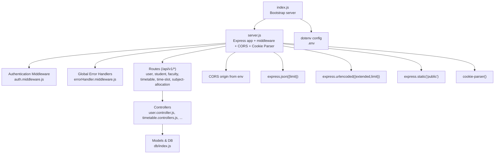
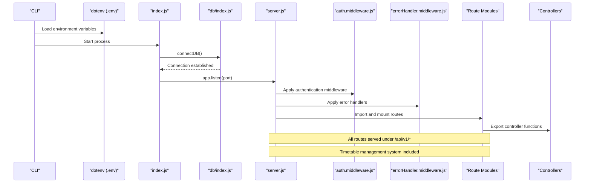
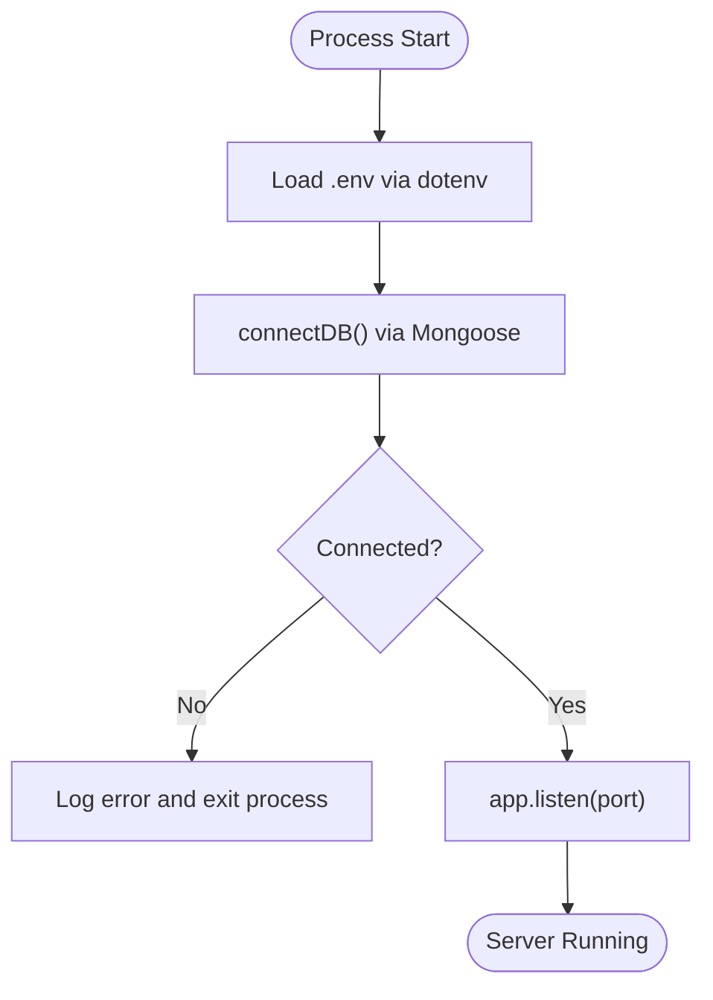
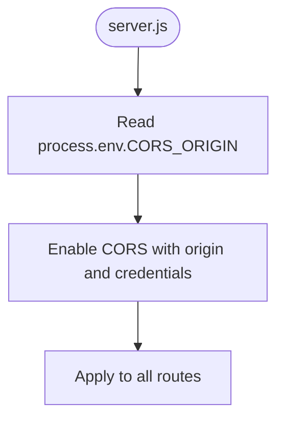
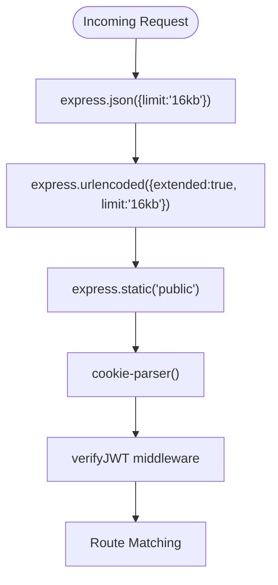
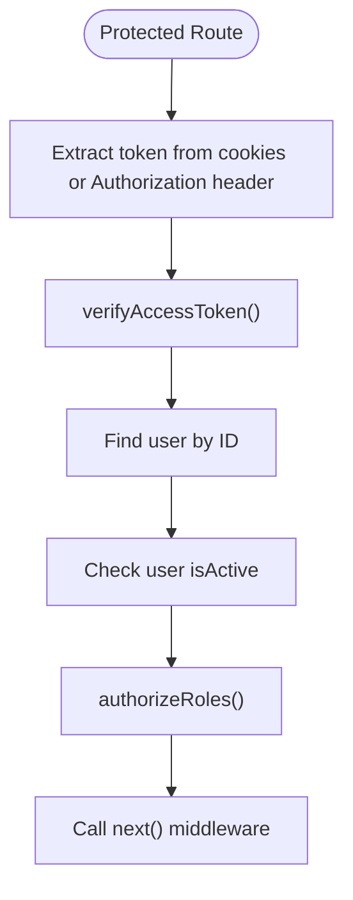
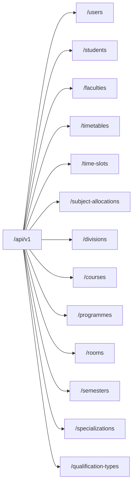
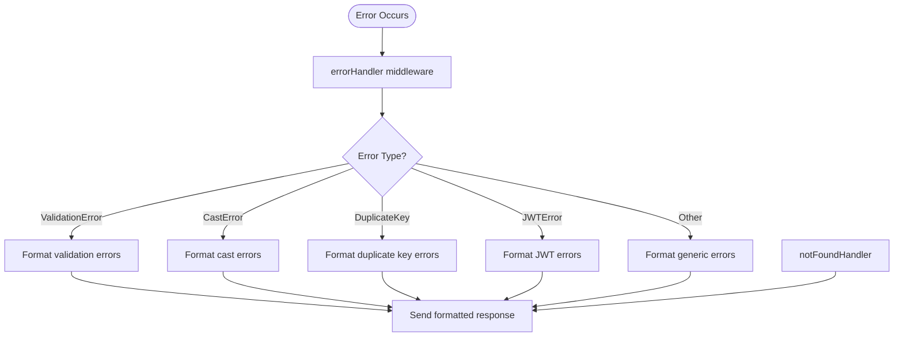
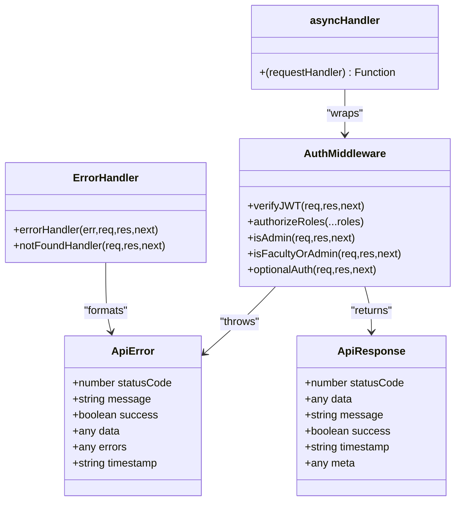
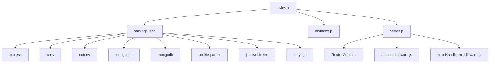

# Server Setup & Configuration

<cite>
**Referenced Files in This Document**
- [index.js](file://Backend/src/index.js)
- [server.js](file://Backend/src/server.js)
- [package.json](file://Backend/package.json)
- [db/index.js](file://Backend/src/db/index.js)
- [constenets.js](file://Backend/src/constenets.js)
- [user.routers.js](file://Backend/src/routes/user.routers.js)
- [timetable.routers.js](file://Backend/src/routes/timetable.routers.js)
- [student.routers.js](file://Backend/src/routes/student.routers.js)
- [faculty.routers.js](file://Backend/src/routes/faculty.routers.js)
- [subjectAllocation.routers.js](file://Backend/src/routes/subjectAllocation.routers.js)
- [auth.middleware.js](file://Backend/src/middlewares/auth.middleware.js)
- [errorHandler.middleware.js](file://Backend/src/middlewares/errorHandler.middleware.js)
- [user.controller.js](file://Backend/src/controllers/user.controller.js)
- [timetable.controllers.js](file://Backend/src/controllers/timetable.controllers.js)
- [student.controller.js](file://Backend/src/controllers/student.controller.js)
- [ApiError.js](file://Backend/src/utils/ApiError.js)
- [ApiResponse.js](file://Backend/src/utils/ApiResponse.js)
- [asyncHandler.js](file://Backend/src/utils/asyncHandler.js)
</cite>

## Update Summary
**Changes Made**
- Added comprehensive middleware integration including cookie parsing support
- Enhanced route organization under /api/v1/ namespace with expanded timetable management system
- Integrated authentication middleware with role-based access control
- Added global error handling and 404 not found handling
- Expanded route coverage to include timetable, time slots, and subject allocation management
- Implemented health check endpoint and API root endpoint

## Table of Contents
1. [Introduction](#introduction)
2. [Project Structure](#project-structure)
3. [Core Components](#core-components)
4. [Architecture Overview](#architecture-overview)
5. [Detailed Component Analysis](#detailed-component-analysis)
6. [Dependency Analysis](#dependency-analysis)
7. [Performance Considerations](#performance-considerations)
8. [Troubleshooting Guide](#troubleshooting-guide)
9. [Conclusion](#conclusion)
10. [Appendices](#appendices)

## Introduction
This document explains the Express.js server setup and configuration for the Timetable Management System backend. It covers server initialization, CORS configuration with environment variables, comprehensive middleware integration including cookie parsing, route registration under the /api/v1 base path, authentication middleware with role-based access control, global error handling, and operational guidance for development and production. The system now includes an expanded timetable management system with dedicated routes for timetables, time slots, subject allocations, and enhanced middleware chain for robust request processing.

## Project Structure
The backend follows a modular Express architecture with comprehensive middleware integration:
- Entry point initializes environment variables, connects to the database, and starts the server
- The Express application is configured centrally with CORS, JSON parsing, URL encoding, static file serving, and cookie parsing middleware
- Authentication middleware provides JWT verification and role-based access control
- Routes are grouped by domain resources and mounted under /api/v1 with expanded timetable management coverage
- Global error handling middleware ensures consistent error responses across all endpoints
- Controllers encapsulate business logic and use shared utilities for consistent error and response handling
- Environment variables are loaded via dotenv and consumed by server, database, and CORS configuration

**Diagram sources**
- [index.js:1-18](file://Backend/src/index.js#L1-L18)
- [server.js:1-84](file://Backend/src/server.js#L1-L84)
- [auth.middleware.js:1-120](file://Backend/src/middlewares/auth.middleware.js#L1-L120)
- [errorHandler.middleware.js:1-86](file://Backend/src/middlewares/errorHandler.middleware.js#L1-L86)
- [user.routers.js:1-39](file://Backend/src/routes/user.routers.js#L1-L39)
- [timetable.routers.js:1-21](file://Backend/src/routes/timetable.routers.js#L1-L21)
- [db/index.js:1-19](file://Backend/src/db/index.js#L1-L19)

**Section sources**
- [index.js:1-18](file://Backend/src/index.js#L1-L18)
- [server.js:1-84](file://Backend/src/server.js#L1-L84)
- [package.json:1-25](file://Backend/package.json#L1-L25)

## Core Components
- Express application and middleware pipeline:
  - CORS enabled with origin from environment variable and credentials support
  - JSON body parsing with a 16 KB limit
  - URL-encoded body parsing with extended encoding and a 16 KB limit
  - Static asset serving from the public directory
  - Cookie parsing support for JWT token extraction
- Authentication middleware:
  - JWT token verification from cookies or Authorization header
  - Role-based access control with admin, faculty, coordinator, and hod roles
  - Optional authentication for non-required protected routes
- Route registration:
  - All routes are mounted under /api/v1 with comprehensive resource coverage
  - Expanded timetable management system with dedicated endpoints
- Global error handling:
  - Centralized error handler for consistent API error responses
  - 404 not found handler for undefined routes
- Environment variable management:
  - dotenv loads variables from .env at startup
  - CORS origin, MongoDB URI, and optional port are read from environment
- Database connectivity:
  - Mongoose connection using environment-provided MongoDB URI and a fixed database name constant

**Section sources**
- [server.js:12-22](file://Backend/src/server.js#L12-L22)
- [server.js:41-54](file://Backend/src/server.js#L41-L54)
- [auth.middleware.js:6-120](file://Backend/src/middlewares/auth.middleware.js#L6-L120)
- [errorHandler.middleware.js:7-86](file://Backend/src/middlewares/errorHandler.middleware.js#L7-L86)
- [index.js:5-6](file://Backend/src/index.js#L5-L6)
- [db/index.js:6-7](file://Backend/src/db/index.js#L6-L7)
- [constenets.js:1](file://Backend/src/constenets.js#L1)

## Architecture Overview
The server bootstraps by loading environment variables, connecting to MongoDB, and listening on a configured port. The enhanced middleware pipeline applies globally to all requests, including authentication and error handling. Route modules export Express routers that define endpoint patterns and HTTP methods with integrated authentication middleware. Controllers implement request handlers using async wrappers and standardized error/response utilities. The system now includes comprehensive timetable management with dedicated routes for timetables, time slots, and subject allocations.

**Diagram sources**
- [index.js:5-17](file://Backend/src/index.js#L5-L17)
- [db/index.js:4-16](file://Backend/src/db/index.js#L4-L16)
- [server.js:26-84](file://Backend/src/server.js#L26-L84)
- [auth.middleware.js:6-43](file://Backend/src/middlewares/auth.middleware.js#L6-L43)
- [errorHandler.middleware.js:7-86](file://Backend/src/middlewares/errorHandler.middleware.js#L7-L86)

## Detailed Component Analysis

### Express Application Initialization and Bootstrap
- Environment loading:
  - dotenv reads variables from .env during startup
  - Port is set locally for convenience; production typically uses environment variables
- Database connection:
  - connectDB uses Mongoose to establish a persistent connection
  - On failure, logs an error and exits the process
- Server startup:
  - The app listens on the configured port after successful DB connection
  - Error events are captured to log database connection failures

**Diagram sources**
- [index.js:5-17](file://Backend/src/index.js#L5-L17)
- [db/index.js:4-16](file://Backend/src/db/index.js#L4-L16)

**Section sources**
- [index.js:5-17](file://Backend/src/index.js#L5-L17)
- [db/index.js:4-16](file://Backend/src/db/index.js#L4-L16)

### CORS Configuration and Environment Variable Handling
- CORS is initialized with origin from process.env.CORS_ORIGIN and credentials enabled
- Logging confirms the origin value at runtime
- For production, ensure CORS_ORIGIN is set to the frontend domain(s) and consider restricting credentials usage

**Diagram sources**
- [server.js:12-17](file://Backend/src/server.js#L12-L17)

**Section sources**
- [server.js:12-17](file://Backend/src/server.js#L12-L17)

### Enhanced Middleware Setup: JSON, URL Encoding, Static Files, and Cookie Parsing
- JSON parsing with a 16 KB limit prevents oversized payloads
- URL-encoded parsing with extended: true supports nested objects and a 16 KB limit
- Static assets served from the public directory for client-side resources
- Cookie parsing support enables JWT token extraction from request cookies
- Authentication middleware handles token verification and user authorization

**Diagram sources**
- [server.js:19-22](file://Backend/src/server.js#L19-L22)
- [auth.middleware.js:6-43](file://Backend/src/middlewares/auth.middleware.js#L6-L43)

**Section sources**
- [server.js:19-22](file://Backend/src/server.js#L19-L22)
- [auth.middleware.js:6-43](file://Backend/src/middlewares/auth.middleware.js#L6-L43)

### Authentication Middleware and Role-Based Access Control
- JWT token verification from cookies or Authorization header
- Role-based access control supporting admin, faculty, coordinator, and hod roles
- Optional authentication for non-required protected routes
- User activity validation and account status checking

**Diagram sources**
- [auth.middleware.js:6-43](file://Backend/src/middlewares/auth.middleware.js#L6-L43)
- [auth.middleware.js:46-61](file://Backend/src/middlewares/auth.middleware.js#L46-L61)

**Section sources**
- [auth.middleware.js:6-43](file://Backend/src/middlewares/auth.middleware.js#L6-L43)
- [auth.middleware.js:46-61](file://Backend/src/middlewares/auth.middleware.js#L46-L61)

### Route Registration System and Expanded Base Path Organization
- All routes are imported and mounted under /api/v1 with comprehensive resource coverage
- Expanded timetable management system includes dedicated endpoints for:
  - Timetables: CRUD operations for timetable entries
  - Time Slots: Management of time slot configurations
  - Subject Allocations: Assignment of subjects to faculty members
  - Additional resources: Users, Students, Faculties, Divisions, Courses, Programmes, Rooms, Semesters, Specializations, Qualification Types

**Diagram sources**
- [server.js:25-54](file://Backend/src/server.js#L25-L54)

**Section sources**
- [server.js:25-54](file://Backend/src/server.js#L25-L54)

### Global Error Handling and 404 Not Found Handling
- Centralized error handler converts various error types to consistent API responses
- Handles Mongoose validation errors, cast errors, duplicate key errors, and JWT errors
- 404 handler for undefined routes with proper error formatting
- Development mode includes stack traces for debugging

**Diagram sources**
- [errorHandler.middleware.js:7-86](file://Backend/src/middlewares/errorHandler.middleware.js#L7-L86)

**Section sources**
- [errorHandler.middleware.js:7-86](file://Backend/src/middlewares/errorHandler.middleware.js#L7-L86)

### Adding New Routes: Practical Example with Authentication
Steps to add a new authenticated route module:
1. Create a new router file under routes/ with an Express Router instance
2. Import required authentication middleware (verifyJWT, authorizeRoles)
3. Define route patterns and HTTP methods with authentication middleware
4. Export the router as default
5. Import the new router in server.js
6. Mount the router under /api/v1 with an appropriate base path

Example reference paths:
- Router definition with authentication: [user.routers.js:21-36](file://Backend/src/routes/user.routers.js#L21-L36)
- Route mounting in server: [server.js:41-42](file://Backend/src/server.js#L41-L42)

**Section sources**
- [user.routers.js:21-36](file://Backend/src/routes/user.routers.js#L21-L36)
- [server.js:41-42](file://Backend/src/server.js#L41-L42)

### Content Types and Request Size Limits
- JSON payloads are parsed with a 16 KB limit
- URL-encoded payloads are parsed with extended encoding and a 16 KB limit
- Cookie parsing supports JWT token extraction from request cookies
- To accept larger payloads, increase the limit values in the middleware configuration
- For multipart/form-data, integrate multer and place it before route handlers that require file uploads

**Section sources**
- [server.js:19-22](file://Backend/src/server.js#L19-L22)

### Security Headers Configuration
- Add helmet to enforce secure headers (e.g., Content-Security-Policy, X-Frame-Options)
- Configure strict TLS and HSTS in production environments
- Restrict CORS origins to trusted domains and avoid enabling credentials unless necessary
- Implement rate limiting middleware for additional protection

### Environment Variables Management
- Load variables from .env using dotenv at startup
- Typical variables include CORS_ORIGIN, MONGODB_URI, and optional PORT
- Keep sensitive values out of version control and use CI/CD secrets for production

**Section sources**
- [index.js:5](file://Backend/src/index.js#L5)
- [server.js:12-17](file://Backend/src/server.js#L12-L17)
- [db/index.js:6-7](file://Backend/src/db/index.js#L6-L7)

### Error Handling and Response Utilities
- Centralized error and response utilities enable consistent API responses
- asyncHandler wraps route handlers to automatically forward errors to Express error middleware
- ApiError and ApiResponse standardize error and success payloads
- Comprehensive error type handling for database operations and JWT validation

**Diagram sources**
- [ApiError.js:5-80](file://Backend/src/utils/ApiError.js#L5-L80)
- [ApiResponse.js:5-74](file://Backend/src/utils/ApiResponse.js#L5-L74)
- [auth.middleware.js:6-120](file://Backend/src/middlewares/auth.middleware.js#L6-L120)
- [errorHandler.middleware.js:7-86](file://Backend/src/middlewares/errorHandler.middleware.js#L7-L86)

**Section sources**
- [ApiError.js:5-80](file://Backend/src/utils/ApiError.js#L5-L80)
- [ApiResponse.js:5-74](file://Backend/src/utils/ApiResponse.js#L5-L74)
- [auth.middleware.js:6-120](file://Backend/src/middlewares/auth.middleware.js#L6-L120)
- [errorHandler.middleware.js:7-86](file://Backend/src/middlewares/errorHandler.middleware.js#L7-L86)

### Example: Adding a New Timetable Management Endpoint Under /api/v1
- Create a new router file for timetable management and define routes with HTTP methods
- Map routes to controller functions for timetable CRUD operations
- Import and mount the router in server.js under /api/v1/timetables
- Implement controller functions with proper error handling and response formatting

Reference paths:
- Timetable router creation: [timetable.routers.js:12-18](file://Backend/src/routes/timetable.routers.js#L12-L18)
- Timetable controller implementation: [timetable.controllers.js](file://Backend/src/controllers/timetable.controllers.js)
- Route mounting: [server.js:52](file://Backend/src/server.js#L52)

**Section sources**
- [timetable.routers.js:12-18](file://Backend/src/routes/timetable.routers.js#L12-L18)
- [timetable.controllers.js](file://Backend/src/controllers/timetable.controllers.js)
- [server.js:52](file://Backend/src/server.js#L52)

## Dependency Analysis
- Runtime dependencies include Express, CORS, dotenv, Mongoose, MongoDB driver, and cookie-parser
- Scripts define development and testing commands using nodemon and dotenv configuration
- The server depends on environment variables for CORS origin and MongoDB URI
- Authentication middleware requires jsonwebtoken for token verification

**Diagram sources**
- [package.json:14-23](file://Backend/package.json#L14-L23)
- [index.js:1-3](file://Backend/src/index.js#L1-L3)
- [db/index.js:1](file://Backend/src/db/index.js#L1)
- [server.js:1-8](file://Backend/src/server.js#L1-L8)

**Section sources**
- [package.json:14-23](file://Backend/package.json#L14-L23)
- [index.js:1-3](file://Backend/src/index.js#L1-L3)

## Performance Considerations
- Body size limits:
  - Current JSON and URL-encoded limits are 16 KB. Increase as needed for bulk operations
  - Cookie parsing overhead should be considered for high-traffic scenarios
- Compression:
  - Enable compression middleware for reducing payload sizes
- Rate limiting:
  - Integrate rate-limiting middleware to protect endpoints from abuse
- Database queries:
  - Use pagination and selective projections in controllers to reduce payload sizes
  - Implement proper indexing for frequently queried timetable and allocation data
- Static assets:
  - Serve compressed static assets and leverage browser caching
- Authentication performance:
  - Cache user data appropriately and implement efficient token verification
  - Consider implementing token blacklisting for enhanced security

## Troubleshooting Guide
- CORS errors:
  - Verify CORS_ORIGIN matches the frontend origin and credentials usage aligns with your needs
- Database connection failures:
  - Confirm MONGODB_URI and database name constant are correct; check network and authentication
- Port conflicts:
  - Change the port in the bootstrap file or use an environment variable for production
- Large payload rejections:
  - Increase express.json and express.urlencoded limits in the middleware configuration
- Authentication issues:
  - Verify JWT tokens are properly formatted and not expired
  - Check cookie settings for cross-origin requests
- Route not found errors:
  - Ensure routes are properly mounted under /api/v1 with correct base paths
  - Verify controller functions are exported correctly from route files

**Section sources**
- [server.js:12-17](file://Backend/src/server.js#L12-L17)
- [db/index.js:6-7](file://Backend/src/db/index.js#L6-L7)
- [server.js:19-22](file://Backend/src/server.js#L19-L22)
- [auth.middleware.js:6-43](file://Backend/src/middlewares/auth.middleware.js#L6-L43)

## Conclusion
The backend employs a comprehensive, modular Express setup with centralized middleware, environment-driven CORS configuration, cookie parsing support, authentication middleware with role-based access control, and organized route modules under /api/v1. The expanded timetable management system provides dedicated endpoints for timetables, time slots, and subject allocations. Robust global error handling and response utilities ensure consistent API behavior. By adjusting body limits, adding security headers, implementing proper authentication, and following production best practices, the server can be hardened and scaled effectively for the Timetable Management System.

## Appendices

### Production Deployment Checklist
- Set environment variables for CORS_ORIGIN, MONGODB_URI, and PORT
- Use a reverse proxy or platform service for HTTPS termination and load balancing
- Enable compression and caching for static assets
- Monitor database connections and implement health checks
- Use process managers and logging for reliability
- Implement proper JWT token security and cookie settings
- Set up proper CORS configuration for production domains
- Configure rate limiting and security headers for production environments

### Enhanced Route Coverage Matrix
The system now includes comprehensive coverage for the Timetable Management System:

| Resource Category | Routes Available | Authentication Required |
|-------------------|------------------|----------------------|
| User Management | /api/v1/users | Admin only |
| Student Management | /api/v1/students | Faculty/HOD |
| Faculty Management | /api/v1/faculties | Faculty/HOD |
| Timetable Management | /api/v1/timetables | Faculty/HOD |
| Time Slot Management | /api/v1/time-slots | Faculty/HOD |
| Subject Allocation | /api/v1/subject-allocations | Faculty/HOD |
| Division Management | /api/v1/divisions | Admin |
| Course Management | /api/v1/courses | Admin |
| Programme Management | /api/v1/programmes | Admin |
| Room Management | /api/v1/rooms | Admin |
| Semester Management | /api/v1/semesters | Admin |
| Specialization Management | /api/v1/specializations | Admin |
| Qualification Type | /api/v1/qualification-types | Admin |

### API Endpoints Reference
- Health Check: GET /health
- API Root: GET /api/v1
- Authentication: POST /api/v1/users/login
- Token Refresh: POST /api/v1/users/refresh-token
- User Management: POST/GET/PUT/DELETE /api/v1/users/:id
- Timetable Operations: POST/GET/PUT/DELETE /api/v1/timetables/:id
- Time Slot Operations: POST/GET/PUT/DELETE /api/v1/time-slots/:id
- Subject Allocation: POST/GET/PUT/DELETE /api/v1/subject-allocations/:id