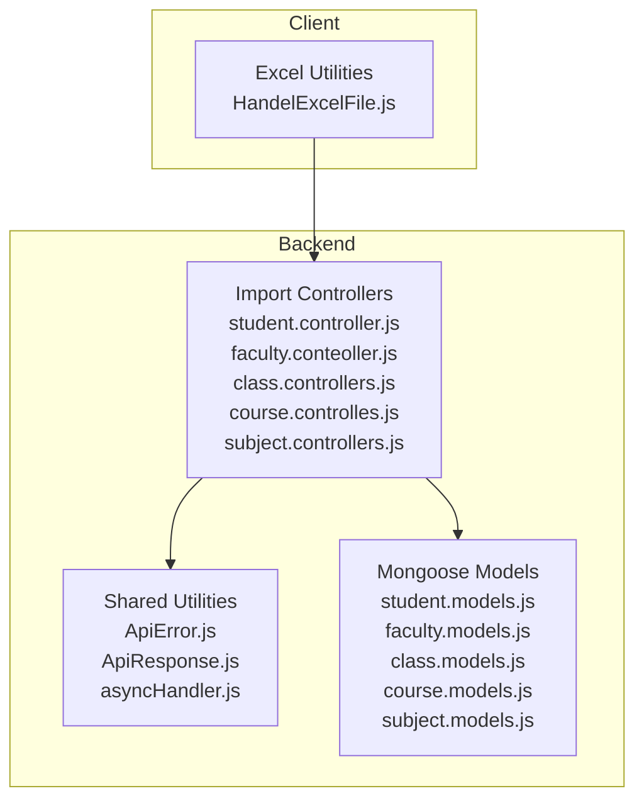
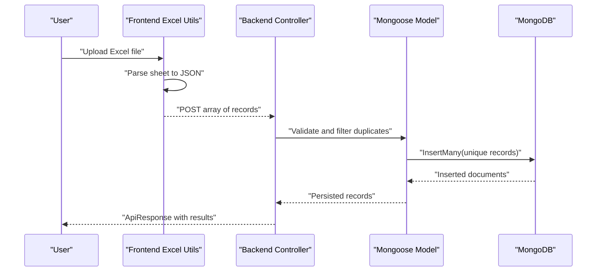
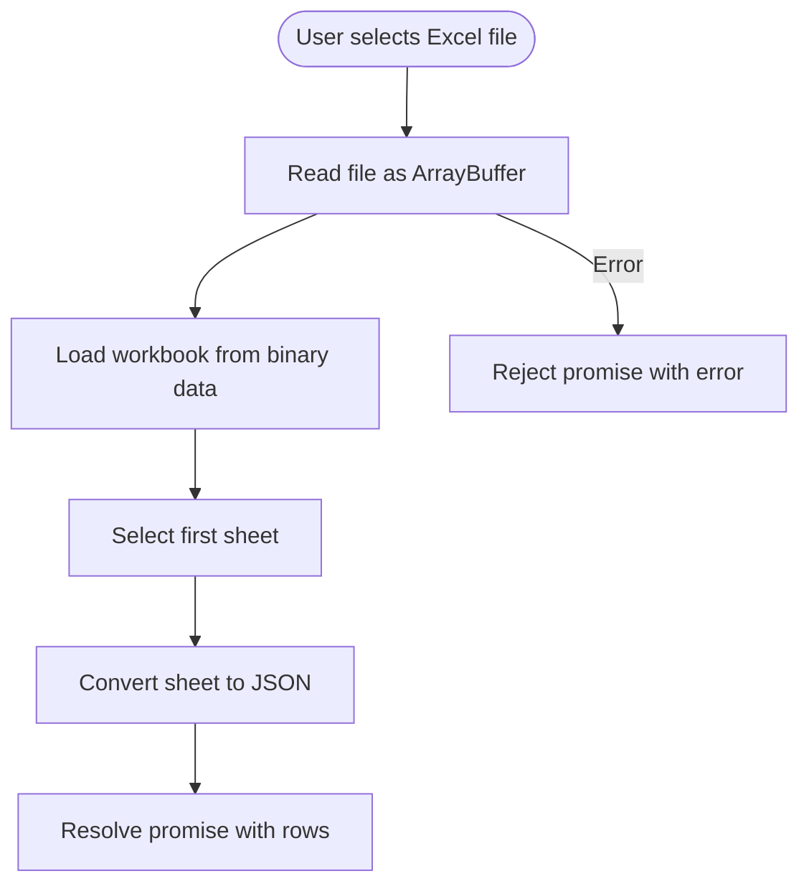
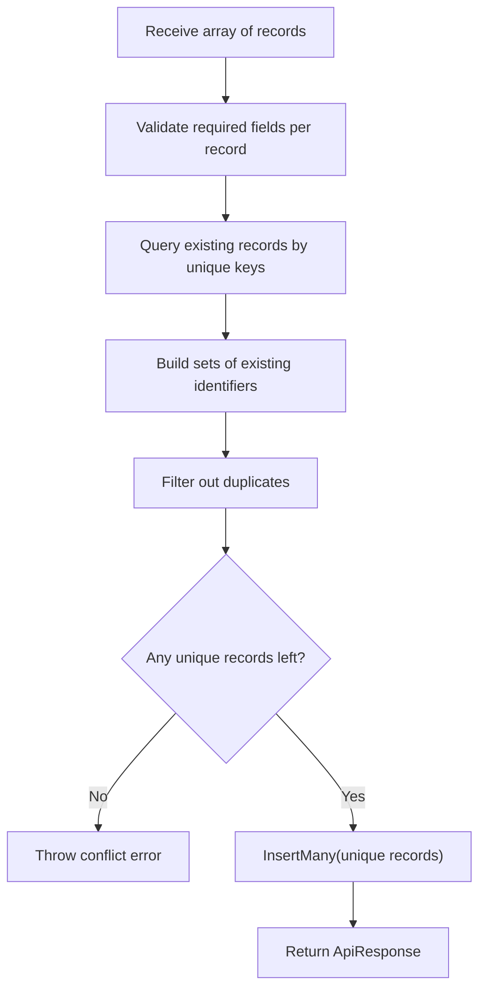
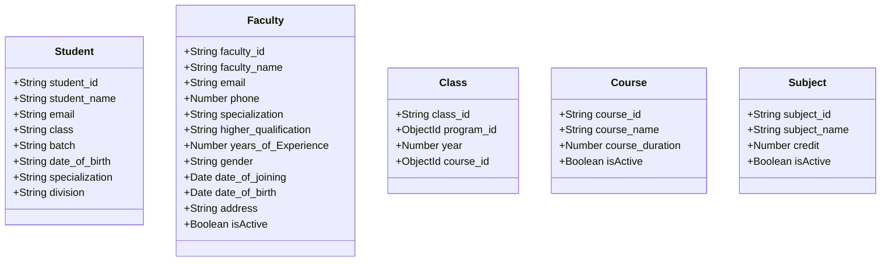
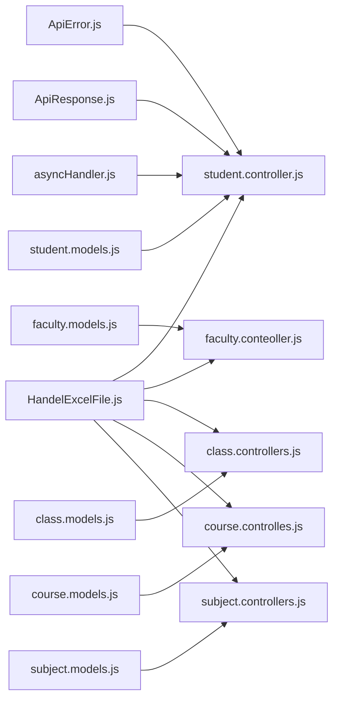

# CSV Data Import/Export

<cite>
**Referenced Files in This Document**
- [HandelExcelFile.js](file://Client/src/utils/HandelExcelFile.js)
- [ApiError.js](file://Backend/src/utils/ApiError.js)
- [ApiResponse.js](file://Backend/src/utils/ApiResponse.js)
- [asyncHandler.js](file://Backend/src/utils/asyncHandler.js)
- [student.controller.js](file://Backend/src/controllers/student.controller.js)
- [faculty.conteoller.js](file://Backend/src/controllers/faculty.conteoller.js)
- [class.controllers.js](file://Backend/src/controllers/class.controllers.js)
- [course.controlles.js](file://Backend/src/controllers/course.controlles.js)
- [subject.controllers.js](file://Backend/src/controllers/subject.controllers.js)
- [student.models.js](file://Backend/src/models/student.models.js)
- [faculty.models.js](file://Backend/src/models/faculty.models.js)
- [class.models.js](file://Backend/src/models/class.models.js)
- [course.models.js](file://Backend/src/models/course.models.js)
- [subject.models.js](file://Backend/src/models/subject.models.js)
</cite>

## Table of Contents
1. [Introduction](#introduction)
2. [Project Structure](#project-structure)
3. [Core Components](#core-components)
4. [Architecture Overview](#architecture-overview)
5. [Detailed Component Analysis](#detailed-component-analysis)
6. [Dependency Analysis](#dependency-analysis)
7. [Performance Considerations](#performance-considerations)
8. [Troubleshooting Guide](#troubleshooting-guide)
9. [Conclusion](#conclusion)
10. [Appendices](#appendices)

## Introduction
This document explains the CSV and Excel import/export capabilities implemented in the project. It covers:
- Frontend Excel handling utilities for template generation and parsing
- Backend controllers and models for importing structured data (students, faculty, classes, courses, subjects)
- Validation rules, duplicate detection, and error management
- Export strategies for generating CSV-like data from database records
- Performance considerations and best practices for large datasets

Note: The backend does not implement native CSV parsing. Instead, it accepts pre-validated JSON arrays from the frontend, which can originate from Excel parsing.

## Project Structure
The import/export functionality spans the client and backend:
- Client-side Excel utilities for generating templates and parsing Excel sheets
- Backend controllers that accept arrays of records and persist them to MongoDB via Mongoose models
- Shared response/error utilities for consistent API behavior

**Diagram sources**
- [HandelExcelFile.js:1-35](file://Client/src/utils/HandelExcelFile.js#L1-L35)
- [ApiError.js:1-21](file://Backend/src/utils/ApiError.js#L1-L21)
- [ApiResponse.js:1-10](file://Backend/src/utils/ApiResponse.js#L1-L10)
- [asyncHandler.js:1-4](file://Backend/src/utils/asyncHandler.js#L1-L4)
- [student.controller.js:1-209](file://Backend/src/controllers/student.controller.js#L1-L209)
- [faculty.conteoller.js:1-229](file://Backend/src/controllers/faculty.conteoller.js#L1-L229)
- [class.controllers.js:1-179](file://Backend/src/controllers/class.controllers.js#L1-L179)
- [course.controlles.js:1-136](file://Backend/src/controllers/course.controlles.js#L1-L136)
- [subject.controllers.js:1-130](file://Backend/src/controllers/subject.controllers.js#L1-L130)
- [student.models.js:1-66](file://Backend/src/models/student.models.js#L1-L66)
- [faculty.models.js:1-77](file://Backend/src/models/faculty.models.js#L1-L77)
- [class.models.js:1-32](file://Backend/src/models/class.models.js#L1-L32)
- [course.models.js:1-33](file://Backend/src/models/course.models.js#L1-L33)
- [subject.models.js:1-33](file://Backend/src/models/subject.models.js#L1-L33)

**Section sources**
- [HandelExcelFile.js:1-35](file://Client/src/utils/HandelExcelFile.js#L1-L35)
- [student.controller.js:1-209](file://Backend/src/controllers/student.controller.js#L1-L209)
- [faculty.conteoller.js:1-229](file://Backend/src/controllers/faculty.conteoller.js#L1-L229)
- [class.controllers.js:1-179](file://Backend/src/controllers/class.controllers.js#L1-L179)
- [course.controlles.js:1-136](file://Backend/src/controllers/course.controlles.js#L1-L136)
- [subject.controllers.js:1-130](file://Backend/src/controllers/subject.controllers.js#L1-L130)
- [student.models.js:1-66](file://Backend/src/models/student.models.js#L1-L66)
- [faculty.models.js:1-77](file://Backend/src/models/faculty.models.js#L1-L77)
- [class.models.js:1-32](file://Backend/src/models/class.models.js#L1-L32)
- [course.models.js:1-33](file://Backend/src/models/course.models.js#L1-L33)
- [subject.models.js:1-33](file://Backend/src/models/subject.models.js#L1-L33)

## Core Components
- Excel utilities (frontend): Generate Excel templates and parse Excel sheets into JSON arrays
- Import controllers (backend): Validate arrays, detect duplicates, and insert unique records
- Mongoose models (backend): Define schema-level validation and indexing
- Shared utilities (backend): Standardized error and response wrappers, async error handling

Key responsibilities:
- Frontend: Template creation and Excel parsing
- Backend: Data validation, duplicate detection, batch insertion, and error reporting

**Section sources**
- [HandelExcelFile.js:1-35](file://Client/src/utils/HandelExcelFile.js#L1-L35)
- [student.controller.js:1-209](file://Backend/src/controllers/student.controller.js#L1-L209)
- [faculty.conteoller.js:1-229](file://Backend/src/controllers/faculty.conteoller.js#L1-L229)
- [class.controllers.js:1-179](file://Backend/src/controllers/class.controllers.js#L1-L179)
- [course.controlles.js:1-136](file://Backend/src/controllers/course.controlles.js#L1-L136)
- [subject.controllers.js:1-130](file://Backend/src/controllers/subject.controllers.js#L1-L130)
- [student.models.js:1-66](file://Backend/src/models/student.models.js#L1-L66)
- [faculty.models.js:1-77](file://Backend/src/models/faculty.models.js#L1-L77)
- [class.models.js:1-32](file://Backend/src/models/class.models.js#L1-L32)
- [course.models.js:1-33](file://Backend/src/models/course.models.js#L1-L33)
- [subject.models.js:1-33](file://Backend/src/models/subject.models.js#L1-L33)
- [ApiError.js:1-21](file://Backend/src/utils/ApiError.js#L1-L21)
- [ApiResponse.js:1-10](file://Backend/src/utils/ApiResponse.js#L1-L10)
- [asyncHandler.js:1-4](file://Backend/src/utils/asyncHandler.js#L1-L4)

## Architecture Overview
The import pipeline follows a clear flow: Excel parsing -> JSON payload -> backend validation -> duplicate filtering -> batch insert -> response.

**Diagram sources**
- [HandelExcelFile.js:16-34](file://Client/src/utils/HandelExcelFile.js#L16-L34)
- [student.controller.js:10-91](file://Backend/src/controllers/student.controller.js#L10-L91)
- [faculty.conteoller.js:10-103](file://Backend/src/controllers/faculty.conteoller.js#L10-L103)
- [class.controllers.js:6-37](file://Backend/src/controllers/class.controllers.js#L6-L37)
- [course.controlles.js:5-40](file://Backend/src/controllers/course.controlles.js#L5-L40)
- [subject.controllers.js:6-41](file://Backend/src/controllers/subject.controllers.js#L6-L41)
- [student.models.js:1-66](file://Backend/src/models/student.models.js#L1-L66)
- [faculty.models.js:1-77](file://Backend/src/models/faculty.models.js#L1-L77)
- [class.models.js:1-32](file://Backend/src/models/class.models.js#L1-L32)
- [course.models.js:1-33](file://Backend/src/models/course.models.js#L1-L33)
- [subject.models.js:1-33](file://Backend/src/models/subject.models.js#L1-L33)

## Detailed Component Analysis

### Excel Utilities (Frontend)
- Template download: Generates an Excel workbook with a single sheet containing required column headers
- Parsing: Reads the first sheet and converts it to JSON; rejects on parsing errors

**Diagram sources**
- [HandelExcelFile.js:16-34](file://Client/src/utils/HandelExcelFile.js#L16-L34)

**Section sources**
- [HandelExcelFile.js:1-35](file://Client/src/utils/HandelExcelFile.js#L1-L35)

### Import Controllers (Backend)
Each controller validates the incoming array, checks for required fields, filters duplicates against existing records, and inserts unique entries in bulk.

**Diagram sources**
- [student.controller.js:10-91](file://Backend/src/controllers/student.controller.js#L10-L91)
- [faculty.conteoller.js:10-103](file://Backend/src/controllers/faculty.conteoller.js#L10-L103)
- [class.controllers.js:6-37](file://Backend/src/controllers/class.controllers.js#L6-L37)
- [course.controlles.js:5-40](file://Backend/src/controllers/course.controlles.js#L5-L40)
- [subject.controllers.js:6-41](file://Backend/src/controllers/subject.controllers.js#L6-L41)

#### Student Import
- Validates presence of student_id, student_name, email, class, batch, date_of_birth, specialization
- Filters duplicates by student_id and email
- Inserts unique records and responds with success

**Section sources**
- [student.controller.js:10-91](file://Backend/src/controllers/student.controller.js#L10-L91)
- [student.models.js:1-66](file://Backend/src/models/student.models.js#L1-L66)

#### Faculty Import
- Validates presence of faculty_id, faculty_name, email, phone, specialization, higher_qualification, years_of_Experience, gender, date_of_joining, date_of_birth, address
- Filters duplicates by faculty_id, email, and phone
- Inserts unique records and responds with success

**Section sources**
- [faculty.conteoller.js:10-103](file://Backend/src/controllers/faculty.conteoller.js#L10-L103)
- [faculty.models.js:1-77](file://Backend/src/models/faculty.models.js#L1-L77)

#### Class Import
- Validates presence of class_id and year
- Filters duplicates by class_id
- Inserts unique records and responds with success

**Section sources**
- [class.controllers.js:6-37](file://Backend/src/controllers/class.controllers.js#L6-L37)
- [class.models.js:1-32](file://Backend/src/models/class.models.js#L1-L32)

#### Course Import
- Validates presence of course_id, course_name, course_duration
- Filters duplicates by course_id
- Inserts unique records and responds with success

**Section sources**
- [course.controlles.js:5-40](file://Backend/src/controllers/course.controlles.js#L5-L40)
- [course.models.js:1-33](file://Backend/src/models/course.models.js#L1-L33)

#### Subject Import
- Validates presence of subject_id, subject_name, credit for each record
- Inserts unique records and responds with success

**Section sources**
- [subject.controllers.js:6-41](file://Backend/src/controllers/subject.controllers.js#L6-L41)
- [subject.models.js:1-33](file://Backend/src/models/subject.models.js#L1-L33)

### Mongoose Models and Validation
Models define schema-level constraints and transformations:
- Unique and required fields
- Case normalization (uppercase/lowercase) and trimming
- Indexing for searchable fields
- Optional flags (e.g., isActive)

**Diagram sources**
- [student.models.js:1-66](file://Backend/src/models/student.models.js#L1-L66)
- [faculty.models.js:1-77](file://Backend/src/models/faculty.models.js#L1-L77)
- [class.models.js:1-32](file://Backend/src/models/class.models.js#L1-L32)
- [course.models.js:1-33](file://Backend/src/models/course.models.js#L1-L33)
- [subject.models.js:1-33](file://Backend/src/models/subject.models.js#L1-L33)

**Section sources**
- [student.models.js:1-66](file://Backend/src/models/student.models.js#L1-L66)
- [faculty.models.js:1-77](file://Backend/src/models/faculty.models.js#L1-L77)
- [class.models.js:1-32](file://Backend/src/models/class.models.js#L1-L32)
- [course.models.js:1-33](file://Backend/src/models/course.models.js#L1-L33)
- [subject.models.js:1-33](file://Backend/src/models/subject.models.js#L1-L33)

### Export Functionality
- The backend does not implement CSV export endpoints
- Recommended approach: Use database queries to fetch filtered records and serialize to CSV on the client or via a lightweight server endpoint
- Filtering and formatting can be handled by applying query conditions and transforming fields before writing to CSV

[No sources needed since this section provides general guidance]

## Dependency Analysis
- Frontend depends on the Excel library to generate templates and parse files
- Backend controllers depend on shared utilities for error and response handling
- Controllers depend on models for validation and persistence
- Models depend on Mongoose for schema definition and enforcement

**Diagram sources**
- [HandelExcelFile.js:1-35](file://Client/src/utils/HandelExcelFile.js#L1-L35)
- [ApiError.js:1-21](file://Backend/src/utils/ApiError.js#L1-L21)
- [ApiResponse.js:1-10](file://Backend/src/utils/ApiResponse.js#L1-L10)
- [asyncHandler.js:1-4](file://Backend/src/utils/asyncHandler.js#L1-L4)
- [student.controller.js:1-209](file://Backend/src/controllers/student.controller.js#L1-L209)
- [faculty.conteoller.js:1-229](file://Backend/src/controllers/faculty.conteoller.js#L1-L229)
- [class.controllers.js:1-179](file://Backend/src/controllers/class.controllers.js#L1-L179)
- [course.controlles.js:1-136](file://Backend/src/controllers/course.controlles.js#L1-L136)
- [subject.controllers.js:1-130](file://Backend/src/controllers/subject.controllers.js#L1-L130)
- [student.models.js:1-66](file://Backend/src/models/student.models.js#L1-L66)
- [faculty.models.js:1-77](file://Backend/src/models/faculty.models.js#L1-L77)
- [class.models.js:1-32](file://Backend/src/models/class.models.js#L1-L32)
- [course.models.js:1-33](file://Backend/src/models/course.models.js#L1-L33)
- [subject.models.js:1-33](file://Backend/src/models/subject.models.js#L1-L33)

**Section sources**
- [HandelExcelFile.js:1-35](file://Client/src/utils/HandelExcelFile.js#L1-L35)
- [ApiError.js:1-21](file://Backend/src/utils/ApiError.js#L1-L21)
- [ApiResponse.js:1-10](file://Backend/src/utils/ApiResponse.js#L1-L10)
- [asyncHandler.js:1-4](file://Backend/src/utils/asyncHandler.js#L1-L4)
- [student.controller.js:1-209](file://Backend/src/controllers/student.controller.js#L1-L209)
- [faculty.conteoller.js:1-229](file://Backend/src/controllers/faculty.conteoller.js#L1-L229)
- [class.controllers.js:1-179](file://Backend/src/controllers/class.controllers.js#L1-L179)
- [course.controlles.js:1-136](file://Backend/src/controllers/course.controlles.js#L1-L136)
- [subject.controllers.js:1-130](file://Backend/src/controllers/subject.controllers.js#L1-L130)
- [student.models.js:1-66](file://Backend/src/models/student.models.js#L1-L66)
- [faculty.models.js:1-77](file://Backend/src/models/faculty.models.js#L1-L77)
- [class.models.js:1-32](file://Backend/src/models/class.models.js#L1-L32)
- [course.models.js:1-33](file://Backend/src/models/course.models.js#L1-L33)
- [subject.models.js:1-33](file://Backend/src/models/subject.models.js#L1-L33)

## Performance Considerations
- Prefer client-side Excel parsing for large files to avoid server overhead
- Batch insert unique records to minimize round-trips
- Use database indexes on unique fields (e.g., student_id, email, faculty_id, subject_id) to speed up duplicate checks
- Limit concurrent uploads and apply rate limiting at the API gateway or middleware
- For very large datasets, consider streaming or chunked processing on the client and paginated inserts on the server

[No sources needed since this section provides general guidance]

## Troubleshooting Guide
Common issues and resolutions:
- Malformed Excel: Ensure the first sheet exists and contains headers; handle parsing errors gracefully
- Missing fields: Controllers validate required fields; ensure templates are followed precisely
- Duplicate records: Controllers filter duplicates based on unique keys; verify uniqueness constraints
- Validation failures: Schema-level validations enforce data types and constraints; adjust input accordingly
- Empty arrays: Controllers reject empty arrays; ensure the uploaded file contains data

**Section sources**
- [HandelExcelFile.js:16-34](file://Client/src/utils/HandelExcelFile.js#L16-L34)
- [student.controller.js:10-91](file://Backend/src/controllers/student.controller.js#L10-L91)
- [faculty.conteoller.js:10-103](file://Backend/src/controllers/faculty.conteoller.js#L10-L103)
- [class.controllers.js:6-37](file://Backend/src/controllers/class.controllers.js#L6-L37)
- [course.controlles.js:5-40](file://Backend/src/controllers/course.controlles.js#L5-L40)
- [subject.controllers.js:6-41](file://Backend/src/controllers/subject.controllers.js#L6-L41)
- [student.models.js:1-66](file://Backend/src/models/student.models.js#L1-L66)
- [faculty.models.js:1-77](file://Backend/src/models/faculty.models.js#L1-L77)
- [class.models.js:1-32](file://Backend/src/models/class.models.js#L1-L32)
- [course.models.js:1-33](file://Backend/src/models/course.models.js#L1-L33)
- [subject.models.js:1-33](file://Backend/src/models/subject.models.js#L1-L33)
- [ApiError.js:1-21](file://Backend/src/utils/ApiError.js#L1-L21)
- [ApiResponse.js:1-10](file://Backend/src/utils/ApiResponse.js#L1-L10)
- [asyncHandler.js:1-4](file://Backend/src/utils/asyncHandler.js#L1-L4)

## Conclusion
The system provides a robust pipeline for importing structured data from Excel into the database. Frontend utilities handle template generation and parsing, while backend controllers enforce strict validation, deduplicate records, and persist them efficiently. Although native CSV parsing and export are not present, the architecture supports easy extension for CSV workflows by adding appropriate endpoints and serializers.

[No sources needed since this section summarizes without analyzing specific files]

## Appendices
- Supported file formats: Excel (.xlsx) via the Excel library; CSV support can be added by introducing a CSV parser and adapting the controllers
- Best practices for optimal preparation:
  - Use provided templates to ensure correct headers and data types
  - Keep files compact and avoid unnecessary blank rows
  - Normalize data (case and whitespace) before upload to align with schema-level transformations

[No sources needed since this section provides general guidance]