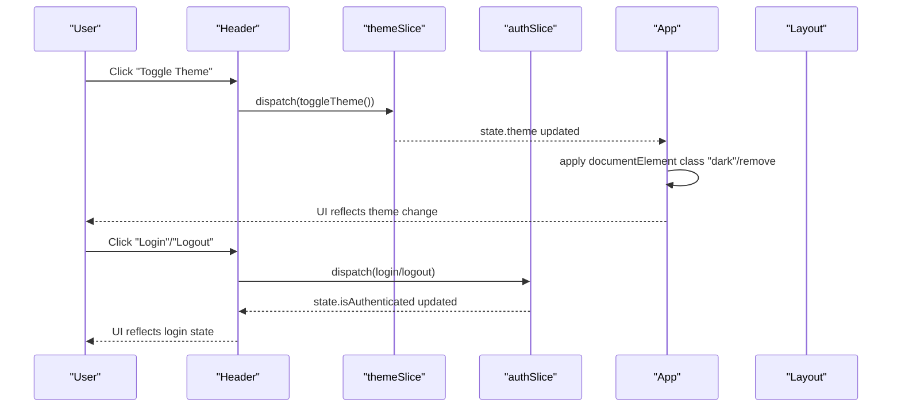
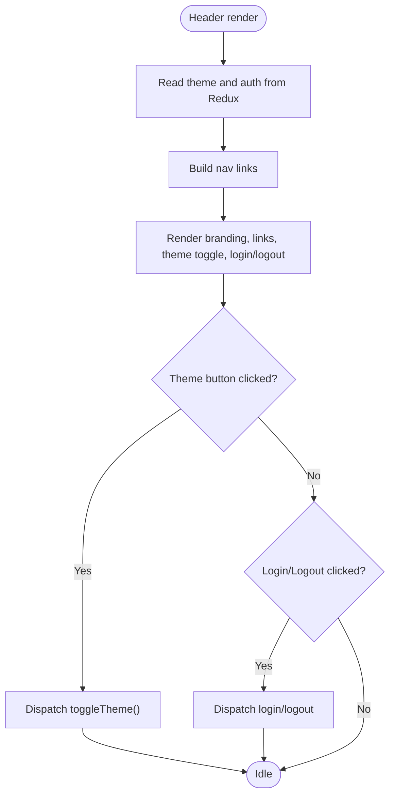
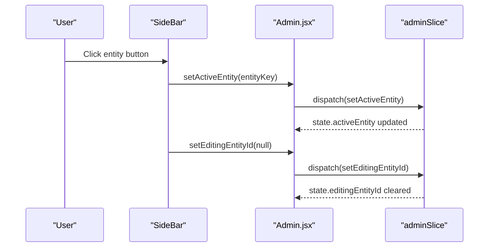
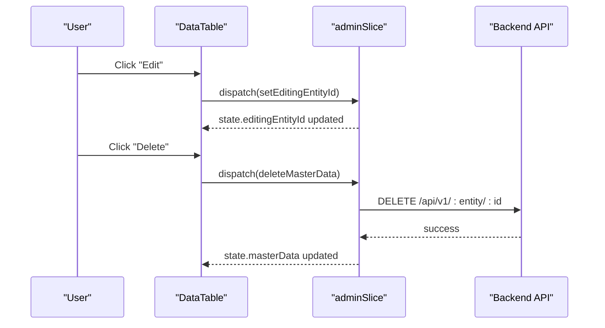
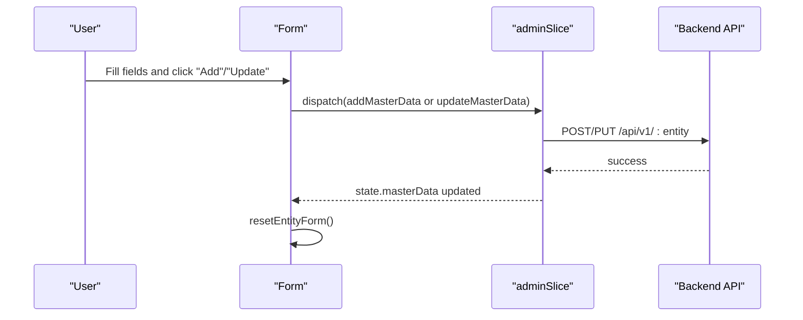
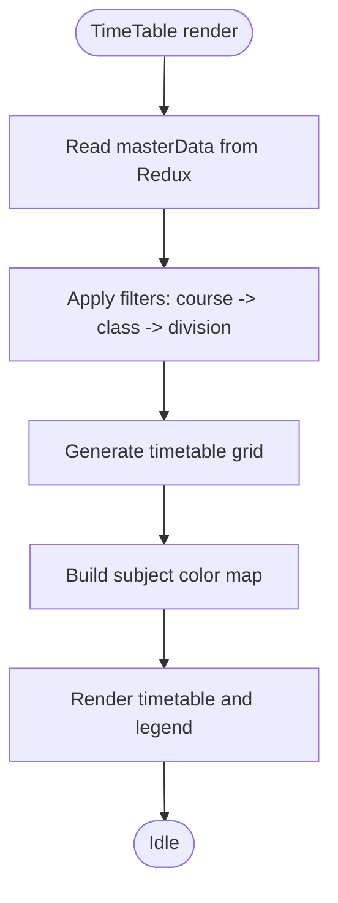
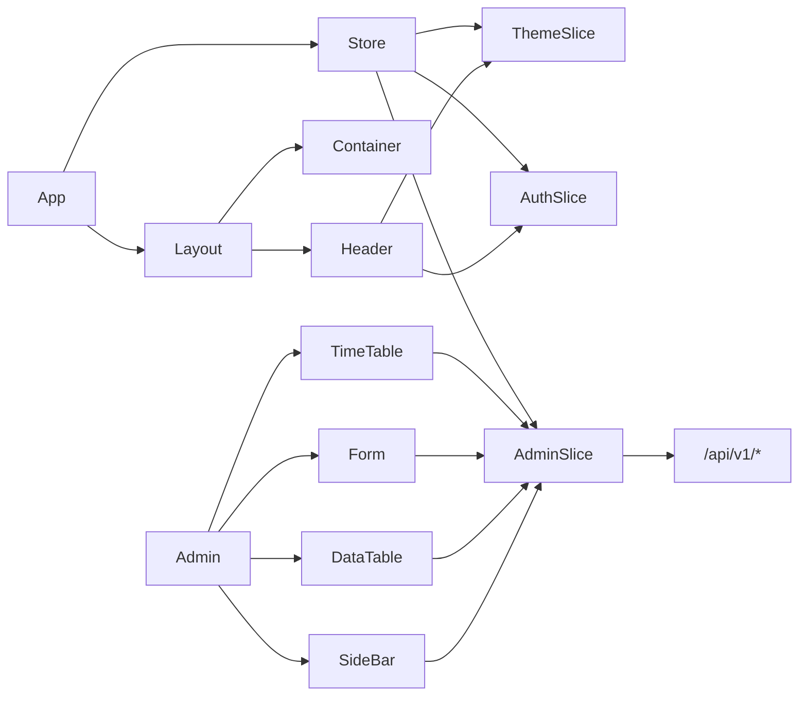

# Component Library

<cite>
**Referenced Files in This Document**
- [Header.jsx](file://Client/src/components/Header.jsx)
- [Container.jsx](file://Client/src/components/Container.jsx)
- [Layout.jsx](file://Client/src/components/Layout.jsx)
- [SideBar.jsx](file://Client/src/components/deshboard/SideBar.jsx)
- [DataTable.jsx](file://Client/src/components/deshboard/DataTable.jsx)
- [Form.jsx](file://Client/src/components/deshboard/Form.jsx)
- [TimeTable.jsx](file://Client/src/components/deshboard/TimeTable.jsx)
- [Admin.jsx](file://Client/src/pages/dashboard/Admin.jsx)
- [App.jsx](file://Client/src/App.jsx)
- [store.js](file://Client/src/store/store.js)
- [adminSlice.js](file://Client/src/store/admin/adminSlice.js)
- [authSlice.js](file://Client/src/store/auth/authSlice.js)
- [themeSlice.js](file://Client/src/store/theme/themeSlice.js)
- [index.css](file://Client/src/index.css)
</cite>

## Table of Contents
1. [Introduction](#introduction)
2. [Project Structure](#project-structure)
3. [Core Components](#core-components)
4. [Architecture Overview](#architecture-overview)
5. [Detailed Component Analysis](#detailed-component-analysis)
6. [Dependency Analysis](#dependency-analysis)
7. [Performance Considerations](#performance-considerations)
8. [Troubleshooting Guide](#troubleshooting-guide)
9. [Conclusion](#conclusion)
10. [Appendices](#appendices)

## Introduction
This document describes the reusable UI component library used in the application’s client-side code. It focuses on:
- Navigation and branding via the Header component
- Layout structure via the Container and Layout components
- Dashboard composition using SideBar, DataTable, and Form
- Styling with Tailwind CSS and responsive design
- State management integration with Redux
- Component lifecycle, event handling, and composition patterns
- Guidelines for extending components and maintaining UI consistency

## Project Structure
The UI components are organized under Client/src/components, with dashboard-specific components grouped under a deshboard folder. Pages live under Client/src/pages, and state management is centralized in Client/src/store. Styling is configured via Tailwind CSS and a theme-aware CSS variable system.

```mermaid
graph TB
subgraph "Components"
Header["Header.jsx"]
Container["Container.jsx"]
Layout["Layout.jsx"]
SideBar["SideBar.jsx"]
DataTable["DataTable.jsx"]
Form["Form.jsx"]
TimeTable["TimeTable.jsx"]
end
subgraph "Pages"
AdminPage["Admin.jsx"]
App["App.jsx"]
end
subgraph "Store"
Store["store.js"]
AdminSlice["adminSlice.js"]
AuthSlice["authSlice.js"]
ThemeSlice["themeSlice.js"]
end
subgraph "Styling"
Styles["index.css"]
end
App --> Layout
Layout --> Header
Layout --> Container
AdminPage --> SideBar
AdminPage --> DataTable
AdminPage --> Form
AdminPage --> TimeTable
Header --> ThemeSlice
Header --> AuthSlice
SideBar --> AdminSlice
DataTable --> AdminSlice
Form --> AdminSlice
TimeTable --> AdminSlice
Store --> AdminSlice
Store --> AuthSlice
Store --> ThemeSlice
App --> Styles
Header --> Styles
Container --> Styles
Layout --> Styles
SideBar --> Styles
DataTable --> Styles
Form --> Styles
TimeTable --> Styles
```

**Diagram sources**
- [App.jsx:13-41](file://Client/src/App.jsx#L13-L41)
- [Layout.jsx:7-22](file://Client/src/components/Layout.jsx#L7-L22)
- [Header.jsx:8-122](file://Client/src/components/Header.jsx#L8-L122)
- [Container.jsx:3-7](file://Client/src/components/Container.jsx#L3-L7)
- [SideBar.jsx:3-49](file://Client/src/components/deshboard/SideBar.jsx#L3-L49)
- [DataTable.jsx:5-86](file://Client/src/components/deshboard/DataTable.jsx#L5-L86)
- [Form.jsx:5-127](file://Client/src/components/deshboard/Form.jsx#L5-L127)
- [TimeTable.jsx:62-370](file://Client/src/components/deshboard/TimeTable.jsx#L62-L370)
- [store.js:1-15](file://Client/src/store/store.js#L1-L15)
- [adminSlice.js:88-173](file://Client/src/store/admin/adminSlice.js#L88-L173)
- [authSlice.js:10-32](file://Client/src/store/auth/authSlice.js#L10-L32)
- [themeSlice.js:15-29](file://Client/src/store/theme/themeSlice.js#L15-L29)
- [index.css:1-42](file://Client/src/index.css#L1-L42)

**Section sources**
- [App.jsx:13-41](file://Client/src/App.jsx#L13-L41)
- [store.js:1-15](file://Client/src/store/store.js#L1-L15)
- [index.css:1-42](file://Client/src/index.css#L1-L42)

## Core Components
This section documents the foundational UI building blocks used across the application.

- Header
  - Purpose: Provides top-level navigation, branding, theme toggle, and authentication actions.
  - Props: None (uses Redux selectors and react-router hooks internally).
  - Events: Theme toggle, login/logout navigation, and optional nav link handlers.
  - Usage pattern: Rendered inside Layout; integrates with theme and auth stores.
  - Styling: Uses Tailwind utility classes and CSS variables for colors.
  - Lifecycle: Subscribes to Redux state for theme and auth; applies DOM class toggles on theme change.

- Container
  - Purpose: A lightweight wrapper for page content with customizable className.
  - Props: children, className.
  - Events: None.
  - Usage pattern: Wraps main content areas to enforce consistent horizontal spacing and alignment.

- Layout
  - Purpose: Page template that renders Header and outlets for nested routes.
  - Props: None.
  - Events: None.
  - Usage pattern: Used as a route element to wrap page components; applies theme class to root element.

**Section sources**
- [Header.jsx:8-122](file://Client/src/components/Header.jsx#L8-L122)
- [Container.jsx:3-7](file://Client/src/components/Container.jsx#L3-L7)
- [Layout.jsx:7-22](file://Client/src/components/Layout.jsx#L7-L22)

## Architecture Overview
The component library follows a unidirectional data flow:
- Components subscribe to Redux slices for state (auth, theme, admin).
- Actions are dispatched to update state and trigger asynchronous effects (adminSlice).
- UI updates propagate automatically via React-Redux subscriptions.
- Styling leverages Tailwind utilities and CSS variables for theme-aware tokens.



**Diagram sources**
- [Header.jsx:25-28](file://Client/src/components/Header.jsx#L25-L28)
- [themeSlice.js:18-22](file://Client/src/store/theme/themeSlice.js#L18-L22)
- [authSlice.js:13-25](file://Client/src/store/auth/authSlice.js#L13-L25)
- [App.jsx:16-24](file://Client/src/App.jsx#L16-L24)

## Detailed Component Analysis

### Header Component
- Responsibilities
  - Renders branding and navigation links.
  - Provides theme toggle button with dynamic icon and tooltip.
  - Handles login/logout navigation based on authentication state.
  - Integrates with Redux for theme and auth state.
- Props
  - None.
- Events
  - themeHandler: Dispatches toggleTheme().
  - loginHandler/logoutHandler: Navigate to appropriate routes.
- Composition
  - Uses Container for consistent horizontal padding.
  - Uses react-router’s Link/NavLink for navigation.
- Styling
  - Uses CSS variables mapped to Tailwind utilities for colors and hover states.
- Accessibility
  - Buttons include aria roles and titles where applicable.



**Diagram sources**
- [Header.jsx:30-35](file://Client/src/components/Header.jsx#L30-L35)
- [Header.jsx:25-28](file://Client/src/components/Header.jsx#L25-L28)
- [Header.jsx:20-23](file://Client/src/components/Header.jsx#L20-L23)

**Section sources**
- [Header.jsx:8-122](file://Client/src/components/Header.jsx#L8-L122)
- [Container.jsx:3-7](file://Client/src/components/Container.jsx#L3-L7)

### Container Component
- Responsibilities
  - Wraps children with a flexible container that supports responsive alignment and spacing.
- Props
  - children: React node(s).
  - className: Optional Tailwind classes to customize layout and spacing.
- Events
  - None.
- Styling
  - Uses Tailwind utilities for responsiveness and alignment.

**Section sources**
- [Container.jsx:3-7](file://Client/src/components/Container.jsx#L3-L7)

### Layout Component
- Responsibilities
  - Applies theme class to the root element.
  - Renders Header and Outlet for nested routes.
  - Uses Container to center and align content.
- Props
  - None.
- Events
  - None.
- Styling
  - Theme class controls dark/light mode on the root element.

**Section sources**
- [Layout.jsx:7-22](file://Client/src/components/Layout.jsx#L7-L22)

### SideBar Component (Dashboard)
- Responsibilities
  - Presents master entity categories and counts.
  - Highlights the active entity and clears editing state when switching.
- Props
  - ENTITY_CONFIG: Object mapping entity keys to metadata.
  - masterData: Current Redux state of master data.
  - activeEntity: Currently selected entity key.
  - setActiveEntity: Callback to switch active entity.
  - setEditingEntityId: Callback to reset editing state.
- Events
  - onClick on each entity button triggers setActiveEntity and clears editing ID.
- Styling
  - Responsive typography and hover states; active state uses primary palette.



**Diagram sources**
- [SideBar.jsx:30-33](file://Client/src/components/deshboard/SideBar.jsx#L30-L33)
- [Admin.jsx:414-419](file://Client/src/pages/dashboard/Admin.jsx#L414-L419)
- [adminSlice.js:92-96](file://Client/src/store/admin/adminSlice.js#L92-L96)

**Section sources**
- [SideBar.jsx:3-49](file://Client/src/components/deshboard/SideBar.jsx#L3-L49)
- [Admin.jsx:414-419](file://Client/src/pages/dashboard/Admin.jsx#L414-L419)
- [adminSlice.js:92-96](file://Client/src/store/admin/adminSlice.js#L92-L96)

### DataTable Component (Dashboard)
- Responsibilities
  - Displays existing records for the active entity in a responsive table.
  - Supports edit and delete actions via Redux actions.
- Props
  - currentEntityConfig: Field definitions and labels for rendering.
  - activeEntity: Entity key to display.
- Events
  - Edit/Delete buttons dispatch Redux actions.
- Styling
  - Responsive table with hover states and action buttons.



**Diagram sources**
- [DataTable.jsx:10-18](file://Client/src/components/deshboard/DataTable.jsx#L10-L18)
- [adminSlice.js:67-78](file://Client/src/store/admin/adminSlice.js#L67-L78)

**Section sources**
- [DataTable.jsx:5-86](file://Client/src/components/deshboard/DataTable.jsx#L5-L86)
- [adminSlice.js:67-78](file://Client/src/store/admin/adminSlice.js#L67-L78)

### Form Component (Dashboard)
- Responsibilities
  - Renders a configurable form based on currentEntityConfig.
  - Manages local form state and syncs with Redux editing state.
  - Submits data via Redux async thunks for add/update.
- Props
  - currentEntityConfig: Field definitions and labels.
  - activeEntity: Entity key to operate on.
- Events
  - Form submission dispatches addMasterData or updateMasterData.
  - Reset/cancel clears editing state and errors.
- Lifecycle
  - useEffect initializes form state when editing an existing entity.
- Styling
  - Responsive grid layout with labels, inputs, and action buttons.



**Diagram sources**
- [Form.jsx:37-50](file://Client/src/components/deshboard/Form.jsx#L37-L50)
- [adminSlice.js:38-65](file://Client/src/store/admin/adminSlice.js#L38-L65)

**Section sources**
- [Form.jsx:5-127](file://Client/src/components/deshboard/Form.jsx#L5-L127)
- [adminSlice.js:38-65](file://Client/src/store/admin/adminSlice.js#L38-L65)

### TimeTable Component (Dashboard)
- Responsibilities
  - Generates and displays a weekly timetable grid for a selected class/division.
  - Provides filters for course, class, and division.
  - Assigns unique colors per subject and renders legend.
- Props
  - onClose: Optional callback to return to master data view.
- Events
  - Filter changes update internal selections and derived timetable data.
- Lifecycle
  - Uses useMemo to derive filtered classes, divisions, and timetable data efficiently.
- Styling
  - Responsive table with break indicators and subject color bands.



**Diagram sources**
- [TimeTable.jsx:62-110](file://Client/src/components/deshboard/TimeTable.jsx#L62-L110)
- [TimeTable.jsx:102-105](file://Client/src/components/deshboard/TimeTable.jsx#L102-L105)
- [TimeTable.jsx:74-80](file://Client/src/components/deshboard/TimeTable.jsx#L74-L80)

**Section sources**
- [TimeTable.jsx:62-370](file://Client/src/components/deshboard/TimeTable.jsx#L62-L370)

### Admin Page (Dashboard Container)
- Responsibilities
  - Orchestrates the dashboard UI: header actions, sidebar, form, and data table.
  - Loads master data for multiple entities on mount.
  - Switches between master data and timetable views.
- Props
  - None (uses Redux and react-router).
- Events
  - Dispatches setActiveEntity, setEditingEntityId, and addMasterData.
- Styling
  - Uses Tailwind utilities for layout, shadows, and responsive grids.

**Section sources**
- [Admin.jsx:17-617](file://Client/src/pages/dashboard/Admin.jsx#L17-L617)

## Dependency Analysis
The component library relies on:
- React Router for routing and outlet rendering.
- Redux Toolkit for state management and async thunks.
- Tailwind CSS for styling and responsive design.
- Axios for backend API communication.



**Diagram sources**
- [store.js:1-15](file://Client/src/store/store.js#L1-L15)
- [adminSlice.js:6-16](file://Client/src/store/admin/adminSlice.js#L6-L16)
- [App.jsx:13-41](file://Client/src/App.jsx#L13-L41)

**Section sources**
- [store.js:1-15](file://Client/src/store/store.js#L1-L15)
- [adminSlice.js:6-16](file://Client/src/store/admin/adminSlice.js#L6-L16)
- [App.jsx:13-41](file://Client/src/App.jsx#L13-L41)

## Performance Considerations
- Prefer memoization for derived data (useMemo) in components like TimeTable to avoid unnecessary re-renders.
- Batch Redux updates and avoid frequent small writes to minimize re-renders.
- Use responsive breakpoints judiciously to prevent excessive layout thrashing on mobile devices.
- Lazy-load heavy assets and defer non-critical resources.

## Troubleshooting Guide
- Theme not applying
  - Ensure the theme slice is initialized and App applies the “dark” class to documentElement.
  - Verify CSS variables are defined in index.css and Tailwind is configured to use them.
- Authentication state mismatch
  - Confirm authSlice persists login state to localStorage and Redux state updates accordingly.
- Dashboard data not loading
  - Check that adminSlice fetchMasterData is dispatched for each entity and that ENTITY_ENDPOINTS match backend routes.
- Edit/Delete actions failing
  - Inspect rejected payloads from async thunks and confirm network connectivity and credentials.

**Section sources**
- [themeSlice.js:3-9](file://Client/src/store/theme/themeSlice.js#L3-L9)
- [App.jsx:16-24](file://Client/src/App.jsx#L16-L24)
- [index.css:4-13](file://Client/src/index.css#L4-L13)
- [authSlice.js:14-25](file://Client/src/store/auth/authSlice.js#L14-L25)
- [adminSlice.js:24-36](file://Client/src/store/admin/adminSlice.js#L24-L36)
- [adminSlice.js:67-78](file://Client/src/store/admin/adminSlice.js#L67-L78)

## Conclusion
The component library provides a cohesive, theme-aware, and state-driven UI foundation. By composing Header, Container, and Layout for navigation and structure, and SideBar, DataTable, and Form for dashboard operations, the system achieves consistency and scalability. Tailwind CSS and Redux integrate seamlessly to support responsive design and predictable state updates.

## Appendices

### Styling and Responsive Design Principles
- Tailwind utilities are used extensively for layout, spacing, and color.
- CSS variables define theme tokens; index.css maps these to Tailwind utilities.
- Responsive breakpoints ensure mobile-friendly layouts across components.

**Section sources**
- [index.css:4-13](file://Client/src/index.css#L4-L13)
- [Header.jsx:38-118](file://Client/src/components/Header.jsx#L38-L118)
- [DataTable.jsx:27-81](file://Client/src/components/deshboard/DataTable.jsx#L27-L81)
- [Form.jsx:64-123](file://Client/src/components/deshboard/Form.jsx#L64-L123)
- [TimeTable.jsx:133-209](file://Client/src/components/deshboard/TimeTable.jsx#L133-L209)

### Extending Components and Maintaining Consistency
- Keep props minimal and explicit; pass only required data (e.g., ENTITY_CONFIG, activeEntity).
- Centralize configuration objects (like ENTITY_CONFIG) close to their consumers for maintainability.
- Use consistent Tailwind utilities and CSS variables to preserve visual coherence.
- Encapsulate async operations behind Redux slices to keep components declarative.
- Add PropTypes or TypeScript for prop validation in larger teams.