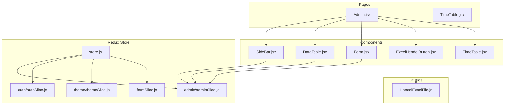
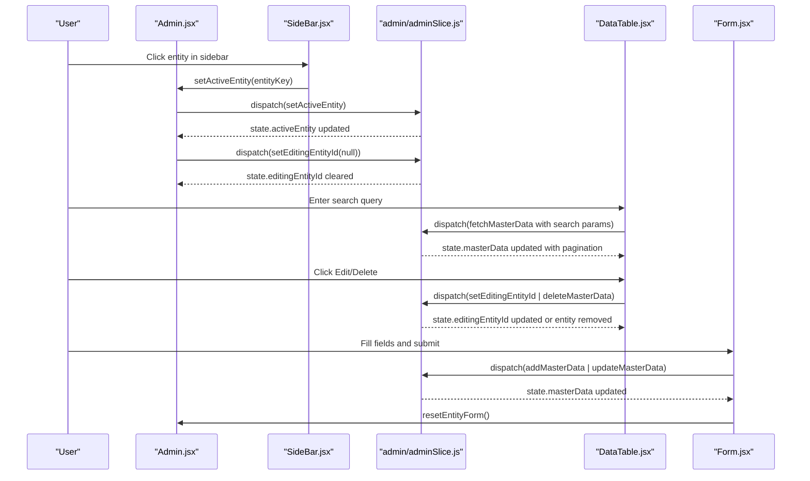
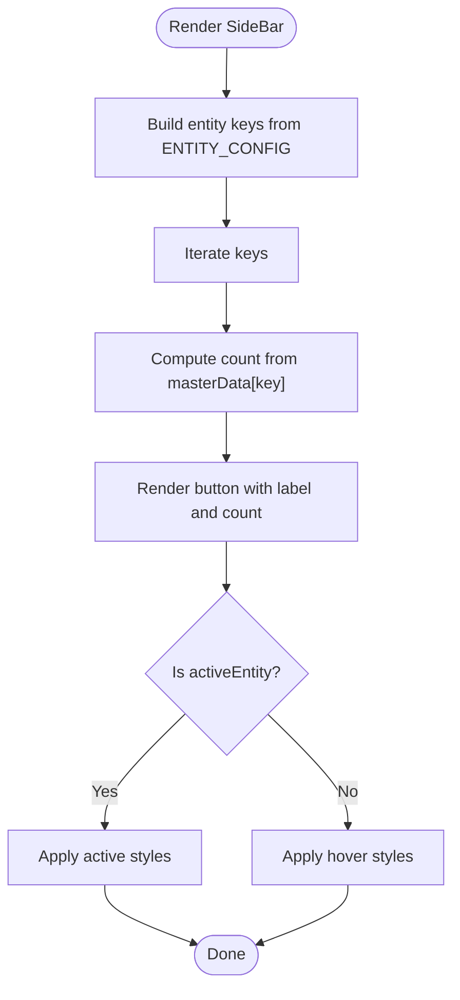
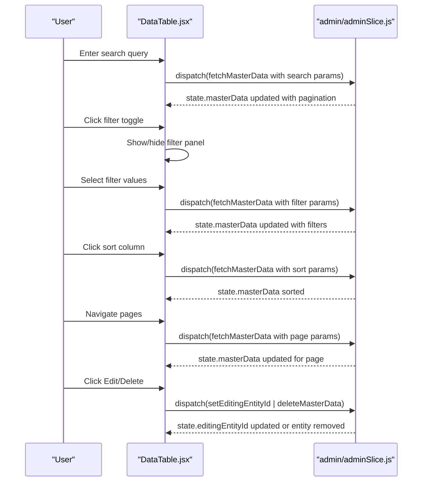
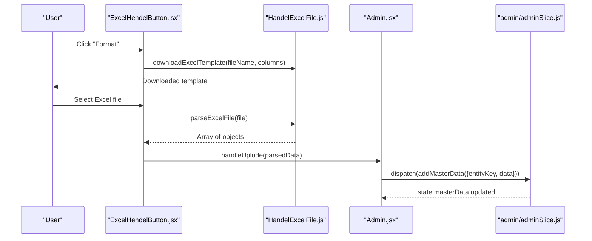
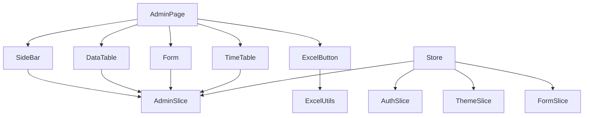

# Dashboard Components

<cite>
**Referenced Files in This Document**
- [SideBar.jsx](file://Client/src/components/deshboard/SideBar.jsx)
- [DataTable.jsx](file://Client/src/components/deshboard/DataTable.jsx)
- [Form.jsx](file://Client/src/components/deshboard/Form.jsx)
- [TimeTable.jsx](file://Client/src/components/deshboard/TimeTable.jsx)
- [adminSlice.js](file://Client/src/store/admin/adminSlice.js)
- [authSlice.js](file://Client/src/store/auth/authSlice.js)
- [formSlice.js](file://Client/src/store/formSlice.js)
- [store.js](file://Client/src/store/store.js)
- [Admin.jsx](file://Client/src/pages/dashboard/Admin.jsx)
- [ExcelHendelButton.jsx](file://Client/src/components/ExcelHendelButton.jsx)
- [HandelExcelFile.js](file://Client/src/utils/HandelExcelFile.js)
- [themeSlice.js](file://Client/src/store/theme/themeSlice.js)
</cite>

## Update Summary
**Changes Made**
- Updated DataTable component documentation to reflect sophisticated pagination, search, sorting, and filtering capabilities
- Added comprehensive coverage of new pagination system with page numbers, items per page selector, and navigation controls
- Documented advanced search functionality with real-time filtering and clear search button
- Added detailed explanation of multi-field filtering system with boolean, select, and dynamic dropdown filters
- Enhanced sorting capabilities with column-wise sorting and visual indicators
- Updated CSV export functionality to work with filtered and paginated data
- Added comprehensive styling and UX considerations for the enhanced DataTable

## Table of Contents
1. [Introduction](#introduction)
2. [Project Structure](#project-structure)
3. [Core Components](#core-components)
4. [Architecture Overview](#architecture-overview)
5. [Detailed Component Analysis](#detailed-component-analysis)
6. [Dependency Analysis](#dependency-analysis)
7. [Performance Considerations](#performance-considerations)
8. [Troubleshooting Guide](#troubleshooting-guide)
9. [Conclusion](#conclusion)

## Introduction
This document provides comprehensive documentation for the dashboard-specific components: SideBar, DataTable, and Form. It explains the SideBar component's navigation structure, active state management, and role-based visibility. It details the sophisticated DataTable component's data rendering, pagination, search, sorting, filtering, and CSV export functionality. It explains the Form component's input validation, field mapping, submission handling, and error management. Additionally, it covers props interfaces, event handling patterns, styling approaches, and integration with Redux state management for data operations.

## Project Structure
The dashboard components reside under Client/src/components/deshboard and integrate with Redux slices under Client/src/store. The Admin page orchestrates these components and manages entity configurations.

**Diagram sources**
- [Admin.jsx:17-951](file://Client/src/pages/dashboard/Admin.jsx#L17-L951)
- [SideBar.jsx:1-49](file://Client/src/components/deshboard/SideBar.jsx#L1-L49)
- [DataTable.jsx:1-563](file://Client/src/components/deshboard/DataTable.jsx#L1-L563)
- [Form.jsx:1-165](file://Client/src/components/deshboard/Form.jsx#L1-L165)
- [TimeTable.jsx:1-722](file://Client/src/components/deshboard/TimeTable.jsx#L1-L722)
- [ExcelHendelButton.jsx:1-85](file://Client/src/components/ExcelHendelButton.jsx#L1-L85)
- [store.js:1-15](file://Client/src/store/store.js#L1-L15)
- [adminSlice.js:1-201](file://Client/src/store/admin/adminSlice.js#L1-L201)
- [authSlice.js:1-32](file://Client/src/store/auth/authSlice.js#L1-L32)
- [themeSlice.js:1-29](file://Client/src/store/theme/themeSlice.js#L1-L29)
- [formSlice.js:1-24](file://Client/src/store/formSlice.js#L1-L24)
- [HandelExcelFile.js:1-35](file://Client/src/utils/HandelExcelFile.js#L1-L35)

**Section sources**
- [Admin.jsx:17-951](file://Client/src/pages/dashboard/Admin.jsx#L17-L951)
- [store.js:1-15](file://Client/src/store/store.js#L1-L15)

## Core Components
This section documents the three primary dashboard components and their responsibilities.

- SideBar: Provides navigation among master entities, displays counts, and manages active selection.
- DataTable: Renders sophisticated tabular data for the selected entity with pagination, search, sorting, and filtering capabilities.
- Form: Handles entity creation/editing with field mapping and submission to backend via Redux.

**Section sources**
- [SideBar.jsx:1-49](file://Client/src/components/deshboard/SideBar.jsx#L1-L49)
- [DataTable.jsx:1-563](file://Client/src/components/deshboard/DataTable.jsx#L1-L563)
- [Form.jsx:1-165](file://Client/src/components/deshboard/Form.jsx#L1-L165)

## Architecture Overview
The Admin page composes SideBar, DataTable, and Form. SideBar updates the active entity and clears editing state. DataTable reads from Redux masterData with sophisticated pagination and dispatches delete actions. Form reads editingEntityId and masterData to prefill edits, then dispatches add/update actions. Redux slices manage async operations and state transitions with enhanced pagination support.

**Diagram sources**
- [Admin.jsx:742-757](file://Client/src/pages/dashboard/Admin.jsx#L742-L757)
- [SideBar.jsx:30-37](file://Client/src/components/deshboard/SideBar.jsx#L30-L37)
- [adminSlice.js:91-102](file://Client/src/store/admin/adminSlice.js#L91-L102)
- [DataTable.jsx:28-46](file://Client/src/components/deshboard/DataTable.jsx#L28-L46)
- [Form.jsx:60-73](file://Client/src/components/deshboard/Form.jsx#L60-L73)

## Detailed Component Analysis

### SideBar Component
The SideBar component renders a navigation list of master entities derived from ENTITY_CONFIG. It computes counts from masterData and applies active state styling. Clicking an entity updates the active entity and clears editing state.

- Props interface:
  - ENTITY_CONFIG: object mapping entity keys to configuration objects
  - masterData: object containing arrays of entities keyed by entity type
  - activeEntity: currently selected entity key
  - setActiveEntity: callback to update active entity
  - setEditingEntityId: callback to clear editing state

- Active state management:
  - Uses activeEntity prop to conditionally apply active styles
  - Clears editingEntityId upon selection change

- Role-based visibility:
  - Not directly implemented in SideBar; visibility is controlled by the Admin page routing based on user role

- Styling approach:
  - Uses Tailwind utility classes for spacing, colors, and hover effects
  - Active item highlighted with primary color accents

**Diagram sources**
- [SideBar.jsx:5-44](file://Client/src/components/deshboard/SideBar.jsx#L5-L44)

**Section sources**
- [SideBar.jsx:1-49](file://Client/src/components/deshboard/SideBar.jsx#L1-L49)
- [Admin.jsx:742-757](file://Client/src/pages/dashboard/Admin.jsx#L742-L757)

### DataTable Component
The DataTable component renders sophisticated tabular data for the selected entity with comprehensive pagination, search, sorting, and filtering capabilities. It displays fields defined in the entity configuration and provides Edit/Delete actions with enhanced user experience.

**Updated** Enhanced with sophisticated pagination system, advanced search functionality, multi-field filtering, and improved sorting capabilities.

#### Advanced Pagination System
The DataTable implements a comprehensive pagination system with:
- Page navigation with numbered buttons and ellipsis for large datasets
- Items per page selector (5, 10, 20, 50, 100)
- Current page information display
- Responsive design for mobile and desktop

#### Sophisticated Search and Filtering
The DataTable provides:
- Real-time search with instant filtering
- Multi-field filtering with boolean, select, and dynamic dropdown filters
- Filter persistence across pages
- Clear filters functionality
- Active filter indicators

#### Enhanced Sorting Capabilities
The DataTable supports:
- Column-wise sorting with visual indicators
- Ascending and descending order toggling
- Sort state persistence across filters and pagination

#### Data Rendering Enhancements
- Improved cell formatting for boolean fields with status badges
- Enhanced date and time display formatting
- Better handling of nested field values
- Visual indicators for entity status (active/inactive)

- Props interface:
  - currentEntityConfig: configuration object for the active entity
  - activeEntity: key of the active entity

- State Management:
  - Local state for pagination (page, limit)
  - Search state (searchQuery)
  - Sorting state (sortField, sortOrder)
  - Filtering state (showFilters, activeFilters)

- Data fetching:
  - Automatic data fetching with pagination parameters
  - Parameterized queries for search, sort, and filters
  - Redux integration for masterData and pagination state

- Actions:
  - Edit: dispatches setEditingEntityId with entity id
  - Delete: dispatches deleteMasterData after confirmation

**Diagram sources**
- [DataTable.jsx:28-46](file://Client/src/components/deshboard/DataTable.jsx#L28-L46)
- [DataTable.jsx:149-165](file://Client/src/components/deshboard/DataTable.jsx#L149-L165)
- [DataTable.jsx:100-104](file://Client/src/components/deshboard/DataTable.jsx#L100-L104)
- [adminSlice.js:125-135](file://Client/src/store/admin/adminSlice.js#L125-L135)

**Section sources**
- [DataTable.jsx:1-563](file://Client/src/components/deshboard/DataTable.jsx#L1-L563)
- [adminSlice.js:121-195](file://Client/src/store/admin/adminSlice.js#L121-L195)

### Form Component
The Form component handles entity creation and editing. It maps fields from currentEntityConfig, manages local form state, and dispatches Redux actions for add/update. It also integrates with Redux for error clearing and editing state.

- Props interface:
  - currentEntityConfig: configuration object for the active entity
  - activeEntity: key of the active entity

- Field mapping:
  - Iterates currentEntityConfig.fields to render inputs
  - Boolean fields rendered as checkboxes
  - Text fields rendered as text inputs with placeholders and required attributes

- Input handling:
  - handleEntityInputChange updates entityForm based on input type
  - Supports nested object fields (e.g., ltpHours.l)
  - Handles date formatting for input type="date"

- Validation:
  - Uses HTML5 required attribute for required fields
  - No custom validation logic in component

- Submission handling:
  - On submit, checks editingEntityId
  - Dispatches updateMasterData if editing, otherwise addMasterData
  - Resets form state on successful completion

- Error management:
  - Redux adminSlice stores error messages
  - Form component clears error state on reset

- Integration with Redux:
  - Reads editingEntityId and masterData from state
  - Uses setEditingEntityId, addMasterData, updateMasterData, clearError

```mermaid
flowchart TD
Start(["Form Submit"]) --> CheckEdit{"editingEntityId?"}
CheckEdit --> |Yes| DispatchUpdate["dispatch(updateMasterData)"]
CheckEdit --> |No| DispatchAdd["dispatch(addMasterData)"]
DispatchUpdate --> Unwrap["unwrap()"]
DispatchAdd --> Unwrap
Unwrap --> Success{"Success?"}
Success --> |Yes| Reset["resetEntityForm()"]
Success --> |No| LogError["console.error()"]
Reset --> Done(["Done"])
LogError --> Done
```

**Diagram sources**
- [Form.jsx:60-73](file://Client/src/components/deshboard/Form.jsx#L60-L73)
- [adminSlice.js:159-178](file://Client/src/store/admin/adminSlice.js#L159-L178)

**Section sources**
- [Form.jsx:1-165](file://Client/src/components/deshboard/Form.jsx#L1-L165)
- [adminSlice.js:141-195](file://Client/src/store/admin/adminSlice.js#L141-L195)

### CSV Export and Import Integration
The Admin page integrates CSV export/import functionality via ExcelHendelButton and HandelExcelFile utilities. The ExcelHendelButton component allows downloading templates and uploading Excel files, which are parsed and dispatched to Redux for bulk additions.

- Template download:
  - ExcelHendelButton triggers downloadExcelTemplate with column names derived from currentEntityConfig.fields

- File upload:
  - ExcelHendelButton parses uploaded Excel files using parseExcelFile
  - Parsed data is passed to handleUplode, which dispatches addMasterData

- Entity configuration:
  - Some entities define csvExampleHeader for guidance

**Diagram sources**
- [ExcelHendelButton.jsx:19-31](file://Client/src/components/ExcelHendelButton.jsx#L19-L31)
- [HandelExcelFile.js:6-34](file://Client/src/utils/HandelExcelFile.js#L6-L34)
- [Admin.jsx:755-757](file://Client/src/pages/dashboard/Admin.jsx#L755-L757)
- [adminSlice.js:35-47](file://Client/src/store/admin/adminSlice.js#L35-L47)

**Section sources**
- [ExcelHendelButton.jsx:1-85](file://Client/src/components/ExcelHendelButton.jsx#L1-L85)
- [HandelExcelFile.js:1-35](file://Client/src/utils/HandelExcelFile.js#L1-L35)
- [Admin.jsx:755-757](file://Client/src/pages/dashboard/Admin.jsx#L755-L757)

### TimeTable Component
The TimeTable component provides a sophisticated timetable visualization system with week and day views, color-coded subjects, and export capabilities.

- Features:
  - Week view with color-coded subject blocks
  - Day view with detailed time slot information
  - Color mapping for different subjects
  - Lab session detection and handling
  - Print and export functionality
  - Refresh capability from API

- Styling:
  - Responsive design for different screen sizes
  - Color-coded subject blocks with appropriate contrast
  - Break and lunch period highlighting
  - Interactive elements with hover effects

**Section sources**
- [TimeTable.jsx:1-722](file://Client/src/components/deshboard/TimeTable.jsx#L1-L722)

## Dependency Analysis
The dashboard components depend on Redux slices for state management and on the Admin page for orchestration and configuration.

**Diagram sources**
- [store.js:1-15](file://Client/src/store/store.js#L1-L15)
- [adminSlice.js:1-201](file://Client/src/store/admin/adminSlice.js#L1-L201)
- [authSlice.js:1-32](file://Client/src/store/auth/authSlice.js#L1-L32)
- [themeSlice.js:1-29](file://Client/src/store/theme/themeSlice.js#L1-L29)
- [formSlice.js:1-24](file://Client/src/store/formSlice.js#L1-L24)

**Section sources**
- [store.js:1-15](file://Client/src/store/store.js#L1-L15)
- [adminSlice.js:1-201](file://Client/src/store/admin/adminSlice.js#L1-L201)

## Performance Considerations
- **Enhanced Pagination**: DataTable now implements client-side pagination with configurable items per page, reducing DOM rendering overhead for large datasets
- **Smart Data Fetching**: DataTable uses useEffect to automatically fetch data when pagination, search, sort, or filter parameters change, optimizing network requests
- **State Management**: Local state management for UI interactions reduces unnecessary Redux updates
- **Memoization Opportunities**: Potential for adding useMemo/useCallback hooks for expensive computations
- **Virtualization**: Consider implementing virtualized lists for extremely large datasets
- **Re-renders**: DataTable re-renders only when relevant state changes, improving performance
- **Async Operations**: Redux async thunks handle network requests efficiently with loading states

## Troubleshooting Guide
- **Pagination issues**:
  - Verify that pagination state is properly initialized in Redux
  - Check that fetchMasterData thunk correctly handles pagination parameters
  - Ensure page navigation buttons are properly disabled/enabled

- **Search functionality not working**:
  - Confirm that searchQuery state updates trigger useEffect
  - Verify that search parameters are correctly passed to fetchMasterData
  - Check that search results are properly stored in masterData

- **Filter not applying**:
  - Ensure activeFilters state updates correctly
  - Verify that filter parameters are included in fetchMasterData calls
  - Check that filter dropdowns render correctly for boolean/select fields

- **Sorting not working**:
  - Confirm that sortField and sortOrder state updates trigger data fetch
  - Verify that sortBy and sortOrder parameters are correctly passed
  - Check that sort indicators display properly

- **Edit/Delete actions not working**:
  - Ensure activeEntity is set before dispatching actions
  - Confirm that masterData contains the expected entity arrays
  - Verify that entity IDs are correctly extracted for operations

- **CSV upload failures**:
  - Validate that uploaded file conforms to the template columns
  - Inspect console logs for parse errors from parseExcelFile
  - Check that handleUplode function receives properly parsed data

**Section sources**
- [DataTable.jsx:28-46](file://Client/src/components/deshboard/DataTable.jsx#L28-L46)
- [adminSlice.js:121-195](file://Client/src/store/admin/adminSlice.js#L121-L195)
- [Form.jsx:60-73](file://Client/src/components/deshboard/Form.jsx#L60-L73)
- [HandelExcelFile.js:16-34](file://Client/src/utils/HandelExcelFile.js#L16-L34)

## Conclusion
The dashboard components provide a sophisticated and cohesive interface for managing master entities. SideBar offers intuitive navigation with active state management, DataTable presents data with comprehensive pagination, search, sorting, and filtering capabilities, and Form enables efficient entity creation and editing. The enhanced DataTable component now supports advanced data manipulation features that significantly improve user experience for large datasets. Integration with Redux ensures predictable state updates and robust async handling. The addition of TimeTable component provides specialized timetable visualization capabilities. Future enhancements could include virtualization for extremely large datasets, advanced search operators, and role-based visibility controls.