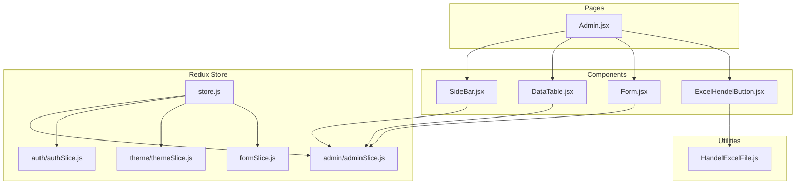
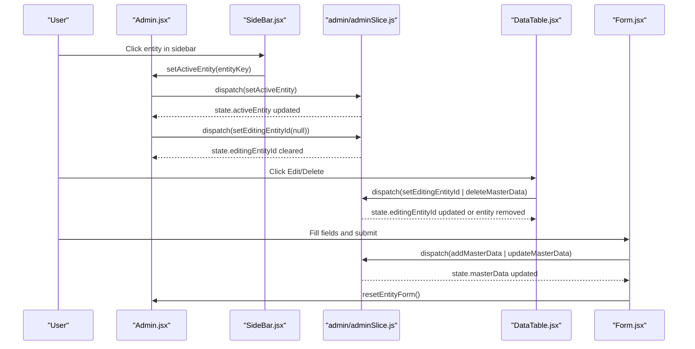
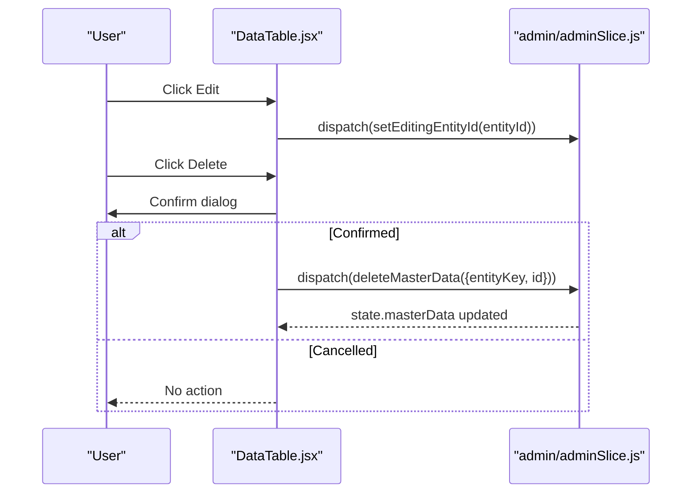
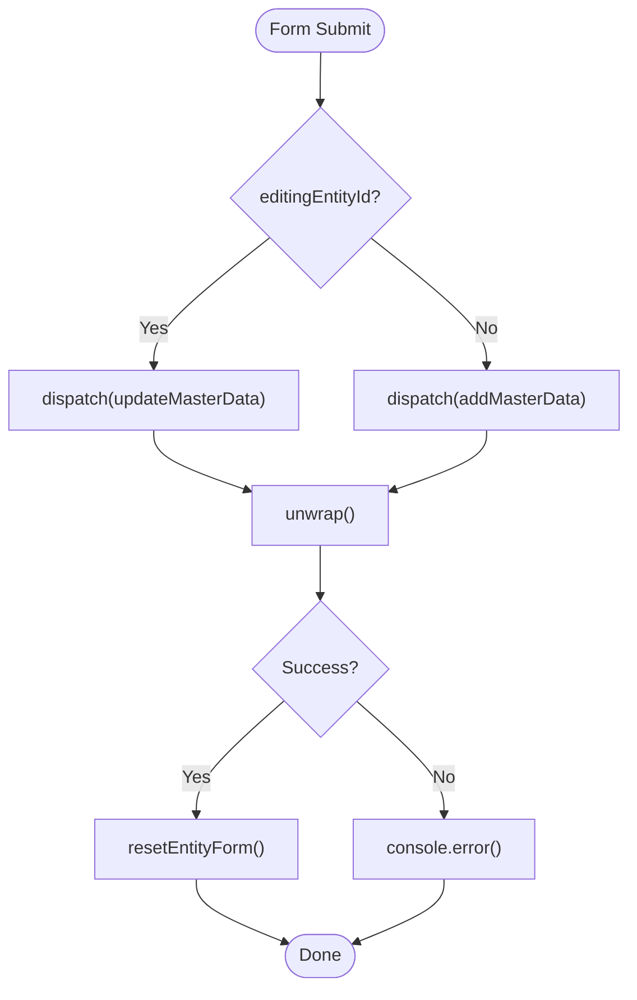
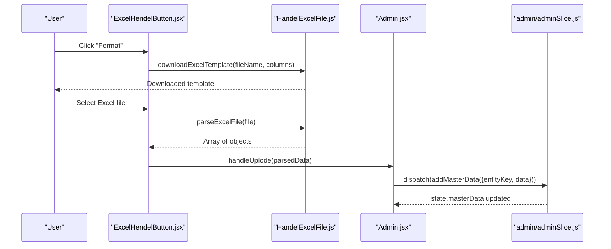
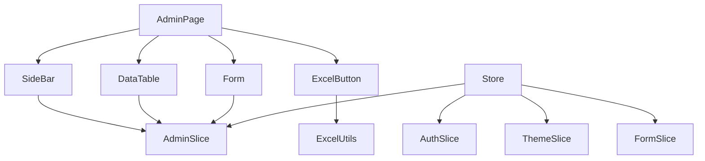

# Dashboard Components

<cite>
**Referenced Files in This Document**
- [SideBar.jsx](file://Client/src/components/deshboard/SideBar.jsx)
- [DataTable.jsx](file://Client/src/components/deshboard/DataTable.jsx)
- [Form.jsx](file://Client/src/components/deshboard/Form.jsx)
- [adminSlice.js](file://Client/src/store/admin/adminSlice.js)
- [authSlice.js](file://Client/src/store/auth/authSlice.js)
- [formSlice.js](file://Client/src/store/formSlice.js)
- [store.js](file://Client/src/store/store.js)
- [Admin.jsx](file://Client/src/pages/dashboard/Admin.jsx)
- [ExcelHendelButton.jsx](file://Client/src/components/ExcelHendelButton.jsx)
- [HandelExcelFile.js](file://Client/src/utils/HandelExcelFile.js)
- [themeSlice.js](file://Client/src/store/theme/themeSlice.js)
</cite>

## Table of Contents
1. [Introduction](#introduction)
2. [Project Structure](#project-structure)
3. [Core Components](#core-components)
4. [Architecture Overview](#architecture-overview)
5. [Detailed Component Analysis](#detailed-component-analysis)
6. [Dependency Analysis](#dependency-analysis)
7. [Performance Considerations](#performance-considerations)
8. [Troubleshooting Guide](#troubleshooting-guide)
9. [Conclusion](#conclusion)

## Introduction
This document provides comprehensive documentation for the dashboard-specific components: SideBar, DataTable, and Form. It explains the SideBar component's navigation structure, active state management, and role-based visibility. It details the DataTable component's data rendering, sorting, filtering, pagination, and CSV export functionality. It explains the Form component's input validation, field mapping, submission handling, and error management. Additionally, it covers props interfaces, event handling patterns, styling approaches, and integration with Redux state management for data operations.

## Project Structure
The dashboard components reside under Client/src/components/deshboard and integrate with Redux slices under Client/src/store. The Admin page orchestrates these components and manages entity configurations.

**Diagram sources**
- [Admin.jsx:17-617](file://Client/src/pages/dashboard/Admin.jsx#L17-L617)
- [SideBar.jsx:1-49](file://Client/src/components/deshboard/SideBar.jsx#L1-L49)
- [DataTable.jsx:1-86](file://Client/src/components/deshboard/DataTable.jsx#L1-L86)
- [Form.jsx:1-127](file://Client/src/components/deshboard/Form.jsx#L1-L127)
- [ExcelHendelButton.jsx:1-85](file://Client/src/components/ExcelHendelButton.jsx#L1-L85)
- [store.js:1-15](file://Client/src/store/store.js#L1-L15)
- [adminSlice.js:1-173](file://Client/src/store/admin/adminSlice.js#L1-L173)
- [authSlice.js:1-32](file://Client/src/store/auth/authSlice.js#L1-L32)
- [themeSlice.js:1-29](file://Client/src/store/theme/themeSlice.js#L1-L29)
- [formSlice.js:1-24](file://Client/src/store/formSlice.js#L1-L24)
- [HandelExcelFile.js:1-35](file://Client/src/utils/HandelExcelFile.js#L1-L35)

**Section sources**
- [Admin.jsx:17-617](file://Client/src/pages/dashboard/Admin.jsx#L17-L617)
- [store.js:1-15](file://Client/src/store/store.js#L1-L15)

## Core Components
This section documents the three primary dashboard components and their responsibilities.

- SideBar: Provides navigation among master entities, displays counts, and manages active selection.
- DataTable: Renders tabular data for the selected entity, supports edit and delete actions.
- Form: Handles entity creation/editing with field mapping and submission to backend via Redux.

**Section sources**
- [SideBar.jsx:1-49](file://Client/src/components/deshboard/SideBar.jsx#L1-L49)
- [DataTable.jsx:1-86](file://Client/src/components/deshboard/DataTable.jsx#L1-L86)
- [Form.jsx:1-127](file://Client/src/components/deshboard/Form.jsx#L1-L127)

## Architecture Overview
The Admin page composes SideBar, DataTable, and Form. SideBar updates the active entity and clears editing state. DataTable reads from Redux masterData and dispatches delete actions. Form reads editingEntityId and masterData to prefill edits, then dispatches add/update actions. Redux slices manage async operations and state transitions.

**Diagram sources**
- [Admin.jsx:414-419](file://Client/src/pages/dashboard/Admin.jsx#L414-L419)
- [SideBar.jsx:30-37](file://Client/src/components/deshboard/SideBar.jsx#L30-L37)
- [adminSlice.js:91-102](file://Client/src/store/admin/adminSlice.js#L91-L102)
- [DataTable.jsx:10-18](file://Client/src/components/deshboard/DataTable.jsx#L10-L18)
- [Form.jsx:37-50](file://Client/src/components/deshboard/Form.jsx#L37-L50)

## Detailed Component Analysis

### SideBar Component
The SideBar component renders a navigation list of master entities derived from ENTITY_CONFIG. It computes counts from masterData and applies active state styling. Clicking an entity updates the active entity and clears editing state.

- Props interface:
  - ENTITY_CONFIG: object mapping entity keys to configuration objects
  - masterData: object containing arrays of entities keyed by entity type
  - activeEntity: currently selected entity key
  - setActiveEntity: callback to update active entity
  - setEditingEntityId: callback to clear editing state

- Active state management:
  - Uses activeEntity prop to conditionally apply active styles
  - Clears editingEntityId upon selection change

- Role-based visibility:
  - Not directly implemented in SideBar; visibility is controlled by the Admin page routing based on user role

- Styling approach:
  - Uses Tailwind utility classes for spacing, colors, and hover effects
  - Active item highlighted with primary color accents

**Diagram sources**
- [SideBar.jsx:5-44](file://Client/src/components/deshboard/SideBar.jsx#L5-L44)

**Section sources**
- [SideBar.jsx:1-49](file://Client/src/components/deshboard/SideBar.jsx#L1-L49)
- [Admin.jsx:52-406](file://Client/src/pages/dashboard/Admin.jsx#L52-L406)

### DataTable Component
The DataTable component renders a table of entities for the active entity. It displays fields defined in the entity configuration and provides Edit/Delete actions. It reads entities from Redux masterData and dispatches delete actions.

- Props interface:
  - currentEntityConfig: configuration object for the active entity
  - activeEntity: key of the active entity

- Data rendering:
  - Reads entities from state.admin.masterData[activeEntity]
  - Renders headers from currentEntityConfig.fields
  - Renders rows with field values; boolean fields display Yes/No

- Actions:
  - Edit: dispatches setEditingEntityId with entity id
  - Delete: dispatches deleteMasterData after confirmation

- Pagination and filtering:
  - Not implemented in DataTable; all entities are rendered

- Sorting:
  - Not implemented in DataTable; order follows Redux state

- CSV export:
  - Implemented via ExcelHendelButton integration in Admin page

**Diagram sources**
- [DataTable.jsx:10-18](file://Client/src/components/deshboard/DataTable.jsx#L10-L18)
- [adminSlice.js:67-78](file://Client/src/store/admin/adminSlice.js#L67-L78)

**Section sources**
- [DataTable.jsx:1-86](file://Client/src/components/deshboard/DataTable.jsx#L1-L86)
- [adminSlice.js:80-173](file://Client/src/store/admin/adminSlice.js#L80-L173)

### Form Component
The Form component handles entity creation and editing. It maps fields from currentEntityConfig, manages local form state, and dispatches Redux actions for add/update. It also integrates with Redux for error clearing and editing state.

- Props interface:
  - currentEntityConfig: configuration object for the active entity
  - activeEntity: key of the active entity

- Field mapping:
  - Iterates currentEntityConfig.fields to render inputs
  - Boolean fields rendered as checkboxes
  - Text fields rendered as text inputs with placeholders and required attributes

- Input handling:
  - handleEntityInputChange updates entityForm based on input type
  - Supports text inputs and checkbox inputs

- Validation:
  - Uses HTML5 required attribute for required fields
  - No custom validation logic in component

- Submission handling:
  - On submit, checks editingEntityId
  - Dispatches updateMasterData if editing, otherwise addMasterData
  - Resets form state on successful completion

- Error management:
  - Redux adminSlice stores error messages
  - Form component clears error state on reset

- Integration with Redux:
  - Reads editingEntityId and masterData from state
  - Uses setEditingEntityId, addMasterData, updateMasterData, clearError

**Diagram sources**
- [Form.jsx:37-50](file://Client/src/components/deshboard/Form.jsx#L37-L50)
- [adminSlice.js:38-78](file://Client/src/store/admin/adminSlice.js#L38-L78)

**Section sources**
- [Form.jsx:1-127](file://Client/src/components/deshboard/Form.jsx#L1-L127)
- [adminSlice.js:80-173](file://Client/src/store/admin/adminSlice.js#L80-L173)

### CSV Export and Import Integration
The Admin page integrates CSV export/import functionality via ExcelHendelButton and HandelExcelFile utilities. The ExcelHendelButton component allows downloading templates and uploading Excel files, which are parsed and dispatched to Redux for bulk additions.

- Template download:
  - ExcelHendelButton triggers downloadExcelTemplate with column names derived from currentEntityConfig.fields

- File upload:
  - ExcelHendelButton parses uploaded Excel files using parseExcelFile
  - Parsed data is passed to handleUplode, which dispatches addMasterData

- Entity configuration:
  - Some entities define csvExampleHeader for guidance

**Diagram sources**
- [ExcelHendelButton.jsx:19-31](file://Client/src/components/ExcelHendelButton.jsx#L19-L31)
- [HandelExcelFile.js:6-34](file://Client/src/utils/HandelExcelFile.js#L6-L34)
- [Admin.jsx:421-423](file://Client/src/pages/dashboard/Admin.jsx#L421-L423)
- [adminSlice.js:38-50](file://Client/src/store/admin/adminSlice.js#L38-L50)

**Section sources**
- [ExcelHendelButton.jsx:1-85](file://Client/src/components/ExcelHendelButton.jsx#L1-L85)
- [HandelExcelFile.js:1-35](file://Client/src/utils/HandelExcelFile.js#L1-L35)
- [Admin.jsx:421-423](file://Client/src/pages/dashboard/Admin.jsx#L421-L423)

## Dependency Analysis
The dashboard components depend on Redux slices for state management and on the Admin page for orchestration and configuration.

**Diagram sources**
- [store.js:1-15](file://Client/src/store/store.js#L1-L15)
- [adminSlice.js:1-173](file://Client/src/store/admin/adminSlice.js#L1-L173)
- [authSlice.js:1-32](file://Client/src/store/auth/authSlice.js#L1-L32)
- [themeSlice.js:1-29](file://Client/src/store/theme/themeSlice.js#L1-L29)
- [formSlice.js:1-24](file://Client/src/store/formSlice.js#L1-L24)

**Section sources**
- [store.js:1-15](file://Client/src/store/store.js#L1-L15)
- [adminSlice.js:1-173](file://Client/src/store/admin/adminSlice.js#L1-L173)

## Performance Considerations
- Rendering lists: DataTable renders all entities without pagination. For large datasets, consider implementing pagination or virtualization.
- Re-renders: SideBar recomputes counts on each render; memoization could reduce unnecessary re-renders.
- Async operations: Redux async thunks handle network requests; ensure loading states are displayed to improve perceived performance.
- Styling: Utility-first CSS reduces bundle size; avoid excessive inline styles.

## Troubleshooting Guide
- Active entity not updating:
  - Verify setActiveEntity is called from SideBar and that activeEntity prop is passed correctly.
  - Check that setEditingEntityId is invoked to clear editing state.

- Edit/Delete actions not working:
  - Ensure activeEntity is set before dispatching actions.
  - Confirm that masterData contains the expected entity arrays.

- Form submission errors:
  - Check Redux error state in adminSlice; errors are stored in state.error.
  - Verify that currentEntityConfig matches the entity structure.

- CSV upload failures:
  - Validate that uploaded file conforms to the template columns.
  - Inspect console logs for parse errors from parseExcelFile.

**Section sources**
- [adminSlice.js:104-168](file://Client/src/store/admin/adminSlice.js#L104-L168)
- [Form.jsx:37-50](file://Client/src/components/deshboard/Form.jsx#L37-L50)
- [HandelExcelFile.js:16-34](file://Client/src/utils/HandelExcelFile.js#L16-L34)

## Conclusion
The dashboard components provide a cohesive interface for managing master entities. SideBar offers intuitive navigation with active state management, DataTable presents data with essential actions, and Form enables efficient entity creation and editing. Integration with Redux ensures predictable state updates and robust async handling. Future enhancements could include pagination, advanced filtering/sorting, and role-based visibility controls.