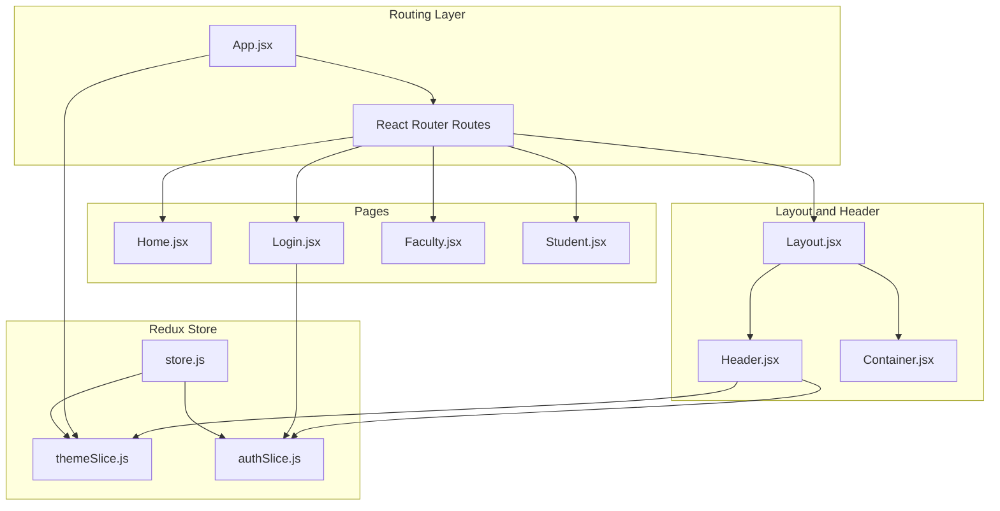
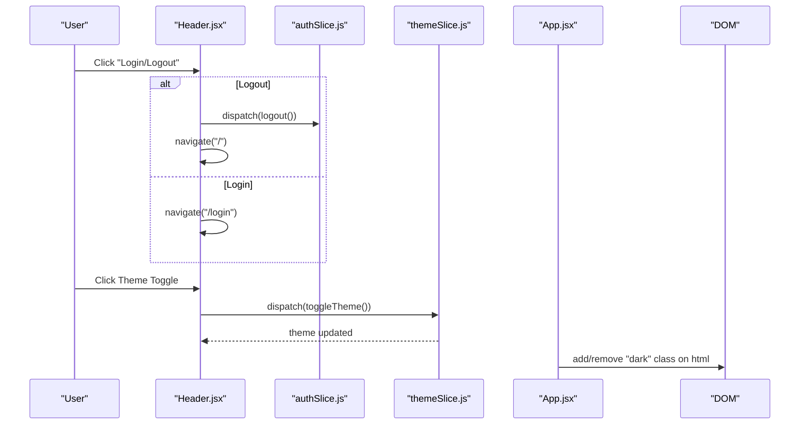
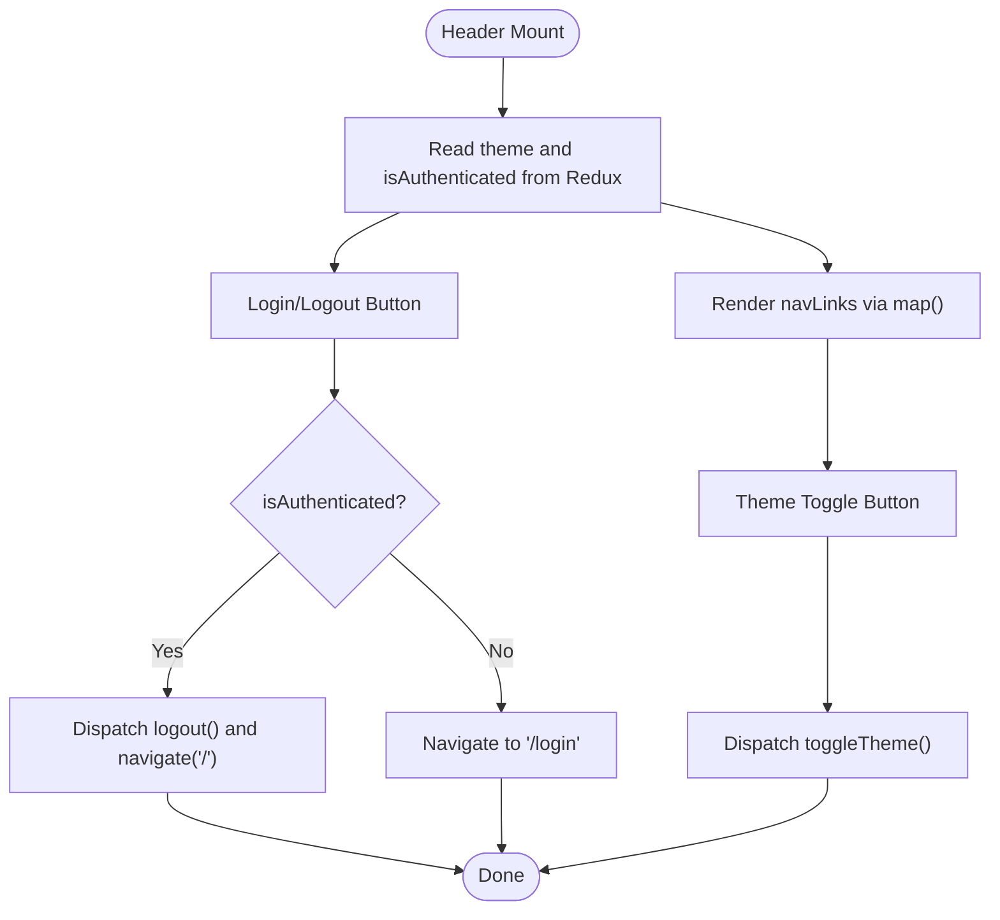
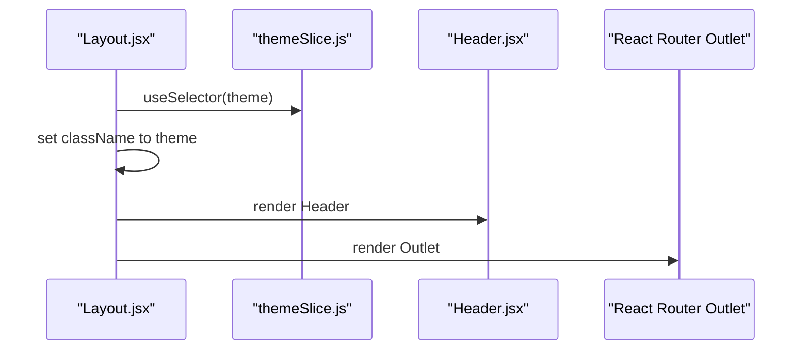
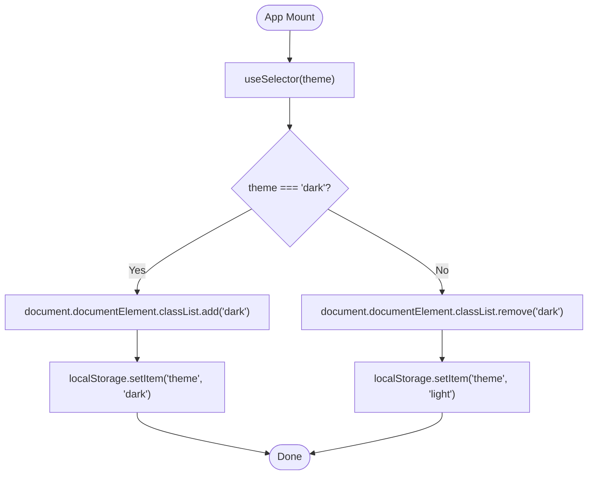
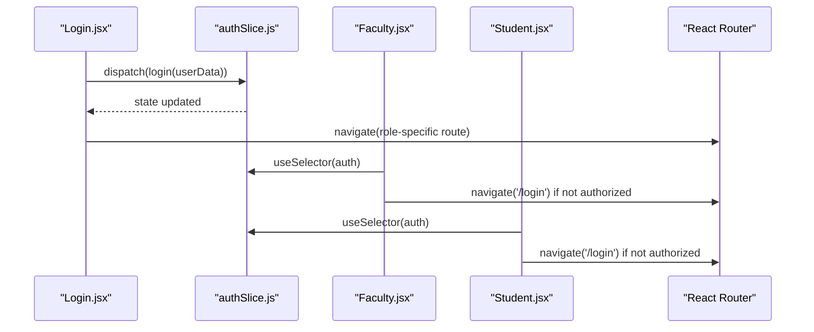
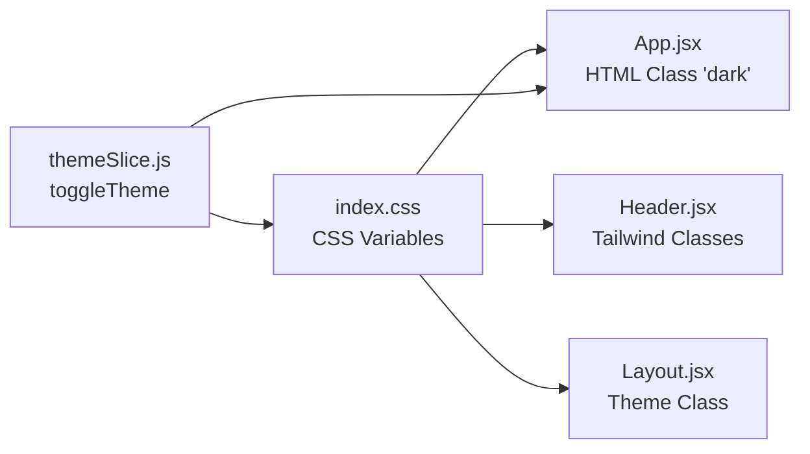
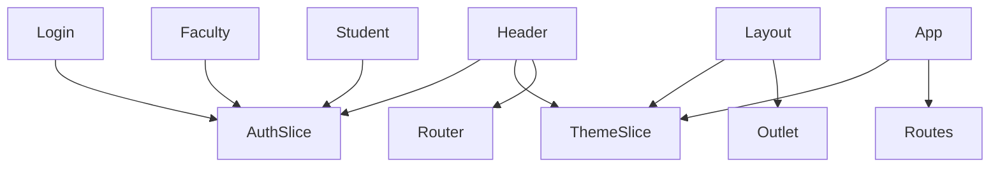

# Navigation Components

<cite>
**Referenced Files in This Document**
- [Header.jsx](file://Client/src/components/Header.jsx)
- [Layout.jsx](file://Client/src/components/Layout.jsx)
- [Container.jsx](file://Client/src/components/Container.jsx)
- [App.jsx](file://Client/src/App.jsx)
- [store.js](file://Client/src/store/store.js)
- [themeSlice.js](file://Client/src/store/theme/themeSlice.js)
- [authSlice.js](file://Client/src/store/auth/authSlice.js)
- [index.css](file://Client/src/index.css)
- [main.jsx](file://Client/src/main.jsx)
- [Home.jsx](file://Client/src/pages/Home.jsx)
- [Login.jsx](file://Client/src/pages/Login.jsx)
- [Faculty.jsx](file://Client/src/pages/dashboard/Faculty.jsx)
- [Student.jsx](file://Client/src/pages/dashboard/Student.jsx)
- [adminSlice.js](file://Client/src/store/admin/adminSlice.js)
</cite>

## Table of Contents
1. [Introduction](#introduction)
2. [Project Structure](#project-structure)
3. [Core Components](#core-components)
4. [Architecture Overview](#architecture-overview)
5. [Detailed Component Analysis](#detailed-component-analysis)
6. [Dependency Analysis](#dependency-analysis)
7. [Performance Considerations](#performance-considerations)
8. [Troubleshooting Guide](#troubleshooting-guide)
9. [Conclusion](#conclusion)
10. [Appendices](#appendices)

## Introduction
This document provides comprehensive documentation for the navigation components in the client application, focusing on the Header and Layout components. It explains how navigation links, theme toggle, authentication controls, and responsive design patterns are implemented. It also covers the Layout component’s role in page templating, styling with Tailwind CSS, integration with React Router, customization patterns for navigation items, authentication state handling, responsive breakpoints, and state management integration with Redux.

## Project Structure
The navigation system is composed of:
- Header: Provides branding, navigation links, theme toggle, and authentication controls.
- Layout: Wraps pages with the Header and renders routed content via Outlet.
- Container: A lightweight wrapper for consistent horizontal spacing.
- App: Defines routing and applies theme to the document root.
- Store: Centralized Redux slices for theme and authentication state.
- Pages: Role-based pages protected by authentication checks.

**Diagram sources**
- [App.jsx:13-38](file://Client/src/App.jsx#L13-L38)
- [Layout.jsx:7-20](file://Client/src/components/Layout.jsx#L7-L20)
- [Header.jsx:8-121](file://Client/src/components/Header.jsx#L8-L121)
- [store.js:7-14](file://Client/src/store/store.js#L7-L14)
- [themeSlice.js:15-28](file://Client/src/store/theme/themeSlice.js#L15-L28)
- [authSlice.js:10-31](file://Client/src/store/auth/authSlice.js#L10-L31)
- [Home.jsx:4-11](file://Client/src/pages/Home.jsx#L4-L11)
- [Login.jsx:9-45](file://Client/src/pages/Login.jsx#L9-L45)
- [Faculty.jsx:5-19](file://Client/src/pages/dashboard/Faculty.jsx#L5-L19)
- [Student.jsx:5-19](file://Client/src/pages/dashboard/Student.jsx#L5-L19)

**Section sources**
- [App.jsx:13-38](file://Client/src/App.jsx#L13-L38)
- [Layout.jsx:7-20](file://Client/src/components/Layout.jsx#L7-L20)
- [Header.jsx:8-121](file://Client/src/components/Header.jsx#L8-L121)
- [store.js:7-14](file://Client/src/store/store.js#L7-L14)

## Core Components
- Header
  - Purpose: Renders branding, navigation links, theme toggle, and authentication controls.
  - Key behaviors:
    - Reads theme and authentication state from Redux.
    - Handles logout and login navigation.
    - Toggles theme via Redux action.
    - Renders a configurable navLinks array.
  - Styling: Uses Tailwind utility classes and CSS variables for theme-aware colors.
  - Routing: Uses React Router’s Link and NavLink for navigation.

- Layout
  - Purpose: Page template that wraps content with Header and renders Outlet.
  - Behavior: Applies theme class to the root div and centers content via Container.
  - Integration: Consumes theme state to set the HTML class for dark mode support.

- Container
  - Purpose: Minimal wrapper to apply consistent horizontal padding and layout classes.

- App
  - Purpose: Configures routing and applies theme to the document root by toggling the “dark” class on the html element.

- Redux Store
  - themeSlice: Manages theme state, persists to localStorage, and supports initial preference detection.
  - authSlice: Manages authentication state and user data, persisting to localStorage.

**Section sources**
- [Header.jsx:8-121](file://Client/src/components/Header.jsx#L8-L121)
- [Layout.jsx:7-20](file://Client/src/components/Layout.jsx#L7-L20)
- [Container.jsx:3-5](file://Client/src/components/Container.jsx#L3-L5)
- [App.jsx:14-24](file://Client/src/App.jsx#L14-L24)
- [themeSlice.js:15-28](file://Client/src/store/theme/themeSlice.js#L15-L28)
- [authSlice.js:10-31](file://Client/src/store/auth/authSlice.js#L10-L31)

## Architecture Overview
The navigation architecture integrates routing, state management, and styling:
- Routing: App defines routes and nests Layout under the root path, rendering Home by default and nested role-specific pages.
- State: Header and App subscribe to Redux for theme and authentication state.
- Styling: Tailwind CSS with CSS variables enables theme-aware color tokens and dark mode via a root class.

**Diagram sources**
- [Header.jsx:14-28](file://Client/src/components/Header.jsx#L14-L28)
- [authSlice.js:20-25](file://Client/src/store/auth/authSlice.js#L20-L25)
- [themeSlice.js:19-22](file://Client/src/store/theme/themeSlice.js#L19-L22)
- [App.jsx:16-23](file://Client/src/App.jsx#L16-L23)

## Detailed Component Analysis

### Header Component
- Responsibilities
  - Render branding and site title.
  - Provide navigation links via a configurable array.
  - Toggle theme and switch between Login and Logout actions.
  - Integrate with React Router for navigation.

- Props
  - None (presentational component; reads from Redux and uses React Router hooks).

- Event Handlers
  - logoutHandler: Dispatches logout action and navigates to home.
  - loginHandler: Navigates to login route.
  - themeHandler: Dispatches theme toggle action.

- Styling and Tailwind
  - Uses Tailwind utilities for spacing, typography, and hover effects.
  - Leverages CSS variables for theme-aware colors.
  - Responsive classes: hidden on small screens, visible on medium and larger screens.

- Integration with React Router
  - Uses NavLink for active link styling and Link for internal navigation.
  - Uses useNavigate for imperative navigation.

- Authentication Controls
  - Reads isAuthenticated from Redux to decide whether to show Login or Logout.
  - On logout, clears Redux state and navigates to home.

- Customizing Navigation Items
  - Modify the navLinks array to add or remove items.
  - Each item supports label, href, and optional onClick handler.

- Responsive Design Patterns
  - Desktop-first layout with hidden mobile menu placeholder.
  - md breakpoint for desktop visibility.

**Diagram sources**
- [Header.jsx:11-28](file://Client/src/components/Header.jsx#L11-L28)
- [authSlice.js:20-25](file://Client/src/store/auth/authSlice.js#L20-L25)
- [themeSlice.js:19-22](file://Client/src/store/theme/themeSlice.js#L19-L22)

**Section sources**
- [Header.jsx:8-121](file://Client/src/components/Header.jsx#L8-L121)
- [authSlice.js:10-31](file://Client/src/store/auth/authSlice.js#L10-L31)
- [themeSlice.js:15-28](file://Client/src/store/theme/themeSlice.js#L15-L28)

### Layout Component
- Responsibilities
  - Serve as a page template with Header and Outlet rendering.
  - Apply theme class to the root container.
  - Center content with Container.

- Props
  - None (consumes theme via Redux).

- Rendering Flow
  - Sets className to the current theme value.
  - Renders Header and wraps Outlet inside Container.

- Composition Pattern
  - Composes Header and Outlet to create a consistent page shell.

**Diagram sources**
- [Layout.jsx:7-20](file://Client/src/components/Layout.jsx#L7-L20)
- [themeSlice.js:11-13](file://Client/src/store/theme/themeSlice.js#L11-L13)
- [Header.jsx:8-121](file://Client/src/components/Header.jsx#L8-L121)

**Section sources**
- [Layout.jsx:7-20](file://Client/src/components/Layout.jsx#L7-L20)
- [themeSlice.js:11-13](file://Client/src/store/theme/themeSlice.js#L11-L13)

### App Component and Theme Integration
- Responsibilities
  - Define routes and nest Layout under the root path.
  - Apply theme to the document root by toggling the “dark” class on html.

- Theme Application
  - Adds/removes “dark” class based on theme state.
  - Persists theme selection to localStorage.

**Diagram sources**
- [App.jsx:14-24](file://Client/src/App.jsx#L14-L24)

**Section sources**
- [App.jsx:13-38](file://Client/src/App.jsx#L13-L38)
- [themeSlice.js:3-9](file://Client/src/store/theme/themeSlice.js#L3-L9)

### Authentication State Management
- authSlice
  - Maintains isAuthenticated and userData in Redux.
  - Persists state to localStorage on login/logout.
  - Used by Header for Login/Logout button and by role-based pages for protection.

- Role-Based Pages
  - Faculty and Student pages check authentication and role, redirecting unauthenticated or unauthorized users to login.

**Diagram sources**
- [Login.jsx:15-44](file://Client/src/pages/Login.jsx#L15-L44)
- [authSlice.js:14-25](file://Client/src/store/auth/authSlice.js#L14-L25)
- [Faculty.jsx:10-14](file://Client/src/pages/dashboard/Faculty.jsx#L10-L14)
- [Student.jsx:10-14](file://Client/src/pages/dashboard/Student.jsx#L10-L14)

**Section sources**
- [authSlice.js:10-31](file://Client/src/store/auth/authSlice.js#L10-L31)
- [Login.jsx:9-45](file://Client/src/pages/Login.jsx#L9-L45)
- [Faculty.jsx:5-19](file://Client/src/pages/dashboard/Faculty.jsx#L5-L19)
- [Student.jsx:5-19](file://Client/src/pages/dashboard/Student.jsx#L5-L19)

### Styling Approach with Tailwind CSS and CSS Variables
- Tailwind Utilities
  - Used for spacing, typography, colors, hover states, transitions, and responsive breakpoints.
- CSS Variables
  - Theme tokens mapped to CSS variables in index.css.
  - Root and dark themes define color palettes.
  - Header and other components consume these variables for consistent theming.

**Diagram sources**
- [index.css:4-35](file://Client/src/index.css#L4-L35)
- [Header.jsx:38-114](file://Client/src/components/Header.jsx#L38-L114)
- [Layout.jsx:11](file://Client/src/components/Layout.jsx#L11)
- [App.jsx:16-23](file://Client/src/App.jsx#L16-L23)
- [themeSlice.js:19-22](file://Client/src/store/theme/themeSlice.js#L19-L22)

**Section sources**
- [index.css:4-41](file://Client/src/index.css#L4-L41)
- [Header.jsx:38-114](file://Client/src/components/Header.jsx#L38-L114)
- [Layout.jsx:11](file://Client/src/components/Layout.jsx#L11)
- [App.jsx:16-23](file://Client/src/App.jsx#L16-L23)
- [themeSlice.js:19-22](file://Client/src/store/theme/themeSlice.js#L19-L22)

### Customizing Navigation Items
- To add or modify navigation items:
  - Extend the navLinks array in Header with label, href, and optional onClick.
  - Use NavLink for styled active states and Link for external navigation.
  - Keep the array declarative and reusable across renders.

**Section sources**
- [Header.jsx:30-65](file://Client/src/components/Header.jsx#L30-L65)

### Handling Authentication States
- Login flow:
  - Submit credentials, dispatch login action, and navigate based on role.
- Logout flow:
  - Dispatch logout action and navigate to home.
- Protected routes:
  - Role-based pages check authentication and role, redirecting if invalid.

**Section sources**
- [Login.jsx:15-44](file://Client/src/pages/Login.jsx#L15-L44)
- [authSlice.js:20-25](file://Client/src/store/auth/authSlice.js#L20-L25)
- [Faculty.jsx:10-14](file://Client/src/pages/dashboard/Faculty.jsx#L10-L14)
- [Student.jsx:10-14](file://Client/src/pages/dashboard/Student.jsx#L10-L14)

### Implementing Responsive Breakpoints
- Desktop-first approach:
  - Use hidden on small screens and md:block for medium+ screens.
  - Adjust spacing and typography with responsive utilities (e.g., sm, lg).

**Section sources**
- [Header.jsx:47-116](file://Client/src/components/Header.jsx#L47-L116)

### Component Composition Patterns and Redux Integration
- Composition:
  - Layout composes Header and Outlet.
  - Header composes Container and uses React Router components.
- Redux:
  - useSelector to read theme and auth state.
  - useDispatch to dispatch theme and auth actions.
  - Store configured with theme and auth reducers.

**Section sources**
- [Layout.jsx:7-20](file://Client/src/components/Layout.jsx#L7-L20)
- [Header.jsx:11-12](file://Client/src/components/Header.jsx#L11-L12)
- [store.js:7-14](file://Client/src/store/store.js#L7-L14)

## Dependency Analysis
- Internal Dependencies
  - Header depends on authSlice and themeSlice for state and on React Router for navigation.
  - Layout depends on themeSlice for theming and on Outlet for content rendering.
  - App depends on themeSlice for applying the “dark” class and on routing for page structure.
- External Dependencies
  - React Router for routing and navigation.
  - Redux Toolkit for state management.
  - Tailwind CSS for styling.

**Diagram sources**
- [Header.jsx:11-12](file://Client/src/components/Header.jsx#L11-L12)
- [Layout.jsx:8](file://Client/src/components/Layout.jsx#L8)
- [App.jsx:14](file://Client/src/App.jsx#L14)
- [authSlice.js:10-31](file://Client/src/store/auth/authSlice.js#L10-L31)
- [themeSlice.js:15-28](file://Client/src/store/theme/themeSlice.js#L15-L28)

**Section sources**
- [Header.jsx:11-12](file://Client/src/components/Header.jsx#L11-L12)
- [Layout.jsx:8](file://Client/src/components/Layout.jsx#L8)
- [App.jsx:14](file://Client/src/App.jsx#L14)
- [authSlice.js:10-31](file://Client/src/store/auth/authSlice.js#L10-L31)
- [themeSlice.js:15-28](file://Client/src/store/theme/themeSlice.js#L15-L28)

## Performance Considerations
- Prefer memoization for navigation arrays if they grow large.
- Keep theme toggling minimal and avoid unnecessary re-renders by selecting only required state.
- Use lazy loading for heavy route components if needed.
- Minimize DOM updates by applying theme once per state change.

## Troubleshooting Guide
- Theme not applying
  - Verify theme state updates and that App toggles the “dark” class on html.
  - Ensure CSS variables are defined and accessible.
- Navigation not working
  - Confirm React Router is properly wrapped with BrowserRouter and Provider.
  - Check that routes are correctly defined and nested.
- Authentication redirects
  - Ensure authSlice persists state to localStorage and that role-based pages check both authentication and role.
- Styling inconsistencies
  - Confirm Tailwind utilities align with CSS variable tokens and that responsive classes are applied correctly.

**Section sources**
- [App.jsx:16-23](file://Client/src/App.jsx#L16-L23)
- [index.css:4-41](file://Client/src/index.css#L4-L41)
- [main.jsx:9-17](file://Client/src/main.jsx#L9-L17)
- [authSlice.js:14-25](file://Client/src/store/auth/authSlice.js#L14-L25)
- [Faculty.jsx:10-14](file://Client/src/pages/dashboard/Faculty.jsx#L10-L14)
- [Student.jsx:10-14](file://Client/src/pages/dashboard/Student.jsx#L10-L14)

## Conclusion
The navigation system combines a flexible Header component, a reusable Layout template, and Redux-managed theme and authentication state. It leverages Tailwind CSS and CSS variables for consistent theming, integrates seamlessly with React Router, and supports responsive design patterns. The documented patterns enable easy customization of navigation items, robust authentication handling, and scalable theming across the application.

## Appendices
- Example Paths
  - Theme toggle action: [themeSlice.js:19-22](file://Client/src/store/theme/themeSlice.js#L19-L22)
  - Logout action: [authSlice.js:20-25](file://Client/src/store/auth/authSlice.js#L20-L25)
  - Login submission: [Login.jsx:15-44](file://Client/src/pages/Login.jsx#L15-L44)
  - Protected route checks: [Faculty.jsx:10-14](file://Client/src/pages/dashboard/Faculty.jsx#L10-L14), [Student.jsx:10-14](file://Client/src/pages/dashboard/Student.jsx#L10-L14)
  - Routing setup: [App.jsx:27-36](file://Client/src/App.jsx#L27-L36)