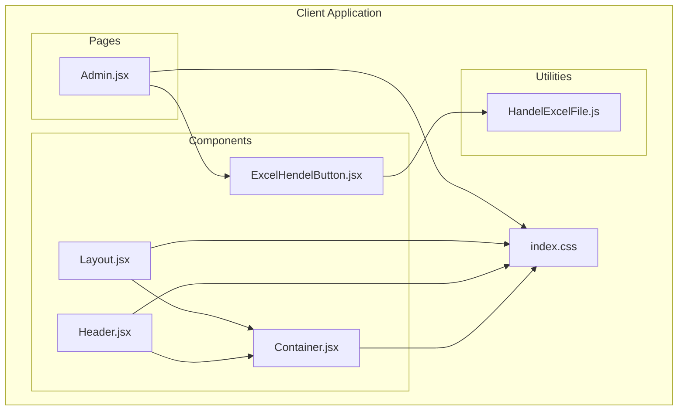
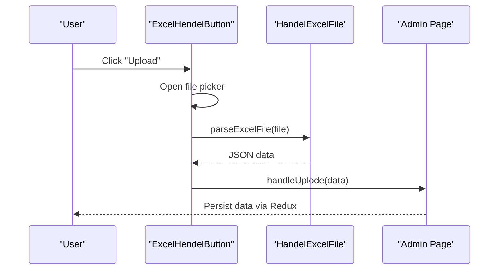
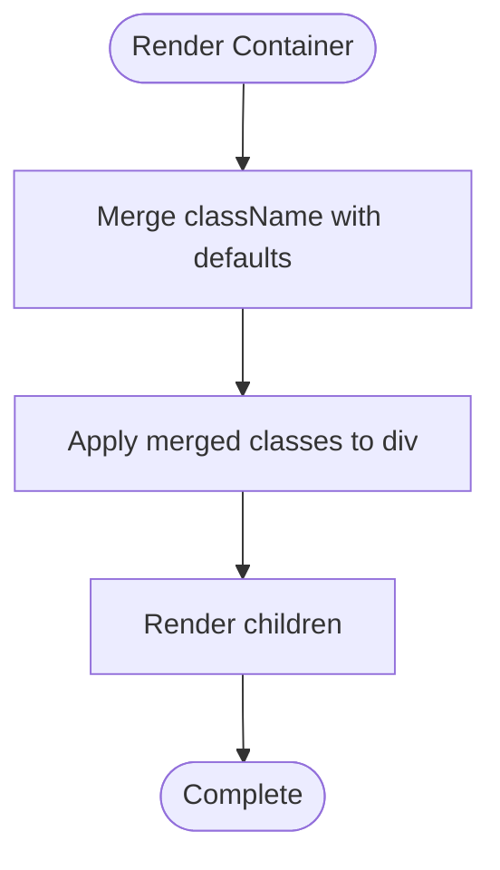
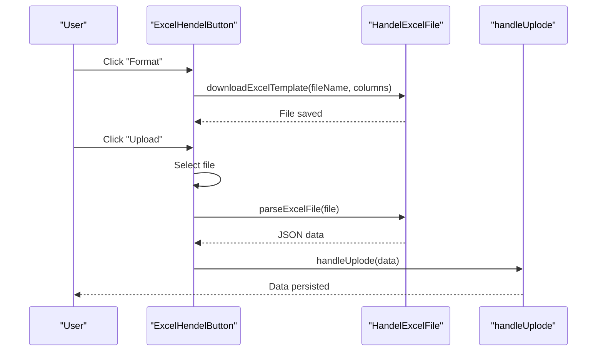
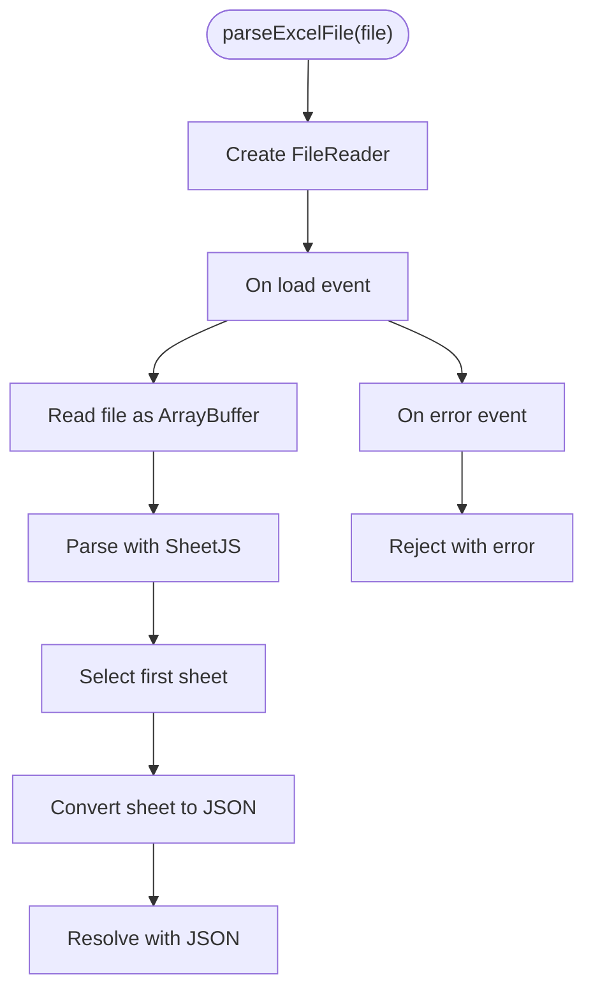
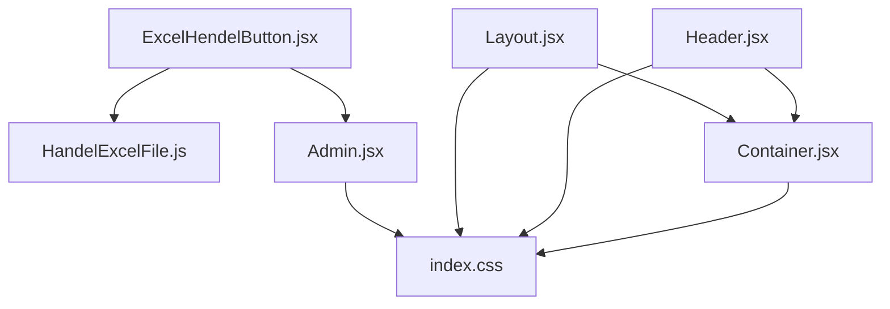

# Utility Components

<cite>
**Referenced Files in This Document**
- [Container.jsx](file://Client/src/components/Container.jsx)
- [ExcelHendelButton.jsx](file://Client/src/components/ExcelHendelButton.jsx)
- [HandelExcelFile.js](file://Client/src/utils/HandelExcelFile.js)
- [Layout.jsx](file://Client/src/components/Layout.jsx)
- [Header.jsx](file://Client/src/components/Header.jsx)
- [Admin.jsx](file://Client/src/pages/dashboard/Admin.jsx)
- [index.css](file://Client/src/index.css)
</cite>

## Table of Contents
1. [Introduction](#introduction)
2. [Project Structure](#project-structure)
3. [Core Components](#core-components)
4. [Architecture Overview](#architecture-overview)
5. [Detailed Component Analysis](#detailed-component-analysis)
6. [Dependency Analysis](#dependency-analysis)
7. [Performance Considerations](#performance-considerations)
8. [Troubleshooting Guide](#troubleshooting-guide)
9. [Conclusion](#conclusion)
10. [Appendices](#appendices)

## Introduction
This document provides comprehensive documentation for two utility components: Container and ExcelHendelButton. It explains how Container manages responsive layout and spacing, and how ExcelHendelButton handles file uploads, CSV processing, validation, and error feedback. The guide includes prop configurations, styling patterns, accessibility considerations, integration points, and practical examples for customizing layouts and implementing file handling workflows.

## Project Structure
The utility components are part of the Client application and integrate with Tailwind CSS for styling and Redux for state management. Container is a minimal wrapper used across pages and layouts, while ExcelHendelButton orchestrates Excel template downloads and CSV parsing with robust error handling.

**Diagram sources**
- [Container.jsx:1-7](file://Client/src/components/Container.jsx#L1-L7)
- [ExcelHendelButton.jsx:1-85](file://Client/src/components/ExcelHendelButton.jsx#L1-L85)
- [HandelExcelFile.js:1-35](file://Client/src/utils/HandelExcelFile.js#L1-L35)
- [Layout.jsx:1-22](file://Client/src/components/Layout.jsx#L1-L22)
- [Header.jsx:1-122](file://Client/src/components/Header.jsx#L1-L122)
- [Admin.jsx:1-617](file://Client/src/pages/dashboard/Admin.jsx#L1-L617)
- [index.css:1-42](file://Client/src/index.css#L1-L42)

**Section sources**
- [Container.jsx:1-7](file://Client/src/components/Container.jsx#L1-L7)
- [ExcelHendelButton.jsx:1-85](file://Client/src/components/ExcelHendelButton.jsx#L1-L85)
- [HandelExcelFile.js:1-35](file://Client/src/utils/HandelExcelFile.js#L1-L35)
- [Layout.jsx:1-22](file://Client/src/components/Layout.jsx#L1-L22)
- [Header.jsx:1-122](file://Client/src/components/Header.jsx#L1-L122)
- [Admin.jsx:1-617](file://Client/src/pages/dashboard/Admin.jsx#L1-L617)
- [index.css:1-42](file://Client/src/index.css#L1-L42)

## Core Components
This section documents the responsibilities, props, and usage patterns of Container and ExcelHendelButton.

- Container
  - Purpose: Provides a flexible wrapper for page content with responsive padding and alignment.
  - Props:
    - children: Content to render inside the container.
    - className: Optional Tailwind utility classes to customize layout and spacing.
  - Behavior: Renders a div with merged className and children. It does not enforce fixed widths or margins; customization is achieved via className.

- ExcelHendelButton
  - Purpose: Offers a dual-action UI for downloading an Excel template and uploading parsed CSV data.
  - Props:
    - formet: Array of objects defining column headers for the template. Defaults to a placeholder structure.
    - handleUplode: Callback invoked with parsed CSV data upon successful upload.
    - fileName: Base name for the downloaded template file.
  - Behavior: Renders two buttons:
    - Download Template: Generates and downloads an Excel file containing the required column headers.
    - Upload: Opens a file picker for .xlsx/.xls files, parses them to JSON, and invokes handleUplode with the result. Errors are logged to the console.

**Section sources**
- [Container.jsx:3-5](file://Client/src/components/Container.jsx#L3-L5)
- [ExcelHendelButton.jsx:7-18](file://Client/src/components/ExcelHendelButton.jsx#L7-L18)
- [ExcelHendelButton.jsx:33-82](file://Client/src/components/ExcelHendelButton.jsx#L33-L82)

## Architecture Overview
The components integrate with the broader application architecture as follows:
- Layout wraps the main content area and applies global theme classes.
- Header uses Container to center navigation and actions with responsive padding.
- Admin page composes ExcelHendelButton dynamically based on the selected entity, passing entity-specific field configurations and a handler to persist data.

**Diagram sources**
- [ExcelHendelButton.jsx:19-31](file://Client/src/components/ExcelHendelButton.jsx#L19-L31)
- [HandelExcelFile.js:16-34](file://Client/src/utils/HandelExcelFile.js#L16-L34)
- [Admin.jsx:421-423](file://Client/src/pages/dashboard/Admin.jsx#L421-L423)

## Detailed Component Analysis

### Container Component
Container is a lightweight wrapper that centralizes layout concerns across the app. It accepts children and a className, merging them into a single div element. This design enables:
- Responsive padding via Tailwind utilities passed through className.
- Flexible alignment and spacing using flex utilities.
- Consistent integration with global theme classes applied at higher levels.

**Diagram sources**
- [Container.jsx:3-5](file://Client/src/components/Container.jsx#L3-L5)

Practical usage examples:
- Center content vertically and horizontally with flex utilities.
- Add responsive padding using breakpoints (e.g., sm:px-6, lg:px-8).
- Combine with justify-content utilities for alignment.

Integration points:
- Header uses Container to wrap navigation and actions with responsive horizontal padding.
- Layout uses Container to center main content within the theme-scoped root.

**Section sources**
- [Container.jsx:3-5](file://Client/src/components/Container.jsx#L3-L5)
- [Header.jsx:39](file://Client/src/components/Header.jsx#L39)
- [Layout.jsx:14](file://Client/src/components/Layout.jsx#L14)

### ExcelHendelButton Component
ExcelHendelButton encapsulates Excel template handling and CSV parsing. It provides:
- Template download: Generates an Excel file with required column headers.
- File upload: Parses uploaded Excel files and forwards data to a callback.
- Error handling: Logs errors during parsing to the console.

**Diagram sources**
- [ExcelHendelButton.jsx:36-56](file://Client/src/components/ExcelHendelButton.jsx#L36-L56)
- [ExcelHendelButton.jsx:75-81](file://Client/src/components/ExcelHendelButton.jsx#L75-L81)
- [HandelExcelFile.js:6-11](file://Client/src/utils/HandelExcelFile.js#L6-L11)
- [HandelExcelFile.js:16-34](file://Client/src/utils/HandelExcelFile.js#L16-L34)

Props configuration:
- formet: An array of objects where keys represent column headers. The first object defines the template structure.
- handleUplode: Receives parsed data as an array of objects. Use this to dispatch Redux actions or update local state.
- fileName: Controls the base name of the downloaded template file.

Styling patterns:
- Uses Tailwind utilities for button sizing, spacing, borders, and hover effects.
- Leverages theme variables for primary/accent colors.

Accessibility considerations:
- The file input is hidden; the label triggers the file dialog, improving UX.
- Buttons include titles and icons for clarity.

Integration with the overall architecture:
- Admin page dynamically configures ExcelHendelButton based on the active entity, passing entity-specific field headers and a handler to persist data.

**Section sources**
- [ExcelHendelButton.jsx:7-18](file://Client/src/components/ExcelHendelButton.jsx#L7-L18)
- [ExcelHendelButton.jsx:33-82](file://Client/src/components/ExcelHendelButton.jsx#L33-L82)
- [Admin.jsx:582-593](file://Client/src/pages/dashboard/Admin.jsx#L582-L593)

### Utility Functions: HandelExcelFile
The utility module provides two functions:
- downloadExcelTemplate(filename, columns): Creates a workbook with a sheet named "Template" and writes the first row as column headers.
- parseExcelFile(file): Reads the selected file using FileReader, parses it with SheetJS, and converts the first sheet to JSON.

**Diagram sources**
- [HandelExcelFile.js:16-34](file://Client/src/utils/HandelExcelFile.js#L16-L34)

**Section sources**
- [HandelExcelFile.js:6-11](file://Client/src/utils/HandelExcelFile.js#L6-L11)
- [HandelExcelFile.js:16-34](file://Client/src/utils/HandelExcelFile.js#L16-L34)

## Dependency Analysis
The components depend on Tailwind CSS for styling and SheetJS for Excel parsing. They integrate with the global theme system and Redux for state updates.

**Diagram sources**
- [ExcelHendelButton.jsx:5](file://Client/src/components/ExcelHendelButton.jsx#L5)
- [HandelExcelFile.js:1](file://Client/src/utils/HandelExcelFile.js#L1)
- [Admin.jsx:14](file://Client/src/pages/dashboard/Admin.jsx#L14)
- [Header.jsx:2](file://Client/src/components/Header.jsx#L2)
- [Layout.jsx:4](file://Client/src/components/Layout.jsx#L4)
- [Container.jsx:1](file://Client/src/components/Container.jsx#L1)
- [index.css:1-42](file://Client/src/index.css#L1-L42)

**Section sources**
- [ExcelHendelButton.jsx:1-85](file://Client/src/components/ExcelHendelButton.jsx#L1-L85)
- [HandelExcelFile.js:1-35](file://Client/src/utils/HandelExcelFile.js#L1-L35)
- [Admin.jsx:1-617](file://Client/src/pages/dashboard/Admin.jsx#L1-L617)
- [Header.jsx:1-122](file://Client/src/components/Header.jsx#L1-L122)
- [Layout.jsx:1-22](file://Client/src/components/Layout.jsx#L1-L22)
- [Container.jsx:1-7](file://Client/src/components/Container.jsx#L1-L7)
- [index.css:1-42](file://Client/src/index.css#L1-L42)

## Performance Considerations
- Excel parsing is performed synchronously in memory; large files may cause UI blocking. Consider:
  - Debouncing or throttling file selection.
  - Providing progress indicators for long-running operations.
  - Limiting file sizes or sheet counts.
- Template generation is lightweight and suitable for repeated use.
- Container renders a simple div; performance impact is negligible.

## Troubleshooting Guide
Common issues and resolutions:
- Excel file parsing fails:
  - Ensure the file is a valid .xlsx or .xls file.
  - Verify that the first sheet exists and contains data.
  - Check browser support for FileReader and SheetJS.
- Template download does not trigger:
  - Confirm that the filename and columns are provided.
  - Ensure the browser allows programmatic downloads.
- Error logs in console:
  - Review the error messages for parsing failures.
  - Validate that the handleUplode callback is defined and reachable.

**Section sources**
- [HandelExcelFile.js:16-34](file://Client/src/utils/HandelExcelFile.js#L16-L34)
- [ExcelHendelButton.jsx:27-29](file://Client/src/components/ExcelHendelButton.jsx#L27-L29)

## Conclusion
Container and ExcelHendelButton provide essential utility capabilities for layout and data import workflows. Container offers a flexible, responsive wrapper, while ExcelHendelButton streamlines Excel template handling and CSV parsing with clear integration points and error logging. Together, they enable efficient and accessible user experiences across the application.

## Appendices

### Customizing Container Layouts
Examples of className patterns for Container:
- Center content vertically and horizontally:
  - className="flex items-center justify-center"
- Responsive padding:
  - className="px-4 sm:px-6 lg:px-8"
- Horizontal centering with vertical spacing:
  - className="flex items-center justify-around"

These patterns leverage Tailwind’s flexbox and spacing utilities to achieve responsive layouts without hardcoding widths.

**Section sources**
- [Header.jsx:39](file://Client/src/components/Header.jsx#L39)
- [Layout.jsx:14](file://Client/src/components/Layout.jsx#L14)
- [Home.jsx:1-10](file://Client/src/pages/Home.jsx#L1-L10)
- [Login.jsx:60-115](file://Client/src/pages/Login.jsx#L60-L115)

### Implementing File Handling Workflows
Steps to integrate ExcelHendelButton in a page:
1. Define formet based on entity fields:
   - Use the entity’s field names as keys and placeholders as values.
2. Implement handleUplode:
   - Dispatch Redux actions or update local state with the parsed data.
3. Pass props to ExcelHendelButton:
   - fileName: Use the entity key for clarity.
   - formet: Construct from entity fields.
   - handleUplode: Reference the handler function.

Example integration points:
- Admin page demonstrates dynamic configuration and persistence.

**Section sources**
- [Admin.jsx:582-593](file://Client/src/pages/dashboard/Admin.jsx#L582-L593)
- [Admin.jsx:421-423](file://Client/src/pages/dashboard/Admin.jsx#L421-L423)