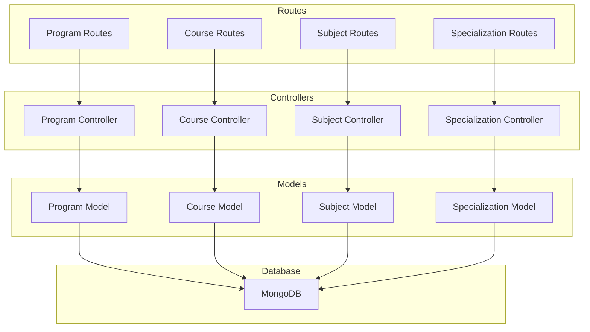
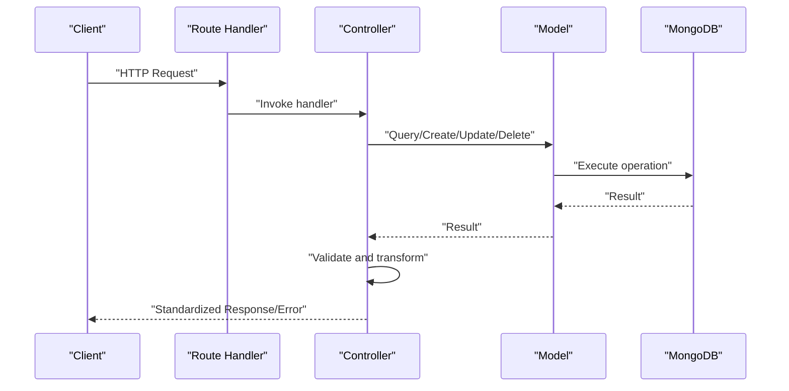
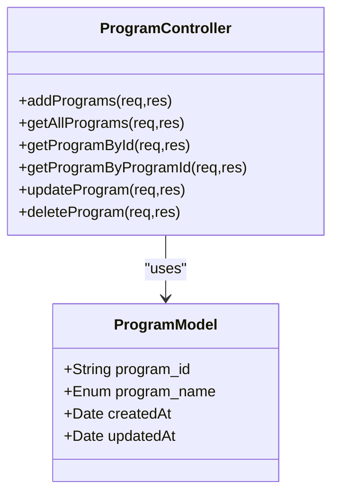
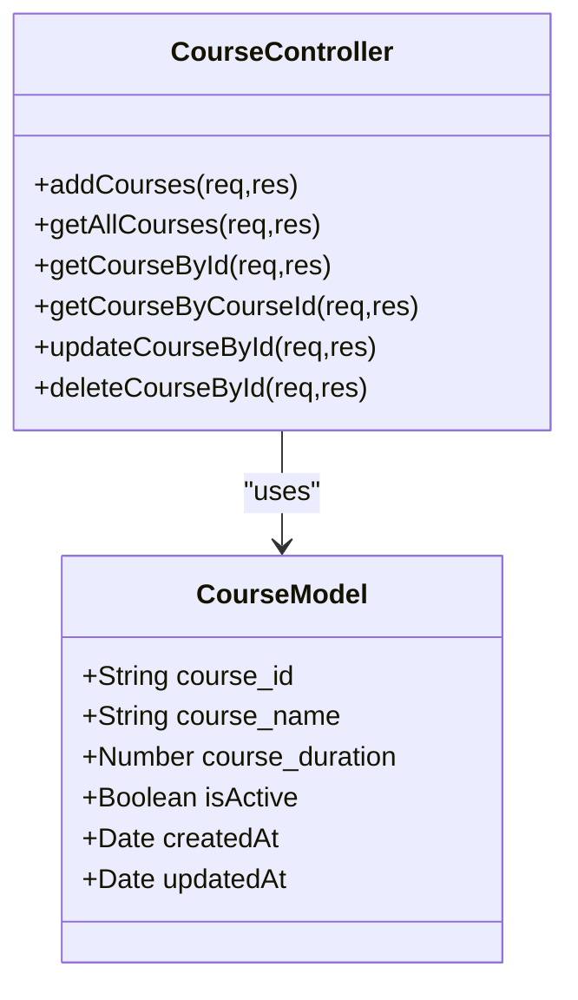
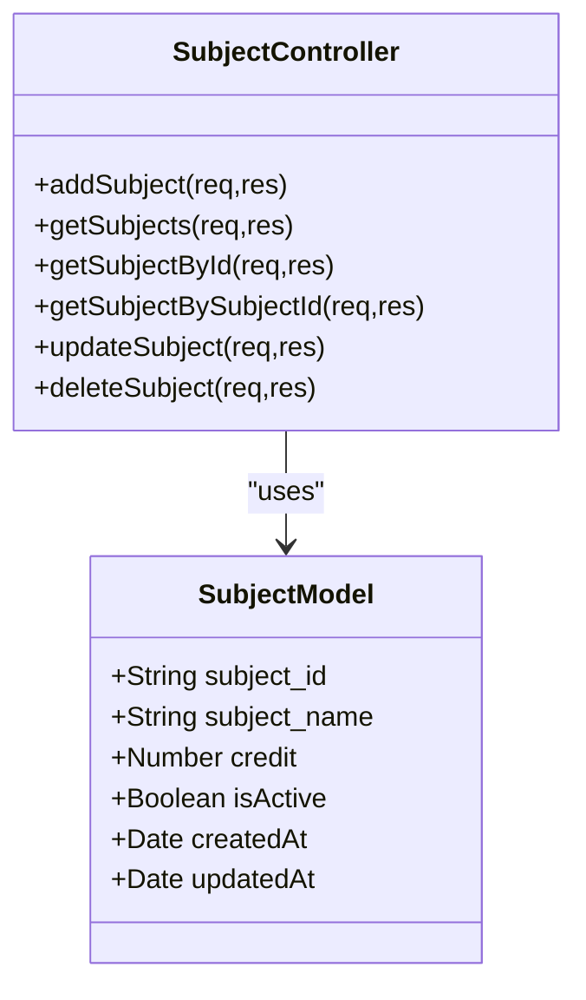
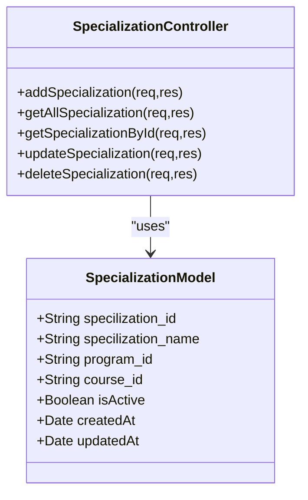
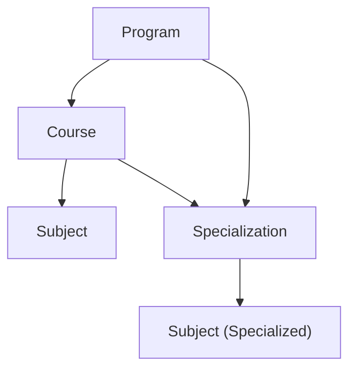
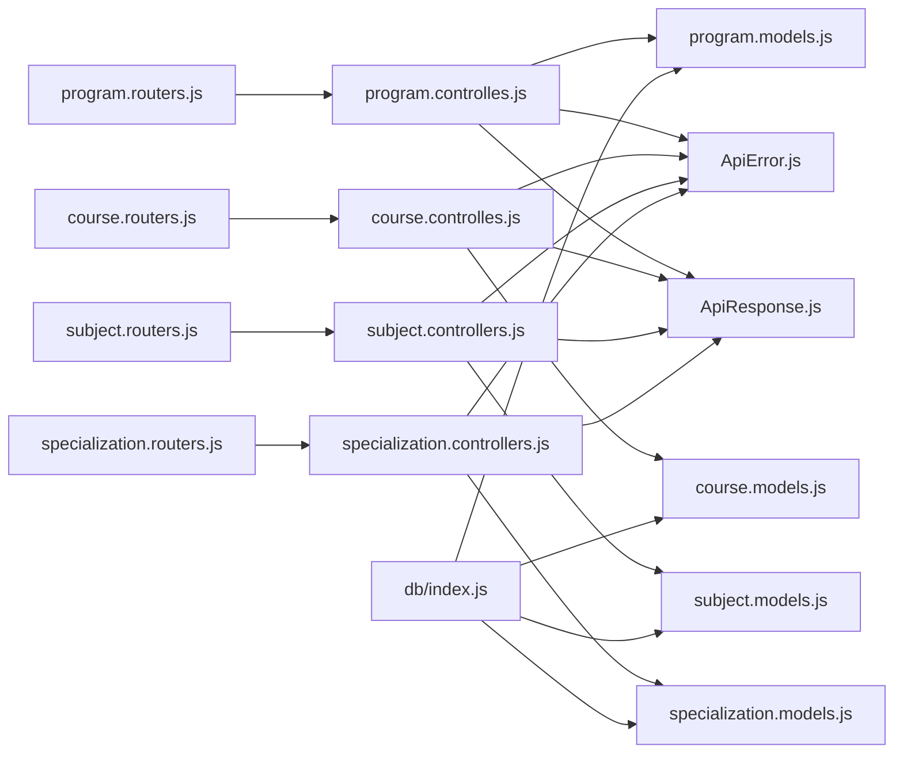

# Academic Entity Models

<cite>
**Referenced Files in This Document**
- [program.models.js](file://Backend/src/models/program.models.js)
- [course.models.js](file://Backend/src/models/course.models.js)
- [subject.models.js](file://Backend/src/models/subject.models.js)
- [specialization.models.js](file://Backend/src/models/specialization.models.js)
- [program.controlles.js](file://Backend/src/controllers/program.controlles.js)
- [course.controlles.js](file://Backend/src/controllers/course.controlles.js)
- [subject.controllers.js](file://Backend/src/controllers/subject.controllers.js)
- [specialization.controllers.js](file://Backend/src/controllers/specialization.controllers.js)
- [program.routers.js](file://Backend/src/routes/program.routers.js)
- [course.routers.js](file://Backend/src/routes/course.routers.js)
- [subject.routers.js](file://Backend/src/routes/subject.routers.js)
- [specialization.routers.js](file://Backend/src/routes/specialization.routers.js)
- [ApiError.js](file://Backend/src/utils/ApiError.js)
- [ApiResponse.js](file://Backend/src/utils/ApiResponse.js)
- [index.js](file://Backend/src/db/index.js)
</cite>

## Table of Contents
1. [Introduction](#introduction)
2. [Project Structure](#project-structure)
3. [Core Components](#core-components)
4. [Architecture Overview](#architecture-overview)
5. [Detailed Component Analysis](#detailed-component-analysis)
6. [Dependency Analysis](#dependency-analysis)
7. [Performance Considerations](#performance-considerations)
8. [Troubleshooting Guide](#troubleshooting-guide)
9. [Conclusion](#conclusion)
10. [Appendices](#appendices)

## Introduction
This document describes the academic entity models used to represent and manage educational structures: Program, Course, Subject, and Specialization. It explains the hierarchical relationships among these entities, the field definitions and validation rules, and how these models integrate with the backend controllers and routes to support timetable generation. Sample data structures illustrate typical academic configurations, and the relationships between entities are mapped to show their impact on scheduling algorithms.

## Project Structure
The academic models reside under the models directory and are exposed via dedicated controllers and routes. The database connection is centralized, and utility classes standardize error and response handling across endpoints.

**Diagram sources**
- [program.models.js:1-24](file://Backend/src/models/program.models.js#L1-L24)
- [course.models.js:1-33](file://Backend/src/models/course.models.js#L1-L33)
- [subject.models.js:1-33](file://Backend/src/models/subject.models.js#L1-L33)
- [specialization.models.js:1-39](file://Backend/src/models/specialization.models.js#L1-L39)
- [program.controlles.js:1-131](file://Backend/src/controllers/program.controlles.js#L1-L131)
- [course.controlles.js:1-136](file://Backend/src/controllers/course.controlles.js#L1-L136)
- [subject.controllers.js:1-130](file://Backend/src/controllers/subject.controllers.js#L1-L130)
- [specialization.controllers.js:1-121](file://Backend/src/controllers/specialization.controllers.js#L1-L121)
- [program.routers.js:1-24](file://Backend/src/routes/program.routers.js#L1-L24)
- [course.routers.js:1-24](file://Backend/src/routes/course.routers.js#L1-L24)
- [subject.routers.js:1-24](file://Backend/src/routes/subject.routers.js#L1-L24)
- [specialization.routers.js:1-21](file://Backend/src/routes/specialization.routers.js#L1-L21)
- [index.js:1-19](file://Backend/src/db/index.js#L1-L19)

**Section sources**
- [program.models.js:1-24](file://Backend/src/models/program.models.js#L1-L24)
- [course.models.js:1-33](file://Backend/src/models/course.models.js#L1-L33)
- [subject.models.js:1-33](file://Backend/src/models/subject.models.js#L1-L33)
- [specialization.models.js:1-39](file://Backend/src/models/specialization.models.js#L1-L39)
- [program.controlles.js:1-131](file://Backend/src/controllers/program.controlles.js#L1-L131)
- [course.controlles.js:1-136](file://Backend/src/controllers/course.controlles.js#L1-L136)
- [subject.controllers.js:1-130](file://Backend/src/controllers/subject.controllers.js#L1-L130)
- [specialization.controllers.js:1-121](file://Backend/src/controllers/specialization.controllers.js#L1-L121)
- [program.routers.js:1-24](file://Backend/src/routes/program.routers.js#L1-L24)
- [course.routers.js:1-24](file://Backend/src/routes/course.routers.js#L1-L24)
- [subject.routers.js:1-24](file://Backend/src/routes/subject.routers.js#L1-L24)
- [specialization.routers.js:1-21](file://Backend/src/routes/specialization.routers.js#L1-L21)
- [index.js:1-19](file://Backend/src/db/index.js#L1-L19)

## Core Components
This section defines each academic entity, its fields, validation rules, and business constraints.

- Program
  - Purpose: Represents an academic program (e.g., Under_Graduate, Post_Graduate, Diploma, Post_Diploma).
  - Fields:
    - program_id: Unique identifier, required, uppercase, trimmed.
    - program_name: Enumerated value from predefined set, required, lowercase, trimmed.
  - Validation and Constraints:
    - program_id uniqueness enforced at schema level.
    - program_name restricted to allowed values.
    - Timestamps enabled.

- Course
  - Purpose: Represents a course within a program, capturing duration and activity status.
  - Fields:
    - course_id: Unique identifier, required, uppercase, trimmed.
    - course_name: Required, lowercase, trimmed.
    - course_duration: Required numeric value.
    - isActive: Boolean flag with default true.
  - Validation and Constraints:
    - course_id uniqueness enforced at schema level.
    - Timestamps enabled.

- Subject
  - Purpose: Represents a subject/course unit with credits and activity status.
  - Fields:
    - subject_id: Unique identifier, required, uppercase, trimmed.
    - subject_name: Required, lowercase, trimmed, indexed for fast lookup.
    - credit: Required numeric value.
    - isActive: Boolean flag with default true.
  - Validation and Constraints:
    - subject_id uniqueness enforced at schema level.
    - Timestamps enabled.

- Specialization
  - Purpose: Defines a specialization within a program and course combination.
  - Fields:
    - specilization_id: Unique identifier, required, uppercase, trimmed.
    - specilization_name: Required, lowercase, trimmed.
    - program_id: Required, lowercase, trimmed.
    - course_id: Required, lowercase, trimmed.
    - isActive: Boolean flag with default true.
  - Validation and Constraints:
    - specilization_id uniqueness enforced at schema level.
    - program_id and course_id included to bind specialization to a program-course pair.
    - Timestamps enabled.

**Section sources**
- [program.models.js:3-21](file://Backend/src/models/program.models.js#L3-L21)
- [course.models.js:4-31](file://Backend/src/models/course.models.js#L4-L31)
- [subject.models.js:3-30](file://Backend/src/models/subject.models.js#L3-L30)
- [specialization.models.js:3-36](file://Backend/src/models/specialization.models.js#L3-L36)

## Architecture Overview
The academic models are consumed by controllers that implement CRUD operations and business logic. Routes expose endpoints for each model. Responses and errors are standardized via utility classes. The database connection is established centrally.

**Diagram sources**
- [program.routers.js:1-24](file://Backend/src/routes/program.routers.js#L1-L24)
- [course.routers.js:1-24](file://Backend/src/routes/course.routers.js#L1-L24)
- [subject.routers.js:1-24](file://Backend/src/routes/subject.routers.js#L1-L24)
- [specialization.routers.js:1-21](file://Backend/src/routes/specialization.routers.js#L1-L21)
- [program.controlles.js:1-131](file://Backend/src/controllers/program.controlles.js#L1-L131)
- [course.controlles.js:1-136](file://Backend/src/controllers/course.controlles.js#L1-L136)
- [subject.controllers.js:1-130](file://Backend/src/controllers/subject.controllers.js#L1-L130)
- [specialization.controllers.js:1-121](file://Backend/src/controllers/specialization.controllers.js#L1-L121)
- [ApiError.js:1-21](file://Backend/src/utils/ApiError.js#L1-L21)
- [ApiResponse.js:1-10](file://Backend/src/utils/ApiResponse.js#L1-L10)
- [index.js:1-19](file://Backend/src/db/index.js#L1-L19)

## Detailed Component Analysis

### Program Model and Controller
- Model highlights:
  - program_id and program_name with schema-level constraints.
  - Timestamps enabled.
- Controller highlights:
  - Bulk creation validates presence of required fields and filters duplicates before insertion.
  - Retrieves all programs, fetches by ObjectId or program_id, updates, and deletes with appropriate error handling.

**Diagram sources**
- [program.models.js:3-21](file://Backend/src/models/program.models.js#L3-L21)
- [program.controlles.js:5-45](file://Backend/src/controllers/program.controlles.js#L5-L45)

**Section sources**
- [program.models.js:3-21](file://Backend/src/models/program.models.js#L3-L21)
- [program.controlles.js:5-45](file://Backend/src/controllers/program.controlles.js#L5-L45)
- [program.routers.js:13-21](file://Backend/src/routes/program.routers.js#L13-L21)

### Course Model and Controller
- Model highlights:
  - course_id, course_name, course_duration, and isActive with schema-level constraints.
  - Timestamps enabled.
- Controller highlights:
  - Bulk creation validates required fields and deduplicates by course_id.
  - Fetches by ObjectId or course_id (uppercased during lookup), updates, and deletes with error handling.

**Diagram sources**
- [course.models.js:4-31](file://Backend/src/models/course.models.js#L4-L31)
- [course.controlles.js:5-40](file://Backend/src/controllers/course.controlles.js#L5-L40)

**Section sources**
- [course.models.js:4-31](file://Backend/src/models/course.models.js#L4-L31)
- [course.controlles.js:5-40](file://Backend/src/controllers/course.controlles.js#L5-L40)
- [course.routers.js:13-21](file://Backend/src/routes/course.routers.js#L13-L21)

### Subject Model and Controller
- Model highlights:
  - subject_id, subject_name, credit, and isActive with schema-level constraints.
  - subject_name indexed for efficient queries.
  - Timestamps enabled.
- Controller highlights:
  - Bulk creation validates required fields per subject and filters duplicates.
  - Fetches by ObjectId or subject_id, updates with validator execution, and deletes with error handling.

**Diagram sources**
- [subject.models.js:3-30](file://Backend/src/models/subject.models.js#L3-L30)
- [subject.controllers.js:6-41](file://Backend/src/controllers/subject.controllers.js#L6-L41)

**Section sources**
- [subject.models.js:3-30](file://Backend/src/models/subject.models.js#L3-L30)
- [subject.controllers.js:6-41](file://Backend/src/controllers/subject.controllers.js#L6-L41)
- [subject.routers.js:13-21](file://Backend/src/routes/subject.routers.js#L13-L21)

### Specialization Model and Controller
- Model highlights:
  - specilization_id, specilization_name, program_id, course_id, and isActive with schema-level constraints.
  - Timestamps enabled.
- Controller highlights:
  - Bulk creation validates required fields and filters duplicates.
  - Populated retrieval by id and list; updates and deletes with error handling.

**Diagram sources**
- [specialization.models.js:3-36](file://Backend/src/models/specialization.models.js#L3-L36)
- [specialization.controllers.js:6-41](file://Backend/src/controllers/specialization.controllers.js#L6-L41)

**Section sources**
- [specialization.models.js:3-36](file://Backend/src/models/specialization.models.js#L3-L36)
- [specialization.controllers.js:6-41](file://Backend/src/controllers/specialization.controllers.js#L6-L41)
- [specialization.routers.js:12-18](file://Backend/src/routes/specialization.routers.js#L12-L18)

### Hierarchical Relationships and Scheduling Impact
- Hierarchy:
  - Programs define broad academic categories.
  - Courses belong to a Program.
  - Subjects are units taught within a Course.
  - Specializations bind a Program and Course to define specialized tracks.
- Scheduling implications:
  - Timetables are typically generated per course and subject load.
  - Specializations influence which subjects are grouped for particular tracks.
  - The isActive flags allow deactivating inactive offerings without removing historical data.
  - Indexing on subject_name accelerates lookups during scheduling.

[No sources needed since this diagram shows conceptual relationships, not direct code structure]

## Dependency Analysis
- Controllers depend on models for persistence and on utility classes for standardized responses and errors.
- Routes delegate to controllers for business logic.
- Database connection is centralized and used implicitly by Mongoose models.

**Diagram sources**
- [program.routers.js:1-24](file://Backend/src/routes/program.routers.js#L1-L24)
- [course.routers.js:1-24](file://Backend/src/routes/course.routers.js#L1-L24)
- [subject.routers.js:1-24](file://Backend/src/routes/subject.routers.js#L1-L24)
- [specialization.routers.js:1-21](file://Backend/src/routes/specialization.routers.js#L1-L21)
- [program.controlles.js:1-131](file://Backend/src/controllers/program.controlles.js#L1-L131)
- [course.controlles.js:1-136](file://Backend/src/controllers/course.controlles.js#L1-L136)
- [subject.controllers.js:1-130](file://Backend/src/controllers/subject.controllers.js#L1-L130)
- [specialization.controllers.js:1-121](file://Backend/src/controllers/specialization.controllers.js#L1-L121)
- [ApiError.js:1-21](file://Backend/src/utils/ApiError.js#L1-L21)
- [ApiResponse.js:1-10](file://Backend/src/utils/ApiResponse.js#L1-L10)
- [index.js:1-19](file://Backend/src/db/index.js#L1-L19)

**Section sources**
- [program.controlles.js:1-131](file://Backend/src/controllers/program.controlles.js#L1-L131)
- [course.controlles.js:1-136](file://Backend/src/controllers/course.controlles.js#L1-L136)
- [subject.controllers.js:1-130](file://Backend/src/controllers/subject.controllers.js#L1-L130)
- [specialization.controllers.js:1-121](file://Backend/src/controllers/specialization.controllers.js#L1-L121)
- [index.js:1-19](file://Backend/src/db/index.js#L1-L19)

## Performance Considerations
- Indexing:
  - subject_name is indexed in the Subject model to optimize lookups during scheduling.
- Query patterns:
  - Controllers filter duplicates and perform bulk inserts to reduce round trips.
  - Population of program_id and course_id in Specialization endpoints improves readability but may increase query cost; use only when necessary.
- Validation:
  - runValidators is used during updates to maintain data integrity without custom middleware.

[No sources needed since this section provides general guidance]

## Troubleshooting Guide
- Common errors and causes:
  - Missing or invalid payload fields trigger ApiError with explicit messages in controllers.
  - Not found scenarios return 404-like ApiError instances.
  - Duplicate entries are filtered before insert/update to avoid constraint violations.
- Standardized responses:
  - ApiResponse wraps successful outcomes with status codes below 400.
  - ApiError captures status, message, and optional data for error responses.

**Section sources**
- [program.controlles.js:9-17](file://Backend/src/controllers/program.controlles.js#L9-L17)
- [course.controlles.js:8-18](file://Backend/src/controllers/course.controlles.js#L8-L18)
- [subject.controllers.js:11-19](file://Backend/src/controllers/subject.controllers.js#L11-L19)
- [specialization.controllers.js:9-18](file://Backend/src/controllers/specialization.controllers.js#L9-L18)
- [ApiError.js:1-21](file://Backend/src/utils/ApiError.js#L1-L21)
- [ApiResponse.js:1-10](file://Backend/src/utils/ApiResponse.js#L1-L10)

## Conclusion
The academic entity models provide a clear, extensible foundation for representing programs, courses, subjects, and specializations. Their schema-level validations and controller-side checks ensure data integrity. The hierarchical relationships enable structured timetable generation, while indexing and population strategies balance performance and usability. The standardized error and response utilities streamline integration and maintenance.

## Appendices

### Sample Data Structures
Representative configurations for typical academic setups:

- Program
  - program_id: "B.TECH"
  - program_name: "under_graduate"

- Course
  - course_id: "CS101"
  - course_name: "intro_to_programming"
  - course_duration: 1

- Subject
  - subject_id: "CS101L"
  - subject_name: "programming_lab"
  - credit: 2

- Specialization
  - specilization_id: "DS01"
  - specilization_name: "data_science"
  - program_id: "B.TECH"
  - course_id: "CS101"

These structures reflect the hierarchical binding: a Program contains Courses, Courses contain Subjects, and Specializations define specialized subject groupings within a Program-Course context.

[No sources needed since this section provides representative examples]