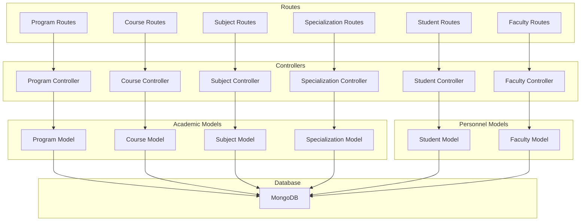
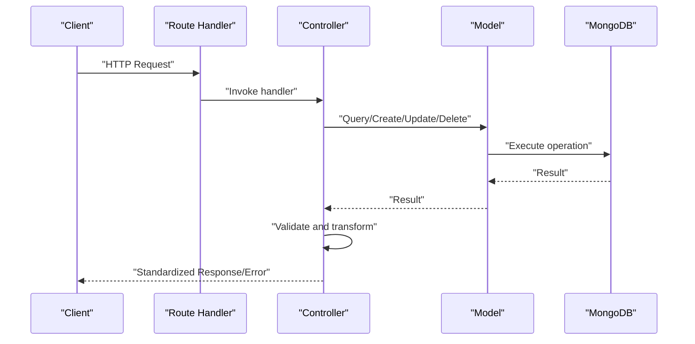
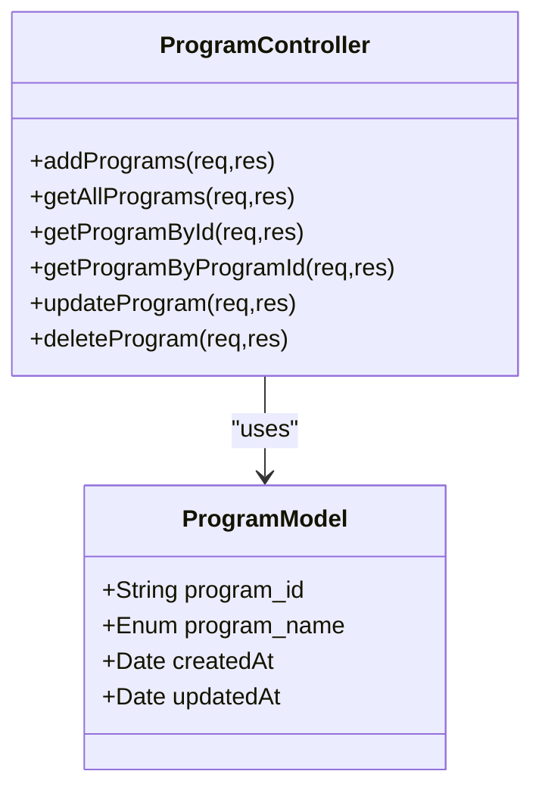
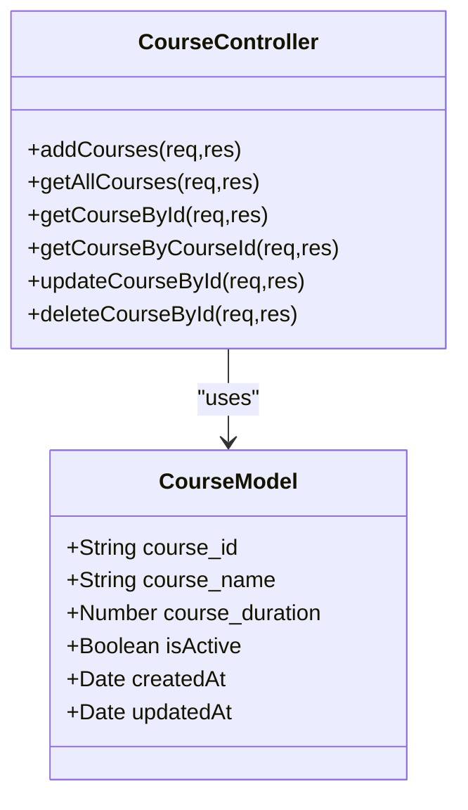
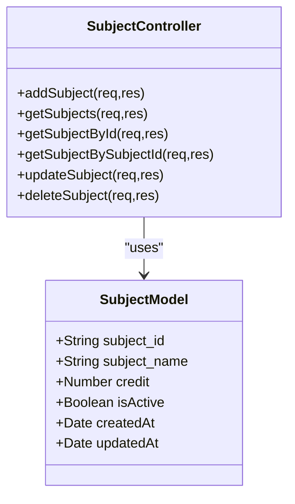
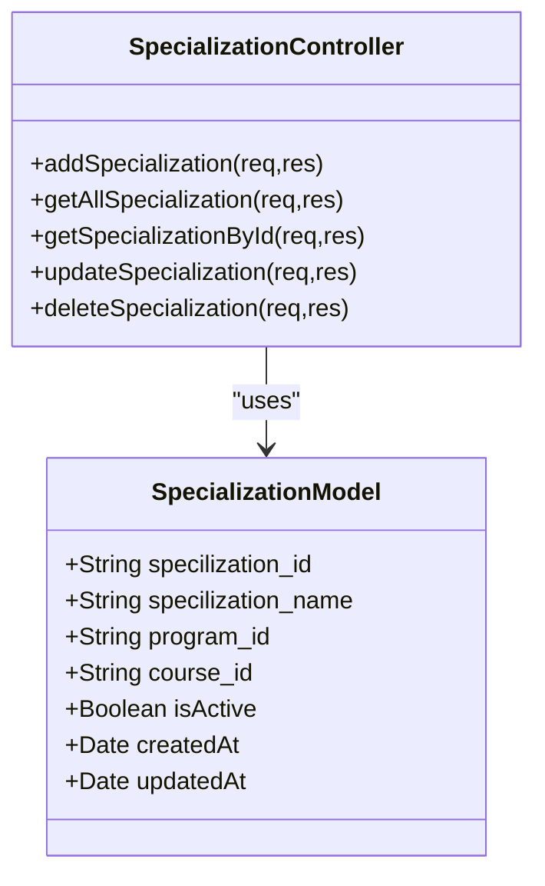
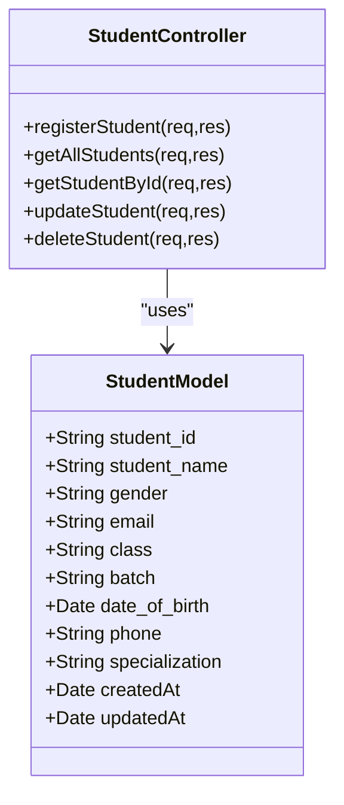
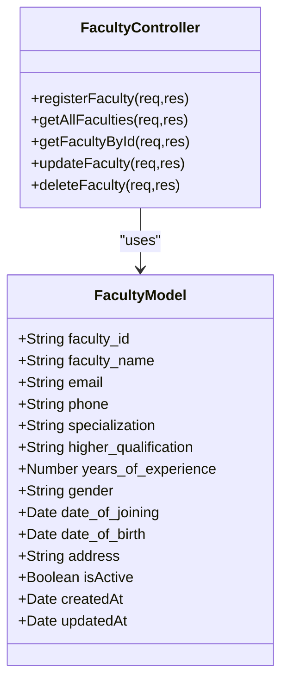
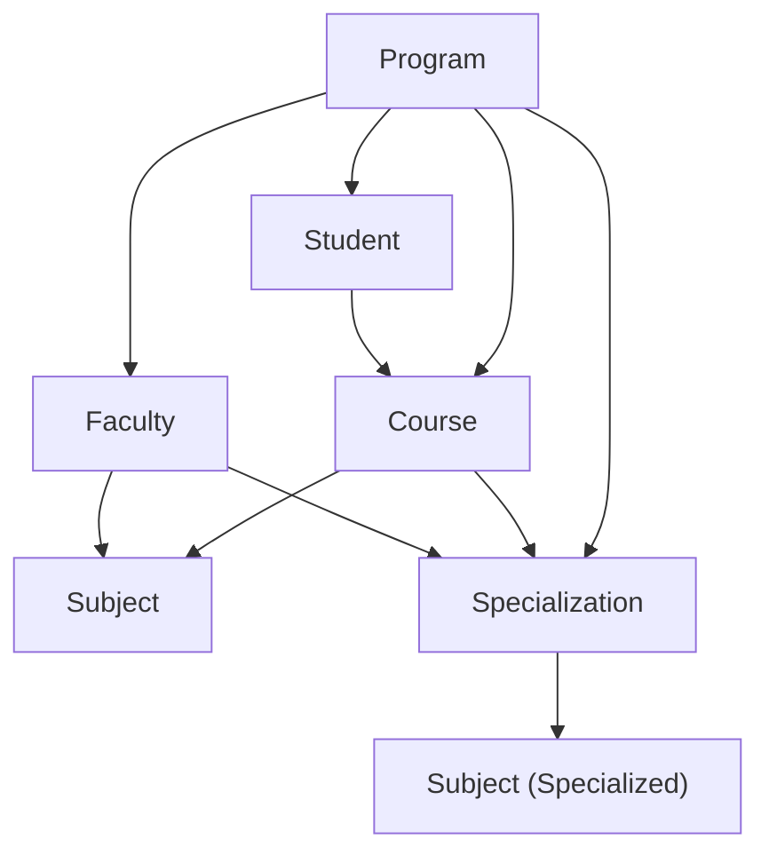
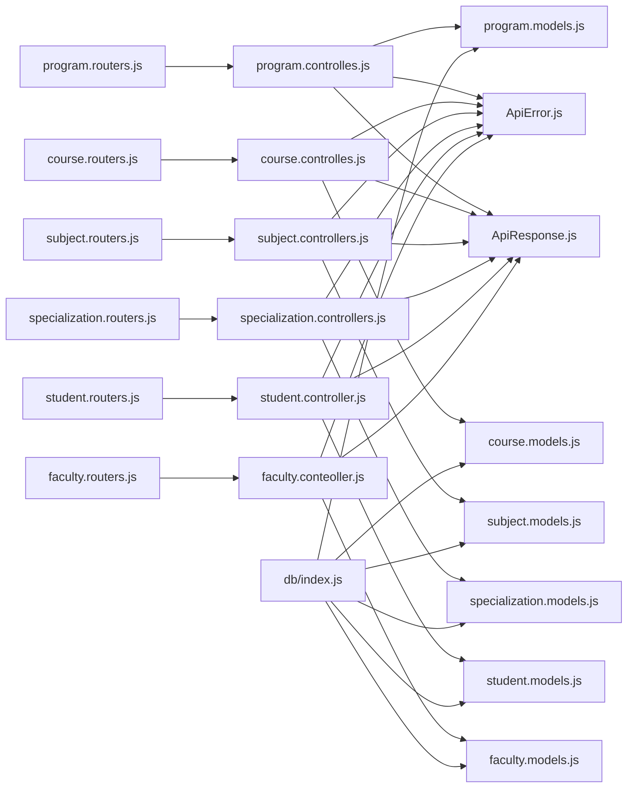

# Academic Entity Models

<cite>
**Referenced Files in This Document**
- [program.models.js](file://Backend/src/models/program.models.js)
- [course.models.js](file://Backend/src/models/course.models.js)
- [subject.models.js](file://Backend/src/models/subject.models.js)
- [specialization.models.js](file://Backend/src/models/specialization.models.js)
- [student.models.js](file://Backend/src/models/student.models.js)
- [faculty.models.js](file://Backend/src/models/faculty.models.js)
- [program.controlles.js](file://Backend/src/controllers/program.controlles.js)
- [course.controlles.js](file://Backend/src/controllers/course.controlles.js)
- [subject.controllers.js](file://Backend/src/controllers/subject.controllers.js)
- [specialization.controllers.js](file://Backend/src/controllers/specialization.controllers.js)
- [student.controller.js](file://Backend/src/controllers/student.controller.js)
- [faculty.conteoller.js](file://Backend/src/controllers/faculty.conteoller.js)
- [program.routers.js](file://Backend/src/routes/program.routers.js)
- [course.routers.js](file://Backend/src/routes/course.routers.js)
- [subject.routers.js](file://Backend/src/routes/subject.routers.js)
- [specialization.routers.js](file://Backend/src/routes/specialization.routers.js)
- [student.routers.js](file://Backend/src/routes/student.routers.js)
- [faculty.routers.js](file://Backend/src/routes/faculty.routers.js)
- [ApiError.js](file://Backend/src/utils/ApiError.js)
- [ApiResponse.js](file://Backend/src/utils/ApiResponse.js)
- [index.js](file://Backend/src/db/index.js)
</cite>

## Update Summary
**Changes Made**
- Added comprehensive documentation for Student and Faculty entity models
- Updated Academic Entity Models section to include Student and Faculty as core academic entities
- Enhanced validation rules section to document improved email validation using regex patterns
- Added phone number field documentation for Student and Faculty entities
- Updated hierarchical relationships to include Student-Faculty integration
- Added new sections for Student and Faculty model analysis
- Updated dependency analysis to include student and faculty models

## Table of Contents
1. [Introduction](#introduction)
2. [Project Structure](#project-structure)
3. [Core Components](#core-components)
4. [Architecture Overview](#architecture-overview)
5. [Detailed Component Analysis](#detailed-component-analysis)
6. [Dependency Analysis](#dependency-analysis)
7. [Performance Considerations](#performance-considerations)
8. [Troubleshooting Guide](#troubleshooting-guide)
9. [Conclusion](#conclusion)
10. [Appendices](#appendices)

## Introduction
This document describes the academic entity models used to represent and manage educational structures: Program, Course, Subject, Specialization, Student, and Faculty. It explains the hierarchical relationships among these entities, the field definitions and validation rules, and how these models integrate with the backend controllers and routes to support timetable generation. The models now include enhanced email validation using regex patterns and phone number fields for improved data integrity and completeness. Sample data structures illustrate typical academic configurations, and the relationships between entities are mapped to show their impact on scheduling algorithms.

## Project Structure
The academic models reside under the models directory and are exposed via dedicated controllers and routes. The database connection is centralized, and utility classes standardize error and response handling across endpoints. The system now includes comprehensive student and faculty management capabilities alongside the traditional academic hierarchy.

**Diagram sources**
- [program.models.js:1-24](file://Backend/src/models/program.models.js#L1-L24)
- [course.models.js:1-33](file://Backend/src/models/course.models.js#L1-L33)
- [subject.models.js:1-33](file://Backend/src/models/subject.models.js#L1-L33)
- [specialization.models.js:1-39](file://Backend/src/models/specialization.models.js#L1-L39)
- [student.models.js:1-71](file://Backend/src/models/student.models.js#L1-L71)
- [faculty.models.js:1-81](file://Backend/src/models/faculty.models.js#L1-L81)
- [program.controlles.js:1-131](file://Backend/src/controllers/program.controlles.js#L1-L131)
- [course.controlles.js:1-136](file://Backend/src/controllers/course.controlles.js#L1-L136)
- [subject.controllers.js:1-130](file://Backend/src/controllers/subject.controllers.js#L1-L130)
- [specialization.controllers.js:1-121](file://Backend/src/controllers/specialization.controllers.js#L1-L121)
- [student.controller.js:1-202](file://Backend/src/controllers/student.controller.js#L1-L202)
- [faculty.conteoller.js:1-203](file://Backend/src/controllers/faculty.conteoller.js#L1-L203)
- [program.routers.js:1-24](file://Backend/src/routes/program.routers.js#L1-L24)
- [course.routers.js:1-24](file://Backend/src/routes/course.routers.js#L1-L24)
- [subject.routers.js:1-24](file://Backend/src/routes/subject.routers.js#L1-L24)
- [specialization.routers.js:1-21](file://Backend/src/routes/specialization.routers.js#L1-L21)
- [student.routers.js:1-10](file://Backend/src/routes/student.routers.js#L1-L10)
- [faculty.routers.js:1-20](file://Backend/src/routes/faculty.routers.js#L1-L20)
- [index.js:1-19](file://Backend/src/db/index.js#L1-L19)

**Section sources**
- [program.models.js:1-24](file://Backend/src/models/program.models.js#L1-L24)
- [course.models.js:1-33](file://Backend/src/models/course.models.js#L1-L33)
- [subject.models.js:1-33](file://Backend/src/models/subject.models.js#L1-L33)
- [specialization.models.js:1-39](file://Backend/src/models/specialization.models.js#L1-L39)
- [student.models.js:1-71](file://Backend/src/models/student.models.js#L1-L71)
- [faculty.models.js:1-81](file://Backend/src/models/faculty.models.js#L1-L81)
- [program.controlles.js:1-131](file://Backend/src/controllers/program.controlles.js#L1-L131)
- [course.controlles.js:1-136](file://Backend/src/controllers/course.controlles.js#L1-L136)
- [subject.controllers.js:1-130](file://Backend/src/controllers/subject.controllers.js#L1-L130)
- [specialization.controllers.js:1-121](file://Backend/src/controllers/specialization.controllers.js#L1-L121)
- [student.controller.js:1-202](file://Backend/src/controllers/student.controller.js#L1-L202)
- [faculty.conteoller.js:1-203](file://Backend/src/controllers/faculty.conteoller.js#L1-L203)
- [program.routers.js:1-24](file://Backend/src/routes/program.routers.js#L1-L24)
- [course.routers.js:1-24](file://Backend/src/routes/course.routers.js#L1-L24)
- [subject.routers.js:1-24](file://Backend/src/routes/subject.routers.js#L1-L24)
- [specialization.routers.js:1-21](file://Backend/src/routes/specialization.routers.js#L1-L21)
- [student.routers.js:1-10](file://Backend/src/routes/student.routers.js#L1-L10)
- [faculty.routers.js:1-20](file://Backend/src/routes/faculty.routers.js#L1-L20)
- [index.js:1-19](file://Backend/src/db/index.js#L1-L19)

## Core Components
This section defines each academic entity, its fields, validation rules, and business constraints.

- Program
  - Purpose: Represents an academic program (e.g., Under_Graduate, Post_Graduate, Diploma, Post_Diploma).
  - Fields:
    - program_id: Unique identifier, required, uppercase, trimmed.
    - program_name: Enumerated value from predefined set, required, lowercase, trimmed.
  - Validation and Constraints:
    - program_id uniqueness enforced at schema level.
    - program_name restricted to allowed values.
    - Timestamps enabled.

- Course
  - Purpose: Represents a course within a program, capturing duration and activity status.
  - Fields:
    - course_id: Unique identifier, required, uppercase, trimmed.
    - course_name: Required, lowercase, trimmed.
    - course_duration: Required numeric value.
    - isActive: Boolean flag with default true.
  - Validation and Constraints:
    - course_id uniqueness enforced at schema level.
    - Timestamps enabled.

- Subject
  - Purpose: Represents a subject/course unit with credits and activity status.
  - Fields:
    - subject_id: Unique identifier, required, uppercase, trimmed.
    - subject_name: Required, lowercase, trimmed, indexed for fast lookup.
    - credit: Required numeric value.
    - isActive: Boolean flag with default true.
  - Validation and Constraints:
    - subject_id uniqueness enforced at schema level.
    - Timestamps enabled.

- Specialization
  - Purpose: Defines a specialization within a program and course combination.
  - Fields:
    - specilization_id: Unique identifier, required, uppercase, trimmed.
    - specilization_name: Required, lowercase, trimmed.
    - program_id: Required, lowercase, trimmed.
    - course_id: Required, lowercase, trimmed.
    - isActive: Boolean flag with default true.
  - Validation and Constraints:
    - specilization_id uniqueness enforced at schema level.
    - program_id and course_id included to bind specialization to a program-course pair.
    - Timestamps enabled.

- Student
  - Purpose: Represents individual students enrolled in academic programs with contact and demographic information.
  - Fields:
    - student_id: Unique identifier, required, uppercase, trimmed.
    - student_name: Required, trimmed.
    - gender: Required, trimmed.
    - email: Required, validated with regex pattern, unique, trimmed.
    - class: Required, trimmed.
    - batch: Required, trimmed.
    - date_of_birth: Required date.
    - phone: Required, trimmed.
    - specialization: Required, trimmed.
  - Validation and Constraints:
    - Enhanced email validation using regex pattern `/^[^\s@]+@[^\s@]+\.[^\s@]+$/`.
    - student_id uniqueness enforced at schema level.
    - email uniqueness enforced at schema level.
    - phone number required for all student records.
    - Timestamps enabled.

- Faculty
  - Purpose: Represents academic staff members with professional qualifications and contact information.
  - Fields:
    - faculty_id: Unique identifier, required, unique, uppercase.
    - faculty_name: Required, trimmed.
    - email: Required, validated with regex pattern, lowercase, trimmed.
    - phone: Required, trimmed.
    - specialization: Required, lowercase, trimmed.
    - higher_qualification: Required, uppercase, trimmed.
    - years_of_experience: Required number.
    - gender: Required, trimmed.
    - date_of_joining: Optional date with default current date.
    - date_of_birth: Optional date.
    - address: Required, trimmed.
    - isActive: Boolean flag with default true.
  - Validation and Constraints:
    - Enhanced email validation using regex pattern `/^[^\s@]+@[^\s@]+\.[^\s@]+$/`.
    - faculty_id uniqueness enforced at schema level.
    - phone number required for all faculty records.
    - Timestamps enabled.

**Section sources**
- [program.models.js:3-21](file://Backend/src/models/program.models.js#L3-L21)
- [course.models.js:4-31](file://Backend/src/models/course.models.js#L4-L31)
- [subject.models.js:3-30](file://Backend/src/models/subject.models.js#L3-L30)
- [specialization.models.js:3-36](file://Backend/src/models/specialization.models.js#L3-L36)
- [student.models.js:3-68](file://Backend/src/models/student.models.js#L3-L68)
- [faculty.models.js:3-78](file://Backend/src/models/faculty.models.js#L3-L78)

## Architecture Overview
The academic models are consumed by controllers that implement CRUD operations and business logic. Routes expose endpoints for each model. Responses and errors are standardized via utility classes. The database connection is established centrally. The system now includes comprehensive student and faculty management capabilities integrated with the academic hierarchy.

**Diagram sources**
- [program.routers.js:1-24](file://Backend/src/routes/program.routers.js#L1-L24)
- [course.routers.js:1-24](file://Backend/src/routes/course.routers.js#L1-L24)
- [subject.routers.js:1-24](file://Backend/src/routes/subject.routers.js#L1-L24)
- [specialization.routers.js:1-21](file://Backend/src/routes/specialization.routers.js#L1-L21)
- [student.routers.js:1-10](file://Backend/src/routes/student.routers.js#L1-L10)
- [faculty.routers.js:1-20](file://Backend/src/routes/faculty.routers.js#L1-L20)
- [program.controlles.js:1-131](file://Backend/src/controllers/program.controlles.js#L1-L131)
- [course.controlles.js:1-136](file://Backend/src/controllers/course.controlles.js#L1-L136)
- [subject.controllers.js:1-130](file://Backend/src/controllers/subject.controllers.js#L1-L130)
- [specialization.controllers.js:1-121](file://Backend/src/controllers/specialization.controllers.js#L1-L121)
- [student.controller.js:1-202](file://Backend/src/controllers/student.controller.js#L1-L202)
- [faculty.conteoller.js:1-203](file://Backend/src/controllers/faculty.conteoller.js#L1-L203)
- [ApiError.js:1-21](file://Backend/src/utils/ApiError.js#L1-L21)
- [ApiResponse.js:1-10](file://Backend/src/utils/ApiResponse.js#L1-L10)
- [index.js:1-19](file://Backend/src/db/index.js#L1-L19)

## Detailed Component Analysis

### Program Model and Controller
- Model highlights:
  - program_id and program_name with schema-level constraints.
  - Timestamps enabled.
- Controller highlights:
  - Bulk creation validates presence of required fields and filters duplicates before insertion.
  - Retrieves all programs, fetches by ObjectId or program_id, updates, and deletes with appropriate error handling.

**Diagram sources**
- [program.models.js:3-21](file://Backend/src/models/program.models.js#L3-L21)
- [program.controlles.js:5-45](file://Backend/src/controllers/program.controlles.js#L5-L45)

**Section sources**
- [program.models.js:3-21](file://Backend/src/models/program.models.js#L3-L21)
- [program.controlles.js:5-45](file://Backend/src/controllers/program.controlles.js#L5-L45)
- [program.routers.js:13-21](file://Backend/src/routes/program.routers.js#L13-L21)

### Course Model and Controller
- Model highlights:
  - course_id, course_name, course_duration, and isActive with schema-level constraints.
  - Timestamps enabled.
- Controller highlights:
  - Bulk creation validates required fields and deduplicates by course_id.
  - Fetches by ObjectId or course_id (uppercased during lookup), updates, and deletes with error handling.

**Diagram sources**
- [course.models.js:4-31](file://Backend/src/models/course.models.js#L4-L31)
- [course.controlles.js:5-40](file://Backend/src/controllers/course.controlles.js#L5-L40)

**Section sources**
- [course.models.js:4-31](file://Backend/src/models/course.models.js#L4-L31)
- [course.controlles.js:5-40](file://Backend/src/controllers/course.controlles.js#L5-L40)
- [course.routers.js:13-21](file://Backend/src/routes/course.routers.js#L13-L21)

### Subject Model and Controller
- Model highlights:
  - subject_id, subject_name, credit, and isActive with schema-level constraints.
  - subject_name indexed for efficient queries.
  - Timestamps enabled.
- Controller highlights:
  - Bulk creation validates required fields per subject and filters duplicates.
  - Fetches by ObjectId or subject_id, updates with validator execution, and deletes with error handling.

**Diagram sources**
- [subject.models.js:3-30](file://Backend/src/models/subject.models.js#L3-L30)
- [subject.controllers.js:6-41](file://Backend/src/controllers/subject.controllers.js#L6-L41)

**Section sources**
- [subject.models.js:3-30](file://Backend/src/models/subject.models.js#L3-L30)
- [subject.controllers.js:6-41](file://Backend/src/controllers/subject.controllers.js#L6-L41)
- [subject.routers.js:13-21](file://Backend/src/routes/subject.routers.js#L13-L21)

### Specialization Model and Controller
- Model highlights:
  - specilization_id, specilization_name, program_id, course_id, and isActive with schema-level constraints.
  - Timestamps enabled.
- Controller highlights:
  - Bulk creation validates required fields and filters duplicates.
  - Populated retrieval by id and list; updates and deletes with error handling.

**Diagram sources**
- [specialization.models.js:3-36](file://Backend/src/models/specialization.models.js#L3-L36)
- [specialization.controllers.js:6-41](file://Backend/src/controllers/specialization.controllers.js#L6-L41)

**Section sources**
- [specialization.models.js:3-36](file://Backend/src/models/specialization.models.js#L3-L36)
- [specialization.controllers.js:6-41](file://Backend/src/controllers/specialization.controllers.js#L6-L41)
- [specialization.routers.js:12-18](file://Backend/src/routes/specialization.routers.js#L12-L18)

### Student Model and Controller
- Model highlights:
  - Enhanced email validation using regex pattern `/^[^\s@]+@[^\s@]+\.[^\s@]+$/`.
  - Phone number field added as required field.
  - Comprehensive student information including enrollment details and contact information.
  - student_id and email uniqueness enforced at schema level.
  - Timestamps enabled.
- Controller highlights:
  - Bulk creation validates presence of required fields including enhanced email validation.
  - Filters duplicates by both student_id and email.
  - Retrieves all students, fetches by ObjectId, updates with selective field updates, and deletes with error handling.

**Diagram sources**
- [student.models.js:3-68](file://Backend/src/models/student.models.js#L3-L68)
- [student.controller.js:6-90](file://Backend/src/controllers/student.controller.js#L6-L90)

**Section sources**
- [student.models.js:3-68](file://Backend/src/models/student.models.js#L3-L68)
- [student.controller.js:6-90](file://Backend/src/controllers/student.controller.js#L6-L90)
- [student.routers.js:6-7](file://Backend/src/routes/student.routers.js#L6-L7)

### Faculty Model and Controller
- Model highlights:
  - Enhanced email validation using regex pattern `/^[^\s@]+@[^\s@]+\.[^\s@]+$/`.
  - Phone number field added as required field.
  - Comprehensive faculty information including professional qualifications and employment details.
  - faculty_id uniqueness enforced at schema level.
  - Timestamps enabled.
- Controller highlights:
  - Bulk creation validates presence of required professional fields.
  - Filters duplicates by faculty_id.
  - Retrieves all faculties, fetches by ObjectId, updates with selective field updates, and deletes with error handling.

**Diagram sources**
- [faculty.models.js:3-78](file://Backend/src/models/faculty.models.js#L3-L78)
- [faculty.conteoller.js:6-83](file://Backend/src/controllers/faculty.conteoller.js#L6-L83)

**Section sources**
- [faculty.models.js:3-78](file://Backend/src/models/faculty.models.js#L3-L78)
- [faculty.conteoller.js:6-83](file://Backend/src/controllers/faculty.conteoller.js#L6-L83)
- [faculty.routers.js:12-17](file://Backend/src/routes/faculty.routers.js#L12-L17)

### Hierarchical Relationships and Scheduling Impact
- Hierarchy:
  - Programs define broad academic categories.
  - Courses belong to a Program.
  - Subjects are units taught within a Course.
  - Specializations bind a Program and Course to define specialized tracks.
  - Students are enrolled in specific classes and batches within academic programs.
  - Faculty members are assigned to teach specific subjects and specializations.
- Scheduling implications:
  - Timetables are typically generated per course and subject load.
  - Specializations influence which subjects are grouped for particular tracks.
  - Student enrollment data helps determine class capacities and resource allocation.
  - Faculty availability and specializations influence subject assignment and timetable planning.
  - The isActive flags allow deactivating inactive offerings without removing historical data.
  - Enhanced email validation ensures reliable communication channels for scheduling notifications.
  - Phone number fields improve emergency contact and communication capabilities.
  - Indexing on subject_name accelerates lookups during scheduling.

[No sources needed since this diagram shows conceptual relationships, not direct code structure]

## Dependency Analysis
- Controllers depend on models for persistence and on utility classes for standardized responses and errors.
- Routes delegate to controllers for business logic.
- Database connection is centralized and used implicitly by Mongoose models.
- Student and Faculty models are integrated with the academic hierarchy for comprehensive academic management.

**Diagram sources**
- [program.routers.js:1-24](file://Backend/src/routes/program.routers.js#L1-L24)
- [course.routers.js:1-24](file://Backend/src/routes/course.routers.js#L1-L24)
- [subject.routers.js:1-24](file://Backend/src/routes/subject.routers.js#L1-L24)
- [specialization.routers.js:1-21](file://Backend/src/routes/specialization.routers.js#L1-L21)
- [student.routers.js:1-10](file://Backend/src/routes/student.routers.js#L1-L10)
- [faculty.routers.js:1-20](file://Backend/src/routes/faculty.routers.js#L1-L20)
- [program.controlles.js:1-131](file://Backend/src/controllers/program.controlles.js#L1-L131)
- [course.controlles.js:1-136](file://Backend/src/controllers/course.controlles.js#L1-L136)
- [subject.controllers.js:1-130](file://Backend/src/controllers/subject.controllers.js#L1-L130)
- [specialization.controllers.js:1-121](file://Backend/src/controllers/specialization.controllers.js#L1-L121)
- [student.controller.js:1-202](file://Backend/src/controllers/student.controller.js#L1-L202)
- [faculty.conteoller.js:1-203](file://Backend/src/controllers/faculty.conteoller.js#L1-L203)
- [ApiError.js:1-21](file://Backend/src/utils/ApiError.js#L1-L21)
- [ApiResponse.js:1-10](file://Backend/src/utils/ApiResponse.js#L1-L10)
- [index.js:1-19](file://Backend/src/db/index.js#L1-L19)

**Section sources**
- [program.controlles.js:1-131](file://Backend/src/controllers/program.controlles.js#L1-L131)
- [course.controlles.js:1-136](file://Backend/src/controllers/course.controlles.js#L1-L136)
- [subject.controllers.js:1-130](file://Backend/src/controllers/subject.controllers.js#L1-L130)
- [specialization.controllers.js:1-121](file://Backend/src/controllers/specialization.controllers.js#L1-L121)
- [student.controller.js:1-202](file://Backend/src/controllers/student.controller.js#L1-L202)
- [faculty.conteoller.js:1-203](file://Backend/src/controllers/faculty.conteoller.js#L1-L203)
- [index.js:1-19](file://Backend/src/db/index.js#L1-L19)

## Performance Considerations
- Indexing:
  - subject_name is indexed in the Subject model to optimize lookups during scheduling.
  - Enhanced email validation uses efficient regex patterns for real-time validation.
- Query patterns:
  - Controllers filter duplicates and perform bulk inserts to reduce round trips.
  - Population of program_id and course_id in Specialization endpoints improves readability but may increase query cost; use only when necessary.
  - Student and Faculty controllers use selective field updates to minimize data transfer.
- Validation:
  - runValidators is used during updates to maintain data integrity without custom middleware.
  - Enhanced email validation occurs at both schema and controller levels for robust data quality.
  - Phone number fields are validated for completeness and format consistency.

[No sources needed since this section provides general guidance]

## Troubleshooting Guide
- Common errors and causes:
  - Missing or invalid payload fields trigger ApiError with explicit messages in controllers.
  - Not found scenarios return 404-like ApiError instances.
  - Duplicate entries are filtered before insert/update to avoid constraint violations.
  - Email validation failures return specific error messages indicating invalid email format.
  - Phone number validation ensures all student and faculty records include complete contact information.
- Standardized responses:
  - ApiResponse wraps successful outcomes with status codes below 400.
  - ApiError captures status, message, and optional data for error responses.
  - Enhanced validation provides clear feedback for data entry issues.

**Section sources**
- [program.controlles.js:9-17](file://Backend/src/controllers/program.controlles.js#L9-L17)
- [course.controlles.js:8-18](file://Backend/src/controllers/course.controlles.js#L8-L18)
- [subject.controllers.js:11-19](file://Backend/src/controllers/subject.controllers.js#L11-L19)
- [specialization.controllers.js:9-18](file://Backend/src/controllers/specialization.controllers.js#L9-L18)
- [student.controller.js:18-41](file://Backend/src/controllers/student.controller.js#L18-L41)
- [faculty.conteoller.js:19-44](file://Backend/src/controllers/faculty.conteoller.js#L19-L44)
- [ApiError.js:1-21](file://Backend/src/utils/ApiError.js#L1-L21)
- [ApiResponse.js:1-10](file://Backend/src/utils/ApiResponse.js#L1-L10)

## Conclusion
The academic entity models provide a clear, extensible foundation for representing programs, courses, subjects, specializations, students, and faculty. Their enhanced schema-level validations with improved email regex patterns and phone number requirements ensure superior data integrity and completeness. The hierarchical relationships enable structured timetable generation while supporting comprehensive student and faculty management. The addition of phone number fields and enhanced email validation improves communication capabilities and data quality. Indexing and population strategies balance performance and usability, while standardized error and response utilities streamline integration and maintenance.

## Appendices

### Sample Data Structures
Representative configurations for typical academic setups:

- Program
  - program_id: "B.TECH"
  - program_name: "under_graduate"

- Course
  - course_id: "CS101"
  - course_name: "intro_to_programming"
  - course_duration: 1

- Subject
  - subject_id: "CS101L"
  - subject_name: "programming_lab"
  - credit: 2

- Specialization
  - specilization_id: "DS01"
  - specilization_name: "data_science"
  - program_id: "B.TECH"
  - course_id: "CS101"

- Student
  - student_id: "24CS001"
  - student_name: "Aryan Kumar"
  - gender: "Male"
  - email: "aryan@college.edu"
  - class: "CSE-3A"
  - batch: "2024"
  - date_of_birth: "2000-01-01"
  - phone: "9876543210"
  - specialization: "AI"

- Faculty
  - faculty_id: "F001"
  - faculty_name: "Dr. Priya Sharma"
  - email: "priya@college.edu"
  - phone: "9876543211"
  - specialization: "computer_science"
  - higher_qualification: "PhD in Computer Science"
  - years_of_experience: 10
  - gender: "Female"
  - date_of_joining: "2020-08-15"
  - date_of_birth: "1980-05-20"
  - address: "123 Main St, City"
  - isActive: true

These structures reflect the hierarchical binding: a Program contains Courses, Courses contain Subjects, Specializations define specialized subject groupings, Students are enrolled in academic programs, and Faculty members are assigned to teach specific subjects and specializations.