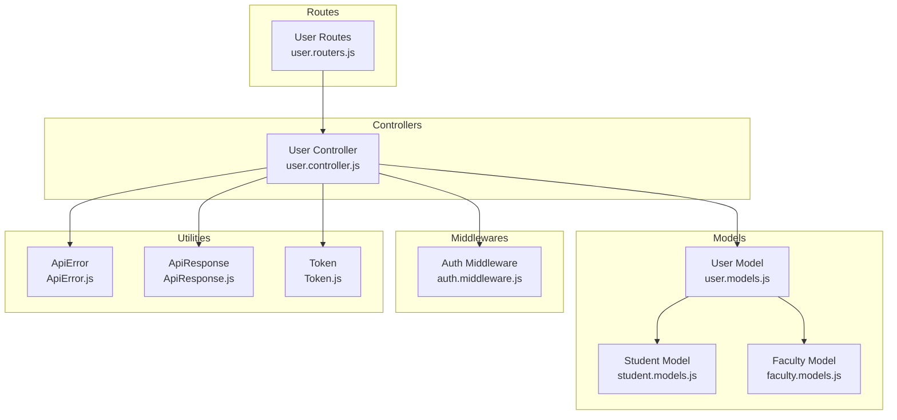
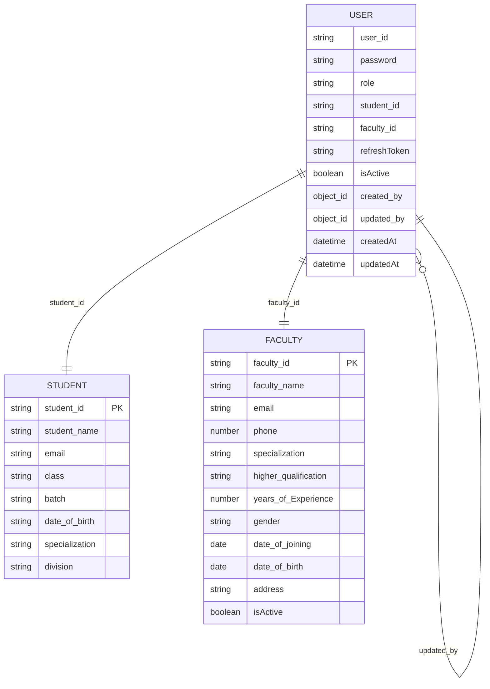
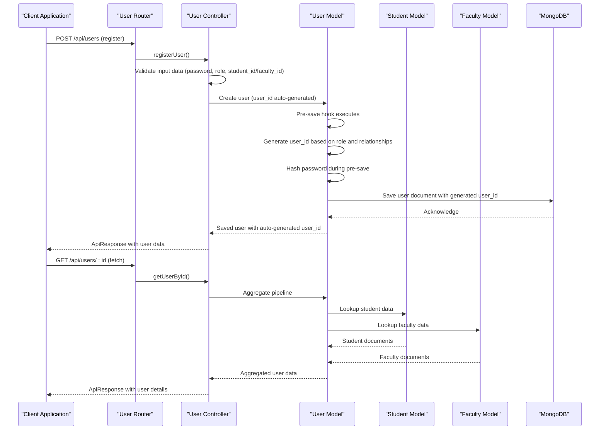
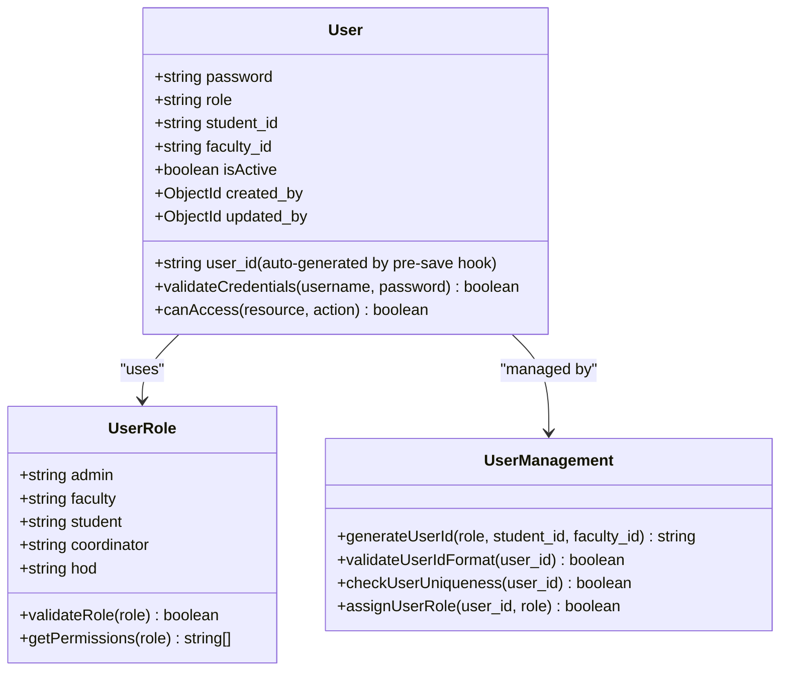
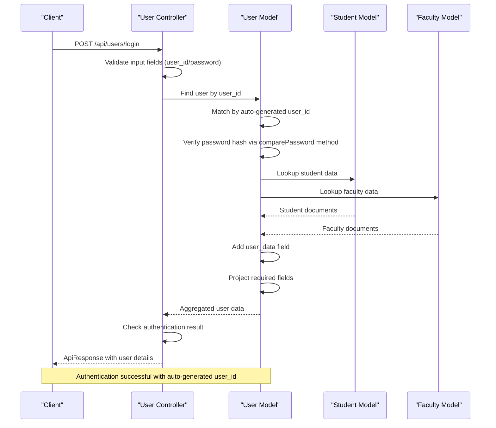
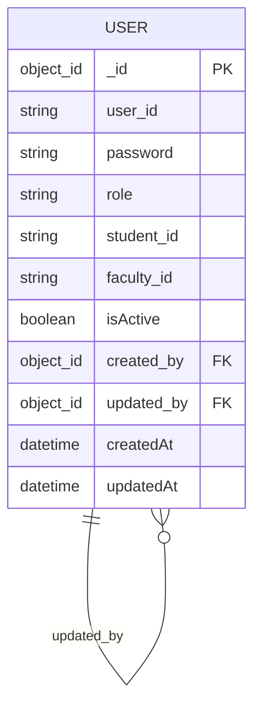
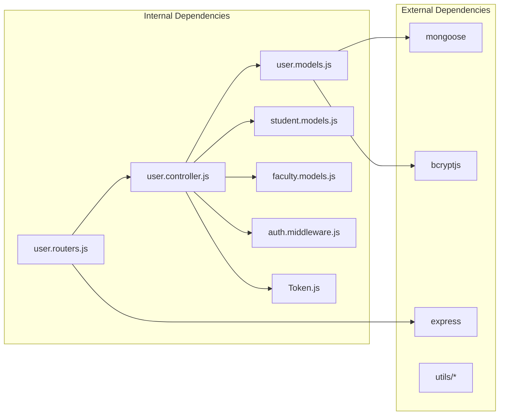

# Core User Model

<cite>
**Referenced Files in This Document**
- [user.models.js](file://Backend/src/models/user.models.js)
- [user.controller.js](file://Backend/src/controllers/user.controller.js)
- [user.routers.js](file://Backend/src/routes/user.routers.js)
- [student.models.js](file://Backend/src/models/student.models.js)
- [faculty.models.js](file://Backend/src/models/faculty.models.js)
- [auth.middleware.js](file://Backend/src/middlewares/auth.middleware.js)
- [ApiError.js](file://Backend/src/utils/ApiError.js)
- [ApiResponse.js](file://Backend/src/utils/ApiResponse.js)
- [Token.js](file://Backend/src/utils/Token.js)
</cite>

## Update Summary
**Changes Made**
- Updated User Model Schema to document the modernized pre-save hook system with enhanced user_id generation logic
- Revised Registration Process to reflect streamlined user_id management with automatic generation capabilities
- Updated Authentication Flow to show user_id vs student_id/faculty_id distinction with modernized pre-save hook integration
- Added comprehensive documentation for the streamlined pre-save hook that generates user_ids based on role prefixes
- Updated field definitions to clarify the automatic user_id generation approach
- Enhanced troubleshooting guidance for pre-save hook functionality and user_id generation

## Table of Contents
1. [Introduction](#introduction)
2. [Project Structure](#project-structure)
3. [Core Components](#core-components)
4. [Architecture Overview](#architecture-overview)
5. [Detailed Component Analysis](#detailed-component-analysis)
6. [Dependency Analysis](#dependency-analysis)
7. [Performance Considerations](#performance-considerations)
8. [Troubleshooting Guide](#troubleshooting-guide)
9. [Conclusion](#conclusion)

## Introduction
This document provides comprehensive data model documentation for the User model within the timetable management system. It details the user schema including the modernized pre-save hook system for automatic user_id generation, password field, role enumeration, relationship fields, timestamps, and the self-referencing created_by and updated_by fields. The system now features a streamlined pre-save hook that automatically generates user_ids based on role prefixes and relationship identifiers while maintaining robust role-based access control and security considerations.

## Project Structure
The user model is part of a MongoDB/Mongoose-based backend architecture with Express.js routing and controller logic. The user model integrates with student and faculty collections through foreign keys (student_id and faculty_id), while the modernized pre-save hook system ensures automatic user_id generation based on role prefixes and relationship identifiers.

**Diagram sources**
- [user.models.js:1-149](file://Backend/src/models/user.models.js#L1-L149)
- [user.controller.js:1-746](file://Backend/src/controllers/user.controller.js#L1-L746)
- [user.routers.js:1-41](file://Backend/src/routes/user.routers.js#L1-L41)
- [auth.middleware.js:1-121](file://Backend/src/middlewares/auth.middleware.js#L1-L121)

**Section sources**
- [user.models.js:1-149](file://Backend/src/models/user.models.js#L1-L149)
- [user.controller.js:1-746](file://Backend/src/controllers/user.controller.js#L1-L746)
- [user.routers.js:1-41](file://Backend/src/routes/user.routers.js#L1-L41)

## Core Components
This section documents the primary data structures and their relationships, focusing on the modernized pre-save hook system for automatic user_id generation.

### User Model Schema
The User model defines the core authentication and authorization entity with streamlined user_id management capabilities:

**Updated** The user_id field now supports automatic generation through a modernized pre-save hook:

- **user_id**: String field with unique constraint, nullable (auto-generated when not provided)
- **password**: String field with required validation and minimum length requirement
- **role**: Enumerated field with predefined values: admin, faculty, student, coordinator, hod
- **student_id**: String field for linking to student records (nullable, used for user_id generation)
- **faculty_id**: String field for linking to faculty records (nullable, used for user_id generation)
- **refreshToken**: String field for JWT refresh token storage
- **isActive**: Boolean flag indicating account status (default: true)
- **created_by**: Self-referencing ObjectId linking to another User (audit trail)
- **updated_by**: Self-referencing ObjectId linking to another User (audit trail)
- **timestamps**: Automatic createdAt and updatedAt fields

**Diagram sources**
- [user.models.js:6-62](file://Backend/src/models/user.models.js#L6-L62)
- [student.models.js:5-11](file://Backend/src/models/student.models.js#L5-L11)
- [faculty.models.js:5-10](file://Backend/src/models/faculty.models.js#L5-L10)

**Section sources**
- [user.models.js:6-62](file://Backend/src/models/user.models.js#L6-L62)

### Modernized Pre-Save Hook System for Automatic User ID Generation
**Updated** The system now includes a streamlined pre-save hook that automatically generates user_ids based on role prefixes and relationship identifiers:

- **Automatic Generation**: When user_id is not provided during creation, the pre-save hook generates it automatically
- **Role-Based Prefixes**: Uses first 3 characters of role name in uppercase as prefix (e.g., "ADM" for admin, "FAC" for faculty)
- **Enhanced Switch Logic**: Streamlined switch statement handles different role types with specific user_id generation rules
- **Relationship Integration**: Combines role prefix with student_id or faculty_id for academic users
- **Smart Fallback**: Generates unique identifiers for administrative roles without student/faculty relationships
- **Timestamp and Random Components**: Uses timestamp and random string for unique identifier generation
- **Password Hashing Integration**: Seamlessly integrates password hashing during the same pre-save operation
- **Error Handling**: Robust error handling within the pre-save hook for reliable user_id generation

**Section sources**
- [user.models.js:103-142](file://Backend/src/models/user.models.js#L103-L142)

### Streamlined User ID Management with Automatic Generation
**Updated** The system now features a streamlined approach to user_id management:

- **Automatic Generation**: user_id field is auto-generated by pre-save hook when not provided
- **Role-Based Logic**: Switch statement determines user_id generation based on role type
- **Validation**: user_id maintains unique constraint through database-level enforcement
- **Format Consistency**: Ensures standardized identification format through role prefixes
- **Fallback Logic**: Automatically generates unique user_ids for administrative roles
- **Integration**: Works seamlessly with existing validation rules and unique constraints

**Section sources**
- [user.models.js:103-129](file://Backend/src/models/user.models.js#L103-L129)

## Architecture Overview
The user management system follows a layered architecture with clear separation of concerns and enhanced user_id management through modernized pre-save hooks:

**Diagram sources**
- [user.routers.js:22-29](file://Backend/src/routes/user.routers.js#L22-L29)
- [user.controller.js:18-187](file://Backend/src/controllers/user.controller.js#L18-L187)
- [user.models.js:103-142](file://Backend/src/models/user.models.js#L103-L142)

## Detailed Component Analysis

### User Registration and Validation
**Updated** The registration process now features streamlined user_id management:

**Diagram sources**
- [user.controller.js:18-187](file://Backend/src/controllers/user.controller.js#L18-L187)

Key validation rules implemented:
- Password field is mandatory for all users
- Role field is mandatory and must match predefined enum values
- Either student_id or faculty_id must be provided
- Duplicate user_id, student_id, and faculty_id entries are prevented
- All provided users must be unique
- **Updated** user_id is auto-generated by modernized pre-save hook when not provided

**Section sources**
- [user.controller.js:18-187](file://Backend/src/controllers/user.controller.js#L18-L187)

### Role-Based Access Control System
The system implements role-based access control through the role enumeration with streamlined user_id management:

**Diagram sources**
- [user.models.js:18-27](file://Backend/src/models/user.models.js#L18-L27)
- [auth.middleware.js:47-62](file://Backend/src/middlewares/auth.middleware.js#L47-L62)

Role validation rules:
- Enum constraint prevents invalid role values
- Automatic lowercase normalization ensures consistent storage
- Trim operation removes whitespace
- Message validation provides clear error feedback
- **Updated** user_id generation ensures consistent identification format through pre-save hook

**Section sources**
- [user.models.js:18-27](file://Backend/src/models/user.models.js#L18-L27)
- [auth.middleware.js:47-62](file://Backend/src/middlewares/auth.middleware.js#L47-L62)

### Authentication and Authorization Flow
**Updated** The login process now uses user_id for authentication with modernized pre-save hook integration:

**Diagram sources**
- [user.controller.js:463-567](file://Backend/src/controllers/user.controller.js#L463-L567)

**Section sources**
- [user.controller.js:463-567](file://Backend/src/controllers/user.controller.js#L463-L567)

### Audit Trail Implementation
The self-referencing created_by and updated_by fields implement comprehensive audit trails:

**Diagram sources**
- [user.models.js:49-59](file://Backend/src/models/user.models.js#L49-L59)

Audit trail characteristics:
- Both fields reference the User collection
- Default values are null for new users
- updated_by field is automatically populated during updates
- Supports hierarchical audit trails for user management operations
- **Updated** user_id remains consistent even when audit trail fields change

**Section sources**
- [user.models.js:49-59](file://Backend/src/models/user.models.js#L49-L59)

### Data Retrieval and Projection
**Updated** The user controller implements sophisticated aggregation pipelines for data retrieval with modernized pre-save hook integration:

**Diagram sources**
- [user.controller.js:320-379](file://Backend/src/controllers/user.controller.js#L320-L379)

**Section sources**
- [user.controller.js:320-379](file://Backend/src/controllers/user.controller.js#L320-L379)

## Dependency Analysis
The user model has several important dependencies and relationships:

**Diagram sources**
- [user.models.js:1](file://Backend/src/models/user.models.js#L1)
- [user.controller.js:1-16](file://Backend/src/controllers/user.controller.js#L1-L16)
- [user.routers.js:1](file://Backend/src/routes/user.routers.js#L1)
- [auth.middleware.js:1-5](file://Backend/src/middlewares/auth.middleware.js#L1-L5)

Key dependency relationships:
- User model depends on Mongoose for schema definition and database operations
- User model depends on bcryptjs for password hashing
- User controller depends on User, Student, and Faculty models for data operations
- Router module depends on controller functions for endpoint handling
- Auth middleware provides role-based access control
- Token utility provides JWT token generation and verification
- Utility modules (ApiError, ApiResponse, asyncHandler) provide error handling and response formatting

**Section sources**
- [user.models.js:1](file://Backend/src/models/user.models.js#L1)
- [user.controller.js:1-16](file://Backend/src/controllers/user.controller.js#L1-L16)
- [user.routers.js:1](file://Backend/src/routes/user.routers.js#L1)

## Performance Considerations
Several performance optimizations are implemented in the user model and controller:

- **Indexing**: Role name field is indexed for faster lookups
- **Aggregation Pipelines**: Efficient data retrieval using MongoDB aggregation framework
- **Selective Field Projection**: Sensitive fields like passwords are excluded from responses
- **Conditional Lookups**: Student and faculty data are only retrieved when needed
- **Batch Operations**: Bulk user registration reduces database round trips
- **Modernized Pre-Save Hook**: Automatic user_id generation occurs efficiently during save operations
- **Hashing Optimization**: Password hashing with configurable salt rounds
- **Unique Constraints**: Database-level unique constraints prevent duplicate user_ids

## Troubleshooting Guide

### Common Issues and Solutions

**Authentication Failures**
- Verify that user_id matches the auto-generated format (role prefix + ID)
- Ensure password field is included in login request
- Check that user.isActive is set to true
- **Updated** Note: user_id is auto-generated by modernized pre-save hook if not provided

**Registration Errors**
- Confirm that password field is present in all user records
- Validate that role matches one of the supported enum values
- Ensure unique student_id or faculty_id values are provided
- **Updated** user_id is auto-generated if not provided manually

**Data Retrieval Issues**
- Verify that student_id or faculty_id relationships are properly established
- Check that aggregation pipeline is correctly configured
- Ensure that sensitive fields are properly excluded from projections
- **Updated** user_id is auto-generated through modernized pre-save hook system

**Audit Trail Problems**
- Confirm that created_by and updated_by fields are properly populated
- Verify that self-referencing relationships are maintained
- Check that ObjectId references are valid

**User ID Generation Issues**
- **Updated** Ensure that user_id is auto-generated by modernized pre-save hook if not provided
- Verify that role prefix is correctly applied (first 3 characters of role name)
- Check that student_id or faculty_id is properly formatted for relationship-based generation
- Confirm that random component is generated for administrative roles
- Monitor modernized pre-save hook execution for proper user_id generation

**Modernized Pre-Save Hook Problems**
- Verify that modernized pre-save hook executes before document save
- Check that role prefix generation works correctly
- Ensure relationship-based user_id generation uses correct format
- Validate random user_id generation for administrative roles
- Confirm that user_id uniqueness is maintained through database constraints
- **Updated** Review switch statement logic for different role types

**Authentication Flow Issues**
- **Updated** Verify that login requests use user_id instead of username
- Check that JWT tokens contain user_id in payload
- Ensure token verification uses correct secret keys
- Validate that user_id format matches modernized pre-save hook generation
- **Updated** Review comparePassword method integration

**Section sources**
- [user.controller.js:463-567](file://Backend/src/controllers/user.controller.js#L463-L567)
- [user.models.js:103-142](file://Backend/src/models/user.models.js#L103-L142)
- [ApiError.js:1-80](file://Backend/src/utils/ApiError.js#L1-L80)
- [ApiResponse.js:1-74](file://Backend/src/utils/ApiResponse.js#L1-L74)
- [Token.js:1-71](file://Backend/src/utils/Token.js#L1-L71)

## Conclusion
The User model provides a robust foundation for the timetable management system's authentication and authorization needs. The modernized pre-save hook system eliminates the need for manual user_id generation while maintaining strong data integrity and security. The implementation includes comprehensive validation, role-based access control, audit trails, efficient data retrieval mechanisms, and intelligent user_id generation through automatic prefixing and relationship integration. The streamlined architecture supports future enhancements while maintaining clear separation of concerns and consistent user identification across all user types.