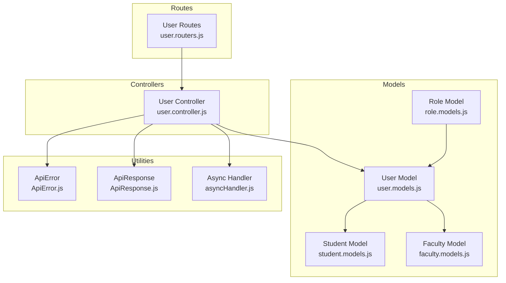
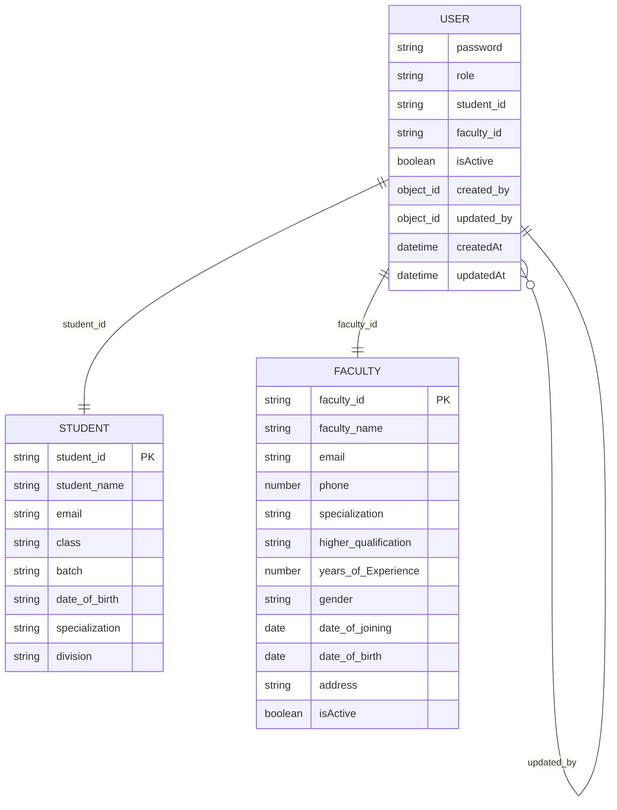
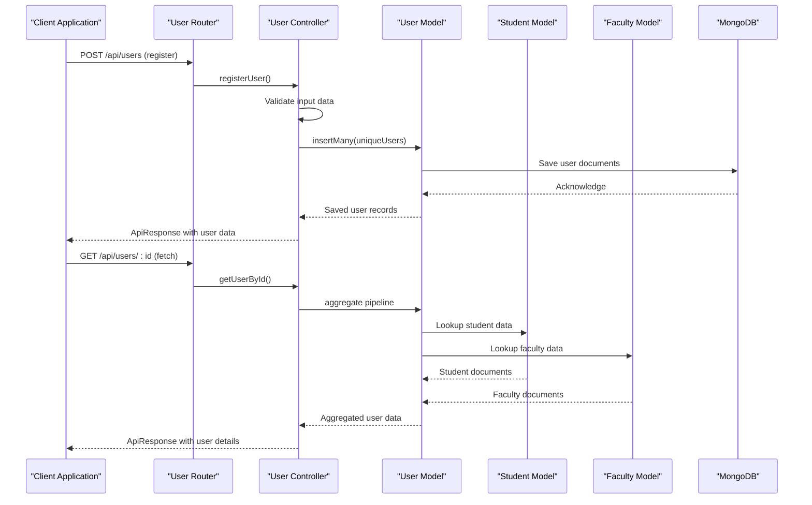
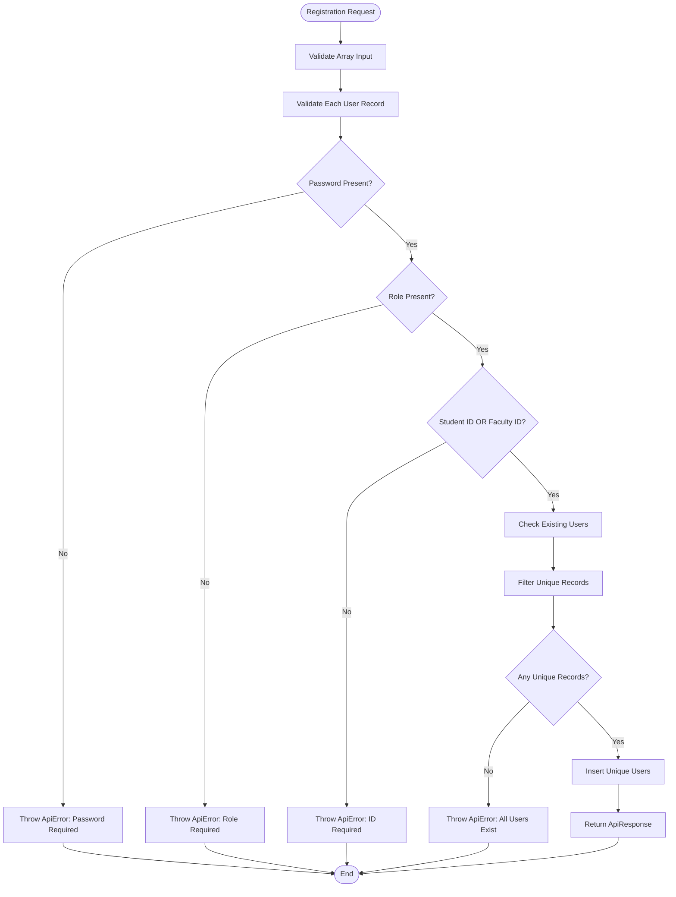
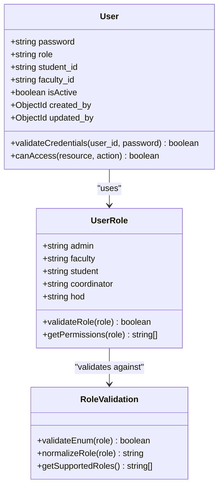
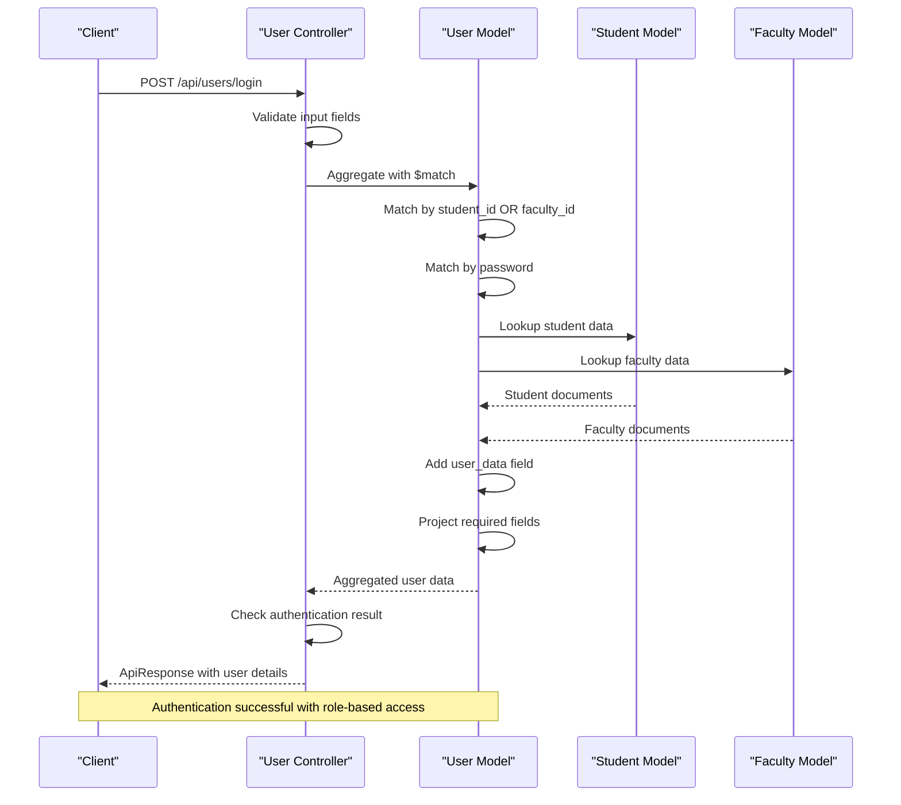
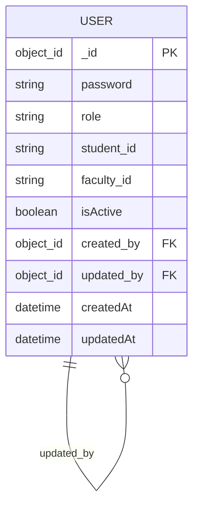
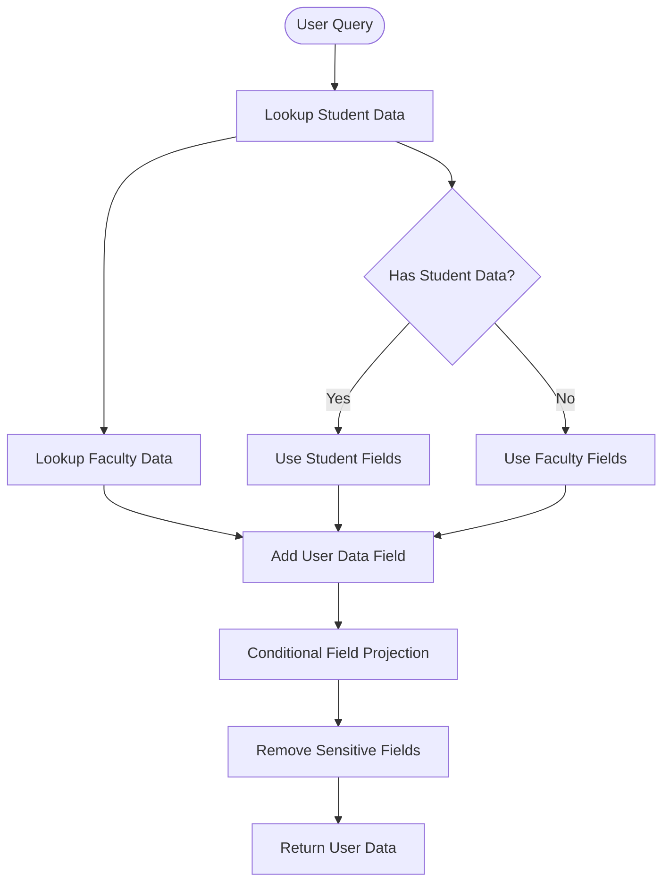
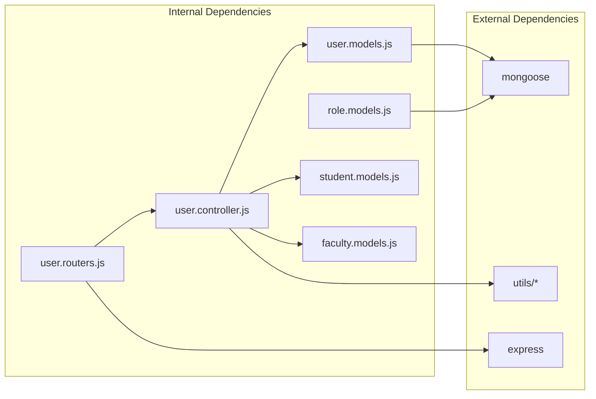

# Core User Model

<cite>
**Referenced Files in This Document**
- [user.models.js](file://Backend/src/models/user.models.js)
- [role.models.js](file://Backend/src/models/role.models.js)
- [user.controller.js](file://Backend/src/controllers/user.controller.js)
- [user.routers.js](file://Backend/src/routes/user.routers.js)
- [student.models.js](file://Backend/src/models/student.models.js)
- [faculty.models.js](file://Backend/src/models/faculty.models.js)
- [ApiError.js](file://Backend/src/utils/ApiError.js)
- [ApiResponse.js](file://Backend/src/utils/ApiResponse.js)
- [asyncHandler.js](file://Backend/src/utils/asyncHandler.js)
</cite>

## Table of Contents
1. [Introduction](#introduction)
2. [Project Structure](#project-structure)
3. [Core Components](#core-components)
4. [Architecture Overview](#architecture-overview)
5. [Detailed Component Analysis](#detailed-component-analysis)
6. [Dependency Analysis](#dependency-analysis)
7. [Performance Considerations](#performance-considerations)
8. [Troubleshooting Guide](#troubleshooting-guide)
9. [Conclusion](#conclusion)

## Introduction
This document provides comprehensive data model documentation for the User and Role models within the timetable management system. It details the user schema including password field, role enumeration, relationship fields, timestamps, and the self-referencing created_by and updated_by fields. It also explains the role-based access control system, validation rules, and security considerations for password storage and role validation.

## Project Structure
The user and role models are part of a MongoDB/Mongoose-based backend architecture with Express.js routing and controller logic. The user model integrates with student and faculty collections through foreign keys (student_id and faculty_id), while the role model maintains separate role definitions with audit fields.

**Diagram sources**
- [user.models.js:1-61](file://Backend/src/models/user.models.js#L1-L61)
- [role.models.js:1-43](file://Backend/src/models/role.models.js#L1-L43)
- [user.controller.js:1-355](file://Backend/src/controllers/user.controller.js#L1-L355)
- [user.routers.js:1-19](file://Backend/src/routes/user.routers.js#L1-L19)

**Section sources**
- [user.models.js:1-61](file://Backend/src/models/user.models.js#L1-L61)
- [role.models.js:1-43](file://Backend/src/models/role.models.js#L1-L43)
- [user.controller.js:1-355](file://Backend/src/controllers/user.controller.js#L1-L355)
- [user.routers.js:1-19](file://Backend/src/routes/user.routers.js#L1-L19)

## Core Components
This section documents the primary data structures and their relationships.

### User Model Schema
The User model defines the core authentication and authorization entity with the following fields:

- **password**: String field with required validation
- **role**: Enumerated field with predefined values: admin, faculty, student, coordinator, hod
- **student_id**: String field for linking to student records (nullable)
- **faculty_id**: String field for linking to faculty records (nullable)
- **isActive**: Boolean flag indicating account status (default: true)
- **created_by**: Self-referencing ObjectId linking to another User (audit trail)
- **updated_by**: Self-referencing ObjectId linking to another User (audit trail)
- **timestamps**: Automatic createdAt and updatedAt fields

**Diagram sources**
- [user.models.js:13-58](file://Backend/src/models/user.models.js#L13-L58)
- [student.models.js:5-65](file://Backend/src/models/student.models.js#L5-L65)
- [faculty.models.js:5-76](file://Backend/src/models/faculty.models.js#L5-L76)

### Role Model Schema
The Role model provides separate role definitions with administrative capabilities:

- **role_id**: Unique identifier (uppercase, unique)
- **role_name**: Human-readable role name (lowercase, indexed)
- **role_description**: Role description text
- **isActive**: Boolean status flag
- **created_by**: Self-referencing ObjectId for audit trail
- **updated_by**: Self-referencing ObjectId for audit trail
- **timestamps**: Automatic createdAt and updatedAt fields

**Section sources**
- [user.models.js:13-58](file://Backend/src/models/user.models.js#L13-L58)
- [role.models.js:4-42](file://Backend/src/models/role.models.js#L4-L42)

## Architecture Overview
The user management system follows a layered architecture with clear separation of concerns:

**Diagram sources**
- [user.routers.js:14-16](file://Backend/src/routes/user.routers.js#L14-L16)
- [user.controller.js:8-81](file://Backend/src/controllers/user.controller.js#L8-L81)
- [user.controller.js:164-236](file://Backend/src/controllers/user.controller.js#L164-L236)
- [user.models.js:1-61](file://Backend/src/models/user.models.js#L1-L61)

## Detailed Component Analysis

### User Registration and Validation
The registration process handles bulk user creation with comprehensive validation:

**Diagram sources**
- [user.controller.js:8-81](file://Backend/src/controllers/user.controller.js#L8-L81)

Key validation rules implemented:
- Password field is mandatory for all users
- Role field is mandatory and must match predefined enum values
- Either student_id or faculty_id must be provided
- Duplicate student_id and faculty_id entries are prevented
- All provided users must be unique

**Section sources**
- [user.controller.js:8-81](file://Backend/src/controllers/user.controller.js#L8-L81)

### Role-Based Access Control System
The system implements role-based access control through the role enumeration:

**Diagram sources**
- [user.models.js:19-28](file://Backend/src/models/user.models.js#L19-L28)
- [user.controller.js:280-354](file://Backend/src/controllers/user.controller.js#L280-L354)

Role validation rules:
- Enum constraint prevents invalid role values
- Automatic lowercase normalization ensures consistent storage
- Trim operation removes whitespace
- Message validation provides clear error feedback

**Section sources**
- [user.models.js:19-28](file://Backend/src/models/user.models.js#L19-L28)
- [user.controller.js:280-354](file://Backend/src/controllers/user.controller.js#L280-L354)

### Authentication and Authorization Flow
The login process demonstrates role-based access patterns:

**Diagram sources**
- [user.controller.js:280-354](file://Backend/src/controllers/user.controller.js#L280-L354)
- [user.models.js:13-58](file://Backend/src/models/user.models.js#L13-L58)

**Section sources**
- [user.controller.js:280-354](file://Backend/src/controllers/user.controller.js#L280-L354)

### Audit Trail Implementation
The self-referencing created_by and updated_by fields implement comprehensive audit trails:

**Diagram sources**
- [user.models.js:45-55](file://Backend/src/models/user.models.js#L45-L55)

Audit trail characteristics:
- Both fields reference the User collection
- Default values are null for new users
- updated_by field is automatically populated during updates
- Supports hierarchical audit trails for user management operations

**Section sources**
- [user.models.js:45-55](file://Backend/src/models/user.models.js#L45-L55)

### Data Retrieval and Projection
The user controller implements sophisticated aggregation pipelines for data retrieval:

**Diagram sources**
- [user.controller.js:84-161](file://Backend/src/controllers/user.controller.js#L84-L161)

**Section sources**
- [user.controller.js:84-161](file://Backend/src/controllers/user.controller.js#L84-L161)

## Dependency Analysis
The user model has several important dependencies and relationships:

**Diagram sources**
- [user.models.js:1](file://Backend/src/models/user.models.js#L1)
- [role.models.js:1](file://Backend/src/models/role.models.js#L1)
- [user.controller.js:1-5](file://Backend/src/controllers/user.controller.js#L1-L5)
- [user.routers.js:1](file://Backend/src/routes/user.routers.js#L1)

Key dependency relationships:
- User model depends on Mongoose for schema definition and database operations
- User controller depends on User, Student, and Faculty models for data operations
- Router module depends on controller functions for endpoint handling
- Utility modules (ApiError, ApiResponse, asyncHandler) provide error handling and response formatting

**Section sources**
- [user.models.js:1](file://Backend/src/models/user.models.js#L1)
- [user.controller.js:1-5](file://Backend/src/controllers/user.controller.js#L1-L5)
- [user.routers.js:1](file://Backend/src/routes/user.routers.js#L1)

## Performance Considerations
Several performance optimizations are implemented in the user model and controller:

- **Indexing**: Role name field is indexed for faster lookups
- **Aggregation Pipelines**: Efficient data retrieval using MongoDB aggregation framework
- **Selective Field Projection**: Sensitive fields like passwords are excluded from responses
- **Conditional Lookups**: Student and faculty data are only retrieved when needed
- **Batch Operations**: Bulk user registration reduces database round trips

## Troubleshooting Guide

### Common Issues and Solutions

**Authentication Failures**
- Verify that user_id matches either student_id or faculty_id
- Ensure password field is included in login request
- Check that user.isActive is set to true

**Registration Errors**
- Confirm that password field is present in all user records
- Validate that role matches one of the supported enum values
- Ensure unique student_id or faculty_id values are provided

**Data Retrieval Issues**
- Verify that student_id or faculty_id relationships are properly established
- Check that aggregation pipeline is correctly configured
- Ensure that sensitive fields are properly excluded from projections

**Audit Trail Problems**
- Confirm that created_by and updated_by fields are properly populated
- Verify that self-referencing relationships are maintained
- Check that ObjectId references are valid

**Section sources**
- [user.controller.js:280-354](file://Backend/src/controllers/user.controller.js#L280-L354)
- [ApiError.js:1-21](file://Backend/src/utils/ApiError.js#L1-L21)
- [ApiResponse.js:1-10](file://Backend/src/utils/ApiResponse.js#L1-L10)

## Conclusion
The User and Role models provide a robust foundation for the timetable management system's authentication and authorization needs. The implementation includes comprehensive validation, role-based access control, audit trails, and efficient data retrieval mechanisms. The modular architecture supports future enhancements while maintaining clear separation of concerns and strong data integrity through Mongoose schema validation and MongoDB aggregation capabilities.