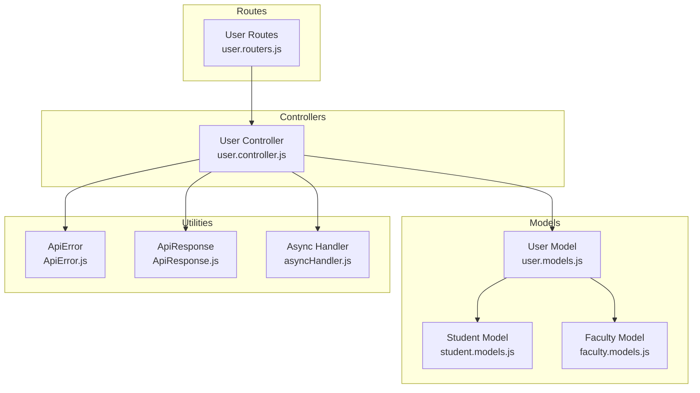
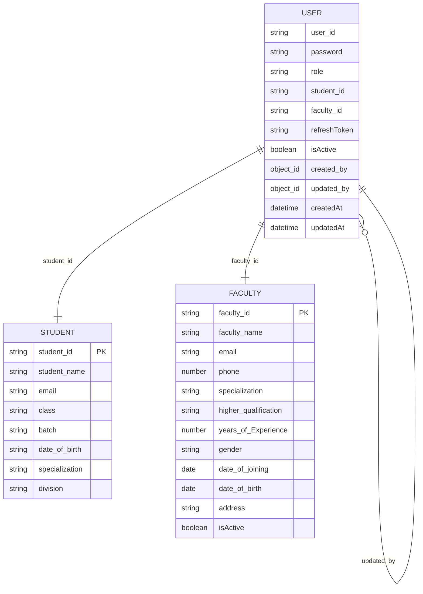
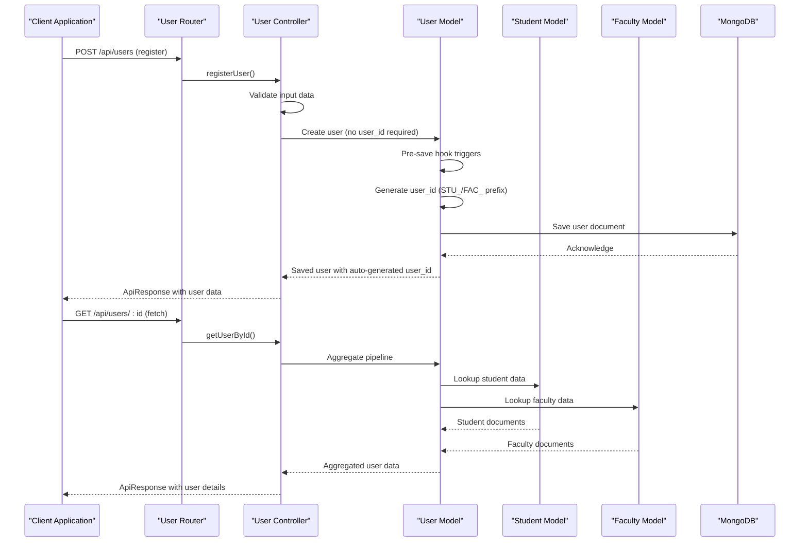
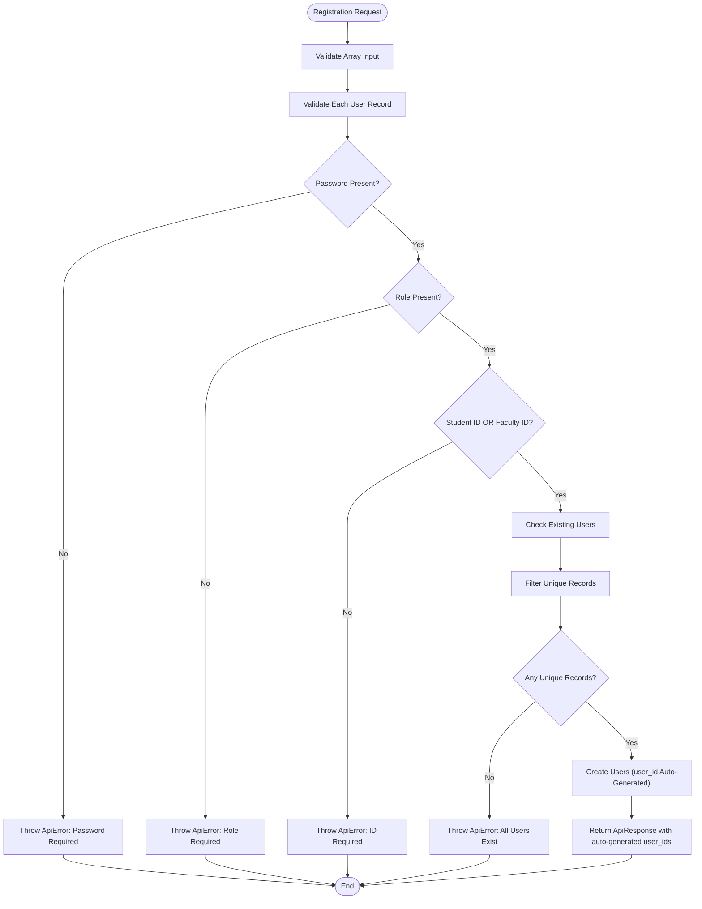
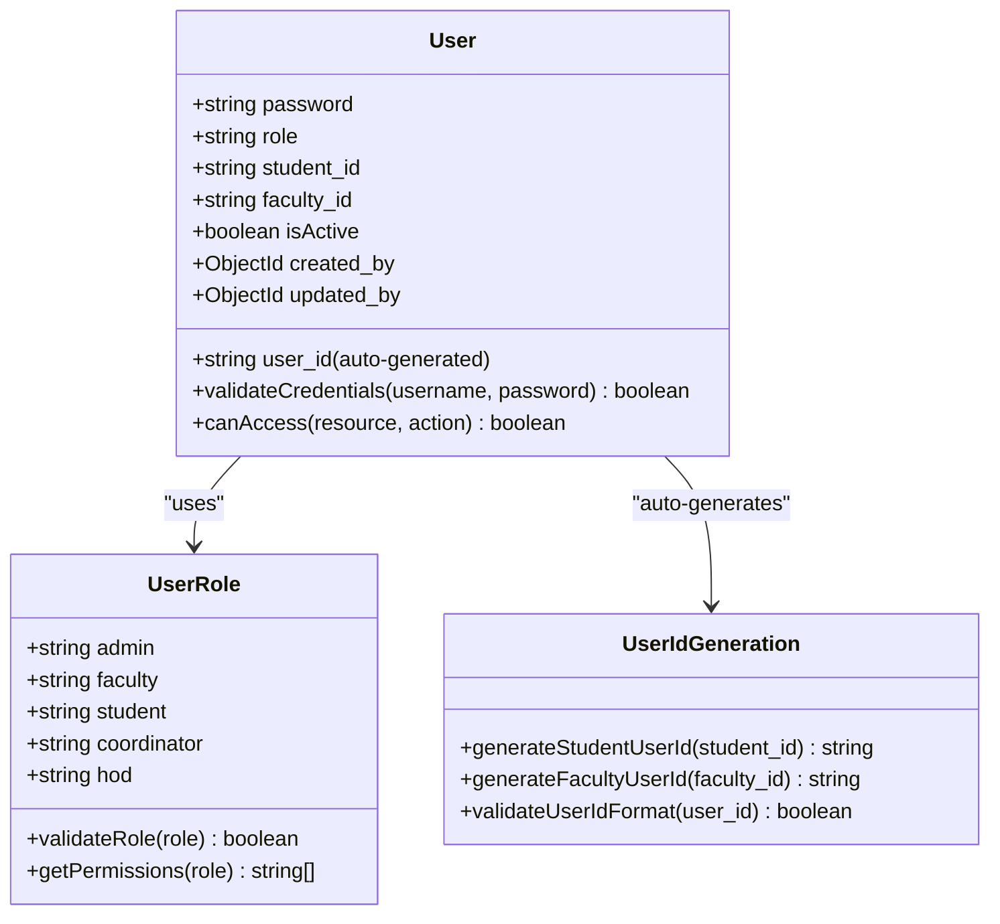
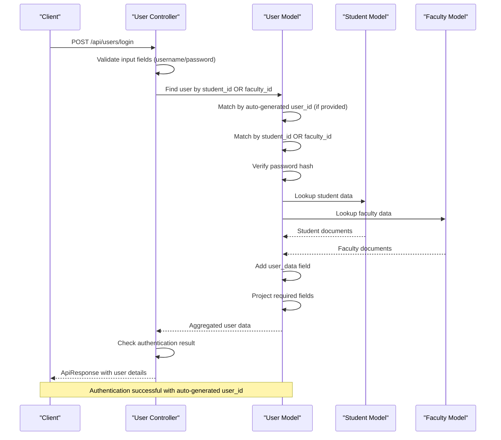
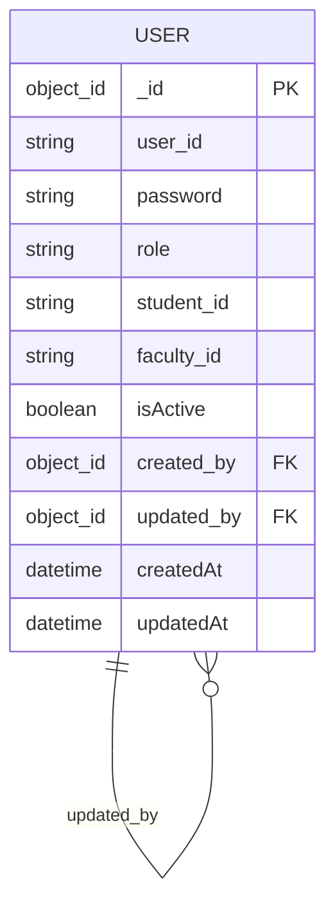
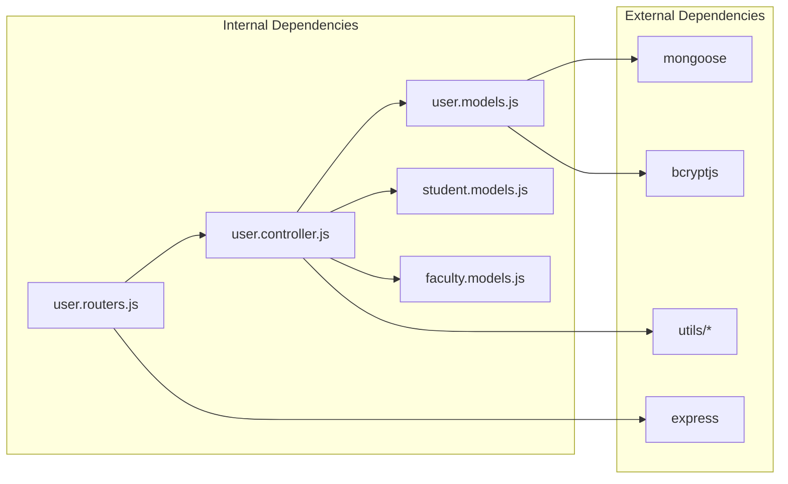

# Core User Model

<cite>
**Referenced Files in This Document**
- [user.models.js](file://Backend/src/models/user.models.js)
- [user.controller.js](file://Backend/src/controllers/user.controller.js)
- [user.routers.js](file://Backend/src/routes/user.routers.js)
- [student.models.js](file://Backend/src/models/student.models.js)
- [faculty.models.js](file://Backend/src/models/faculty.models.js)
- [ApiError.js](file://Backend/src/utils/ApiError.js)
- [ApiResponse.js](file://Backend/src/utils/ApiResponse.js)
- [asyncHandler.js](file://Backend/src/utils/asyncHandler.js)
</cite>

## Update Summary
**Changes Made**
- Updated User Model Schema to document automatic user_id generation system
- Revised Registration Process to reflect new automatic user_id generation
- Updated Authentication Flow to show user_id vs student_id/faculty_id distinction
- Added documentation for role-based user_id prefix system (STU_ and FAC_)
- Removed references to manual user_id management as it's now automated
- Updated field definitions to clarify user_id generation logic

## Table of Contents
1. [Introduction](#introduction)
2. [Project Structure](#project-structure)
3. [Core Components](#core-components)
4. [Architecture Overview](#architecture-overview)
5. [Detailed Component Analysis](#detailed-component-analysis)
6. [Dependency Analysis](#dependency-analysis)
7. [Performance Considerations](#performance-considerations)
8. [Troubleshooting Guide](#troubleshooting-guide)
9. [Conclusion](#conclusion)

## Introduction
This document provides comprehensive data model documentation for the User model within the timetable management system. It details the user schema including the automatic user_id generation system with role-based prefixes (STU_ for students, FAC_ for faculty), password field, role enumeration, relationship fields, timestamps, and the self-referencing created_by and updated_by fields. The system eliminates manual user_id management while maintaining robust role-based access control and security considerations.

## Project Structure
The user model is part of a MongoDB/Mongoose-based backend architecture with Express.js routing and controller logic. The user model integrates with student and faculty collections through foreign keys (student_id and faculty_id), while the automatic user_id generation system ensures unique identification across all user types.

**Diagram sources**
- [user.models.js:1-97](file://Backend/src/models/user.models.js#L1-L97)
- [user.controller.js:1-583](file://Backend/src/controllers/user.controller.js#L1-L583)
- [user.routers.js:1-39](file://Backend/src/routes/user.routers.js#L1-L39)

**Section sources**
- [user.models.js:1-97](file://Backend/src/models/user.models.js#L1-L97)
- [user.controller.js:1-583](file://Backend/src/controllers/user.controller.js#L1-L583)
- [user.routers.js:1-39](file://Backend/src/routes/user.routers.js#L1-L39)

## Core Components
This section documents the primary data structures and their relationships, focusing on the new automatic user_id generation system.

### User Model Schema
The User model defines the core authentication and authorization entity with automatic user_id generation:

**Updated** The user_id field is now automatically generated based on role and relationship fields, eliminating manual management while maintaining uniqueness.

- **user_id**: String field with automatic generation (STU_ prefix for students, FAC_ prefix for faculty), unique, uppercase, trimmed
- **password**: String field with required validation and minimum length requirement
- **role**: Enumerated field with predefined values: admin, faculty, student, coordinator, hod
- **student_id**: String field for linking to student records (nullable, used for user_id generation)
- **faculty_id**: String field for linking to faculty records (nullable, used for user_id generation)
- **refreshToken**: String field for JWT refresh token storage
- **isActive**: Boolean flag indicating account status (default: true)
- **created_by**: Self-referencing ObjectId linking to another User (audit trail)
- **updated_by**: Self-referencing ObjectId linking to another User (audit trail)
- **timestamps**: Automatic createdAt and updatedAt fields

**Diagram sources**
- [user.models.js:6-65](file://Backend/src/models/user.models.js#L6-L65)
- [student.models.js:5-11](file://Backend/src/models/student.models.js#L5-L11)
- [faculty.models.js:5-10](file://Backend/src/models/faculty.models.js#L5-L10)

**Section sources**
- [user.models.js:6-65](file://Backend/src/models/user.models.js#L6-L65)

### Automatic User ID Generation System
**New** The system now automatically generates user_id values based on role and relationship:

- **Student Users**: user_id format: `STU_{student_id}` (e.g., STU_001, STU_CS2024)
- **Faculty Users**: user_id format: `FAC_{faculty_id}` (e.g., FAC_1001, FAC_1234)
- **Generation Logic**: Automatically triggered during user creation when user_id is not provided
- **Uniqueness**: Maintains unique user_id values across all user types
- **Format Consistency**: Ensures standardized identification format

**Section sources**
- [user.models.js:67-89](file://Backend/src/models/user.models.js#L67-L89)

## Architecture Overview
The user management system follows a layered architecture with clear separation of concerns and automatic user_id generation:

**Diagram sources**
- [user.routers.js:22-29](file://Backend/src/routes/user.routers.js#L22-L29)
- [user.controller.js:14-132](file://Backend/src/controllers/user.controller.js#L14-L132)
- [user.models.js:67-89](file://Backend/src/models/user.models.js#L67-L89)

## Detailed Component Analysis

### User Registration and Validation
**Updated** The registration process now handles automatic user_id generation:

**Diagram sources**
- [user.controller.js:14-132](file://Backend/src/controllers/user.controller.js#L14-L132)

Key validation rules implemented:
- Password field is mandatory for all users
- Role field is mandatory and must match predefined enum values
- Either student_id or faculty_id must be provided (user_id generation logic)
- Duplicate student_id and faculty_id entries are prevented
- All provided users must be unique
- **Updated** user_id field is now optional as it's auto-generated

**Section sources**
- [user.controller.js:14-132](file://Backend/src/controllers/user.controller.js#L14-L132)

### Role-Based Access Control System
The system implements role-based access control through the role enumeration with automatic user_id generation:

**Diagram sources**
- [user.models.js:21-30](file://Backend/src/models/user.models.js#L21-L30)
- [user.models.js:67-89](file://Backend/src/models/user.models.js#L67-L89)

Role validation rules:
- Enum constraint prevents invalid role values
- Automatic lowercase normalization ensures consistent storage
- Trim operation removes whitespace
- Message validation provides clear error feedback
- **Updated** user_id generation ensures consistent identification format

**Section sources**
- [user.models.js:21-30](file://Backend/src/models/user.models.js#L21-L30)
- [user.models.js:67-89](file://Backend/src/models/user.models.js#L67-L89)

### Authentication and Authorization Flow
**Updated** The login process now uses user_id for authentication:

**Diagram sources**
- [user.controller.js:359-471](file://Backend/src/controllers/user.controller.js#L359-L471)
- [user.models.js:67-89](file://Backend/src/models/user.models.js#L67-L89)

**Section sources**
- [user.controller.js:359-471](file://Backend/src/controllers/user.controller.js#L359-L471)

### Audit Trail Implementation
The self-referencing created_by and updated_by fields implement comprehensive audit trails:

**Diagram sources**
- [user.models.js:52-62](file://Backend/src/models/user.models.js#L52-L62)

Audit trail characteristics:
- Both fields reference the User collection
- Default values are null for new users
- updated_by field is automatically populated during updates
- Supports hierarchical audit trails for user management operations
- **Updated** user_id remains consistent even when audit trail fields change

**Section sources**
- [user.models.js:52-62](file://Backend/src/models/user.models.js#L52-L62)

### Data Retrieval and Projection
**Updated** The user controller implements sophisticated aggregation pipelines for data retrieval with user_id handling:

**Diagram sources**
- [user.controller.js:135-284](file://Backend/src/controllers/user.controller.js#L135-L284)

**Section sources**
- [user.controller.js:135-284](file://Backend/src/controllers/user.controller.js#L135-L284)

## Dependency Analysis
The user model has several important dependencies and relationships:

**Diagram sources**
- [user.models.js:1](file://Backend/src/models/user.models.js#L1)
- [user.controller.js:1-12](file://Backend/src/controllers/user.controller.js#L1-L12)
- [user.routers.js:1](file://Backend/src/routes/user.routers.js#L1)

Key dependency relationships:
- User model depends on Mongoose for schema definition and database operations
- User model depends on bcryptjs for password hashing
- User controller depends on User, Student, and Faculty models for data operations
- Router module depends on controller functions for endpoint handling
- Utility modules (ApiError, ApiResponse, asyncHandler) provide error handling and response formatting

**Section sources**
- [user.models.js:1](file://Backend/src/models/user.models.js#L1)
- [user.controller.js:1-12](file://Backend/src/controllers/user.controller.js#L1-L12)
- [user.routers.js:1](file://Backend/src/routes/user.routers.js#L1)

## Performance Considerations
Several performance optimizations are implemented in the user model and controller:

- **Indexing**: Role name field is indexed for faster lookups
- **Aggregation Pipelines**: Efficient data retrieval using MongoDB aggregation framework
- **Selective Field Projection**: Sensitive fields like passwords are excluded from responses
- **Conditional Lookups**: Student and faculty data are only retrieved when needed
- **Batch Operations**: Bulk user registration reduces database round trips
- **Automatic user_id Generation**: Eliminates manual ID management overhead
- **Hashing Optimization**: Password hashing with configurable salt rounds

## Troubleshooting Guide

### Common Issues and Solutions

**Authentication Failures**
- Verify that user_id matches either student_id or faculty_id (both supported)
- Ensure password field is included in login request
- Check that user.isActive is set to true
- **Updated** Note: user_id is auto-generated, so either the actual student_id/faculty_id or the auto-generated user_id can be used

**Registration Errors**
- Confirm that password field is present in all user records
- Validate that role matches one of the supported enum values
- Ensure unique student_id or faculty_id values are provided
- **Updated** user_id field is now optional and auto-generated

**Data Retrieval Issues**
- Verify that student_id or faculty_id relationships are properly established
- Check that aggregation pipeline is correctly configured
- Ensure that sensitive fields are properly excluded from projections
- **Updated** user_id field is auto-generated and doesn't need manual management

**Audit Trail Problems**
- Confirm that created_by and updated_by fields are properly populated
- Verify that self-referencing relationships are maintained
- Check that ObjectId references are valid

**User ID Generation Issues**
- **New** Ensure that either student_id or faculty_id is provided for proper user_id generation
- Verify that the relationship fields are unique and properly formatted
- Check that the auto-generation logic is functioning correctly

**Section sources**
- [user.controller.js:359-471](file://Backend/src/controllers/user.controller.js#L359-L471)
- [ApiError.js:1-21](file://Backend/src/utils/ApiError.js#L1-L21)
- [ApiResponse.js:1-10](file://Backend/src/utils/ApiResponse.js#L1-L10)

## Conclusion
The User model provides a robust foundation for the timetable management system's authentication and authorization needs. The new automatic user_id generation system with role-based prefixes (STU_ for students, FAC_ for faculty) eliminates manual user_id management while maintaining strong data integrity and security. The implementation includes comprehensive validation, role-based access control, audit trails, efficient data retrieval mechanisms, and automatic user identification generation. The modular architecture supports future enhancements while maintaining clear separation of concerns and consistent user identification across all user types.