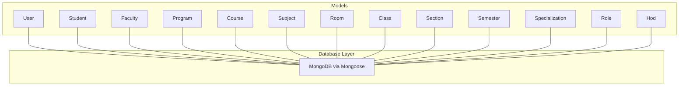
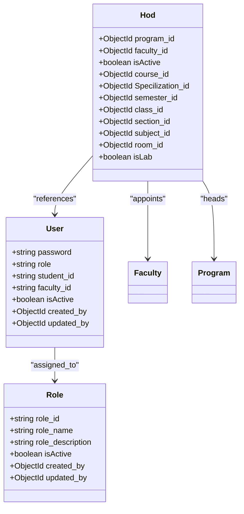
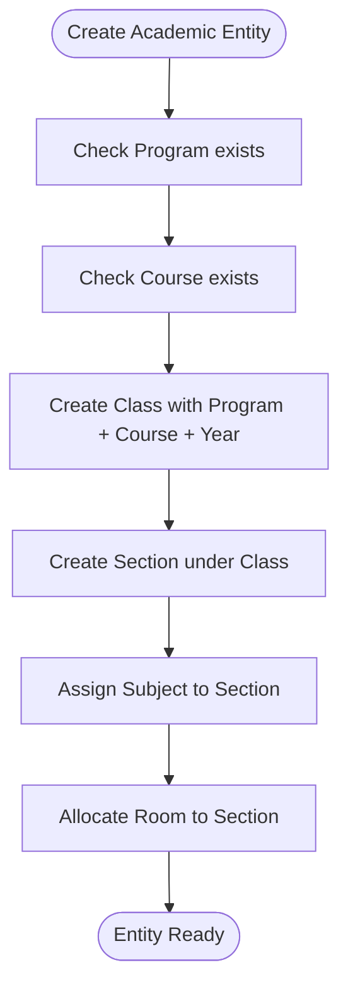
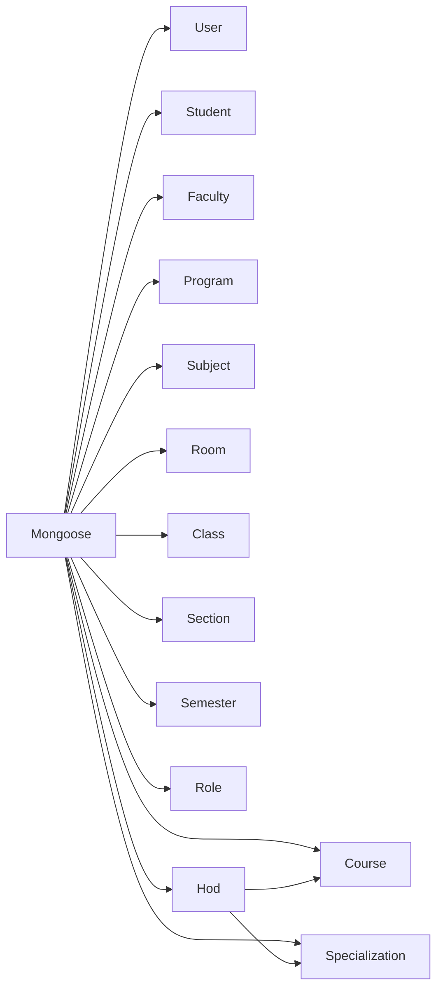

# Data Models & Database Schema

<cite>
**Referenced Files in This Document**
- [user.models.js](file://Backend/src/models/user.models.js)
- [student.models.js](file://Backend/src/models/student.models.js)
- [faculty.models.js](file://Backend/src/models/faculty.models.js)
- [program.models.js](file://Backend/src/models/program.models.js)
- [course.models.js](file://Backend/src/models/course.models.js)
- [subject.models.js](file://Backend/src/models/subject.models.js)
- [room.models.js](file://Backend/src/models/room.models.js)
- [class.models.js](file://Backend/src/models/class.models.js)
- [section.models.js](file://Backend/src/models/section.models.js)
- [semester.models.js](file://Backend/src/models/semester.models.js)
- [specialization.models.js](file://Backend/src/models/specialization.models.js)
- [role.models.js](file://Backend/src/models/role.models.js)
- [hod.models.js](file://Backend/src/models/hod.models.js)
- [index.js](file://Backend/src/db/index.js)
- [package.json](file://Backend/package.json)
</cite>

## Table of Contents
1. [Introduction](#introduction)
2. [Project Structure](#project-structure)
3. [Core Components](#core-components)
4. [Architecture Overview](#architecture-overview)
5. [Detailed Component Analysis](#detailed-component-analysis)
6. [Dependency Analysis](#dependency-analysis)
7. [Performance Considerations](#performance-considerations)
8. [Troubleshooting Guide](#troubleshooting-guide)
9. [Conclusion](#conclusion)
10. [Appendices](#appendices)

## Introduction
This document describes the MongoDB schema design for an academic timetable management system. It covers entity definitions, field-level constraints, validation rules, indexing strategies, and referential relationships among Users, Students, Faculty, Programs, Courses, Rooms, Sections, Semesters, Subjects, Specializations, Roles, and HOD mappings. It also outlines the role-based access control model, authentication schema, and practical query optimization patterns. Sample data structures and lifecycle management are included to guide consistent data handling.

## Project Structure
The backend uses Mongoose ODM to define models under Backend/src/models. Each model corresponds to a collection in MongoDB. The database connection is initialized in Backend/src/db/index.js, which connects to the configured MongoDB URI and database name.



**Diagram sources**
- [index.js:1-19](file://Backend/src/db/index.js#L1-L19)
- [user.models.js:1-61](file://Backend/src/models/user.models.js#L1-L61)
- [student.models.js:1-66](file://Backend/src/models/student.models.js#L1-L66)
- [faculty.models.js:1-77](file://Backend/src/models/faculty.models.js#L1-L77)
- [program.models.js:1-24](file://Backend/src/models/program.models.js#L1-L24)
- [course.models.js:1-33](file://Backend/src/models/course.models.js#L1-L33)
- [subject.models.js:1-33](file://Backend/src/models/subject.models.js#L1-L33)
- [room.models.js:1-28](file://Backend/src/models/room.models.js#L1-L28)
- [class.models.js:1-32](file://Backend/src/models/class.models.js#L1-L32)
- [section.models.js:1-31](file://Backend/src/models/section.models.js#L1-L31)
- [semester.models.js:1-28](file://Backend/src/models/semester.models.js#L1-L28)
- [specialization.models.js:1-39](file://Backend/src/models/specialization.models.js#L1-L39)
- [role.models.js:1-43](file://Backend/src/models/role.models.js#L1-L43)
- [hod.models.js:1-57](file://Backend/src/models/hod.models.js#L1-L57)

**Section sources**
- [index.js:1-19](file://Backend/src/db/index.js#L1-L19)
- [package.json:1-22](file://Backend/package.json#L1-L22)

## Core Components
This section summarizes each model’s purpose, key fields, data types, validation rules, and business constraints.

- User
  - Purpose: Authentication and role assignment for system actors.
  - Key fields: password, role (enum: admin, faculty, student, coordinator, hod), student_id, faculty_id, isActive, created_by, updated_by.
  - Validation: role enum enforcement; timestamps enabled.
  - Notes: Supports soft deletion via isActive; references another User for audit fields.

- Student
  - Purpose: Academic profile of a student.
  - Key fields: student_id (unique, uppercase), student_name (indexed), email (unique, lowercase), class, batch, date_of_birth, specialization, division.
  - Validation: uniqueness and casing enforced; timestamps enabled.

- Faculty
  - Purpose: Academic staff profile and employment details.
  - Key fields: faculty_id (uppercase), faculty_name (indexed), email (unique), phone (unique, numeric), specialization, higher_qualification, years_of_Experience, gender, date_of_joining, date_of_birth, address, isActive.
  - Validation: numeric phone constraint; timestamps enabled.

- Program
  - Purpose: Academic program classification.
  - Key fields: program_id (unique, uppercase), program_name (enum: Under_Graduate, Post_Graduate, Diploma, Post_Diploma).
  - Validation: enum enforcement; timestamps enabled.

- Course
  - Purpose: Academic course offering.
  - Key fields: course_id (unique, uppercase), course_name, course_duration, isActive.
  - Validation: numeric duration; timestamps enabled.

- Subject
  - Purpose: Academic subject/unit of study.
  - Key fields: subject_id (unique, uppercase), subject_name (indexed), credit, isActive.
  - Validation: numeric credit; timestamps enabled.

- Room
  - Purpose: Physical classroom or lab location.
  - Key fields: room_no (unique, uppercase), floor_no, wing.
  - Validation: numeric floor; timestamps enabled.

- Class
  - Purpose: Cohort grouping within a program and course.
  - Key fields: class_id (unique, uppercase), program_id (ref Program), year, course_id (ref Course).
  - Validation: timestamps enabled.

- Section
  - Purpose: Subdivision of a class.
  - Key fields: section_name, class_id (ref Class), description.
  - Validation: timestamps enabled.

- Semester
  - Purpose: Academic term identifier.
  - Key fields: semester_name (unique, numeric), isEven.
  - Validation: timestamps enabled.

- Specialization
  - Purpose: Field of focus within a program and course.
  - Key fields: specilization_id (unique, uppercase), specilization_name, program_id, course_id, isActive.
  - Validation: timestamps enabled.

- Role
  - Purpose: System roles with audit trail.
  - Key fields: role_id (unique, uppercase), role_name (indexed), role_description, isActive, created_by, updated_by (both ref User).
  - Validation: timestamps enabled.

- HOD
  - Purpose: Head of Department mapping across academic entities.
  - Key fields: program_id (ref Program), faculty_id (ref Faculty), isActive, course_id (ref Course), Specilization_id (ref Specialization), semester_id (ref Semester), class_id (ref Class), section_id (ref Section), subject_id (ref Subject), room_id (ref Room), isLab.
  - Validation: timestamps enabled.

**Section sources**
- [user.models.js:1-61](file://Backend/src/models/user.models.js#L1-L61)
- [student.models.js:1-66](file://Backend/src/models/student.models.js#L1-L66)
- [faculty.models.js:1-77](file://Backend/src/models/faculty.models.js#L1-L77)
- [program.models.js:1-24](file://Backend/src/models/program.models.js#L1-L24)
- [course.models.js:1-33](file://Backend/src/models/course.models.js#L1-L33)
- [subject.models.js:1-33](file://Backend/src/models/subject.models.js#L1-L33)
- [room.models.js:1-28](file://Backend/src/models/room.models.js#L1-L28)
- [class.models.js:1-32](file://Backend/src/models/class.models.js#L1-L32)
- [section.models.js:1-31](file://Backend/src/models/section.models.js#L1-L31)
- [semester.models.js:1-28](file://Backend/src/models/semester.models.js#L1-L28)
- [specialization.models.js:1-39](file://Backend/src/models/specialization.models.js#L1-L39)
- [role.models.js:1-43](file://Backend/src/models/role.models.js#L1-L43)
- [hod.models.js:1-57](file://Backend/src/models/hod.models.js#L1-L57)

## Architecture Overview
The schema follows a normalized, relational-like design using ObjectId references to maintain loose coupling while enabling rich queries. The hierarchy flows from Programs and Courses down to Classes, Sections, and Semesters, with Subjects linked to Sections and Rooms to Sections or HOD mappings.

```mermaid
erDiagram
PROGRAM ||--o{ CLASS : "has_many"
COURSE ||--o{ CLASS : "belongs_to"
CLASS ||--o{ SECTION : "contains"
SUBJECT ||--o{ SECTION : "mapped_to"
ROOM ||--o{ SECTION : "allocated_to"
SEMESTER ||--o{ SECTION : "scheduled_in"
STUDENT ||--o{ SECTION : "enrolled_in"
FACULTY ||--o{ SECTION : "teaches"
SPECIALIZATION ||--o{ STUDENT : "focuses_on"
ROLE ||--o{ USER : "assigned_to"
USER ||--o{ USER : "audit_trail"
HOD ||--|| PROGRAM : "heads"
HOD ||--|| FACULTY : "appointed_as"
HOD ||--o{ COURSE : "coordinates"
HOD ||--o{ SPECIALIZATION : "manages"
HOD ||--o{ SEMESTER : "plans"
HOD ||--o{ CLASS : "oversees"
HOD ||--o{ SECTION : "monitors"
HOD ||--o{ SUBJECT : "assigns"
HOD ||--o{ ROOM : "allocates"
```

**Diagram sources**
- [program.models.js:1-24](file://Backend/src/models/program.models.js#L1-L24)
- [course.models.js:1-33](file://Backend/src/models/course.models.js#L1-L33)
- [class.models.js:1-32](file://Backend/src/models/class.models.js#L1-L32)
- [section.models.js:1-31](file://Backend/src/models/section.models.js#L1-L31)
- [subject.models.js:1-33](file://Backend/src/models/subject.models.js#L1-L33)
- [room.models.js:1-28](file://Backend/src/models/room.models.js#L1-L28)
- [semester.models.js:1-28](file://Backend/src/models/semester.models.js#L1-L28)
- [student.models.js:1-66](file://Backend/src/models/student.models.js#L1-L66)
- [faculty.models.js:1-77](file://Backend/src/models/faculty.models.js#L1-L77)
- [specialization.models.js:1-39](file://Backend/src/models/specialization.models.js#L1-L39)
- [role.models.js:1-43](file://Backend/src/models/role.models.js#L1-L43)
- [user.models.js:1-61](file://Backend/src/models/user.models.js#L1-L61)
- [hod.models.js:1-57](file://Backend/src/models/hod.models.js#L1-L57)

## Detailed Component Analysis

### Authentication and Authorization Schema
- User
  - Stores hashed passwords and role membership. Role determines access to features and views.
  - Uses created_by and updated_by to track who manages accounts.
  - Supports soft activation via isActive.

- Role
  - Defines role_id, role_name, and role_description. Indexed role_name supports lookup performance.
  - Tracks creation and modification via User references.

- HOD
  - Links a Faculty member to a Program and multiple academic entities (Course, Specialization, Semester, Class, Section, Subject, Room).
  - Provides isLab flag for lab allocations.



**Diagram sources**
- [user.models.js:1-61](file://Backend/src/models/user.models.js#L1-L61)
- [role.models.js:1-43](file://Backend/src/models/role.models.js#L1-L43)
- [hod.models.js:1-57](file://Backend/src/models/hod.models.js#L1-L57)

**Section sources**
- [user.models.js:1-61](file://Backend/src/models/user.models.js#L1-L61)
- [role.models.js:1-43](file://Backend/src/models/role.models.js#L1-L43)
- [hod.models.js:1-57](file://Backend/src/models/hod.models.js#L1-L57)

### Academic Hierarchy and Referential Integrity
- Program defines degree classifications.
- Course belongs to a Program; Class links Program and Course with a year.
- Section belongs to a Class; Section can be associated with Subjects and Rooms.
- Semester organizes Sections by term.
- Specialization ties to Program and Course and is linked to Students.
- Faculty and Students are referenced by Section and HOD mappings.



**Diagram sources**
- [program.models.js:1-24](file://Backend/src/models/program.models.js#L1-L24)
- [course.models.js:1-33](file://Backend/src/models/course.models.js#L1-L33)
- [class.models.js:1-32](file://Backend/src/models/class.models.js#L1-L32)
- [section.models.js:1-31](file://Backend/src/models/section.models.js#L1-L31)
- [subject.models.js:1-33](file://Backend/src/models/subject.models.js#L1-L33)
- [room.models.js:1-28](file://Backend/src/models/room.models.js#L1-L28)

**Section sources**
- [program.models.js:1-24](file://Backend/src/models/program.models.js#L1-L24)
- [course.models.js:1-33](file://Backend/src/models/course.models.js#L1-L33)
- [class.models.js:1-32](file://Backend/src/models/class.models.js#L1-L32)
- [section.models.js:1-31](file://Backend/src/models/section.models.js#L1-L31)
- [subject.models.js:1-33](file://Backend/src/models/subject.models.js#L1-L33)
- [room.models.js:1-28](file://Backend/src/models/room.models.js#L1-L28)

### Data Types, Validation, and Constraints
- Strings: Unique constraints enforced via schema options; uppercase/lowercase normalization; trimming whitespace.
- Numbers: Numeric-only constraints (e.g., phone digits) and numeric fields (credit, duration, floor_no).
- Dates: Date fields for joining and birth dates.
- Enums: role, program_name, semester_name (numeric).
- References: ObjectId refs to related collections (Program, Course, Class, Section, Subject, Room, Faculty, User).
- Indexes: Explicit indexes on frequently queried fields (e.g., student_name, faculty_name, subject_name, role_name).

**Section sources**
- [student.models.js:1-66](file://Backend/src/models/student.models.js#L1-L66)
- [faculty.models.js:1-77](file://Backend/src/models/faculty.models.js#L1-L77)
- [program.models.js:1-24](file://Backend/src/models/program.models.js#L1-L24)
- [course.models.js:1-33](file://Backend/src/models/course.models.js#L1-L33)
- [subject.models.js:1-33](file://Backend/src/models/subject.models.js#L1-L33)
- [role.models.js:1-43](file://Backend/src/models/role.models.js#L1-L43)
- [user.models.js:1-61](file://Backend/src/models/user.models.js#L1-L61)

### Indexing Strategies and Query Optimization
- Text-like lookups: student_name, faculty_name, subject_name, role_name are indexed to accelerate search/filter operations.
- Uniqueness: primary identifiers (student_id, faculty_id, course_id, subject_id, room_no, program_id) are unique to prevent duplicates.
- Reference joins: ObjectId refs enable efficient population in queries; ensure populate usage aligns with access patterns.
- Composite patterns: consider compound indexes for frequent filter combinations (e.g., Program + Year, Course + Semester).

[No sources needed since this section provides general guidance]

### Sample Data Structures
Below are representative samples for key entities. Replace values with actual identifiers and ensure casing rules are followed.

- User
  - Fields: role, student_id, faculty_id, isActive, created_by, updated_by
  - Example: role="faculty", faculty_id="FAC123", isActive=true

- Student
  - Fields: student_id, student_name, email, class, batch, date_of_birth, specialization, division
  - Example: student_id="S12345", student_name="john doe", email="john@example.com", class="CS", batch="2024", specialization="AI", division="A"

- Faculty
  - Fields: faculty_id, faculty_name, email, phone, specialization, higher_qualification, years_of_Experience, gender, date_of_joining, date_of_birth, address, isActive
  - Example: faculty_id="FAC007", faculty_name="dr smith", email="smith@univ.edu", phone=9876543210, specialization="AI", higher_qualification="PhD", years_of_Experience=10, gender="male", address="123 University Ave", isActive=true

- Program
  - Fields: program_id, program_name
  - Example: program_id="UG-CS", program_name="under_graduate"

- Course
  - Fields: course_id, course_name, course_duration, isActive
  - Example: course_id="CS101", course_name="intro to cs", course_duration=1, isActive=true

- Subject
  - Fields: subject_id, subject_name, credit, isActive
  - Example: subject_id="SUB101", subject_name="math", credit=4, isActive=true

- Room
  - Fields: room_no, floor_no, wing
  - Example: room_no="R204", floor_no=2, wing="east"

- Class
  - Fields: class_id, program_id, year, course_id
  - Example: class_id="C1A", program_id="ObjectId(...)", year=1, course_id="ObjectId(...)"

- Section
  - Fields: section_name, class_id, description
  - Example: section_name="A", class_id="ObjectId(...)", description="Morning Shift"

- Semester
  - Fields: semester_name, isEven
  - Example: semester_name=1, isEven=false

- Specialization
  - Fields: specilization_id, specilization_name, program_id, course_id, isActive
  - Example: specilization_id="SPEC01", specilization_name="AI", program_id="UG-CS", course_id="CS101", isActive=true

- Role
  - Fields: role_id, role_name, role_description, isActive, created_by, updated_by
  - Example: role_id="ROLE001", role_name="faculty", role_description="Teaching staff", isActive=true

- HOD
  - Fields: program_id, faculty_id, isActive, course_id, Specilization_id, semester_id, class_id, section_id, subject_id, room_id, isLab
  - Example: program_id="ObjectId(...)", faculty_id="ObjectId(...)", course_id="ObjectId(...)", Specilization_id="ObjectId(...)", semester_id="ObjectId(...)", class_id="ObjectId(...)", section_id="ObjectId(...)", subject_id="ObjectId(...)", room_id="ObjectId(...)", isLab=false

**Section sources**
- [user.models.js:1-61](file://Backend/src/models/user.models.js#L1-L61)
- [student.models.js:1-66](file://Backend/src/models/student.models.js#L1-L66)
- [faculty.models.js:1-77](file://Backend/src/models/faculty.models.js#L1-L77)
- [program.models.js:1-24](file://Backend/src/models/program.models.js#L1-L24)
- [course.models.js:1-33](file://Backend/src/models/course.models.js#L1-L33)
- [subject.models.js:1-33](file://Backend/src/models/subject.models.js#L1-L33)
- [room.models.js:1-28](file://Backend/src/models/room.models.js#L1-L28)
- [class.models.js:1-32](file://Backend/src/models/class.models.js#L1-L32)
- [section.models.js:1-31](file://Backend/src/models/section.models.js#L1-L31)
- [semester.models.js:1-28](file://Backend/src/models/semester.models.js#L1-L28)
- [specialization.models.js:1-39](file://Backend/src/models/specialization.models.js#L1-L39)
- [role.models.js:1-43](file://Backend/src/models/role.models.js#L1-L43)
- [hod.models.js:1-57](file://Backend/src/models/hod.models.js#L1-L57)

### Document Lifecycle Management
- Creation: All models support timestamps; createdAt and updatedAt are maintained automatically.
- Updates: Use updated_by (where applicable) to track who modified records.
- Deactivation: Use isActive flags on User, Faculty, Program, Course, Subject, Specialization, Role, and HOD to soft-delete without losing historical data.
- Audit: created_by and updated_by fields provide audit trails for User and Role.

**Section sources**
- [user.models.js:1-61](file://Backend/src/models/user.models.js#L1-L61)
- [role.models.js:1-43](file://Backend/src/models/role.models.js#L1-L43)
- [student.models.js:1-66](file://Backend/src/models/student.models.js#L1-L66)
- [faculty.models.js:1-77](file://Backend/src/models/faculty.models.js#L1-L77)
- [program.models.js:1-24](file://Backend/src/models/program.models.js#L1-L24)
- [course.models.js:1-33](file://Backend/src/models/course.models.js#L1-L33)
- [subject.models.js:1-33](file://Backend/src/models/subject.models.js#L1-L33)
- [specialization.models.js:1-39](file://Backend/src/models/specialization.models.js#L1-L39)
- [hod.models.js:1-57](file://Backend/src/models/hod.models.js#L1-L57)

## Dependency Analysis
- Internal dependencies:
  - hod.models.js imports Course and Specialization models to reference them via ObjectId.
  - All models rely on Mongoose Schema and model constructors.
- External dependencies:
  - MongoDB and Mongoose drivers are declared in package.json.



**Diagram sources**
- [hod.models.js:1-57](file://Backend/src/models/hod.models.js#L1-L57)
- [package.json:1-22](file://Backend/package.json#L1-L22)

**Section sources**
- [hod.models.js:1-57](file://Backend/src/models/hod.models.js#L1-L57)
- [package.json:1-22](file://Backend/package.json#L1-L22)

## Performance Considerations
- Prefer indexed fields for frequent filters (student_name, faculty_name, subject_name, role_name).
- Use selective projections to limit returned fields in read-heavy queries.
- Batch writes for bulk enrollment or timetable generation.
- Denormalize rarely changing attributes only when justified by query patterns.
- Monitor slow queries and add compound indexes for common multi-field filters.

[No sources needed since this section provides general guidance]

## Troubleshooting Guide
- Connection failures:
  - Verify MONGODB_URI and DB_NAME environment variables are set.
  - Confirm MongoDB service is reachable and credentials are correct.

- Duplicate key errors:
  - Ensure unique constraints are respected for identifiers (student_id, faculty_id, course_id, subject_id, room_no, program_id).
  - Normalize casing (uppercase/lowercase) consistently before insert/update.

- Reference resolution issues:
  - Confirm ObjectId references match existing documents in referenced collections.
  - Use populate carefully to avoid N+1 query patterns.

- Validation errors:
  - Phone numbers must be numeric and meet length requirements.
  - Enum fields must match allowed values (role, program_name, semester_name).

**Section sources**
- [index.js:1-19](file://Backend/src/db/index.js#L1-L19)
- [faculty.models.js:1-77](file://Backend/src/models/faculty.models.js#L1-L77)
- [program.models.js:1-24](file://Backend/src/models/program.models.js#L1-L24)
- [semester.models.js:1-28](file://Backend/src/models/semester.models.js#L1-L28)

## Conclusion
The schema establishes a robust, extensible foundation for an academic timetable system. It balances relational semantics with MongoDB flexibility through ObjectId references, enforces strong validation and normalization, and supports efficient querying via strategic indexing. The role-based access control and HOD mapping enable fine-grained governance across academic entities.

## Appendices
- Data Integrity and Cascading
  - No automatic cascading deletes are defined in the schema. Implement application-level cascading or database triggers if required.
  - Use isActive flags for soft-deletion to preserve referential integrity during archival.

- Query Patterns
  - Lookup by name fields: utilize indexes on student_name, faculty_name, subject_name, role_name.
  - Join-heavy reads: leverage populate for referenced entities; cache frequently accessed metadata.

[No sources needed since this section provides general guidance]