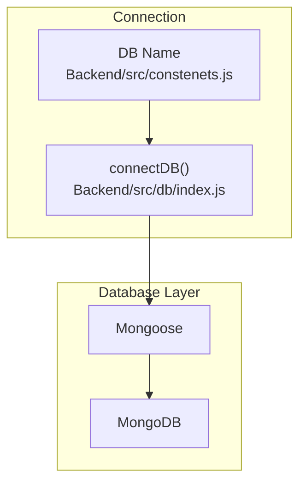
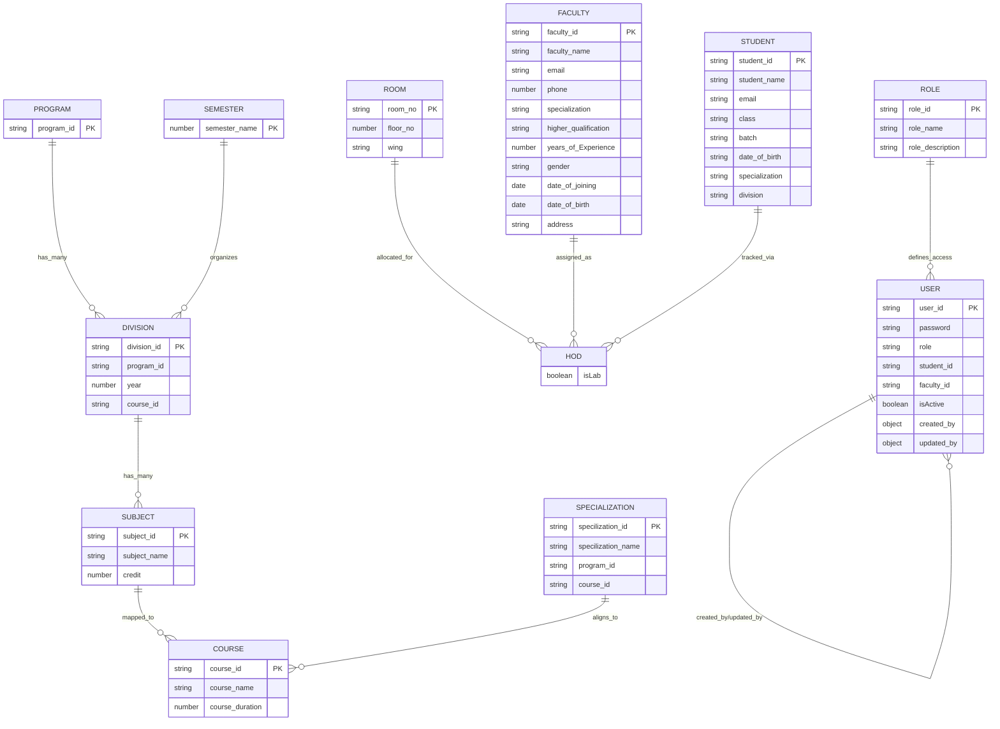
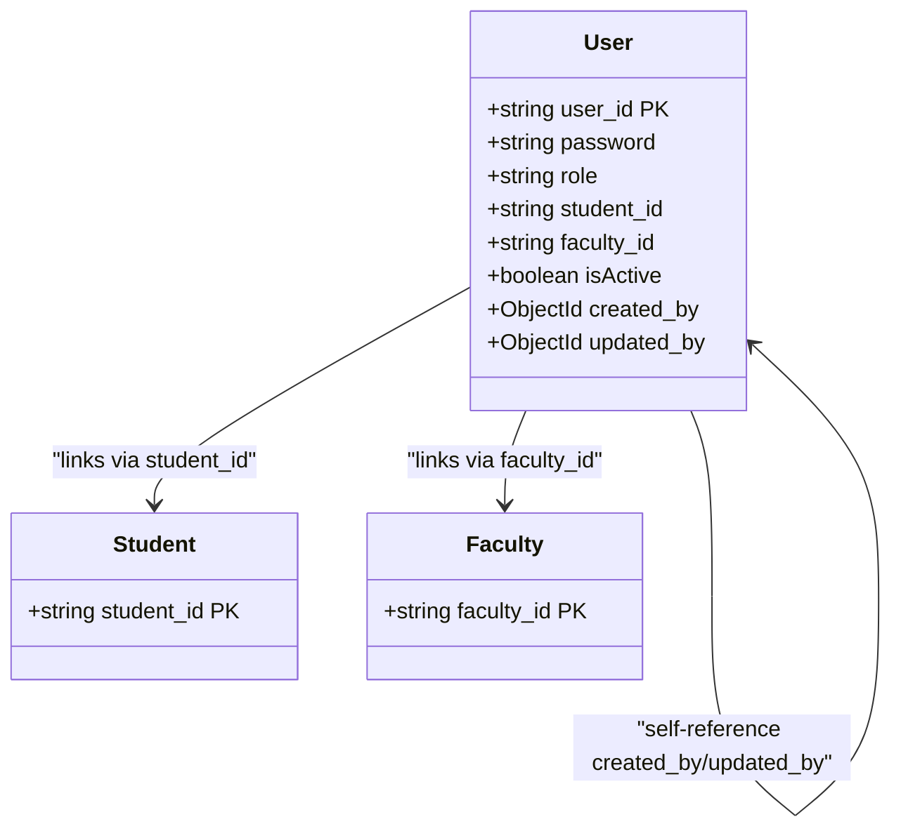
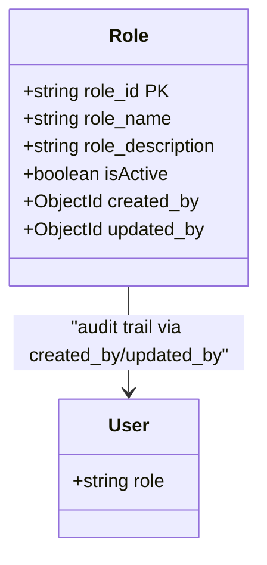
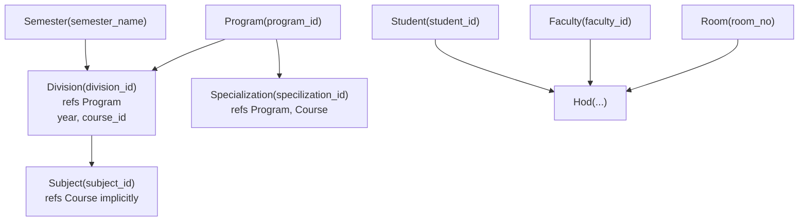
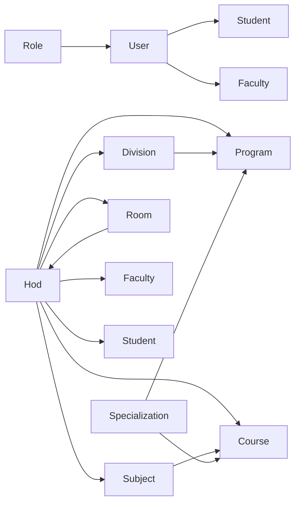

# Database Relationships & Constraints

<cite>
**Referenced Files in This Document**
- [user.models.js](file://Backend/src/models/user.models.js)
- [student.models.js](file://Backend/src/models/student.models.js)
- [faculty.models.js](file://Backend/src/models/faculty.models.js)
- [role.models.js](file://Backend/src/models/role.models.js)
- [program.models.js](file://Backend/src/models/program.models.js)
- [division.models.js](file://Backend/src/models/division.models.js)
- [course.models.js](file://Backend/src/models/course.models.js)
- [division.models.js](file://Backend/src/models/division.models.js)
- [subject.models.js](file://Backend/src/models/subject.models.js)
- [semester.models.js](file://Backend/src/models/semester.models.js)
- [specialization.models.js](file://Backend/src/models/specialization.models.js)
- [room.models.js](file://Backend/src/models/room.models.js)
- [hod.models.js](file://Backend/src/models/hod.models.js)
- [index.js](file://Backend/src/db/index.js)
- [constenets.js](file://Backend/src/constenets.js)
</cite>

## Update Summary
**Changes Made**
- Updated User model documentation to reflect the new manual user_id field as the primary identifier
- Added documentation for the new user_id generation logic and role-based prefix system
- Revised relationship explanations to account for the transition from dual-student_id/faculty_id to single user_id approach
- Updated architectural diagrams to reflect the current user identification strategy

## Table of Contents
1. [Introduction](#introduction)
2. [Project Structure](#project-structure)
3. [Core Components](#core-components)
4. [Architecture Overview](#architecture-overview)
5. [Detailed Component Analysis](#detailed-component-analysis)
6. [Dependency Analysis](#dependency-analysis)
7. [Performance Considerations](#performance-considerations)
8. [Troubleshooting Guide](#troubleshooting-guide)
9. [Conclusion](#conclusion)
10. [Appendices](#appendices)

## Introduction
This document focuses on the database relationships, foreign key constraints, and referential integrity across the academic timetable models. It explains:
- Self-referencing relationships in the User model via created_by and updated_by
- The new user_id generation system and its role-based prefix approach
- Linking mechanisms between User and Personnel models via student_id and faculty_id
- Hierarchical relationships among academic entities and their impact on data integrity
- Indexing strategies and query optimization patterns
- Cascading behavior expectations and enforcement
- Validation rules and business constraints

## Project Structure
The database layer is implemented using Mongoose ODM with a set of models representing academic entities. Connections to MongoDB are established via a centralized connection module.

**Diagram sources**
- [index.js:1-19](file://Backend/src/db/index.js#L1-L19)
- [constenets.js:1-2](file://Backend/src/constenets.js#L1-L2)

**Section sources**
- [index.js:1-19](file://Backend/src/db/index.js#L1-L19)
- [constenets.js:1-2](file://Backend/src/constenets.js#L1-L2)

## Core Components
This section outlines the primary models and their roles in the academic timetable domain.

- User: Central identity and access model with role-based user_id generation and self-referencing audit fields.
- Student: Academic persona with unique identifiers and personal attributes.
- Faculty: Academic staff persona with professional attributes.
- Role: Permission and access control model with self-referencing audit fields.
- Academic hierarchy: Program → Division → Course → Division → Subject → Semester → Specialization → Room → Hod

Key constraints observed:
- Unique identifiers enforced at schema level for entities requiring uniqueness.
- Enumerations constrain categorical fields to predefined sets.
- Self-referencing ObjectId fields for audit trails.
- Reference fields linking to parent entities via ObjectId and ref.

**Section sources**
- [user.models.js:1-105](file://Backend/src/models/user.models.js#L1-L105)
- [student.models.js:1-71](file://Backend/src/models/student.models.js#L1-L71)
- [faculty.models.js:1-81](file://Backend/src/models/faculty.models.js#L1-L81)
- [role.models.js:1-43](file://Backend/src/models/role.models.js#L1-L43)
- [program.models.js:1-24](file://Backend/src/models/program.models.js#L1-L24)
- [division.models.js:1-32](file://Backend/src/models/division.models.js#L1-L32)
- [course.models.js:1-33](file://Backend/src/models/course.models.js#L1-L33)
- [division.models.js:1-31](file://Backend/src/models/division.models.js#L1-L31)
- [subject.models.js:1-33](file://Backend/src/models/subject.models.js#L1-L33)
- [semester.models.js:1-28](file://Backend/src/models/semester.models.js#L1-L28)
- [specialization.models.js:1-39](file://Backend/src/models/specialization.models.js#L1-L39)
- [room.models.js:1-28](file://Backend/src/models/room.models.js#L1-L28)
- [hod.models.js:1-57](file://Backend/src/models/hod.models.js#L1-L57)

## Architecture Overview
The academic timetable architecture forms a hierarchical graph of entities. Foreign keys are represented as ObjectId references with optional denormalized string identifiers for human-readable keys.

**Diagram sources**
- [program.models.js:1-24](file://Backend/src/models/program.models.js#L1-L24)
- [division.models.js:1-32](file://Backend/src/models/division.models.js#L1-L32)
- [subject.models.js:1-33](file://Backend/src/models/subject.models.js#L1-L33)
- [course.models.js:1-33](file://Backend/src/models/course.models.js#L1-L33)
- [semester.models.js:1-28](file://Backend/src/models/semester.models.js#L1-L28)
- [specialization.models.js:1-39](file://Backend/src/models/specialization.models.js#L1-L39)
- [room.models.js:1-28](file://Backend/src/models/room.models.js#L1-L28)
- [hod.models.js:1-57](file://Backend/src/models/hod.models.js#L1-L57)
- [faculty.models.js:1-81](file://Backend/src/models/faculty.models.js#L1-L81)
- [student.models.js:1-71](file://Backend/src/models/student.models.js#L1-L71)
- [role.models.js:1-43](file://Backend/src/models/role.models.js#L1-L43)
- [user.models.js:1-105](file://Backend/src/models/user.models.js#L1-L105)

## Detailed Component Analysis

### User Model: Identity, Roles, and Self-Referencing Audit
- Purpose: Stores user credentials, role, and audit trail via created_by and updated_by.
- Primary Identifier: user_id (manual string field) serves as the primary identifier, replacing the previous dual-student_id/faculty_id approach.
- Self-referencing fields:
  - created_by: ObjectId referencing User
  - updated_by: ObjectId referencing User
- Linking to Personnels:
  - student_id: Optional string identifier linking to Student
  - faculty_id: Optional string identifier linking to Faculty
- User ID Generation Logic:
  - Role-based prefix system: First 3 characters of role in uppercase (e.g., "ADM", "FAC", "STU")
  - Student-based IDs: `${rolePrefix}${student_id}` (e.g., "STU12345")
  - Faculty-based IDs: `${rolePrefix}${faculty_id}` (e.g., "FAC98765")
  - System-generated IDs: `${rolePrefix}${timestamp}${random}` for non-personnel roles
- Constraints:
  - role enum supports admin, faculty, student, coordinator, hod
  - user_id is unique and required
  - timestamps enabled for createdAt/updatedAt
- Referential Integrity:
  - created_by/updated_by are optional; absence implies system or anonymous creation.
  - No explicit MongoDB-level foreign key constraints; referential integrity relies on application-level checks.

**Updated** The User model now uses a manual user_id field as the primary identifier with role-based generation logic, replacing the previous dual-student_id/faculty_id approach.

**Diagram sources**
- [user.models.js:1-105](file://Backend/src/models/user.models.js#L1-L105)
- [student.models.js:1-71](file://Backend/src/models/student.models.js#L1-L71)
- [faculty.models.js:1-81](file://Backend/src/models/faculty.models.js#L1-L81)

**Section sources**
- [user.models.js:1-105](file://Backend/src/models/user.models.js#L1-L105)

### Role Model: Access Control with Audit Trail
- Purpose: Defines roles and their descriptions with isActive flag.
- Self-referencing audit fields:
  - created_by and updated_by reference User
- Constraints:
  - role_id unique and uppercase
  - role_name indexed for lookup
  - role enum enforced at application level via controller/model logic
- Referential Integrity:
  - Optional self-references; application logic should validate presence when required.

**Diagram sources**
- [role.models.js:1-43](file://Backend/src/models/role.models.js#L1-L43)
- [user.models.js:1-105](file://Backend/src/models/user.models.js#L1-L105)

**Section sources**
- [role.models.js:1-43](file://Backend/src/models/role.models.js#L1-L43)

### Academic Hierarchy: Program → Division → Course → Division → Subject
- Program defines academic programs with unique identifiers.
- Division links to Program and Course; year indicates academic year.
- Subject belongs to Division; description field present.
- Course represents courses with duration; Division-course mapping implied via shared identifiers.
- Semester organizes academic terms; Specialization aligns with Program and Course.
- Room provides physical allocation; Hod coordinates allocations across entities.

**Updated** The academic hierarchy now uses Division consistently instead of Class, maintaining the same structural relationships.

**Diagram sources**
- [program.models.js:1-24](file://Backend/src/models/program.models.js#L1-L24)
- [division.models.js:1-32](file://Backend/src/models/division.models.js#L1-L32)
- [subject.models.js:1-33](file://Backend/src/models/subject.models.js#L1-L33)
- [course.models.js:1-33](file://Backend/src/models/course.models.js#L1-L33)
- [semester.models.js:1-28](file://Backend/src/models/semester.models.js#L1-L28)
- [specialization.models.js:1-39](file://Backend/src/models/specialization.models.js#L1-L39)
- [room.models.js:1-28](file://Backend/src/models/room.models.js#L1-L28)
- [hod.models.js:1-57](file://Backend/src/models/hod.models.js#L1-L57)
- [faculty.models.js:1-81](file://Backend/src/models/faculty.models.js#L1-L81)
- [student.models.js:1-71](file://Backend/src/models/student.models.js#L1-L71)

**Section sources**
- [program.models.js:1-24](file://Backend/src/models/program.models.js#L1-L24)
- [division.models.js:1-32](file://Backend/src/models/division.models.js#L1-L32)
- [subject.models.js:1-33](file://Backend/src/models/subject.models.js#L1-L33)
- [course.models.js:1-33](file://Backend/src/models/course.models.js#L1-L33)
- [semester.models.js:1-28](file://Backend/src/models/semester.models.js#L1-L28)
- [specialization.models.js:1-39](file://Backend/src/models/specialization.models.js#L1-L39)
- [room.models.js:1-28](file://Backend/src/models/room.models.js#L1-L28)
- [hod.models.js:1-57](file://Backend/src/models/hod.models.js#L1-L57)

### Data Integrity and Referential Integrity
- Unique constraints:
  - Entities enforce unique identifiers at schema level (e.g., student_id, faculty_id, room_no, course_id, subject_id, program_id, user_id).
- Enumerations:
  - role and program_name restrict values to predefined sets.
- Self-referencing:
  - User.created_by and User.updated_by, Role.created_by and Role.updated_by are optional ObjectId references to User.
- Missing explicit foreign key constraints:
  - No MongoDB-level ON DELETE CASCADE or referential actions are defined in the schema.
  - Application-level validation and transactional patterns should ensure referential integrity.

**Updated** Added user_id to the list of unique constraints, reflecting the new primary identifier approach.

**Section sources**
- [user.models.js:1-105](file://Backend/src/models/user.models.js#L1-L105)
- [role.models.js:1-43](file://Backend/src/models/role.models.js#L1-L43)
- [student.models.js:1-71](file://Backend/src/models/student.models.js#L1-L71)
- [faculty.models.js:1-81](file://Backend/src/models/faculty.models.js#L1-L81)
- [room.models.js:1-28](file://Backend/src/models/room.models.js#L1-L28)
- [course.models.js:1-33](file://Backend/src/models/course.models.js#L1-L33)
- [subject.models.js:1-33](file://Backend/src/models/subject.models.js#L1-L33)
- [program.models.js:1-24](file://Backend/src/models/program.models.js#L1-L24)

### Indexing Strategies and Query Optimization
Observed indexes:
- Student.student_name: indexed for efficient lookups by name.
- Faculty.faculty_name: indexed for efficient lookups by name.
- Role.role_name: indexed for role-based filtering.
- Subject.subject_name: indexed for subject lookups.
- Program.program_name: constrained via enum; combined with unique program_id for fast joins.
- User.user_id: unique index for efficient user lookups by generated identifier.
- Composite and multi-key optimizations:
  - Consider compound indexes on frequently filtered pairs (e.g., Program + Year in Division, or Semester + Program for scheduling).
  - Ensure consistent casing policies (uppercase/lowercase) to maximize index effectiveness.

**Updated** Added user_id to the indexing considerations, highlighting its importance as the primary user identifier.

**Section sources**
- [student.models.js:18-18](file://Backend/src/models/student.models.js#L18-L18)
- [faculty.models.js:12-12](file://Backend/src/models/faculty.models.js#L12-L12)
- [role.models.js:17-17](file://Backend/src/models/role.models.js#L17-L17)
- [subject.models.js:17-17](file://Backend/src/models/subject.models.js#L17-L17)
- [program.models.js:14-14](file://Backend/src/models/program.models.js#L14-L14)
- [user.models.js:6-11](file://Backend/src/models/user.models.js#L6-L11)

### Cascading Behavior and Enforcement
- No explicit cascade delete/update rules are defined in the schema.
- Recommended application-level behavior:
  - Prevent deletion of referenced entities (e.g., deleting a Program should fail if Divisions exist).
  - On soft deletes, propagate isActive=false and block dependent writes.
  - Enforce that User.student_id or User.faculty_id references must exist prior to enabling access.

**Section sources**
- [user.models.js:30-38](file://Backend/src/models/user.models.js#L30-L38)
- [division.models.js:13-16](file://Backend/src/models/division.models.js#L13-L16)
- [subject.models.js:17-20](file://Backend/src/models/subject.models.js#L17-L20)
- [hod.models.js:7-46](file://Backend/src/models/hod.models.js#L7-L46)

### Data Validation Rules and Business Constraints
- Required fields:
  - Student: student_id, student_name, email, class, batch, date_of_birth, specialization.
  - Faculty: faculty_id, faculty_name, email, phone, specialization, higher_qualification, years_of_Experience, gender, address.
  - Course: course_id, course_name, course_duration.
  - Subject: subject_id, subject_name, credit.
  - Program: program_id, program_name.
  - Room: room_no, floor_no, wing.
  - Division: division_id, class_id, discraption.
  - Semester: semester_name.
  - Specialization: specilization_id, specilization_name, program_id, course_id.
- Enumerations:
  - User.role restricted to admin, faculty, student, coordinator, hod.
  - Program.program_name restricted to Under_Graduate, Post_Graduate, Diploma, Post_Diploma.
- Uniqueness:
  - student_id, faculty_id, room_no, course_id, subject_id, program_id, user_id are unique.
- Case normalization:
  - Fields normalized to lowercase/uppercase as per schema to maintain consistency.

**Updated** Added user_id to the uniqueness constraints and updated Division to use division_id instead of class_id.

**Section sources**
- [student.models.js:5-66](file://Backend/src/models/student.models.js#L5-L66)
- [faculty.models.js:5-76](file://Backend/src/models/faculty.models.js#L5-L76)
- [course.models.js:5-31](file://Backend/src/models/course.models.js#L5-L31)
- [subject.models.js:5-28](file://Backend/src/models/subject.models.js#L5-L28)
- [program.models.js:5-19](file://Backend/src/models/program.models.js#L5-L19)
- [room.models.js:5-23](file://Backend/src/models/room.models.js#L5-L23)
- [division.models.js:11-27](file://Backend/src/models/division.models.js#L11-L27)
- [semester.models.js:12-22](file://Backend/src/models/semester.models.js#L12-L22)
- [specialization.models.js:5-34](file://Backend/src/models/specialization.models.js#L5-L34)
- [user.models.js:13-28](file://Backend/src/models/user.models.js#L13-L28)

### Complex Queries and Relationship Demonstrations
Below are example query patterns that leverage the defined relationships. Replace placeholders with actual values and ensure proper middleware validation.

- Find all Divisions for a given Program:
  - Filter: { program_id: ObjectId("...") }
  - Populate: program_id to Program

- Retrieve Subjects associated with a Course (via shared identifiers):
  - Filter: { subject_id: { $in: [ "...", "..." ] } }
  - Or join via Course.subject_ids if extended

- List all Rooms allocated to a specific Hod:
  - Filter: { room_id: ObjectId("...") }
  - Populate: room_id to Room

- Get all Courses under a Program:
  - Filter: { program_id: ObjectId("...") }
  - Populate: program_id to Program

- Fetch Role details with creator/updater info:
  - Filter: { role_id: "..." }
  - Populate: created_by and updated_by to User

- Find a User's audit trail:
  - Filter: { created_by: ObjectId("...") } or { updated_by: ObjectId("...") }

- Retrieve a Faculty member's profile and related Hods:
  - Filter: { faculty_id: ObjectId("...") }
  - Populate: related fields to Hod, Course, Specialization, Room

- Find User by generated user_id:
  - Filter: { user_id: "STU12345" } (for student user)
  - Filter: { user_id: "FAC98765" } (for faculty user)
  - Filter: { user_id: "ADM2024ABCD" } (for admin user)

**Updated** Added examples for querying users by the new user_id field, demonstrating the role-based prefix system.

Note: These are conceptual examples. Use your application's controller and service layers to construct robust queries with error handling and population.

## Dependency Analysis
This section maps inter-model dependencies and highlights potential circular or cross-module references.

**Diagram sources**
- [user.models.js:1-105](file://Backend/src/models/user.models.js#L1-L105)
- [student.models.js:1-71](file://Backend/src/models/student.models.js#L1-L71)
- [faculty.models.js:1-81](file://Backend/src/models/faculty.models.js#L1-L81)
- [role.models.js:1-43](file://Backend/src/models/role.models.js#L1-L43)
- [hod.models.js:1-57](file://Backend/src/models/hod.models.js#L1-L57)
- [program.models.js:1-24](file://Backend/src/models/program.models.js#L1-L24)
- [division.models.js:1-32](file://Backend/src/models/division.models.js#L1-L32)
- [subject.models.js:1-33](file://Backend/src/models/subject.models.js#L1-L33)
- [course.models.js:1-33](file://Backend/src/models/course.models.js#L1-L33)
- [specialization.models.js:1-39](file://Backend/src/models/specialization.models.js#L1-L39)
- [room.models.js:1-28](file://Backend/src/models/room.models.js#L1-L28)

**Section sources**
- [hod.models.js:1-57](file://Backend/src/models/hod.models.js#L1-L57)
- [division.models.js:1-32](file://Backend/src/models/division.models.js#L1-L32)
- [subject.models.js:1-33](file://Backend/src/models/subject.models.js#L1-L33)
- [course.models.js:1-33](file://Backend/src/models/course.models.js#L1-L33)
- [program.models.js:1-24](file://Backend/src/models/program.models.js#L1-L24)
- [specialization.models.js:1-39](file://Backend/src/models/specialization.models.js#L1-L39)
- [room.models.js:1-28](file://Backend/src/models/room.models.js#L1-L28)
- [user.models.js:1-105](file://Backend/src/models/user.models.js#L1-L105)
- [student.models.js:1-71](file://Backend/src/models/student.models.js#L1-L71)
- [faculty.models.js:1-81](file://Backend/src/models/faculty.models.js#L1-L81)
- [role.models.js:1-43](file://Backend/src/models/role.models.js#L1-L43)

## Performance Considerations
- Index selection:
  - Ensure indexes on fields used in frequent filters and joins (e.g., student_id, faculty_id, division_id, course_id, subject_id, user_id).
  - Consider compound indexes for multi-field queries (e.g., Program + Year).
- Population strategies:
  - Limit population depth to avoid N+1 problems; fetch only required fields.
- Caching:
  - Cache static enumerations and master lists (roles, programs) to reduce DB load.
- Query pagination:
  - Apply skip/take or cursor-based pagination for large result sets.
- Data normalization:
  - Keep denormalized identifiers (e.g., student_id, faculty_id, user_id) consistent with normalized ObjectId references to optimize lookups.

**Updated** Added user_id to the index considerations, emphasizing its role as the primary user identifier.

## Troubleshooting Guide
Common issues and resolutions grounded in schema constraints:

- Duplicate unique identifiers:
  - Symptoms: Insert failures for student_id, faculty_id, room_no, course_id, subject_id, program_id, user_id.
  - Resolution: Validate uniqueness before insert; handle duplicate key errors gracefully.

- Invalid role values:
  - Symptoms: Validation errors when setting User.role to unsupported value.
  - Resolution: Enforce enum validation in controllers/services; reject unknown roles.

- Missing referenced entities:
  - Symptoms: Null or dangling references in populated fields.
  - Resolution: Validate existence of referenced documents before write operations; implement soft-delete semantics.

- Self-reference audit anomalies:
  - Symptoms: created_by or updated_by is null unexpectedly.
  - Resolution: Ensure audit middleware populates these fields during create/update; treat null as system-initiated action.

- Case sensitivity mismatches:
  - Symptoms: Lookup failures due to inconsistent casing.
  - Resolution: Normalize stored values to lowercase/uppercase as per schema; apply consistent casing in queries.

- User ID generation issues:
  - Symptoms: Inconsistent user_id formats or conflicts in role-based prefixes.
  - Resolution: Ensure role values are properly validated and that student_id/faculty_id are correctly formatted before user creation.

**Updated** Added troubleshooting guidance for the new user_id generation system and role-based prefix logic.

**Section sources**
- [user.models.js:13-28](file://Backend/src/models/user.models.js#L13-L28)
- [student.models.js:5-11](file://Backend/src/models/student.models.js#L5-L11)
- [faculty.models.js:5-27](file://Backend/src/models/faculty.models.js#L5-L27)
- [room.models.js:5-23](file://Backend/src/models/room.models.js#L5-L23)
- [course.models.js:5-31](file://Backend/src/models/course.models.js#L5-L31)
- [subject.models.js:5-28](file://Backend/src/models/subject.models.js#L5-L28)
- [program.models.js:5-19](file://Backend/src/models/program.models.js#L5-L19)
- [user.models.js:45-55](file://Backend/src/models/user.models.js#L45-L55)
- [role.models.js:29-37](file://Backend/src/models/role.models.js#L29-L37)

## Conclusion
The academic timetable models define a clear, hierarchical structure with strong uniqueness and enumeration constraints. The User model now uses a sophisticated user_id generation system with role-based prefixes, replacing the previous dual-student_id/faculty_id approach. Self-referencing audit fields in User and Role enable provenance tracking. While MongoDB does not enforce foreign key constraints by default, the schema's design and the outlined validation and application-level strategies ensure robust referential integrity. Proper indexing and query patterns further support performance and scalability.

**Updated** Enhanced conclusion to reflect the new user_id generation system and its benefits for user identification and management.

## Appendices
- Connection Details:
  - Database name: retrieved from constants and used during connection.
  - Connection function establishes the DB connection using environment-provided URI.

**Section sources**
- [constenets.js:1-2](file://Backend/src/constenets.js#L1-L2)
- [index.js:4-16](file://Backend/src/db/index.js#L4-L16)