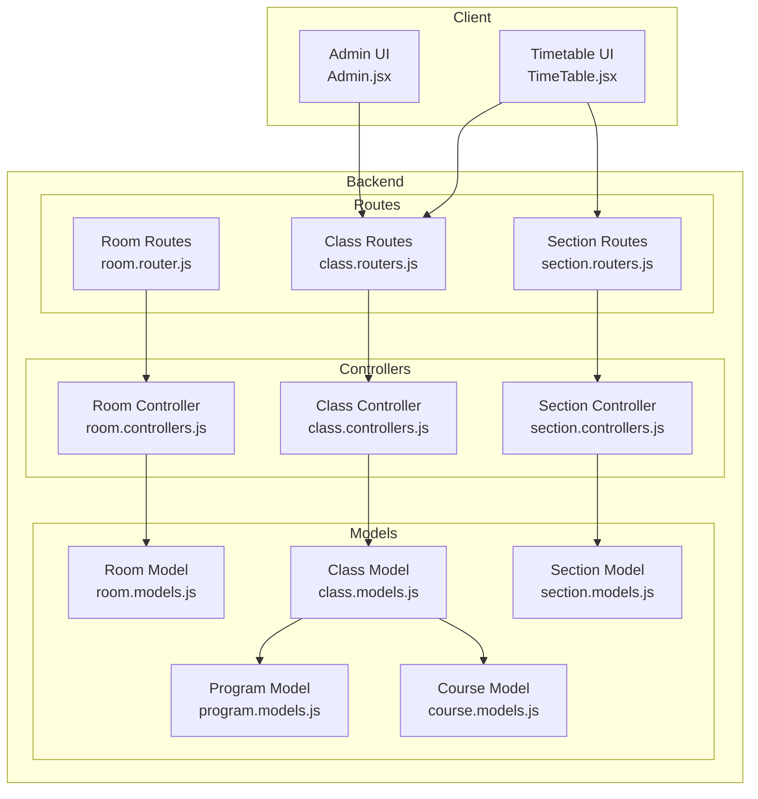
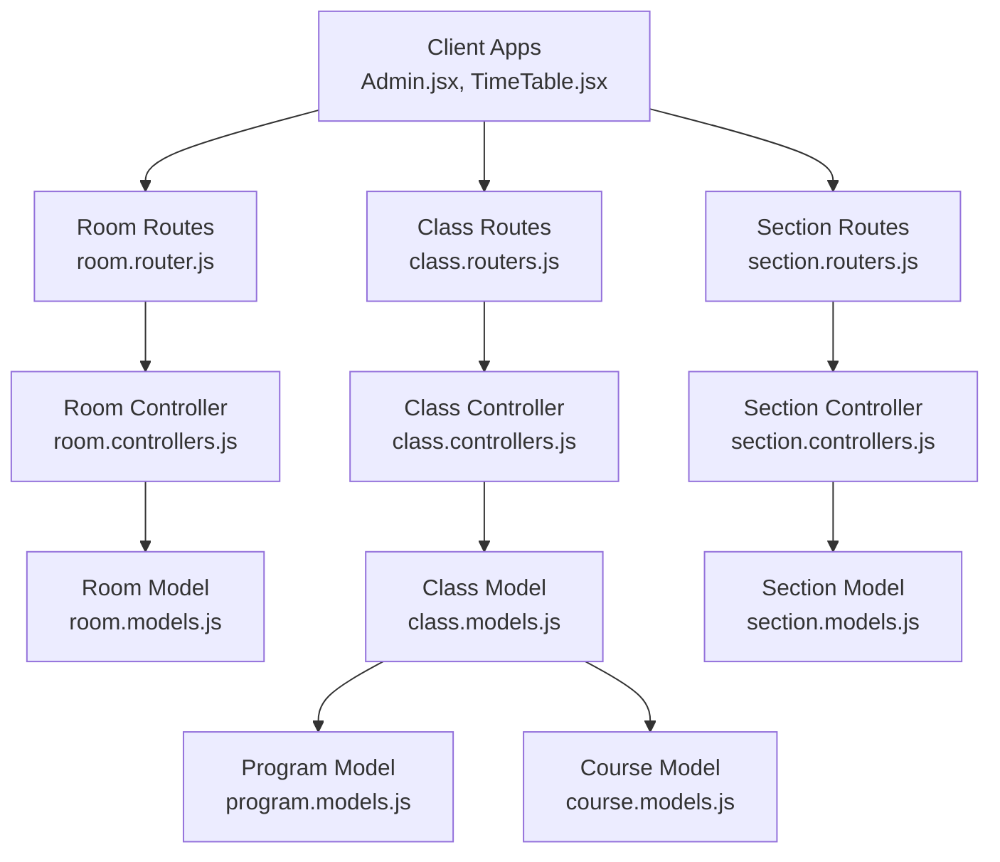
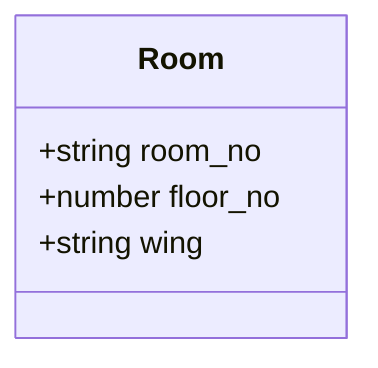
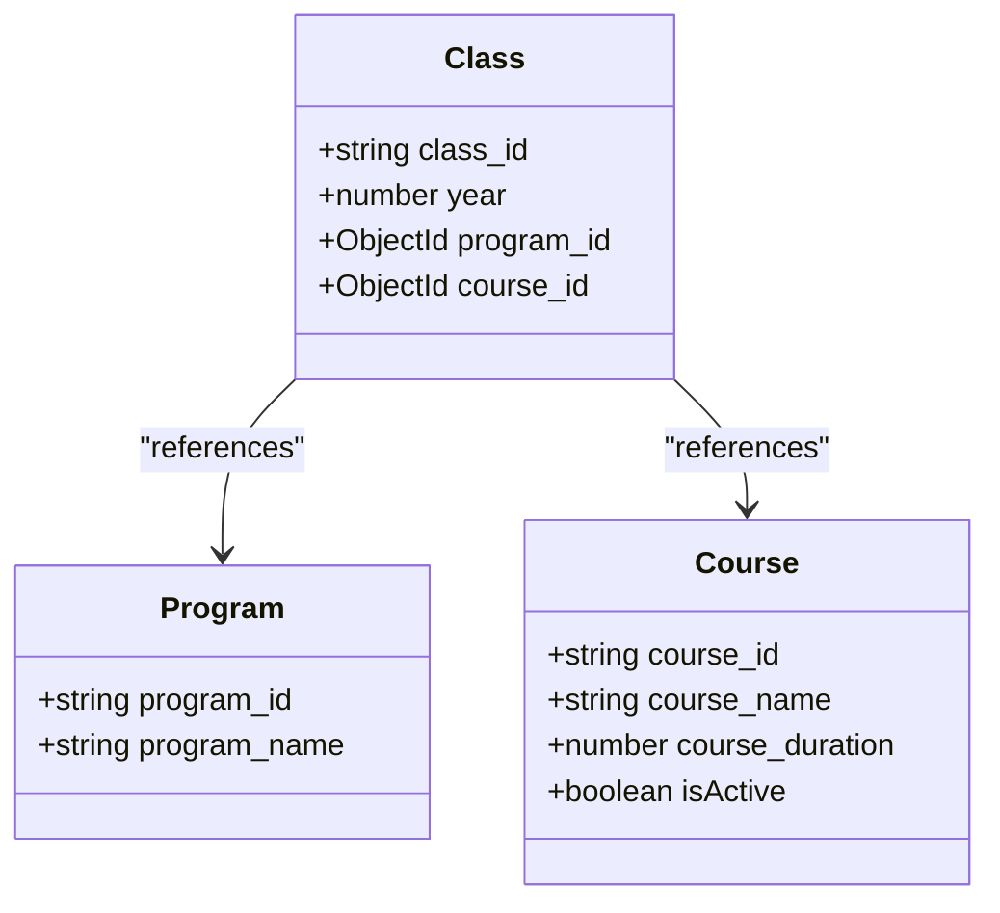
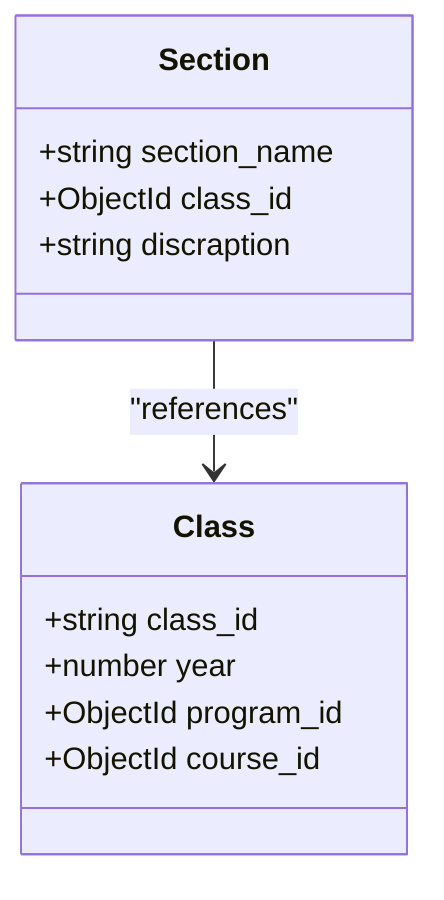
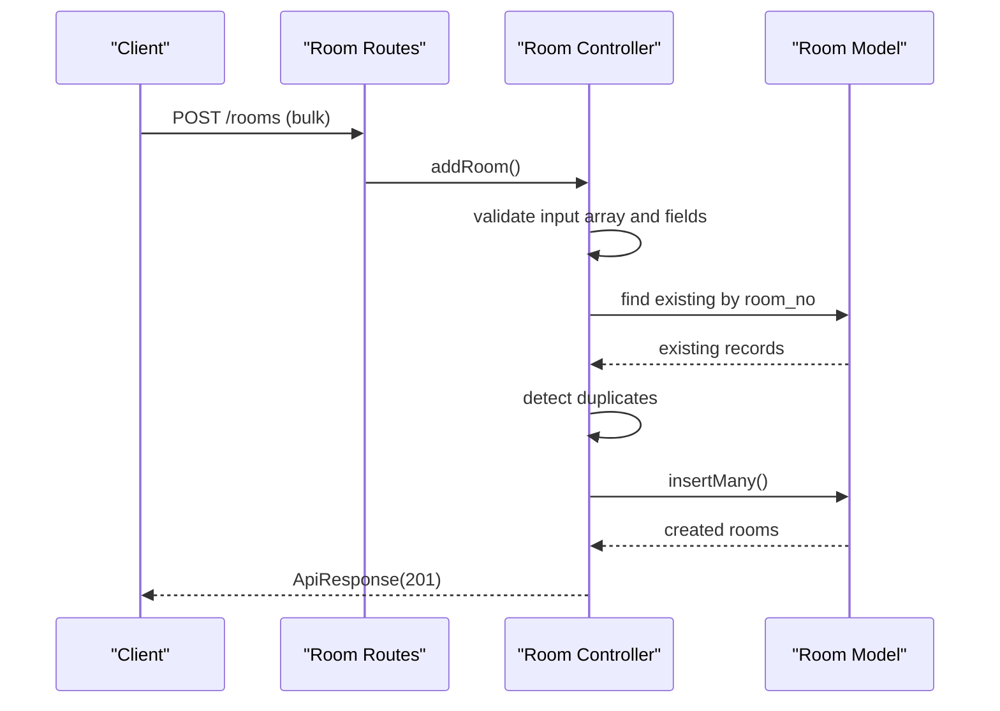
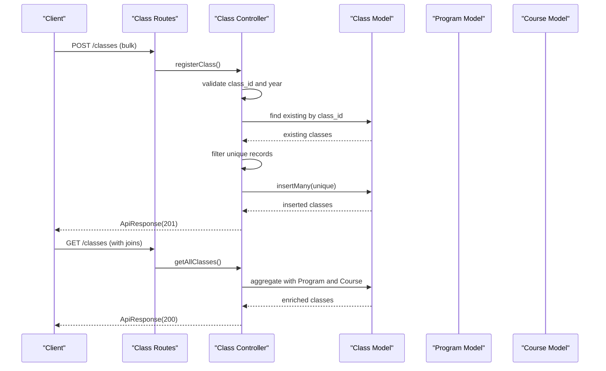
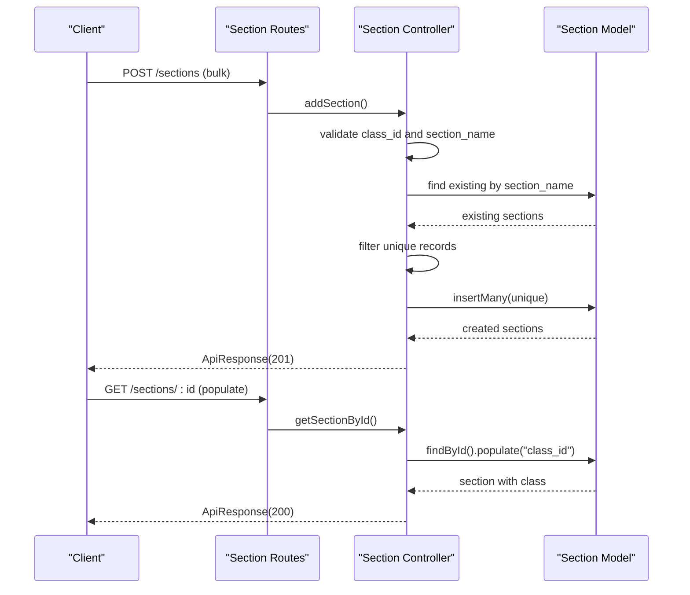
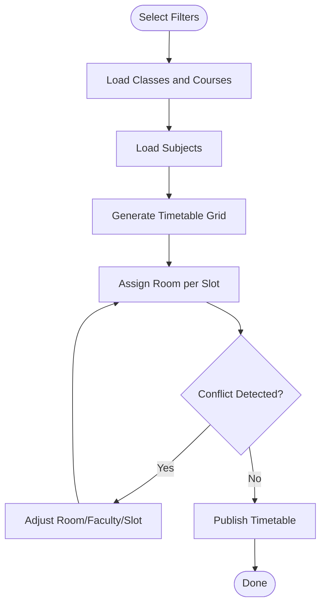
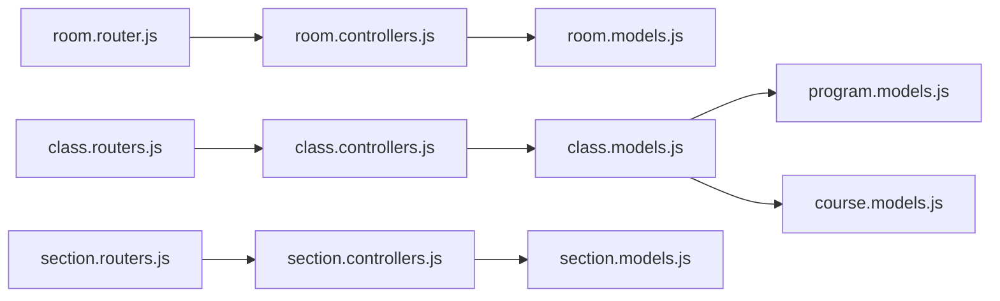

# Infrastructure Models

<cite>
**Referenced Files in This Document**
- [room.models.js](file://Backend/src/models/room.models.js)
- [class.models.js](file://Backend/src/models/class.models.js)
- [section.models.js](file://Backend/src/models/section.models.js)
- [program.models.js](file://Backend/src/models/program.models.js)
- [course.models.js](file://Backend/src/models/course.models.js)
- [room.controllers.js](file://Backend/src/controllers/room.controllers.js)
- [class.controllers.js](file://Backend/src/controllers/class.controllers.js)
- [section.controllers.js](file://Backend/src/controllers/section.controllers.js)
- [room.router.js](file://Backend/src/routes/room.router.js)
- [class.routers.js](file://Backend/src/routes/class.routers.js)
- [section.routers.js](file://Backend/src/routes/section.routers.js)
- [Admin.jsx](file://Client/src/pages/dashboard/Admin.jsx)
- [TimeTable.jsx](file://Client/src/components/deshboard/TimeTable.jsx)
</cite>

## Table of Contents
1. [Introduction](#introduction)
2. [Project Structure](#project-structure)
3. [Core Components](#core-components)
4. [Architecture Overview](#architecture-overview)
5. [Detailed Component Analysis](#detailed-component-analysis)
6. [Dependency Analysis](#dependency-analysis)
7. [Performance Considerations](#performance-considerations)
8. [Troubleshooting Guide](#troubleshooting-guide)
9. [Conclusion](#conclusion)
10. [Appendices](#appendices)

## Introduction
This document defines the infrastructure and organizational models used to represent rooms, academic classes, and sections within the timetable system. It documents the data models, validation rules, and relationships among Room, Class, and Section. It also explains how these models support scheduling, including room allocation patterns and how they relate to programs and courses. Examples illustrate typical allocation scenarios and how the models underpin timetable generation and conflict resolution.

## Project Structure
The relevant backend components are organized by domain:
- Models define the data schema for Room, Class, Section, Program, and Course.
- Controllers implement CRUD operations and validation for each domain.
- Routes expose endpoints for clients to interact with the models.
- Frontend components consume master data (classes, courses, subjects) to render timetables and selections.

**Diagram sources**
- [room.models.js:1-28](file://Backend/src/models/room.models.js#L1-L28)
- [class.models.js:1-32](file://Backend/src/models/class.models.js#L1-L32)
- [section.models.js:1-31](file://Backend/src/models/section.models.js#L1-L31)
- [program.models.js:1-24](file://Backend/src/models/program.models.js#L1-L24)
- [course.models.js:1-33](file://Backend/src/models/course.models.js#L1-L33)
- [room.controllers.js:1-133](file://Backend/src/controllers/room.controllers.js#L1-L133)
- [class.controllers.js:1-179](file://Backend/src/controllers/class.controllers.js#L1-L179)
- [section.controllers.js:1-137](file://Backend/src/controllers/section.controllers.js#L1-L137)
- [room.router.js:1-23](file://Backend/src/routes/room.router.js#L1-L23)
- [class.routers.js:1-24](file://Backend/src/routes/class.routers.js#L1-L24)
- [section.routers.js:1-21](file://Backend/src/routes/section.routers.js#L1-L21)
- [Admin.jsx:105-129](file://Client/src/pages/dashboard/Admin.jsx#L105-L129)
- [TimeTable.jsx:62-105](file://Client/src/components/deshboard/TimeTable.jsx#L62-L105)

**Section sources**
- [room.models.js:1-28](file://Backend/src/models/room.models.js#L1-L28)
- [class.models.js:1-32](file://Backend/src/models/class.models.js#L1-L32)
- [section.models.js:1-31](file://Backend/src/models/section.models.js#L1-L31)
- [program.models.js:1-24](file://Backend/src/models/program.models.js#L1-L24)
- [course.models.js:1-33](file://Backend/src/models/course.models.js#L1-L33)
- [room.controllers.js:1-133](file://Backend/src/controllers/room.controllers.js#L1-L133)
- [class.controllers.js:1-179](file://Backend/src/controllers/class.controllers.js#L1-L179)
- [section.controllers.js:1-137](file://Backend/src/controllers/section.controllers.js#L1-L137)
- [room.router.js:1-23](file://Backend/src/routes/room.router.js#L1-L23)
- [class.routers.js:1-24](file://Backend/src/routes/class.routers.js#L1-L24)
- [section.routers.js:1-21](file://Backend/src/routes/section.routers.js#L1-L21)
- [Admin.jsx:105-129](file://Client/src/pages/dashboard/Admin.jsx#L105-L129)
- [TimeTable.jsx:62-105](file://Client/src/components/deshboard/TimeTable.jsx#L62-L105)

## Core Components
This section documents the Room, Class, and Section models, including fields, validation rules, and relationships.

- Room
  - Purpose: Represents physical infrastructure for scheduling.
  - Fields:
    - room_no: Unique identifier for the room (uppercase, trimmed).
    - floor_no: Numeric floor identifier (required).
    - wing: Building wing designation (lowercase, trimmed).
  - Validation:
    - room_no is required, unique, uppercase, trimmed.
    - floor_no is required and numeric.
    - wing is required and lowercase.
  - Notes:
    - No explicit capacity or facility fields in the current model.

- Class
  - Purpose: Represents an academic class within a program and course.
  - Fields:
    - class_id: Unique identifier for the class (uppercase, trimmed).
    - program_id: Reference to Program.
    - year: Academic year (required).
    - course_id: Reference to Course.
  - Validation:
    - class_id is required, unique, uppercase, trimmed.
    - year is required.
    - program_id and course_id are optional references.
  - Relationships:
    - Links to Program via program_id.
    - Links to Course via course_id.

- Section
  - Purpose: Represents a division/group within a class for student grouping.
  - Fields:
    - section_name: Grouping name (lowercase, trimmed).
    - class_id: Reference to Class.
    - discraption: Description (lowercase, trimmed).
  - Validation:
    - section_name is required.
    - class_id is required.
    - discraption is required.
  - Relationships:
    - Links to Class via class_id.

- Program
  - Purpose: Defines academic program type.
  - Fields:
    - program_id: Unique identifier (uppercase, trimmed).
    - program_name: Enumerated value from predefined set (lowercase, trimmed).
  - Validation:
    - program_id is required, unique, uppercase, trimmed.
    - program_name is required and constrained to a fixed list.

- Course
  - Purpose: Defines academic course metadata.
  - Fields:
    - course_id: Unique identifier (uppercase, trimmed).
    - course_name: Human-readable course name (lowercase, trimmed).
    - course_duration: Duration in years (required).
    - isActive: Boolean flag indicating course availability.
  - Validation:
    - course_id is required, unique, uppercase, trimmed.
    - course_name is required, lowercase, trimmed.
    - course_duration is required and numeric.
    - isActive defaults to true.

**Section sources**
- [room.models.js:3-25](file://Backend/src/models/room.models.js#L3-L25)
- [class.models.js:3-29](file://Backend/src/models/class.models.js#L3-L29)
- [section.models.js:3-29](file://Backend/src/models/section.models.js#L3-L29)
- [program.models.js:4-19](file://Backend/src/models/program.models.js#L4-L19)
- [course.models.js:4-31](file://Backend/src/models/course.models.js#L4-L31)

## Architecture Overview
The system follows a layered architecture:
- Routes define HTTP endpoints for Room, Class, and Section.
- Controllers implement business logic, validation, and error handling.
- Models define schemas and relationships.
- Client applications (Admin UI and Timetable UI) consume master data to drive scheduling decisions.

**Diagram sources**
- [room.router.js:1-23](file://Backend/src/routes/room.router.js#L1-L23)
- [class.routers.js:1-24](file://Backend/src/routes/class.routers.js#L1-L24)
- [section.routers.js:1-21](file://Backend/src/routes/section.routers.js#L1-L21)
- [room.controllers.js:1-133](file://Backend/src/controllers/room.controllers.js#L1-L133)
- [class.controllers.js:1-179](file://Backend/src/controllers/class.controllers.js#L1-L179)
- [section.controllers.js:1-137](file://Backend/src/controllers/section.controllers.js#L1-L137)
- [room.models.js:1-28](file://Backend/src/models/room.models.js#L1-L28)
- [class.models.js:1-32](file://Backend/src/models/class.models.js#L1-L32)
- [section.models.js:1-31](file://Backend/src/models/section.models.js#L1-L31)
- [program.models.js:1-24](file://Backend/src/models/program.models.js#L1-L24)
- [course.models.js:1-33](file://Backend/src/models/course.models.js#L1-L33)
- [Admin.jsx:105-129](file://Client/src/pages/dashboard/Admin.jsx#L105-L129)
- [TimeTable.jsx:62-105](file://Client/src/components/deshboard/TimeTable.jsx#L62-L105)

## Detailed Component Analysis

### Room Model and Allocation
- Data model
  - room_no: Unique room identifier.
  - floor_no: Numeric floor indicator.
  - wing: Wing designation.
- Validation and constraints
  - room_no uniqueness enforced at schema level.
  - Required fields validated in controller.
  - Duplicate detection performed before insertion.
- Controller behavior
  - Bulk creation validates arrays and enforces uniqueness.
  - Fetch operations support listing and retrieval by ID.
  - Update and delete operations enforce presence of identifiers.
- Availability tracking
  - The Room model does not include capacity or facility attributes.
  - Room availability is not modeled in the schema; scheduling conflicts would require external constraints or additional fields.

**Diagram sources**
- [room.models.js:3-25](file://Backend/src/models/room.models.js#L3-L25)

**Section sources**
- [room.models.js:3-25](file://Backend/src/models/room.models.js#L3-L25)
- [room.controllers.js:7-46](file://Backend/src/controllers/room.controllers.js#L7-L46)

### Class Model and Academic Structure
- Data model
  - class_id: Unique class identifier.
  - program_id: Reference to Program.
  - year: Academic year.
  - course_id: Reference to Course.
- Validation and constraints
  - class_id uniqueness enforced at schema level.
  - Required fields validated in controller.
  - Duplicate detection for bulk inserts.
- Relationships
  - Aggregations join with Program and Course to enrich responses.
- Usage in scheduling
  - Classes group sections and serve as the primary container for timetable rows.

**Diagram sources**
- [class.models.js:3-29](file://Backend/src/models/class.models.js#L3-L29)
- [program.models.js:4-19](file://Backend/src/models/program.models.js#L4-L19)
- [course.models.js:4-31](file://Backend/src/models/course.models.js#L4-L31)

**Section sources**
- [class.models.js:3-29](file://Backend/src/models/class.models.js#L3-L29)
- [class.controllers.js:6-37](file://Backend/src/controllers/class.controllers.js#L6-L37)
- [program.models.js:4-19](file://Backend/src/models/program.models.js#L4-L19)
- [course.models.js:4-31](file://Backend/src/models/course.models.js#L4-L31)

### Section Model and Student Grouping
- Data model
  - section_name: Lowercase, trimmed grouping name.
  - class_id: Reference to Class.
  - discraption: Lowercase, trimmed description.
- Validation and constraints
  - Required fields validated in controller.
  - Duplicate section names prevented during bulk insertions.
- Population and retrieval
  - Populate class_id for richer responses.
- Role in scheduling
  - Sections represent distinct groups within a class for timetable assignment.

**Diagram sources**
- [section.models.js:3-29](file://Backend/src/models/section.models.js#L3-L29)
- [class.models.js:3-29](file://Backend/src/models/class.models.js#L3-L29)

**Section sources**
- [section.models.js:3-29](file://Backend/src/models/section.models.js#L3-L29)
- [section.controllers.js:6-47](file://Backend/src/controllers/section.controllers.js#L6-L47)

### API Workflows

#### Room Management Workflow

**Diagram sources**
- [room.router.js:12-18](file://Backend/src/routes/room.router.js#L12-L18)
- [room.controllers.js:7-46](file://Backend/src/controllers/room.controllers.js#L7-L46)
- [room.models.js:1-28](file://Backend/src/models/room.models.js#L1-L28)

#### Class Management Workflow

**Diagram sources**
- [class.routers.js:13-21](file://Backend/src/routes/class.routers.js#L13-L21)
- [class.controllers.js:6-79](file://Backend/src/controllers/class.controllers.js#L6-L79)
- [class.models.js:1-32](file://Backend/src/models/class.models.js#L1-L32)
- [program.models.js:1-24](file://Backend/src/models/program.models.js#L1-L24)
- [course.models.js:1-33](file://Backend/src/models/course.models.js#L1-L33)

#### Section Management Workflow

**Diagram sources**
- [section.routers.js:12-18](file://Backend/src/routes/section.routers.js#L12-L18)
- [section.controllers.js:6-81](file://Backend/src/controllers/section.controllers.js#L6-L81)
- [section.models.js:1-31](file://Backend/src/models/section.models.js#L1-L31)

### Data Flow and Scheduling Implications
- Master data consumption
  - The client’s Admin UI defines Room fields for input.
  - The Timetable UI consumes classes, courses, and subjects to generate and display schedules.
- Room allocation patterns
  - Rooms are identified by room_no; floor_no and wing provide location context.
  - No capacity or facilities are modeled; allocation relies on external constraints.
- Class and Section linkage
  - Classes aggregate with Program and Course for contextual information.
  - Sections belong to a Class and can be retrieved with populated class details.
- Timetable generation
  - The frontend generates a sample timetable grid using selected class and subjects.
  - Room assignments in the sample are illustrative; production scheduling would require conflict checks against Room availability and instructor constraints.

**Diagram sources**
- [Admin.jsx:105-129](file://Client/src/pages/dashboard/Admin.jsx#L105-L129)
- [TimeTable.jsx:40-60](file://Client/src/components/deshboard/TimeTable.jsx#L40-L60)
- [class.controllers.js:39-79](file://Backend/src/controllers/class.controllers.js#L39-L79)
- [section.controllers.js:49-81](file://Backend/src/controllers/section.controllers.js#L49-L81)

**Section sources**
- [Admin.jsx:105-129](file://Client/src/pages/dashboard/Admin.jsx#L105-L129)
- [TimeTable.jsx:62-105](file://Client/src/components/deshboard/TimeTable.jsx#L62-L105)
- [room.models.js:3-25](file://Backend/src/models/room.models.js#L3-L25)
- [class.models.js:3-29](file://Backend/src/models/class.models.js#L3-L29)
- [section.models.js:3-29](file://Backend/src/models/section.models.js#L3-L29)

## Dependency Analysis
- Internal dependencies
  - Class depends on Program and Course via ObjectId references.
  - Section depends on Class via ObjectId reference.
  - Controllers depend on models and shared utilities for error/status responses.
- External dependencies
  - Routes depend on Express for HTTP handling.
  - Models depend on Mongoose for schema definition and persistence.

**Diagram sources**
- [room.router.js:1-23](file://Backend/src/routes/room.router.js#L1-L23)
- [class.routers.js:1-24](file://Backend/src/routes/class.routers.js#L1-L24)
- [section.routers.js:1-21](file://Backend/src/routes/section.routers.js#L1-L21)
- [room.controllers.js:1-133](file://Backend/src/controllers/room.controllers.js#L1-L133)
- [class.controllers.js:1-179](file://Backend/src/controllers/class.controllers.js#L1-L179)
- [section.controllers.js:1-137](file://Backend/src/controllers/section.controllers.js#L1-L137)
- [room.models.js:1-28](file://Backend/src/models/room.models.js#L1-L28)
- [class.models.js:1-32](file://Backend/src/models/class.models.js#L1-L32)
- [section.models.js:1-31](file://Backend/src/models/section.models.js#L1-L31)
- [program.models.js:1-24](file://Backend/src/models/program.models.js#L1-L24)
- [course.models.js:1-33](file://Backend/src/models/course.models.js#L1-L33)

**Section sources**
- [room.router.js:1-23](file://Backend/src/routes/room.router.js#L1-L23)
- [class.routers.js:1-24](file://Backend/src/routes/class.routers.js#L1-L24)
- [section.routers.js:1-21](file://Backend/src/routes/section.routers.js#L1-L21)
- [class.models.js:1-32](file://Backend/src/models/class.models.js#L1-L32)
- [section.models.js:1-31](file://Backend/src/models/section.models.js#L1-L31)
- [program.models.js:1-24](file://Backend/src/models/program.models.js#L1-L24)
- [course.models.js:1-33](file://Backend/src/models/course.models.js#L1-L33)

## Performance Considerations
- Indexing
  - Consider adding indexes on frequently queried fields such as room_no, class_id, section_name, and course_id to improve lookup performance.
- Aggregation efficiency
  - Use targeted projections and pipeline stages to minimize payload sizes when joining Program and Course for Class listings.
- Bulk operations
  - Prefer insertMany for initial loads and batch updates to reduce round trips.
- Population vs. manual joins
  - For high-volume reads, evaluate whether manual joins or denormalized references could reduce aggregation overhead.

## Troubleshooting Guide
- Room-related errors
  - Duplicate room numbers detected before insertion.
  - Existing rooms found during bulk creation.
  - Missing room identifiers in update/delete requests.
- Class-related errors
  - Missing class_id or year in bulk registration.
  - All provided classes already exist; ensure unique class_id values.
  - Aggregation failures if references are missing.
- Section-related errors
  - Missing section_name or class_id in bulk registration.
  - Attempting to update without providing at least one field.
  - Populating class_id fails if the reference is invalid.

**Section sources**
- [room.controllers.js:10-46](file://Backend/src/controllers/room.controllers.js#L10-L46)
- [class.controllers.js:9-37](file://Backend/src/controllers/class.controllers.js#L9-L37)
- [section.controllers.js:9-47](file://Backend/src/controllers/section.controllers.js#L9-L47)

## Conclusion
The Room, Class, and Section models provide a foundational schema for organizing infrastructure and academic structure. While the current Room model lacks explicit capacity and facilities, it supports robust identification and location metadata. Classes and Sections enable hierarchical grouping suitable for timetable generation. Together with Program and Course, they supply the master data consumed by client components to build and render timetables. Extending the Room model with capacity and facility attributes would strengthen conflict detection and automated scheduling.

## Appendices

### Field Definitions and Validation Summary
- Room
  - room_no: required, unique, uppercase, trimmed.
  - floor_no: required, numeric.
  - wing: required, lowercase, trimmed.
- Class
  - class_id: required, unique, uppercase, trimmed.
  - program_id: optional ObjectId reference to Program.
  - year: required, numeric.
  - course_id: optional ObjectId reference to Course.
- Section
  - section_name: required, lowercase, trimmed.
  - class_id: required, ObjectId reference to Class.
  - discraption: required, lowercase, trimmed.
- Program
  - program_id: required, unique, uppercase, trimmed.
  - program_name: required, enumerated, lowercase, trimmed.
- Course
  - course_id: required, unique, uppercase, trimmed.
  - course_name: required, lowercase, trimmed.
  - course_duration: required, numeric.
  - isActive: optional, boolean, default true.

**Section sources**
- [room.models.js:3-25](file://Backend/src/models/room.models.js#L3-L25)
- [class.models.js:3-29](file://Backend/src/models/class.models.js#L3-L29)
- [section.models.js:3-29](file://Backend/src/models/section.models.js#L3-L29)
- [program.models.js:4-19](file://Backend/src/models/program.models.js#L4-L19)
- [course.models.js:4-31](file://Backend/src/models/course.models.js#L4-L31)